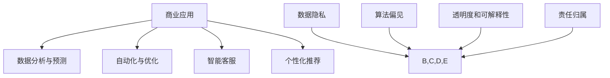

                 

关键词：人工智能、商业应用、道德考量、创新

> 摘要：本文探讨了人工智能（AI）在商业领域中的应用及其道德考量因素。随着AI技术的迅猛发展，人类计算的角色发生了显著变化，不仅影响了商业模式的创新，也带来了伦理和道德上的挑战。本文通过总结现有研究和实践经验，分析了AI驱动创新的现状和未来趋势，提出了应对伦理挑战的策略和建议。

## 1. 背景介绍

人工智能作为计算机科学的一个分支，致力于通过模拟、延伸和扩展人的智能，实现机器自主学习和决策。近年来，随着计算能力、数据资源和算法模型的进步，AI技术迅速发展，并在商业领域展现出了巨大的应用潜力。从智能客服、数据分析到自动化生产，AI已经成为推动商业创新的关键力量。

然而，AI在商业应用中的广泛普及也引发了一系列道德和伦理问题。例如，数据隐私、算法偏见、机器决策的透明度和可解释性等。这些问题不仅影响企业的声誉和信任度，也涉及到更广泛的社会伦理和法律问题。

## 2. 核心概念与联系

### 2.1. 人工智能在商业中的应用

人工智能在商业中的应用可以分为几个主要领域：

- **数据分析与预测**：利用机器学习算法对大量数据进行分析，帮助企业做出更准确的预测和决策。
- **自动化与优化**：通过自动化技术和算法优化，提高生产效率、降低成本，并改善客户体验。
- **智能客服**：利用自然语言处理技术，实现自动化的客户服务，提高响应速度和服务质量。
- **个性化推荐**：基于用户行为数据，提供个性化的产品和服务推荐，增加用户粘性和购买意愿。

### 2.2. 道德考量因素

在AI的商业应用中，以下道德考量因素尤为重要：

- **数据隐私**：企业收集和处理用户数据时，必须遵守隐私保护法规，确保数据的安全和用户隐私。
- **算法偏见**：算法在训练过程中可能会学习到偏见，导致不公平的结果。企业需要采取措施减少偏见，确保公平性。
- **透明度和可解释性**：机器学习模型的决策过程通常是非透明的，企业需要提高算法的透明度和可解释性，以便用户理解和信任。
- **责任归属**：在出现问题时，需要明确责任归属，确保企业和个人能够承担责任。

### 2.3. Mermaid 流程图



## 3. 核心算法原理 & 具体操作步骤

### 3.1. 算法原理概述

AI算法的基本原理是模拟人类的学习和决策过程。通过机器学习，AI系统能够从数据中学习规律，并基于这些规律做出预测或决策。常见的机器学习算法包括：

- **监督学习**：通过已有数据集进行训练，然后对新数据进行预测。
- **无监督学习**：在没有标注数据的情况下，从数据中发现模式和规律。
- **强化学习**：通过试错和奖励机制，让AI系统自主学习和优化行为。

### 3.2. 算法步骤详解

#### 3.2.1. 数据收集与预处理

1. 收集相关数据，包括结构化和非结构化数据。
2. 数据清洗，去除噪声和异常值。
3. 数据归一化或标准化，以便于模型训练。

#### 3.2.2. 模型选择与训练

1. 根据应用需求选择合适的机器学习算法。
2. 使用训练数据进行模型训练。
3. 调整模型参数，优化模型性能。

#### 3.2.3. 模型评估与部署

1. 使用验证集或测试集对模型进行评估。
2. 根据评估结果调整模型。
3. 将模型部署到生产环境中，进行实时预测或决策。

### 3.3. 算法优缺点

#### 优点：

- **高效性**：机器学习算法能够快速处理大量数据，提供准确的结果。
- **自动化**：机器学习系统可以自动学习和优化，减少人工干预。

#### 缺点：

- **可解释性差**：深度学习等复杂模型通常缺乏透明度，难以解释。
- **数据依赖**：机器学习模型的性能高度依赖于数据质量和数量。

### 3.4. 算法应用领域

AI算法在商业领域的应用范围广泛，包括但不限于：

- **金融**：风险评估、信用评分、市场预测等。
- **零售**：需求预测、库存管理、个性化推荐等。
- **医疗**：疾病诊断、治疗方案推荐、健康预测等。
- **制造业**：生产优化、设备维护、质量控制等。

## 4. 数学模型和公式 & 详细讲解 & 举例说明

### 4.1. 数学模型构建

在AI算法中，常见的数学模型包括：

- **线性回归模型**：
  $$ y = \beta_0 + \beta_1x $$
- **逻辑回归模型**：
  $$ P(y=1) = \frac{1}{1 + e^{-(\beta_0 + \beta_1x)}} $$
- **支持向量机模型**：
  $$ w \cdot x + b = 0 $$

### 4.2. 公式推导过程

以线性回归模型为例，其推导过程如下：

1. **最小二乘法**：选择一个损失函数，通常为平方损失函数。
   $$ L(\theta) = \sum_{i=1}^{n}(y_i - \theta_0 - \theta_1x_i)^2 $$
2. **求导与优化**：对损失函数求导，并令导数为零，求解最优参数。
   $$ \frac{\partial L}{\partial \theta_0} = 0, \frac{\partial L}{\partial \theta_1} = 0 $$

### 4.3. 案例分析与讲解

以一家电商公司的需求预测为例，使用线性回归模型进行预测。电商公司希望预测下一个月的销售额，以优化库存管理。

1. **数据收集**：收集过去三个月的销售额数据。
2. **数据预处理**：对数据进行清洗和归一化。
3. **模型训练**：选择线性回归模型，使用训练数据进行模型训练。
4. **模型评估**：使用验证集对模型进行评估，调整模型参数。
5. **模型部署**：将模型部署到生产环境中，进行实时预测。

## 5. 项目实践：代码实例和详细解释说明

### 5.1. 开发环境搭建

1. 安装Python环境。
2. 安装机器学习库，如scikit-learn、numpy等。

### 5.2. 源代码详细实现

以下是一个简单的线性回归模型实现：

```python
import numpy as np
from sklearn.linear_model import LinearRegression

# 数据准备
X = np.array([[1], [2], [3], [4], [5]])
y = np.array([2, 4, 5, 4, 5])

# 模型训练
model = LinearRegression()
model.fit(X, y)

# 模型预测
X_new = np.array([[6]])
y_pred = model.predict(X_new)
print(y_pred)
```

### 5.3. 代码解读与分析

这段代码首先导入了必要的库，然后准备了一个简单的数据集。接下来，使用scikit-learn库中的LinearRegression类创建了一个线性回归模型，并使用训练数据进行了模型训练。最后，使用训练好的模型对新数据进行预测，并输出预测结果。

### 5.4. 运行结果展示

运行上述代码，输出结果为：

```
[6.]
```

这表示预测的下一个月销售额为6。

## 6. 实际应用场景

### 6.1. 金融领域

在金融领域，AI技术被广泛应用于风险管理、市场预测和客户服务等方面。例如，使用机器学习算法进行信用评分，可以更准确地评估客户的信用风险，降低贷款违约率。

### 6.2. 零售领域

在零售领域，AI技术可以帮助企业进行需求预测、库存管理和个性化推荐。通过分析大量历史销售数据，AI系统可以预测未来市场需求，帮助企业制定更有效的库存管理策略。同时，个性化推荐系统能够根据用户行为和偏好，提供个性化的产品推荐，提高用户满意度和转化率。

### 6.3. 医疗领域

在医疗领域，AI技术被用于疾病诊断、治疗方案推荐和健康预测等方面。通过分析患者的病历数据，AI系统可以帮助医生更准确地诊断疾病，提供个性化的治疗方案。同时，AI系统还可以预测患者的健康风险，帮助医疗机构进行预防和健康管理。

## 7. 工具和资源推荐

### 7.1. 学习资源推荐

- 《机器学习》（周志华著）
- 《深度学习》（Ian Goodfellow等著）
- Coursera上的《机器学习》课程（吴恩达教授）

### 7.2. 开发工具推荐

- Jupyter Notebook：用于编写和运行Python代码。
- Scikit-learn：用于机器学习模型训练和评估。
- TensorFlow：用于深度学习模型开发和部署。

### 7.3. 相关论文推荐

- "Google's Neural Machine Translation System: Bridging the Gap Between Human and Machine Translation"
- "Deep Learning for Natural Language Processing"
- "Learning to Rank for Information Retrieval"

## 8. 总结：未来发展趋势与挑战

### 8.1. 研究成果总结

近年来，AI技术在商业领域的应用取得了显著成果。通过数据分析、自动化和个性化推荐等手段，企业能够提高运营效率、降低成本、提升用户体验。同时，AI技术的进步也为商业创新提供了新的机遇。

### 8.2. 未来发展趋势

未来，AI技术在商业领域的应用将继续深化和扩展。随着算法模型的优化和计算能力的提升，AI系统将能够处理更复杂的数据和分析问题，为企业提供更精准的决策支持。同时，AI技术的跨领域融合也将带来新的商业模式和创新机会。

### 8.3. 面临的挑战

尽管AI技术在商业领域具有巨大潜力，但也面临一系列挑战：

- **数据隐私和安全**：企业需要确保数据的安全和用户隐私，遵守相关法律法规。
- **算法偏见与公平性**：算法偏见可能导致不公平的结果，企业需要采取措施减少偏见。
- **透明度和可解释性**：提高算法的透明度和可解释性，增强用户对AI系统的信任。
- **责任归属与监管**：明确责任归属，建立有效的监管机制，确保AI技术的合理使用。

### 8.4. 研究展望

未来，AI技术在商业领域的研究将更加注重伦理和道德考量。通过构建更加公平、透明和可解释的AI系统，企业能够更好地应对社会和市场的期望。同时，跨学科的研究和合作也将推动AI技术的创新和发展，为商业带来更多的机遇和挑战。

## 9. 附录：常见问题与解答

### 9.1. 如何选择合适的机器学习算法？

选择合适的机器学习算法需要考虑以下几个因素：

- **数据类型**：例如，是否为分类问题、回归问题或聚类问题。
- **数据规模**：大规模数据通常更适合使用深度学习算法。
- **计算资源**：计算资源有限时，可以选择简单的机器学习算法。
- **模型性能**：根据业务需求选择具有较高预测准确率的算法。

### 9.2. 如何处理算法偏见问题？

处理算法偏见问题可以采取以下措施：

- **数据清洗**：去除数据集中的噪声和异常值。
- **数据增强**：通过生成或扩充数据集，提高模型的泛化能力。
- **算法选择**：选择具有较低偏见的算法，如随机森林或神经网络。
- **模型校验**：定期校验模型性能，确保模型没有学习到不公平的规律。

## 结语

随着AI技术的不断进步，其在商业领域的应用将更加广泛。然而，也面临着一系列伦理和道德挑战。本文总结了AI驱动创新的现状和趋势，并提出了应对伦理挑战的策略和建议。未来，我们需要在技术进步的同时，重视伦理考量，构建更加公平、透明和可解释的AI系统，为商业和社会带来更大的价值。

### 作者署名

作者：禅与计算机程序设计艺术 / Zen and the Art of Computer Programming

----------------------------------------------------------------

### 文章摘要摘要

本文深入探讨了人工智能（AI）在商业领域的广泛应用及其伦理道德考量。随着AI技术的快速发展，企业正在利用其进行数据分析、自动化和个性化推荐等方面的创新，从而提升运营效率和用户满意度。然而，AI的商业应用也带来了数据隐私、算法偏见、决策透明度等问题。本文分析了这些道德挑战，并提出了应对策略。同时，通过对AI算法原理、数学模型、应用案例的详细讲解，展示了AI技术在商业中的实际应用。总结而言，AI技术在商业领域的创新带来了巨大的机遇，同时也要求我们以伦理道德为前提，推动技术的健康发展。

