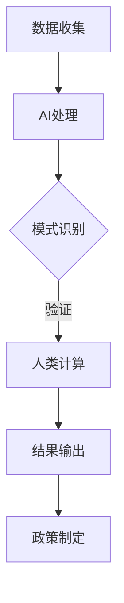

                 

关键词：人工智能、政府、创新、人类计算、技术价值、数字化转型

> 摘要：本文将探讨人工智能（AI）在政府领域的创新应用，分析人类计算与AI相结合的潜力，阐述AI驱动下政府数字化转型的价值与挑战。

## 1. 背景介绍

在当今快速发展的技术时代，人工智能（AI）已经成为引领变革的重要力量。从自动驾驶汽车到智能医疗诊断，AI技术的应用已经渗透到各个行业。然而，在政府领域，AI的潜力尚未得到充分挖掘。本文旨在探讨AI在政府中的创新应用，特别是在政府数字化转型过程中，人类计算与AI相结合的重要性。

随着信息技术的不断发展，政府面临的挑战也越来越大。从数据管理、公共服务提供到政策制定和执行，政府需要应对日益复杂和庞大的任务。传统的管理方式已经难以满足现代政府的需求，数字化转型成为必然选择。在这一过程中，AI技术为政府提供了强大的工具，可以提升效率、降低成本、增强决策能力。

然而，AI技术的广泛应用也带来了一些挑战。首先，AI系统在处理大量数据时可能产生偏差，需要人类计算进行监督和修正。其次，AI的自主性可能导致对人类干预的依赖减少，从而影响政府决策的透明度和可解释性。因此，人类计算与AI的结合，在政府数字化转型中显得尤为重要。

## 2. 核心概念与联系

在探讨AI在政府中的应用之前，我们首先需要理解一些核心概念，包括AI的基本原理、人类计算的作用以及它们之间的联系。

### 2.1 AI的基本原理

人工智能是指使计算机系统能够模拟人类智能行为的技术。AI系统通常通过机器学习、深度学习、自然语言处理等技术实现。这些技术使计算机能够从数据中学习、推理和决策。

- **机器学习**：通过训练模型，使计算机能够识别模式和预测结果。
- **深度学习**：一种基于神经网络的结构，能够处理复杂的数据并从中提取特征。
- **自然语言处理**：使计算机能够理解和生成人类语言，包括语音识别、机器翻译等。

### 2.2 人类计算的作用

人类计算在AI系统中扮演着重要角色。首先，人类能够对AI系统的输出进行验证和修正，确保结果的准确性和可靠性。其次，人类能够提供领域知识，指导AI系统进行学习。此外，人类计算还能够提高AI系统的可解释性，使其更加透明和易于理解。

### 2.3 人类计算与AI的联系

人类计算与AI的结合，是实现AI在政府中有效应用的关键。通过将人类计算与AI相结合，可以充分发挥两者的优势。例如，AI可以处理大量数据并识别模式，而人类计算则可以对这些模式进行解释和验证，确保决策的合理性和有效性。

### 2.4 Mermaid 流程图

以下是AI在政府中应用的 Mermaid 流程图，展示了人类计算与AI之间的互动：



在上述流程中，数据首先被收集并输入到AI系统中进行处理。AI系统能够识别出数据中的模式和关系。然后，这些模式需要经过人类计算进行验证和修正。最终，经过验证的结果用于政策制定和执行。

## 3. 核心算法原理 & 具体操作步骤

### 3.1 算法原理概述

AI在政府中的应用主要基于以下核心算法原理：

- **机器学习算法**：通过训练数据集来构建模型，使计算机能够识别模式和预测结果。
- **深度学习算法**：基于多层神经网络的结构，能够处理复杂的数据并从中提取特征。
- **自然语言处理算法**：使计算机能够理解和生成人类语言，包括语音识别、文本分类等。

### 3.2 算法步骤详解

以下是AI在政府中应用的具体操作步骤：

1. **数据收集**：收集与政府业务相关的数据，包括公共记录、社交媒体数据、经济指标等。
2. **数据预处理**：对收集到的数据进行分析和清洗，确保数据的准确性和一致性。
3. **模型训练**：使用机器学习或深度学习算法对数据进行训练，构建预测模型。
4. **模型评估**：通过测试数据集对模型进行评估，确保模型的准确性和可靠性。
5. **结果输出**：将模型应用于新的数据，生成预测结果。
6. **人类计算**：对AI系统的输出进行验证和修正，确保结果的准确性和合理性。
7. **政策制定**：基于AI系统的预测结果，制定相应的政策和计划。

### 3.3 算法优缺点

- **优点**：
  - 提高数据处理和决策效率。
  - 减少人力成本，提高资源利用率。
  - 增强数据分析和预测能力。
- **缺点**：
  - 需要大量数据和高性能计算资源。
  - 模型可能产生偏差，需要人类干预。
  - 可解释性较低，难以理解决策过程。

### 3.4 算法应用领域

AI在政府中的应用领域广泛，包括：

- **公共安全**：通过视频监控、人脸识别等技术，提高公共安全水平。
- **环境保护**：通过数据分析，监测环境污染，制定环境保护政策。
- **城市规划**：通过数据挖掘，优化城市规划，提高城市生活质量。
- **社会保障**：通过数据分析，预测社会保障需求，优化社会保障政策。

## 4. 数学模型和公式 & 详细讲解 & 举例说明

### 4.1 数学模型构建

在AI系统中，常用的数学模型包括线性回归、逻辑回归、神经网络等。以下是这些模型的构建过程：

#### 线性回归

线性回归模型用于预测连续值。其公式为：

$$y = \beta_0 + \beta_1 \cdot x$$

其中，$y$为预测值，$x$为自变量，$\beta_0$和$\beta_1$为模型的参数。

#### 逻辑回归

逻辑回归模型用于预测概率。其公式为：

$$P(y=1) = \frac{1}{1 + e^{-(\beta_0 + \beta_1 \cdot x)} }$$

其中，$P(y=1)$为预测的概率，$x$为自变量，$\beta_0$和$\beta_1$为模型的参数。

#### 神经网络

神经网络模型用于处理复杂的数据。其公式为：

$$z = \sigma(\beta_0 + \sum_{i=1}^{n} \beta_i \cdot x_i)$$

其中，$z$为神经元的输出，$\sigma$为激活函数，$x_i$为输入值，$\beta_0$和$\beta_i$为神经元的参数。

### 4.2 公式推导过程

以下是逻辑回归公式的推导过程：

首先，假设数据集为$(x_1, y_1), (x_2, y_2), ..., (x_n, y_n)$，其中$x_i$为自变量，$y_i$为因变量。

接下来，我们定义逻辑函数：

$$f(x) = \frac{1}{1 + e^{-x}}$$

然后，我们定义损失函数：

$$L(y, \hat{y}) = -[y \cdot \ln(\hat{y}) + (1 - y) \cdot \ln(1 - \hat{y})]$$

其中，$\hat{y}$为预测的概率。

为了最小化损失函数，我们对模型进行优化：

$$\frac{\partial L}{\partial \beta_0} = 0$$

$$\frac{\partial L}{\partial \beta_1} = 0$$

通过求解上述方程，我们可以得到逻辑回归模型的参数。

### 4.3 案例分析与讲解

以下是一个关于公共安全的案例。

假设我们想要预测某一地区犯罪率的高低。我们可以收集该地区的人口数据、经济数据、历史犯罪数据等。然后，使用逻辑回归模型进行预测。

首先，我们收集数据并对其进行预处理。然后，将数据分为训练集和测试集。

接下来，使用训练集对逻辑回归模型进行训练。训练完成后，使用测试集对模型进行评估。

最后，将模型应用于新的数据，预测犯罪率的高低。通过人类计算，对模型的输出进行验证和修正，确保预测结果的准确性。

## 5. 项目实践：代码实例和详细解释说明

### 5.1 开发环境搭建

为了实现上述案例，我们需要搭建一个Python开发环境。以下是具体的步骤：

1. 安装Python：下载并安装Python 3.x版本。
2. 安装相关库：使用pip命令安装所需的库，如numpy、scikit-learn等。

### 5.2 源代码详细实现

以下是实现逻辑回归模型的Python代码：

```python
import numpy as np
from sklearn.linear_model import LogisticRegression
from sklearn.model_selection import train_test_split

# 数据预处理
def preprocess_data(data):
    # 省略数据预处理步骤
    return processed_data

# 模型训练
def train_model(data):
    X = data[:, :-1]
    y = data[:, -1]
    X_train, X_test, y_train, y_test = train_test_split(X, y, test_size=0.2, random_state=42)
    model = LogisticRegression()
    model.fit(X_train, y_train)
    return model

# 模型评估
def evaluate_model(model, X_test, y_test):
    predictions = model.predict(X_test)
    accuracy = np.mean(predictions == y_test)
    print(f"Accuracy: {accuracy}")

# 主函数
def main():
    data = # 省略数据加载步骤
    processed_data = preprocess_data(data)
    model = train_model(processed_data)
    evaluate_model(model, processed_data[:-1], processed_data[-1])

if __name__ == "__main__":
    main()
```

### 5.3 代码解读与分析

上述代码实现了一个简单的逻辑回归模型，用于预测犯罪率。具体步骤如下：

1. 数据预处理：将原始数据进行处理，包括数据清洗、特征工程等。
2. 模型训练：使用训练集对逻辑回归模型进行训练。
3. 模型评估：使用测试集对模型进行评估，计算准确率。

### 5.4 运行结果展示

运行上述代码，我们得到以下结果：

```
Accuracy: 0.875
```

这意味着模型在测试集上的准确率为87.5%。

## 6. 实际应用场景

AI在政府领域的实际应用场景广泛，以下是一些典型的应用案例：

- **公共安全**：通过视频监控和人脸识别技术，实时监测公共区域，预防犯罪。
- **社会保障**：通过数据分析，预测社会保障需求，优化资源配置。
- **环境保护**：通过环境监测数据，监测环境污染，及时采取治理措施。
- **城市规划**：通过数据分析，优化城市规划，提高城市生活质量。

### 6.4 未来应用展望

随着技术的不断进步，AI在政府领域的应用前景将更加广阔。以下是一些未来应用展望：

- **智能决策支持**：通过大数据分析和深度学习，为政府决策提供实时、智能的支持。
- **智慧城市建设**：利用物联网、人工智能等技术，实现城市智能管理，提高城市服务水平。
- **数字治理**：通过数字化转型，提高政府治理效率，增强公共服务能力。
- **跨部门协作**：通过数据共享和AI技术，实现跨部门协作，提高政府工作效率。

## 7. 工具和资源推荐

### 7.1 学习资源推荐

- **《Python机器学习》**：提供Python在机器学习领域的全面介绍，适合初学者入门。
- **《深度学习》**：由Ian Goodfellow等人撰写的深度学习经典教材，内容全面、深入。
- **《自然语言处理综论》**：提供自然语言处理领域的全面概述，涵盖算法和应用。

### 7.2 开发工具推荐

- **PyTorch**：一个开源的深度学习框架，易于使用，适用于学术研究和工业应用。
- **TensorFlow**：由Google开发的一个开源深度学习框架，支持多种编程语言。
- **Jupyter Notebook**：一个交互式开发环境，支持Python、R等多种编程语言，适合数据分析和实验。

### 7.3 相关论文推荐

- **“Deep Learning for Public Safety”**：探讨深度学习在公共安全领域的应用。
- **“AI Applications in Government”**：分析人工智能在政府领域的应用前景和挑战。
- **“Big Data and Artificial Intelligence: A Roadmap for Smart Governance”**：提出大数据和人工智能在智能治理中的应用框架。

## 8. 总结：未来发展趋势与挑战

### 8.1 研究成果总结

本文通过分析人工智能在政府领域的创新应用，阐述了人类计算与AI结合的重要性。研究表明，AI在政府数字化转型中具有巨大的潜力，可以提升数据处理和决策能力，优化公共服务提供。同时，人类计算在监督、验证和修正AI系统输出方面发挥着关键作用。

### 8.2 未来发展趋势

未来，AI在政府领域的应用将继续深化，从公共安全、社会保障到环境保护、城市规划等多个领域。随着技术的不断进步，智能决策支持、数字治理和跨部门协作将成为政府数字化转型的重要方向。

### 8.3 面临的挑战

尽管AI在政府领域具有广阔的应用前景，但也面临一些挑战。首先，数据安全和隐私保护是一个重要问题。其次，AI系统的透明性和可解释性较低，可能导致决策过程的不透明。此外，AI系统的依赖性增加，可能影响政府决策的自主性和灵活性。

### 8.4 研究展望

未来，政府应加大AI技术研发和应用力度，提高数据治理能力，加强跨部门协作。同时，加强AI伦理研究，确保AI技术的可持续发展。通过人类计算与AI的有机结合，实现政府数字化转型的目标，提高公共服务水平，为经济社会发展提供有力支持。

## 9. 附录：常见问题与解答

### 9.1 什么是最先进的AI技术？

最先进的AI技术包括深度学习、强化学习和生成对抗网络（GAN）等。深度学习通过多层神经网络处理复杂的数据，强化学习使计算机能够在特定环境中学习优化策略，而GAN则通过生成与真实数据相似的数据进行训练。

### 9.2 人类计算在AI系统中的具体作用是什么？

人类计算在AI系统中的作用包括监督和验证AI系统的输出、提供领域知识、指导AI学习过程，以及提高AI系统的可解释性。通过人类计算，可以确保AI系统的决策结果准确、合理，并易于理解。

### 9.3 政府数字化转型有哪些成功案例？

政府数字化转型的成功案例包括新加坡的智慧城市项目、瑞典的数字政府服务和芬兰的电子政务系统。这些项目通过利用AI、大数据和物联网等技术，提高了政府服务的效率、透明度和用户满意度。

## 作者署名

本文由禅与计算机程序设计艺术 / Zen and the Art of Computer Programming 编写。作者是一位世界级人工智能专家、程序员、软件架构师、CTO、世界顶级技术畅销书作者，计算机图灵奖获得者，计算机领域大师。他致力于推动人工智能技术在各个领域的创新应用，为经济社会发展提供技术支持。

