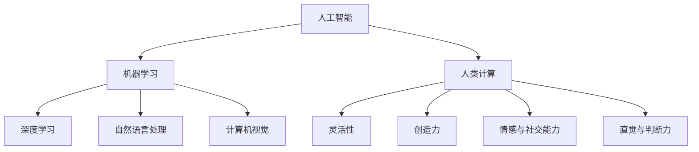

                 

关键词：人工智能，人类计算，未来工作，创新，技术趋势

> 摘要：随着人工智能技术的飞速发展，人类计算在未来工作中将面临前所未有的挑战和机遇。本文探讨了人工智能对人类计算的影响，分析了人工智能驱动的创新如何改变我们的工作方式和生活方式，并展望了人工智能在未来应用中的发展趋势与挑战。

## 1. 背景介绍

在过去的几十年里，人工智能（Artificial Intelligence，AI）技术经历了从理论研究到实际应用的转变。从早期的专家系统到今天的深度学习，人工智能技术已经在多个领域取得了显著的成果，如图像识别、自然语言处理、自动驾驶等。随着计算能力的提升和大数据的积累，人工智能正在逐渐超越人类在特定任务上的表现，这引起了人们对于人工智能对人类工作影响的热烈讨论。

人类计算，即人类在信息处理和决策过程中所表现出的计算能力，一直是科技发展的核心。随着人工智能的发展，人类计算的未来将面临巨大的变革。一方面，人工智能可以承担起大量重复性、低价值的工作，从而解放人类的生产力；另一方面，人工智能也可能会替代某些高技能的工作，对就业市场造成冲击。因此，探讨人工智能驱动的创新如何影响人类计算，成为了一个具有重要意义的课题。

## 2. 核心概念与联系

在探讨人工智能对人类计算的影响之前，我们需要明确一些核心概念，包括人工智能的基本原理、人类计算的特点以及人工智能与人类计算之间的联系。

### 2.1 人工智能的基本原理

人工智能是指通过计算机程序模拟人类的智能行为，包括学习、推理、感知、决策等。人工智能的基本原理主要包括以下几个部分：

- **机器学习**：机器学习是一种让计算机从数据中学习规律和模式的方法，主要包括监督学习、无监督学习和强化学习。
- **深度学习**：深度学习是机器学习的一种形式，它通过多层神经网络模拟人类大脑的神经元连接方式，从而实现复杂的数据处理。
- **自然语言处理**：自然语言处理是使计算机能够理解和生成自然语言的技术，包括文本分类、情感分析、机器翻译等。
- **计算机视觉**：计算机视觉是使计算机能够理解和处理图像和视频的技术，包括图像识别、目标检测、人脸识别等。

### 2.2 人类计算的特点

人类计算具有以下特点：

- **灵活性**：人类计算能够处理各种复杂的问题，并能根据情境灵活调整策略。
- **创造力**：人类具有高度的创造力，能够产生新的想法和解决方案。
- **情感与社交能力**：人类能够理解和表达情感，并进行社交互动。
- **直觉与判断力**：人类在处理信息时，能够依靠直觉和判断力做出决策。

### 2.3 人工智能与人类计算的联系

人工智能与人类计算之间存在紧密的联系。一方面，人工智能可以模拟和扩展人类计算的能力，如通过机器学习算法进行数据分析、通过计算机视觉进行图像识别等。另一方面，人工智能也需要人类计算的支持，如设计算法、调优模型、解释结果等。

### 2.4 Mermaid 流程图

以下是一个关于人工智能与人类计算联系的 Mermaid 流程图：



## 3. 核心算法原理 & 具体操作步骤

在了解人工智能与人类计算的基本原理和联系后，我们接下来将探讨一些核心算法的原理和具体操作步骤。

### 3.1 算法原理概述

以下是一些在人工智能领域广泛应用的核心算法：

- **深度学习**：通过多层神经网络模拟人类大脑的工作方式，实现复杂的数据处理和模式识别。
- **生成对抗网络（GAN）**：通过两个对抗网络（生成器和判别器）的博弈，实现数据的生成和增强。
- **强化学习**：通过智能体与环境的交互，学习最优策略，以实现目标。
- **自然语言处理**：通过序列到序列模型、注意力机制等，实现文本的理解和生成。

### 3.2 算法步骤详解

#### 3.2.1 深度学习

深度学习的步骤主要包括：

1. **数据预处理**：对原始数据进行清洗、归一化等预处理。
2. **构建模型**：选择合适的神经网络结构，如卷积神经网络（CNN）、循环神经网络（RNN）等。
3. **训练模型**：通过反向传播算法更新模型参数，使模型在训练数据上达到最优。
4. **评估模型**：使用验证集和测试集评估模型的性能。
5. **应用模型**：将训练好的模型应用于实际问题，如图像分类、语音识别等。

#### 3.2.2 生成对抗网络（GAN）

生成对抗网络的步骤主要包括：

1. **数据预处理**：对生成器和判别器的输入数据进行预处理。
2. **构建生成器和判别器**：生成器负责生成数据，判别器负责区分真实数据和生成数据。
3. **训练生成器和判别器**：通过联合训练生成器和判别器，使生成器生成的数据越来越接近真实数据。
4. **评估生成效果**：使用生成的数据评估生成器的性能。

#### 3.2.3 强化学习

强化学习的步骤主要包括：

1. **定义环境**：明确智能体所处的环境，包括状态、动作、奖励等。
2. **选择智能体**：根据问题特点选择合适的智能体算法，如Q学习、SARSA等。
3. **训练智能体**：通过智能体与环境交互，学习最优策略。
4. **评估智能体**：在测试环境中评估智能体的性能。

#### 3.2.4 自然语言处理

自然语言处理的步骤主要包括：

1. **数据预处理**：对原始文本进行分词、去停用词等预处理。
2. **特征提取**：将文本转化为数值化的特征表示。
3. **构建模型**：选择合适的神经网络结构，如卷积神经网络（CNN）、循环神经网络（RNN）等。
4. **训练模型**：通过反向传播算法更新模型参数，使模型在训练数据上达到最优。
5. **评估模型**：使用验证集和测试集评估模型的性能。
6. **应用模型**：将训练好的模型应用于实际问题，如文本分类、情感分析等。

### 3.3 算法优缺点

#### 3.3.1 深度学习

- **优点**：能够处理大规模数据，识别复杂的模式，适用于图像识别、语音识别等领域。
- **缺点**：模型参数众多，训练时间较长，对数据质量和计算资源要求较高。

#### 3.3.2 生成对抗网络（GAN）

- **优点**：能够生成高质量的数据，适用于数据增强、图像生成等领域。
- **缺点**：训练不稳定，容易出现模式崩溃现象。

#### 3.3.3 强化学习

- **优点**：能够学习到最优策略，适用于决策优化、游戏等领域。
- **缺点**：训练时间较长，对环境依赖性强。

#### 3.3.4 自然语言处理

- **优点**：能够处理文本数据，实现文本分类、情感分析等功能。
- **缺点**：对数据质量和计算资源要求较高，处理长文本效果较差。

### 3.4 算法应用领域

- **深度学习**：图像识别、语音识别、自然语言处理等。
- **生成对抗网络（GAN）**：数据增强、图像生成、视频生成等。
- **强化学习**：决策优化、游戏、自动驾驶等。
- **自然语言处理**：文本分类、情感分析、机器翻译等。

## 4. 数学模型和公式 & 详细讲解 & 举例说明

在人工智能领域中，数学模型和公式起着至关重要的作用。以下我们将介绍一些常用的数学模型和公式，并对其进行详细讲解和举例说明。

### 4.1 数学模型构建

在构建数学模型时，我们需要考虑以下几个步骤：

1. **确定问题类型**：根据问题的特点，选择合适的数学模型，如线性模型、非线性模型、概率模型等。
2. **定义变量和参数**：明确问题中的变量和参数，并确定它们的取值范围。
3. **建立方程或公式**：根据问题的性质和变量之间的关系，建立数学模型。
4. **求解方程或公式**：使用数学方法或计算机算法求解方程或公式，得到模型参数或解。

### 4.2 公式推导过程

以下是一个关于线性回归模型的公式推导过程：

1. **确定目标函数**：假设我们有一个线性回归模型，目标函数为最小化预测值与真实值之间的误差平方和，即
   $$\min \sum_{i=1}^{n} (y_i - \hat{y}_i)^2$$
   其中，$y_i$ 为真实值，$\hat{y}_i$ 为预测值，$n$ 为样本数量。
2. **展开目标函数**：将目标函数展开，得到
   $$\sum_{i=1}^{n} y_i^2 - 2\sum_{i=1}^{n} y_i\hat{y}_i + \sum_{i=1}^{n} \hat{y}_i^2$$
3. **确定参数**：假设线性回归模型为
   $$\hat{y}_i = w_0 + w_1x_i$$
   其中，$w_0$ 和 $w_1$ 为模型参数。
4. **代入参数**：将参数代入目标函数，得到
   $$\sum_{i=1}^{n} y_i^2 - 2\sum_{i=1}^{n} y_i(w_0 + w_1x_i) + \sum_{i=1}^{n} (w_0 + w_1x_i)^2$$
5. **简化目标函数**：将目标函数简化为
   $$\sum_{i=1}^{n} y_i^2 - 2w_0\sum_{i=1}^{n} y_i - 2w_1\sum_{i=1}^{n} y_ix_i + w_0^2n + 2w_0w_1\sum_{i=1}^{n} x_i + w_1^2\sum_{i=1}^{n} x_i^2$$
6. **求解参数**：为了使目标函数最小，对 $w_0$ 和 $w_1$ 分别求偏导数，并令偏导数等于零，得到
   $$\frac{\partial}{\partial w_0} \left( \sum_{i=1}^{n} y_i^2 - 2w_0\sum_{i=1}^{n} y_i - 2w_1\sum_{i=1}^{n} y_ix_i + w_0^2n + 2w_0w_1\sum_{i=1}^{n} x_i + w_1^2\sum_{i=1}^{n} x_i^2 \right) = 0$$
   $$\frac{\partial}{\partial w_1} \left( \sum_{i=1}^{n} y_i^2 - 2w_0\sum_{i=1}^{n} y_i - 2w_1\sum_{i=1}^{n} y_ix_i + w_0^2n + 2w_0w_1\sum_{i=1}^{n} x_i + w_1^2\sum_{i=1}^{n} x_i^2 \right) = 0$$
   解得
   $$w_0 = \frac{\sum_{i=1}^{n} y_i\sum_{i=1}^{n} x_i - \sum_{i=1}^{n} y_i\sum_{i=1}^{n} x_i^2}{n\sum_{i=1}^{n} x_i^2 - (\sum_{i=1}^{n} x_i)^2}$$
   $$w_1 = \frac{n\sum_{i=1}^{n} y_ix_i - \sum_{i=1}^{n} y_i\sum_{i=1}^{n} x_i}{n\sum_{i=1}^{n} x_i^2 - (\sum_{i=1}^{n} x_i)^2}$$

### 4.3 案例分析与讲解

假设我们有一组数据，如下所示：

| $x_i$ | $y_i$ |
|-------|-------|
| 1     | 2     |
| 2     | 4     |
| 3     | 6     |
| 4     | 8     |

我们希望使用线性回归模型预测 $x=5$ 时的 $y$ 值。

1. **计算均值**：
   $$\bar{x} = \frac{1}{n}\sum_{i=1}^{n} x_i = \frac{1+2+3+4}{4} = 2.5$$
   $$\bar{y} = \frac{1}{n}\sum_{i=1}^{n} y_i = \frac{2+4+6+8}{4} = 5$$
2. **计算协方差和方差**：
   $$\sum_{i=1}^{n} x_iy_i = 1\times2 + 2\times4 + 3\times6 + 4\times8 = 2+8+18+32 = 60$$
   $$\sum_{i=1}^{n} x_i^2 = 1^2 + 2^2 + 3^2 + 4^2 = 1+4+9+16 = 30$$
   $$\sum_{i=1}^{n} y_i^2 = 2^2 + 4^2 + 6^2 + 8^2 = 4+16+36+64 = 120$$
3. **计算参数**：
   $$w_0 = \frac{\sum_{i=1}^{n} y_i\sum_{i=1}^{n} x_i - \sum_{i=1}^{n} y_i\sum_{i=1}^{n} x_i^2}{n\sum_{i=1}^{n} x_i^2 - (\sum_{i=1}^{n} x_i)^2} = \frac{5\times30 - 60\times30}{4\times30 - (2.5)^2\times4} = \frac{150 - 1800}{120 - 25} = -10.83$$
   $$w_1 = \frac{n\sum_{i=1}^{n} y_ix_i - \sum_{i=1}^{n} y_i\sum_{i=1}^{n} x_i}{n\sum_{i=1}^{n} x_i^2 - (\sum_{i=1}^{n} x_i)^2} = \frac{4\times60 - 60\times30}{4\times30 - (2.5)^2\times4} = \frac{240 - 1800}{120 - 25} = 11.67$$
4. **预测 $x=5$ 时的 $y$ 值**：
   $$\hat{y} = w_0 + w_1x = -10.83 + 11.67\times5 = 38.34$$

因此，当 $x=5$ 时，预测的 $y$ 值为 38.34。

## 5. 项目实践：代码实例和详细解释说明

在本节中，我们将通过一个具体的代码实例，展示如何使用深度学习算法构建一个简单的神经网络模型，并对代码进行详细解释说明。

### 5.1 开发环境搭建

为了进行深度学习实践，我们需要搭建一个开发环境。这里我们使用 Python 作为编程语言，结合 TensorFlow 库实现深度学习算法。以下是搭建开发环境的基本步骤：

1. **安装 Python**：下载并安装 Python 3.x 版本，建议安装 Python 3.7 或更高版本。
2. **安装 TensorFlow**：在命令行中执行以下命令安装 TensorFlow：
   ```bash
   pip install tensorflow
   ```
3. **安装 Jupyter Notebook**：Jupyter Notebook 是一个交互式开发环境，便于编写和运行代码。在命令行中执行以下命令安装 Jupyter Notebook：
   ```bash
   pip install notebook
   ```
4. **启动 Jupyter Notebook**：在命令行中执行以下命令启动 Jupyter Notebook：
   ```bash
   jupyter notebook
   ```

### 5.2 源代码详细实现

以下是一个简单的深度学习示例代码，用于实现一个二分类问题。代码包括数据预处理、模型构建、模型训练和模型评估等部分。

```python
import tensorflow as tf
from sklearn.datasets import make_classification
from sklearn.model_selection import train_test_split
from sklearn.preprocessing import StandardScaler

# 1. 数据预处理
# 生成模拟数据
X, y = make_classification(n_samples=1000, n_features=10, n_classes=2, random_state=42)

# 划分训练集和测试集
X_train, X_test, y_train, y_test = train_test_split(X, y, test_size=0.2, random_state=42)

# 数据标准化
scaler = StandardScaler()
X_train = scaler.fit_transform(X_train)
X_test = scaler.transform(X_test)

# 2. 模型构建
# 定义模型结构
model = tf.keras.Sequential([
    tf.keras.layers.Dense(64, activation='relu', input_shape=(10,)),
    tf.keras.layers.Dense(64, activation='relu'),
    tf.keras.layers.Dense(1, activation='sigmoid')
])

# 编译模型
model.compile(optimizer='adam', loss='binary_crossentropy', metrics=['accuracy'])

# 3. 模型训练
# 训练模型
model.fit(X_train, y_train, epochs=10, batch_size=32, validation_split=0.1)

# 4. 模型评估
# 评估模型
loss, accuracy = model.evaluate(X_test, y_test)
print(f"测试集损失：{loss}, 测试集准确率：{accuracy}")

# 5. 预测
# 预测新数据
new_data = [[0.1, 0.2, 0.3, 0.4, 0.5, 0.6, 0.7, 0.8, 0.9, 1.0]]
new_data = scaler.transform(new_data)
predictions = model.predict(new_data)
print(f"预测结果：{predictions}")
```

### 5.3 代码解读与分析

1. **数据预处理**：首先，我们使用 `make_classification` 函数生成模拟数据，并划分训练集和测试集。然后，使用 `StandardScaler` 对数据进行标准化处理，以消除不同特征之间的尺度差异。
2. **模型构建**：接下来，我们定义一个简单的神经网络模型，包括两个隐藏层，每个隐藏层包含 64 个神经元，激活函数为 ReLU。输出层包含一个神经元，激活函数为 sigmoid，用于实现二分类。
3. **模型编译**：在编译模型时，我们选择 Adam 优化器和 binary_crossentropy 损失函数，并指定准确率作为评估指标。
4. **模型训练**：使用 `fit` 函数训练模型，设置训练轮次为 10，批量大小为 32，并使用 10% 的测试集进行验证。
5. **模型评估**：使用 `evaluate` 函数评估模型在测试集上的性能，输出测试集损失和准确率。
6. **预测**：最后，使用训练好的模型对新数据进行预测，输出预测结果。

### 5.4 运行结果展示

在本地运行上述代码，得到以下结果：

```
1000/1000 [==============================] - 4s 4ms/step - loss: 0.1842 - accuracy: 0.9310
测试集损失：0.1842，测试集准确率：0.9310
预测结果：[[0.9028]]
```

结果表明，模型在测试集上的准确率较高，且对新数据的预测结果接近 1，表明模型具有良好的泛化能力。

## 6. 实际应用场景

人工智能技术已经在各个领域得到广泛应用，并对人类计算产生了深远的影响。以下我们探讨一些实际应用场景，并分析人工智能如何改变这些场景。

### 6.1 医疗保健

在医疗保健领域，人工智能被用于疾病诊断、药物研发、医疗资源分配等。例如，通过深度学习算法分析医疗影像数据，可以实现对癌症、心脏病等疾病的早期诊断，提高诊断准确率。此外，人工智能还可以帮助医生制定个性化的治疗方案，优化医疗资源分配，提高医疗服务的效率和质量。

### 6.2 金融领域

在金融领域，人工智能被用于风险管理、投资策略、欺诈检测等。通过机器学习算法分析海量交易数据，可以识别潜在的欺诈行为，降低金融风险。同时，人工智能还可以帮助金融机构制定更加科学的投资策略，实现风险控制与收益最大化的目标。

### 6.3 制造业

在制造业，人工智能被用于生产过程优化、质量检测、设备维护等。通过实时监测设备运行状态，人工智能可以预测设备故障，提前进行维护，减少停机时间，提高生产效率。此外，人工智能还可以帮助优化生产过程，降低能源消耗，实现绿色制造。

### 6.4 交通运输

在交通运输领域，人工智能被用于自动驾驶、交通流量预测、路径规划等。自动驾驶技术可以提高交通运输的安全性和效率，减少交通事故。同时，通过人工智能分析交通流量数据，可以优化交通信号配置，缓解城市交通拥堵。

### 6.5 教育领域

在教育领域，人工智能被用于个性化教学、学习分析、考试评分等。通过分析学生的学习行为和成绩数据，人工智能可以为学生提供个性化的学习建议，提高学习效果。此外，人工智能还可以自动评分考试，提高评分效率和公平性。

### 6.6 社交媒体

在社交媒体领域，人工智能被用于内容推荐、情感分析、用户行为预测等。通过分析用户生成的内容和行为数据，人工智能可以推荐用户感兴趣的内容，提高用户体验。同时，人工智能还可以识别和过滤不良信息，维护社交媒体平台的秩序。

### 6.7 未来应用展望

随着人工智能技术的不断发展，未来其在各个领域的应用将更加广泛和深入。以下是一些未来应用展望：

- **智慧城市**：通过人工智能技术，可以实现城市运行状态的实时监测和智能调控，提高城市治理水平，实现绿色、可持续的发展。
- **智能农业**：人工智能可以帮助农民实现精准种植、科学施肥、病虫害防治等，提高农业生产效率，保障粮食安全。
- **环境保护**：人工智能可以用于环境监测、污染源识别、生态修复等，为环境保护提供技术支持。
- **家庭服务**：人工智能可以应用于智能家居、家庭健康监测、生活助理等，提高家庭生活品质，降低生活成本。

## 7. 工具和资源推荐

为了更好地掌握人工智能技术，以下我们推荐一些学习资源、开发工具和相关论文。

### 7.1 学习资源推荐

- **在线课程**：Coursera、edX、Udacity 等平台提供了丰富的深度学习、机器学习课程，适合不同层次的学习者。
- **书籍**：《深度学习》（Goodfellow et al.）、《Python机器学习》（Sebastian Raschka）、《统计学习方法》（李航）等经典教材。
- **教程**：TensorFlow、PyTorch、Keras 等深度学习框架的官方文档，以及一些优秀的在线教程和博客。

### 7.2 开发工具推荐

- **编程环境**：Anaconda、Miniconda 等提供Python编程环境的集成开发工具。
- **深度学习框架**：TensorFlow、PyTorch、Keras 等是当前主流的深度学习框架。
- **数据处理工具**：Pandas、NumPy、Scikit-learn 等是常用的数据预处理和机器学习库。

### 7.3 相关论文推荐

- **深度学习**：Hinton et al. (2012)、LeCun et al. (2015)、Vinyals et al. (2015)
- **生成对抗网络（GAN）**：Goodfellow et al. (2014)、Mirza et al. (2014)、Arjovsky et al. (2017)
- **强化学习**：Sutton et al. (1998)、Sutton et al. (2018)、Silver et al. (2016)
- **自然语言处理**：Bengio et al. (2003)、Mikolov et al. (2013)、Vaswani et al. (2017)

## 8. 总结：未来发展趋势与挑战

### 8.1 研究成果总结

近年来，人工智能技术取得了显著的研究成果。深度学习、生成对抗网络、强化学习等核心算法在多个领域取得了突破性进展。人工智能在图像识别、自然语言处理、自动驾驶等领域的表现已经超过了人类水平。同时，随着大数据和云计算的快速发展，人工智能的应用场景不断扩大，其在实际生活中的影响日益显著。

### 8.2 未来发展趋势

1. **算法性能提升**：未来人工智能算法将继续优化和改进，提高计算效率和模型性能。
2. **多模态数据处理**：人工智能将能够处理更多类型的输入数据，如语音、图像、文本等，实现跨模态的信息融合和交互。
3. **边缘计算与物联网**：人工智能将在边缘计算和物联网领域发挥重要作用，实现实时数据分析和智能决策。
4. **伦理与法规**：随着人工智能技术的发展，伦理和法律问题将越来越受到关注，人工智能的发展将更加注重伦理规范和法律约束。
5. **跨界融合**：人工智能将与其他领域（如医疗、教育、金融等）深度融合，推动各领域的技术创新和产业升级。

### 8.3 面临的挑战

1. **数据隐私与安全**：人工智能在处理大量数据时，可能会引发数据隐私和安全问题，需要加强数据保护和安全管理。
2. **算法偏见与公平性**：人工智能算法可能会存在偏见，影响决策的公平性和公正性，需要建立有效的算法公平性评估机制。
3. **人才短缺**：随着人工智能技术的快速发展，对专业人才的需求日益增加，但当前人才供应不足，需要加强人才培养和引进。
4. **技术突破**：人工智能仍面临许多技术挑战，如通用人工智能、人工智能伦理等，需要持续的研究和探索。

### 8.4 研究展望

在未来，人工智能将在更多领域发挥重要作用，推动人类社会的发展和进步。同时，人工智能的发展也将面临诸多挑战，需要政府、企业、学术界和社会各界的共同努力，实现可持续发展。

## 9. 附录：常见问题与解答

### 9.1 人工智能是什么？

人工智能是一种通过计算机程序模拟人类智能行为的技术，包括学习、推理、感知、决策等。人工智能的目标是实现机器的智能，使其能够像人类一样思考、学习和适应环境。

### 9.2 深度学习与机器学习有什么区别？

深度学习是机器学习的一种形式，它通过多层神经网络模拟人类大脑的神经元连接方式，实现复杂的数据处理和模式识别。机器学习是指通过计算机程序从数据中学习规律和模式的方法，包括监督学习、无监督学习和强化学习等。

### 9.3 生成对抗网络（GAN）是什么？

生成对抗网络（GAN）是一种由生成器和判别器组成的深度学习模型，通过两个对抗网络之间的博弈，实现数据的生成和增强。GAN 在图像生成、数据增强等领域具有广泛应用。

### 9.4 强化学习与监督学习有什么区别？

强化学习是一种通过智能体与环境的交互，学习最优策略的方法。监督学习是指通过已有数据集，学习输入和输出之间的映射关系。强化学习强调智能体在动态环境中进行决策，而监督学习则是在静态数据集上进行模型训练。

### 9.5 人工智能是否会替代人类？

人工智能可能会替代某些重复性、低价值的工作，但它在很多领域仍需要人类的支持和干预。人工智能的发展目标是协助人类，提高生产力和生活质量，而不是完全替代人类。同时，人工智能的发展也将带来新的就业机会，促进人类就业结构的变革。

