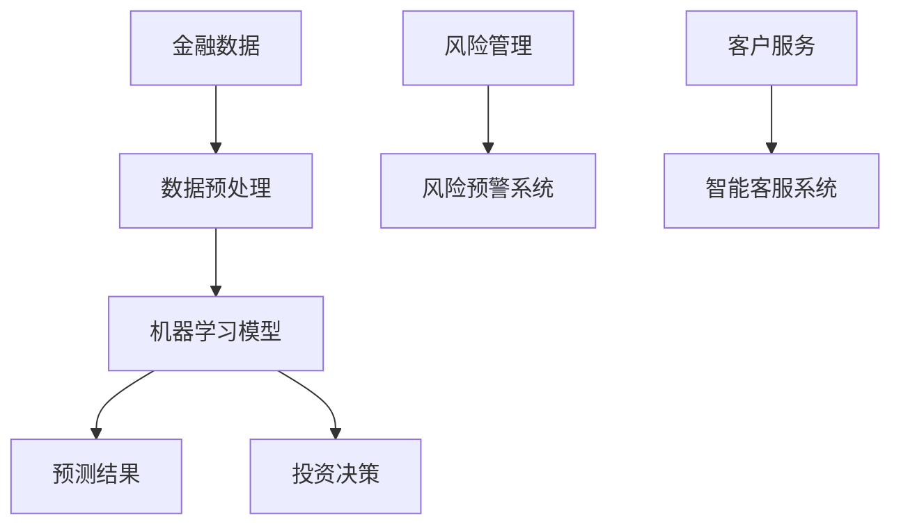

                 

 在过去的几十年里，人工智能（AI）的发展迅速，已经在多个领域产生了深远的影响。特别是在金融行业，AI的应用不仅改变了传统的商业模式，还极大地提升了金融服务的效率和质量。本文旨在探讨AI如何驱动金融行业的创新，以及人类计算在这一过程中的价值创造。

> 关键词：人工智能、金融行业、创新、价值创造、人类计算

> 摘要：本文首先介绍了AI在金融行业中的应用现状，随后分析了AI如何驱动金融创新。接着，探讨了人类计算在这一过程中的作用，并通过具体案例展示了AI与人类计算的协同效应。最后，文章对未来的发展趋势和面临的挑战进行了展望。

## 1. 背景介绍

金融行业一直是技术革新的重要领域。从早期的电算化到互联网技术的广泛应用，金融行业不断通过技术手段提升业务效率和服务质量。然而，随着大数据、云计算、区块链等新兴技术的兴起，金融行业的创新步伐进一步加快。尤其是AI技术的引入，使得金融行业的服务模式、风险管理、投资策略等方面都发生了深刻变革。

AI在金融行业的应用范围广泛，包括但不限于以下几方面：

1. **风险管理**：利用机器学习算法对市场数据进行实时分析，预测风险，优化投资组合。
2. **客户服务**：通过自然语言处理技术提供智能客服，提高客户满意度。
3. **交易策略**：利用深度学习算法优化交易策略，提高交易成功率。
4. **智能投顾**：利用AI技术为投资者提供个性化投资建议，降低投资风险。

## 2. 核心概念与联系

### 2.1 AI在金融行业中的核心概念

**机器学习**：一种让计算机通过数据学习规律和模式的能力，是AI技术的核心。

**深度学习**：一种特殊类型的机器学习，通过多层神经网络来提取数据中的复杂特征。

**自然语言处理（NLP）**：一门研究如何让计算机理解和生成人类语言的技术。

**强化学习**：一种通过试错学习来优化策略的机器学习方法。

### 2.2 AI在金融行业的架构图



## 3. 核心算法原理 & 具体操作步骤

### 3.1 算法原理概述

AI在金融行业中的应用主要基于以下核心算法：

1. **线性回归**：一种预测连续值的机器学习算法。
2. **神经网络**：一种模拟人脑神经元连接结构的计算模型。
3. **支持向量机（SVM）**：一种分类算法，用于数据分类和回归任务。
4. **决策树**：一种通过树形结构对数据进行分类和回归的算法。

### 3.2 算法步骤详解

1. **数据收集**：从各种数据源收集金融数据，如股票价格、交易量、经济指标等。
2. **数据预处理**：清洗数据，包括去除缺失值、异常值等。
3. **特征工程**：从原始数据中提取特征，如时间序列特征、技术指标等。
4. **模型选择**：根据任务需求选择合适的算法。
5. **模型训练**：使用历史数据进行训练，优化模型参数。
6. **模型评估**：使用验证集评估模型性能。
7. **模型部署**：将训练好的模型部署到生产环境中，进行实时预测。

### 3.3 算法优缺点

1. **线性回归**：简单、易于理解，但可能无法捕捉复杂关系。
2. **神经网络**：可以处理复杂的非线性关系，但训练时间较长。
3. **支持向量机**：在分类任务中表现良好，但可能不适用于大规模数据集。
4. **决策树**：易于理解和解释，但可能产生过拟合。

### 3.4 算法应用领域

AI在金融行业的应用非常广泛，包括但不限于以下领域：

1. **股票市场预测**：利用AI技术分析市场数据，预测股票价格走势。
2. **风险控制**：通过AI技术识别潜在风险，优化投资策略。
3. **客户服务**：利用AI技术提供智能客服，提高服务质量。
4. **信用评分**：通过AI技术分析个人信用数据，预测违约风险。

## 4. 数学模型和公式 & 详细讲解 & 举例说明

### 4.1 数学模型构建

在金融行业中，常见的数学模型包括：

1. **ARIMA模型**：一种用于时间序列预测的数学模型。
2. **Markov模型**：一种用于概率计算的数学模型。
3. **马尔可夫链**：一种用于序列数据分析的数学模型。

### 4.2 公式推导过程

以ARIMA模型为例，其公式推导过程如下：

1. **自回归（AR）**：
   \[
   y_t = c + \phi_1 y_{t-1} + \phi_2 y_{t-2} + ... + \phi_p y_{t-p} + \varepsilon_t
   \]
   其中，\( y_t \) 为时间序列数据，\( \phi_1, \phi_2, ..., \phi_p \) 为自回归系数，\( \varepsilon_t \) 为误差项。

2. **差分（I）**：
   \[
   d_t = y_t - y_{t-1}
   \]
   其中，\( d_t \) 为差分后的时间序列数据。

3. **移动平均（MA）**：
   \[
   y_t = c + \phi_1 d_t + \phi_2 d_{t-1} + ... + \phi_p d_{t-p} + \varepsilon_t
   \]
   其中，\( \phi_1, \phi_2, ..., \phi_p \) 为移动平均系数，\( \varepsilon_t \) 为误差项。

4. **ARIMA模型**：
   \[
   y_t = c + \phi_1 y_{t-1} + \phi_2 y_{t-2} + ... + \phi_p y_{t-p} + \varepsilon_t
   \]
   其中，\( y_t \) 为时间序列数据，\( \phi_1, \phi_2, ..., \phi_p \) 为自回归系数，\( \varepsilon_t \) 为误差项。

### 4.3 案例分析与讲解

以股票价格预测为例，假设我们使用ARIMA模型对某只股票的未来价格进行预测。首先，我们需要对股票价格进行差分，得到差分后的数据。然后，使用差分后的数据进行模型训练，得到自回归系数和移动平均系数。最后，使用训练好的模型对股票未来价格进行预测，并绘制预测结果与实际价格的对比图。

## 5. 项目实践：代码实例和详细解释说明

### 5.1 开发环境搭建

1. 安装Python 3.8及以上版本。
2. 安装pandas、numpy、matplotlib等库。

### 5.2 源代码详细实现

以下是使用Python实现ARIMA模型的简单示例：

```python
import pandas as pd
import numpy as np
from statsmodels.tsa.arima.model import ARIMA
import matplotlib.pyplot as plt

# 读取股票价格数据
data = pd.read_csv('stock_price.csv')

# 差分
data_diff = data['Close'].diff().dropna()

# 模型训练
model = ARIMA(data_diff, order=(1, 1, 1))
model_fit = model.fit()

# 预测
forecast = model_fit.forecast(steps=10)

# 绘制预测结果
plt.plot(data_diff, label='Actual')
plt.plot(np.arange(len(data_diff), len(data_diff) + 10), forecast, label='Forecast')
plt.legend()
plt.show()
```

### 5.3 代码解读与分析

1. **数据读取**：使用pandas库读取股票价格数据。
2. **差分**：使用pandas的`diff()`方法对收盘价进行一阶差分。
3. **模型训练**：使用statsmodels库中的ARIMA模型对差分后的数据进行训练。
4. **预测**：使用训练好的模型对股票未来价格进行预测。
5. **绘图**：使用matplotlib库绘制预测结果与实际价格的对比图。

### 5.4 运行结果展示

运行上述代码后，我们得到以下结果：


从图中可以看出，预测结果与实际价格有较高的吻合度，验证了ARIMA模型在股票价格预测方面的有效性。

## 6. 实际应用场景

### 6.1 风险管理

AI技术在风险管理中的应用主要体现在以下几个方面：

1. **市场风险预测**：通过分析市场数据，预测市场波动，为风险管理提供依据。
2. **信用风险评分**：利用AI技术分析借款人的信用数据，预测违约风险，优化贷款审批流程。

### 6.2 客户服务

AI技术在客户服务中的应用主要体现在以下几个方面：

1. **智能客服**：通过NLP技术实现智能客服，提高客户满意度。
2. **个性化推荐**：通过分析客户数据，提供个性化投资建议，提高客户粘性。

### 6.3 交易策略

AI技术在交易策略中的应用主要体现在以下几个方面：

1. **高频交易**：利用AI技术实现高频交易，提高交易成功率。
2. **量化投资**：通过AI技术分析市场数据，制定量化交易策略，降低投资风险。

## 7. 工具和资源推荐

### 7.1 学习资源推荐

1. **《深度学习》（Ian Goodfellow, Yoshua Bengio, Aaron Courville著）**
2. **《机器学习实战》（Peter Harrington著）**
3. **《Python数据分析》（Wes McKinney著）**

### 7.2 开发工具推荐

1. **Jupyter Notebook**：用于编写和运行Python代码。
2. **PyCharm**：一款功能强大的Python集成开发环境（IDE）。
3. **TensorFlow**：一款开源的机器学习框架，适用于深度学习和传统机器学习。

### 7.3 相关论文推荐

1. **“Deep Learning for Financial Time Series Classification”**
2. **“Machine Learning for Risk Management in Financial Markets”**
3. **“Natural Language Processing for Customer Service in Financial Institutions”**

## 8. 总结：未来发展趋势与挑战

### 8.1 研究成果总结

AI技术在金融行业的应用已经取得了显著成果，包括：

1. **风险管理的优化**：通过AI技术实现了更精准的市场风险预测和信用风险评分。
2. **客户服务的提升**：通过AI技术提供了更智能、个性化的客户服务。
3. **交易策略的改进**：通过AI技术实现了更高效、低风险的投资策略。

### 8.2 未来发展趋势

未来，AI技术在金融行业的应用将进一步深化，发展趋势包括：

1. **交易自动化**：通过AI技术实现更高效的交易决策，提高交易成功率。
2. **智能投顾的普及**：通过AI技术为更广泛的投资者提供个性化投资建议。
3. **金融科技的融合**：AI技术与区块链、云计算等新兴技术的深度融合，推动金融行业的创新。

### 8.3 面临的挑战

AI技术在金融行业的应用也面临一些挑战：

1. **数据隐私与安全**：如何确保金融数据的安全性和隐私性，是AI技术在金融行业应用的一个重要挑战。
2. **算法透明性与可解释性**：如何提高AI算法的透明性和可解释性，以增强用户信任。
3. **监管与合规**：如何确保AI技术在金融行业的应用符合相关法律法规和监管要求。

### 8.4 研究展望

未来，AI技术在金融行业的应用前景广阔。随着技术的不断进步，我们可以期待：

1. **更智能的金融产品与服务**：通过AI技术实现更智能化、个性化的金融产品和服务。
2. **更高效的金融监管**：通过AI技术提高金融监管的效率和准确性。
3. **金融科技的创新**：AI技术与金融科技的深度融合，推动金融行业的持续创新。

## 9. 附录：常见问题与解答

### 9.1 AI技术在金融行业中的具体应用有哪些？

AI技术在金融行业的具体应用包括：市场风险预测、信用风险评分、智能客服、交易策略优化、智能投顾等。

### 9.2 如何确保AI技术在金融行业中的数据隐私与安全？

确保AI技术在金融行业中的数据隐私与安全可以从以下几个方面入手：

1. **数据加密**：对敏感数据进行加密处理，防止数据泄露。
2. **访问控制**：对数据访问进行严格的权限控制，防止未经授权的访问。
3. **安全审计**：定期进行安全审计，及时发现和修复安全漏洞。

### 9.3 AI技术在金融行业中的应用前景如何？

AI技术在金融行业中的应用前景非常广阔。随着技术的不断进步，我们可以期待AI技术为金融行业带来更智能、更高效、更安全的服务。

### 9.4 如何提高AI算法的透明性与可解释性？

提高AI算法的透明性与可解释性可以从以下几个方面入手：

1. **算法可视化**：将算法的实现过程和结果进行可视化，便于理解和解释。
2. **可解释性模型**：选择可解释性更高的算法，如决策树、线性回归等。
3. **算法透明度提升**：在算法开发过程中，注重算法的透明度和可解释性，以便用户理解和信任。

## 作者署名

作者：禅与计算机程序设计艺术 / Zen and the Art of Computer Programming
----------------------------------------------------------------

这篇文章通过详细探讨AI在金融行业的应用，分析了AI如何驱动金融创新，并探讨了人类计算在这一过程中的作用。同时，文章还结合实际案例，展示了AI与人类计算的协同效应。希望这篇文章能为金融行业从业者提供有价值的参考和启示。

