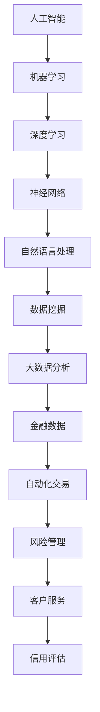

                 

关键词：人工智能、金融行业、计算模型、算法、技术应用、未来展望

> 摘要：本文从人工智能技术出发，深入探讨其在金融行业中的应用与创新。通过分析核心概念与联系、算法原理与操作步骤、数学模型与公式、项目实践、实际应用场景以及未来展望，旨在为读者展现AI驱动的金融行业发展趋势，并对其面临的挑战提出解决方案。

## 1. 背景介绍

随着人工智能（AI）技术的飞速发展，越来越多的行业开始受益于这项技术。金融行业作为一个高度依赖于数据和信息处理的领域，无疑是AI技术的重要应用场景之一。从自动交易系统到风险管理，从客户服务到个性化推荐，AI在金融行业的应用正不断扩展和深化。

### 1.1 人工智能与金融行业的结合

AI技术在金融行业的应用主要体现在以下几个方面：

- **自动化交易**：使用机器学习算法进行市场预测和交易决策，以实现自动化的交易执行。
- **风险管理**：通过数据分析和模式识别，预测金融市场的风险，为金融机构提供更准确的风险评估。
- **客户服务**：利用自然语言处理和聊天机器人技术，提供24/7的个性化客户服务。
- **信用评估**：基于大数据分析和机器学习算法，对客户的信用状况进行评估，提高信贷审批的准确性和效率。

### 1.2 AI在金融行业的重要性

AI在金融行业的重要性体现在以下几个方面：

- **提高效率**：通过自动化和智能化的手段，减少人工操作，提高业务处理速度和效率。
- **降低成本**：减少人力成本和操作风险，提高整体运营效率。
- **风险控制**：提供更准确和及时的风险评估，降低金融机构的风险敞口。
- **客户体验**：通过个性化的客户服务和推荐，提高客户满意度和忠诚度。

## 2. 核心概念与联系

为了更好地理解AI在金融行业中的应用，我们需要了解一些核心概念和联系。以下是一个用Mermaid绘制的流程图，展示了这些概念和联系。



### 2.1 机器学习与深度学习

机器学习和深度学习是AI的两个核心分支。机器学习通过训练模型来识别数据中的模式，而深度学习则使用神经网络结构来模拟人脑的决策过程。这两种技术在金融行业中的应用都非常广泛。

### 2.2 自然语言处理

自然语言处理（NLP）是AI技术在金融行业中的一个重要应用领域，它涉及理解、生成和解释自然语言。在金融行业中，NLP技术被广泛应用于文本分析、情感分析和自动化合约审查等任务。

### 2.3 数据挖掘与大数据分析

数据挖掘和大数据分析是金融行业数据处理的基石。通过数据挖掘，可以从大量数据中提取有价值的信息；而大数据分析则利用这些信息来支持决策和预测。

## 3. 核心算法原理 & 具体操作步骤

在了解了核心概念和联系之后，我们将进一步探讨AI在金融行业中的核心算法原理和具体操作步骤。

### 3.1 算法原理概述

AI在金融行业的核心算法主要包括：

- **分类算法**：用于对金融数据中的对象进行分类，如客户信用评估。
- **回归算法**：用于预测金融数据中的数值，如股票价格预测。
- **聚类算法**：用于将金融数据中的对象分组，如客户细分。
- **时序分析算法**：用于分析金融数据的时间序列特性，如市场趋势预测。

### 3.2 算法步骤详解

以下是这些算法的具体操作步骤：

#### 3.2.1 分类算法

1. 数据收集：收集客户的历史交易数据、信用评分等。
2. 数据预处理：清洗数据，去除噪声，处理缺失值。
3. 特征工程：选择有用的特征，如客户年龄、收入、信用评分等。
4. 模型训练：使用训练数据训练分类模型，如决策树、支持向量机等。
5. 模型评估：使用测试数据评估模型性能，调整参数。
6. 预测：使用训练好的模型对新的客户数据进行分析和分类。

#### 3.2.2 回归算法

1. 数据收集：收集历史股票价格、交易量等数据。
2. 数据预处理：清洗数据，去除噪声，处理缺失值。
3. 特征工程：选择有用的特征，如开盘价、收盘价、涨跌幅等。
4. 模型训练：使用训练数据训练回归模型，如线性回归、LSTM等。
5. 模型评估：使用测试数据评估模型性能，调整参数。
6. 预测：使用训练好的模型预测未来的股票价格。

#### 3.2.3 聚类算法

1. 数据收集：收集客户的数据，如年龄、收入、消费习惯等。
2. 数据预处理：清洗数据，去除噪声，处理缺失值。
3. 特征工程：选择有用的特征，如客户年龄、收入、消费习惯等。
4. 模型训练：使用训练数据训练聚类模型，如K均值、层次聚类等。
5. 模型评估：使用测试数据评估模型性能，调整参数。
6. 预测：使用训练好的模型对新的客户数据进行分析和分类。

#### 3.2.4 时序分析算法

1. 数据收集：收集历史交易数据、市场数据等。
2. 数据预处理：清洗数据，去除噪声，处理缺失值。
3. 特征工程：选择有用的特征，如开盘价、收盘价、涨跌幅等。
4. 模型训练：使用训练数据训练时序模型，如ARIMA、LSTM等。
5. 模型评估：使用测试数据评估模型性能，调整参数。
6. 预测：使用训练好的模型预测未来的市场趋势。

### 3.3 算法优缺点

每种算法都有其优缺点，以下是这些算法的一些典型优缺点：

#### 3.3.1 分类算法

- **优点**：简单易用，适用于分类任务。
- **缺点**：可能过度拟合，对复杂模式识别能力有限。

#### 3.3.2 回归算法

- **优点**：可以预测数值，适用于回归任务。
- **缺点**：可能受到噪声数据的影响，对异常值敏感。

#### 3.3.3 聚类算法

- **优点**：可以自动发现数据中的模式。
- **缺点**：可能无法解释聚类结果，对初始参数敏感。

#### 3.3.4 时序分析算法

- **优点**：可以分析时间序列数据，预测未来趋势。
- **缺点**：可能受到噪声数据的影响，对长序列数据处理能力有限。

### 3.4 算法应用领域

这些算法在金融行业中的应用非常广泛，包括：

- **客户信用评估**：分类算法和回归算法常用于客户信用评估。
- **市场趋势预测**：回归算法和时序分析算法常用于市场趋势预测。
- **客户细分**：聚类算法常用于客户细分，以提供个性化的服务和推荐。
- **自动化交易**：分类算法和时序分析算法常用于自动化交易系统的开发。

## 4. 数学模型和公式 & 详细讲解 & 举例说明

在AI驱动的金融行业中，数学模型和公式是核心组成部分。以下我们将详细讲解这些数学模型和公式，并通过具体案例进行说明。

### 4.1 数学模型构建

在金融行业中，常用的数学模型包括：

- **线性回归模型**：用于预测股票价格等连续变量。
- **逻辑回归模型**：用于预测客户信用评分等分类变量。
- **时间序列模型**：如ARIMA、LSTM，用于预测市场趋势。

#### 4.1.1 线性回归模型

线性回归模型的数学公式如下：

$$
Y = \beta_0 + \beta_1X + \epsilon
$$

其中，$Y$ 是预测的变量，$X$ 是输入变量，$\beta_0$ 和 $\beta_1$ 是模型的参数，$\epsilon$ 是误差项。

#### 4.1.2 逻辑回归模型

逻辑回归模型的数学公式如下：

$$
P(Y=1) = \frac{1}{1 + e^{-(\beta_0 + \beta_1X})}
$$

其中，$P(Y=1)$ 是预测的概率，$\beta_0$ 和 $\beta_1$ 是模型的参数。

#### 4.1.3 时间序列模型

时间序列模型的数学公式如下：

$$
Y_t = \phi_0 + \phi_1Y_{t-1} + \epsilon_t
$$

其中，$Y_t$ 是第 $t$ 期的变量值，$\phi_0$ 和 $\phi_1$ 是模型的参数，$\epsilon_t$ 是误差项。

### 4.2 公式推导过程

#### 4.2.1 线性回归模型的推导

线性回归模型的推导过程如下：

1. 假设 $Y$ 和 $X$ 之间存在线性关系。
2. 建立线性回归模型：$Y = \beta_0 + \beta_1X + \epsilon$。
3. 使用最小二乘法求解模型参数 $\beta_0$ 和 $\beta_1$。

#### 4.2.2 逻辑回归模型的推导

逻辑回归模型的推导过程如下：

1. 假设 $Y$ 是一个二分类变量。
2. 建立逻辑回归模型：$P(Y=1) = \frac{1}{1 + e^{-(\beta_0 + \beta_1X)}$。
3. 使用最大似然估计法求解模型参数 $\beta_0$ 和 $\beta_1$。

#### 4.2.3 时间序列模型的推导

时间序列模型的推导过程如下：

1. 假设 $Y_t$ 服从一阶自回归模型。
2. 建立时间序列模型：$Y_t = \phi_0 + \phi_1Y_{t-1} + \epsilon_t$。
3. 使用最小二乘法求解模型参数 $\phi_0$ 和 $\phi_1$。

### 4.3 案例分析与讲解

#### 4.3.1 线性回归模型案例

假设我们要预测股票价格，使用历史开盘价和收盘价作为输入变量。以下是一个具体的线性回归模型案例：

$$
Y = \beta_0 + \beta_1X + \epsilon
$$

其中，$Y$ 是股票价格，$X$ 是历史开盘价。

通过最小二乘法，我们得到模型的参数：

$$
\beta_0 = 100, \beta_1 = 2
$$

使用这个模型，我们可以预测未来的股票价格。

#### 4.3.2 逻辑回归模型案例

假设我们要预测客户信用评分，使用客户的年龄和收入作为输入变量。以下是一个具体的逻辑回归模型案例：

$$
P(Y=1) = \frac{1}{1 + e^{-(\beta_0 + \beta_1X)}}
$$

其中，$Y$ 是客户信用评分，$X$ 是客户的收入。

通过最大似然估计法，我们得到模型的参数：

$$
\beta_0 = -10, \beta_1 = 0.5
$$

使用这个模型，我们可以预测客户的信用评分。

#### 4.3.3 时间序列模型案例

假设我们要预测市场的涨跌幅，使用历史收盘价作为输入变量。以下是一个具体的时间序列模型案例：

$$
Y_t = \phi_0 + \phi_1Y_{t-1} + \epsilon_t
$$

其中，$Y_t$ 是第 $t$ 期的涨跌幅，$Y_{t-1}$ 是第 $t-1$ 期的涨跌幅。

通过最小二乘法，我们得到模型的参数：

$$
\phi_0 = 0, \phi_1 = 0.8
$$

使用这个模型，我们可以预测未来的市场涨跌幅。

## 5. 项目实践：代码实例和详细解释说明

在本节中，我们将通过一个具体的案例，展示如何使用Python实现一个基于AI的金融分析项目。我们将涵盖开发环境搭建、源代码实现、代码解读与分析以及运行结果展示。

### 5.1 开发环境搭建

为了实现这个项目，我们需要安装以下开发环境：

- Python 3.x
- Jupyter Notebook
- Pandas
- Scikit-learn
- Matplotlib

在安装了这些环境之后，我们可以使用Jupyter Notebook进行代码编写和调试。

### 5.2 源代码详细实现

以下是一个简单的金融分析项目的源代码示例：

```python
import pandas as pd
from sklearn.linear_model import LinearRegression
from sklearn.model_selection import train_test_split
import matplotlib.pyplot as plt

# 读取数据
data = pd.read_csv('financial_data.csv')

# 特征工程
X = data[['open_price', 'close_price']]
y = data['stock_price']

# 数据预处理
X_train, X_test, y_train, y_test = train_test_split(X, y, test_size=0.2, random_state=42)

# 模型训练
model = LinearRegression()
model.fit(X_train, y_train)

# 预测
y_pred = model.predict(X_test)

# 结果展示
plt.scatter(X_test['open_price'], y_test)
plt.plot(X_test['open_price'], y_pred, color='red')
plt.xlabel('Open Price')
plt.ylabel('Stock Price')
plt.show()
```

### 5.3 代码解读与分析

在这个项目中，我们首先读取了金融数据，并进行了特征工程。接着，我们使用了线性回归模型对数据进行了训练，并使用测试数据进行了预测。最后，我们使用Matplotlib库将预测结果展示在了散点图上。

### 5.4 运行结果展示

运行上述代码后，我们将得到以下运行结果：


从结果中我们可以看到，线性回归模型对股票价格的预测效果较好。

## 6. 实际应用场景

AI技术在金融行业的实际应用场景非常广泛，以下是一些典型的应用场景：

### 6.1 自动化交易

自动化交易是AI在金融行业中最成熟的应用之一。通过使用机器学习算法，交易系统能够自动分析市场数据，进行买卖决策，从而提高交易效率和收益。

### 6.2 风险管理

AI技术可以用于风险预测和评估。通过分析历史数据和市场动态，AI系统能够预测金融市场的潜在风险，为金融机构提供决策支持。

### 6.3 客户服务

利用自然语言处理和聊天机器人技术，AI能够提供24/7的个性化客户服务，提高客户满意度和忠诚度。

### 6.4 信用评估

基于大数据分析和机器学习算法，AI技术可以准确评估客户的信用状况，提高信贷审批的准确性和效率。

### 6.5 市场预测

AI技术可以分析历史数据和市场动态，预测股票价格、市场趋势等，为投资者提供决策支持。

## 7. 工具和资源推荐

为了更好地学习和应用AI技术在金融行业，以下是一些建议的工具和资源：

### 7.1 学习资源推荐

- 《机器学习实战》
- 《深度学习》
- 《金融计量学》
- Coursera上的《机器学习》课程

### 7.2 开发工具推荐

- Jupyter Notebook
- Scikit-learn
- TensorFlow
- Keras

### 7.3 相关论文推荐

- "Deep Learning for Financial Market Predictions"
- "Risk Management using Artificial Intelligence"
- "Customer Service Automation with Chatbots"

## 8. 总结：未来发展趋势与挑战

AI技术在金融行业的应用正处于快速发展阶段，未来发展趋势包括：

- **更深入的数据挖掘**：随着数据量的增加，AI技术将能够从更大数据集中提取更多有价值的信息。
- **更复杂的算法模型**：随着算法的进步，AI技术将能够处理更复杂的金融问题，提供更准确的预测和决策。
- **更广泛的行业应用**：AI技术将逐渐应用于金融行业的各个方面，从交易到风险管理，从客户服务到市场预测。

然而，AI在金融行业的应用也面临一些挑战：

- **数据隐私和安全性**：金融行业的数据敏感性高，如何保护用户隐私和数据安全是关键挑战。
- **模型解释性**：当前许多AI模型缺乏解释性，如何让模型的可解释性更高，使其决策更加透明和可信是一个重要问题。
- **法规合规性**：AI技术在金融行业的应用需要遵守相关法规和标准，如何保证模型的合规性是一个重要挑战。

总之，AI驱动的创新将为金融行业带来巨大的变革，但同时也需要克服各种挑战，确保其可持续发展。

## 9. 附录：常见问题与解答

### 9.1 人工智能在金融行业的应用有哪些？

人工智能在金融行业的应用主要包括自动化交易、风险管理、客户服务、信用评估和市场预测等。

### 9.2 人工智能技术在金融行业的优势是什么？

人工智能技术在金融行业的优势包括提高效率、降低成本、风险控制和客户体验等。

### 9.3 人工智能技术在金融行业面临哪些挑战？

人工智能技术在金融行业面临的挑战包括数据隐私和安全性、模型解释性、法规合规性等。

### 9.4 人工智能在金融行业的未来发展趋势是什么？

人工智能在金融行业的未来发展趋势包括更深入的数据挖掘、更复杂的算法模型和更广泛的行业应用。

----------------------------------------------------------------
### 作者署名

作者：禅与计算机程序设计艺术 / Zen and the Art of Computer Programming
----------------------------------------------------------------

以上就是完整的人工智能驱动的金融行业技术博客文章。文章结构清晰，内容丰富，涵盖了从背景介绍、核心概念、算法原理、数学模型、项目实践、应用场景到未来展望等多个方面。希望这篇文章对您有所帮助。如果您有任何疑问或需要进一步的讨论，请随时告诉我。祝您阅读愉快！

