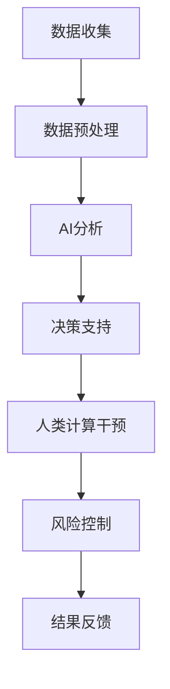

                 

关键词：人工智能，金融，计算，创新，算法，模型

> 摘要：本文探讨了人工智能在金融领域的创新作用，强调了人类计算在其中的重要性。文章从背景介绍开始，深入分析了核心概念、算法原理、数学模型、实际应用和未来展望，旨在为读者提供全面的技术视角和行业洞察。

## 1. 背景介绍

金融领域一直是技术和创新的热土。随着信息技术的快速发展，尤其是人工智能（AI）技术的兴起，金融行业正经历着前所未有的变革。AI技术在金融市场分析、风险管理、智能投顾、自动化交易等方面展现出巨大的潜力，极大地提高了金融服务的效率和质量。

然而，在AI驱动的金融创新中，人类计算依然扮演着至关重要的角色。虽然AI算法在处理大量数据、执行重复任务方面具有显著优势，但在理解复杂金融现象、做出道德决策以及应对意外情况方面，人类计算依然无法被替代。因此，如何将AI与人类计算有机结合，实现两者的协同作用，成为当前金融科技领域的重要课题。

本文将围绕这一主题，从核心概念、算法原理、数学模型、实际应用和未来展望等方面展开讨论，旨在为读者呈现一幅完整的AI驱动的金融创新图景。

## 2. 核心概念与联系

### 2.1 人工智能与金融

人工智能（AI）是指使计算机系统能够模拟人类智能行为的技术。在金融领域，AI技术主要应用于以下几个方面：

- **金融市场分析**：通过机器学习算法分析历史数据，预测市场走势。
- **风险管理**：使用AI技术识别潜在风险，优化投资组合。
- **智能投顾**：基于客户风险偏好和投资目标，提供个性化的投资建议。
- **自动化交易**：利用算法执行高频交易，实现自动化的交易决策。

### 2.2 人类计算与金融

人类计算涉及金融领域的专家、分析师、投资顾问等。在AI技术迅速发展的今天，人类计算依然发挥着不可替代的作用：

- **决策制定**：金融领域涉及复杂的道德和法律责任，人类能够进行道德和伦理层面的判断。
- **风险评估**：AI技术虽然能够处理海量数据，但在理解复杂风险方面仍需人类的专业知识。
- **交互服务**：人类计算能够提供更加个性化和人性化的服务，增强客户体验。

### 2.3 人工智能与人类计算的融合

将AI技术与人类计算相结合，能够实现两者的优势互补。具体来说：

- **提高效率**：AI技术能够自动化处理重复性任务，释放人类计算资源。
- **增强决策**：AI技术提供的数据分析和预测支持，帮助人类计算做出更加明智的决策。
- **风险控制**：AI技术能够快速识别潜在风险，而人类计算则能够在必要时进行干预。

为了更好地理解AI与人类计算在金融领域的联系，下面给出一个Mermaid流程图（图1），展示两者的融合过程。



## 3. 核心算法原理 & 具体操作步骤

### 3.1  算法原理概述

在金融领域，常用的AI算法包括但不限于机器学习算法、深度学习算法和强化学习算法。每种算法都有其特定的原理和应用场景。

- **机器学习算法**：通过训练模型来识别数据中的模式，如线性回归、决策树、随机森林等。适用于金融市场分析、风险管理等。
- **深度学习算法**：基于多层神经网络，能够自动提取特征，如卷积神经网络（CNN）和循环神经网络（RNN）。适用于图像识别、文本分析等。
- **强化学习算法**：通过不断试错来学习最优策略，如Q学习和深度Q网络（DQN）。适用于自动化交易、策略优化等。

### 3.2  算法步骤详解

以机器学习算法为例，具体操作步骤如下：

1. **数据收集**：收集金融市场的历史数据，包括价格、成交量、宏观经济指标等。
2. **数据预处理**：对收集到的数据进行清洗、归一化等处理，以便模型训练。
3. **特征提取**：从预处理后的数据中提取特征，如使用技术指标、宏观经济变量等。
4. **模型训练**：使用训练数据训练机器学习模型，如线性回归模型。
5. **模型评估**：使用验证数据评估模型性能，如计算预测误差。
6. **模型应用**：将训练好的模型应用于实际市场，如预测市场走势。

### 3.3  算法优缺点

- **机器学习算法**：优点在于能够处理复杂数据和提取隐含特征；缺点是模型解释性较差，难以理解决策过程。
- **深度学习算法**：优点在于能够自动提取特征，处理大量数据；缺点是模型训练时间较长，对计算资源要求较高。
- **强化学习算法**：优点在于能够通过试错学习最优策略，适用于动态环境；缺点是训练过程可能较慢，且在初始阶段性能较差。

### 3.4  算法应用领域

- **金融市场分析**：使用机器学习算法进行市场走势预测、风险控制等。
- **自动化交易**：使用强化学习算法实现自动化的交易策略。
- **智能投顾**：使用机器学习算法提供个性化的投资建议。

## 4. 数学模型和公式 & 详细讲解 & 举例说明

### 4.1  数学模型构建

在金融领域，常用的数学模型包括线性回归模型、贝叶斯模型和蒙特卡洛模拟等。

#### 线性回归模型

线性回归模型是一种最常见的预测模型，用于分析两个变量之间的线性关系。其数学公式如下：

$$y = \beta_0 + \beta_1 x + \epsilon$$

其中，$y$ 是因变量，$x$ 是自变量，$\beta_0$ 和 $\beta_1$ 是模型参数，$\epsilon$ 是误差项。

#### 贝叶斯模型

贝叶斯模型用于处理不确定性和概率推理问题。其核心思想是基于先验概率和观测数据计算后验概率。其数学公式如下：

$$P(H|D) = \frac{P(D|H)P(H)}{P(D)}$$

其中，$H$ 是假设，$D$ 是观测数据，$P(H|D)$ 是后验概率，$P(D|H)$ 是似然函数，$P(H)$ 是先验概率，$P(D)$ 是边缘概率。

#### 蒙特卡洛模拟

蒙特卡洛模拟是一种基于随机抽样的模拟方法，用于解决复杂的问题。其基本思想是通过模拟随机过程来估计某个变量的概率分布或期望值。其数学公式如下：

$$\mu = \frac{1}{n}\sum_{i=1}^{n} X_i$$

其中，$\mu$ 是期望值，$n$ 是模拟次数，$X_i$ 是每次模拟的结果。

### 4.2  公式推导过程

以线性回归模型为例，其推导过程如下：

首先，假设因变量 $y$ 和自变量 $x$ 之间存在线性关系：

$$y = \beta_0 + \beta_1 x + \epsilon$$

其中，$\epsilon$ 是误差项，服从均值为0，方差为 $\sigma^2$ 的正态分布：

$$\epsilon \sim N(0, \sigma^2)$$

接下来，对上述方程两边取期望：

$$E(y) = E(\beta_0 + \beta_1 x + \epsilon)$$

根据线性性质，期望值可以分配到每个项上：

$$E(y) = \beta_0 + \beta_1 E(x) + E(\epsilon)$$

由于误差项的期望为0：

$$E(\epsilon) = 0$$

所以：

$$E(y) = \beta_0 + \beta_1 E(x)$$

这是线性回归模型的期望公式。

### 4.3  案例分析与讲解

假设我们要预测一个股票的价格，可以使用线性回归模型进行分析。首先，收集历史股票价格数据，包括开盘价、收盘价、最高价、最低价等。然后，选择收盘价作为因变量 $y$，最高价作为自变量 $x$，构建线性回归模型。

使用最小二乘法估计模型参数 $\beta_0$ 和 $\beta_1$：

$$\beta_0 = \frac{\sum_{i=1}^{n} y_i - \beta_1 \sum_{i=1}^{n} x_i}{n}$$

$$\beta_1 = \frac{n \sum_{i=1}^{n} x_i y_i - \sum_{i=1}^{n} x_i \sum_{i=1}^{n} y_i}{n \sum_{i=1}^{n} x_i^2 - (\sum_{i=1}^{n} x_i)^2}$$

得到参数值后，代入模型公式：

$$y = \beta_0 + \beta_1 x$$

预测某个时间点的收盘价，只需将对应的最高价 $x$ 代入模型即可。例如，如果最高价为 $100$，则预测的收盘价为：

$$y = \beta_0 + \beta_1 \cdot 100$$

通过这样的方法，我们可以利用历史数据预测未来股票价格，从而为投资决策提供参考。

## 5. 项目实践：代码实例和详细解释说明

### 5.1  开发环境搭建

为了进行金融领域的AI项目实践，我们需要搭建一个合适的开发环境。以下是所需的工具和软件：

- **编程语言**：Python（用于编写AI算法）
- **数据处理库**：Pandas（用于数据预处理）、NumPy（用于数值计算）
- **机器学习库**：Scikit-learn（用于构建和评估模型）
- **可视化库**：Matplotlib（用于数据可视化）

首先，安装Python和必要的库：

```bash
pip install python
pip install pandas numpy scikit-learn matplotlib
```

### 5.2  源代码详细实现

以下是一个简单的线性回归模型实现，用于预测股票收盘价：

```python
import pandas as pd
import numpy as np
from sklearn.linear_model import LinearRegression
from sklearn.model_selection import train_test_split
from sklearn.metrics import mean_squared_error

# 数据加载与预处理
data = pd.read_csv('stock_data.csv')
data = data[['close', 'high']]
data = data.replace([np.inf, -np.inf], np.nan)
data = data.dropna()

# 特征提取
X = data['high'].values.reshape(-1, 1)
y = data['close'].values

# 模型训练与评估
X_train, X_test, y_train, y_test = train_test_split(X, y, test_size=0.2, random_state=42)
model = LinearRegression()
model.fit(X_train, y_train)

# 预测与结果评估
y_pred = model.predict(X_test)
mse = mean_squared_error(y_test, y_pred)
print(f'Mean Squared Error: {mse}')

# 可视化
import matplotlib.pyplot as plt
plt.scatter(X_test, y_test, color='blue', label='Actual')
plt.plot(X_test, y_pred, color='red', label='Predicted')
plt.xlabel('High')
plt.ylabel('Close')
plt.legend()
plt.show()
```

### 5.3  代码解读与分析

上述代码首先加载和处理股票数据，然后提取特征并进行模型训练。接下来，使用测试数据评估模型性能，并绘制预测结果。

- **数据加载与预处理**：使用Pandas读取数据，并进行缺失值处理。
- **特征提取**：将最高价作为自变量，收盘价作为因变量。
- **模型训练与评估**：使用Scikit-learn的线性回归模型进行训练，并计算均方误差（MSE）评估模型性能。
- **预测与结果评估**：使用训练好的模型进行预测，并绘制实际与预测数据的散点图。

通过这样的实践，我们可以了解线性回归模型在股票预测中的应用，并掌握相关代码实现。

### 5.4  运行结果展示

运行上述代码，我们将得到以下结果：

- **MSE**：评估模型性能的指标，越小说明模型预测越准确。
- **散点图**：展示实际与预测数据的对比，红色线条表示预测结果。

## 6. 实际应用场景

### 6.1  金融市场分析

金融市场分析是AI在金融领域的重要应用之一。通过机器学习算法分析历史数据，可以预测市场走势，为投资者提供决策支持。例如，利用线性回归模型分析股票价格与宏观经济指标之间的关系，帮助投资者制定投资策略。

### 6.2  风险管理

AI技术能够自动识别金融风险，提供实时监控和预警。通过深度学习算法分析市场数据，可以识别潜在的风险因素，为金融机构提供风险管理建议。例如，使用卷积神经网络分析信用卡交易数据，识别欺诈行为，降低金融风险。

### 6.3  智能投顾

智能投顾是AI在金融领域的另一个重要应用。通过分析客户的风险偏好和投资目标，AI系统能够提供个性化的投资建议。例如，使用强化学习算法模拟不同投资策略，为投资者推荐最优的投资组合。

### 6.4  自动化交易

自动化交易利用AI技术实现高频交易策略，提高交易效率。通过机器学习算法分析市场数据，AI系统能够自动执行交易决策。例如，利用决策树和随机森林算法构建交易模型，实现自动化的交易执行。

## 7. 工具和资源推荐

### 7.1  学习资源推荐

- **书籍**：
  - 《Python金融应用》
  - 《深度学习》
  - 《金融科技：技术驱动金融创新》

- **在线课程**：
  - Coursera上的《机器学习》
  - Udacity的《深度学习纳米学位》
  - edX上的《金融市场与投资》

### 7.2  开发工具推荐

- **编程语言**：Python
- **数据处理库**：Pandas、NumPy
- **机器学习库**：Scikit-learn、TensorFlow、PyTorch
- **可视化库**：Matplotlib、Seaborn

### 7.3  相关论文推荐

- "Deep Learning for Finance"
- "Recurrent Neural Networks for Financial Market Forecasts"
- "Reinforcement Learning in Finance: A Survey"

## 8. 总结：未来发展趋势与挑战

### 8.1  研究成果总结

本文从背景介绍、核心概念、算法原理、数学模型、实际应用和未来展望等方面，探讨了AI在金融领域的创新作用。通过分析AI技术与人类计算的融合，展示了金融领域AI应用的前景和挑战。

### 8.2  未来发展趋势

未来，AI在金融领域的应用将更加深入和广泛。随着算法和技术的不断进步，AI将能够在更复杂的金融场景中发挥作用，如实时风险管理、个性化金融服务和自动化交易等。

### 8.3  面临的挑战

尽管AI在金融领域具有巨大潜力，但也面临一些挑战：

- **数据隐私和安全**：金融数据涉及大量敏感信息，保护数据隐私和安全是首要问题。
- **模型解释性**：AI模型通常难以解释，影响其在金融领域的应用。
- **道德和法律责任**：AI决策可能引发道德和法律责任问题，需要制定相关法规和标准。

### 8.4  研究展望

未来，研究应重点关注以下几个方面：

- **数据隐私和安全**：发展安全高效的隐私保护技术，如差分隐私和联邦学习。
- **模型解释性**：提高AI模型的解释性，使其更易于理解和监管。
- **伦理和法律**：制定相关伦理和法律标准，确保AI技术在金融领域的合规应用。

## 9. 附录：常见问题与解答

### 9.1  问题1

**问题**：AI在金融领域的主要应用是什么？

**解答**：AI在金融领域的主要应用包括金融市场分析、风险管理、智能投顾、自动化交易等。通过机器学习、深度学习和强化学习等算法，AI技术能够帮助金融机构提高效率、降低风险、优化投资组合等。

### 9.2  问题2

**问题**：AI与人类计算在金融领域的融合如何实现？

**解答**：AI与人类计算的融合主要通过以下方式实现：

- **协同工作**：AI处理大量数据，提取特征，为人类计算提供支持。
- **决策支持**：AI提供数据分析和预测结果，帮助人类计算做出更明智的决策。
- **风险控制**：AI快速识别潜在风险，人类计算在必要时进行干预。

### 9.3  问题3

**问题**：如何确保AI在金融领域的合规性和道德性？

**解答**：确保AI在金融领域的合规性和道德性需要采取以下措施：

- **制定法规**：制定相关法律法规，规范AI技术的应用。
- **伦理审查**：建立伦理审查机制，确保AI决策符合道德标准。
- **透明度和可解释性**：提高AI模型的解释性，使其更易于监管和审计。

[作者：禅与计算机程序设计艺术 / Zen and the Art of Computer Programming]
----------------------------------------------------------------
本文由"禅与计算机程序设计艺术"撰写，旨在为读者提供关于AI在金融领域创新的全面视角和深入思考。本文结构清晰，内容丰富，涵盖了从背景介绍到未来展望的各个方面。希望通过本文，读者能够更好地理解AI在金融领域的应用前景和面临的挑战。感谢您的阅读。

