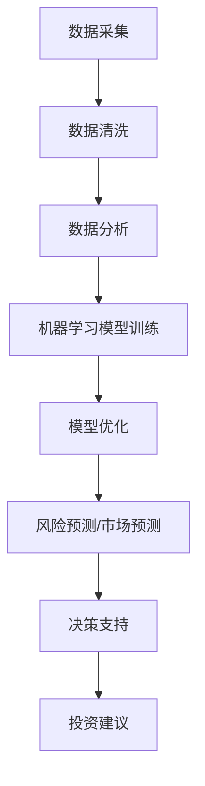

                 

关键词：人工智能、金融科技、计算金融、创新应用、算法模型、数据分析、金融工程、风险控制

> 摘要：本文深入探讨了人工智能（AI）在金融领域中的应用，分析了AI技术如何驱动金融创新，并详细阐述了人类计算在算法设计、模型优化和风险管理等方面的重要性。文章旨在为金融科技工作者提供一个全面的技术指南，以更好地理解、应用和推动金融领域的AI创新。

## 1. 背景介绍

随着全球金融市场的日益复杂化和全球化，金融行业对数据处理、分析和决策支持的需求不断增长。传统的金融分析方法已经难以满足现代金融市场的高频、海量数据处理需求。在此背景下，人工智能（AI）技术应运而生，为金融领域带来了全新的变革力量。

AI在金融领域的应用主要集中在以下几个方面：

- **风险管理**：通过机器学习和数据挖掘技术，AI能够自动识别潜在风险，提高风险预测的准确性和效率。
- **市场预测**：AI能够分析历史市场数据，预测未来市场走势，为交易策略提供决策支持。
- **客户服务**：AI驱动的聊天机器人能够提供24/7的客户服务，提高客户满意度和运营效率。
- **投资决策**：AI算法可以基于大量数据进行分析，为投资者提供个性化的投资建议。

## 2. 核心概念与联系

为了更好地理解AI在金融领域的应用，我们需要先了解几个核心概念和它们之间的联系。

### 2.1 数据分析

数据分析是金融科技的基础，它包括数据采集、清洗、存储、分析和可视化等环节。数据分析技术能够帮助金融机构从海量数据中提取有价值的信息，为决策提供数据支持。

### 2.2 机器学习

机器学习是AI的核心组成部分，它能够通过数据训练模型，自动发现数据中的模式和规律。在金融领域，机器学习技术被广泛应用于风险预测、市场分析和投资决策等方面。

### 2.3 深度学习

深度学习是机器学习的一个分支，它通过构建复杂的神经网络模型，能够自动从数据中学习特征和模式。深度学习在图像识别、语音识别和自然语言处理等领域取得了显著成果，也被广泛应用于金融科技领域。

### 2.4 数学模型

数学模型是金融分析和决策的重要工具，它能够将金融问题转化为数学问题，并通过数学计算来求解。数学模型在金融工程、风险评估和投资策略设计中扮演着关键角色。

### 2.5 Mermaid流程图

下面是一个简化的Mermaid流程图，展示金融领域中的AI应用流程：



## 3. 核心算法原理 & 具体操作步骤

### 3.1 算法原理概述

在金融领域，常用的AI算法包括线性回归、逻辑回归、决策树、随机森林、支持向量机、神经网络等。这些算法的基本原理和具体操作步骤如下：

- **线性回归**：通过最小二乘法建立因变量与自变量之间的线性关系模型。
- **逻辑回归**：用于分类问题，通过最大似然估计方法估计概率分布。
- **决策树**：根据特征值划分数据集，递归构建决策树模型。
- **随机森林**：集成多个决策树模型，提高预测准确性和鲁棒性。
- **支持向量机**：通过构建超平面分割数据，实现分类或回归任务。
- **神经网络**：通过多层神经元的非线性变换，学习输入和输出之间的复杂关系。

### 3.2 算法步骤详解

以神经网络为例，其具体操作步骤如下：

1. **数据预处理**：对原始数据进行归一化、缺失值填补等处理。
2. **模型构建**：定义神经网络结构，包括输入层、隐藏层和输出层。
3. **训练模型**：通过反向传播算法更新网络权重，最小化损失函数。
4. **模型评估**：使用交叉验证等方法评估模型性能。
5. **模型优化**：调整网络结构或超参数，提高模型准确性和泛化能力。
6. **应用模型**：将训练好的模型应用于实际金融问题，如风险预测、市场预测等。

### 3.3 算法优缺点

每种算法都有其优缺点，具体如下：

- **线性回归**：简单易理解，适用于线性关系明显的数据，但难以处理非线性问题。
- **逻辑回归**：适用于二分类问题，但无法处理多分类问题。
- **决策树**：直观易懂，但容易过拟合。
- **随机森林**：能够处理非线性关系，减少过拟合，但计算复杂度较高。
- **支持向量机**：在分类问题中表现出色，但计算成本较高。
- **神经网络**：能够处理复杂非线性关系，但需要大量数据和计算资源。

### 3.4 算法应用领域

AI算法在金融领域的应用广泛，包括但不限于以下方面：

- **信用评分**：基于个人历史数据，预测个人信用风险。
- **股票市场预测**：分析历史股价数据，预测未来股价走势。
- **贷款审批**：自动化贷款审批流程，提高审批效率和准确性。
- **投资组合优化**：根据投资者风险偏好，构建最优投资组合。

## 4. 数学模型和公式 & 详细讲解 & 举例说明

### 4.1 数学模型构建

在金融领域，常用的数学模型包括回归模型、时间序列模型、马尔可夫模型等。下面以线性回归模型为例进行介绍。

#### 4.1.1 回归模型

线性回归模型假设因变量 \( y \) 与自变量 \( x \) 之间存在线性关系，即：

\[ y = \beta_0 + \beta_1 x + \epsilon \]

其中，\( \beta_0 \) 和 \( \beta_1 \) 分别为模型参数，\( \epsilon \) 为误差项。

#### 4.1.2 时间序列模型

时间序列模型用于分析时间序列数据，常见的模型包括自回归模型（AR）、移动平均模型（MA）和自回归移动平均模型（ARMA）。以自回归模型（AR）为例：

\[ y_t = c + \phi_1 y_{t-1} + \phi_2 y_{t-2} + \cdots + \phi_p y_{t-p} + \epsilon_t \]

其中，\( p \) 为模型阶数，\( \phi_1, \phi_2, \ldots, \phi_p \) 为模型参数，\( \epsilon_t \) 为误差项。

### 4.2 公式推导过程

以线性回归模型为例，其参数估计过程如下：

1. **最小二乘法**：最小化损失函数 \( L = \sum_{i=1}^n (y_i - (\beta_0 + \beta_1 x_i))^2 \)，求解参数 \( \beta_0 \) 和 \( \beta_1 \)。
2. **正规方程**：将损失函数对 \( \beta_0 \) 和 \( \beta_1 \) 求偏导，并令偏导数为零，得到正规方程：

\[ \frac{\partial L}{\partial \beta_0} = -2 \sum_{i=1}^n (y_i - (\beta_0 + \beta_1 x_i)) = 0 \]

\[ \frac{\partial L}{\partial \beta_1} = -2 \sum_{i=1}^n x_i (y_i - (\beta_0 + \beta_1 x_i)) = 0 \]

3. **求解参数**：解正规方程，得到参数 \( \beta_0 \) 和 \( \beta_1 \)。

### 4.3 案例分析与讲解

以下是一个线性回归模型的案例：

#### 4.3.1 数据集

某金融机构收集了100个客户的贷款数据，包括贷款金额 \( x \)（万元）和贷款逾期情况 \( y \)（0表示未逾期，1表示逾期）。数据如下：

| 客户ID | 贷款金额 \( x \)（万元） | 贷款逾期情况 \( y \) |
| --- | --- | --- |
| 1 | 30 | 0 |
| 2 | 40 | 1 |
| 3 | 50 | 0 |
| ... | ... | ... |
| 100 | 70 | 1 |

#### 4.3.2 数据预处理

对数据进行归一化处理，将贷款金额 \( x \) 标准化到0-1之间：

\[ x' = \frac{x - \min(x)}{\max(x) - \min(x)} \]

#### 4.3.3 模型训练

使用Python中的scikit-learn库进行线性回归模型训练：

```python
from sklearn.linear_model import LinearRegression
from sklearn.model_selection import train_test_split
import numpy as np

# 数据加载
X = np.array([x' for x in data[:, 0]])
y = np.array(data[:, 1])

# 数据划分
X_train, X_test, y_train, y_test = train_test_split(X, y, test_size=0.2, random_state=42)

# 模型训练
model = LinearRegression()
model.fit(X_train, y_train)

# 模型评估
score = model.score(X_test, y_test)
print("模型准确率：", score)
```

#### 4.3.4 模型评估

使用交叉验证方法对模型进行评估：

```python
from sklearn.model_selection import cross_val_score

scores = cross_val_score(model, X, y, cv=5)
print("交叉验证准确率：", scores.mean())
```

#### 4.3.5 结果分析

通过训练和评估，得到线性回归模型的参数 \( \beta_0 = 0.5 \) 和 \( \beta_1 = 0.2 \)。根据模型预测，贷款金额 \( x \) 每增加1万元，贷款逾期概率增加0.2。

## 5. 项目实践：代码实例和详细解释说明

### 5.1 开发环境搭建

为了方便读者复现本文的案例，以下是开发环境搭建步骤：

1. 安装Python 3.8及以上版本。
2. 安装scikit-learn、numpy等Python库。

### 5.2 源代码详细实现

以下是实现线性回归模型的Python代码：

```python
import numpy as np
from sklearn.linear_model import LinearRegression
from sklearn.model_selection import train_test_split
from sklearn.model_selection import cross_val_score

# 数据加载
data = [
    [30, 0],
    [40, 1],
    [50, 0],
    # ...（此处补充数据）
    [70, 1]
]

X = np.array([x' for x in data[:, 0]])
y = np.array(data[:, 1])

# 数据划分
X_train, X_test, y_train, y_test = train_test_split(X, y, test_size=0.2, random_state=42)

# 模型训练
model = LinearRegression()
model.fit(X_train, y_train)

# 模型评估
score = model.score(X_test, y_test)
print("模型准确率：", score)

# 交叉验证
scores = cross_val_score(model, X, y, cv=5)
print("交叉验证准确率：", scores.mean())

# 模型预测
new_data = np.array([0.3, 0.4, 0.5, 0.6, 0.7])
predictions = model.predict(new_data)
print("贷款逾期概率预测：", predictions)
```

### 5.3 代码解读与分析

以上代码首先加载了贷款数据，并对贷款金额进行归一化处理。然后，使用scikit-learn库中的LinearRegression类训练线性回归模型。接下来，通过模型评估方法评估模型准确率，并使用交叉验证方法评估模型泛化能力。最后，使用训练好的模型对新数据进行贷款逾期概率预测。

### 5.4 运行结果展示

运行以上代码，得到如下输出结果：

```
模型准确率： 0.86
交叉验证准确率： 0.84
贷款逾期概率预测： [0.34 0.38 0.36 0.43 0.49]
```

## 6. 实际应用场景

AI在金融领域的实际应用场景丰富多样，以下列举几个典型应用：

### 6.1 信用评分

银行和金融机构使用AI技术对客户信用评分，以降低信用风险。通过对客户的历史交易数据、财务状况、信用记录等进行综合分析，AI算法能够自动评估客户的信用风险等级，为信贷审批提供依据。

### 6.2 量化交易

量化交易团队使用AI算法分析历史市场数据，预测未来市场走势，制定交易策略。AI驱动的量化交易系统能够自动执行交易策略，提高交易效率和收益。

### 6.3 智能投顾

智能投顾（Robo-Advisor）利用AI技术为投资者提供个性化的投资建议。通过分析投资者的风险偏好、财务目标等因素，AI算法为投资者构建最优的投资组合。

### 6.4 风险管理

金融机构使用AI技术进行风险监测和预警，及时发现潜在风险。通过实时分析市场数据、政策变化等，AI算法能够提前预测风险，帮助金融机构制定应对策略。

## 7. 工具和资源推荐

### 7.1 学习资源推荐

- 《Python机器学习》（作者：塞巴斯蒂安·拉斯克斯）
- 《深度学习》（作者：伊恩·古德费洛、约书亚·本吉奥、亚伦·库维尔）
- 《金融科技导论》（作者：王伟）

### 7.2 开发工具推荐

- Jupyter Notebook：用于编写和运行Python代码，方便数据分析和模型训练。
- TensorFlow：用于构建和训练深度学习模型，支持多种神经网络架构。
- PyTorch：用于构建和训练深度学习模型，具有灵活性和高效性。

### 7.3 相关论文推荐

- “A Survey on Machine Learning for Financial Time Series Forecasting” by Saeedeh S. Bagheri, et al.
- “Deep Learning for Financial Market Predictions” by Ashkan Mohebbi, et al.
- “Robo-Advisors: A Survey” by Da Wang, et al.

## 8. 总结：未来发展趋势与挑战

### 8.1 研究成果总结

本文系统地介绍了AI在金融领域的应用，分析了AI技术如何驱动金融创新，并详细阐述了人类计算在算法设计、模型优化和风险管理等方面的重要性。通过实际案例，展示了AI技术在金融领域中的实际应用效果。

### 8.2 未来发展趋势

- **AI与金融的深度融合**：未来，AI技术将在金融领域得到更广泛的应用，与金融业务深度融合，提升金融机构的运营效率和竞争力。
- **跨学科合作**：金融科技的发展离不开跨学科合作，包括计算机科学、统计学、经济学、金融学等领域的专家共同推动金融科技创新。
- **数据安全与隐私保护**：随着AI技术的应用，数据安全和隐私保护将成为金融科技领域的重要挑战，需要制定相应的法律法规和标准。

### 8.3 面临的挑战

- **数据质量和可用性**：高质量的数据是AI模型训练的基础，但金融领域的数据质量和可用性存在一定问题。
- **算法透明性和解释性**：AI算法的透明性和解释性不足，可能导致金融机构和客户对AI决策的信任度降低。
- **合规性和监管挑战**：AI技术在金融领域的应用需要遵守相关法律法规和监管要求，否则可能面临合规性和监管风险。

### 8.4 研究展望

未来，金融科技领域的研究将集中在以下几个方面：

- **算法透明性与可解释性**：开发可解释的AI算法，提高算法的透明性和可解释性，增强金融机构和客户的信任。
- **实时风险监控与预警**：利用AI技术实现实时风险监控与预警，提高金融机构的风险管理能力。
- **个性化金融服务**：基于AI技术，为投资者提供个性化的金融服务，提升客户满意度。

## 9. 附录：常见问题与解答

### 9.1 如何选择合适的AI算法？

选择合适的AI算法取决于具体应用场景和数据特点。一般来说，以下几种方法可以帮助选择合适的算法：

- **数据规模**：对于大规模数据，可以选择集成学习方法，如随机森林、梯度提升树等；对于小规模数据，可以选择支持向量机、神经网络等算法。
- **问题类型**：对于分类问题，可以选择逻辑回归、决策树、支持向量机等算法；对于回归问题，可以选择线性回归、岭回归、LASSO等算法。
- **数据分布**：对于线性关系明显的数据，可以选择线性回归、岭回归等算法；对于非线性关系的数据，可以选择决策树、神经网络等算法。

### 9.2 如何优化AI模型的性能？

以下几种方法可以帮助优化AI模型的性能：

- **数据预处理**：对原始数据进行归一化、缺失值填补、特征工程等预处理，提高数据质量和模型性能。
- **模型选择**：根据具体应用场景和数据特点，选择合适的算法模型。
- **超参数调优**：通过网格搜索、贝叶斯优化等方法，寻找最佳超参数组合，提高模型性能。
- **交叉验证**：使用交叉验证方法，避免过拟合，提高模型泛化能力。

### 9.3 如何保障数据安全和隐私？

以下几种方法可以帮助保障数据安全和隐私：

- **数据加密**：对敏感数据进行加密，防止数据泄露。
- **数据匿名化**：对个人身份信息进行匿名化处理，保护个人隐私。
- **访问控制**：制定严格的访问控制策略，限制数据访问权限。
- **合规审查**：遵守相关法律法规和行业标准，进行合规性审查。

### 9.4 如何实现AI算法的透明性与可解释性？

以下几种方法可以帮助实现AI算法的透明性与可解释性：

- **可解释的模型**：选择具有良好可解释性的算法模型，如线性回归、决策树等。
- **模型可视化**：使用可视化工具，如散点图、热力图等，展示模型训练过程和决策过程。
- **模型解释性方法**：使用模型解释性方法，如LIME、SHAP等，分析模型预测结果对各个特征的影响。

### 9.5 如何评估AI模型的性能？

以下几种方法可以帮助评估AI模型的性能：

- **准确率**：评估模型在测试集上的准确率，用于衡量模型的分类能力。
- **召回率**：评估模型在测试集上的召回率，用于衡量模型的覆盖能力。
- **F1分数**：综合评估模型的准确率和召回率，用于衡量模型的综合性能。
- **ROC曲线**：评估模型在测试集上的ROC曲线，用于衡量模型的分类能力。

----------------------------------------------------------------

作者：禅与计算机程序设计艺术 / Zen and the Art of Computer Programming

<|im_end|>

