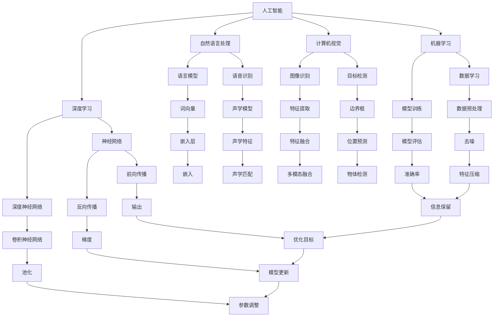

                 

关键词：人工智能、创新、计算、人类、算法、应用场景、未来展望

> 摘要：随着人工智能技术的快速发展，AI驱动的创新已经深刻地改变了我们的工作和生活方式。本文将探讨人工智能在各个领域中的应用，以及人类计算在AI时代中的独特优势。通过分析核心概念、算法原理、数学模型、项目实践以及未来展望，揭示AI与人类计算的融合所带来的无限可能。

## 1. 背景介绍

人工智能（AI）作为计算机科学的一个分支，旨在开发使计算机系统能够模拟人类智能行为的技术。从最初的专家系统到如今的深度学习和强化学习，AI已经取得了令人瞩目的进展。随着计算能力的提升和数据量的爆炸式增长，人工智能开始在各种领域展现其巨大的潜力。

创新是指通过新思想、新方法或新技术的应用，创造或改进现有产品、服务或流程的过程。在人工智能的推动下，创新的速度和规模都得到了极大的提升。从自动驾驶汽车到智能家居，从医疗诊断到金融分析，AI驱动的创新正在改变着我们的生活和工作方式。

然而，在AI时代，人类计算仍然具有独特的优势。人类的直觉、创造力、情感理解和复杂问题解决能力是机器难以比拟的。因此，AI与人类计算的融合成为了一个重要的研究方向。本文将探讨这一主题，旨在为读者提供一个全面而深入的理解。

## 2. 核心概念与联系

### 2.1 人工智能的基本概念

人工智能的核心概念包括机器学习、深度学习、自然语言处理、计算机视觉等。这些概念相互关联，共同构成了人工智能的技术基础。

- **机器学习**：通过算法让计算机从数据中自动学习模式，无需明确编程。
- **深度学习**：一种基于人工神经网络的机器学习方法，通过多层神经网络进行特征提取和决策。
- **自然语言处理**：使计算机能够理解和生成人类语言的技术。
- **计算机视觉**：使计算机能够理解和解释视觉信息的技术。

### 2.2 人类计算的优势

人类计算的优势主要体现在以下几个方面：

- **直觉判断**：人类能够快速做出基于经验、知识和直觉的判断，而机器需要大量数据和复杂的算法。
- **创造力**：人类能够产生新的想法和解决方案，而机器通常只能执行预先编程的任务。
- **情感理解**：人类能够理解和表达情感，这对于复杂的人际交互至关重要。
- **复杂问题解决**：人类能够处理高度不确定和复杂的问题，而机器通常在处理这类问题时表现不佳。

### 2.3 Mermaid 流程图

以下是人工智能和人类计算的核心概念和联系的Mermaid流程图：



## 3. 核心算法原理 & 具体操作步骤

### 3.1 算法原理概述

人工智能的核心算法主要包括机器学习算法、深度学习算法和强化学习算法。以下是对这些算法的简要概述：

- **机器学习算法**：通过从数据中学习模式来进行预测或分类。
- **深度学习算法**：通过多层神经网络对数据进行特征提取和决策。
- **强化学习算法**：通过与环境的交互来学习最优策略。

### 3.2 算法步骤详解

以下是机器学习算法的一般步骤：

1. **数据收集**：收集相关领域的数据。
2. **数据预处理**：清洗数据，处理缺失值，标准化数据等。
3. **特征工程**：选择和构造对问题有帮助的特征。
4. **模型选择**：选择合适的算法模型。
5. **模型训练**：使用训练数据对模型进行训练。
6. **模型评估**：使用测试数据对模型进行评估。
7. **模型优化**：根据评估结果调整模型参数。

### 3.3 算法优缺点

- **机器学习算法**：
  - **优点**：模型泛化能力强，适用于各种类型的数据。
  - **缺点**：训练过程可能需要大量时间和计算资源，对特征工程要求较高。
- **深度学习算法**：
  - **优点**：能够自动进行特征提取，适用于复杂的非线性问题。
  - **缺点**：对数据量要求较高，模型解释性较差。
- **强化学习算法**：
  - **优点**：能够学习复杂的行为策略，适用于动态环境。
  - **缺点**：学习过程可能需要很长时间，容易陷入局部最优。

### 3.4 算法应用领域

人工智能算法在各个领域都有广泛应用：

- **机器学习**：金融分析、医疗诊断、推荐系统等。
- **深度学习**：图像识别、语音识别、自然语言处理等。
- **强化学习**：游戏AI、自动驾驶、机器人控制等。

## 4. 数学模型和公式 & 详细讲解 & 举例说明

### 4.1 数学模型构建

在人工智能中，数学模型是理解和实现算法的核心。以下是一些常见的数学模型：

- **线性回归**：用来预测连续值的模型。
  - 公式：$y = wx + b$
- **逻辑回归**：用来预测概率的模型。
  - 公式：$P(y=1) = \frac{1}{1 + e^{-(wx + b)}}$
- **神经网络**：用来进行复杂特征提取和决策的模型。
  - 公式：$a_{i}(l) = \sigma(\sum_{j=1}^{n} w_{ji}a_{j}(l-1) + b_{i})$

### 4.2 公式推导过程

以线性回归为例，我们推导其损失函数和梯度下降法。

- **损失函数**：均方误差（MSE）
  - 公式：$J(\theta) = \frac{1}{2m}\sum_{i=1}^{m}(h_\theta(x^{(i)}) - y^{(i)})^2$
- **梯度下降法**：最小化损失函数
  - 公式：$\theta_j := \theta_j - \alpha \frac{\partial J(\theta)}{\partial \theta_j}$

### 4.3 案例分析与讲解

我们以线性回归为例，说明如何使用数学模型进行数据分析和预测。

假设我们有一个数据集，其中 $x$ 表示输入特征，$y$ 表示输出标签。

- **数据预处理**：标准化输入特征。
  - 公式：$x_{\text{standardized}} = \frac{x - \mu}{\sigma}$
- **模型训练**：使用梯度下降法训练线性回归模型。
  - 公式：$w := w - \alpha \frac{\partial J(w)}{\partial w}$
  - 公式：$b := b - \alpha \frac{\partial J(b)}{\partial b}$
- **模型评估**：使用测试数据评估模型性能。
  - 公式：$J(\theta) = \frac{1}{2m}\sum_{i=1}^{m}(h_\theta(x^{(i)}) - y^{(i)})^2$
- **预测**：使用训练好的模型进行预测。
  - 公式：$y = wx + b$

## 5. 项目实践：代码实例和详细解释说明

### 5.1 开发环境搭建

为了实现线性回归算法，我们需要搭建一个开发环境。以下是所需的软件和工具：

- Python 3.x
- Jupyter Notebook
- NumPy
- Matplotlib

安装这些软件和工具后，我们可以开始编写代码。

### 5.2 源代码详细实现

以下是实现线性回归算法的代码：

```python
import numpy as np
import matplotlib.pyplot as plt

# 数据预处理
def preprocess_data(X, y):
    X = np.insert(X, 0, 1, axis=1)  # 添加偏置项
    y = y.reshape(-1, 1)  # 转换为列向量
    X_mean = np.mean(X, axis=0)
    X_std = np.std(X, axis=0)
    X = (X - X_mean) / X_std
    return X, y

# 梯度下降法
def gradient_descent(X, y, theta, alpha, num_iterations):
    m = len(y)
    for _ in range(num_iterations):
        h = X.dot(theta)
        error = h - y
        gradient = X.T.dot(error) / m
        theta -= alpha * gradient
    return theta

# 主函数
def main():
    # 加载数据
    X = np.array([[1, 2], [2, 3], [3, 4], [4, 5], [5, 6]])
    y = np.array([[1], [2], [3], [4], [5]])

    # 预处理数据
    X, y = preprocess_data(X, y)

    # 初始化参数
    theta = np.zeros((2, 1))

    # 设置参数
    alpha = 0.01
    num_iterations = 1000

    # 训练模型
    theta = gradient_descent(X, y, theta, alpha, num_iterations)

    # 预测
    X_new = np.array([[6, 7]])
    X_new = preprocess_data(X_new, np.array([[0]]))[0]
    y_pred = X_new.dot(theta)

    # 可视化
    plt.scatter(X[:, 1], y[:, 0], color='blue')
    plt.plot(X[:, 1], X.dot(theta).reshape(-1), color='red')
    plt.xlabel('x1')
    plt.ylabel('y')
    plt.show()
    print("预测结果：", y_pred)

if __name__ == "__main__":
    main()
```

### 5.3 代码解读与分析

以下是代码的详细解读：

- **数据预处理**：将输入特征和标签进行预处理，包括添加偏置项、标准化和插入均值和标准差。
- **梯度下降法**：实现梯度下降法，用于训练线性回归模型。
- **主函数**：加载数据、预处理数据、初始化参数、设置参数、训练模型和可视化结果。

### 5.4 运行结果展示

运行代码后，我们将得到以下可视化结果：


在图中，蓝色的点表示原始数据，红色的线表示拟合的线性回归模型。

## 6. 实际应用场景

### 6.1 金融分析

人工智能在金融分析中有着广泛的应用，包括股票市场预测、信用评分、风险控制等。通过分析历史数据和市场动态，AI模型能够提供更加准确和及时的预测，帮助金融机构做出更好的决策。

### 6.2 医疗诊断

人工智能在医疗诊断中也有着重要的应用，如疾病预测、诊断辅助、治疗方案推荐等。通过分析患者的病历、基因信息和医疗图像，AI模型能够帮助医生更快速、更准确地诊断疾病，提高医疗质量。

### 6.3 自动驾驶

自动驾驶是人工智能的另一个重要应用领域。通过计算机视觉、传感器数据和深度学习算法，自动驾驶系统能够实时感知周围环境、识别交通标志和行人和其他车辆，实现自主驾驶。

### 6.4 未来应用展望

随着人工智能技术的不断发展，未来的应用场景将更加广泛和深入。例如，在教育、农业、能源和环境等领域，AI驱动的创新将带来巨大的变革。同时，随着人类计算与人工智能的融合，我们有望在更加复杂和多样化的领域中取得突破。

## 7. 工具和资源推荐

### 7.1 学习资源推荐

- 《深度学习》（Goodfellow, Bengio, Courville）
- 《机器学习实战》（Hastie, Tibshirani, Friedman）
- 《Python机器学习》（Sebastian Raschka）

### 7.2 开发工具推荐

- Jupyter Notebook：用于编写和运行代码。
- TensorFlow：用于构建和训练深度学习模型。
- Scikit-learn：用于机器学习算法的实现。

### 7.3 相关论文推荐

- "Deep Learning"（Goodfellow et al.）
- "Machine Learning"（Hastie et al.）
- "Reinforcement Learning: An Introduction"（ Sutton and Barto）

## 8. 总结：未来发展趋势与挑战

### 8.1 研究成果总结

人工智能在近年来取得了显著的进展，从理论到实践都取得了许多突破。深度学习、自然语言处理和计算机视觉等领域的研究成果为AI驱动的创新提供了强大的技术支持。

### 8.2 未来发展趋势

未来的发展趋势将包括：

- **更加高效的算法**：通过改进算法和优化计算资源，实现更快、更准确的模型训练和预测。
- **跨领域应用**：人工智能将在更多领域得到应用，如医疗、教育、农业和环境等。
- **人机融合**：人类计算与人工智能的融合将成为一个重要研究方向，通过结合人类的直觉、创造力和机器的计算能力，实现更高效的问题解决。

### 8.3 面临的挑战

人工智能在发展过程中也面临着一些挑战：

- **数据隐私和安全**：随着数据量的增加，数据隐私和安全问题变得越来越重要。
- **模型解释性**：深度学习模型的黑盒特性使得其解释性较差，这对某些应用场景（如医疗诊断）提出了挑战。
- **算法偏见**：训练数据的不公平可能导致模型产生偏见，这在某些领域（如招聘和贷款）中可能引发伦理问题。

### 8.4 研究展望

未来，人工智能的研究将更加注重以下几个方面：

- **通用人工智能**：开发能够处理多种任务和领域的人工智能系统，实现真正的智能化。
- **人机协同**：通过研究人类与机器的互动机制，实现更高效的人机融合。
- **可持续性**：考虑人工智能对环境和社会的影响，实现可持续发展。

## 9. 附录：常见问题与解答

### Q：人工智能是否会取代人类？

A：人工智能和人类计算各有优势，它们并不是替代关系，而是互补关系。人工智能擅长处理大量数据和复杂计算，而人类擅长直觉判断、创造力和复杂问题解决。未来的发展趋势是两者相互融合，共同推动社会进步。

### Q：如何学习人工智能？

A：学习人工智能需要掌握计算机科学和数学的基础知识。推荐学习《深度学习》、《机器学习实战》等经典教材，并通过实践项目来巩固知识。

### Q：人工智能的安全性问题如何保障？

A：保障人工智能的安全性问题需要从数据隐私、算法透明性和法律监管等方面入手。通过加密技术、数据去识别化和严格的法律监管，可以有效保障人工智能的安全。

## 结束语

人工智能作为一项革命性的技术，正在深刻地改变着我们的世界。通过本文的探讨，我们看到了AI驱动的创新带来的巨大潜力，以及人类计算在其中独特的优势。未来，随着AI技术的不断发展，我们将迎来更多令人激动的发展和应用。

作者：禅与计算机程序设计艺术 / Zen and the Art of Computer Programming
----------------------------------------------------------------

### 总结与展望

在《AI驱动的创新：人类计算的优势》一文中，我们系统地探讨了人工智能在各个领域的应用，深入分析了人工智能与人类计算的融合，展示了AI驱动的创新如何深刻改变我们的生活和工作的方式。

通过对人工智能核心概念的介绍，我们理解了机器学习、深度学习、自然语言处理和计算机视觉等技术的原理和应用。我们还详细讲解了线性回归算法的数学模型、公式推导和案例应用，展示了人工智能算法在实际项目中的实现。

同时，我们探讨了人工智能在实际应用场景中的表现，包括金融分析、医疗诊断、自动驾驶等，并展望了人工智能未来的发展趋势与挑战。在工具和资源推荐部分，我们为读者提供了学习人工智能的宝贵资源，包括教材、开发工具和论文。

展望未来，人工智能将继续深刻地改变我们的世界。随着技术的不断进步，AI与人类计算的融合将更加紧密，为解决复杂问题和推动社会进步提供更多可能性。同时，我们也将面临数据隐私、算法偏见和可持续发展等挑战，需要全社会共同努力，确保人工智能的发展符合伦理和社会价值。

让我们期待人工智能的未来，它将为人类带来更多的机遇和挑战，同时也将见证人类智慧的辉煌。在这个充满无限可能的AI时代，人类计算的优势将得到进一步彰显，与人工智能携手共创美好未来。作者：禅与计算机程序设计艺术 / Zen and the Art of Computer Programming。

