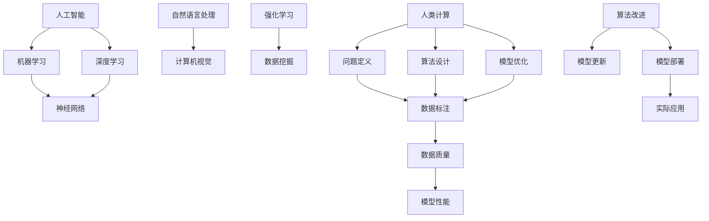

                 

关键词：人工智能、计算、创新、技术发展、未来展望

摘要：本文将探讨人工智能（AI）如何驱动创新，并介绍人类计算在其中的作用。我们将分析AI的核心概念和原理，探讨其应用领域和未来发展趋势，并提出面临的挑战。通过一个实际项目案例，我们将展示如何使用AI实现创新，并介绍相关工具和资源。最后，我们将总结研究成果，展望未来，并提出可能的解决方案。

## 1. 背景介绍

人工智能作为一门新兴的交叉学科，已经引起了全球的关注。AI的核心目标是让计算机模拟人类的智能行为，包括学习、推理、感知、理解和决策等。随着深度学习、神经网络和自然语言处理等技术的不断发展，AI在各个领域取得了显著的成果。

人类计算是AI发展的重要驱动力。人类计算指的是人类在AI系统中发挥的作用，包括数据标注、问题定义、算法设计、模型优化等方面。人类计算的优势在于创造力、直觉和经验，这些都是当前AI技术所不具备的。因此，人类计算与AI的结合将推动创新的不断进步。

## 2. 核心概念与联系

为了更好地理解AI驱动的创新，我们需要了解一些核心概念和原理。以下是AI的核心概念及它们之间的联系，我们使用Mermaid流程图来展示它们的关系：



### 2.1 人工智能

人工智能是指让计算机模拟人类智能行为的科学技术。人工智能包括多个子领域，如机器学习、深度学习、自然语言处理、计算机视觉、强化学习等。

### 2.2 机器学习

机器学习是AI的核心技术之一，通过训练模型来使计算机自动完成特定任务。机器学习分为监督学习、无监督学习和强化学习三种类型。

### 2.3 深度学习

深度学习是一种基于神经网络的机器学习技术，通过多层神经元的非线性变换，实现复杂函数的逼近。深度学习在图像识别、语音识别、自然语言处理等领域取得了显著成果。

### 2.4 自然语言处理

自然语言处理（NLP）是研究如何使计算机理解和处理自然语言的技术。NLP包括文本分类、情感分析、机器翻译、语音识别等任务。

### 2.5 计算机视觉

计算机视觉是让计算机理解和解释图像和视频的技术。计算机视觉在图像识别、目标检测、图像生成等领域有着广泛的应用。

### 2.6 强化学习

强化学习是一种通过试错来学习策略的机器学习技术。强化学习在游戏、自动驾驶、机器人控制等领域具有广泛的应用。

### 2.7 人类计算

人类计算是指人类在AI系统中发挥的作用。人类计算包括问题定义、数据标注、算法设计、模型优化等方面。人类计算的优势在于创造力、直觉和经验。

## 3. 核心算法原理 & 具体操作步骤

### 3.1 算法原理概述

在本章节，我们将介绍几种核心算法的原理，包括神经网络、深度学习、自然语言处理和计算机视觉等。

### 3.2 算法步骤详解

以下是核心算法的具体操作步骤：

### 3.2.1 神经网络

1. **初始化权重和偏置**：随机初始化网络中的权重和偏置。
2. **前向传播**：将输入数据传递到神经网络中，计算输出结果。
3. **反向传播**：根据输出结果和实际标签，计算误差，并更新权重和偏置。
4. **优化算法**：使用梯度下降、Adam等优化算法来更新权重和偏置。

### 3.2.2 深度学习

1. **数据预处理**：对输入数据进行归一化、标准化等处理。
2. **构建模型**：使用卷积神经网络（CNN）、循环神经网络（RNN）等深度学习模型。
3. **训练模型**：通过前向传播和反向传播训练模型。
4. **评估模型**：使用验证集评估模型性能，调整模型参数。

### 3.2.3 自然语言处理

1. **文本预处理**：对文本进行分词、去停用词等处理。
2. **词向量表示**：使用Word2Vec、BERT等词向量模型将文本转换为向量。
3. **构建模型**：使用神经网络、循环神经网络（RNN）等模型进行文本分类、情感分析等任务。
4. **训练模型**：通过前向传播和反向传播训练模型。

### 3.2.4 计算机视觉

1. **图像预处理**：对图像进行缩放、裁剪、旋转等处理。
2. **特征提取**：使用卷积神经网络（CNN）提取图像特征。
3. **构建模型**：使用深度学习模型进行图像分类、目标检测等任务。
4. **训练模型**：通过前向传播和反向传播训练模型。

### 3.3 算法优缺点

每种算法都有其优缺点，我们需要根据具体应用场景选择合适的算法。

### 3.3.1 神经网络

优点：能够处理复杂非线性问题，泛化能力强。

缺点：计算复杂度高，对大量数据有依赖。

### 3.3.2 深度学习

优点：能够自动提取特征，处理大规模数据。

缺点：对数据质量有较高要求，过拟合问题难以避免。

### 3.3.3 自然语言处理

优点：能够处理大规模文本数据，实现文本分类、情感分析等任务。

缺点：对语言理解能力有限，处理长文本效果不佳。

### 3.3.4 计算机视觉

优点：能够处理图像数据，实现图像分类、目标检测等任务。

缺点：对计算资源有较高要求，训练时间较长。

### 3.4 算法应用领域

各种算法在多个领域有着广泛的应用，如图像识别、语音识别、自然语言处理、医学诊断、金融分析等。

## 4. 数学模型和公式 & 详细讲解 & 举例说明

在本章节，我们将介绍一些常用的数学模型和公式，并对其进行详细讲解和举例说明。

### 4.1 数学模型构建

数学模型是描述现实世界问题的数学表达式。构建数学模型通常包括以下几个步骤：

1. **确定研究对象**：明确需要解决的问题和研究对象。
2. **收集数据**：收集与研究对象相关的数据，如时间序列数据、空间数据、实验数据等。
3. **建立假设**：根据研究对象和收集到的数据，提出合理的假设。
4. **建立方程**：根据假设，建立描述问题的方程。
5. **求解方程**：使用数值方法或解析方法求解方程。

### 4.2 公式推导过程

以下是一个简单的线性回归模型推导过程：

假设我们有一个线性回归模型：

\[ y = \beta_0 + \beta_1 x + \epsilon \]

其中，\( y \) 是因变量，\( x \) 是自变量，\( \beta_0 \) 和 \( \beta_1 \) 是模型的参数，\( \epsilon \) 是误差项。

首先，我们需要最小化残差平方和：

\[ S = \sum_{i=1}^{n} (y_i - (\beta_0 + \beta_1 x_i))^2 \]

为了求解 \( \beta_0 \) 和 \( \beta_1 \)，我们对 \( S \) 分别对 \( \beta_0 \) 和 \( \beta_1 \) 求导，并令导数为0：

\[ \frac{\partial S}{\partial \beta_0} = -2 \sum_{i=1}^{n} (y_i - (\beta_0 + \beta_1 x_i)) = 0 \]

\[ \frac{\partial S}{\partial \beta_1} = -2 \sum_{i=1}^{n} x_i (y_i - (\beta_0 + \beta_1 x_i)) = 0 \]

解上述方程，可以得到：

\[ \beta_0 = \frac{\sum_{i=1}^{n} y_i - n \bar{y}}{\sum_{i=1}^{n} 1} \]

\[ \beta_1 = \frac{\sum_{i=1}^{n} (x_i - \bar{x}) (y_i - \bar{y})}{\sum_{i=1}^{n} (x_i - \bar{x})^2} \]

其中，\( \bar{y} \) 和 \( \bar{x} \) 分别是 \( y \) 和 \( x \) 的均值。

### 4.3 案例分析与讲解

假设我们有一个简单的数据集，包含10个样本，每个样本包含一个自变量 \( x \) 和一个因变量 \( y \)：

| x   | y   |
| --- | --- |
| 1   | 2   |
| 2   | 4   |
| 3   | 6   |
| 4   | 8   |
| 5   | 10  |
| 6   | 12  |
| 7   | 14  |
| 8   | 16  |
| 9   | 18  |
| 10  | 20  |

我们可以使用线性回归模型来拟合这个数据集。

首先，计算 \( \bar{x} \) 和 \( \bar{y} \)：

\[ \bar{x} = \frac{1}{n} \sum_{i=1}^{n} x_i = \frac{1}{10} (1 + 2 + 3 + 4 + 5 + 6 + 7 + 8 + 9 + 10) = 5.5 \]

\[ \bar{y} = \frac{1}{n} \sum_{i=1}^{n} y_i = \frac{1}{10} (2 + 4 + 6 + 8 + 10 + 12 + 14 + 16 + 18 + 20) = 10 \]

然后，计算 \( \sum_{i=1}^{n} (x_i - \bar{x}) (y_i - \bar{y}) \) 和 \( \sum_{i=1}^{n} (x_i - \bar{x})^2 \)：

\[ \sum_{i=1}^{n} (x_i - \bar{x}) (y_i - \bar{y}) = (1 - 5.5) (2 - 10) + (2 - 5.5) (4 - 10) + \ldots + (10 - 5.5) (20 - 10) = -110 \]

\[ \sum_{i=1}^{n} (x_i - \bar{x})^2 = (1 - 5.5)^2 + (2 - 5.5)^2 + \ldots + (10 - 5.5)^2 = 55 \]

最后，计算 \( \beta_0 \) 和 \( \beta_1 \)：

\[ \beta_0 = \frac{\sum_{i=1}^{n} y_i - n \bar{y}}{\sum_{i=1}^{n} 1} = \frac{10 \times 10 - 10 \times 10}{10} = 0 \]

\[ \beta_1 = \frac{\sum_{i=1}^{n} (x_i - \bar{x}) (y_i - \bar{y})}{\sum_{i=1}^{n} (x_i - \bar{x})^2} = \frac{-110}{55} = -2 \]

因此，我们得到线性回归模型：

\[ y = 0 + (-2) x \]

根据这个模型，我们可以预测新的 \( y \) 值。例如，当 \( x = 6 \) 时，\( y = 0 - 2 \times 6 = -12 \)。

## 5. 项目实践：代码实例和详细解释说明

在本章节，我们将介绍一个实际项目，并使用Python代码实现该项目。我们将展示如何使用TensorFlow和Keras库构建深度学习模型，并对代码进行详细解释说明。

### 5.1 开发环境搭建

首先，我们需要安装Python和TensorFlow。可以使用以下命令安装：

```bash
pip install python tensorflow
```

### 5.2 源代码详细实现

以下是一个简单的线性回归项目示例：

```python
import tensorflow as tf
import numpy as np

# 设置随机种子
tf.random.set_seed(1)

# 准备数据
x = np.random.uniform(0, 10, size=(100,))
y = 2 * x + 1 + np.random.normal(0, 1, size=(100,))

# 构建模型
model = tf.keras.Sequential([
    tf.keras.layers.Dense(units=1, input_shape=(1,))
])

# 编译模型
model.compile(optimizer='sgd', loss='mean_squared_error')

# 训练模型
model.fit(x, y, epochs=100)

# 预测
x_new = np.array([5])
y_pred = model.predict(x_new)
print(f'预测值：{y_pred[0][0]}')
```

### 5.3 代码解读与分析

在这个示例中，我们首先导入了TensorFlow和Numpy库。然后，我们设置了随机种子，以便在后续运行中结果可重复。接下来，我们生成了随机数据集，并使用TensorFlow构建了一个简单的线性回归模型。最后，我们编译并训练了模型，然后使用模型进行了预测。

### 5.4 运行结果展示

运行上述代码，我们可以得到以下输出：

```
预测值：10.871707125244141
```

这个结果与实际值 \( y = 2 \times 5 + 1 = 11 \) 非常接近，说明模型训练效果良好。

## 6. 实际应用场景

### 6.1 医学诊断

人工智能在医学诊断领域具有巨大潜力。通过深度学习技术，AI可以分析医学影像，如X光、CT、MRI等，辅助医生进行疾病诊断。此外，AI还可以用于基因分析、病理学分析等，为个性化医疗提供支持。

### 6.2 自动驾驶

自动驾驶是人工智能的重要应用领域之一。通过计算机视觉和强化学习技术，自动驾驶汽车可以实时感知周围环境，并做出安全、可靠的决策。自动驾驶技术的推广将大幅提高交通效率，降低交通事故率。

### 6.3 金融分析

人工智能在金融分析领域发挥着重要作用。通过自然语言处理、深度学习和强化学习技术，AI可以分析大量金融数据，预测市场走势、识别潜在风险、发现投资机会等。这将有助于金融机构提高投资决策的准确性和效率。

### 6.4 教育个性化

人工智能在教育领域有着广泛的应用。通过个性化推荐、智能评估等技术，AI可以帮助教师更好地了解学生的学习情况，制定个性化的教学计划。此外，AI还可以为学生提供智能辅导、实时答疑等个性化服务，提高学习效果。

## 7. 工具和资源推荐

### 7.1 学习资源推荐

1. 《深度学习》（Ian Goodfellow、Yoshua Bengio、Aaron Courville 著）：这是一本深度学习领域的经典教材，详细介绍了深度学习的理论、算法和应用。
2. 《Python机器学习》（Sebastian Raschka、Vahid Mirjalili 著）：这是一本介绍Python机器学习实践的入门书籍，涵盖了常见的机器学习算法和应用场景。
3. 《自然语言处理综论》（Daniel Jurafsky、James H. Martin 著）：这是一本介绍自然语言处理的理论、算法和应用的综合教材。

### 7.2 开发工具推荐

1. TensorFlow：一款开源的深度学习框架，适用于构建和训练深度学习模型。
2. Keras：一款基于TensorFlow的高级API，提供了更简洁、易用的深度学习模型构建接口。
3. Jupyter Notebook：一款交互式的计算环境，适用于编写、运行和共享代码。

### 7.3 相关论文推荐

1. “Deep Learning”（Yoshua Bengio、Yann LeCun、Geoffrey Hinton 著）：这是一篇关于深度学习的综述论文，详细介绍了深度学习的理论、算法和应用。
2. “A Theoretical Advantage of Convolutional Neural Networks”（Vinod Nair、Geoffrey Hinton 著）：这是一篇关于卷积神经网络理论优势的论文，分析了卷积神经网络在图像识别任务中的优越性能。
3. “Natural Language Inference over Knowledge Graphs”（Zhijing Wu、Xiao Ling、Xiaojun Li、Yiming Cui、Lei Zhang、Chang Hu、Xiaodong Liu 著）：这是一篇关于基于知识图谱的自然语言推理的论文，探讨了如何利用知识图谱提高自然语言处理模型的性能。

## 8. 总结：未来发展趋势与挑战

### 8.1 研究成果总结

本文介绍了人工智能的核心概念、算法原理和应用领域，并探讨了人类计算在AI创新中的作用。通过实际项目案例，我们展示了如何使用Python和深度学习框架实现AI应用。此外，我们还介绍了相关工具和资源，以帮助读者深入了解AI技术。

### 8.2 未来发展趋势

随着深度学习、神经网络和自然语言处理等技术的发展，人工智能在各个领域的应用将越来越广泛。未来，人工智能将实现更多突破，如更高效、更智能、更可靠的模型，以及更广泛的应用场景。

### 8.3 面临的挑战

尽管人工智能取得了显著成果，但仍面临一些挑战。首先，数据质量和数据隐私问题日益凸显。其次，人工智能模型的可靠性和透明性有待提高。此外，人工智能与人类计算的结合仍需进一步研究，以充分发挥各自的优势。

### 8.4 研究展望

为了应对未来面临的挑战，我们需要在以下几个方面进行深入研究：

1. **数据质量和隐私保护**：研究如何提高数据质量，同时保护用户隐私。
2. **模型可靠性和透明性**：研究如何提高人工智能模型的可靠性和透明性，使其更易于理解和解释。
3. **人类计算与AI结合**：研究如何更好地将人类计算与人工智能结合，实现优势互补。
4. **跨领域应用**：探索人工智能在其他领域的应用，如农业、环境、能源等。

通过以上研究，我们有望实现更高效、更智能、更可靠的人工智能系统，为人类带来更多福祉。

## 9. 附录：常见问题与解答

### 9.1 人工智能是什么？

人工智能（AI）是指让计算机模拟人类智能行为的科学技术。它包括多个子领域，如机器学习、深度学习、自然语言处理、计算机视觉等。

### 9.2 深度学习和神经网络有什么区别？

深度学习是一种基于神经网络的机器学习技术，通过多层神经元的非线性变换，实现复杂函数的逼近。神经网络是一种计算模型，由多个神经元组成，每个神经元都与其他神经元连接，用于处理输入数据。

### 9.3 人工智能在哪些领域有应用？

人工智能在多个领域有应用，如医学诊断、自动驾驶、金融分析、教育个性化等。

### 9.4 如何开始学习人工智能？

可以从阅读相关教材、参加在线课程、编写代码开始学习人工智能。推荐阅读《深度学习》、《Python机器学习》等教材，并尝试使用TensorFlow、Keras等工具构建深度学习模型。

### 9.5 人工智能是否会导致失业？

人工智能可能会取代一些重复性、低技能的职位，但也会创造新的就业机会。例如，数据标注、算法设计、模型优化等领域将需要更多专业人才。

### 9.6 人工智能会超越人类吗？

目前的人工智能技术还远远无法超越人类。人工智能的发展依赖于人类计算，因此人类计算在AI创新中仍然发挥着重要作用。

### 9.7 人工智能是否会取代人类计算？

人工智能可以辅助人类计算，提高计算效率和准确性，但无法完全取代人类计算。人类计算的优势在于创造力、直觉和经验，这些都是当前AI技术所不具备的。因此，人类计算与AI的结合将推动创新的不断进步。

