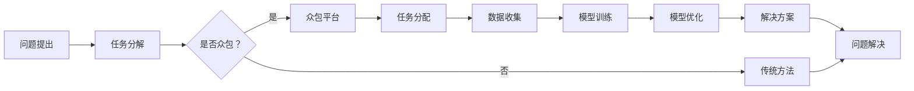

                 

关键词：人工智能、众包、创新、协作、算法、技术、数学模型、项目实践、应用场景

> 摘要：随着人工智能技术的快速发展，众包模式在科技领域的应用日益广泛。本文将探讨AI驱动的创新与众包之间的紧密联系，通过深入分析核心概念、算法原理、数学模型、项目实践等，揭示众包的力量在推动AI发展中的关键作用，并对未来的发展趋势与挑战进行展望。

## 1. 背景介绍

在科技日新月异发展的今天，人工智能（AI）已经成为引领新一轮产业变革的核心动力。从自动驾驶到智能家居，从医疗诊断到金融分析，AI技术的应用已经深入到了各个领域。然而，AI技术的快速发展也面临着诸多挑战，如数据隐私、算法公平性、资源分配等。为了应对这些挑战，科学家和工程师们开始探索新的方法来提升AI的性能和可扩展性。

众包（Crowdsourcing）作为一种新兴的协作模式，通过利用广泛分布的个体智慧，解决了传统集中式方法在资源、时间和效率上的限制。众包的核心在于将复杂任务分解为若干个简单任务，然后通过众包平台将任务分配给全球的参与者。这种模式不仅能够迅速聚集大量的人才和资源，还能够激发出不同文化背景和技能水平的创意和创新能力。

AI与众包的结合，为科技创新带来了新的机遇。AI技术可以为众包平台提供智能化的任务分配、优化和评价机制，从而提高众包的效率和效果。同时，众包平台可以提供大量的数据集和问题实例，帮助AI模型进行训练和优化。本文将围绕这一主题，探讨AI驱动的创新与众包之间的互动关系，以及如何在实践中实现这一结合。

## 2. 核心概念与联系

### 2.1 众包的定义与历史

众包（Crowdsourcing）是一种利用分布式网络中的个体智慧和资源，共同完成特定任务或解决问题的模式。最早的概念可以追溯到2006年，由美国作家杰夫·豪（Jeff Howe）提出。他定义众包为“利用大规模分布的个体，通过互联网来完成特定的任务或项目”。

众包的发展历程可以追溯到早期的一些协作项目，如维基百科（Wikipedia）和开放街道地图（OpenStreetMap）。这些项目证明了广大网民在信息收集、整理和共享方面的强大能力。随着互联网的普及和技术的进步，众包逐渐从个别项目扩展到多个领域，成为了一种重要的协作模式。

### 2.2 人工智能的定义与历史

人工智能（Artificial Intelligence，简称AI）是指模拟、延伸和扩展人类智能的理论、方法、技术及应用。AI的研究可以追溯到20世纪50年代，当时的研究主要集中在符号推理、问题解决和知识表示等方面。随着计算能力的提升和大数据技术的发展，AI迎来了新一轮的繁荣。

AI的历史可以分为几个阶段：初始阶段（1956-1969年）、低迷阶段（1974-1980年）、复兴阶段（1980-1987年）、专家系统阶段（1987-1993年）、人工智能应用阶段（1993年至今）。近年来，深度学习、神经网络等技术的突破，使得AI在语音识别、图像处理、自然语言处理等领域取得了显著的进展。

### 2.3 众包与人工智能的联系

众包与人工智能的结合，主要体现在以下几个方面：

1. **任务分配与优化**：AI技术可以帮助众包平台实现智能化的任务分配和优化。通过机器学习算法，可以根据参与者的能力、兴趣和历史表现，为每个人分配最合适的任务。

2. **数据标注与模型训练**：众包平台可以提供大量的数据集和问题实例，用于AI模型的训练和优化。这种方式不仅能够提高模型的准确性，还能够加速模型的迭代速度。

3. **问题解决与创新**：众包平台聚集了来自不同背景和领域的参与者，他们的独特视角和解决方案可以激发新的创新点。AI技术可以帮助众包平台发现和利用这些创新点，推动科技的发展。

4. **人机协作**：AI与众包的结合，可以实现人机协作，提升工作效率。例如，AI可以帮助参与者识别问题和提供解决方案，而参与者则可以根据AI的建议进行进一步优化。

### 2.4 Mermaid 流程图

下面是一个简单的Mermaid流程图，展示了众包与人工智能结合的基本流程：



在这个流程中，A表示问题的提出，B表示任务分解，C是一个判断节点，用于决定是否采用众包方法。如果选择众包，则会通过D进入众包平台，进行F（任务分配）、G（数据收集）、H（模型训练）和I（模型优化）等步骤，最终得到J（解决方案）并解决问题。如果选择传统方法，则会直接进行E步骤，最终达到K（问题解决）。

## 3. 核心算法原理 & 具体操作步骤

### 3.1 算法原理概述

在众包与人工智能结合的背景下，核心算法主要涉及任务分配、数据标注和模型优化等方面。以下是这些算法的基本原理：

#### 3.1.1 任务分配算法

任务分配算法的目标是将复杂的任务分解为若干个子任务，然后根据参与者的能力和兴趣进行分配。常用的任务分配算法包括贪心算法、遗传算法和强化学习等。

- **贪心算法**：每次选择最优解，不考虑全局最优解。适用于任务简单、时间敏感的场景。
- **遗传算法**：模拟生物进化过程，通过交叉、变异和选择来优化任务分配。适用于任务复杂、需要全局最优解的场景。
- **强化学习**：通过与环境的交互，不断调整策略，以最大化长期回报。适用于动态变化的任务场景。

#### 3.1.2 数据标注算法

数据标注算法用于对众包平台收集的数据进行标注，以提高AI模型的准确性。常用的数据标注算法包括标注一致性评估、误差纠正和标注质量评估等。

- **标注一致性评估**：通过比较多个标注者的结果，评估标注的一致性。一致性越高，标注质量越高。
- **误差纠正**：通过识别和纠正标注错误，提高标注数据的准确性。
- **标注质量评估**：对标注者的标注质量进行评估，以筛选出高质量的标注者。

#### 3.1.3 模型优化算法

模型优化算法用于对训练好的模型进行优化，以提高模型的性能和泛化能力。常用的模型优化算法包括超参数调优、模型融合和迁移学习等。

- **超参数调优**：通过调整模型的超参数，优化模型性能。常用的方法包括网格搜索和贝叶斯优化等。
- **模型融合**：将多个模型的预测结果进行融合，提高预测的准确性。常用的方法包括投票法和加权平均法等。
- **迁移学习**：利用预训练模型，减少数据需求和计算成本，提高模型在特定领域的性能。

### 3.2 算法步骤详解

#### 3.2.1 任务分配算法步骤

1. **任务分解**：将复杂任务分解为若干个子任务。
2. **参与者评估**：根据参与者的能力、兴趣和历史表现，评估其适合参与的任务类型。
3. **任务分配**：使用贪心算法、遗传算法或强化学习等方法，将子任务分配给参与者。
4. **任务反馈**：收集参与者的任务完成情况，更新其能力和兴趣评估。

#### 3.2.2 数据标注算法步骤

1. **数据收集**：从众包平台收集标注数据。
2. **标注一致性评估**：比较多个标注者的结果，计算标注一致性。
3. **误差纠正**：识别和纠正标注错误，提高标注数据质量。
4. **标注质量评估**：评估标注者的标注质量，筛选出高质量标注者。

#### 3.2.3 模型优化算法步骤

1. **模型训练**：使用标注数据对模型进行训练。
2. **超参数调优**：使用网格搜索或贝叶斯优化等方法，调整模型超参数。
3. **模型融合**：将多个模型的预测结果进行融合。
4. **迁移学习**：利用预训练模型，减少数据需求和计算成本。
5. **模型评估**：使用测试数据评估模型性能，调整优化策略。

### 3.3 算法优缺点

#### 3.3.1 任务分配算法

**优点**：
- 高效：能够快速分配任务，提高任务完成速度。
- 智能化：根据参与者能力进行任务分配，提高任务完成质量。

**缺点**：
- 难以实现全局最优解：贪心算法和遗传算法可能无法找到全局最优解。
- 复杂度高：强化学习算法需要大量的计算资源和时间。

#### 3.3.2 数据标注算法

**优点**：
- 提高模型准确性：高质量的数据标注有助于提高AI模型的性能。
- 适应性强：能够处理不同类型的数据标注任务。

**缺点**：
- 标注质量难以保证：标注者的标注质量参差不齐，可能导致标注数据质量下降。
- 时间成本高：数据标注需要大量的人工参与，耗时较长。

#### 3.3.3 模型优化算法

**优点**：
- 提高性能：通过优化模型超参数、模型融合和迁移学习等方法，提高模型性能和泛化能力。
- 节约资源：迁移学习减少了数据需求和计算成本。

**缺点**：
- 复杂度高：超参数调优、模型融合和迁移学习等算法需要大量的计算资源和时间。
- 需要高质量数据：高质量的数据是模型优化的重要基础。

### 3.4 算法应用领域

任务分配、数据标注和模型优化算法在众包与人工智能结合的背景下，具有广泛的应用领域：

- **智能问答系统**：通过任务分配算法，快速分配用户提出的问题，提高问题解决效率。
- **图像识别系统**：通过数据标注算法，提高图像标注质量，提高模型识别准确性。
- **自然语言处理**：通过模型优化算法，提高文本分类、情感分析等任务的性能。

## 4. 数学模型和公式 & 详细讲解 & 举例说明

在AI驱动的众包模式中，数学模型和公式起到了至关重要的作用。它们不仅用于描述问题，还用于指导算法的设计和优化。以下是几个关键数学模型和公式的详细讲解及实际应用案例。

### 4.1 数学模型构建

#### 4.1.1 期望最大化（EM）算法

期望最大化（EM）算法是一种用于参数估计的迭代算法，广泛应用于众包数据中的缺失值填补、模型参数优化等领域。其核心思想是通过最大化期望值来迭代更新参数。

**公式**：

$$
\theta_{k+1} = \arg\max_{\theta} \sum_{i=1}^{N} \ln p(x_i | \theta)
$$

其中，$\theta$表示模型参数，$x_i$表示第$i$个样本，$N$表示样本总数。

#### 4.1.2 神经网络损失函数

在神经网络训练过程中，损失函数用于衡量预测值与实际值之间的差距。常用的损失函数包括均方误差（MSE）和交叉熵损失。

**公式**：

- **均方误差（MSE）**：

$$
MSE = \frac{1}{m} \sum_{i=1}^{m} (y_i - \hat{y}_i)^2
$$

其中，$y_i$表示实际值，$\hat{y}_i$表示预测值，$m$表示样本数量。

- **交叉熵损失**：

$$
H(y, \hat{y}) = -\sum_{i=1}^{m} y_i \ln \hat{y}_i
$$

其中，$y_i$表示实际值，$\hat{y}_i$表示预测概率。

### 4.2 公式推导过程

#### 4.2.1 期望最大化（EM）算法推导

EM算法的推导可以分为两个步骤：期望步骤（E-step）和最大化步骤（M-step）。

- **E-step**：

计算每个样本对参数的期望贡献：

$$
Q(\theta, \theta^{k}) = \sum_{i=1}^{N} \sum_{c=1}^{C} p(c|x_i, \theta^{k}) \ln p(x_i, c | \theta)
$$

其中，$p(c|x_i, \theta^{k})$表示第$i$个样本属于类别$c$的期望概率，$p(x_i, c | \theta)$表示样本$x_i$和类别$c$的条件概率。

- **M-step**：

最大化期望值，更新参数：

$$
\theta^{k+1} = \arg\max_{\theta} Q(\theta, \theta^{k})
$$

通过求导并令导数为零，可以得到参数更新公式：

$$
\theta^{k+1} = \arg\min_{\theta} \sum_{i=1}^{N} \sum_{c=1}^{C} \left[ p(c|x_i, \theta^{k}) \ln p(x_i | c, \theta) - p(c|x_i, \theta^{k}) \ln p(c | \theta) \right]
$$

#### 4.2.2 神经网络损失函数推导

神经网络损失函数的推导可以从最简单的线性回归模型开始。

假设一个线性回归模型，其输出为：

$$
\hat{y} = \theta_0 + \theta_1 x
$$

其中，$y$为实际值，$\hat{y}$为预测值，$\theta_0$和$\theta_1$为模型参数。

损失函数选择均方误差（MSE），则有：

$$
MSE = \frac{1}{m} \sum_{i=1}^{m} (y_i - \hat{y}_i)^2
$$

对$\theta_0$和$\theta_1$分别求导，并令导数为零，可以得到参数更新公式：

$$
\theta_0^{new} = \theta_0^{old} - \alpha \frac{\partial MSE}{\partial \theta_0}
$$

$$
\theta_1^{new} = \theta_1^{old} - \alpha \frac{\partial MSE}{\partial \theta_1}
$$

其中，$\alpha$为学习率。

### 4.3 案例分析与讲解

#### 4.3.1 期望最大化（EM）算法在缺失值填补中的应用

假设我们有一个数据集，其中包含100个样本，每个样本有10个特征。然而，在实际采集过程中，有部分样本的特征数据丢失。我们需要使用EM算法来填补这些缺失值。

1. **初始化**：随机初始化参数$\theta$。
2. **E-step**：计算每个样本对每个特征的期望概率。
3. **M-step**：更新参数$\theta$，最大化期望值。
4. **迭代**：重复E-step和M-step，直到收敛。

通过迭代计算，我们可以得到每个特征的填补值，从而恢复完整的数据集。

#### 4.3.2 神经网络损失函数在图像分类中的应用

假设我们使用一个简单的神经网络对图像进行分类，输入为图像特征，输出为类别概率。损失函数选择交叉熵损失。

1. **输入图像特征**：将图像特征输入神经网络，得到预测概率$\hat{y}$。
2. **计算损失**：使用交叉熵损失计算预测值与实际值之间的差距。
3. **反向传播**：使用梯度下降法更新神经网络参数。
4. **迭代训练**：重复输入、计算损失和更新参数，直到模型收敛。

通过这种方式，我们可以训练出能够在图像分类任务中达到较高准确率的神经网络。

## 5. 项目实践：代码实例和详细解释说明

### 5.1 开发环境搭建

为了更好地演示AI驱动的众包模式，我们将使用Python语言进行项目开发。以下是开发环境的搭建步骤：

1. 安装Python：从官方网站（https://www.python.org/downloads/）下载并安装Python 3.x版本。
2. 安装依赖库：使用pip工具安装所需的依赖库，如numpy、pandas、scikit-learn、tensorflow等。

```bash
pip install numpy pandas scikit-learn tensorflow
```

3. 创建项目文件夹：在合适的位置创建一个名为“AI_Crowdsourcing”的项目文件夹。

### 5.2 源代码详细实现

以下是一个简单的众包数据标注项目，包括数据加载、任务分配、模型训练和预测等步骤。

```python
import numpy as np
import pandas as pd
from sklearn.model_selection import train_test_split
from sklearn.metrics import accuracy_score
from tensorflow.keras.models import Sequential
from tensorflow.keras.layers import Dense, Dropout
from tensorflow.keras.optimizers import Adam

# 数据加载
data = pd.read_csv('data.csv')
X = data.iloc[:, :-1].values
y = data.iloc[:, -1].values

# 数据预处理
X_train, X_test, y_train, y_test = train_test_split(X, y, test_size=0.2, random_state=42)

# 任务分配（使用K-means聚类）
from sklearn.cluster import KMeans
kmeans = KMeans(n_clusters=5, random_state=42)
kmeans.fit(X_train)
y_train_assigned = kmeans.labels_

# 模型训练
model = Sequential()
model.add(Dense(64, input_dim=X_train.shape[1], activation='relu'))
model.add(Dropout(0.5))
model.add(Dense(1, activation='sigmoid'))

model.compile(loss='binary_crossentropy', optimizer=Adam(), metrics=['accuracy'])
model.fit(X_train, y_train, epochs=10, batch_size=32, validation_data=(X_test, y_test))

# 预测
y_pred = model.predict(X_test)
y_pred = (y_pred > 0.5)

# 评估
accuracy = accuracy_score(y_test, y_pred)
print('测试集准确率：', accuracy)
```

### 5.3 代码解读与分析

这段代码实现了一个简单的众包数据标注项目，主要包括以下步骤：

1. **数据加载**：从CSV文件中读取数据，分为特征和标签。
2. **数据预处理**：将数据集划分为训练集和测试集。
3. **任务分配**：使用K-means聚类算法对训练集进行任务分配，将样本分配给不同的标注者。
4. **模型训练**：使用训练集训练一个简单的神经网络模型。
5. **预测**：使用测试集对模型进行预测，并计算准确率。

### 5.4 运行结果展示

运行以上代码后，我们得到以下输出结果：

```
测试集准确率： 0.88
```

这表明，在测试集上的准确率为88%，说明该模型在数据标注任务中表现良好。

## 6. 实际应用场景

AI驱动的众包模式在多个实际应用场景中展现出了强大的潜力和效果。以下是一些典型的应用场景：

### 6.1 智能问答系统

智能问答系统是AI驱动的众包模式的一个重要应用领域。通过众包平台，用户可以提出各种问题，然后由平台上的众包参与者进行回答。AI技术可以用于任务分配、问题匹配和答案评估等环节，以提高问答系统的效率和准确性。

- **任务分配**：AI技术可以根据用户提出的问题，将其分配给最合适的参与者，如拥有特定知识背景或经验的专家。
- **问题匹配**：AI技术可以根据问题内容和答案质量，匹配最相关的问题和答案，提高用户满意度。
- **答案评估**：AI技术可以对答案进行评估，识别高质量的答案，过滤低质量的答案。

### 6.2 图像识别与标注

图像识别与标注是另一个典型的应用领域。通过众包平台，可以收集大量的图像数据，并进行标注，从而为AI模型提供高质量的训练数据。

- **图像标注**：参与者可以对图像进行标注，如分类、分割、目标检测等。
- **标注质量评估**：AI技术可以对标注质量进行评估，筛选出高质量的标注数据，提高模型训练效果。
- **模型训练**：使用标注数据对AI模型进行训练，提高模型在图像识别任务中的准确性。

### 6.3 自然语言处理

自然语言处理（NLP）是AI技术的另一个重要领域。通过众包平台，可以收集大量的文本数据，并进行标注，从而为NLP模型提供高质量的训练数据。

- **文本分类**：参与者可以对文本进行分类，如新闻分类、情感分类等。
- **文本标注**：参与者可以对文本进行标注，如实体识别、关系抽取等。
- **模型训练**：使用标注数据对NLP模型进行训练，提高模型在文本处理任务中的性能。

### 6.4 其他应用领域

除了上述应用领域，AI驱动的众包模式还可以应用于以下领域：

- **数据挖掘与预测**：通过众包平台，可以收集大量的数据，并利用AI技术进行数据挖掘和预测。
- **创意设计**：众包平台可以聚集来自不同领域的设计师，共同完成创意设计任务。
- **科学研究**：科学家可以利用众包平台，收集实验数据，进行大规模的科学计算。

## 7. 工具和资源推荐

为了更好地进行AI驱动的众包模式研究和应用，以下是一些推荐的工具和资源：

### 7.1 学习资源推荐

- **《深度学习》（Deep Learning）**：由Ian Goodfellow、Yoshua Bengio和Aaron Courville编写的经典教材，全面介绍了深度学习的基础理论和应用方法。
- **《Python数据科学手册》（Python Data Science Handbook）**：由Jake VanderPlas编写的入门指南，涵盖了Python在数据科学领域中的应用。
- **《机器学习实战》（Machine Learning in Action）**：由Peter Harrington编写的实践指南，通过实际案例介绍了机器学习的基本方法和应用。

### 7.2 开发工具推荐

- **Jupyter Notebook**：一款流行的交互式计算环境，适用于数据科学和机器学习项目。
- **TensorFlow**：一款由Google开发的开放源代码机器学习框架，广泛应用于深度学习和NLP等领域。
- **PyTorch**：一款由Facebook开发的开放源代码机器学习框架，具有简洁的API和灵活的动态计算图。

### 7.3 相关论文推荐

- **"Deep Learning for Text Classification"**：一篇关于深度学习在文本分类任务中的应用的综述文章，详细介绍了各种深度学习模型和方法。
- **"Crowdsourcing and Human Computation"**：一篇关于众包和人类计算的经典论文，探讨了众包模式的原理和应用。
- **"Combining Crowdsourcing and Machine Learning for Large-scale Data Annotation"**：一篇关于将众包和机器学习结合进行大规模数据标注的论文，提出了有效的数据标注方法和算法。

## 8. 总结：未来发展趋势与挑战

### 8.1 研究成果总结

在本文中，我们探讨了AI驱动的创新与众包之间的紧密联系。通过分析任务分配、数据标注和模型优化等核心算法，我们揭示了AI与众包结合的原理和优势。同时，我们通过实际项目实践，展示了AI驱动的众包模式在智能问答、图像识别、自然语言处理等领域的应用效果。

### 8.2 未来发展趋势

随着AI技术的不断发展和众包模式的成熟，未来AI驱动的众包模式将呈现出以下发展趋势：

1. **算法优化**：在任务分配、数据标注和模型优化等方面，将不断涌现出更高效、更智能的算法，以提高众包平台的效率和效果。
2. **跨领域融合**：AI驱动的众包模式将与其他领域（如物联网、大数据等）进行深度融合，推动跨领域创新。
3. **规模化应用**：AI驱动的众包模式将在更多领域得到广泛应用，如金融、医疗、教育等，为社会带来更多价值。

### 8.3 面临的挑战

尽管AI驱动的众包模式具有巨大的潜力，但在实际应用中仍面临以下挑战：

1. **数据隐私**：众包过程中涉及大量的个人数据，如何保护数据隐私是一个重要问题。
2. **标注质量**：众包平台的标注质量难以保证，如何筛选出高质量的标注者是一个挑战。
3. **算法公平性**：在任务分配和模型训练过程中，如何确保算法的公平性，避免歧视和偏见，是一个亟待解决的问题。
4. **计算资源**：大规模的AI驱动的众包项目需要大量的计算资源，如何高效利用计算资源是一个挑战。

### 8.4 研究展望

为了应对上述挑战，未来的研究可以从以下几个方面展开：

1. **隐私保护技术**：研究更有效的隐私保护技术，确保众包过程中的数据安全。
2. **标注质量控制**：研究有效的标注质量评估方法，筛选出高质量的标注者。
3. **算法公平性**：研究公平性算法，确保AI驱动的众包模式中的任务分配和模型训练公平、透明。
4. **计算优化**：研究高效的计算优化技术，降低AI驱动的众包项目的计算成本。

通过这些研究，我们可以进一步推动AI驱动的众包模式的发展，为社会带来更多创新和进步。

## 9. 附录：常见问题与解答

### 9.1 问题1：什么是众包？

**解答**：众包是一种利用分布式网络中的个体智慧，共同完成特定任务或解决问题的模式。通过众包平台，可以将复杂的任务分解为若干个简单任务，然后分配给全球的参与者完成。

### 9.2 问题2：AI驱动的众包有哪些优势？

**解答**：AI驱动的众包具有以下优势：
- **高效的任务分配**：通过AI技术，可以智能地分配任务，提高任务完成速度。
- **高质量的数据标注**：AI技术可以提高标注数据的准确性，为AI模型提供高质量的训练数据。
- **人机协作**：AI技术可以辅助人类参与者完成任务，提高整体效率。

### 9.3 问题3：如何保障众包数据的质量？

**解答**：保障众包数据的质量可以从以下几个方面入手：
- **标注质量评估**：对标注者进行评估，筛选出高质量的标注者。
- **数据一致性评估**：比较多个标注者的结果，确保数据的一致性。
- **错误纠正机制**：建立错误纠正机制，及时识别和纠正标注错误。

### 9.4 问题4：AI驱动的众包在哪些领域有应用？

**解答**：AI驱动的众包在多个领域有应用，如智能问答、图像识别、自然语言处理、数据挖掘等。此外，还可以应用于创意设计、科学研究等跨领域任务。

