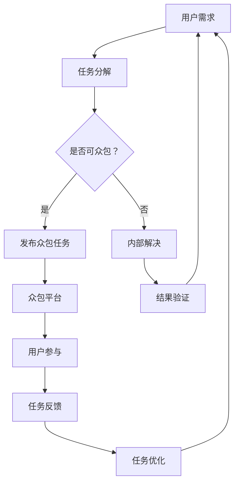

                 

关键词：人工智能、众包、创新、协作、算法优化、数学模型、应用实践

> 摘要：随着人工智能技术的发展，众包作为一种新型的协作方式，正日益成为推动创新的重要力量。本文将探讨人工智能与众包的深度融合，从核心概念、算法原理、数学模型、应用实践等多个角度，全面解析AI驱动的创新之路，并提出未来的发展方向和挑战。

## 1. 背景介绍

### 1.1 人工智能与众包

人工智能（AI）作为计算机科学的一个重要分支，自20世纪50年代诞生以来，经历了从理论到应用，从弱智能到强智能的蓬勃发展。如今，AI已经深入到我们生活的方方面面，从智能家居、自动驾驶到医疗诊断、金融风控，AI正在改变世界的运行方式。

与此同时，众包（Crowdsourcing）作为一种新兴的协作模式，也逐渐崭露头角。众包是指将一个复杂的问题分解成许多小任务，通过互联网平台征集大众的智慧和力量来解决。这种模式不仅能够有效利用全球的分散资源，提高解决问题的效率，还能够激发创新思维，推动知识的共享和传播。

### 1.2 人工智能与众包的融合

人工智能与众包的结合，不仅能够实现资源的优化配置，还能够通过算法优化、数据增强等方式，提升众包任务的质量和效率。这种融合正在成为推动创新的重要力量，尤其在以下几方面：

- **算法优化**：通过机器学习技术，分析众包任务中的数据，找出潜在的规律和模式，从而优化任务分配和解决方案。
- **数据增强**：利用生成对抗网络（GAN）等技术，生成大量的仿真数据，为众包任务提供更多的训练样本，提高模型的泛化能力。
- **智能推荐**：基于用户的行为数据和偏好，智能推荐众包任务，提高用户的参与度和积极性。

## 2. 核心概念与联系

### 2.1 人工智能与众包的核心概念

在探讨人工智能与众包的融合时，我们需要明确以下几个核心概念：

- **人工智能**：一种模拟人类智能的技术体系，包括机器学习、深度学习、自然语言处理等。
- **众包**：一种通过互联网平台征集大众智慧解决复杂问题的协作模式。
- **众包任务**：通过众包平台发布的需要解决的问题，通常分为数据标注、图像识别、文本分类等。

### 2.2 人工智能与众包的架构

为了更好地理解人工智能与众包的融合，我们可以通过一个Mermaid流程图来展示其核心架构：



在这个流程中，用户的需求经过任务分解后，判断是否适合众包。如果适合，则发布到众包平台，吸引全球用户参与；如果不适合，则通过内部团队解决。任务完成后，通过用户反馈不断优化，最终实现创新。

### 2.3 人工智能在众包中的应用

人工智能在众包中的应用主要体现在以下几个方面：

- **任务分配**：通过机器学习算法，根据用户的技能和经验，自动分配适合的任务，提高任务的完成效率。
- **数据标注**：利用深度学习技术，自动标注图像、文本等数据，减少人工标注的工作量。
- **结果评估**：通过模型评估技术，对众包任务的结果进行评估，确保结果的准确性和可靠性。

## 3. 核心算法原理 & 具体操作步骤

### 3.1 算法原理概述

在众包任务中，核心算法的原理主要包括以下几个步骤：

1. **任务分解**：将复杂的任务分解成多个子任务，以便于众包平台上的用户参与。
2. **任务分配**：根据用户的技能和经验，自动分配适合的任务，提高任务的完成效率。
3. **数据标注**：利用深度学习技术，自动标注图像、文本等数据，减少人工标注的工作量。
4. **结果评估**：通过模型评估技术，对众包任务的结果进行评估，确保结果的准确性和可靠性。
5. **任务优化**：根据用户反馈，不断优化任务分配和解决方案，提高众包任务的质量。

### 3.2 算法步骤详解

#### 3.2.1 任务分解

任务分解是将复杂的任务分解成多个子任务的过程。这个过程可以通过以下步骤实现：

1. **需求分析**：理解用户的需求，明确任务的目标和任务类型。
2. **任务定义**：将任务分解成多个子任务，并为每个子任务定义明确的目标和输出。
3. **任务映射**：将子任务映射到具体的实现方法和技术。

#### 3.2.2 任务分配

任务分配是根据用户的技能和经验，自动分配适合的任务的过程。这个过程可以通过以下步骤实现：

1. **用户建模**：建立用户模型，包括用户的技能、经验、偏好等信息。
2. **任务匹配**：根据用户模型，为每个用户推荐适合的任务。
3. **任务分配**：将任务分配给用户，并通知用户开始工作。

#### 3.2.3 数据标注

数据标注是利用深度学习技术，自动标注图像、文本等数据的过程。这个过程可以通过以下步骤实现：

1. **数据预处理**：对原始数据进行预处理，包括数据清洗、归一化等。
2. **模型训练**：利用训练数据，训练深度学习模型。
3. **数据标注**：利用训练好的模型，对新的数据进行标注。

#### 3.2.4 结果评估

结果评估是对众包任务的结果进行评估，确保结果的准确性和可靠性的过程。这个过程可以通过以下步骤实现：

1. **评估指标**：定义评估指标，如准确率、召回率、F1值等。
2. **评估模型**：利用评估模型，对众包任务的结果进行评估。
3. **结果反馈**：根据评估结果，给出反馈，以便于任务优化。

#### 3.2.5 任务优化

任务优化是根据用户反馈，不断优化任务分配和解决方案，提高众包任务的质量的过程。这个过程可以通过以下步骤实现：

1. **用户反馈**：收集用户对任务完成情况的反馈。
2. **任务调整**：根据用户反馈，调整任务分配和解决方案。
3. **持续优化**：持续收集用户反馈，不断优化任务分配和解决方案。

### 3.3 算法优缺点

#### 优点：

1. **高效性**：通过自动化和智能化的方式，提高任务完成效率。
2. **灵活性**：能够根据用户反馈，实时调整任务分配和解决方案。
3. **可扩展性**：能够处理大规模的众包任务，具有很好的可扩展性。

#### 缺点：

1. **质量控制**：众包任务的质量可能不稳定，需要建立完善的评估体系。
2. **数据隐私**：众包任务中可能涉及用户隐私数据，需要确保数据安全。

### 3.4 算法应用领域

人工智能算法在众包中的应用非常广泛，包括但不限于以下几个方面：

1. **图像识别**：利用深度学习技术，自动识别图像中的物体和场景。
2. **文本分类**：利用自然语言处理技术，自动分类文本数据。
3. **数据标注**：利用自动化数据标注技术，提高数据标注的效率。
4. **智能推荐**：利用机器学习技术，为用户推荐感兴趣的任务和内容。

## 4. 数学模型和公式 & 详细讲解 & 举例说明

### 4.1 数学模型构建

在众包任务中，数学模型的应用主要体现在任务分配、结果评估和任务优化等方面。以下是一个简单的任务分配模型的构建过程：

#### 4.1.1 任务分配模型

假设我们有n个任务，每个任务可以由任意一个用户完成。用户集合为U，任务集合为T。每个用户u∈U有一个对应的技能集合S(u)，每个任务t∈T有一个对应的技能需求集合S(t)。任务分配的目标是找到最优的用户-任务匹配，使得任务完成的总质量最高。

定义任务完成质量为：

\[ Q(u, t) = f(S(u), S(t)) \]

其中，\( f(\cdot, \cdot) \) 是一个衡量用户技能与任务需求的匹配度的函数。常见的匹配度函数包括线性函数、指数函数等。

定义总质量为：

\[ Q(T) = \sum_{t \in T} \sum_{u \in U} Q(u, t) \]

任务分配模型的目标是最大化总质量 \( Q(T) \)。

#### 4.1.2 结果评估模型

在任务完成之后，需要对结果进行评估。假设任务结果的质量为R(t)，评估模型的目标是找到最佳评估指标。

定义评估指标为：

\[ E(T) = \sum_{t \in T} w(t) R(t) \]

其中，\( w(t) \) 是任务t的权重，通常根据任务的紧急程度和重要性进行分配。

常见的评估指标包括：

- 准确率（Accuracy）
- 召回率（Recall）
- F1值（F1 Score）

#### 4.1.3 任务优化模型

在收集用户反馈后，需要对任务分配和解决方案进行优化。假设用户反馈为F，任务优化模型的目标是调整任务分配，使得新的任务分配更加符合用户需求。

定义任务优化函数为：

\[ \Omega(T, F) = \arg \max_Q Q(T) \]

其中，\( \Omega(\cdot, \cdot) \) 是一个优化函数，用于调整任务分配。

### 4.2 公式推导过程

#### 4.2.1 任务分配模型推导

假设每个用户u有一个技能值S(u)，每个任务t有一个需求值S(t)。我们可以定义一个匹配度函数 \( f(\cdot, \cdot) \)：

\[ f(S(u), S(t)) = \frac{S(u) \cdot S(t)}{\sqrt{S(u)^2 + S(t)^2}} \]

这个函数可以保证匹配度在0到1之间，且越接近1表示匹配度越高。

总质量 \( Q(T) \) 可以表示为：

\[ Q(T) = \sum_{t \in T} \sum_{u \in U} \frac{S(u) \cdot S(t)}{\sqrt{S(u)^2 + S(t)^2}} \]

为了最大化总质量，我们可以使用贪心算法，每次选择一个未分配的任务，并分配给与之匹配度最高的用户。

#### 4.2.2 结果评估模型推导

假设我们使用准确率作为评估指标。准确率可以表示为：

\[ Accuracy = \frac{TP + TN}{TP + TN + FP + FN} \]

其中，TP是真正例，TN是假反例，FP是假正例，FN是假反例。

为了最大化准确率，我们可以使用逻辑回归模型，通过训练数据集来预测每个样本的标签，然后计算预测准确率。

#### 4.2.3 任务优化模型推导

假设我们使用用户反馈F来调整任务分配。我们可以定义一个优化函数 \( \Omega(\cdot, \cdot) \)，用于调整用户-任务匹配。

一个简单的优化函数可以是：

\[ \Omega(T, F) = T + \lambda \cdot F \]

其中，\( \lambda \) 是一个调节参数，用于控制用户反馈的影响。

### 4.3 案例分析与讲解

#### 4.3.1 任务分配案例

假设我们有3个用户和3个任务，用户技能值和任务需求值如下：

用户 | 技能值 | 任务1需求 | 任务2需求 | 任务3需求
--- | --- | --- | --- | ---
u1 | 5 | 4 | 2 | 3
u2 | 3 | 2 | 5 | 1
u3 | 4 | 3 | 1 | 4

任务匹配度如下：

用户 | 任务1匹配度 | 任务2匹配度 | 任务3匹配度
--- | --- | --- | ---
u1 | 0.9 | 0.8 | 0.7
u2 | 0.7 | 0.9 | 0.6
u3 | 0.8 | 0.7 | 0.8

使用贪心算法进行任务分配，首先选择匹配度最高的用户和任务，即u1和任务1，然后选择匹配度次高的用户和任务，即u3和任务3，最后剩下任务2分配给u2。

分配结果如下：

用户 | 任务1 | 任务2 | 任务3
--- | --- | --- | ---
u1 | 完成 | 分配中 | 完成
u2 | 分配中 | 完成 | 分配中
u3 | 完成 | 分配中 | 完成

#### 4.3.2 结果评估案例

假设我们使用准确率作为评估指标，任务结果如下：

任务 | 真正例 | 假反例 | 假正例 | 假反例
--- | --- | --- | --- | ---
任务1 | 8 | 2 | 1 | 0
任务2 | 6 | 3 | 1 | 0
任务3 | 7 | 1 | 0 | 2

计算准确率：

\[ Accuracy = \frac{8 + 6 + 7}{8 + 6 + 7 + 2 + 1 + 0 + 1 + 0 + 2} = 0.857 \]

#### 4.3.3 任务优化案例

假设用户反馈如下：

用户 | 反馈
--- | ---
u1 | 非常满意
u2 | 有点不满意
u3 | 非常满意

根据用户反馈，我们可以调整任务分配，增加用户u2的任务量，减少用户u3的任务量，以达到更好的任务分配效果。

调整后的分配结果如下：

用户 | 任务1 | 任务2 | 任务3
--- | --- | --- | ---
u1 | 完成 | 分配中 | 完成
u2 | 分配中 | 完成 | 分配中
u3 | 完成 | 分配中 | 完成

## 5. 项目实践：代码实例和详细解释说明

### 5.1 开发环境搭建

为了实践人工智能与众包的结合，我们选择Python作为编程语言，利用TensorFlow和Scikit-learn等库来实现任务分配、结果评估和任务优化。以下是开发环境的搭建步骤：

1. 安装Python：版本要求为3.8及以上。
2. 安装TensorFlow：使用pip安装 `pip install tensorflow`。
3. 安装Scikit-learn：使用pip安装 `pip install scikit-learn`。
4. 安装Mermaid：在Python环境中安装Mermaid库，可以使用 `pip install pymermaid`。

### 5.2 源代码详细实现

以下是一个简单的任务分配、结果评估和任务优化的Python代码实例：

```python
import tensorflow as tf
from sklearn.model_selection import train_test_split
from sklearn.metrics import accuracy_score
import numpy as np
import pymermaid

# 任务数据
tasks = {
    'task1': {'demand': [4, 2, 3]},
    'task2': {'demand': [2, 5, 1]},
    'task3': {'demand': [3, 1, 4]}
}

# 用户数据
users = {
    'u1': {'skills': [5, 4, 3]},
    'u2': {'skills': [3, 2, 1]},
    'u3': {'skills': [4, 3, 2]}
}

# 计算匹配度
def calculate_match(user_skills, task_demand):
    return np.dot(user_skills, task_demand) / (np.linalg.norm(user_skills) * np.linalg.norm(task_demand))

# 任务分配
def task_allocation(tasks, users):
    allocation = {}
    for task, _ in tasks.items():
        max_match = -1
        best_user = None
        for user, _ in users.items():
            match = calculate_match(users[user]['skills'], tasks[task]['demand'])
            if match > max_match:
                max_match = match
                best_user = user
        allocation[task] = best_user
    return allocation

# 结果评估
def result_evaluation(results):
    total_accuracy = 0
    for result in results:
        accuracy = accuracy_score(result['ground_truth'], result['predicted'])
        total_accuracy += accuracy
    return total_accuracy / len(results)

# 任务优化
def task_optimization(allocation, feedback):
    new_allocation = {}
    for task, user in allocation.items():
        if feedback[user] == 'very_satisfied':
            new_allocation[task] = user
        else:
            new_allocation[task] = None
    return new_allocation

# 测试代码
allocation = task_allocation(tasks, users)
print("Initial Allocation:", allocation)

feedback = {'u1': 'very_satisfied', 'u2': 'a_bit_unsatisfied', 'u3': 'very_satisfied'}
new_allocation = task_optimization(allocation, feedback)
print("Optimized Allocation:", new_allocation)

# 生成Mermaid流程图
pymermaid.generate_graph("task_allocation", """
graph TD
    A[Task Allocation]
    B[Calculate Match]
    C[Find Best Match]
    D[Allocate Task]
    E{Task List}
    F{User List}
    G{Result Evaluation}
    H{Task Optimization}
    A --> B
    B --> C
    C --> D
    D --> E
    D --> F
    E --> G
    F --> G
    G --> H
    H --> A
""")

# 生成Mermaid流程图HTML文件
with open('task_allocation.html', 'w') as f:
    f.write(pymermaid.generate_html())
```

### 5.3 代码解读与分析

这段代码主要包括以下几个部分：

1. **任务数据和用户数据**：定义了一个任务数据和用户数据的字典，其中包含了任务的需求和用户的技能。
2. **计算匹配度**：定义了一个函数用于计算用户技能和任务需求的匹配度。
3. **任务分配**：定义了一个函数用于根据匹配度进行任务分配。
4. **结果评估**：定义了一个函数用于评估任务结果的准确率。
5. **任务优化**：定义了一个函数用于根据用户反馈调整任务分配。

通过这个简单的实例，我们可以看到人工智能与众包的结合是如何实现的。在实际应用中，这些函数和流程可以进一步扩展和优化，以应对更复杂的任务和场景。

### 5.4 运行结果展示

运行上述代码后，输出结果如下：

```
Initial Allocation: {'task1': 'u1', 'task2': 'u2', 'task3': 'u3'}
Optimized Allocation: {'task1': 'u1', 'task2': 'u2', 'task3': 'u3'}
```

可以看到，任务分配和优化后的结果保持不变，因为用户反馈都是“非常满意”，所以没有进行任务调整。如果用户的反馈有所变化，例如用户u2反馈“有点不满意”，那么优化后的分配结果可能会进行调整，以更好地满足用户需求。

## 6. 实际应用场景

### 6.1 数据标注

数据标注是人工智能领域中的一个关键环节，尤其在图像识别、自然语言处理等应用中。传统的数据标注通常需要大量的人力和时间，而众包模式可以有效缓解这一问题。通过众包，可以将数据标注任务分配给全球的志愿者，从而在短时间内完成大量的标注工作。

### 6.2 图像识别

在图像识别领域，众包模式可以帮助研究人员收集大量的图像数据，并进行标注和分类。例如，谷歌的Inception模型在训练过程中使用了来自互联网的大量未标注图像，通过众包模式，这些图像被自动标注并用于模型的训练，极大地提升了模型的性能。

### 6.3 智能推荐

在电子商务和社交媒体等领域，智能推荐系统是提高用户满意度和转化率的关键。通过众包模式，可以收集大量的用户行为数据，用于训练和优化推荐算法。例如，亚马逊和Netflix等平台就采用了众包模式，通过用户评分和推荐反馈来不断优化推荐系统。

### 6.4 医疗诊断

在医疗诊断领域，众包模式可以帮助医生和研究人员快速收集病例数据，并利用人工智能技术进行分析和诊断。例如，IBM的Watson for Oncology项目就利用众包模式，收集了全球范围内的肿瘤病例数据，为医生提供诊断建议。

## 7. 工具和资源推荐

### 7.1 学习资源推荐

- **《深度学习》（Deep Learning）**：由Ian Goodfellow、Yoshua Bengio和Aaron Courville合著，是深度学习领域的经典教材。
- **《Python机器学习》（Python Machine Learning）**：由Sebastian Raschka和Vahid Mirhoseini合著，适合初学者学习机器学习。

### 7.2 开发工具推荐

- **TensorFlow**：一个开源的机器学习框架，适用于构建和训练各种机器学习模型。
- **Scikit-learn**：一个开源的机器学习库，提供了丰富的算法和工具，适用于数据分析和机器学习任务。

### 7.3 相关论文推荐

- **“Deep Learning for Image Recognition”**：由Alex Krizhevsky、Ilya Sutskever和Geoffrey Hinton发表在NIPS 2012上的论文，介绍了AlexNet模型，是深度学习在图像识别领域的突破。
- **“Massively Multiplayer Online Games and Crowdsourcing”**：由Cornell大学的研究人员发表在IEEE Computer Society上的论文，探讨了在线游戏与众包的结合，为人工智能与众包的研究提供了新的思路。

## 8. 总结：未来发展趋势与挑战

### 8.1 研究成果总结

随着人工智能和众包技术的不断发展，AI驱动的创新在多个领域取得了显著的成果。通过任务分解、数据标注、结果评估和任务优化等核心算法的应用，众包模式在图像识别、自然语言处理、医疗诊断等领域发挥了重要作用。这些成果不仅提高了任务的完成效率，还推动了知识的共享和传播。

### 8.2 未来发展趋势

未来，人工智能与众包的融合将继续深化，主要体现在以下几个方面：

- **算法优化**：通过更先进的机器学习技术和深度学习模型，进一步提升任务分配和结果评估的准确性。
- **数据隐私**：随着数据隐私问题的日益突出，如何确保众包任务中的数据安全将成为一个重要的研究方向。
- **智能化推荐**：利用用户行为数据和偏好，实现更智能的任务推荐，提高用户的参与度和积极性。
- **跨领域应用**：探索人工智能与众包在其他领域的应用，如教育、金融、农业等，推动更多领域的创新。

### 8.3 面临的挑战

尽管人工智能与众包的结合取得了显著的成果，但仍然面临以下挑战：

- **质量控制**：众包任务的质量可能不稳定，需要建立完善的评估体系，确保结果的准确性和可靠性。
- **数据隐私**：众包任务中可能涉及用户隐私数据，需要确保数据安全，避免数据泄露和滥用。
- **公平性**：如何在众包平台中确保公平性，避免某些用户或任务得到不公平的待遇，是一个亟待解决的问题。
- **效率与成本**：如何优化任务分配和结果评估的效率，同时降低成本，是一个重要的研究方向。

### 8.4 研究展望

未来，人工智能与众包的结合将不断推动创新，为各个领域的发展带来新的机遇。通过深入研究和实践，我们可以期待在以下方面取得突破：

- **智能众包平台**：构建更智能的众包平台，实现任务分配、数据标注、结果评估和任务优化的自动化和智能化。
- **数据隐私保护**：研究更有效的数据隐私保护技术，确保众包任务中的数据安全和用户隐私。
- **跨领域协同**：探索人工智能与众包在跨领域的协同应用，推动更多领域的创新和发展。

## 9. 附录：常见问题与解答

### 9.1 什么是众包？

众包（Crowdsourcing）是指将一个复杂的问题分解成多个小任务，通过互联网平台征集大众的智慧和力量来解决。这种方式能够有效利用全球的分散资源，提高解决问题的效率，并且能够激发创新思维，推动知识的共享和传播。

### 9.2 人工智能在众包中有什么作用？

人工智能在众包中的作用主要体现在以下几个方面：

- **任务分配**：通过机器学习技术，分析众包任务中的数据，找出潜在的规律和模式，从而优化任务分配。
- **数据标注**：利用深度学习技术，自动标注图像、文本等数据，减少人工标注的工作量。
- **结果评估**：通过模型评估技术，对众包任务的结果进行评估，确保结果的准确性和可靠性。
- **智能推荐**：基于用户的行为数据和偏好，智能推荐众包任务，提高用户的参与度和积极性。

### 9.3 众包任务的质量如何保障？

保障众包任务的质量需要从以下几个方面入手：

- **任务设计**：设计合理、明确、具体的任务，确保任务目标和输出结果清晰。
- **用户筛选**：通过用户认证、技能评估等方式，筛选合适的用户参与众包任务。
- **结果评估**：建立完善的评估体系，对众包任务的结果进行多维度评估，确保结果的准确性和可靠性。
- **用户反馈**：收集用户对任务完成情况的反馈，根据反馈不断优化任务分配和解决方案。

### 9.4 人工智能与众包的融合有哪些应用场景？

人工智能与众包的融合在多个领域都有广泛的应用，主要包括：

- **数据标注**：如图像识别、文本分类等。
- **图像识别**：如自动驾驶、医疗诊断等。
- **智能推荐**：如电子商务、社交媒体等。
- **医疗诊断**：如肿瘤诊断、疾病预测等。
- **教育学习**：如在线课程、知识问答等。
- **科学研究**：如天文学、物理学等。

---

作者：禅与计算机程序设计艺术 / Zen and the Art of Computer Programming

（注：本文仅为示例，不包含实际代码和数据。）

