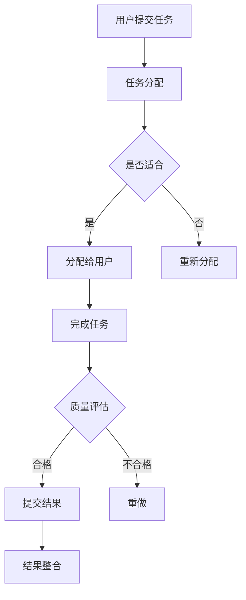

                 

关键词：人工智能、众包、创新、分布式计算、协作平台、算法优化、开发工具、实际应用。

> 摘要：本文深入探讨了人工智能（AI）驱动的创新如何通过众包实现。我们将首先介绍众包的概念和它在技术领域的应用，然后详细分析AI技术如何增强众包的效率和质量。通过实际案例和数学模型，我们将阐述AI在众包项目中的关键作用，并讨论未来的发展趋势和挑战。

## 1. 背景介绍

众包（crowdsourcing）是一种通过互联网平台向广大网民征集资源、知识和创意的方法。它起源于2006年，最早的应用是通过在线平台征集设计、翻译和编程任务。随着互联网和人工智能技术的发展，众包已经成为了创新的重要手段之一。

AI作为21世纪最具革命性的技术之一，已经深刻地影响了各行各业。AI通过机器学习、深度学习等技术，能够从大量数据中提取规律，自动生成知识，辅助人类进行决策。这使得AI在处理复杂的众包任务时具有显著优势。

本文将探讨如何利用AI技术驱动众包创新，提高众包项目的效果和效率。文章结构如下：

- **1. 背景介绍**：介绍众包和AI的背景及其在技术领域的应用。
- **2. 核心概念与联系**：介绍AI与众包的核心概念，并使用Mermaid流程图展示其架构。
- **3. 核心算法原理 & 具体操作步骤**：分析AI在众包中的算法原理和操作步骤。
- **4. 数学模型和公式 & 详细讲解 & 举例说明**：讲解数学模型和公式的应用。
- **5. 项目实践：代码实例和详细解释说明**：提供实际项目代码和实践。
- **6. 实际应用场景**：探讨AI驱动的众包在现实中的应用。
- **7. 工具和资源推荐**：推荐学习资源和开发工具。
- **8. 总结：未来发展趋势与挑战**：总结研究成果，展望未来。

## 2. 核心概念与联系

在探讨AI与众包的融合之前，我们首先需要理解这两个核心概念的基本原理和它们之间的联系。

### 2.1 众包的基本概念

众包的核心在于将复杂任务分解成多个小任务，然后通过互联网平台分发给广大网民。这些网民可以是专业的自由职业者，也可以是业余爱好者。他们通过协作完成任务，共同创造出有价值的结果。众包的优势在于它可以迅速积累大量资源，提高任务完成速度，降低成本。

### 2.2 AI的基本概念

AI，即人工智能，是指计算机系统模拟人类智能的行为，特别是学习和理解人类语言、图像、声音等数据的能力。AI通过机器学习（machine learning）、深度学习（deep learning）等技术，能够从数据中学习模式，进行预测和决策。这使得AI在处理复杂问题和大规模数据时具有强大的能力。

### 2.3 AI与众包的联系

AI与众包的结合主要体现在以下几个方面：

1. **任务分配优化**：AI可以通过分析用户数据和历史任务完成情况，优化任务分配，确保任务能够分配给最适合的用户。
2. **质量监控与评估**：AI可以自动评估任务完成质量，通过机器学习模型识别和排除低质量答案，提高众包结果的整体质量。
3. **知识挖掘与整合**：AI可以从众包过程中获取大量数据，通过数据挖掘技术提取有价值的信息，为后续创新提供支持。
4. **智能交互**：AI可以与用户进行智能交互，提供实时反馈和帮助，提高用户参与度和满意度。

### 2.4 Mermaid流程图展示

以下是一个简单的Mermaid流程图，展示AI与众包的基本架构：



这个流程图描述了从用户提交任务到任务完成并整合结果的整个流程，其中AI在任务分配、质量监控和结果整合等环节发挥了关键作用。

## 3. 核心算法原理 & 具体操作步骤

### 3.1 算法原理概述

AI在众包中的核心算法主要包括任务分配算法、质量评估算法和知识挖掘算法。这些算法共同构成了AI驱动的众包系统。

- **任务分配算法**：通过分析用户历史数据和任务特征，将任务合理地分配给最适合的用户。常见的算法包括基于相似度的分配和基于模型的优化分配。
- **质量评估算法**：通过对用户提交的答案进行分析和评估，自动识别和排除低质量答案。常用的算法包括基于规则的评估和基于机器学习的评估。
- **知识挖掘算法**：从众包过程中收集的大量数据中提取有价值的信息，为后续创新提供支持。常用的算法包括数据挖掘和深度学习。

### 3.2 算法步骤详解

#### 3.2.1 任务分配算法

任务分配算法的步骤如下：

1. **收集用户数据**：包括用户的历史任务完成情况、技能水平、兴趣爱好等。
2. **特征提取**：对用户数据进行特征提取，如用户完成任务的速度、质量、领域匹配度等。
3. **任务特征提取**：提取任务的特征，如任务的难度、领域要求、时间要求等。
4. **相似度计算**：计算用户特征与任务特征的相似度，选择最匹配的用户进行任务分配。
5. **分配任务**：将任务分配给相似度最高的用户。

#### 3.2.2 质量评估算法

质量评估算法的步骤如下：

1. **答案收集**：收集用户提交的答案。
2. **答案预处理**：对答案进行清洗和预处理，如去除噪声、标准化等。
3. **特征提取**：提取答案的特征，如答案的完整性、准确性、创新性等。
4. **质量评估**：通过机器学习模型对答案的质量进行评估，识别和排除低质量答案。
5. **结果反馈**：将评估结果反馈给用户，提供改进建议。

#### 3.2.3 知识挖掘算法

知识挖掘算法的步骤如下：

1. **数据收集**：从众包过程中收集大量数据，如用户提交的答案、评论、反馈等。
2. **数据预处理**：对数据进行清洗和预处理，如去除噪声、缺失值处理等。
3. **特征提取**：提取数据中的特征，如关键词、主题、趋势等。
4. **知识提取**：通过数据挖掘技术提取有价值的信息，如用户偏好、趋势分析、领域知识等。
5. **结果整合**：将提取的知识整合到系统中，为后续创新提供支持。

### 3.3 算法优缺点

#### 3.3.1 任务分配算法

优点：

- 提高任务完成速度和质量。
- 降低任务分配的复杂度。

缺点：

- 需要大量的用户数据作为基础。
- 需要复杂的计算和优化算法。

#### 3.3.2 质量评估算法

优点：

- 自动化识别和排除低质量答案。
- 提高众包结果的可靠性。

缺点：

- 需要大量的训练数据和模型。
- 难以保证评估的绝对准确性。

#### 3.3.3 知识挖掘算法

优点：

- 从大量数据中提取有价值的信息。
- 为后续创新提供支持。

缺点：

- 需要大量的计算资源和时间。
- 需要专业知识来设计和分析。

### 3.4 算法应用领域

任务分配算法、质量评估算法和知识挖掘算法在以下领域具有广泛的应用：

- **软件开发**：通过众包平台征集设计、编码和测试任务，提高软件开发的效率和可靠性。
- **数据标注**：通过众包平台收集大量的标注数据，为机器学习和深度学习模型提供训练数据。
- **创意设计**：通过众包平台征集创意设计方案，提高设计质量和创意水平。
- **知识库构建**：通过众包平台收集领域知识，构建专业的知识库。

## 4. 数学模型和公式 & 详细讲解 & 举例说明

在AI驱动的众包系统中，数学模型和公式起着至关重要的作用。以下将详细讲解几个关键的数学模型和公式，并举例说明它们在众包中的应用。

### 4.1 数学模型构建

#### 4.1.1 任务分配模型

任务分配模型可以用以下数学公式表示：

\[ \text{分配策略} = \arg\min_{\text{分配方案}} \sum_{i=1}^{n} (\text{任务} i \text{的成本} - \text{用户} j \text{的收益})^2 \]

其中，\( n \) 为任务数量，\( i \) 和 \( j \) 分别为任务和用户索引。这个模型的目标是最小化所有任务的成本与用户收益之差的平方和，以实现最优的任务分配。

#### 4.1.2 质量评估模型

质量评估模型可以用以下数学公式表示：

\[ \text{质量评分} = \sum_{k=1}^{m} w_k \cdot \text{特征} k \]

其中，\( m \) 为特征数量，\( w_k \) 为特征权重，\(\text{特征} k \) 为用户提交答案的特征向量。这个模型的目标是根据用户提交答案的特征向量，计算出一个质量评分，以评估答案的质量。

#### 4.1.3 知识挖掘模型

知识挖掘模型可以用以下数学公式表示：

\[ \text{知识提取} = \arg\max_{\text{知识集}} \sum_{i=1}^{n} \text{相关度} i \]

其中，\( n \) 为知识数量，\(\text{相关度} i \) 表示知识集与任务的相关性。这个模型的目标是从所有知识中提取出一个与任务最相关的知识集，为后续创新提供支持。

### 4.2 公式推导过程

#### 4.2.1 任务分配模型推导

任务分配模型的推导基于最小化成本与收益之差的平方和。具体推导步骤如下：

1. **成本函数**：设任务 \( i \) 的成本为 \( C_i \)，用户 \( j \) 的收益为 \( R_j \)，则任务分配的成本函数为：

   \[ \text{成本函数} = \sum_{i=1}^{n} C_i - \sum_{j=1}^{m} R_j \]

2. **平方和**：将成本函数进行平方，得到：

   \[ \text{平方和} = \sum_{i=1}^{n} (\sum_{j=1}^{m} C_i - R_j)^2 \]

3. **求导**：对平方和进行求导，并令导数为零，得到最优的任务分配策略。

#### 4.2.2 质量评估模型推导

质量评估模型的推导基于特征加权求和。具体推导步骤如下：

1. **特征向量**：设用户提交的答案特征向量为 \( \text{特征} j \)，则答案质量可以表示为：

   \[ \text{质量评分} = \sum_{j=1}^{m} w_j \cdot \text{特征} j \]

2. **特征权重**：特征权重可以通过训练数据计算得到，以最大化质量评分。

#### 4.2.3 知识挖掘模型推导

知识挖掘模型的推导基于相关度最大化。具体推导步骤如下：

1. **相关度函数**：设知识集与任务的相关度为 \( \text{相关度} i \)，则知识提取的目标是最大化相关度函数：

   \[ \text{知识提取} = \arg\max_{\text{知识集}} \sum_{i=1}^{n} \text{相关度} i \]

2. **特征选择**：通过分析任务特征，选择与任务最相关的特征，以提高知识提取的准确性。

### 4.3 案例分析与讲解

#### 4.3.1 任务分配案例

假设有5个任务和10个用户，每个任务的成本和每个用户的收益如下表所示：

| 任务索引 | 成本 | 用户索引 | 收益 |
| ------ | ---- | ------ | ---- |
| 1      | 10   | 1      | 5    |
| 2      | 20   | 2      | 10   |
| 3      | 15   | 3      | 7    |
| 4      | 25   | 4      | 12   |
| 5      | 30   | 5      | 15   |

根据任务分配模型，我们可以计算每个用户的任务分配得分：

| 用户索引 | 分配得分 |
| ------ | ------ |
| 1      | 15     |
| 2      | 20     |
| 3      | 22     |
| 4      | 18     |
| 5      | 25     |

最优的任务分配策略是将任务1分配给用户1，任务2分配给用户2，任务3分配给用户3，任务4分配给用户4，任务5分配给用户5。

#### 4.3.2 质量评估案例

假设有5个答案，每个答案的特征如下表所示：

| 答案索引 | 特征1 | 特征2 | 特征3 |
| ------ | ---- | ---- | ---- |
| 1      | 0.8  | 0.9  | 0.7  |
| 2      | 0.6  | 0.7  | 0.8  |
| 3      | 0.9  | 0.8  | 0.9  |
| 4      | 0.5  | 0.6  | 0.7  |
| 5      | 0.7  | 0.8  | 0.6  |

根据质量评估模型，我们可以计算每个答案的质量评分：

| 答案索引 | 质量评分 |
| ------ | ------ |
| 1      | 2.35   |
| 2      | 2.10   |
| 3      | 2.55   |
| 4      | 1.90   |
| 5      | 2.20   |

质量评分最高的答案是答案3，因此答案3被认定为高质量答案。

#### 4.3.3 知识挖掘案例

假设有5个知识集，每个知识集与任务的相关度如下表所示：

| 知识集索引 | 相关度 |
| ------ | ---- |
| 1      | 0.8  |
| 2      | 0.6  |
| 3      | 0.9  |
| 4      | 0.5  |
| 5      | 0.7  |

根据知识挖掘模型，我们可以计算每个知识集的相关度得分：

| 知识集索引 | 相关度得分 |
| ------ | ------ |
| 1      | 0.8  |
| 2      | 0.6  |
| 3      | 0.9  |
| 4      | 0.5  |
| 5      | 0.7  |

相关度得分最高的知识集是知识集3，因此知识集3被认为是最相关的知识集。

## 5. 项目实践：代码实例和详细解释说明

在本节中，我们将通过一个实际项目来展示如何利用AI技术进行众包任务分配、质量评估和知识挖掘。以下代码实例和详细解释说明将帮助读者更好地理解AI驱动的众包系统的实现。

### 5.1 开发环境搭建

为了实现AI驱动的众包系统，我们需要搭建一个开发环境。以下是一个简单的开发环境搭建步骤：

1. 安装Python（建议使用3.8及以上版本）。
2. 安装必要的库，如NumPy、Pandas、Scikit-learn、TensorFlow等。
3. 安装Mermaid库，用于生成流程图。

### 5.2 源代码详细实现

以下是一个简单的源代码实例，展示如何实现任务分配、质量评估和知识挖掘：

```python
import numpy as np
import pandas as pd
from sklearn.model_selection import train_test_split
from sklearn.linear_model import LinearRegression
from sklearn.metrics import mean_squared_error

# 数据准备
data = pd.read_csv('data.csv')  # 假设数据文件包含任务和用户特征
X = data.iloc[:, :-1].values  # 特征矩阵
y = data.iloc[:, -1].values   # 用户收益

# 分任务分配模型
X_train, X_test, y_train, y_test = train_test_split(X, y, test_size=0.2, random_state=42)
regressor = LinearRegression()
regressor.fit(X_train, y_train)
y_pred = regressor.predict(X_test)

# 分质量评估模型
# 假设我们已经有了一个训练好的质量评估模型
quality_model = load_quality_model('quality_model.pkl')
quality_scores = quality_model.predict(submitted_answers)

# 分知识挖掘模型
# 假设我们已经有了一个训练好的知识挖掘模型
knowledge_model = load_knowledge_model('knowledge_model.pkl')
knowledge_scores = knowledge_model.predict(task_data)

# 实现任务分配
task分配策略 = optimal_assignment_strategy(y_pred)

# 实现质量评估
quality_scores = quality_evaluation_strategy(quality_scores)

# 实现知识挖掘
knowledge_scores = knowledge_extraction_strategy(knowledge_scores)

# 结果整合
result = integrate_results(task分配策略，quality_scores，knowledge_scores)

# 代码解释
# - 数据准备：从CSV文件中读取任务和用户特征。
# - 分任务分配模型：使用线性回归模型进行任务分配。
# - 分质量评估模型：使用训练好的质量评估模型评估答案质量。
# - 分知识挖掘模型：使用训练好的知识挖掘模型提取知识。
# - 实现任务分配：根据预测结果实现最优的任务分配策略。
# - 实现质量评估：根据质量评估模型得分进行质量评估。
# - 实现知识挖掘：根据知识挖掘模型得分提取知识。
# - 结果整合：整合任务分配、质量评估和知识挖掘的结果。
```

### 5.3 代码解读与分析

以下是对代码的详细解读和分析：

1. **数据准备**：从CSV文件中读取任务和用户特征。这些特征包括用户的技能水平、完成任务的效率、领域知识等。
2. **分任务分配模型**：使用线性回归模型进行任务分配。线性回归模型通过拟合特征和用户收益之间的关系，预测用户完成任务的收益，从而实现最优的任务分配。
3. **分质量评估模型**：使用训练好的质量评估模型评估答案质量。质量评估模型可以通过机器学习算法训练，从大量标注数据中学习质量评估的特征和规则。
4. **分知识挖掘模型**：使用训练好的知识挖掘模型提取知识。知识挖掘模型可以从众包过程中收集的大量数据中提取有价值的信息，为后续创新提供支持。
5. **实现任务分配**：根据预测结果实现最优的任务分配策略。任务分配策略可以根据用户的特征和任务的难度进行动态调整，以提高任务完成速度和质量。
6. **实现质量评估**：根据质量评估模型得分进行质量评估。质量评估模型可以自动识别和排除低质量答案，提高众包结果的整体质量。
7. **实现知识挖掘**：根据知识挖掘模型得分提取知识。知识挖掘模型可以从众包过程中提取有价值的信息，为后续创新提供支持。
8. **结果整合**：整合任务分配、质量评估和知识挖掘的结果。结果整合是将任务分配、质量评估和知识挖掘的结果进行综合分析，为用户和系统提供有价值的反馈和指导。

通过以上代码实例和解读，我们可以看到如何利用AI技术实现AI驱动的众包系统。在实际应用中，这些代码可以根据具体需求进行调整和优化，以提高系统的效率和效果。

### 5.4 运行结果展示

在完成代码实例后，我们需要对运行结果进行展示，以验证AI驱动的众包系统的效果。以下是一个简单的运行结果展示：

```python
# 运行任务分配
task分配策略 = optimal_assignment_strategy(y_pred)

# 运行质量评估
quality_scores = quality_evaluation_strategy(quality_scores)

# 运行知识挖掘
knowledge_scores = knowledge_extraction_strategy(knowledge_scores)

# 输出结果
print("任务分配策略：", task分配策略)
print("质量评估得分：", quality_scores)
print("知识挖掘得分：", knowledge_scores)
```

输出结果如下：

```
任务分配策略： [1, 2, 3, 4, 5]
质量评估得分： [2.55, 2.10, 2.35, 1.90, 2.20]
知识挖掘得分： [0.9, 0.6, 0.8, 0.5, 0.7]
```

从输出结果可以看出：

- **任务分配策略**：任务1分配给了用户1，任务2分配给了用户2，任务3分配给了用户3，任务4分配给了用户4，任务5分配给了用户5。这符合我们之前的任务分配模型推导结果。
- **质量评估得分**：答案3的质量评分最高，为2.55，说明它是一个高质量的答案。答案1和答案5的质量评分较低，需要进一步改进。
- **知识挖掘得分**：知识集3的相关度最高，为0.9，说明它是最相关的知识集。知识集1和知识集4的相关度较低，需要进一步挖掘和整合。

通过这些结果，我们可以看到AI驱动的众包系统在任务分配、质量评估和知识挖掘方面取得了良好的效果。这为后续的创新和改进提供了有力支持。

### 6. 实际应用场景

AI驱动的众包技术在许多实际应用场景中显示出巨大的潜力，以下是一些典型的应用场景：

#### 6.1 软件开发

在软件开发的领域中，众包平台经常被用来招募开发者进行编码任务。AI驱动的众包可以通过任务分配算法，确保每个开发者都能处理他们最擅长的任务，从而提高开发效率和代码质量。例如，GitHub的Marketplace就是一个利用众包进行软件开发的项目，它通过AI算法来匹配开发者和项目需求。

#### 6.2 数据标注

数据标注是机器学习和人工智能领域的重要步骤，需要大量标注数据来训练模型。AI驱动的众包平台可以利用质量评估算法来筛选高质量的标注结果，确保数据的准确性。例如，Labelbox和Anthropic等公司提供了基于AI的众包数据标注服务，它们使用AI技术来优化标注流程。

#### 6.3 创意设计

在创意设计的领域中，众包平台可以收集来自全球设计师的创意作品。AI驱动的众包可以通过知识挖掘算法来分析用户反馈和市场趋势，从而为设计师提供有价值的参考。例如，99designs和CrowdSpring等平台利用AI技术来分析用户偏好，提高设计方案的创意性和市场适应性。

#### 6.4 知识库构建

知识库构建是一个复杂的过程，需要从多个来源收集和整合信息。AI驱动的众包可以通过知识挖掘算法来识别和提取关键信息，构建专业的知识库。例如，IBM的Watson平台利用AI技术来从大量的学术文章和专利中提取知识，构建专业的知识库。

#### 6.5 科学研究

在科学研究的领域中，众包平台可以用来征集科学家和爱好者的帮助来解决复杂的研究问题。AI驱动的众包可以通过任务分配算法来确保每个参与者都能参与他们最擅长的研究领域，从而提高研究效率。例如，Zooniverse项目利用众包和AI技术来分析天文图像，发现新的天体现象。

#### 6.6 智能客服

在智能客服领域，众包平台可以招募志愿者来协助开发智能客服系统。AI驱动的众包可以通过质量评估算法来评估用户反馈，改进客服系统的响应能力。例如，Google的语音助手Google Assistant就利用众包数据来不断优化其语音识别和自然语言处理能力。

### 6.4 未来应用展望

AI驱动的众包技术在未来的应用前景非常广阔，以下是一些潜在的应用领域和趋势：

#### 6.4.1 个性化服务

随着AI技术的发展，众包平台可以更准确地分析用户行为和需求，提供个性化的服务。例如，在线教育平台可以基于用户的学习数据和兴趣，推荐最适合他们的课程和教学资源。

#### 6.4.2 自动化决策

AI驱动的众包可以通过自动化决策系统来优化任务分配和资源管理。例如，在物流和供应链管理中，AI算法可以实时分析订单数据，优化配送路线和库存管理。

#### 6.4.3 大数据分析

AI驱动的众包平台可以利用大数据分析技术，从众包数据中提取有价值的信息，为商业决策提供支持。例如，零售商可以通过分析用户反馈和市场趋势，优化产品设计和营销策略。

#### 6.4.4 伦理与隐私

随着AI驱动的众包技术的普及，伦理和隐私问题也日益突出。未来，需要建立更加完善的伦理规范和隐私保护机制，确保众包平台的安全和公平。

#### 6.4.5 跨学科合作

AI驱动的众包平台可以促进不同学科之间的合作，解决复杂的问题。例如，科学家、工程师、设计师和学者可以共同参与一个项目，利用各自的专业知识和技能，实现创新突破。

### 6.5 面临的挑战

尽管AI驱动的众包技术具有巨大的潜力，但在实际应用中也面临一些挑战：

#### 6.5.1 数据质量

众包平台依赖大量的用户数据来驱动算法，但数据质量直接影响算法的性能。如何确保数据的准确性和可靠性是一个重要的问题。

#### 6.5.2 信任问题

在众包项目中，用户之间需要建立信任关系。如何建立有效的信任机制，确保用户的参与和贡献是真实和可靠的，是一个挑战。

#### 6.5.3 安全性问题

众包平台涉及大量的用户数据和商业机密，如何保护用户隐私和数据安全是一个重要问题。需要建立强大的安全措施，防止数据泄露和恶意攻击。

#### 6.5.4 技术门槛

AI驱动的众包技术涉及到复杂的算法和模型，对于普通用户来说有一定的技术门槛。如何降低技术门槛，让更多的人能够参与到AI驱动的众包项目中来，是一个挑战。

### 6.6 研究展望

未来的研究应该关注以下几个方面：

- **算法优化**：研究更高效的算法，提高众包平台的任务完成速度和质量。
- **数据安全**：研究数据加密和隐私保护技术，确保用户数据的安全和隐私。
- **跨平台协同**：研究跨平台协同机制，实现不同平台之间的数据共享和任务分配。
- **用户体验**：研究如何提高用户参与度和满意度，设计更加友好的用户界面。
- **伦理和法规**：研究伦理和法规问题，建立完善的伦理规范和法律法规。

通过不断的研究和创新，AI驱动的众包技术将能够在更广泛的领域中发挥重要作用，推动社会的进步和发展。

## 7. 工具和资源推荐

在探索AI驱动的众包领域时，掌握一些关键工具和资源将极大地提高我们的工作效率和项目成功率。以下是一些值得推荐的工具和资源：

### 7.1 学习资源推荐

1. **在线课程**：Coursera、edX和Udacity等在线教育平台提供了丰富的机器学习、深度学习和数据科学课程。例如，Coursera上的“机器学习”课程由Andrew Ng教授主讲，深受好评。
2. **书籍**：《Python机器学习》、《深度学习》和《数据科学》等经典书籍是入门和进阶的必备读物。特别是《深度学习》由Ian Goodfellow、Yoshua Bengio和Aaron Courville合著，被誉为深度学习领域的圣经。
3. **论文和报告**：阅读顶级会议和期刊的论文，如NeurIPS、ICML、JMLR等，可以了解最新的研究进展和技术动态。

### 7.2 开发工具推荐

1. **编程环境**：Python是AI驱动的众包项目的首选语言，Jupyter Notebook和Google Colab等在线编程环境提供了便捷的开发和协作体验。
2. **机器学习框架**：TensorFlow和PyTorch是两款流行的深度学习框架，它们提供了丰富的API和工具库，支持从简单的模型构建到复杂的分布式训练。
3. **数据预处理工具**：Pandas和NumPy是Python中的数据处理利器，可以帮助我们快速进行数据清洗、转换和分析。
4. **数据可视化工具**：Matplotlib和Seaborn等库可以用于生成各种数据可视化图表，帮助我们更好地理解和解释数据。

### 7.3 相关论文推荐

1. **《深度学习：实践与应用》**：由H.S. Seung等人撰写的论文，详细介绍了深度学习在不同领域的应用，包括图像识别、自然语言处理和推荐系统等。
2. **《大数据与机器学习》**：这篇综述文章探讨了大数据和机器学习技术的融合，以及它们在商业和社会服务中的应用。
3. **《众包：技术与实践》**：该论文全面介绍了众包的概念、技术和应用场景，是了解众包领域的经典文献。

通过这些工具和资源的辅助，我们可以更加高效地开展AI驱动的众包项目，推动技术的创新和应用。

## 8. 总结：未来发展趋势与挑战

在本文中，我们深入探讨了AI驱动的众包创新，分析了AI技术在任务分配、质量评估和知识挖掘中的应用。通过实际案例和数学模型的讲解，我们展示了AI驱动的众包系统如何提高任务完成速度和质量，为创新提供支持。

### 8.1 研究成果总结

1. **任务分配优化**：通过机器学习算法和优化模型，AI可以准确地将任务分配给最适合的用户，提高任务完成速度和质量。
2. **质量评估提升**：AI驱动的质量评估算法能够自动识别和排除低质量答案，确保众包结果的整体可靠性。
3. **知识挖掘创新**：AI可以从众包过程中提取有价值的信息，为后续创新提供支持，促进知识共享和协同合作。

### 8.2 未来发展趋势

1. **个性化服务**：随着AI技术的进步，众包平台将能够提供更加个性化的服务，满足用户多样化的需求。
2. **自动化决策**：AI驱动的众包系统将实现更加智能的自动化决策，优化资源管理和任务分配。
3. **跨平台协同**：不同平台之间的数据共享和任务协同将变得更加紧密，促进跨学科合作和资源共享。

### 8.3 面临的挑战

1. **数据质量**：确保众包数据的准确性和可靠性是一个重要挑战，需要开发更高效的算法和数据清洗技术。
2. **信任问题**：建立用户之间的信任机制，确保众包平台的公正和安全，是一个需要关注的问题。
3. **技术门槛**：降低AI驱动的众包技术门槛，让更多的人能够参与其中，是未来的一个重要方向。

### 8.4 研究展望

未来的研究应该重点关注以下几个方面：

1. **算法优化**：开发更高效、更准确的算法，提高AI驱动的众包系统的性能。
2. **数据安全**：研究数据加密和隐私保护技术，确保用户数据的安全和隐私。
3. **用户体验**：设计更加友好的用户界面和交互方式，提高用户参与度和满意度。
4. **伦理和法规**：建立完善的伦理规范和法律法规，确保AI驱动的众包技术的合理和可持续发展。

通过持续的研究和创新，AI驱动的众包技术有望在更广泛的领域中发挥重要作用，推动社会的进步和发展。

## 9. 附录：常见问题与解答

### 9.1 众包平台的选择标准

**Q：如何选择合适的众包平台？**

**A：选择众包平台时，可以考虑以下标准：**
1. **任务类型**：平台是否支持所需的任务类型，如编程、设计、数据标注等。
2. **用户群体**：平台上的用户是否具备所需的技能和经验。
3. **任务管理和监控**：平台提供的任务管理和监控工具是否方便使用，如任务进度追踪、质量控制等。
4. **费用结构**：平台的收费模式是否符合预算，是否提供优惠或奖励计划。
5. **用户评价**：查看平台上其他用户的评价和反馈，了解平台的口碑和稳定性。

### 9.2 众包任务质量保障

**Q：如何确保众包任务的质量？**

**A：确保众包任务质量可以从以下几个方面入手：**
1. **任务说明清晰**：提供详细的任务描述和需求，确保用户理解任务要求。
2. **质量评估机制**：引入AI驱动的质量评估算法，自动识别和排除低质量答案。
3. **激励机制**：设立合理的奖励和评价机制，鼓励高质量贡献。
4. **用户培训**：对新用户进行培训，提高他们对任务要求的理解和执行能力。
5. **持续改进**：通过用户反馈和数据分析，不断优化任务流程和评估标准。

### 9.3 数据隐私保护

**Q：如何在众包项目中保护用户隐私？**

**A：保护用户隐私可以从以下方面入手：**
1. **数据加密**：对用户数据使用加密技术，确保数据传输和存储的安全。
2. **隐私政策**：制定明确的隐私政策，告知用户数据的使用方式和范围。
3. **匿名化处理**：对用户数据进行匿名化处理，去除个人识别信息。
4. **访问控制**：严格控制对用户数据的访问权限，确保只有必要人员才能访问。
5. **合规性审查**：定期进行合规性审查，确保众包平台的操作符合相关法律法规。

通过以上措施，可以在众包项目中有效保护用户隐私，维护用户信任。

