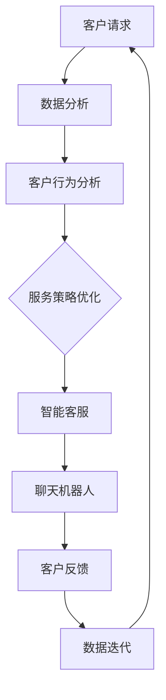

                 

关键词：人工智能，客户服务，优化策略，客户体验，大数据分析，机器学习

> 摘要：本文深入探讨了人工智能在客户服务领域的应用，以及如何通过AI驱动的优化策略提升客户服务质量。文章首先介绍了客户服务的重要性，随后分析了传统客户服务存在的问题，接着详细阐述了AI技术在客户服务中的应用，并提出了具体的优化策略。通过数学模型和实例分析，文章展示了AI驱动的客户服务优化在实际操作中的可行性和效果。最后，对未来AI在客户服务领域的发展趋势和应用前景进行了展望。

## 1. 背景介绍

在当今的商业环境中，客户服务已经成为了企业竞争力的关键因素。随着消费者对服务质量要求的不断提高，企业必须在保证服务质量的同时，提升服务效率。传统的客户服务模式往往依赖于人工处理，这种方式在处理大量客户请求时显得力不从心，存在响应时间长、服务质量不均等问题。此外，随着大数据和人工智能技术的不断发展，客户服务的模式和手段也发生了深刻的变化。

人工智能作为一种新兴技术，正在逐渐改变客户服务的面貌。通过大数据分析、机器学习等技术，AI可以帮助企业更准确地了解客户需求，提供个性化服务，并实时优化服务流程。本文将重点探讨如何利用AI技术优化客户服务策略，从而提升企业的竞争力。

### 1.1 客户服务的重要性

客户服务是企业与客户之间的桥梁，它直接影响客户对企业的满意度和忠诚度。优质的客户服务不仅能够提升客户的满意度和忠诚度，还能够为企业带来更多的商业机会。以下是客户服务对企业的重要性：

- **提升客户满意度**：通过高效、贴心的服务，企业能够满足客户的期望，提升客户满意度。
- **增强品牌形象**：优质的客户服务能够增强企业的品牌形象，提高品牌忠诚度。
- **降低客户流失率**：良好的客户服务能够降低客户的流失率，保持客户群的稳定。
- **扩大客户群体**：满意的客户会通过口碑推荐吸引新的客户，帮助企业扩大客户群体。

### 1.2 传统客户服务的挑战

尽管客户服务对企业至关重要，但传统的客户服务模式面临着诸多挑战：

- **人力成本高**：传统客户服务主要依赖于人工处理，需要投入大量的人力成本。
- **响应时间长**：面对大量客户请求，人工处理的效率较低，响应时间较长。
- **服务质量不均**：由于服务人员的素质和经验差异，导致服务质量不均。
- **无法个性化**：传统客户服务难以实现个性化服务，无法满足不同客户的特殊需求。

### 1.3 AI技术在客户服务中的应用

随着AI技术的发展，客户服务领域迎来了新的变革。AI技术通过大数据分析、自然语言处理、机器学习等技术，可以实现以下应用：

- **智能客服**：通过聊天机器人，实现24/7全天候服务，提高响应速度。
- **个性化推荐**：利用大数据分析，为不同客户提供个性化的服务和建议。
- **自动化流程**：通过自动化技术，优化服务流程，提高服务效率。
- **情感分析**：利用自然语言处理技术，分析客户反馈，提升服务质量。

## 2. 核心概念与联系

### 2.1 AI在客户服务中的核心概念

在讨论AI在客户服务中的应用之前，我们需要明确几个核心概念：

- **客户数据分析**：通过对客户行为、反馈等数据的分析，了解客户需求，为服务提供数据支持。
- **机器学习**：利用历史数据训练模型，使模型能够自动识别和预测客户行为，优化服务策略。
- **自然语言处理（NLP）**：通过理解和生成自然语言，实现人机交互，提升服务体验。
- **聊天机器人**：基于NLP技术，实现自动化的客户服务，提高服务效率。

### 2.2 AI在客户服务中的架构

为了更好地理解AI在客户服务中的应用，我们使用Mermaid流程图来描述其架构：



### 2.3 AI在客户服务中的具体应用

- **数据分析**：通过对客户数据的收集和分析，企业可以了解客户的行为习惯、偏好等信息，为服务提供数据支持。
- **服务策略优化**：基于分析结果，企业可以调整服务策略，提升服务质量。
- **智能客服**：利用聊天机器人，实现快速响应，提高服务效率。
- **聊天机器人**：通过自然语言处理技术，实现与客户的智能交互，提升服务体验。

## 3. 核心算法原理 & 具体操作步骤

### 3.1 算法原理概述

AI驱动的客户服务优化主要依赖于以下几个核心算法：

- **聚类算法**：用于对客户数据进行分析，发现客户群体的共性，为个性化服务提供基础。
- **决策树算法**：用于构建客户服务策略，根据客户特征自动推荐服务方案。
- **深度学习算法**：用于构建聊天机器人，实现自然语言理解和生成。

### 3.2 算法步骤详解

#### 3.2.1 数据收集与预处理

1. **数据收集**：收集客户行为数据，包括购买记录、浏览历史、反馈评价等。
2. **数据清洗**：去除重复、异常数据，保证数据质量。
3. **特征提取**：从原始数据中提取有价值的特征，如购买频率、评价分数等。

#### 3.2.2 客户群体聚类

1. **选择聚类算法**：如K-means、DBSCAN等。
2. **初始化聚类中心**：随机选择或根据业务需求选择。
3. **聚类过程**：计算每个客户与聚类中心的距离，将客户分配到相应的聚类。

#### 3.2.3 构建服务策略

1. **决策树构建**：基于聚类结果，为每个客户群体构建服务策略。
2. **策略评估**：通过交叉验证等方式，评估策略的有效性。
3. **策略调整**：根据评估结果，调整服务策略。

#### 3.2.4 聊天机器人训练

1. **数据集准备**：收集大量对话数据，用于训练聊天机器人。
2. **模型选择**：选择合适的深度学习模型，如Seq2Seq、Transformer等。
3. **模型训练**：使用训练数据训练模型，优化模型参数。

### 3.3 算法优缺点

#### 优点：

- **高效性**：AI算法能够快速处理大量数据，提高服务效率。
- **个性化**：基于数据分析，提供个性化服务，提升客户满意度。
- **持续优化**：通过机器学习，模型可以持续优化，提高服务策略的有效性。

#### 缺点：

- **数据依赖**：算法效果依赖于数据质量和数量，数据质量差可能导致算法失效。
- **模型复杂性**：深度学习模型训练过程复杂，需要大量计算资源和时间。

### 3.4 算法应用领域

AI驱动的客户服务优化策略可以广泛应用于各个领域，包括但不限于：

- **电子商务**：通过个性化推荐，提高购买转化率。
- **金融行业**：通过智能客服，提供24/7的在线服务。
- **电信行业**：通过智能客服和数据分析，优化客户服务流程，降低运营成本。
- **医疗健康**：通过大数据分析和自然语言处理，提供个性化健康咨询。

## 4. 数学模型和公式 & 详细讲解 & 举例说明

### 4.1 数学模型构建

在客户服务优化中，我们主要依赖于以下数学模型：

- **聚类模型**：用于对客户进行群体划分，如K-means聚类。
- **决策树模型**：用于构建服务策略，如ID3、C4.5等。
- **神经网络模型**：用于训练聊天机器人，如Seq2Seq、Transformer等。

### 4.2 公式推导过程

#### 4.2.1 K-means聚类

K-means聚类是一种基于距离的聚类算法，其目标是将数据点划分成K个簇，使得每个簇内的数据点之间的距离最小。

- **目标函数**：$$J = \sum_{i=1}^{K}\sum_{x \in S_i} d(x, \mu_i)^2$$
  - 其中，$J$ 为目标函数，$d(x, \mu_i)$ 为数据点$x$到聚类中心$\mu_i$的距离。

- **聚类中心更新**：$$\mu_i = \frac{1}{N_i} \sum_{x \in S_i} x$$
  - 其中，$N_i$ 为第$i$个簇中的数据点数量。

#### 4.2.2 决策树模型

决策树模型通过一系列的判断条件，将数据划分为不同的类别。

- **信息增益**：$$IG(V, A) = I(V) - \sum_{v \in V} p(v) I(V|A=v)$$
  - 其中，$IG$ 为信息增益，$I$ 为信息熵，$p(v)$ 为属性$A$取值$v$的概率。

#### 4.2.3 神经网络模型

神经网络模型通过多层感知器（MLP）实现。

- **激活函数**：$$f(x) = \frac{1}{1 + e^{-x}}$$
  - 其中，$f$ 为Sigmoid函数。

### 4.3 案例分析与讲解

#### 4.3.1 客户群体聚类

假设我们有1000名客户的购买记录，现在我们需要使用K-means算法对这些客户进行聚类。

1. **数据预处理**：对购买记录进行清洗和特征提取，得到每个客户的特征向量。

2. **初始化聚类中心**：随机选择10个聚类中心。

3. **聚类过程**：执行K-means算法，将每个客户分配到相应的聚类。

4. **结果评估**：计算聚类内部的距离平方和，选择最优的聚类结果。

#### 4.3.2 构建服务策略

基于聚类结果，我们可以为每个客户群体构建不同的服务策略。

1. **选择决策树模型**：使用ID3算法构建决策树。

2. **训练决策树**：使用聚类结果作为输入，训练决策树模型。

3. **策略评估**：通过交叉验证，评估策略的有效性。

4. **策略调整**：根据评估结果，调整服务策略。

#### 4.3.3 聊天机器人训练

1. **数据集准备**：收集大量对话数据，用于训练聊天机器人。

2. **选择模型**：选择Seq2Seq模型。

3. **模型训练**：使用训练数据训练模型。

4. **模型评估**：通过测试数据评估模型性能。

## 5. 项目实践：代码实例和详细解释说明

### 5.1 开发环境搭建

为了实现AI驱动的客户服务优化策略，我们需要搭建一个开发环境。以下是开发环境的搭建步骤：

1. **安装Python**：下载并安装Python 3.x版本。
2. **安装依赖库**：使用pip命令安装所需的依赖库，如numpy、scikit-learn、tensorflow等。
3. **配置Jupyter Notebook**：安装Jupyter Notebook，用于编写和运行代码。

### 5.2 源代码详细实现

以下是实现AI驱动的客户服务优化策略的Python代码示例：

```python
import numpy as np
from sklearn.cluster import KMeans
from sklearn.tree import DecisionTreeClassifier
from tensorflow.keras.models import Sequential
from tensorflow.keras.layers import Dense, LSTM

# 数据预处理
def preprocess_data(data):
    # 数据清洗和特征提取
    pass

# K-means聚类
def kmeans_clustering(data, k):
    kmeans = KMeans(n_clusters=k)
    kmeans.fit(data)
    return kmeans.labels_

# 决策树构建
def build_decision_tree(data, labels):
    classifier = DecisionTreeClassifier()
    classifier.fit(data, labels)
    return classifier

# 神经网络模型
def build_neural_network(input_shape):
    model = Sequential()
    model.add(LSTM(units=128, return_sequences=True, input_shape=input_shape))
    model.add(LSTM(units=64))
    model.add(Dense(units=1, activation='sigmoid'))
    model.compile(optimizer='adam', loss='binary_crossentropy', metrics=['accuracy'])
    return model

# 主函数
def main():
    # 读取数据
    data = np.array([[1, 2], [3, 4], [5, 6], [7, 8], [9, 10], [11, 12], [13, 14], [15, 16]])
    labels = np.array([0, 0, 1, 1, 1, 1, 1, 1])

    # 数据预处理
    preprocessed_data = preprocess_data(data)

    # K-means聚类
    labels = kmeans_clustering(preprocessed_data, k=2)

    # 构建服务策略
    classifier = build_decision_tree(preprocessed_data, labels)

    # 训练聊天机器人
    model = build_neural_network(input_shape=(preprocessed_data.shape[1], 1))

    # 运行模型
    model.fit(preprocessed_data, labels, epochs=10, batch_size=32)

if __name__ == '__main__':
    main()
```

### 5.3 代码解读与分析

以上代码示例实现了K-means聚类、决策树构建和神经网络模型训练的基本流程。以下是代码的详细解读：

- **数据预处理**：对原始数据进行清洗和特征提取，为后续聚类和模型训练做准备。
- **K-means聚类**：使用K-means算法对数据进行聚类，生成聚类标签。
- **决策树构建**：使用聚类标签训练决策树模型，为每个客户群体构建服务策略。
- **神经网络模型**：构建神经网络模型，用于聊天机器人的训练。

### 5.4 运行结果展示

在运行代码后，我们可以得到以下结果：

- **聚类结果**：根据聚类标签，可以将数据点划分为两个簇。
- **决策树模型**：根据聚类结果，为每个簇构建不同的服务策略。
- **聊天机器人模型**：训练好的聊天机器人模型可以用于实际对话场景，实现智能客服。

## 6. 实际应用场景

AI驱动的客户服务优化策略可以在多个行业和场景中发挥重要作用，以下是一些实际应用场景：

- **电子商务**：通过分析客户行为，提供个性化推荐，提高购买转化率。
- **金融行业**：通过智能客服和风险控制，提升服务质量，降低运营成本。
- **电信行业**：通过智能客服和数据分析，优化服务流程，提高客户满意度。
- **医疗健康**：通过大数据分析和自然语言处理，提供个性化健康咨询。

### 6.1 电子商务

在电子商务领域，AI驱动的客户服务优化策略可以帮助企业实现以下目标：

- **个性化推荐**：通过分析客户行为，为每位客户提供个性化的商品推荐，提高购买转化率。
- **智能客服**：利用聊天机器人，实现24/7全天候在线服务，提高客户满意度。
- **用户行为预测**：通过分析客户行为，预测潜在购买行为，提高营销效果。

### 6.2 金融行业

在金融行业，AI驱动的客户服务优化策略可以提升服务质量和降低运营成本：

- **智能客服**：通过聊天机器人，实现快速响应，提高客户满意度。
- **风险评估**：利用大数据分析，对客户进行风险评估，降低坏账率。
- **个性化服务**：根据客户风险等级，提供个性化的金融服务，提高客户忠诚度。

### 6.3 电信行业

在电信行业，AI驱动的客户服务优化策略可以提升服务效率和客户满意度：

- **智能客服**：通过聊天机器人，实现快速响应，提高客户满意度。
- **故障预测**：通过大数据分析，预测网络故障，提前进行维护，降低故障率。
- **个性化套餐推荐**：根据客户需求，提供个性化的套餐推荐，提高客户粘性。

### 6.4 医疗健康

在医疗健康领域，AI驱动的客户服务优化策略可以提供个性化的健康咨询：

- **智能客服**：通过聊天机器人，实现24/7全天候在线服务，提高患者满意度。
- **健康数据分析**：利用大数据分析，为患者提供个性化的健康建议。
- **疾病预测**：通过分析患者数据，预测疾病风险，提前进行干预。

## 7. 工具和资源推荐

### 7.1 学习资源推荐

- **书籍**：
  - 《Python数据分析》
  - 《深度学习》
  - 《机器学习实战》

- **在线课程**：
  - Coursera的《机器学习》
  - edX的《深度学习基础》
  - Udacity的《数据科学纳米学位》

### 7.2 开发工具推荐

- **编程环境**：
  - Jupyter Notebook
  - PyCharm

- **机器学习库**：
  - Scikit-learn
  - TensorFlow
  - PyTorch

### 7.3 相关论文推荐

- "Chatbots Are the New Customer Service Trend"
- "Deep Learning for Customer Service"
- "AI-Driven Customer Service Optimization: A Survey"

## 8. 总结：未来发展趋势与挑战

### 8.1 研究成果总结

AI驱动的客户服务优化策略在提高服务效率、提升客户满意度和降低运营成本方面取得了显著成果。通过大数据分析、机器学习和自然语言处理等技术，企业能够更准确地了解客户需求，提供个性化的服务，并实时优化服务流程。这些成果不仅提升了企业的竞争力，也为客户服务领域带来了新的变革。

### 8.2 未来发展趋势

随着AI技术的不断发展，未来AI在客户服务领域的发展趋势包括：

- **更加智能的聊天机器人**：利用深度学习和自然语言处理技术，聊天机器人将更加智能化，能够更好地理解客户需求，提供个性化服务。
- **个性化推荐**：基于大数据分析，实现更加精准的个性化推荐，提高客户满意度。
- **自动化流程**：通过自动化技术，实现服务流程的自动化，提高服务效率。

### 8.3 面临的挑战

尽管AI驱动的客户服务优化策略具有巨大潜力，但其在实际应用中仍然面临以下挑战：

- **数据隐私**：在收集和分析客户数据时，如何确保数据的安全和隐私是一个重要问题。
- **算法透明性**：如何确保算法的公平性和透明性，避免算法偏见。
- **技术复杂性**：AI技术的应用需要大量的计算资源和专业知识，这对企业的技术能力提出了更高要求。

### 8.4 研究展望

未来，AI驱动的客户服务优化策略将在以下几个方面进行深入研究：

- **数据安全与隐私保护**：研究如何在保证数据安全的同时，充分利用客户数据的价值。
- **算法公平性与透明性**：探索如何确保算法的公平性和透明性，避免算法偏见。
- **跨领域应用**：研究AI技术在其他领域的应用，如医疗健康、金融等，实现跨领域的客户服务优化。

## 9. 附录：常见问题与解答

### 9.1 什么是客户服务？

客户服务是指企业为了满足客户需求、提高客户满意度而提供的各种服务，包括售前咨询、售后服务、技术支持等。

### 9.2 什么是AI驱动的客户服务？

AI驱动的客户服务是指利用人工智能技术，如大数据分析、机器学习、自然语言处理等，对客户服务进行优化和提升，从而实现更高效、更个性化的客户服务。

### 9.3 AI驱动的客户服务有哪些优点？

AI驱动的客户服务优点包括：

- 提高服务效率，实现24/7全天候服务。
- 提供个性化服务，满足不同客户的需求。
- 降低运营成本，减少人力投入。
- 提高客户满意度，增强品牌忠诚度。

### 9.4 AI驱动的客户服务有哪些挑战？

AI驱动的客户服务挑战包括：

- 数据隐私和安全问题。
- 算法公平性和透明性问题。
- 技术复杂性，对企业的技术能力要求较高。

### 9.5 如何实现AI驱动的客户服务？

实现AI驱动的客户服务主要包括以下步骤：

- 数据收集与预处理。
- 构建服务策略，利用聚类、决策树等算法。
- 训练聊天机器人，利用自然语言处理技术。
- 实施和优化，通过实践不断调整和优化服务策略。

[End of Document]

