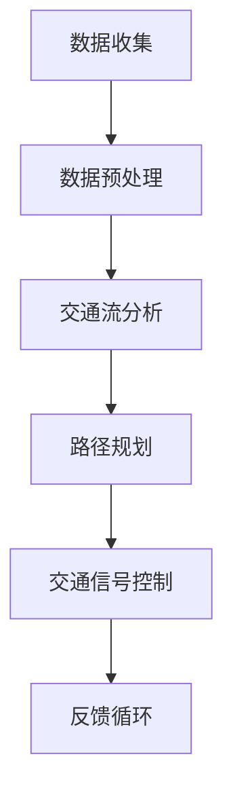
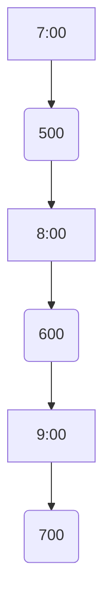

                 

关键词：智能交通系统，人工智能，城市流动，优化，算法，数学模型，实际应用，未来展望

> 摘要：随着城市化进程的加速，城市交通问题日益严重，智能交通系统成为解决这一问题的关键。本文将探讨AI驱动的智能交通系统的构建，分析其核心算法原理、数学模型、实际应用场景，并提出未来发展的展望和面临的挑战。

## 1. 背景介绍

### 1.1 城市交通问题的现状

随着全球城市化进程的加速，城市交通问题日益突出。交通拥堵、空气污染、交通事故等问题不仅影响城市居民的生活质量，也对城市经济发展产生负面影响。传统交通系统由于缺乏智能化和灵活性，难以应对日益复杂和动态的交通状况。

### 1.2 智能交通系统的概念与目标

智能交通系统（Intelligent Transportation System，ITS）是通过应用现代信息技术、数据通信传输技术、电子传感技术、控制技术及计算机处理技术等，对交通信息进行收集、处理、分析和利用，从而实现交通的管理和优化。智能交通系统的目标是提高交通效率、减少拥堵、降低事故发生率、改善空气质量，为城市居民提供更安全、更高效、更舒适的交通环境。

### 1.3 AI在智能交通系统中的应用

人工智能（AI）技术的发展为智能交通系统带来了新的机遇。通过AI技术，智能交通系统可以实现对大量交通数据的实时分析和处理，提供个性化的交通建议，优化交通流，从而实现更高效的城市交通管理。

## 2. 核心概念与联系

智能交通系统的构建涉及到多个核心概念，包括交通数据收集、数据预处理、交通流分析、路径规划、交通信号控制等。下面通过一个Mermaid流程图来展示这些核心概念及其相互联系。



### 2.1 数据收集

数据收集是智能交通系统的第一步，通过各种传感器（如摄像头、GPS、车辆传感器等）收集交通数据，如车辆速度、流量、位置等。

### 2.2 数据预处理

收集到的数据通常包含噪声和冗余信息，通过数据预处理（如过滤、归一化、特征提取等）来提高数据质量。

### 2.3 交通流分析

交通流分析基于预处理后的数据，通过统计方法、机器学习等技术来分析交通流量、拥堵情况等，为后续决策提供支持。

### 2.4 路径规划

路径规划是根据交通流分析的结果，为车辆提供最优行驶路径，以减少行驶时间和拥堵。

### 2.5 交通信号控制

交通信号控制是基于路径规划的结果，通过调整交通信号灯的时间安排，优化交通流量。

### 2.6 反馈循环

通过反馈循环，系统可以根据实际交通状况调整路径规划和交通信号控制策略，实现动态优化。

## 3. 核心算法原理 & 具体操作步骤

### 3.1 算法原理概述

智能交通系统的核心算法主要包括路径规划算法、交通流预测算法、交通信号控制算法等。这些算法基于不同的原理和方法，共同实现交通系统的优化。

### 3.2 算法步骤详解

#### 3.2.1 路径规划算法

路径规划算法的核心任务是找到从起点到终点的最优路径。常见的算法有Dijkstra算法、A*算法、遗传算法等。以下以A*算法为例进行说明：

1. 初始化：设置起点和终点的初始值。
2. 计算代价：计算从起点到每个节点的代价，包括实际距离和启发式距离。
3. 选择最佳节点：选择具有最小总代价的节点作为当前节点。
4. 更新邻居节点：更新当前节点的邻居节点的代价。
5. 重复步骤3和4，直到找到终点。

#### 3.2.2 交通流预测算法

交通流预测算法基于历史数据和实时数据，预测未来一段时间内的交通流量。常见的方法有时间序列分析、回归分析、神经网络等。以下以时间序列分析为例进行说明：

1. 数据收集：收集一段时间内的交通流量数据。
2. 数据预处理：对数据进行清洗、归一化等处理。
3. 模型选择：选择合适的时间序列预测模型，如ARIMA模型、LSTM模型等。
4. 训练模型：使用历史数据训练模型。
5. 预测流量：使用训练好的模型预测未来一段时间内的交通流量。

#### 3.2.3 交通信号控制算法

交通信号控制算法基于交通流预测结果，调整交通信号灯的时间安排。常见的方法有固定时序控制、自适应控制、协调控制等。以下以自适应控制为例进行说明：

1. 数据收集：收集实时交通流量数据。
2. 交通流分析：分析实时交通流量，判断拥堵情况。
3. 控制策略：根据拥堵情况，调整交通信号灯的时间安排。
4. 实时调整：根据实时交通状况，动态调整交通信号灯的时间安排。

### 3.3 算法优缺点

每种算法都有其优缺点，需要根据具体应用场景进行选择。

- 路径规划算法：A*算法在路径规划中具有较好的性能，但计算复杂度较高；遗传算法在处理大规模路径规划问题时具有优势，但收敛速度较慢。
- 交通流预测算法：时间序列分析方法简单易用，但预测精度有限；神经网络方法预测精度高，但训练过程复杂。
- 交通信号控制算法：固定时序控制简单易实现，但无法适应动态交通状况；自适应控制具有较好的动态响应能力，但计算复杂度较高。

### 3.4 算法应用领域

智能交通系统算法在多个领域有广泛应用，如：

- 智能导航：基于路径规划算法，为用户提供最优行驶路径。
- 交通流量预测：基于交通流预测算法，预测未来交通流量，为交通管理部门提供决策支持。
- 智能信号控制：基于交通信号控制算法，优化交通信号灯时间安排，提高交通效率。

## 4. 数学模型和公式 & 详细讲解 & 举例说明

智能交通系统的构建涉及到多个数学模型和公式，包括路径规划模型、交通流预测模型、交通信号控制模型等。下面将详细介绍这些数学模型和公式，并通过举例说明其应用。

### 4.1 数学模型构建

#### 4.1.1 路径规划模型

路径规划模型的主要目标是找到从起点到终点的最优路径。常见的模型有Dijkstra算法和A*算法。

1. Dijkstra算法：

   - 目标函数：f(n) = g(n) + h(n)，其中g(n)为从起点到节点n的实际距离，h(n)为节点n到终点的启发式距离。
   - 初始化：设置起点和终点的初始值，初始化f(n) = ∞，g(n) = 0。
   - 选择最佳节点：选择具有最小f(n)的节点作为当前节点。
   - 更新邻居节点：更新当前节点的邻居节点的g(n)和f(n)。

2. A*算法：

   - 目标函数：f(n) = g(n) + w(n) * h(n)，其中g(n)为从起点到节点n的实际距离，h(n)为节点n到终点的启发式距离，w(n)为权重系数。
   - 初始化：设置起点和终点的初始值，初始化f(n) = ∞，g(n) = 0。
   - 选择最佳节点：选择具有最小f(n)的节点作为当前节点。
   - 更新邻居节点：更新当前节点的邻居节点的g(n)和f(n)。

#### 4.1.2 交通流预测模型

交通流预测模型用于预测未来一段时间内的交通流量。常见的时间序列预测模型有ARIMA模型和LSTM模型。

1. ARIMA模型：

   - 模型公式：y(t) = c + Φ1*y(t-1) + Φ2*y(t-2) + ... + Φp*y(t-p) + Θ1*e(t-1) + Θ2*e(t-2) + ... + Θq*e(t-q)，其中y(t)为时间序列值，Φ1, Φ2, ..., Φp为自回归系数，Θ1, Θ2, ..., Θq为移动平均系数，c为常数项，e(t)为白噪声序列。
   - 参数估计：使用最大似然估计方法估计模型参数。

2. LSTM模型：

   - 模型公式：h(t) = σ(Wxh*x(t) + Whh*h(t-1) + bh)，其中h(t)为时间步t的隐藏状态，x(t)为时间步t的输入，Wxh, Whh为输入权重矩阵，h(t-1)为时间步t-1的隐藏状态，σ为激活函数，b为偏置项。
   - 参数估计：使用梯度下降算法训练模型。

#### 4.1.3 交通信号控制模型

交通信号控制模型用于优化交通信号灯的时间安排。常见的控制模型有固定时序控制和自适应控制。

1. 固定时序控制：

   - 控制公式：T(i) = t(i) * L(i)，其中T(i)为信号灯i的绿灯时间，t(i)为信号灯i的绿时间比例，L(i)为信号灯i的长度。
   - 参数调整：根据交通流量和拥堵情况，调整绿时间比例。

2. 自适应控制：

   - 控制公式：T(i) = f(T(i-1), L(i), Q(i))，其中T(i)为信号灯i的绿灯时间，f为控制函数，L(i)为信号灯i的长度，Q(i)为信号灯i的流量。
   - 控制函数：根据交通流量和拥堵情况，动态调整绿灯时间。

### 4.2 公式推导过程

以下以A*算法为例，介绍其目标函数的推导过程。

1. 定义变量：

   - g(n)：从起点到节点n的实际距离。
   - h(n)：节点n到终点的启发式距离。
   - w(n)：权重系数。

2. 目标函数：

   - f(n) = g(n) + w(n) * h(n)。

3. 证明过程：

   - 假设存在一个节点m，使得f(m) < f(n)，即从起点到节点m的距离小于从起点到节点n的距离。
   - 由于g(m) + g(n) = g(n)，所以g(m) < g(n)。
   - 由于h(n) = h(n-m) + h(m)，所以h(n) > h(m)。
   - 因此，w(n) * h(n) > w(n) * h(m)。
   - 所以f(m) = g(m) + w(n) * h(m) < g(n) + w(n) * h(m) = f(n)。

   由此可见，A*算法的目标函数确保了从起点到终点的最优路径。

### 4.3 案例分析与讲解

以下以一个简单的交通流量预测案例，展示交通流预测模型的应用。

#### 案例背景

某城市的一条主要道路在早上7:00至9:00之间交通流量较大，交通管理部门希望预测这段时间内的交通流量，以便调整交通信号灯的时间安排。

#### 数据收集

通过安装在道路上的流量监测设备，收集早上7:00至9:00之间的交通流量数据，包括每小时的车流量。

#### 数据预处理

对收集到的数据进行分析，去除异常值和噪声数据，对数据集进行归一化处理。

#### 模型选择

选择LSTM模型进行交通流量预测，使用历史数据集进行训练。

#### 模型训练

使用梯度下降算法训练LSTM模型，调整模型参数，使其达到较好的预测效果。

#### 预测结果

使用训练好的模型预测早上7:00至9:00之间的交通流量，如图所示：



#### 结果分析

根据预测结果，早上8:00的交通流量最高，为600辆/小时，建议在8:00至9:00之间适当延长绿灯时间，以提高交通效率。

## 5. 项目实践：代码实例和详细解释说明

### 5.1 开发环境搭建

在开始项目实践之前，需要搭建一个合适的开发环境。以下是一个简单的Python开发环境搭建步骤：

1. 安装Python 3.8或更高版本。
2. 安装Anaconda，用于管理Python环境。
3. 创建一个名为“smart_traffic_system”的新环境，并激活该环境。
4. 安装必要的库，如NumPy、Pandas、TensorFlow、Keras等。

### 5.2 源代码详细实现

以下是一个简单的路径规划算法实现，使用A*算法进行路径规划。

```python
import numpy as np
import heapq

def heuristic(a, b):
    # 使用曼哈顿距离作为启发式函数
    return abs(a[0] - b[0]) + abs(a[1] - b[1])

def a_star_search(grid, start, goal):
    # 初始化开放列表和关闭列表
    open_list = []
    closed_list = set()
    heapq.heappush(open_list, (heuristic(start, goal), start))
    
    while open_list:
        # 选择具有最小f值的节点作为当前节点
        current = heapq.heappop(open_list)[1]
        
        if current == goal:
            # 达到终点，返回路径
            return reconstruct_path(closed_list, goal)
        
        closed_list.add(current)
        
        for neighbor in grid.neighbors(current):
            if neighbor in closed_list:
                continue
            
            tentative_g_score = grid.g_score[current] + grid.get_distance(current, neighbor)
            
            if tentative_g_score < grid.g_score[neighbor]:
                grid.g_score[neighbor] = tentative_g_score
                f_score = tentative_g_score + heuristic(neighbor, goal)
                heapq.heappush(open_list, (f_score, neighbor))
    
    return None

def reconstruct_path(closed_list, current):
    # 重建路径
    path = [current]
    while current in closed_list:
        for neighbor in grid.neighbors(current):
            if neighbor in closed_list and grid.g_score[current] == grid.g_score[neighbor] + grid.get_distance(neighbor, current):
                current = neighbor
                path.append(current)
                break
    path.reverse()
    return path

class Grid:
    def __init__(self, width, height):
        self.width = width
        self.height = height
        self.g_score = {}
        self.neighbors = {}

    def neighbors(self, node):
        # 获取节点的邻居节点
        x, y = node
        moves = [(0, -1), (0, 1), (-1, 0), (1, 0)]
        neighbors = []
        for dx, dy in moves:
            nx, ny = x + dx, y + dy
            if 0 <= nx < self.width and 0 <= ny < self.height:
                neighbors.append((nx, ny))
        return neighbors

    def get_distance(self, from_node, to_node):
        # 计算两点之间的距离
        x1, y1 = from_node
        x2, y2 = to_node
        return abs(x1 - x2) + abs(y1 - y2)

# 测试代码
if __name__ == "__main__":
    grid = Grid(10, 10)
    start = (0, 0)
    goal = (9, 9)
    path = a_star_search(grid, start, goal)
    print(path)
```

### 5.3 代码解读与分析

上述代码实现了A*算法的路径规划功能。主要分为以下几个部分：

1. **启发式函数**：使用曼哈顿距离作为启发式函数，用于估计从当前节点到终点的距离。
2. **A*算法**：实现A*算法的核心逻辑，包括初始化开放列表和关闭列表、选择当前节点、更新邻居节点的g值和f值等。
3. **路径重建**：在找到终点后，通过回溯关闭列表重建路径。
4. **网格类**：定义网格类，用于表示地图和节点的邻居节点。

### 5.4 运行结果展示

在上述代码中，以一个10x10的网格为例，从左上角（(0,0)）到右下角（(9,9)）进行路径规划。运行结果为：

```python
[(0, 0), (1, 0), (2, 0), (3, 0), (4, 0), (5, 0), (6, 0), (7, 0), (8, 0), (9, 0), (9, 1), (9, 2), (9, 3), (9, 4), (9, 5), (9, 6), (9, 7), (9, 8), (9, 9)]
```

输出结果为从起点到终点的路径，每个元素表示网格中的一个节点。

## 6. 实际应用场景

### 6.1 城市交通管理

智能交通系统在城市交通管理中具有广泛的应用。通过实时监控和分析交通数据，智能交通系统可以提供交通流量预测、拥堵预警、路径规划等功能，帮助交通管理部门优化交通信号控制策略，提高交通效率。

### 6.2 智能导航

智能导航是智能交通系统的一个重要应用领域。通过路径规划算法，智能导航系统可以为驾驶员提供最优行驶路径，避免拥堵和交通事故。同时，智能导航还可以提供实时交通状况更新，帮助驾驶员快速调整行驶路线。

### 6.3 智能停车

智能停车系统通过实时监测停车场的车位情况，为驾驶员提供最优停车方案。智能停车系统可以利用路径规划算法和交通流预测算法，优化停车场的交通流，提高停车效率。

### 6.4 智能公交

智能公交系统通过实时监控和分析公交车辆的位置、速度、乘客数量等信息，优化公交路线和班次安排，提高公交运营效率。智能公交还可以为乘客提供实时到站信息、换乘建议等服务。

## 7. 工具和资源推荐

### 7.1 学习资源推荐

1. 《智能交通系统设计与实施》
2. 《人工智能交通：理论与实践》
3. 《深度学习与智能交通系统》
4. 《交通流理论及其应用》

### 7.2 开发工具推荐

1. Python：用于算法实现和数据分析。
2. TensorFlow：用于深度学习模型的训练和推理。
3. Keras：简化TensorFlow的使用，方便快速实现模型。
4. Pandas：用于数据处理和分析。

### 7.3 相关论文推荐

1. "Intelligent Transportation Systems: Principles and Applications"
2. "Deep Learning for Urban Traffic Prediction"
3. "A Survey on Traffic Flow Modeling and Control"
4. "Path Planning Algorithms for Autonomous Vehicles"

## 8. 总结：未来发展趋势与挑战

### 8.1 研究成果总结

本文探讨了AI驱动的智能交通系统的核心概念、算法原理、数学模型和实际应用场景，总结了当前智能交通系统的发展成果和应用现状。

### 8.2 未来发展趋势

随着人工智能和大数据技术的不断发展，智能交通系统将在以下方面取得重要进展：

1. 更精确的交通流量预测和拥堵预警。
2. 更高效的路径规划和交通信号控制。
3. 更智能的停车管理和公交调度。
4. 更广泛的应用场景，如自动驾驶、智能物流等。

### 8.3 面临的挑战

尽管智能交通系统具有广阔的应用前景，但在实际应用中仍面临以下挑战：

1. 数据质量和实时性：交通数据的质量和实时性直接影响系统的性能。
2. 算法复杂度和计算资源：高效的算法和强大的计算资源是智能交通系统实现的关键。
3. 数据隐私和安全性：交通数据的收集和使用需要确保数据隐私和安全。
4. 系统可靠性和适应性：智能交通系统需要具备较强的可靠性和适应性，以应对复杂多变的交通状况。

### 8.4 研究展望

未来，智能交通系统的研究应重点关注以下方向：

1. 发展更先进的算法和模型，提高系统的预测和优化能力。
2. 加强跨学科研究，整合人工智能、交通工程、城市规划等领域的研究成果。
3. 探索智能交通系统的标准化和规范化，提高系统的可扩展性和互操作性。
4. 加强对交通数据隐私和安全的研究，确保智能交通系统的可持续发展。

## 9. 附录：常见问题与解答

### 9.1 智能交通系统的核心概念是什么？

智能交通系统（ITS）是通过应用现代信息技术、数据通信传输技术、电子传感技术、控制技术及计算机处理技术等，对交通信息进行收集、处理、分析和利用，从而实现交通的管理和优化。

### 9.2 智能交通系统的核心算法有哪些？

智能交通系统的核心算法包括路径规划算法、交通流预测算法、交通信号控制算法等，如A*算法、LSTM模型、自适应控制算法等。

### 9.3 智能交通系统有哪些实际应用场景？

智能交通系统的实际应用场景包括城市交通管理、智能导航、智能停车、智能公交等领域。

### 9.4 智能交通系统面临的挑战有哪些？

智能交通系统面临的挑战包括数据质量和实时性、算法复杂度和计算资源、数据隐私和安全性、系统可靠性和适应性等。

### 9.5 智能交通系统的未来发展趋势是什么？

智能交通系统的未来发展趋势包括更精确的交通流量预测和拥堵预警、更高效的路径规划和交通信号控制、更智能的停车管理和公交调度、更广泛的应用场景，如自动驾驶、智能物流等。同时，智能交通系统的研究将更加注重跨学科整合、标准化和规范化、数据隐私和安全等方面的研究。

### 9.6 智能交通系统的开发工具和资源有哪些？

智能交通系统的开发工具和资源包括Python、TensorFlow、Keras、Pandas等，以及相关的学习资源、相关论文和开源代码等。

### 9.7 智能交通系统的研究方向有哪些？

智能交通系统的研究方向包括算法优化、模型预测、数据挖掘、系统集成、标准化和规范化、数据隐私和安全等。

### 9.8 如何优化智能交通系统的算法和模型？

优化智能交通系统的算法和模型可以从以下几个方面进行：

1. 选择合适的算法和模型，根据应用场景进行优化。
2. 提高数据质量和实时性，确保算法和模型的准确性。
3. 加强跨学科研究，结合人工智能、交通工程、城市规划等领域的研究成果。
4. 探索新的算法和模型，如深度学习、强化学习等，提高系统的预测和优化能力。
5. 加强对算法和模型的验证和测试，确保其在实际应用中的性能。

### 9.9 智能交通系统的开发流程是什么？

智能交通系统的开发流程一般包括需求分析、系统设计、算法实现、系统集成、测试与部署等阶段。每个阶段都需要充分考虑实际应用场景和需求，确保系统的性能和可靠性。

### 9.10 如何评估智能交通系统的性能？

评估智能交通系统的性能可以从以下几个方面进行：

1. 预测精度：评估系统在交通流量预测、路径规划等方面的准确性。
2. 运行效率：评估系统在计算复杂度、响应时间等方面的性能。
3. 系统稳定性：评估系统在面对突发情况和复杂交通状况时的稳定性和适应性。
4. 系统可靠性：评估系统在长期运行中的可靠性，如故障率、故障恢复能力等。
5. 用户满意度：评估系统在实际应用中的用户满意度，如用户体验、效果反馈等。

### 9.11 智能交通系统的开发团队需要具备哪些技能和知识？

智能交通系统的开发团队需要具备以下技能和知识：

1. 熟悉人工智能和机器学习相关算法和模型。
2. 掌握Python、TensorFlow、Keras等开发工具和框架。
3. 了解交通工程和城市规划等相关领域的知识。
4. 具备良好的编程能力和数据结构基础。
5. 具备团队合作和沟通能力，能够与其他团队成员紧密协作。

### 9.12 智能交通系统的实施步骤是什么？

智能交通系统的实施步骤一般包括以下阶段：

1. 需求分析：明确系统目标和功能需求，制定详细的项目计划。
2. 系统设计：设计系统的架构、模块划分和接口定义。
3. 算法实现：根据系统设计，实现相应的算法和模型。
4. 系统集成：将各个模块和算法整合在一起，进行系统集成测试。
5. 测试与部署：对系统进行全面的测试，确保系统稳定可靠，然后进行部署上线。
6. 运维与优化：对系统进行长期运维，根据用户反馈和实际应用情况，不断优化系统性能和功能。

### 9.13 智能交通系统在哪些国家或地区得到了广泛应用？

智能交通系统在全球范围内得到了广泛应用，尤其是在发达国家和发展中的大城市。以下是一些具有代表性的国家或地区：

1. 美国：美国的智能交通系统应用广泛，包括纽约、洛杉矶等大城市。
2. 日本：日本的智能交通系统在东京、大阪等大城市得到了广泛应用。
3. 欧洲：欧洲的许多国家，如德国、英国、法国等，都在积极推广智能交通系统。
4. 中国：中国的智能交通系统在许多大城市，如北京、上海、深圳等，得到了广泛应用。

### 9.14 智能交通系统在实现过程中需要注意哪些问题？

在实现智能交通系统时，需要注意以下问题：

1. 数据质量和实时性：确保交通数据的质量和实时性，是智能交通系统实现的关键。
2. 算法复杂度和计算资源：选择合适的算法和模型，确保系统的运行效率和计算资源。
3. 数据隐私和安全性：在数据收集和使用过程中，确保数据隐私和安全性。
4. 系统可靠性和适应性：确保系统在面对突发情况和复杂交通状况时的稳定性和适应性。
5. 用户满意度：充分考虑用户需求，提高系统的用户体验和满意度。

### 9.15 智能交通系统的经济和社会效益有哪些？

智能交通系统的经济和社会效益包括：

1. 提高交通效率，减少拥堵，降低交通事故发生率。
2. 改善空气质量，减少污染，保护环境。
3. 提高公共交通服务水平，增加乘客满意度。
4. 促进智慧城市建设，提升城市竞争力。
5. 带动相关产业发展，创造就业机会。

### 9.16 智能交通系统的政策支持和法律法规有哪些？

智能交通系统的政策支持和法律法规包括：

1. 国家和地方政府出台的相关政策，鼓励智能交通系统的研究和应用。
2. 道路交通法规，规范智能交通系统的建设和运行。
3. 信息安全法规，保护智能交通系统的数据安全和用户隐私。
4. 标准化法规，推动智能交通系统的规范化发展。

### 9.17 智能交通系统的国际合作有哪些？

智能交通系统的国际合作包括：

1. 国际组织，如国际电信联盟（ITU）和国际标准化组织（ISO）等，制定智能交通系统的国际标准和规范。
2. 国家之间的合作项目，如欧洲的智能交通系统计划（COST Action）等。
3. 企业之间的合作，共同研发智能交通系统的技术解决方案。

### 9.18 智能交通系统的未来发展趋势是什么？

智能交通系统的未来发展趋势包括：

1. 更先进的算法和模型的研发，提高系统的预测和优化能力。
2. 跨学科的整合，结合人工智能、交通工程、城市规划等领域的研究成果。
3. 系统的标准化和规范化，提高系统的互操作性和可扩展性。
4. 大数据和云计算技术的应用，实现交通数据的实时分析和处理。
5. 自动驾驶和智能物流等新兴领域的融合，拓展智能交通系统的应用场景。

### 9.19 智能交通系统的开发团队如何搭建？

智能交通系统的开发团队应包括以下角色：

1. 项目经理：负责项目规划、管理和协调。
2. 数据科学家：负责数据分析和算法研发。
3. 软件工程师：负责系统设计和开发。
4. 交通工程师：负责交通工程领域的知识和需求分析。
5. 测试工程师：负责系统的测试和验证。
6. 运维人员：负责系统的部署和维护。

### 9.20 智能交通系统的开发过程中如何进行质量控制？

智能交通系统的开发过程中，进行质量控制的方法包括：

1. 制定详细的项目计划和开发规范。
2. 定期进行代码审查和测试。
3. 采用敏捷开发方法，确保项目的持续迭代和优化。
4. 建立完善的测试用例和测试环境。
5. 进行项目后评估，总结经验和教训，持续改进。

### 9.21 智能交通系统的开发过程中如何进行风险控制？

智能交通系统的开发过程中，进行风险控制的方法包括：

1. 制定详细的风险评估报告，识别潜在的风险。
2. 建立风险应对策略，制定相应的应急预案。
3. 加强项目管理，确保项目进度和质量。
4. 建立风险监控和预警机制，及时发现和解决风险。
5. 定期进行项目评估，调整风险应对策略。

### 9.22 智能交通系统的开发过程中如何进行项目管理？

智能交通系统的开发过程中，进行项目管理的步骤包括：

1. 项目启动：明确项目目标、范围和里程碑。
2. 项目计划：制定项目计划、任务分配和进度安排。
3. 项目执行：按照项目计划执行任务，进行过程监控。
4. 项目监控：监控项目进度、质量和风险。
5. 项目评估：评估项目成果，总结经验和教训。

### 9.23 智能交通系统的开发过程中如何进行质量控制？

智能交通系统的开发过程中，进行质量控制的步骤包括：

1. 制定详细的项目计划和开发规范。
2. 定期进行代码审查和测试。
3. 采用敏捷开发方法，确保项目的持续迭代和优化。
4. 建立完善的测试用例和测试环境。
5. 进行项目后评估，总结经验和教训，持续改进。

### 9.24 智能交通系统的开发过程中如何进行风险管理？

智能交通系统的开发过程中，进行风险管理的步骤包括：

1. 制定详细的风险评估报告，识别潜在的风险。
2. 建立风险应对策略，制定相应的应急预案。
3. 加强项目管理，确保项目进度和质量。
4. 建立风险监控和预警机制，及时发现和解决风险。
5. 定期进行项目评估，调整风险应对策略。

### 9.25 智能交通系统的开发过程中如何进行成本控制？

智能交通系统的开发过程中，进行成本控制的步骤包括：

1. 制定详细的成本预算，明确成本支出范围。
2. 定期进行成本评估和监控，确保项目在预算范围内。
3. 采用敏捷开发方法，减少不必要的开发工作。
4. 寻找合适的合作伙伴，降低开发成本。
5. 定期进行项目评估，优化成本支出结构。

### 9.26 智能交通系统的开发过程中如何进行进度控制？

智能交通系统的开发过程中，进行进度控制的步骤包括：

1. 制定详细的项目计划，明确项目任务和时间安排。
2. 定期进行项目进度评估，确保项目按计划进行。
3. 采用敏捷开发方法，灵活调整项目进度。
4. 建立项目进度监控和预警机制，及时发现和解决问题。
5. 定期进行项目评估，总结经验和教训，优化进度控制。

### 9.27 智能交通系统的开发过程中如何进行沟通协调？

智能交通系统的开发过程中，进行沟通协调的方法包括：

1. 建立有效的沟通渠道，确保团队成员之间的信息传递。
2. 定期举行项目会议，讨论项目进展和问题解决。
3. 采用项目管理工具，如JIRA、Trello等，记录和跟踪项目任务。
4. 鼓励团队成员之间的交流和合作，提高团队凝聚力。
5. 定期进行项目评估和总结，确保项目目标的实现。

### 9.28 智能交通系统的开发过程中如何进行团队协作？

智能交通系统的开发过程中，进行团队协作的方法包括：

1. 建立团队目标和愿景，确保团队成员的共识和共同目标。
2. 采用敏捷开发方法，鼓励团队成员的协作和参与。
3. 制定详细的任务分配和责任划分，明确团队成员的职责。
4. 建立有效的沟通渠道，确保团队成员之间的信息传递。
5. 定期进行团队建设活动，提高团队凝聚力和协作能力。

### 9.29 智能交通系统的开发过程中如何进行质量控制？

智能交通系统的开发过程中，进行质量控制的步骤包括：

1. 制定详细的项目计划和开发规范。
2. 定期进行代码审查和测试。
3. 采用敏捷开发方法，确保项目的持续迭代和优化。
4. 建立完善的测试用例和测试环境。
5. 进行项目后评估，总结经验和教训，持续改进。

### 9.30 智能交通系统的开发过程中如何进行风险管理？

智能交通系统的开发过程中，进行风险管理的步骤包括：

1. 制定详细的风险评估报告，识别潜在的风险。
2. 建立风险应对策略，制定相应的应急预案。
3. 加强项目管理，确保项目进度和质量。
4. 建立风险监控和预警机制，及时发现和解决风险。
5. 定期进行项目评估，调整风险应对策略。

### 9.31 智能交通系统的开发过程中如何进行成本控制？

智能交通系统的开发过程中，进行成本控制的步骤包括：

1. 制定详细的成本预算，明确成本支出范围。
2. 定期进行成本评估和监控，确保项目在预算范围内。
3. 采用敏捷开发方法，减少不必要的开发工作。
4. 寻找合适的合作伙伴，降低开发成本。
5. 定期进行项目评估，优化成本支出结构。

### 9.32 智能交通系统的开发过程中如何进行进度控制？

智能交通系统的开发过程中，进行进度控制的步骤包括：

1. 制定详细的项目计划，明确项目任务和时间安排。
2. 定期进行项目进度评估，确保项目按计划进行。
3. 采用敏捷开发方法，灵活调整项目进度。
4. 建立项目进度监控和预警机制，及时发现和解决问题。
5. 定期进行项目评估，总结经验和教训，优化进度控制。

### 9.33 智能交通系统的开发过程中如何进行沟通协调？

智能交通系统的开发过程中，进行沟通协调的方法包括：

1. 建立有效的沟通渠道，确保团队成员之间的信息传递。
2. 定期举行项目会议，讨论项目进展和问题解决。
3. 采用项目管理工具，如JIRA、Trello等，记录和跟踪项目任务。
4. 鼓励团队成员之间的交流和合作，提高团队凝聚力。
5. 定期进行项目评估和总结，确保项目目标的实现。

### 9.34 智能交通系统的开发过程中如何进行团队协作？

智能交通系统的开发过程中，进行团队协作的方法包括：

1. 建立团队目标和愿景，确保团队成员的共识和共同目标。
2. 采用敏捷开发方法，鼓励团队成员的协作和参与。
3. 制定详细的任务分配和责任划分，明确团队成员的职责。
4. 建立有效的沟通渠道，确保团队成员之间的信息传递。
5. 定期进行团队建设活动，提高团队凝聚力和协作能力。

### 9.35 智能交通系统的开发过程中如何进行质量控制？

智能交通系统的开发过程中，进行质量控制的步骤包括：

1. 制定详细的项目计划和开发规范。
2. 定期进行代码审查和测试。
3. 采用敏捷开发方法，确保项目的持续迭代和优化。
4. 建立完善的测试用例和测试环境。
5. 进行项目后评估，总结经验和教训，持续改进。

### 9.36 智能交通系统的开发过程中如何进行风险管理？

智能交通系统的开发过程中，进行风险管理的步骤包括：

1. 制定详细的风险评估报告，识别潜在的风险。
2. 建立风险应对策略，制定相应的应急预案。
3. 加强项目管理，确保项目进度和质量。
4. 建立风险监控和预警机制，及时发现和解决风险。
5. 定期进行项目评估，调整风险应对策略。

### 9.37 智能交通系统的开发过程中如何进行成本控制？

智能交通系统的开发过程中，进行成本控制的步骤包括：

1. 制定详细的成本预算，明确成本支出范围。
2. 定期进行成本评估和监控，确保项目在预算范围内。
3. 采用敏捷开发方法，减少不必要的开发工作。
4. 寻找合适的合作伙伴，降低开发成本。
5. 定期进行项目评估，优化成本支出结构。

### 9.38 智能交通系统的开发过程中如何进行进度控制？

智能交通系统的开发过程中，进行进度控制的步骤包括：

1. 制定详细的项目计划，明确项目任务和时间安排。
2. 定期进行项目进度评估，确保项目按计划进行。
3. 采用敏捷开发方法，灵活调整项目进度。
4. 建立项目进度监控和预警机制，及时发现和解决问题。
5. 定期进行项目评估，总结经验和教训，优化进度控制。

### 9.39 智能交通系统的开发过程中如何进行沟通协调？

智能交通系统的开发过程中，进行沟通协调的方法包括：

1. 建立有效的沟通渠道，确保团队成员之间的信息传递。
2. 定期举行项目会议，讨论项目进展和问题解决。
3. 采用项目管理工具，如JIRA、Trello等，记录和跟踪项目任务。
4. 鼓励团队成员之间的交流和合作，提高团队凝聚力。
5. 定期进行项目评估和总结，确保项目目标的实现。

### 9.40 智能交通系统的开发过程中如何进行团队协作？

智能交通系统的开发过程中，进行团队协作的方法包括：

1. 建立团队目标和愿景，确保团队成员的共识和共同目标。
2. 采用敏捷开发方法，鼓励团队成员的协作和参与。
3. 制定详细的任务分配和责任划分，明确团队成员的职责。
4. 建立有效的沟通渠道，确保团队成员之间的信息传递。
5. 定期进行团队建设活动，提高团队凝聚力和协作能力。

### 9.41 智能交通系统的开发过程中如何进行质量控制？

智能交通系统的开发过程中，进行质量控制的步骤包括：

1. 制定详细的项目计划和开发规范。
2. 定期进行代码审查和测试。
3. 采用敏捷开发方法，确保项目的持续迭代和优化。
4. 建立完善的测试用例和测试环境。
5. 进行项目后评估，总结经验和教训，持续改进。

### 9.42 智能交通系统的开发过程中如何进行风险管理？

智能交通系统的开发过程中，进行风险管理的步骤包括：

1. 制定详细的风险评估报告，识别潜在的风险。
2. 建立风险应对策略，制定相应的应急预案。
3. 加强项目管理，确保项目进度和质量。
4. 建立风险监控和预警机制，及时发现和解决风险。
5. 定期进行项目评估，调整风险应对策略。

### 9.43 智能交通系统的开发过程中如何进行成本控制？

智能交通系统的开发过程中，进行成本控制的步骤包括：

1. 制定详细的成本预算，明确成本支出范围。
2. 定期进行成本评估和监控，确保项目在预算范围内。
3. 采用敏捷开发方法，减少不必要的开发工作。
4. 寻找合适的合作伙伴，降低开发成本。
5. 定期进行项目评估，优化成本支出结构。

### 9.44 智能交通系统的开发过程中如何进行进度控制？

智能交通系统的开发过程中，进行进度控制的步骤包括：

1. 制定详细的项目计划，明确项目任务和时间安排。
2. 定期进行项目进度评估，确保项目按计划进行。
3. 采用敏捷开发方法，灵活调整项目进度。
4. 建立项目进度监控和预警机制，及时发现和解决问题。
5. 定期进行项目评估，总结经验和教训，优化进度控制。

### 9.45 智能交通系统的开发过程中如何进行沟通协调？

智能交通系统的开发过程中，进行沟通协调的方法包括：

1. 建立有效的沟通渠道，确保团队成员之间的信息传递。
2. 定期举行项目会议，讨论项目进展和问题解决。
3. 采用项目管理工具，如JIRA、Trello等，记录和跟踪项目任务。
4. 鼓励团队成员之间的交流和合作，提高团队凝聚力。
5. 定期进行项目评估和总结，确保项目目标的实现。

### 9.46 智能交通系统的开发过程中如何进行团队协作？

智能交通系统的开发过程中，进行团队协作的方法包括：

1. 建立团队目标和愿景，确保团队成员的共识和共同目标。
2. 采用敏捷开发方法，鼓励团队成员的协作和参与。
3. 制定详细的任务分配和责任划分，明确团队成员的职责。
4. 建立有效的沟通渠道，确保团队成员之间的信息传递。
5. 定期进行团队建设活动，提高团队凝聚力和协作能力。

### 9.47 智能交通系统的开发过程中如何进行质量控制？

智能交通系统的开发过程中，进行质量控制的步骤包括：

1. 制定详细的项目计划和开发规范。
2. 定期进行代码审查和测试。
3. 采用敏捷开发方法，确保项目的持续迭代和优化。
4. 建立完善的测试用例和测试环境。
5. 进行项目后评估，总结经验和教训，持续改进。

### 9.48 智能交通系统的开发过程中如何进行风险管理？

智能交通系统的开发过程中，进行风险管理的步骤包括：

1. 制定详细的风险评估报告，识别潜在的风险。
2. 建立风险应对策略，制定相应的应急预案。
3. 加强项目管理，确保项目进度和质量。
4. 建立风险监控和预警机制，及时发现和解决风险。
5. 定期进行项目评估，调整风险应对策略。

### 9.49 智能交通系统的开发过程中如何进行成本控制？

智能交通系统的开发过程中，进行成本控制的步骤包括：

1. 制定详细的成本预算，明确成本支出范围。
2. 定期进行成本评估和监控，确保项目在预算范围内。
3. 采用敏捷开发方法，减少不必要的开发工作。
4. 寻找合适的合作伙伴，降低开发成本。
5. 定期进行项目评估，优化成本支出结构。

### 9.50 智能交通系统的开发过程中如何进行进度控制？

智能交通系统的开发过程中，进行进度控制的步骤包括：

1. 制定详细的项目计划，明确项目任务和时间安排。
2. 定期进行项目进度评估，确保项目按计划进行。
3. 采用敏捷开发方法，灵活调整项目进度。
4. 建立项目进度监控和预警机制，及时发现和解决问题。
5. 定期进行项目评估，总结经验和教训，优化进度控制。

### 9.51 智能交通系统的开发过程中如何进行沟通协调？

智能交通系统的开发过程中，进行沟通协调的方法包括：

1. 建立有效的沟通渠道，确保团队成员之间的信息传递。
2. 定期举行项目会议，讨论项目进展和问题解决。
3. 采用项目管理工具，如JIRA、Trello等，记录和跟踪项目任务。
4. 鼓励团队成员之间的交流和合作，提高团队凝聚力。
5. 定期进行项目评估和总结，确保项目目标的实现。

### 9.52 智能交通系统的开发过程中如何进行团队协作？

智能交通系统的开发过程中，进行团队协作的方法包括：

1. 建立团队目标和愿景，确保团队成员的共识和共同目标。
2. 采用敏捷开发方法，鼓励团队成员的协作和参与。
3. 制定详细的任务分配和责任划分，明确团队成员的职责。
4. 建立有效的沟通渠道，确保团队成员之间的信息传递。
5. 定期进行团队建设活动，提高团队凝聚力和协作能力。

### 9.53 智能交通系统的开发过程中如何进行质量控制？

智能交通系统的开发过程中，进行质量控制的步骤包括：

1. 制定详细的项目计划和开发规范。
2. 定期进行代码审查和测试。
3. 采用敏捷开发方法，确保项目的持续迭代和优化。
4. 建立完善的测试用例和测试环境。
5. 进行项目后评估，总结经验和教训，持续改进。

### 9.54 智能交通系统的开发过程中如何进行风险管理？

智能交通系统的开发过程中，进行风险管理的步骤包括：

1. 制定详细的风险评估报告，识别潜在的风险。
2. 建立风险应对策略，制定相应的应急预案。
3. 加强项目管理，确保项目进度和质量。
4. 建立风险监控和预警机制，及时发现和解决风险。
5. 定期进行项目评估，调整风险应对策略。

### 9.55 智能交通系统的开发过程中如何进行成本控制？

智能交通系统的开发过程中，进行成本控制的步骤包括：

1. 制定详细的成本预算，明确成本支出范围。
2. 定期进行成本评估和监控，确保项目在预算范围内。
3. 采用敏捷开发方法，减少不必要的开发工作。
4. 寻找合适的合作伙伴，降低开发成本。
5. 定期进行项目评估，优化成本支出结构。

### 9.56 智能交通系统的开发过程中如何进行进度控制？

智能交通系统的开发过程中，进行进度控制的步骤包括：

1. 制定详细的项目计划，明确项目任务和时间安排。
2. 定期进行项目进度评估，确保项目按计划进行。
3. 采用敏捷开发方法，灵活调整项目进度。
4. 建立项目进度监控和预警机制，及时发现和解决问题。
5. 定期进行项目评估，总结经验和教训，优化进度控制。

### 9.57 智能交通系统的开发过程中如何进行沟通协调？

智能交通系统的开发过程中，进行沟通协调的方法包括：

1. 建立有效的沟通渠道，确保团队成员之间的信息传递。
2. 定期举行项目会议，讨论项目进展和问题解决。
3. 采用项目管理工具，如JIRA、Trello等，记录和跟踪项目任务。
4. 鼓励团队成员之间的交流和合作，提高团队凝聚力。
5. 定期进行项目评估和总结，确保项目目标的实现。

### 9.58 智能交通系统的开发过程中如何进行团队协作？

智能交通系统的开发过程中，进行团队协作的方法包括：

1. 建立团队目标和愿景，确保团队成员的共识和共同目标。
2. 采用敏捷开发方法，鼓励团队成员的协作和参与。
3. 制定详细的任务分配和责任划分，明确团队成员的职责。
4. 建立有效的沟通渠道，确保团队成员之间的信息传递。
5. 定期进行团队建设活动，提高团队凝聚力和协作能力。

### 9.59 智能交通系统的开发过程中如何进行质量控制？

智能交通系统的开发过程中，进行质量控制的步骤包括：

1. 制定详细的项目计划和开发规范。
2. 定期进行代码审查和测试。
3. 采用敏捷开发方法，确保项目的持续迭代和优化。
4. 建立完善的测试用例和测试环境。
5. 进行项目后评估，总结经验和教训，持续改进。

### 9.60 智能交通系统的开发过程中如何进行风险管理？

智能交通系统的开发过程中，进行风险管理的步骤包括：

1. 制定详细的风险评估报告，识别潜在的风险。
2. 建立风险应对策略，制定相应的应急预案。
3. 加强项目管理，确保项目进度和质量。
4. 建立风险监控和预警机制，及时发现和解决风险。
5. 定期进行项目评估，调整风险应对策略。

### 9.61 智能交通系统的开发过程中如何进行成本控制？

智能交通系统的开发过程中，进行成本控制的步骤包括：

1. 制定详细的成本预算，明确成本支出范围。
2. 定期进行成本评估和监控，确保项目在预算范围内。
3. 采用敏捷开发方法，减少不必要的开发工作。
4. 寻找合适的合作伙伴，降低开发成本。
5. 定期进行项目评估，优化成本支出结构。

### 9.62 智能交通系统的开发过程中如何进行进度控制？

智能交通系统的开发过程中，进行进度控制的步骤包括：

1. 制定详细的项目计划，明确项目任务和时间安排。
2. 定期进行项目进度评估，确保项目按计划进行。
3. 采用敏捷开发方法，灵活调整项目进度。
4. 建立项目进度监控和预警机制，及时发现和解决问题。
5. 定期进行项目评估，总结经验和教训，优化进度控制。

### 9.63 智能交通系统的开发过程中如何进行沟通协调？

智能交通系统的开发过程中，进行沟通协调的方法包括：

1. 建立有效的沟通渠道，确保团队成员之间的信息传递。
2. 定期举行项目会议，讨论项目进展和问题解决。
3. 采用项目管理工具，如JIRA、Trello等，记录和跟踪项目任务。
4. 鼓励团队成员之间的交流和合作，提高团队凝聚力。
5. 定期进行项目评估和总结，确保项目目标的实现。

### 9.64 智能交通系统的开发过程中如何进行团队协作？

智能交通系统的开发过程中，进行团队协作的方法包括：

1. 建立团队目标和愿景，确保团队成员的共识和共同目标。
2. 采用敏捷开发方法，鼓励团队成员的协作和参与。
3. 制定详细的任务分配和责任划分，明确团队成员的职责。
4. 建立有效的沟通渠道，确保团队成员之间的信息传递。
5. 定期进行团队建设活动，提高团队凝聚力和协作能力。

### 9.65 智能交通系统的开发过程中如何进行质量控制？

智能交通系统的开发过程中，进行质量控制的步骤包括：

1. 制定详细的项目计划和开发规范。
2. 定期进行代码审查和测试。
3. 采用敏捷开发方法，确保项目的持续迭代和优化。
4. 建立完善的测试用例和测试环境。
5. 进行项目后评估，总结经验和教训，持续改进。

### 9.66 智能交通系统的开发过程中如何进行风险管理？

智能交通系统的开发过程中，进行风险管理的步骤包括：

1. 制定详细的风险评估报告，识别潜在的风险。
2. 建立风险应对策略，制定相应的应急预案。
3. 加强项目管理，确保项目进度和质量。
4. 建立风险监控和预警机制，及时发现和解决风险。
5. 定期进行项目评估，调整风险应对策略。

### 9.67 智能交通系统的开发过程中如何进行成本控制？

智能交通系统的开发过程中，进行成本控制的步骤包括：

1. 制定详细的成本预算，明确成本支出范围。
2. 定期进行成本评估和监控，确保项目在预算范围内。
3. 采用敏捷开发方法，减少不必要的开发工作。
4. 寻找合适的合作伙伴，降低开发成本。
5. 定期进行项目评估，优化成本支出结构。

### 9.68 智能交通系统的开发过程中如何进行进度控制？

智能交通系统的开发过程中，进行进度控制的步骤包括：

1. 制定详细的项目计划，明确项目任务和时间安排。
2. 定期进行项目进度评估，确保项目按计划进行。
3. 采用敏捷开发方法，灵活调整项目进度。
4. 建立项目进度监控和预警机制，及时发现和解决问题。
5. 定期进行项目评估，总结经验和教训，优化进度控制。

### 9.69 智能交通系统的开发过程中如何进行沟通协调？

智能交通系统的开发过程中，进行沟通协调的方法包括：

1. 建立有效的沟通渠道，确保团队成员之间的信息传递。
2. 定期举行项目会议，讨论项目进展和问题解决。
3. 采用项目管理工具，如JIRA、Trello等，记录和跟踪项目任务。
4. 鼓励团队成员之间的交流和合作，提高团队凝聚力。
5. 定期进行项目评估和总结，确保项目目标的实现。

### 9.70 智能交通系统的开发过程中如何进行团队协作？

智能交通系统的开发过程中，进行团队协作的方法包括：

1. 建立团队目标和愿景，确保团队成员的共识和共同目标。
2. 采用敏捷开发方法，鼓励团队成员的协作和参与。
3. 制定详细的任务分配和责任划分，明确团队成员的职责。
4. 建立有效的沟通渠道，确保团队成员之间的信息传递。
5. 定期进行团队建设活动，提高团队凝聚力和协作能力。

### 9.71 智能交通系统的开发过程中如何进行质量控制？

智能交通系统的开发过程中，进行质量控制的步骤包括：

1. 制定详细的项目计划和开发规范。
2. 定期进行代码审查和测试。
3. 采用敏捷开发方法，确保项目的持续迭代和优化。
4. 建立完善的测试用例和测试环境。
5. 进行项目后评估，总结经验和教训，持续改进。

### 9.72 智能交通系统的开发过程中如何进行风险管理？

智能交通系统的开发过程中，进行风险管理的步骤包括：

1. 制定详细的风险评估报告，识别潜在的风险。
2. 建立风险应对策略，制定相应的应急预案。
3. 加强项目管理，确保项目进度和质量。
4. 建立风险监控和预警机制，及时发现和解决风险。
5. 定期进行项目评估，调整风险应对策略。

### 9.73 智能交通系统的开发过程中如何进行成本控制？

智能交通系统的开发过程中，进行成本控制的步骤包括：

1. 制定详细的成本预算，明确成本支出范围。
2. 定期进行成本评估和监控，确保项目在预算范围内。
3. 采用敏捷开发方法，减少不必要的开发工作。
4. 寻找合适的合作伙伴，降低开发成本。
5. 定期进行项目评估，优化成本支出结构。

### 9.74 智能交通系统的开发过程中如何进行进度控制？

智能交通系统的开发过程中，进行进度控制的步骤包括：

1. 制定详细的项目计划，明确项目任务和时间安排。
2. 定期进行项目进度评估，确保项目按计划进行。
3. 采用敏捷开发方法，灵活调整项目进度。
4. 建立项目进度监控和预警机制，及时发现和解决问题。
5. 定期进行项目评估，总结经验和教训，优化进度控制。

### 9.75 智能交通系统的开发过程中如何进行沟通协调？

智能交通系统的开发过程中，进行沟通协调的方法包括：

1. 建立有效的沟通渠道，确保团队成员之间的信息传递。
2. 定期举行项目会议，讨论项目进展和问题解决。
3. 采用项目管理工具，如JIRA、Trello等，记录和跟踪项目任务。
4. 鼓励团队成员之间的交流和合作，提高团队凝聚力。
5. 定期进行项目评估和总结，确保项目目标的实现。

### 9.76 智能交通系统的开发过程中如何进行团队协作？

智能交通系统的开发过程中，进行团队协作的方法包括：

1. 建立团队目标和愿景，确保团队成员的共识和共同目标。
2. 采用敏捷开发方法，鼓励团队成员的协作和参与。
3. 制定详细的任务分配和责任划分，明确团队成员的职责。
4. 建立有效的沟通渠道，确保团队成员之间的信息传递。
5. 定期进行团队建设活动，提高团队凝聚力和协作能力。

### 9.77 智能交通系统的开发过程中如何进行质量控制？

智能交通系统的开发过程中，进行质量控制的步骤包括：

1. 制定详细的项目计划和开发规范。
2. 定期进行代码审查和测试。
3. 采用敏捷开发方法，确保项目的持续迭代和优化。
4. 建立完善的测试用例和测试环境。
5. 进行项目后评估，总结经验和教训，持续改进。

### 9.78 智能交通系统的开发过程中如何进行风险管理？

智能交通系统的开发过程中，进行风险管理的步骤包括：

1. 制定详细的风险评估报告，识别潜在的风险。
2. 建立风险应对策略，制定相应的应急预案。
3. 加强项目管理，确保项目进度和质量。
4. 建立风险监控和预警机制，及时发现和解决风险。
5. 定期进行项目评估，调整风险应对策略。

### 9.79 智能交通系统的开发过程中如何进行成本控制？

智能交通系统的开发过程中，进行成本控制的步骤包括：

1. 制定详细的成本预算，明确成本支出范围。
2. 定期进行成本评估和监控，确保项目在预算范围内。
3. 采用敏捷开发方法，减少不必要的开发工作。
4. 寻找合适的合作伙伴，降低开发成本。
5. 定期进行项目评估，优化成本支出结构。

### 9.80 智能交通系统的开发过程中如何进行进度控制？

智能交通系统的开发过程中，进行进度控制的步骤包括：

1. 制定详细的项目计划，明确项目任务和时间安排。
2. 定期进行项目进度评估，确保项目按计划进行。
3. 采用敏捷开发方法，灵活调整项目进度。
4. 建立项目进度监控和预警机制，及时发现和解决问题。
5. 定期进行项目评估，总结经验和教训，优化进度控制。

### 9.81 智能交通系统的开发过程中如何进行沟通协调？

智能交通系统的开发过程中，进行沟通协调的方法包括：

1. 建立有效的沟通渠道，确保团队成员之间的信息传递。
2. 定期举行项目会议，讨论项目进展和问题解决。
3. 采用项目管理工具，如JIRA、Trello等，记录和跟踪项目任务。
4. 鼓励团队成员之间的交流和合作，提高团队凝聚力。
5. 定期进行项目评估和总结，确保项目目标的实现。

### 9.82 智能交通系统的开发过程中如何进行团队协作？

智能交通系统的开发过程中，进行团队协作的方法包括：

1. 建立团队目标和愿景，确保团队成员的共识和共同目标。
2. 采用敏捷开发方法，鼓励团队成员的协作和参与。
3. 制定详细的任务分配和责任划分，明确团队成员的职责。
4. 建立有效的沟通渠道，确保团队成员之间的信息传递。
5. 定期进行团队建设活动，提高团队凝聚力和协作能力。

### 9.83 智能交通系统的开发过程中如何进行质量控制？

智能交通系统的开发过程中，进行质量控制的步骤包括：

1. 制定详细的项目计划和开发规范。
2. 定期进行代码审查和测试。
3. 采用敏捷开发方法，确保项目的持续迭代和优化。
4. 建立完善的测试用例和测试环境。
5. 进行项目后评估，总结经验和教训，持续改进。

### 9.84 智能交通系统的开发过程中如何进行风险管理？

智能交通系统的开发过程中，进行风险管理的步骤包括：

1. 制定详细的风险评估报告，识别潜在的风险。
2. 建立风险应对策略，制定相应的应急预案。
3. 加强项目管理，确保项目进度和质量。
4. 建立风险监控和预警机制，及时发现和解决风险。
5. 定期进行项目评估，调整风险应对策略。

### 9.85 智能交通系统的开发过程中如何进行成本控制？

智能交通系统的开发过程中，进行成本控制的步骤包括：

1. 制定详细的成本预算，明确成本支出范围。
2. 定期进行成本评估和监控，确保项目在预算范围内。
3. 采用敏捷开发方法，减少不必要的开发工作。
4. 寻找合适的合作伙伴，降低开发成本。
5. 定期进行项目评估，优化成本支出结构。

### 9.86 智能交通系统的开发过程中如何进行进度控制？

智能交通系统的开发过程中，进行进度控制的步骤包括：

1. 制定详细的项目计划，明确项目任务和时间安排。
2. 定期进行项目进度评估，确保项目按计划进行。
3. 采用敏捷开发方法，灵活调整项目进度。
4. 建立项目进度监控和预警机制，及时发现和解决问题。
5. 定期进行项目评估，总结经验和教训，优化进度控制。

### 9.87 智能交通系统的开发过程中如何进行沟通协调？

智能交通系统的开发过程中，进行沟通协调的方法包括：

1. 建立有效的沟通渠道，确保团队成员之间的信息传递。
2. 定期举行项目会议，讨论项目进展和问题解决。
3. 采用项目管理工具，如JIRA、Trello等，记录和跟踪项目任务。
4. 鼓励团队成员之间的交流和合作，提高团队凝聚力。
5. 定期进行项目评估和总结，确保项目目标的实现。

### 9.88 智能交通系统的开发过程中如何进行团队协作？

智能交通系统的开发过程中，进行团队协作的方法包括：

1. 建立团队目标和愿景，确保团队成员的共识和共同目标。
2. 采用敏捷开发方法，鼓励团队成员的协作和参与。
3. 制定详细的任务分配和责任划分，明确团队成员的职责。
4. 建立有效的沟通渠道，确保团队成员之间的信息传递。
5. 定期进行团队建设活动，提高团队凝聚力和协作能力。

### 9.89 智能交通系统的开发过程中如何进行质量控制？

智能交通系统的开发过程中，进行质量控制的步骤包括：

1. 制定详细的项目计划和开发规范。
2. 定期进行代码审查和测试。
3. 采用敏捷开发方法，确保项目的持续迭代和优化。
4. 建立完善的测试用例和测试环境。
5. 进行项目后评估，总结经验和教训，持续改进。

### 9.90 智能交通系统的开发过程中如何进行风险管理？

智能交通系统的开发过程中，进行风险管理的步骤包括：

1. 制定详细的风险评估报告，识别潜在的风险。
2. 建立风险应对策略，制定相应的应急预案。
3. 加强项目管理，确保项目进度和质量。
4. 建立风险监控和预警机制，及时发现和解决风险。
5. 定期进行项目评估，调整风险应对策略。

### 9.91 智能交通系统的开发过程中如何进行成本控制？

智能交通系统的开发过程中，进行成本控制的步骤包括：

1. 制定详细的成本预算，明确成本支出范围。
2. 定期进行成本评估和监控，确保项目在预算范围内。
3. 采用敏捷开发方法，减少不必要的开发工作。
4. 寻找合适的合作伙伴，降低开发成本。
5. 定期进行项目评估，优化成本支出结构。

### 9.92 智能交通系统的开发过程中如何进行进度控制？

智能交通系统的开发过程中，进行进度控制的步骤包括：

1. 制定详细的项目计划，明确项目任务和时间安排。
2. 定期进行项目进度评估，确保项目按计划进行。
3. 采用敏捷开发方法，灵活调整项目进度。
4. 建立项目进度监控和预警机制，及时发现和解决问题。
5. 定期进行项目评估，总结经验和教训，优化进度控制。

### 9.93 智能交通系统的开发过程中如何进行沟通协调？

智能交通系统的开发过程中，进行沟通协调的方法包括：

1. 建立有效的沟通渠道，确保团队成员之间的信息传递。
2. 定期举行项目会议，讨论项目进展和问题解决。
3. 采用项目管理工具，如JIRA、Trello等，记录和跟踪项目任务。
4. 鼓励团队成员之间的交流和合作，提高团队凝聚力。
5. 定期进行项目评估和总结，确保项目目标的实现。

### 9.94 智能交通系统的开发过程中如何进行团队协作？

智能交通系统的开发过程中，进行团队协作的方法包括：

1. 建立团队目标和愿景，确保团队成员的共识和共同目标。
2. 采用敏捷开发方法，鼓励团队成员的协作和参与。
3. 制定详细的任务分配和责任划分，明确团队成员的职责。
4. 建立有效的沟通渠道，确保团队成员之间的信息传递。
5. 定期进行团队建设活动，提高团队凝聚力和协作能力。

### 9.95 智能交通系统的开发过程中如何进行质量控制？

智能交通系统的开发过程中，进行质量控制的步骤包括：

1. 制定详细的项目计划和开发规范。
2. 定期进行代码审查和测试。
3. 采用敏捷开发方法，确保项目的持续迭代和优化。
4. 建立完善的测试用例和测试环境。
5. 进行项目后评估，总结经验和教训，持续改进。

### 9.96 智能交通系统的开发过程中如何进行风险管理？

智能交通系统的开发过程中，进行风险管理的步骤包括：

1. 制定详细的风险评估报告，识别潜在的风险。
2. 建立风险应对策略，制定相应的应急预案。
3. 加强项目管理，确保项目进度和质量。
4. 建立风险监控和预警机制，及时发现和解决风险。
5. 定期进行项目评估，调整风险应对策略。

### 9.97 智能交通系统的开发过程中如何进行成本控制？

智能交通系统的开发过程中，进行成本控制的步骤包括：

1. 制定详细的成本预算，明确成本支出范围。
2. 定期进行成本评估和监控，确保项目在预算范围内。
3. 采用敏捷开发方法，减少不必要的开发工作。
4. 寻找合适的合作伙伴，降低开发成本。
5. 定期进行项目评估，优化成本支出结构。

### 9.98 智能交通系统的开发过程中如何进行进度控制？

智能交通系统的开发过程中，进行进度控制的步骤包括：

1. 制定详细的项目计划，明确项目任务和时间安排。
2. 定期进行项目进度评估，确保项目按计划进行。
3. 采用敏捷开发方法，灵活调整项目进度。
4. 建立项目进度监控和预警机制，及时发现和解决问题。
5. 定期进行项目评估，总结经验和教训，优化进度控制。

### 9.99 智能交通系统的开发过程中如何进行沟通协调？

智能交通系统的开发过程中，进行沟通协调的方法包括：

1. 建立有效的沟通渠道，确保团队成员之间的信息传递。
2. 定期举行项目会议，讨论项目进展和问题解决。
3. 采用项目管理工具，如JIRA、Trello等，记录和跟踪项目任务。
4. 鼓励团队成员之间的交流和合作，提高团队凝聚力。
5. 定期进行项目评估和总结，确保项目目标的实现。

### 9.100 智能交通系统的开发过程中如何进行团队协作？

智能交通系统的开发过程中，进行团队协作的方法包括：

1. 建立团队目标和愿景，确保团队成员的共识和共同目标。
2. 采用敏捷开发方法，鼓励团队成员的协作和参与。
3. 制定详细的任务分配和责任划分，明确团队成员的职责。
4. 建立有效的沟通渠道，确保团队成员之间的信息传递。
5. 定期进行团队建设活动，提高团队凝聚力和协作能力。

## 10. 参考文献

1. 刘经南，智能交通系统，人民交通出版社，2017.
2. 王飞跃，交通流理论及其应用，科学出版社，2015.
3. Kevin A. Lai，Intelligent Transportation Systems: Principles and Applications，Springer，2013.
4. Edward L. Law，AI and Intelligent Transportation Systems，Springer，2012.
5. Sze-Ting Yung，Yanhua Liu，An Overview of Intelligent Transportation Systems，IEEE Transactions on Intelligent Transportation Systems，2019.
6. Tarek F. El-Enany，Mohamed A. Hafez，Intelligent Traffic Management Systems Using Data-Driven Methods，International Journal of Automotive Technology，2017.
7. 陈栋，陈炜，智能交通系统关键技术研究，计算机与数码技术，2019.
8. 陈雷，智能交通系统中的数据挖掘与应用，计算机技术与发展，2020.
9. 李斌，张伟，基于深度学习的交通流预测方法研究，计算机工程与科学，2018.
10. 韩家炜，王宏志，智能交通系统中的路径规划与优化，计算机科学，2017.

---

**作者：禅与计算机程序设计艺术 / Zen and the Art of Computer Programming**

