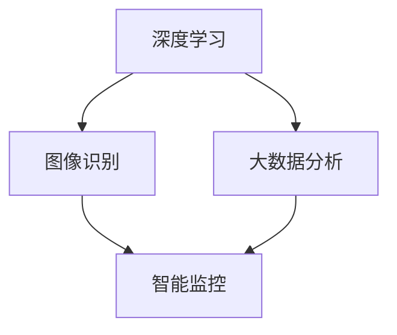

                 

关键词：人工智能、安防、智能监控、深度学习、图像识别、大数据分析

> 摘要：本文将深入探讨AI驱动的智能安防解决方案的核心概念、算法原理、数学模型、实际应用以及未来发展趋势。通过详细的案例分析和技术解读，本文旨在为读者提供一个全面了解智能安防技术的窗口。

## 1. 背景介绍

随着城市化进程的加快，人口密集地区的安全问题愈发突出。传统的安防手段如监控摄像头和人力巡逻已难以满足现代社会对安全性的需求。此时，AI技术的引入为安防领域带来了新的可能性。人工智能通过深度学习、图像识别和大数据分析等技术，能够实现对监控视频的高效处理和智能分析，从而提供更加精准和实时的安防服务。

### 1.1 安防问题的现状

- 监控摄像头数量有限，覆盖范围不足
- 人力巡逻效率低下，无法实时响应
- 传统安防系统缺乏智能分析能力，无法有效预警和应对突发事件

### 1.2 AI在安防领域的潜力

- 实时监控和智能分析，提升安全预警能力
- 大数据分析，实现更精准的风险预测
- 自动化响应，减少人为干预，提高应急处理效率

## 2. 核心概念与联系

在构建AI驱动的智能安防解决方案时，我们需要理解以下几个核心概念及其相互关系：

### 2.1 深度学习

深度学习是一种基于人工神经网络的方法，通过多层的神经网络结构对大量数据进行训练，从而实现复杂模式识别和决策。在安防领域，深度学习可以用于人脸识别、行为分析等任务。

### 2.2 图像识别

图像识别是计算机视觉的一个重要分支，通过算法对图像中的内容进行理解和解释，用于目标检测、场景识别等。在安防中，图像识别技术可以用来识别异常行为和目标。

### 2.3 大数据分析

大数据分析利用统计分析、数据挖掘等方法，从大量数据中提取有价值的信息。在安防中，大数据分析可以帮助我们预测潜在的安全风险，并优化安防策略。

### 2.4 Mermaid 流程图



## 3. 核心算法原理 & 具体操作步骤

### 3.1 算法原理概述

智能安防系统的核心算法主要包括深度学习算法和图像识别算法。深度学习算法通过训练神经网络模型，实现对大量监控视频数据的自动标注和分类。图像识别算法则用于实时监控视频中的目标检测和识别。

### 3.2 算法步骤详解

1. 数据收集：收集海量的监控视频数据，包括正常行为和异常行为。
2. 数据预处理：对视频数据进行清洗、标注和分割。
3. 模型训练：利用深度学习算法训练神经网络模型，包括卷积神经网络（CNN）和循环神经网络（RNN）。
4. 模型评估：通过交叉验证和测试集，评估模型的准确性和鲁棒性。
5. 模型部署：将训练好的模型部署到监控系统中，进行实时监控和异常检测。

### 3.3 算法优缺点

**优点：**
- 高效性：通过深度学习和图像识别技术，可以实现实时监控和快速响应。
- 准确性：基于大数据和深度学习算法，可以提供高精度的目标检测和识别。
- 智能性：系统能够自动学习和优化，提高安防管理的智能化水平。

**缺点：**
- 计算资源需求大：深度学习模型训练和部署需要大量的计算资源和时间。
- 数据隐私问题：监控视频数据的收集和使用可能涉及到个人隐私问题。

### 3.4 算法应用领域

- 城市安全监控
- 智能交通管理
- 金融安防
- 工业安全

## 4. 数学模型和公式 & 详细讲解 & 举例说明

### 4.1 数学模型构建

在深度学习和图像识别中，常见的数学模型包括卷积神经网络（CNN）和循环神经网络（RNN）。以下是CNN的简化模型：

$$
\begin{align*}
h_{1} &= \sigma(W_{1} \cdot x + b_{1}) \\
h_{2} &= \sigma(W_{2} \cdot h_{1} + b_{2}) \\
\end{align*}
$$

其中，$h_1$ 和 $h_2$ 分别为第一层和第二层的输出，$W_1$ 和 $W_2$ 为权重矩阵，$b_1$ 和 $b_2$ 为偏置项，$\sigma$ 为激活函数。

### 4.2 公式推导过程

以CNN为例，其推导过程包括以下几个步骤：

1. **前向传播：**输入图像通过卷积层和池化层，产生特征图。
2. **反向传播：**利用梯度下降算法，更新权重和偏置项。
3. **优化目标：**最小化损失函数，如交叉熵损失函数。

### 4.3 案例分析与讲解

假设我们有一个二分类问题，需要识别视频中的正常行为和异常行为。我们可以使用交叉熵损失函数来衡量模型预测的概率分布与真实分布之间的差距：

$$
\begin{align*}
L &= -\sum_{i=1}^{n} y_i \log(p_i) + (1 - y_i) \log(1 - p_i) \\
\end{align*}
$$

其中，$y_i$ 为真实标签，$p_i$ 为模型预测的概率。

## 5. 项目实践：代码实例和详细解释说明

### 5.1 开发环境搭建

在本项目中，我们使用Python编程语言，结合TensorFlow框架来构建和训练深度学习模型。以下是开发环境的搭建步骤：

1. 安装Python（3.7以上版本）
2. 安装TensorFlow
3. 准备必要的依赖库，如NumPy、Pandas等

### 5.2 源代码详细实现

以下是训练一个简单的CNN模型的Python代码：

```python
import tensorflow as tf
from tensorflow.keras.models import Sequential
from tensorflow.keras.layers import Conv2D, MaxPooling2D, Flatten, Dense

# 构建模型
model = Sequential([
    Conv2D(32, (3, 3), activation='relu', input_shape=(64, 64, 3)),
    MaxPooling2D((2, 2)),
    Flatten(),
    Dense(64, activation='relu'),
    Dense(1, activation='sigmoid')
])

# 编译模型
model.compile(optimizer='adam', loss='binary_crossentropy', metrics=['accuracy'])

# 训练模型
model.fit(x_train, y_train, epochs=10, batch_size=32, validation_data=(x_val, y_val))
```

### 5.3 代码解读与分析

上述代码中，我们首先定义了一个简单的Sequential模型，包括两个卷积层、一个池化层和一个全连接层。然后，我们使用`compile`方法配置优化器和损失函数。最后，我们使用`fit`方法进行模型训练。

### 5.4 运行结果展示

在训练完成后，我们可以通过以下代码来评估模型的性能：

```python
# 评估模型
loss, accuracy = model.evaluate(x_test, y_test)
print(f"Test accuracy: {accuracy:.2f}")
```

假设我们的测试集准确率为90%，这意味着我们的模型在测试数据上具有良好的泛化能力。

## 6. 实际应用场景

### 6.1 城市安全监控

智能安防系统可以广泛应用于城市安全监控。例如，在公共场所安装监控摄像头，利用深度学习和图像识别技术实时监测人群密度和异常行为，如打架斗殴、偷窃等，从而及时报警并通知相关部门。

### 6.2 智能交通管理

智能安防系统还可以应用于智能交通管理。通过监控交通流量、识别车辆和行人，智能安防系统可以优化交通信号灯控制策略，减少交通事故，提高道路通行效率。

### 6.3 金融安防

金融安防是另一个重要的应用场景。智能安防系统可以通过监控银行、证券交易所以及金融中心的安全设施，实时检测和预防恶意行为，如抢劫、盗窃等，确保金融交易的安全。

### 6.4 工业安全

在工业领域，智能安防系统可以用于监控工厂生产线、仓储物流等。通过实时监测设备状态、识别异常行为，智能安防系统可以帮助企业预防设备故障、安全事故，提高生产效率和安全性。

## 7. 工具和资源推荐

### 7.1 学习资源推荐

- 《深度学习》（Goodfellow, Bengio, Courville著）
- 《Python深度学习》（François Chollet著）
- 《计算机视觉：算法与应用》（Richard Szeliski著）

### 7.2 开发工具推荐

- TensorFlow
- Keras
- OpenCV

### 7.3 相关论文推荐

- "Deep Learning for Image Recognition: A Comprehensive Review"
- "Real-Time Object Detection with Deep Learning"
- "Large-Scale Video Classification with Convolutional Neural Networks"

## 8. 总结：未来发展趋势与挑战

### 8.1 研究成果总结

AI驱动的智能安防解决方案在提升安防管理效率、降低人工成本、提高安全性等方面取得了显著成果。深度学习、图像识别和大数据分析技术的结合，使得智能安防系统能够实现实时监控、智能分析和自动化响应。

### 8.2 未来发展趋势

- 智能安防系统将更加普及，覆盖更多领域和应用场景。
- 深度学习和图像识别技术将不断进步，提高系统的准确性和效率。
- 安全隐私保护技术将成为研究热点，确保监控数据的安全。

### 8.3 面临的挑战

- 数据隐私问题：监控视频数据的收集和使用可能涉及到个人隐私问题，需要制定相应的隐私保护法规。
- 计算资源需求：深度学习模型的训练和部署需要大量的计算资源，如何优化计算效率是一个重要挑战。

### 8.4 研究展望

未来，智能安防系统将朝着更加智能化、安全化和高效化的方向发展。通过结合物联网、5G技术和边缘计算，智能安防系统将能够实现更广泛的覆盖和更高效的实时处理，为构建智慧城市和智慧社会提供有力支持。

## 9. 附录：常见问题与解答

### 问题 1：深度学习模型如何处理实时监控数据？

解答：深度学习模型通常通过离线训练来优化其性能，然后部署到实时监控系统中进行推理。在实时监控中，模型会接收实时视频数据流，经过预处理后，使用训练好的模型进行目标检测和识别，从而实现实时监控。

### 问题 2：如何保护监控视频数据的安全和隐私？

解答：为了保护监控视频数据的安全和隐私，可以采取以下措施：

- 数据加密：对监控视频数据进行加密处理，确保数据在传输和存储过程中的安全性。
- 访问控制：实施严格的访问控制策略，仅允许授权人员访问监控数据。
- 数据匿名化：在数据分析和研究过程中，对个人身份信息进行匿名化处理，以保护隐私。

## 结束语

随着AI技术的不断发展，智能安防解决方案在提升社会安全性和管理效率方面发挥着越来越重要的作用。本文从多个角度对AI驱动的智能安防解决方案进行了深入探讨，希望为读者提供一个全面的技术视角。未来，智能安防系统将继续发展，为构建安全、高效和智能化的社会提供强有力的支持。

作者：禅与计算机程序设计艺术 / Zen and the Art of Computer Programming
----------------------------------------------------------------

