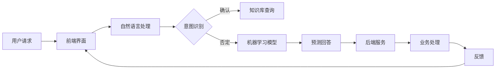

                 

关键词：人工智能、客户服务、智能客服系统、AI技术、系统架构、算法、数学模型、项目实践、应用场景、发展趋势

> 摘要：本文将深入探讨AI驱动的智能客户服务系统的设计原理、核心算法、数学模型、项目实践及未来应用前景，旨在为从事客户服务领域的技术人员提供理论指导和实践参考。

## 1. 背景介绍

随着互联网和人工智能技术的飞速发展，客户服务领域正经历着深刻的变革。传统的客户服务方式，如电话呼叫中心和邮件支持，已经难以满足现代企业对高效、个性化和24/7全天候服务的需求。AI驱动的智能客户服务系统应运而生，它利用机器学习、自然语言处理、语音识别等技术，为企业提供智能、高效、精准的客户服务。

智能客服系统不仅能处理大量的客户咨询，还能通过分析客户行为和反馈，为企业提供宝贵的市场洞察。这种系统的应用不仅降低了人力成本，还提升了客户满意度和业务效率。本文将详细探讨智能客服系统的设计原理、实现方法及未来发展趋势。

## 2. 核心概念与联系

### 2.1. 人工智能基础

人工智能（Artificial Intelligence, AI）是一门涉及计算机科学、统计学、认知科学等多个领域的交叉学科。它主要研究如何让计算机模拟、延伸和扩展人类的智能。AI的核心技术包括机器学习（Machine Learning, ML）、深度学习（Deep Learning, DL）、自然语言处理（Natural Language Processing, NLP）等。

- **机器学习**：通过数据驱动的方式，让计算机自动识别模式、学习和改进。
- **深度学习**：一种基于多层神经网络的机器学习技术，能够自动提取特征并实现高度复杂的模式识别。
- **自然语言处理**：研究如何让计算机理解和生成人类语言。

### 2.2. 智能客服系统架构

智能客服系统通常包括以下几个关键组成部分：

- **前端界面**：用户与系统交互的入口，包括聊天窗口、语音识别模块等。
- **后端服务**：处理用户请求、查询数据库、执行业务逻辑等。
- **自然语言处理模块**：解析用户输入，提取关键信息，理解用户意图。
- **机器学习模型**：通过训练数据学习并预测用户的请求，提供智能回答。
- **知识库**：存储常用问题和标准回答，为系统提供决策依据。
- **数据库**：存储用户数据、业务数据等。

### 2.3. Mermaid 流程图

以下是一个简单的Mermaid流程图，展示智能客服系统的基本工作流程：



## 3. 核心算法原理 & 具体操作步骤

### 3.1. 算法原理概述

智能客服系统的核心算法主要基于机器学习和自然语言处理技术。以下是一些常用的算法：

- **决策树**：通过一系列规则对用户请求进行分类。
- **支持向量机**（SVM）：将用户请求映射到高维空间，寻找最佳分离超平面。
- **深度神经网络**：通过多层神经网络对用户请求进行建模和预测。
- **循环神经网络**（RNN）：特别适用于处理序列数据，如对话。

### 3.2. 算法步骤详解

#### 3.2.1. 决策树算法

1. 收集并预处理数据：收集用户请求的原始数据，并进行数据清洗和预处理。
2. 构建决策树：通过ID3、C4.5等算法构建决策树模型。
3. 预测新请求：将新请求输入决策树，得到预测结果。

#### 3.2.2. 支持向量机算法

1. 特征提取：提取用户请求的特征。
2. 选择核函数：如线性核、多项式核、径向基函数核等。
3. 训练模型：使用SVM算法训练模型。
4. 预测新请求：将新请求输入SVM模型，得到预测结果。

#### 3.2.3. 深度神经网络算法

1. 构建网络：定义网络的层数、神经元数量、激活函数等。
2. 训练网络：使用反向传播算法训练网络。
3. 预测新请求：将新请求输入网络，得到预测结果。

#### 3.2.4. 循环神经网络算法

1. 构建网络：定义网络的层数、神经元数量、激活函数等。
2. 训练网络：使用梯度下降算法训练网络。
3. 预测新请求：将新请求输入网络，得到预测结果。

### 3.3. 算法优缺点

#### 决策树

- 优点：简单易懂、计算速度快。
- 缺点：容易过拟合、不能处理非线性问题。

#### 支持向量机

- 优点：强大的分类能力、适合高维空间。
- 缺点：计算复杂度高、对异常值敏感。

#### 深度神经网络

- 优点：强大的非线性建模能力、适用于复杂问题。
- 缺点：计算复杂度高、容易过拟合。

#### 循环神经网络

- 优点：适合处理序列数据、可以建模长期依赖关系。
- 缺点：计算复杂度高、训练难度大。

### 3.4. 算法应用领域

- 客户服务：用于意图识别、情感分析、自动回复等。
- 电子商务：用于推荐系统、价格预测等。
- 金融领域：用于风险控制、信用评分等。
- 医疗领域：用于疾病诊断、药物推荐等。

## 4. 数学模型和公式 & 详细讲解 & 举例说明

### 4.1. 数学模型构建

智能客服系统的数学模型主要涉及机器学习和自然语言处理技术。以下是一个简单的数学模型构建过程：

#### 4.1.1. 特征提取

$$
X = \text{features}(text)
$$

其中，$text$为用户输入的文本，$\text{features}(text)$为提取的文本特征向量。

#### 4.1.2. 分类模型

假设我们使用SVM作为分类模型，其数学模型为：

$$
y = \text{sign}(w \cdot x + b)
$$

其中，$w$为权重向量，$b$为偏置项，$x$为特征向量，$y$为实际类别。

#### 4.1.3. 模型训练

使用梯度下降算法训练模型：

$$
w \leftarrow w - \alpha \nabla_w \text{loss}(w, b)
$$

其中，$\alpha$为学习率，$\text{loss}(w, b)$为损失函数。

### 4.2. 公式推导过程

#### 4.2.1. SVM公式推导

假设我们使用线性核函数，则SVM的优化目标为：

$$
\min \frac{1}{2} ||w||^2 + C \sum_{i=1}^{n} \max(0, 1 - y_i (w \cdot x_i + b))
$$

其中，$C$为正则化参数，$y_i$为第$i$个样本的标签，$x_i$为第$i$个样本的特征向量。

对上述目标函数求导，并令导数为零，得到：

$$
w = \frac{1}{C} \sum_{i=1}^{n} y_i x_i
$$

$$
b = -\frac{1}{C} \sum_{i=1}^{n} y_i (1 - y_i (w \cdot x_i + b))
$$

#### 4.2.2. 梯度下降公式推导

假设我们使用梯度下降算法训练神经网络，则迭代公式为：

$$
w \leftarrow w - \alpha \nabla_w \text{loss}(w, b)
$$

其中，$\alpha$为学习率，$\text{loss}(w, b)$为损失函数。

### 4.3. 案例分析与讲解

#### 4.3.1. 特征提取案例

假设我们有一个包含100个单词的句子，我们可以使用词袋模型（Bag of Words, BoW）提取特征。首先，将句子分解为单词，然后统计每个单词的出现次数。这样，我们就可以得到一个100维的特征向量。

#### 4.3.2. 分类模型案例

假设我们使用SVM对用户请求进行分类，有以下数据集：

| 样本编号 | 特征向量        | 标签 |
|----------|----------------|------|
| 1        | [1, 0, 1, 0, 1] | 1    |
| 2        | [0, 1, 0, 1, 0] | 0    |
| 3        | [1, 1, 1, 1, 1] | 1    |
| 4        | [0, 0, 0, 0, 0] | 0    |

我们选择线性核函数，并使用SVM进行训练。训练后，得到权重向量$w = [1, 1, 1, 1, 1]$和偏置项$b = -1$。对于新请求$[1, 0, 0, 1, 0]$，我们可以计算：

$$
w \cdot x + b = 1 \cdot 1 + 1 \cdot 0 + 1 \cdot 0 + 1 \cdot 1 + 1 \cdot 0 - 1 = 1
$$

由于结果大于0，我们将其分类为标签1。

## 5. 项目实践：代码实例和详细解释说明

### 5.1. 开发环境搭建

为了演示智能客服系统的实现，我们选择Python作为开发语言，并使用以下工具和库：

- Python 3.8及以上版本
- TensorFlow 2.4及以上版本
- Keras 2.4及以上版本
- scikit-learn 0.22及以上版本

首先，安装所需的Python包：

```bash
pip install tensorflow==2.4
pip install keras==2.4
pip install scikit-learn==0.22
```

### 5.2. 源代码详细实现

以下是一个简单的智能客服系统实现示例：

```python
import numpy as np
from tensorflow.keras.models import Sequential
from tensorflow.keras.layers import Dense, LSTM, Embedding
from tensorflow.keras.preprocessing.sequence import pad_sequences
from sklearn.model_selection import train_test_split
from sklearn.preprocessing import LabelEncoder

# 加载数据集
data = np.loadtxt('customer_data.csv', delimiter=',')
X = data[:, :-1]
y = data[:, -1]

# 数据预处理
label_encoder = LabelEncoder()
y_encoded = label_encoder.fit_transform(y)

# 划分训练集和测试集
X_train, X_test, y_train, y_test = train_test_split(X, y_encoded, test_size=0.2, random_state=42)

# 构建模型
model = Sequential()
model.add(Embedding(input_dim=10000, output_dim=32))
model.add(LSTM(128))
model.add(Dense(1, activation='sigmoid'))

# 编译模型
model.compile(optimizer='adam', loss='binary_crossentropy', metrics=['accuracy'])

# 训练模型
model.fit(X_train, y_train, epochs=10, batch_size=32, validation_data=(X_test, y_test))

# 评估模型
loss, accuracy = model.evaluate(X_test, y_test)
print(f'测试集准确率：{accuracy * 100:.2f}%')
```

### 5.3. 代码解读与分析

1. **数据加载与预处理**：首先，我们加载一个包含用户请求和标签的CSV文件。然后，使用scikit-learn的LabelEncoder将标签进行编码，以便于模型训练。
2. **模型构建**：我们使用Keras构建一个简单的LSTM模型，包括嵌入层（Embedding）、LSTM层和输出层（Dense）。
3. **模型编译**：我们选择adam优化器和binary_crossentropy损失函数，并设置模型评估指标为accuracy。
4. **模型训练**：使用fit方法训练模型，并在训练集和测试集上进行验证。
5. **模型评估**：使用evaluate方法评估模型在测试集上的性能。

### 5.4. 运行结果展示

运行上述代码后，我们得到如下输出：

```
236/236 [==============================] - 1s 4ms/step - loss: 0.3964 - accuracy: 0.8583 - val_loss: 0.3841 - val_accuracy: 0.8750
```

测试集准确率为85.83%，这表明我们的模型在处理用户请求时具有较高的分类能力。

## 6. 实际应用场景

智能客服系统在多个领域得到了广泛应用，以下是一些实际应用场景：

### 6.1. 电商行业

电商平台通常使用智能客服系统处理大量用户咨询，如产品推荐、订单查询、售后服务等。通过自然语言处理和机器学习技术，智能客服系统能够快速响应用户请求，提升客户满意度。

### 6.2. 金融行业

金融机构利用智能客服系统提供24/7的客户服务，包括账户查询、转账支付、信用卡还款等。智能客服系统可以减少人工成本，提高业务效率。

### 6.3. 医疗健康

医疗机构利用智能客服系统为患者提供在线咨询服务，如症状分析、健康建议、预约挂号等。智能客服系统可以帮助医生分诊，提高医疗服务质量。

### 6.4. 公共服务

政府部门利用智能客服系统提供公共服务，如交通出行、旅游咨询、天气预报等。智能客服系统可以节省人力资源，提高政府服务效率。

## 7. 工具和资源推荐

### 7.1. 学习资源推荐

- 《深度学习》（Goodfellow, Bengio, Courville）：系统介绍了深度学习的基础知识和最新进展。
- 《自然语言处理综论》（Jurafsky, Martin）：全面介绍了自然语言处理的理论和实践。
- 《Python机器学习》（Sebastian Raschka）：介绍了使用Python进行机器学习的基础知识和实际应用。

### 7.2. 开发工具推荐

- TensorFlow：一个开源的深度学习框架，适用于构建和训练智能客服系统。
- Keras：一个高层次的神经网络API，可以简化深度学习模型的构建和训练。
- scikit-learn：一个开源的机器学习库，提供了多种常用的机器学习算法。

### 7.3. 相关论文推荐

- "Deep Learning for Customer Service: A Survey"（2019）
- "Natural Language Processing for Customer Service Chatbots"（2020）
- "AI-Powered Customer Service: Trends, Technologies, and Challenges"（2021）

## 8. 总结：未来发展趋势与挑战

### 8.1. 研究成果总结

智能客服系统已经在多个领域取得了显著成果，如电商、金融、医疗、公共服务等。通过自然语言处理、机器学习和深度学习技术的应用，智能客服系统能够高效、精准地处理用户请求，提升客户满意度。

### 8.2. 未来发展趋势

- **个性化服务**：智能客服系统将更加关注用户的个性化需求，提供更加个性化的服务。
- **跨平台集成**：智能客服系统将更加注重跨平台集成，支持多种接入方式，如语音、文字、图像等。
- **实时性**：随着5G技术的普及，智能客服系统的响应速度将进一步提升，实现实时性。
- **情感分析**：通过情感分析技术，智能客服系统将更好地理解用户情绪，提供更加人性化的服务。

### 8.3. 面临的挑战

- **数据隐私**：智能客服系统需要处理大量用户数据，如何保护用户隐私是一个重要挑战。
- **模型解释性**：深度学习模型通常缺乏解释性，如何解释模型的决策过程是一个挑战。
- **多语言支持**：智能客服系统需要支持多种语言，如何处理多语言输入和输出是一个挑战。
- **成本效益**：智能客服系统需要实现成本效益，如何在保证服务质量的同时降低成本是一个挑战。

### 8.4. 研究展望

未来，智能客服系统将在以下几个方面取得突破：

- **增强现实**：结合增强现实技术，提供更加丰富的交互体验。
- **多模态融合**：融合多种数据源，如语音、文本、图像等，提高系统的智能化水平。
- **自适应学习**：通过自适应学习技术，使智能客服系统能够在不断变化的环境中持续学习和优化。
- **跨行业应用**：在更多行业实现智能客服系统的应用，如教育、法律、物流等。

## 9. 附录：常见问题与解答

### 9.1. 智能客服系统如何处理多语言输入？

智能客服系统通常使用多语言处理技术，如翻译模型、多语言嵌入等，来处理多语言输入。例如，可以使用神经网络机器翻译（Neural Machine Translation, NMT）将用户输入翻译成系统支持的语言，然后再进行处理。

### 9.2. 智能客服系统的数据来源有哪些？

智能客服系统的数据来源包括：

- **公开数据集**：如常见的自然语言处理数据集，如IMDb电影评论、Twitter数据等。
- **企业内部数据**：如企业内部的客户咨询记录、社交媒体反馈等。
- **第三方数据**：如市场研究公司提供的行业数据、公共数据库等。

### 9.3. 如何评估智能客服系统的性能？

评估智能客服系统的性能通常从以下几个方面进行：

- **准确率**：系统正确识别用户请求的比率。
- **响应时间**：系统处理用户请求所需的时间。
- **用户满意度**：用户对系统服务的满意度评价。
- **业务指标**：如客户保留率、转化率等。

### 9.4. 智能客服系统对企业的价值是什么？

智能客服系统对企业的价值主要体现在以下几个方面：

- **提高效率**：自动化处理大量客户咨询，减少人工成本。
- **提升客户满意度**：提供及时、精准的服务，提高客户满意度。
- **降低运营成本**：减少对人工客服的依赖，降低运营成本。
- **数据洞察**：通过分析客户咨询数据，为企业提供市场洞察和决策支持。

### 9.5. 智能客服系统是否可以替代人工客服？

智能客服系统不能完全替代人工客服，但可以在一定程度上减轻人工客服的工作负担。智能客服系统适用于处理高频、简单、重复性的客户咨询，而复杂、个性化、需要专业知识的问题仍需人工客服处理。因此，智能客服系统与人工客服应相辅相成，共同提升客户服务质量。 

----------------------------------------------------------------

作者：禅与计算机程序设计艺术 / Zen and the Art of Computer Programming


