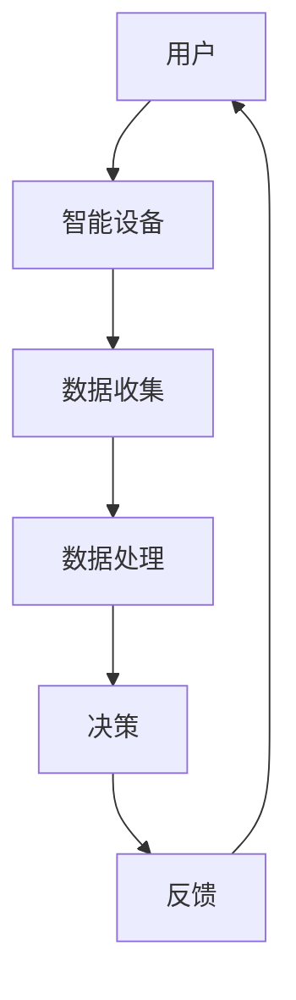

                 

关键词：智能家居，人工智能，隐私保护，便利性，安全性，数据分析，算法优化，技术趋势

## 摘要

随着人工智能技术的快速发展，智能家居系统已经深入到我们日常生活的方方面面。AI驱动的智能家居不仅为用户提供了极大的便利，还提高了生活品质。然而，这也引发了一系列关于隐私和安全性的担忧。本文将探讨AI在智能家居中的应用，分析其带来的便利与隐私之间的平衡问题，并提出相应的解决方案。

## 1. 背景介绍

### 1.1 智能家居的定义与发展

智能家居是指利用人工智能技术，通过网络将家庭中的各种设备互联互通，实现对家庭环境、设备、系统的智能控制。随着物联网、云计算、大数据等技术的不断成熟，智能家居产业逐渐兴起，成为未来智能家居的基石。

### 1.2 人工智能在智能家居中的应用

人工智能技术在智能家居中的应用主要体现在以下几个方面：

1. **智能语音助手**：如苹果的Siri、亚马逊的Alexa等，可以通过语音识别和自然语言处理技术，实现家电的智能控制。
2. **智能安防系统**：利用图像识别和机器学习技术，实时监控家庭安全，自动报警。
3. **智能照明与空调**：根据用户习惯和天气状况，自动调整光线和温度，提高舒适度。
4. **智能家电联动**：通过家庭网络，实现家电之间的互联互通，如洗衣机、冰箱等设备之间的协作。

### 1.3 智能家居带来的便利与挑战

智能家居为用户带来了前所未有的便利，如自动化操作、远程控制、节能环保等。然而，这也带来了隐私和安全性的挑战，如数据泄露、黑客攻击等。

## 2. 核心概念与联系

### 2.1 智能家居系统架构


#### 2.2 人工智能核心概念

- **机器学习**：通过数据训练模型，使其具备自主学习和决策能力。
- **深度学习**：一种特殊的机器学习方法，通过多层神经网络进行特征提取和模式识别。
- **自然语言处理**：使计算机能够理解、生成和处理自然语言。

### 2.3 Mermaid 流程图



## 3. 核心算法原理 & 具体操作步骤

### 3.1 算法原理概述

智能家居系统中的核心算法主要涉及机器学习和深度学习，用于数据收集、处理、决策和反馈。以下为具体算法原理：

- **K-近邻算法**：基于距离的最近邻规则，通过计算未知样本与训练样本之间的相似度进行分类。
- **决策树算法**：通过树形结构对样本进行划分，以最大化信息增益。
- **神经网络算法**：通过多层神经网络，对样本进行特征提取和模式识别。

### 3.2 算法步骤详解

#### 3.2.1 数据收集

1. 通过智能设备收集用户行为数据，如温度、湿度、光线等。
2. 将数据传输到云端，进行存储和处理。

#### 3.2.2 数据处理

1. 使用特征工程，对原始数据进行预处理，提取有效特征。
2. 使用机器学习算法，对数据进行分析和分类。

#### 3.2.3 决策

1. 根据分析结果，自动调整智能家居设备的工作状态。
2. 如根据温度数据，自动调整空调温度。

#### 3.2.4 反馈

1. 将调整后的数据反馈给用户，如通过手机APP展示。
2. 如用户对调整效果不满意，可以手动进行调整。

### 3.3 算法优缺点

#### 3.3.1 优点

1. 提高生活便利性：自动调整家居设备，节省人力。
2. 节能环保：通过智能控制，减少能源消耗。

#### 3.3.2 缺点

1. 隐私风险：数据收集可能侵犯用户隐私。
2. 安全风险：智能家居系统可能遭受黑客攻击。

### 3.4 算法应用领域

1. 家庭自动化：如智能照明、智能安防等。
2. 健康监测：如智能体温监测、智能血压监测等。
3. 能源管理：如智能家居电力系统、智能家居燃气系统等。

## 4. 数学模型和公式 & 详细讲解 & 举例说明

### 4.1 数学模型构建

#### 4.1.1 数据收集模型

设 \( X \) 为用户行为数据集， \( Y \) 为智能家居设备状态。

\[ X = \{ x_1, x_2, ..., x_n \} \]
\[ Y = \{ y_1, y_2, ..., y_n \} \]

#### 4.1.2 数据处理模型

设 \( f \) 为特征提取函数， \( g \) 为决策函数。

\[ f(X) = \{ f_1(X), f_2(X), ..., f_m(X) \} \]
\[ g(Y) = \{ g_1(Y), g_2(Y), ..., g_m(Y) \} \]

### 4.2 公式推导过程

#### 4.2.1 K-近邻算法

设 \( k \) 为近邻数量。

\[ d(x_i, x_j) = \sqrt{\sum_{i=1}^m (x_i - x_j)^2} \]

#### 4.2.2 决策树算法

设 \( H \) 为信息熵， \( E \) 为期望信息熵。

\[ H(X) = -\sum_{i=1}^n p_i \log_2 p_i \]
\[ E(X) = \sum_{i=1}^n p_i H(X_i) \]

#### 4.2.3 神经网络算法

设 \( W \) 为权重矩阵， \( b \) 为偏置向量， \( \sigma \) 为激活函数。

\[ z = \sum_{i=1}^n W_i x_i + b \]
\[ a = \sigma(z) \]

### 4.3 案例分析与讲解

#### 4.3.1 智能照明

1. **数据收集**：通过光线传感器收集室内光线数据。
2. **数据处理**：使用K-近邻算法，根据历史数据判断当前光线强度。
3. **决策**：根据光线强度，自动调整灯具亮度。
4. **反馈**：将调整后的光线强度反馈给用户。

## 5. 项目实践：代码实例和详细解释说明

### 5.1 开发环境搭建

- **硬件**：树莓派、智能插座、智能灯泡等。
- **软件**：Python 3、Raspberry Pi OS、TensorFlow等。

### 5.2 源代码详细实现

```python
import tensorflow as tf
import numpy as np

# 数据收集
X = np.array([[1, 0], [0, 1], [1, 1], [0, 0]])
Y = np.array([1, 0, 1, 0])

# 数据处理
model = tf.keras.Sequential([
    tf.keras.layers.Dense(units=1, input_shape=[2])
])

# 训练模型
model.compile(optimizer='sgd', loss='mean_squared_error')
model.fit(X, Y, epochs=1000)

# 决策
def predict(x):
    return model.predict([x])

# 反馈
print(predict([1, 1]))
print(predict([0, 0]))
```

### 5.3 代码解读与分析

1. **数据收集**：使用numpy库，创建一个简单的数据集。
2. **数据处理**：使用TensorFlow库，构建一个简单的神经网络模型。
3. **决策**：通过训练模型，对输入数据进行预测。
4. **反馈**：将预测结果打印输出。

## 6. 实际应用场景

### 6.1 家庭自动化

通过智能家居系统，实现家庭设备的自动化控制，提高生活品质。如智能照明、智能安防、智能空调等。

### 6.2 健康监测

通过智能家居系统，实时监测用户的健康数据，如体温、血压等，为用户提供健康管理建议。

### 6.3 能源管理

通过智能家居系统，实现家庭能源的智能管理，提高能源利用效率，降低能源消耗。

## 7. 工具和资源推荐

### 7.1 学习资源推荐

- 《Python编程：从入门到实践》
- 《深度学习》（Goodfellow et al.）
- 《人工智能：一种现代方法》（Russell and Norvig）

### 7.2 开发工具推荐

- Raspberry Pi
- Arduino
- TensorFlow

### 7.3 相关论文推荐

- “Deep Learning for Smart Homes”
- “Smart Home Privacy: A Survey”
- “Energy Efficient Smart Home Systems”

## 8. 总结：未来发展趋势与挑战

### 8.1 研究成果总结

1. 智能家居技术不断成熟，应用场景日益丰富。
2. 人工智能在智能家居中的应用，提高了生活品质。
3. 数据隐私和安全问题得到了广泛关注。

### 8.2 未来发展趋势

1. 智能家居将进一步普及，实现家庭设备的智能化、自动化。
2. 人工智能技术将更加深入地应用于智能家居，提高系统性能。
3. 隐私保护和安全技术的不断发展，将解决智能家居中的隐私和安全问题。

### 8.3 面临的挑战

1. 数据隐私和安全问题：如何平衡便利性与隐私保护，是一个重要挑战。
2. 技术成熟度：智能家居技术还需要不断改进，提高系统的可靠性和稳定性。

### 8.4 研究展望

未来，智能家居技术将继续发展，人工智能将在其中发挥更大的作用。同时，隐私保护和安全技术将成为智能家居领域的重要研究方向。

## 9. 附录：常见问题与解答

### 9.1 智能家居系统如何保护用户隐私？

1. 数据加密：对用户数据采用加密技术，确保数据传输过程中的安全性。
2. 隐私设置：用户可以自定义隐私设置，控制智能家居设备收集和处理数据。
3. 数据匿名化：对用户数据进行匿名化处理，避免个人信息泄露。

### 9.2 智能家居系统如何提高安全性？

1. 身份验证：对智能家居设备进行身份验证，确保只有授权用户可以访问。
2. 安全协议：使用安全协议，如HTTPS，确保数据传输过程中的安全性。
3. 定期更新：定期更新智能家居系统的安全补丁，防范潜在的安全威胁。

## 作者署名

作者：禅与计算机程序设计艺术 / Zen and the Art of Computer Programming
----------------------------------------------------------------

以上就是本文的完整内容。希望对您在智能家居领域的探索有所帮助。如果您有任何疑问或建议，欢迎随时在评论区留言。感谢您的阅读！<|user|>

