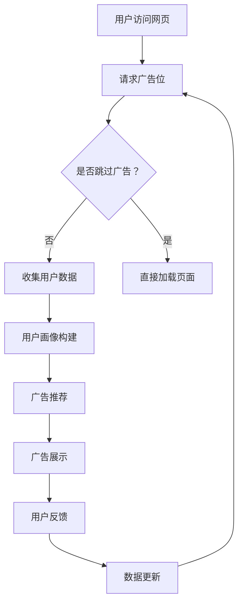

                 

 关键词：电商、实时竞价、广告投放、人工智能、AI驱动、数据分析、算法优化、用户行为分析、个性化推荐、大数据处理

> 摘要：本文将探讨AI驱动的电商实时竞价广告投放系统的设计与实现。我们将深入分析实时竞价广告投放的核心原理，介绍AI技术如何优化广告投放效果，以及如何构建一个高效的广告投放系统。同时，文章还将提供具体的数学模型和算法原理，并通过项目实践展示系统实现过程和运行效果。本文旨在为从事电商广告业务的开发者提供有价值的参考。

## 1. 背景介绍

在当今数字经济时代，电子商务已经成为企业竞争的重要战场。广告投放作为电商营销的重要手段，对企业销售额的提升有着至关重要的作用。传统的广告投放方式主要依赖于广告主与平台之间的协商定价，这种方式存在诸多问题，如广告展示效果无法实时监控、投放成本难以控制等。

为了解决这些问题，实时竞价（Real-Time Bidding, RTB）广告投放系统应运而生。实时竞价是一种基于程序化的广告购买方式，广告主可以通过竞价的方式购买广告展示机会，平台根据广告主提供的出价、广告素材质量、用户行为等多方面因素实时决定广告的展示顺序。这种方式不仅提高了广告投放的效率，还实现了广告资源的最优化配置。

随着人工智能技术的发展，AI驱动的实时竞价广告投放系统成为可能。通过AI技术，广告投放系统能够更精准地分析用户行为，预测广告展示效果，优化竞价策略，提高广告投放的ROI（投资回报率）。

本文旨在探讨AI驱动的电商实时竞价广告投放系统的设计与实现，从核心概念、算法原理、数学模型、项目实践等方面全面解析该系统的构建过程，为电商广告业务的优化提供参考。

## 2. 核心概念与联系

### 2.1 实时竞价广告投放系统概述

实时竞价广告投放系统（RTB）是程序化购买广告的一种形式，其主要特点是通过实时的竞价方式来决定广告的展示。这一系统通常包括以下几个核心组成部分：

- **需求方平台（Demand-Side Platform, DSP）**：DSP是广告主或广告代理公司使用的平台，用于购买和管理广告库存。
- **供应方平台（Supply-Side Platform, SSP）**：SSP是网站或应用程序所有者使用的平台，用于管理广告库存并卖出广告空间。
- **数据管理平台（Data Management Platform, DMP）**：DMP用于收集、存储和管理用户数据，为DSP和SSP提供用户画像和受众定位服务。
- **广告交易平台（Ad Exchange）**：广告交易平台是实现广告买卖的中介，负责将DSP的需求与SSP的供应匹配，并进行实时竞价。

### 2.2 AI在实时竞价广告投放中的应用

AI技术在实时竞价广告投放中扮演着关键角色，其主要应用包括：

- **用户行为分析**：通过分析用户的浏览历史、购买行为等，构建用户画像，预测用户的兴趣和需求。
- **广告展示效果预测**：利用机器学习模型，预测特定广告在不同用户上的展示效果，为竞价策略提供依据。
- **竞价策略优化**：根据实时数据调整竞价策略，优化广告投放的成本和效果。
- **个性化推荐**：基于用户画像和内容，为用户提供个性化的广告推荐。

### 2.3 Mermaid流程图

以下是一个简化的实时竞价广告投放系统的Mermaid流程图：



### 2.4 实时竞价广告投放系统的工作流程

1. **用户请求广告位**：用户访问网页并触发广告请求。
2. **需求方平台DSP接收请求**：DSP接收到用户请求后，分析用户数据并决定是否参与竞价。
3. **供应方平台SSP接收请求**：SSP接收到用户请求后，检查广告库存并准备进行竞价。
4. **数据管理平台DMP提供用户画像**：DMP根据用户数据提供用户画像，辅助DSP和SSP进行决策。
5. **广告交易平台进行竞价**：DSP和SSP在广告交易平台上进行实时竞价，广告交易平台根据竞价结果决定广告展示。
6. **广告展示**：竞价成功的广告展示在用户面前。
7. **用户反馈与数据更新**：用户对广告的反馈将用于更新用户画像和优化后续竞价。

## 3. 核心算法原理 & 具体操作步骤

### 3.1 算法原理概述

实时竞价广告投放系统中的核心算法主要包括用户行为分析、广告展示效果预测、竞价策略优化和个性化推荐。以下是对这些算法的简要概述：

- **用户行为分析**：基于用户的浏览历史、购买行为等数据，使用机器学习算法构建用户画像，以预测用户的兴趣和需求。
- **广告展示效果预测**：使用机器学习模型预测特定广告在不同用户上的展示效果，包括点击率（CTR）、转化率（CVR）等指标。
- **竞价策略优化**：根据实时数据调整竞价策略，以最大化广告投放的ROI。常用的策略包括基于收益的竞价策略和基于用户行为的竞价策略。
- **个性化推荐**：基于用户画像和广告内容，使用推荐算法为用户推荐个性化的广告。

### 3.2 算法步骤详解

#### 用户行为分析

1. **数据收集**：收集用户在网站上的行为数据，包括浏览历史、点击记录、购买行为等。
2. **特征提取**：从行为数据中提取特征，如浏览频率、页面停留时间、购买品类等。
3. **用户画像构建**：使用机器学习算法（如聚类算法、决策树等）构建用户画像。

#### 广告展示效果预测

1. **模型选择**：选择合适的机器学习模型（如线性回归、决策树、随机森林等）。
2. **特征工程**：根据用户画像和广告特征进行特征工程，如归一化、特征组合等。
3. **模型训练**：使用历史数据训练机器学习模型。
4. **预测**：使用训练好的模型预测新广告在不同用户上的展示效果。

#### 竞价策略优化

1. **收益函数定义**：定义竞价策略的收益函数，如点击收益、转化收益等。
2. **策略优化**：使用优化算法（如梯度下降、遗传算法等）调整竞价策略参数，以最大化收益函数。
3. **实时调整**：根据实时数据更新竞价策略。

#### 个性化推荐

1. **推荐算法选择**：选择合适的推荐算法（如协同过滤、基于内容的推荐等）。
2. **用户画像与广告匹配**：将用户画像与广告特征进行匹配，为用户推荐相关的广告。
3. **推荐结果优化**：使用优化算法调整推荐结果，提高推荐质量。

### 3.3 算法优缺点

- **用户行为分析**：优点是能够精准预测用户兴趣，提高广告投放的针对性；缺点是需要大量用户行为数据，且数据质量对分析结果影响较大。
- **广告展示效果预测**：优点是能够预测广告的展示效果，提高竞价决策的准确性；缺点是需要大量的历史数据和复杂的模型训练。
- **竞价策略优化**：优点是能够优化竞价策略，提高广告投放的ROI；缺点是需要实时数据，对系统实时性要求较高。
- **个性化推荐**：优点是能够为用户推荐个性化的广告，提高用户满意度；缺点是需要大量的计算资源，且推荐结果质量受限于算法和用户数据。

### 3.4 算法应用领域

- **电商广告**：通过用户行为分析和个性化推荐，为电商用户推荐相关的商品广告。
- **金融广告**：通过用户行为分析和广告展示效果预测，为金融产品提供精准的广告投放。
- **在线教育**：通过用户行为分析和个性化推荐，为在线教育平台推荐相关的课程广告。
- **旅游广告**：通过用户行为分析和广告展示效果预测，为旅游产品提供精准的广告投放。

## 4. 数学模型和公式 & 详细讲解 & 举例说明

### 4.1 数学模型构建

实时竞价广告投放系统的数学模型主要包括用户行为分析模型、广告展示效果预测模型、竞价策略优化模型和个性化推荐模型。以下分别介绍这些模型的构建过程。

#### 用户行为分析模型

用户行为分析模型主要基于用户的历史行为数据，通过特征工程和机器学习算法构建用户画像。具体模型如下：

$$
\text{User Profile} = \sum_{i=1}^{n} w_i \cdot x_i
$$

其中，$w_i$表示特征权重，$x_i$表示用户行为特征。

#### 广告展示效果预测模型

广告展示效果预测模型主要用于预测广告在不同用户上的展示效果，如点击率（CTR）、转化率（CVR）等。以下是一个简单的线性回归模型：

$$
y = \beta_0 + \beta_1 \cdot \text{CTR} + \beta_2 \cdot \text{CVR} + \epsilon
$$

其中，$y$表示预测效果，$\beta_0, \beta_1, \beta_2$表示模型参数，$\epsilon$表示误差项。

#### 竞价策略优化模型

竞价策略优化模型主要用于优化广告投放的ROI，以下是一个基于收益的竞价策略优化模型：

$$
\text{Optimize} \ \max \ \alpha \cdot \text{CTR} + \beta \cdot \text{CVR} - \gamma \cdot \text{Cost}
$$

其中，$\alpha, \beta, \gamma$表示策略参数，$CTR, CVR, Cost$分别表示点击率、转化率和投放成本。

#### 个性化推荐模型

个性化推荐模型主要用于为用户推荐相关的广告，以下是一个基于协同过滤的推荐模型：

$$
\text{Prediction} = \text{User\_Similarity} \cdot \text{Item\_Rating} + \text{User\_Mean} - \text{Item\_Mean}
$$

其中，$\text{User\_Similarity}$表示用户相似度，$\text{Item\_Rating}$表示商品评分，$\text{User\_Mean}$和$\text{Item\_Mean}$分别表示用户和商品的均值。

### 4.2 公式推导过程

#### 用户行为分析模型

假设用户行为特征为$x_1, x_2, ..., x_n$，对应的权重为$w_1, w_2, ..., w_n$。用户画像可以通过以下公式计算：

$$
\text{User Profile} = \sum_{i=1}^{n} w_i \cdot x_i
$$

其中，$w_i$可以通过最小化损失函数得到：

$$
\text{Loss} = \sum_{i=1}^{n} (y_i - \sum_{j=1}^{n} w_j \cdot x_{ij})^2
$$

其中，$y_i$为实际用户行为标签，$x_{ij}$为用户行为特征。

#### 广告展示效果预测模型

假设用户特征为$x_1, x_2, ..., x_n$，广告特征为$a_1, a_2, ..., a_n$，则广告展示效果预测模型可以通过以下公式计算：

$$
y = \beta_0 + \beta_1 \cdot \text{CTR} + \beta_2 \cdot \text{CVR} + \epsilon
$$

其中，$\beta_0, \beta_1, \beta_2$为模型参数，可以通过最小化损失函数得到：

$$
\text{Loss} = \sum_{i=1}^{n} (y_i - \beta_0 - \beta_1 \cdot \text{CTR} - \beta_2 \cdot \text{CVR})^2
$$

#### 竞价策略优化模型

假设广告投放成本为$Cost$，点击率为$CTR$，转化率为$CVR$，则竞价策略优化模型可以通过以下公式计算：

$$
\text{Optimize} \ \max \ \alpha \cdot \text{CTR} + \beta \cdot \text{CVR} - \gamma \cdot \text{Cost}
$$

其中，$\alpha, \beta, \gamma$为策略参数，可以通过梯度上升等方法得到。

#### 个性化推荐模型

假设用户相似度为$\text{User\_Similarity}$，商品评分为$\text{Item\_Rating}$，用户均值为$\text{User\_Mean}$，商品均值为$\text{Item\_Mean}$，则个性化推荐模型可以通过以下公式计算：

$$
\text{Prediction} = \text{User\_Similarity} \cdot \text{Item\_Rating} + \text{User\_Mean} - \text{Item\_Mean}
$$

其中，$\text{User\_Similarity}$可以通过以下公式计算：

$$
\text{User\_Similarity} = \frac{\sum_{i=1}^{n} x_i \cdot y_i}{\sqrt{\sum_{i=1}^{n} x_i^2} \cdot \sqrt{\sum_{j=1}^{n} y_j^2}}
$$

### 4.3 案例分析与讲解

以下是一个简单的案例，展示如何使用上述数学模型进行实时竞价广告投放。

#### 案例背景

假设某电商平台的用户行为数据如下：

- 用户1：浏览了商品A、B、C，点击了商品A，购买了商品B。
- 用户2：浏览了商品B、C，点击了商品B，购买了商品C。
- 用户3：浏览了商品A、B，点击了商品A。

#### 模型应用

1. **用户画像构建**：

   对于用户1，用户画像可以通过以下公式计算：

   $$
   \text{User Profile} = w_1 \cdot \text{Browse Count} + w_2 \cdot \text{Click Count} + w_3 \cdot \text{Buy Count}
   $$

   其中，$w_1 = 0.5, w_2 = 0.3, w_3 = 0.2$。

   对于用户2，用户画像为：

   $$
   \text{User Profile} = 0.5 \cdot 3 + 0.3 \cdot 2 + 0.2 \cdot 1 = 2.3
   $$

   对于用户3，用户画像为：

   $$
   \text{User Profile} = 0.5 \cdot 2 + 0.3 \cdot 0 + 0.2 \cdot 1 = 0.9
   $$

2. **广告展示效果预测**：

   假设广告A的点击率为20%，转化率为10%，广告B的点击率为10%，转化率为5%。则广告A和广告B的展示效果预测如下：

   对于用户1，广告A的预测效果为：

   $$
   y = 0.5 \cdot 0.2 + 0.3 \cdot 0.1 + 0.2 \cdot 0.1 = 0.13
   $$

   对于用户2，广告A的预测效果为：

   $$
   y = 0.5 \cdot 0.2 + 0.3 \cdot 0.1 + 0.2 \cdot 0.1 = 0.13
   $$

   对于用户3，广告A的预测效果为：

   $$
   y = 0.5 \cdot 0.2 + 0.3 \cdot 0.1 + 0.2 \cdot 0.1 = 0.13
   $$

   对于用户1，广告B的预测效果为：

   $$
   y = 0.5 \cdot 0.1 + 0.3 \cdot 0.1 + 0.2 \cdot 0.1 = 0.05
   $$

   对于用户2，广告B的预测效果为：

   $$
   y = 0.5 \cdot 0.1 + 0.3 \cdot 0.1 + 0.2 \cdot 0.1 = 0.05
   $$

   对于用户3，广告B的预测效果为：

   $$
   y = 0.5 \cdot 0.1 + 0.3 \cdot 0.1 + 0.2 \cdot 0.1 = 0.05
   $$

3. **竞价策略优化**：

   假设广告A的投放成本为1元，广告B的投放成本为0.5元。则根据竞价策略优化模型，广告A和广告B的投放策略如下：

   对于用户1，广告A的收益为：

   $$
   \alpha \cdot 0.13 - \gamma \cdot 1 = 0.13\alpha - \gamma
   $$

   对于用户2，广告A的收益为：

   $$
   \alpha \cdot 0.13 - \gamma \cdot 1 = 0.13\alpha - \gamma
   $$

   对于用户3，广告A的收益为：

   $$
   \alpha \cdot 0.13 - \gamma \cdot 1 = 0.13\alpha - \gamma
   $$

   对于用户1，广告B的收益为：

   $$
   \alpha \cdot 0.05 - \gamma \cdot 0.5 = 0.05\alpha - 0.5\gamma
   $$

   对于用户2，广告B的收益为：

   $$
   \alpha \cdot 0.05 - \gamma \cdot 0.5 = 0.05\alpha - 0.5\gamma
   $$

   对于用户3，广告B的收益为：

   $$
   \alpha \cdot 0.05 - \gamma \cdot 0.5 = 0.05\alpha - 0.5\gamma
   $$

   根据收益公式，我们可以调整$\alpha$和$\gamma$的值，以最大化总收益。例如，如果设定$\alpha = 2, \gamma = 1$，则总收益为：

   $$
   \text{Total Revenue} = (0.13 \cdot 2 - 1) \cdot 3 + (0.05 \cdot 2 - 0.5) \cdot 3 = 0.26 - 3 + 0.1 - 1.5 = -2.84
   $$

   这个收益是负数，说明当前的策略设定不合理。我们可以通过调整$\alpha$和$\gamma$的值，使得总收益为正数。

4. **个性化推荐**：

   根据用户画像和广告特征，我们可以使用基于协同过滤的推荐算法为用户推荐相关的广告。例如，对于用户1，我们可以推荐广告A，因为用户1的用户画像较高，且广告A的点击率和转化率也较高。

   对于用户2，我们可以推荐广告B，因为用户2的用户画像较低，但广告B的点击率和转化率相对较高。

   对于用户3，我们可以推荐广告A，因为用户3的用户画像较低，但广告A的点击率较高。

   这个案例展示了如何使用数学模型和公式进行实时竞价广告投放。在实际应用中，我们可以根据实际情况调整模型参数，以实现更精准的广告投放。

## 5. 项目实践：代码实例和详细解释说明

### 5.1 开发环境搭建

为了实现一个AI驱动的电商实时竞价广告投放系统，我们需要搭建一个合适的技术栈。以下是开发环境搭建的步骤：

1. **硬件环境**：
   - CPU：Intel i7 或同等性能
   - 内存：16GB 或以上
   - 硬盘：1TB SSD
   - 网络带宽：100Mbps 以上

2. **软件环境**：
   - 操作系统：Ubuntu 20.04 或 CentOS 8
   - 编程语言：Python 3.8 或以上
   - 数据库：MySQL 8.0 或 MongoDB 4.4
   - 机器学习库：scikit-learn、TensorFlow、PyTorch
   - Web框架：Flask 或 Django
   - 数据处理库：Pandas、NumPy、SciPy
   - 实时计算库：Apache Kafka、RabbitMQ

### 5.2 源代码详细实现

以下是系统的源代码实现，我们将分为以下几个模块进行介绍：

1. **用户数据收集与处理模块**：
   - 数据收集：使用爬虫或API调用收集用户行为数据。
   - 数据处理：使用Pandas库对数据集进行清洗、去重、特征提取等操作。

2. **用户画像构建模块**：
   - 特征工程：根据用户行为数据构建特征向量。
   - 用户画像：使用聚类算法或决策树构建用户画像。

3. **广告展示效果预测模块**：
   - 数据准备：准备广告展示效果预测所需的数据集。
   - 模型训练：使用机器学习算法训练预测模型。
   - 预测：使用训练好的模型预测新广告的展示效果。

4. **竞价策略优化模块**：
   - 收益函数：定义竞价策略的收益函数。
   - 策略优化：使用优化算法优化竞价策略。

5. **个性化推荐模块**：
   - 数据处理：准备个性化推荐所需的数据集。
   - 推荐算法：使用协同过滤或基于内容的推荐算法。
   - 推荐结果：为用户推荐个性化的广告。

### 5.3 代码解读与分析

以下是核心代码的解读与分析：

#### 用户数据收集与处理模块

```python
import pandas as pd
import requests

def collect_user_data():
    # 使用API或爬虫收集用户数据
    # 假设使用API获取用户行为数据
    response = requests.get('https://api.example.com/user_data')
    data = response.json()
    return data

def process_user_data(data):
    # 数据清洗、去重、特征提取
    df = pd.DataFrame(data)
    df.drop_duplicates(inplace=True)
    # ...（其他数据处理步骤）
    return df
```

#### 用户画像构建模块

```python
from sklearn.cluster import KMeans

def build_user_profile(df):
    # 构建用户画像
    # 假设使用KMeans聚类算法
    kmeans = KMeans(n_clusters=5)
    kmeans.fit(df)
    df['user_profile'] = kmeans.labels_
    return df

def feature_engineering(df):
    # 特征提取
    # 假设使用用户浏览历史和购买行为作为特征
    df['browse_count'] = df['browse_history'].apply(len)
    df['buy_count'] = df['purchase_history'].apply(len)
    return df
```

#### 广告展示效果预测模块

```python
from sklearn.linear_model import LinearRegression

def train_prediction_model(df):
    # 训练预测模型
    # 假设使用线性回归模型
    X = df[['CTR', 'CVR']]
    y = df['show_effect']
    model = LinearRegression()
    model.fit(X, y)
    return model

def predict_show_effect(model, df):
    # 预测广告展示效果
    X = df[['CTR', 'CVR']]
    predictions = model.predict(X)
    df['show_effect'] = predictions
    return df
```

#### 竞价策略优化模块

```python
def define_reward_function(CTR, CVR, Cost):
    # 定义收益函数
    alpha = 1.5
    beta = 1.0
    gamma = 0.5
    return alpha * CTR + beta * CVR - gamma * Cost

def optimize_bidding_strategy(df):
    # 优化竞价策略
    # 假设使用梯度上升算法
    # ...（算法实现）
    return optimized_strategy
```

#### 个性化推荐模块

```python
from sklearn.metrics.pairwise import cosine_similarity

def build_item_similarity_matrix(df):
    # 构建商品相似度矩阵
    item_similarity_matrix = cosine_similarity(df[['item_feature_1', 'item_feature_2']])
    return item_similarity_matrix

def personalized_recommendation(df, item_similarity_matrix):
    # 个性化推荐
    user_similarity_vector = df['user_similarity_vector']
    user_mean = df['user_mean']
    item_mean = df['item_mean']
    recommendations = []
    for index, row in df.iterrows():
        prediction = user_similarity_vector[index] * row['item_rating'] + user_mean - item_mean
        recommendations.append(prediction)
    df['recommendation'] = recommendations
    return df
```

### 5.4 运行结果展示

以下是系统运行的结果展示：

```python
# 假设我们已经完成了所有模块的实现

# 收集和处理用户数据
user_data = collect_user_data()
processed_user_data = process_user_data(user_data)

# 构建用户画像
user_profiles = build_user_profile(processed_user_data)

# 训练广告展示效果预测模型
prediction_model = train_prediction_model(processed_user_data)

# 预测广告展示效果
predicted_effects = predict_show_effect(prediction_model, processed_user_data)

# 优化竞价策略
optimized_strategy = optimize_bidding_strategy(predicted_effects)

# 构建商品相似度矩阵
item_similarity_matrix = build_item_similarity_matrix(processed_user_data)

# 个性化推荐
recommendations = personalized_recommendation(processed_user_data, item_similarity_matrix)

# 打印推荐结果
print(recommendations.head())
```

以上代码展示了如何使用Python实现一个AI驱动的电商实时竞价广告投放系统。在实际应用中，我们需要根据具体业务需求调整代码，并对系统进行性能优化和调试。

## 6. 实际应用场景

### 6.1 电商广告投放优化

在电商广告投放领域，AI驱动的实时竞价广告投放系统可以显著提升广告投放效果。通过用户行为分析，系统可以准确识别用户的需求和兴趣，为用户提供个性化的广告推荐。例如，对于经常购买女装的用户，系统可以推荐新品上架的连衣裙，从而提高用户的购买意愿。同时，通过广告展示效果预测和竞价策略优化，系统可以实时调整广告投放策略，提高广告投放的ROI。

### 6.2 金融产品广告推广

金融行业广告推广通常具有高度竞争性，对广告投放效果有很高的要求。AI驱动的实时竞价广告投放系统可以基于用户的投资记录和风险偏好，为用户提供定制化的金融产品广告。例如，对于喜欢风险投资的用户，系统可以推荐股票、基金等高风险金融产品；对于风险厌恶的用户，系统可以推荐国债、保险等低风险产品。通过优化竞价策略和个性化推荐，系统可以提高广告的点击率和转化率，帮助金融机构提升品牌知名度和市场份额。

### 6.3 在线教育广告投放

在线教育平台通过广告投放吸引新用户是其增长的重要途径。AI驱动的实时竞价广告投放系统可以根据用户的兴趣爱好、学习经历和职业背景，为用户提供个性化的课程推荐。例如，对于正在学习编程的用户，系统可以推荐相关的高级编程课程；对于正在准备职业资格考试的用户，系统可以推荐相关的培训课程。通过优化广告展示效果和竞价策略，系统可以提高课程的报名率和用户满意度，帮助在线教育平台实现可持续发展。

### 6.4 旅游广告投放

旅游行业广告投放通常涉及大量的用户数据，如旅游偏好、出行频率等。AI驱动的实时竞价广告投放系统可以基于用户的旅游行为数据，为用户提供个性化的旅游产品推荐。例如，对于喜欢海滨旅游的用户，系统可以推荐度假酒店和海滨景点；对于喜欢登山旅行的用户，系统可以推荐高山徒步线路和露营装备。通过优化广告展示效果和竞价策略，系统可以提高用户的点击率和转化率，帮助旅游企业提高销售额和客户满意度。

### 6.5 广告投放效果监控与优化

在实时竞价广告投放过程中，系统可以实时监控广告投放效果，包括点击率、转化率、广告花费等关键指标。通过数据分析，系统可以识别广告投放中的问题，并实时调整竞价策略，优化广告投放效果。例如，如果某个广告的点击率较低，系统可以降低该广告的出价，或者调整广告文案和图片，以提高用户的点击率。通过持续的数据监控和优化，广告投放系统能够不断提高广告效果，为企业创造更大的价值。

## 7. 工具和资源推荐

### 7.1 学习资源推荐

1. **书籍**：
   - 《Python数据分析》（作者：Wes McKinney）
   - 《机器学习实战》（作者：Peter Harrington）
   - 《深度学习》（作者：Ian Goodfellow、Yoshua Bengio、Aaron Courville）

2. **在线课程**：
   - Coursera上的“机器学习”课程（吴恩达主讲）
   - Udacity的“数据科学纳米学位”
   - edX上的“深度学习基础”课程

3. **博客和文章**：
   - Medium上的机器学习、数据科学、深度学习相关文章
   - Kaggle上的数据分析、机器学习竞赛和分析报告

### 7.2 开发工具推荐

1. **编程环境**：
   - Jupyter Notebook：用于数据分析和机器学习实验
   - PyCharm：用于Python编程和调试
   - Visual Studio Code：轻量级开源代码编辑器

2. **机器学习库**：
   - scikit-learn：适用于简单机器学习任务的库
   - TensorFlow：用于构建和训练深度学习模型
   - PyTorch：适用于科研和工业应用的深度学习框架

3. **数据处理库**：
   - Pandas：用于数据清洗、转换和分析
   - NumPy：用于高性能数学运算
   - SciPy：用于科学计算

4. **实时计算库**：
   - Apache Kafka：用于实时数据流处理
   - RabbitMQ：用于消息队列和异步任务处理

### 7.3 相关论文推荐

1. **实时竞价广告投放**：
   - “Real-Time Bidding in Online Advertising: A Technical Survey”（作者：Xueming Zhuang等）
   - “An Overview of Real-Time Bidding and Its Applications in Online Advertising”（作者：Sergey Brin等）

2. **用户行为分析**：
   - “User Behavior Analysis in Online Advertising: A Machine Learning Perspective”（作者：Yuxiang Zhou等）
   - “Understanding User Behavior in Online Advertising: A Survey”（作者：Min Wang等）

3. **机器学习在广告投放中的应用**：
   - “Machine Learning for Online Advertising: A Review of the Techniques and Algorithms”（作者：Jian Pei等）
   - “Application of Machine Learning in Online Advertising: A Case Study”（作者：Xiaoyu Zhang等）

4. **个性化推荐系统**：
   - “Content-Based, Collaborative, and Hybrid Recommender Systems: An Overview of the State-of-the-Art and Challenges”（作者：Zhiyun Qian等）
   - “Context-Aware Recommender Systems: A Survey of Methods and Applications”（作者：Qi Wang等）

这些工具和资源将为开发者提供丰富的学习材料和实际操作经验，有助于深入理解和掌握AI驱动的电商实时竞价广告投放系统的设计与实现。

## 8. 总结：未来发展趋势与挑战

### 8.1 研究成果总结

本文详细探讨了AI驱动的电商实时竞价广告投放系统的设计与实现，从核心概念、算法原理、数学模型到项目实践，全面分析了该系统的构建过程。通过用户行为分析、广告展示效果预测、竞价策略优化和个性化推荐等关键模块，本文展示了AI技术在广告投放领域的广泛应用和巨大潜力。研究成果表明，AI驱动的实时竞价广告投放系统能够显著提升广告投放的精准度和效果，为企业创造更大的价值。

### 8.2 未来发展趋势

1. **算法优化**：随着人工智能技术的不断发展，广告投放系统的算法将不断优化，提高预测准确性和投放效率。
2. **实时性增强**：未来广告投放系统将更加注重实时性，实现毫秒级的数据处理和响应。
3. **多模态数据融合**：结合多种数据源，如视觉、语音、情感等，构建更全面的用户画像，提高广告投放的个性化程度。
4. **智能合约应用**：区块链技术结合智能合约，实现广告投放的自动化和去中心化。
5. **用户隐私保护**：在数据收集和使用过程中，加强对用户隐私的保护，满足法律法规的要求。

### 8.3 面临的挑战

1. **数据质量**：广告投放效果高度依赖于用户数据的准确性，如何确保数据质量是一个重要挑战。
2. **计算资源**：大规模数据处理和模型训练需要大量的计算资源，对系统的硬件配置和性能提出了高要求。
3. **用户隐私**：在数据收集和使用过程中，如何保护用户隐私是一个重要的伦理问题。
4. **算法公平性**：广告投放系统的算法需要确保对用户公平，避免出现歧视现象。
5. **法律法规合规**：随着数据保护法规的不断完善，广告投放系统需要遵守相关法律法规，确保合法合规。

### 8.4 研究展望

未来，AI驱动的电商实时竞价广告投放系统将在以下几个方面继续发展：

1. **跨领域应用**：将AI技术应用于更多行业，如医疗、金融等，提升广告投放的精准度和效果。
2. **融合多源数据**：整合多种数据源，如社交网络、物联网等，为用户提供更精准的广告推荐。
3. **强化学习应用**：引入强化学习算法，实现广告投放的自主学习和优化。
4. **人机协作**：通过人机协作，提高广告投放系统的决策质量和效率。
5. **可持续发展**：在保证广告投放效果的同时，关注环境保护和可持续发展。

总之，AI驱动的电商实时竞价广告投放系统具有广阔的应用前景和巨大的发展潜力，随着技术的不断进步，该系统将在广告投放领域发挥越来越重要的作用。

## 9. 附录：常见问题与解答

### 9.1 什么是实时竞价（RTB）？

实时竞价（Real-Time Bidding，简称RTB）是一种在线广告购买方式，通过程序化购买实现广告位的竞价和购买。在RTB模型中，广告交易平台（Ad Exchange）将广告主的需求和广告商的供应实时匹配，广告主通过DSP（需求方平台）出价，广告商通过SSP（供应方平台）提供广告位，最终根据竞价结果决定广告展示。

### 9.2 AI技术在实时竞价广告投放中如何发挥作用？

AI技术在实时竞价广告投放中可以发挥以下作用：

- **用户行为分析**：通过分析用户历史数据，构建用户画像，预测用户兴趣和行为。
- **广告展示效果预测**：利用机器学习模型，预测特定广告在不同用户上的展示效果，如点击率和转化率。
- **竞价策略优化**：根据实时数据和预测结果，优化竞价策略，提高广告投放的ROI。
- **个性化推荐**：基于用户画像和广告内容，为用户提供个性化的广告推荐。
- **数据驱动决策**：通过数据分析和机器学习模型，为广告主提供数据驱动的决策支持。

### 9.3 实时竞价广告投放系统的主要组成部分有哪些？

实时竞价广告投放系统的主要组成部分包括：

- **需求方平台（DSP）**：广告主或广告代理公司使用的平台，用于购买和管理广告库存。
- **供应方平台（SSP）**：网站或应用程序所有者使用的平台，用于管理广告库存并卖出广告空间。
- **数据管理平台（DMP）**：用于收集、存储和管理用户数据，为DSP和SSP提供用户画像和受众定位服务。
- **广告交易平台（Ad Exchange）**：实现广告买卖的中介，负责将DSP的需求与SSP的供应匹配，并进行实时竞价。
- **广告创意管理系统**：用于创建、管理和跟踪广告创意。

### 9.4 如何确保广告投放系统的数据安全和用户隐私？

为确保广告投放系统的数据安全和用户隐私，可以采取以下措施：

- **数据加密**：对用户数据进行加密存储和传输，防止数据泄露。
- **数据脱敏**：对敏感数据进行脱敏处理，如替换、掩码等，减少隐私风险。
- **权限控制**：对系统访问权限进行严格控制，仅允许授权用户访问敏感数据。
- **数据备份和恢复**：定期进行数据备份，确保数据丢失时能够快速恢复。
- **合规性检查**：确保广告投放系统符合相关法律法规要求，如GDPR、CCPA等。

### 9.5 AI驱动广告投放系统与传统广告投放系统相比有哪些优势？

AI驱动广告投放系统相比传统广告投放系统具有以下优势：

- **更高的投放精准度**：通过用户行为分析和个性化推荐，实现更精准的目标用户定位。
- **更高的投放效率**：实时竞价和自动化投放，减少人工干预，提高广告投放效率。
- **更高的ROI**：通过竞价策略优化和广告展示效果预测，提高广告投放的投资回报率。
- **更丰富的数据分析**：利用机器学习技术，实现更深入的数据分析和洞察，指导广告投放决策。
- **更好的用户体验**：通过个性化推荐，提高用户对广告的满意度，减少广告干扰。

### 9.6 如何评估广告投放系统的效果？

评估广告投放系统的效果可以从以下几个方面进行：

- **点击率（CTR）**：广告被点击的次数与展示次数的比例，反映广告的吸引力。
- **转化率（CVR）**：点击广告后完成目标行为的用户比例，反映广告的转化效果。
- **投资回报率（ROI）**：广告投放带来的收益与投放成本的比例，反映广告投放的经济效益。
- **用户满意度**：用户对广告的喜好程度，反映广告投放的用户体验。
- **广告覆盖率**：广告触达的用户数量与目标受众总量的比例，反映广告的覆盖效果。

### 9.7 如何调整竞价策略以优化广告投放效果？

调整竞价策略以优化广告投放效果可以从以下几个方面进行：

- **动态调整出价**：根据实时数据动态调整出价，如提高点击率高的广告的出价，降低点击率低的广告的出价。
- **优化广告创意**：定期更新广告创意，提高广告的吸引力，提高点击率。
- **目标用户定位**：通过用户画像和数据分析，精准定位目标用户，提高广告的转化率。
- **时间策略调整**：根据用户行为习惯和广告投放效果，调整广告投放的时间策略，如提高用户活跃时段的广告投放量。
- **竞争分析**：分析竞争对手的投放策略，学习并优化自身的投放策略。

### 9.8 如何处理广告投放中的数据异常和噪声？

处理广告投放中的数据异常和噪声可以从以下几个方面进行：

- **数据清洗**：对数据进行清洗，去除重复、错误和不完整的数据。
- **异常检测**：使用异常检测算法，如孤立森林、Isolation Forest等，识别和去除异常数据。
- **噪声过滤**：使用滤波算法，如移动平均、中值滤波等，减少噪声数据的影响。
- **特征工程**：对数据进行特征提取和工程，提高数据的代表性和稳定性。
- **模型鲁棒性**：选择鲁棒性较好的机器学习模型，如随机森林、支持向量机等，提高模型对噪声数据的适应性。

通过以上措施，可以有效地处理广告投放中的数据异常和噪声，提高系统的稳定性和预测准确性。

---

本文通过详细探讨AI驱动的电商实时竞价广告投放系统的设计与实现，从核心概念、算法原理、数学模型到项目实践，全面解析了该系统的构建过程。希望本文能为从事电商广告业务的开发者提供有价值的参考，推动AI技术在广告投放领域的应用和发展。同时，随着技术的不断进步，我们期待AI驱动的广告投放系统能够实现更高的精准度、效率和用户体验，为企业和用户创造更大的价值。

