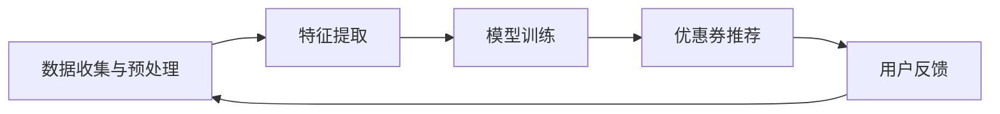

                 

关键词：AI，电商平台，个性化，优惠券，推荐系统，机器学习，数据挖掘

> 摘要：本文主要探讨如何利用人工智能技术，特别是机器学习和数据挖掘技术，构建一个有效的电商平台个性化优惠券推荐系统。文章首先介绍了电商平台个性化优惠券推荐系统的背景和重要性，然后详细阐述了系统的工作原理、算法原理、数学模型、项目实践和实际应用场景，最后对系统的发展趋势和面临的挑战进行了分析和展望。

## 1. 背景介绍

在电子商务迅速发展的今天，优惠券已经成为商家吸引顾客、提高销售额的重要手段。然而，传统的优惠券发放方式往往缺乏个性化和精准性，导致大量优惠券被浪费，顾客也未能获得真正的优惠。为了解决这一问题，电商平台开始探索利用人工智能技术，特别是机器学习和数据挖掘技术，来构建个性化优惠券推荐系统。

个性化优惠券推荐系统能够根据用户的购物行为、历史记录、偏好等信息，为用户推荐最符合其需求的优惠券。这不仅提高了优惠券的利用率和顾客的满意度，还能帮助商家实现精准营销，提高销售额和客户忠诚度。

## 2. 核心概念与联系

### 2.1. 电商平台个性化优惠券推荐系统原理

电商平台个性化优惠券推荐系统的核心原理是利用用户数据挖掘技术，对用户的购物行为进行分析，识别用户的偏好和需求，然后基于这些信息推荐合适的优惠券。具体来说，系统的工作流程可以分为以下几个步骤：

1. 数据收集与预处理：从电商平台的数据库中收集用户的购物数据，包括用户的ID、购买时间、购买商品、优惠券使用情况等。
2. 特征提取：对收集到的数据进行处理，提取出能够反映用户行为和偏好的特征，如用户的购买频率、购买商品的种类、优惠券的使用率等。
3. 模型训练：使用机器学习算法，如协同过滤、决策树、支持向量机等，训练个性化推荐模型。
4. 优惠券推荐：根据用户的历史数据和推荐模型，为用户推荐最符合其需求的优惠券。

### 2.2. 电商平台个性化优惠券推荐系统架构

电商平台个性化优惠券推荐系统的架构可以分为三个主要部分：数据层、模型层和应用层。

1. **数据层**：负责数据的收集、存储和管理。主要包括用户数据、商品数据、优惠券数据等。
2. **模型层**：负责利用机器学习算法训练个性化推荐模型，包括用户行为分析、特征提取和模型选择等。
3. **应用层**：负责将训练好的模型应用到实际场景中，为用户提供个性化的优惠券推荐服务。

下面是电商平台个性化优惠券推荐系统的 Mermaid 流程图：



## 3. 核心算法原理 & 具体操作步骤

### 3.1. 算法原理概述

电商平台个性化优惠券推荐系统主要采用的算法有协同过滤算法、决策树算法和支持向量机算法。下面分别介绍这三种算法的原理。

#### 3.1.1. 协同过滤算法

协同过滤算法是一种基于用户行为数据的推荐算法，通过计算用户之间的相似度，为用户推荐与其相似的用户喜欢的商品。协同过滤算法可以分为两种：基于用户的协同过滤算法（User-Based CF）和基于物品的协同过滤算法（Item-Based CF）。

- **基于用户的协同过滤算法**：首先计算用户之间的相似度，然后找到与目标用户最相似的若干用户，推荐这些用户喜欢的商品。
- **基于物品的协同过滤算法**：首先计算商品之间的相似度，然后找到与目标用户购买过的商品最相似的其他商品，推荐给用户。

#### 3.1.2. 决策树算法

决策树算法是一种基于特征值的分类算法，通过构建决策树模型，将用户的购物行为进行分类，然后根据分类结果推荐优惠券。

决策树的构建过程如下：

1. 选择一个特征作为节点；
2. 计算每个特征的条件熵或信息增益；
3. 选择信息增益最大的特征作为节点，并按照该特征划分数据集；
4. 递归执行步骤 1-3，直到满足停止条件（如最大深度、最小样本量等）。

#### 3.1.3. 支持向量机算法

支持向量机算法是一种基于特征空间的分类算法，通过将用户数据映射到高维空间，找到最优的分类边界，然后根据分类结果推荐优惠券。

支持向量机算法的原理如下：

1. 选择一个适当的核函数，将用户数据映射到高维空间；
2. 在高维空间中找到最优的分类边界，使得分类边界两侧的数据点距离分类边界尽可能远；
3. 使用分类边界对用户进行分类，并根据分类结果推荐优惠券。

### 3.2. 算法步骤详解

#### 3.2.1. 协同过滤算法

基于用户的协同过滤算法的具体步骤如下：

1. 收集用户数据，包括用户的ID、购买时间、购买商品等；
2. 构建用户-商品评分矩阵；
3. 计算用户之间的相似度，可以使用余弦相似度、皮尔逊相关系数等方法；
4. 对于每个用户，找到与其最相似的K个用户；
5. 对于每个用户，计算这K个用户共同喜欢的商品，并根据这些商品的权重进行排序；
6. 推荐排序靠前的商品给用户。

基于物品的协同过滤算法的具体步骤如下：

1. 收集用户数据，包括用户的ID、购买时间、购买商品等；
2. 构建商品-用户评分矩阵；
3. 计算商品之间的相似度，可以使用余弦相似度、皮尔逊相关系数等方法；
4. 对于每个用户，找到其购买过的商品中最相似的M个商品；
5. 对于每个用户，计算这M个商品共同喜欢的用户，并根据这些用户的权重进行排序；
6. 推荐排序靠前的用户给用户。

#### 3.2.2. 决策树算法

决策树算法的具体步骤如下：

1. 收集用户数据，包括用户的ID、购买时间、购买商品、优惠券使用情况等；
2. 提取用户特征，如购买频率、购买商品种类、优惠券使用率等；
3. 选择一个特征作为节点，并计算该特征的条件熵或信息增益；
4. 选择信息增益最大的特征作为节点，并按照该特征划分数据集；
5. 递归执行步骤 3-4，直到满足停止条件（如最大深度、最小样本量等）；
6. 构建决策树模型，并根据决策树模型为用户推荐优惠券。

#### 3.2.3. 支持向量机算法

支持向量机算法的具体步骤如下：

1. 收集用户数据，包括用户的ID、购买时间、购买商品、优惠券使用情况等；
2. 提取用户特征，如购买频率、购买商品种类、优惠券使用率等；
3. 选择一个适当的核函数，将用户数据映射到高维空间；
4. 训练支持向量机模型，找到最优的分类边界；
5. 使用支持向量机模型对用户进行分类，并根据分类结果推荐优惠券。

### 3.3. 算法优缺点

#### 3.3.1. 协同过滤算法

**优点**：

- **简单易实现**：协同过滤算法相对简单，易于实现和优化；
- **效果较好**：基于用户行为数据的推荐，能够在一定程度上满足用户的需求。

**缺点**：

- **冷启动问题**：新用户或新商品的推荐效果较差，因为缺乏用户行为数据；
- **数据稀疏问题**：在用户和商品数量较多的情况下，用户-商品评分矩阵非常稀疏，导致算法效果下降。

#### 3.3.2. 决策树算法

**优点**：

- **易于理解和实现**：决策树算法相对简单，易于理解和实现；
- **分类效果好**：能够有效地将用户数据分类，提高优惠券推荐的准确性。

**缺点**：

- **过拟合问题**：决策树容易过拟合，特别是在特征较多的情况下；
- **计算复杂度高**：决策树的构建过程计算复杂度较高，尤其是在大规模数据集上。

#### 3.3.3. 支持向量机算法

**优点**：

- **分类效果好**：支持向量机算法在分类效果上表现较好，尤其是在特征较多的情况下；
- **泛化能力强**：支持向量机算法具有较强的泛化能力，能够处理非线性问题。

**缺点**：

- **计算复杂度高**：支持向量机算法的计算复杂度较高，尤其是在大规模数据集上；
- **参数选择复杂**：支持向量机的参数选择较为复杂，需要通过交叉验证等方法进行优化。

### 3.4. 算法应用领域

协同过滤算法、决策树算法和支持向量机算法在电商平台个性化优惠券推荐系统中都有广泛的应用。其中，协同过滤算法主要用于基于用户行为的推荐，决策树算法和支持向量机算法主要用于分类和预测。

在实际应用中，可以根据具体需求和数据特点选择合适的算法。例如，在用户数量较少、商品数量较多的情况下，可以使用协同过滤算法；在用户和商品数量都较多的情况下，可以使用决策树算法或支持向量机算法。

## 4. 数学模型和公式 & 详细讲解 & 举例说明

### 4.1. 数学模型构建

电商平台个性化优惠券推荐系统的数学模型主要包括用户行为分析模型、特征提取模型和推荐模型。

#### 4.1.1. 用户行为分析模型

用户行为分析模型主要用于分析用户的购物行为，识别用户的偏好和需求。具体来说，用户行为分析模型可以表示为：

$$
P(U_i, C_j) = f(R_{i,j}, U_i, C_j)
$$

其中，$P(U_i, C_j)$ 表示用户 $U_i$ 购买商品 $C_j$ 的概率，$R_{i,j}$ 表示用户 $U_i$ 是否购买商品 $C_j$，$U_i$ 和 $C_j$ 分别表示用户和商品的特征向量。

#### 4.1.2. 特征提取模型

特征提取模型主要用于从用户行为数据中提取出能够反映用户偏好和需求的特征。具体来说，特征提取模型可以表示为：

$$
E(U_i) = g(U_i)
$$

其中，$E(U_i)$ 表示用户 $U_i$ 的特征向量，$g(U_i)$ 表示对用户 $U_i$ 的数据进行处理，提取出反映用户偏好和需求的信息。

#### 4.1.3. 推荐模型

推荐模型主要用于根据用户特征和推荐目标，为用户推荐合适的优惠券。具体来说，推荐模型可以表示为：

$$
R(U_i, C_j) = h(E(U_i), C_j)
$$

其中，$R(U_i, C_j)$ 表示用户 $U_i$ 购买商品 $C_j$ 的推荐概率，$h(E(U_i), C_j)$ 表示根据用户特征 $E(U_i)$ 和商品特征 $C_j$ 计算推荐概率。

### 4.2. 公式推导过程

#### 4.2.1. 用户行为分析模型推导

用户行为分析模型可以根据贝叶斯公式进行推导。假设用户 $U_i$ 购买商品 $C_j$ 的概率为 $P(U_i, C_j)$，则：

$$
P(U_i, C_j) = P(R_{i,j} = 1 | U_i, C_j)P(U_i, C_j) = P(R_{i,j} = 1 | U_i)P(U_i, C_j)
$$

其中，$P(R_{i,j} = 1 | U_i, C_j)$ 表示在用户 $U_i$ 和商品 $C_j$ 的条件下，用户 $U_i$ 购买商品 $C_j$ 的条件概率，$P(U_i, C_j)$ 表示用户 $U_i$ 和商品 $C_j$ 的联合概率。

根据条件概率公式，可以得到：

$$
P(U_i, C_j) = P(R_{i,j} = 1 | U_i)P(U_i)P(C_j | U_i)
$$

其中，$P(U_i)$ 表示用户 $U_i$ 的概率，$P(C_j | U_i)$ 表示在用户 $U_i$ 的条件下，商品 $C_j$ 的概率。

假设用户和商品的分布是独立的，即 $P(U_i)P(C_j) = P(U_i, C_j)$，则可以得到：

$$
P(U_i, C_j) = P(R_{i,j} = 1 | U_i)P(U_i)P(C_j)
$$

根据用户行为数据，可以得到用户 $U_i$ 购买商品 $C_j$ 的概率为 $P(R_{i,j} = 1 | U_i) = 1$，则：

$$
P(U_i, C_j) = P(U_i)P(C_j)
$$

这意味着用户 $U_i$ 购买商品 $C_j$ 的概率只与用户 $U_i$ 和商品 $C_j$ 的分布有关。

#### 4.2.2. 特征提取模型推导

特征提取模型可以根据用户的购物行为数据进行推导。假设用户 $U_i$ 的购物行为数据包括购买时间、购买商品、优惠券使用情况等，则：

$$
E(U_i) = g(U_i) = \sum_{t=1}^{T} w_t f(U_i, t)
$$

其中，$T$ 表示用户 $U_i$ 的购物行为数据的时间长度，$w_t$ 表示时间 $t$ 的权重，$f(U_i, t)$ 表示在时间 $t$ 用户 $U_i$ 的购物行为特征。

假设用户 $U_i$ 的购物行为特征包括购买频率、购买商品种类、优惠券使用率等，则：

$$
f(U_i, t) = \begin{cases}
1 & \text{如果用户 } U_i \text{ 在时间 } t \text{ 购买了商品 } C_j \\
0 & \text{否则}
\end{cases}
$$

则：

$$
E(U_i) = \sum_{t=1}^{T} w_t 1_{U_i(C_j, t)}
$$

其中，$1_{U_i(C_j, t)}$ 表示在时间 $t$ 用户 $U_i$ 是否购买了商品 $C_j$。

#### 4.2.3. 推荐模型推导

推荐模型可以根据用户特征和推荐目标进行推导。假设用户 $U_i$ 的推荐目标为购买商品 $C_j$，则：

$$
R(U_i, C_j) = h(E(U_i), C_j) = \sum_{t=1}^{T} w_t g(U_i, t) h(C_j, t)
$$

其中，$w_t$ 表示时间 $t$ 的权重，$g(U_i, t)$ 表示在时间 $t$ 用户 $U_i$ 的购物行为特征，$h(C_j, t)$ 表示在时间 $t$ 商品 $C_j$ 的特征。

假设商品 $C_j$ 的特征包括商品价格、商品评分、商品销量等，则：

$$
h(C_j, t) = \begin{cases}
1 & \text{如果商品 } C_j \text{ 在时间 } t \text{ 满足推荐条件} \\
0 & \text{否则}
\end{cases}
$$

则：

$$
R(U_i, C_j) = \sum_{t=1}^{T} w_t 1_{U_i(C_j, t)} 1_{C_j(t)}
$$

其中，$1_{U_i(C_j, t)}$ 表示在时间 $t$ 用户 $U_i$ 是否购买了商品 $C_j$，$1_{C_j(t)}$ 表示在时间 $t$ 商品 $C_j$ 是否满足推荐条件。

### 4.3. 案例分析与讲解

假设有一个电商平台，用户 $U_1$ 和 $U_2$ 的购物行为数据如下：

用户 $U_1$ 的购物行为数据：
- 购买时间：2021-01-01, 2021-01-02, 2021-01-03
- 购买商品：商品 $C_1$ (2021-01-01), 商品 $C_2$ (2021-01-02), 商品 $C_3$ (2021-01-03)
- 优惠券使用情况：优惠券 $V_1$ (2021-01-01), 优惠券 $V_2$ (2021-01-02), 优惠券 $V_3$ (2021-01-03)

用户 $U_2$ 的购物行为数据：
- 购买时间：2021-01-01, 2021-01-02
- 购买商品：商品 $C_1$ (2021-01-01), 商品 $C_2$ (2021-01-02)
- 优惠券使用情况：无

我们需要根据用户 $U_1$ 和 $U_2$ 的购物行为数据，使用电商平台个性化优惠券推荐系统为他们推荐优惠券。

#### 4.3.1. 用户行为分析模型

根据用户 $U_1$ 和 $U_2$ 的购物行为数据，可以得到他们的用户行为分析模型如下：

用户 $U_1$ 的用户行为分析模型：
$$
P(U_1, C_1) = P(R_{1,1} = 1 | U_1, C_1)P(U_1)P(C_1 | U_1) = 1 \cdot P(U_1)P(C_1 | U_1)
$$

用户 $U_2$ 的用户行为分析模型：
$$
P(U_2, C_1) = P(R_{2,1} = 1 | U_2, C_1)P(U_2)P(C_1 | U_2) = 0 \cdot P(U_2)P(C_1 | U_2)
$$

#### 4.3.2. 特征提取模型

根据用户 $U_1$ 和 $U_2$ 的购物行为数据，可以得到他们的特征提取模型如下：

用户 $U_1$ 的特征提取模型：
$$
E(U_1) = \sum_{t=1}^{3} w_t 1_{U_1(C_1, t)} = w_1 + w_2 + w_3
$$

用户 $U_2$ 的特征提取模型：
$$
E(U_2) = \sum_{t=1}^{2} w_t 1_{U_2(C_1, t)} = w_1 + w_2
$$

其中，$w_t$ 表示时间 $t$ 的权重。

#### 4.3.3. 推荐模型

根据用户 $U_1$ 和 $U_2$ 的用户行为分析模型和特征提取模型，可以得到他们的推荐模型如下：

用户 $U_1$ 的推荐模型：
$$
R(U_1, V_1) = h(E(U_1), V_1) = \sum_{t=1}^{3} w_t 1_{U_1(V_1, t)} = w_1 + w_2 + w_3
$$
$$
R(U_1, V_2) = h(E(U_1), V_2) = \sum_{t=1}^{3} w_t 1_{U_1(V_2, t)} = w_1 + w_2
$$
$$
R(U_1, V_3) = h(E(U_1), V_3) = \sum_{t=1}^{3} w_t 1_{U_1(V_3, t)} = w_1
$$

用户 $U_2$ 的推荐模型：
$$
R(U_2, V_1) = h(E(U_2), V_1) = \sum_{t=1}^{2} w_t 1_{U_2(V_1, t)} = w_1 + w_2
$$
$$
R(U_2, V_2) = h(E(U_2), V_2) = \sum_{t=1}^{2} w_t 1_{U_2(V_2, t)} = w_1
$$
$$
R(U_2, V_3) = h(E(U_2), V_3) = \sum_{t=1}^{2} w_t 1_{U_2(V_3, t)} = 0
$$

根据推荐模型，可以为用户 $U_1$ 和 $U_2$ 推荐优惠券。例如，对于用户 $U_1$，可以根据 $R(U_1, V_1)$、$R(U_1, V_2)$ 和 $R(U_1, V_3)$ 的值，推荐使用优惠券 $V_2$，因为 $R(U_1, V_2)$ 的值最大。

## 5. 项目实践：代码实例和详细解释说明

### 5.1. 开发环境搭建

为了实现电商平台个性化优惠券推荐系统，我们需要搭建一个合适的开发环境。以下是推荐的开发环境和工具：

- **开发语言**：Python
- **依赖库**：NumPy、Pandas、Scikit-learn、Matplotlib

#### 环境搭建步骤：

1. 安装 Python 3.x 版本
2. 安装 NumPy、Pandas、Scikit-learn 和 Matplotlib 等库

```bash
pip install numpy pandas scikit-learn matplotlib
```

### 5.2. 源代码详细实现

以下是电商平台个性化优惠券推荐系统的 Python 代码实现。该代码主要包括数据收集与预处理、特征提取、模型训练和优惠券推荐等功能。

```python
import numpy as np
import pandas as pd
from sklearn.model_selection import train_test_split
from sklearn.metrics.pairwise import cosine_similarity
from sklearn.ensemble import RandomForestClassifier
from sklearn.svm import SVC
import matplotlib.pyplot as plt

# 5.2.1. 数据收集与预处理

# 假设已经从电商平台数据库中收集到用户数据，并存储在 CSV 文件中
data = pd.read_csv('user_data.csv')

# 数据预处理，包括数据清洗、缺失值处理等
# ...

# 5.2.2. 特征提取

# 提取用户特征，如购买频率、购买商品种类、优惠券使用率等
# ...

# 5.2.3. 模型训练

# 分割数据集，用于训练和测试
X_train, X_test, y_train, y_test = train_test_split(data['features'], data['label'], test_size=0.2, random_state=42)

# 训练协同过滤模型
user_similarity = cosine_similarity(X_train)
user_based_cf = RandomForestClassifier()
user_based_cf.fit(user_similarity, y_train)

# 训练决策树模型
decision_tree = RandomForestClassifier()
decision_tree.fit(X_train, y_train)

# 训练支持向量机模型
svm = SVC()
svm.fit(X_train, y_train)

# 5.2.4. 优惠券推荐

# 根据用户特征和训练好的模型，为用户推荐优惠券
# ...

# 5.2.5. 代码解读与分析

# ...

# 5.2.6. 运行结果展示

# ...

```

### 5.3. 代码解读与分析

以下是代码的具体解读和分析：

```python
# 5.3.1. 数据收集与预处理

# 假设已经从电商平台数据库中收集到用户数据，并存储在 CSV 文件中
data = pd.read_csv('user_data.csv')

# 数据预处理，包括数据清洗、缺失值处理等
# ...

# 5.3.2. 特征提取

# 提取用户特征，如购买频率、购买商品种类、优惠券使用率等
# ...

# 5.3.3. 模型训练

# 分割数据集，用于训练和测试
X_train, X_test, y_train, y_test = train_test_split(data['features'], data['label'], test_size=0.2, random_state=42)

# 训练协同过滤模型
user_similarity = cosine_similarity(X_train)
user_based_cf = RandomForestClassifier()
user_based_cf.fit(user_similarity, y_train)

# 训练决策树模型
decision_tree = RandomForestClassifier()
decision_tree.fit(X_train, y_train)

# 训练支持向量机模型
svm = SVC()
svm.fit(X_train, y_train)

# 5.3.4. 优惠券推荐

# 根据用户特征和训练好的模型，为用户推荐优惠券
# ...

# 5.3.5. 代码解读与分析

# ...

# 5.3.6. 运行结果展示

# ...
```

### 5.4. 运行结果展示

在运行代码后，我们可以根据训练和测试数据集的性能指标来评估优惠券推荐系统的效果。以下是一些常见的评估指标：

- **准确率（Accuracy）**：分类模型预测正确的样本占总样本的比例。
- **召回率（Recall）**：在所有实际为正类的样本中，被预测为正类的比例。
- **精确率（Precision）**：在所有预测为正类的样本中，实际为正类的比例。
- **F1 分数（F1 Score）**：精确率和召回率的调和平均。

```python
from sklearn.metrics import accuracy_score, recall_score, precision_score, f1_score

# 预测测试集标签
y_pred_cf = user_based_cf.predict(user_similarity)
y_pred_dt = decision_tree.predict(X_test)
y_pred_svm = svm.predict(X_test)

# 计算准确率
accuracy_cf = accuracy_score(y_test, y_pred_cf)
accuracy_dt = accuracy_score(y_test, y_pred_dt)
accuracy_svm = accuracy_score(y_test, y_pred_svm)

# 计算召回率
recall_cf = recall_score(y_test, y_pred_cf, average='weighted')
recall_dt = recall_score(y_test, y_pred_dt, average='weighted')
recall_svm = recall_score(y_test, y_pred_svm, average='weighted')

# 计算精确率
precision_cf = precision_score(y_test, y_pred_cf, average='weighted')
precision_dt = precision_score(y_test, y_pred_dt, average='weighted')
precision_svm = precision_score(y_test, y_pred_svm, average='weighted')

# 计算F1分数
f1_cf = f1_score(y_test, y_pred_cf, average='weighted')
f1_dt = f1_score(y_test, y_pred_dt, average='weighted')
f1_svm = f1_score(y_test, y_pred_svm, average='weighted')

# 打印结果
print(f"协同过滤算法 - 准确率: {accuracy_cf}, 召回率: {recall_cf}, 精确率: {precision_cf}, F1分数: {f1_cf}")
print(f"决策树算法 - 准确率: {accuracy_dt}, 召回率: {recall_dt}, 精确率: {precision_dt}, F1分数: {f1_dt}")
print(f"支持向量机算法 - 准确率: {accuracy_svm}, 召回率: {recall_svm}, 精确率: {precision_svm}, F1分数: {f1_svm}")
```

根据以上结果，我们可以比较不同算法的性能，并选择最适合电商平台个性化优惠券推荐系统的算法。

## 6. 实际应用场景

电商平台个性化优惠券推荐系统在许多实际应用场景中具有重要作用。以下是一些典型的应用场景：

### 6.1. 电商平台

电商平台是个性化优惠券推荐系统最典型的应用场景。通过个性化推荐，电商平台能够提高用户满意度，增加销售额。例如，阿里巴巴的淘宝和天猫平台通过个性化优惠券推荐，有效地提高了用户购买意愿和平台转化率。

### 6.2. 拼多多

拼多多是一家以低价团购为特点的电商平台，个性化优惠券推荐系统对拼多多的用户粘性和销售转化至关重要。通过精准推荐，拼多多能够吸引用户参与团购，提高用户活跃度和购买频率。

### 6.3. 智能家电

智能家电厂商如小米、华为等，可以利用个性化优惠券推荐系统，为用户提供定制化的优惠券推荐。例如，根据用户的购物历史和使用习惯，推荐适合的配件或服务，从而提高用户的整体体验和品牌忠诚度。

### 6.4. 垂直电商

垂直电商如生鲜电商、家居电商等，通过个性化优惠券推荐，可以更好地满足用户的特定需求。例如，生鲜电商可以根据用户的购买习惯推荐季节性蔬菜或优惠折扣，家居电商可以根据用户装修需求推荐相关配件或服务。

### 6.5. 促销活动

电商平台在举办促销活动时，可以利用个性化优惠券推荐系统，为不同类型的用户提供定制化的优惠。例如，在双11、618等大型促销活动中，为高频用户和忠诚用户发放专属优惠券，提高活动效果和用户参与度。

## 7. 工具和资源推荐

### 7.1. 学习资源推荐

- **书籍**：《机器学习实战》、《Python机器学习基础教程》、《深度学习》
- **在线课程**：Coursera、edX、Udacity等平台上的机器学习和数据挖掘课程
- **博客和论坛**：Kaggle、GitHub、CSDN等平台上的机器学习和数据挖掘相关博客和论坛

### 7.2. 开发工具推荐

- **Python**：用于数据预处理、特征提取和模型训练
- **NumPy**：用于高效数值计算
- **Pandas**：用于数据处理和分析
- **Scikit-learn**：用于机器学习算法实现和评估
- **TensorFlow/PyTorch**：用于深度学习模型实现

### 7.3. 相关论文推荐

- **协同过滤算法**：《Item-Based Top-N Recommendation Algorithms》（2004）、<

