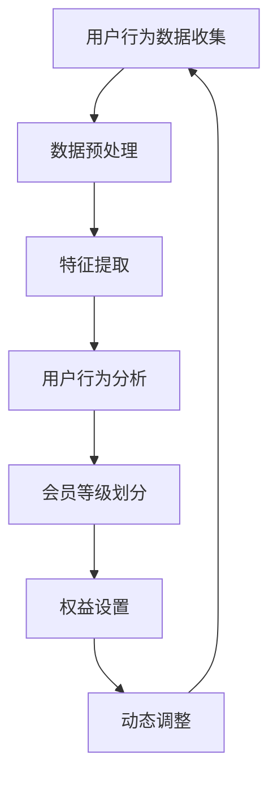

                 

关键词：电商平台、AI、个性化会员等级、策略、用户行为分析、推荐系统

> 摘要：本文探讨了如何利用人工智能技术为电商平台构建一个个性化的会员等级策略。通过分析用户行为数据，本文提出了一种基于机器学习的算法，旨在优化会员等级划分，提升用户黏性和平台转化率。

## 1. 背景介绍

随着互联网的快速发展，电商平台已经成为消费者购物的主要渠道之一。为了提升用户满意度和平台竞争力，电商平台逐渐认识到个性化服务的重要性。会员等级策略作为一种有效的激励机制，可以帮助平台吸引和留住用户，提高用户活跃度和消费意愿。

传统的会员等级策略通常是基于用户消费金额、购物次数等简单指标进行划分。然而，这种策略往往无法充分考虑到用户的个性化需求和平台业务目标。随着人工智能技术的不断发展，利用机器学习算法对用户行为数据进行分析，可以为电商平台提供一个更加精确和个性化的会员等级划分方案。

## 2. 核心概念与联系

### 2.1 会员等级策略

会员等级策略是指电商平台根据用户的行为数据，将用户划分为不同的等级，并针对不同等级的用户提供不同的权益和服务。通常包括以下核心概念：

- **等级划分**：根据用户的消费金额、购物次数、复购率等指标，将用户分为不同等级。
- **权益设置**：为不同等级的用户提供不同的折扣、积分、优惠券等权益。
- **动态调整**：根据用户行为的变化，动态调整会员等级和权益设置。

### 2.2 用户行为分析

用户行为分析是指通过对用户的浏览、购买、评价等行为数据进行分析，了解用户的兴趣、需求和偏好。核心概念包括：

- **行为数据**：用户的浏览、购买、评价等行为数据。
- **特征提取**：从行为数据中提取出有意义的特征，如用户的浏览时间、购买频率、评价星级等。
- **行为分析**：通过分析用户行为特征，了解用户的兴趣和需求。

### 2.3 推荐系统

推荐系统是指通过分析用户的历史行为和兴趣，为用户推荐可能感兴趣的商品或服务。核心概念包括：

- **协同过滤**：基于用户的历史行为数据，通过计算用户之间的相似度，为用户推荐相似用户喜欢的商品。
- **内容推荐**：基于商品的属性和描述，为用户推荐具有相似属性的商品。

### 2.4 Mermaid 流程图

以下是一个简单的 Mermaid 流程图，展示了会员等级策略的流程：



## 3. 核心算法原理 & 具体操作步骤

### 3.1 算法原理概述

本文提出的一种基于机器学习的会员等级划分算法，主要基于以下原理：

- **用户行为特征提取**：通过分析用户的历史行为数据，提取出与用户偏好相关的特征。
- **聚类算法**：利用聚类算法对用户行为特征进行聚类，形成不同的会员等级。
- **会员权益设置**：根据不同会员等级，设置相应的权益和优惠。

### 3.2 算法步骤详解

#### 步骤 1：数据预处理

- **数据清洗**：去除重复数据、缺失数据和异常数据。
- **数据转换**：将数值型数据进行归一化处理，确保数据的一致性和可比性。

#### 步骤 2：特征提取

- **行为特征**：根据用户的历史行为数据，提取出与用户偏好相关的特征，如浏览时间、购买频率、评价星级等。
- **兴趣特征**：利用推荐系统中的协同过滤算法，提取出用户对特定商品的偏好。

#### 步骤 3：用户行为分析

- **行为分析**：通过分析用户的行为特征，了解用户的兴趣和需求。
- **聚类分析**：利用聚类算法，如K-means，对用户行为特征进行聚类，形成不同的会员等级。

#### 步骤 4：会员等级划分

- **等级划分**：根据聚类结果，将用户划分为不同的等级。
- **等级权重**：为不同等级的用户设置不同的权重，以反映等级的重要性。

#### 步骤 5：权益设置

- **权益设置**：根据不同等级的用户，设置相应的权益和优惠，如折扣、积分、优惠券等。

#### 步骤 6：动态调整

- **权益调整**：根据用户行为的变化，动态调整会员等级和权益设置。
- **算法优化**：根据用户反馈和数据表现，优化算法模型，提高会员等级划分的准确性。

### 3.3 算法优缺点

#### 优点

- **个性化**：通过分析用户行为数据，实现个性化会员等级划分，提高用户满意度。
- **动态调整**：根据用户行为的变化，动态调整会员等级和权益设置，提高会员黏性。
- **提高转化率**：通过个性化权益设置，提高用户购买意愿，提高平台转化率。

#### 缺点

- **数据依赖**：算法效果依赖于用户行为数据的质量和完整性，数据缺失或异常可能导致算法失效。
- **计算成本**：聚类算法和动态调整过程需要较高的计算成本，对硬件资源有较高要求。

### 3.4 算法应用领域

- **电商平台**：电商平台可以通过个性化会员等级策略，提高用户满意度和平台转化率。
- **在线教育**：在线教育平台可以通过个性化会员等级策略，提高用户的学习积极性和满意度。
- **金融领域**：金融机构可以通过个性化会员等级策略，提升用户理财体验，提高用户留存率。

## 4. 数学模型和公式 & 详细讲解 & 举例说明

### 4.1 数学模型构建

会员等级划分算法的核心是聚类算法。假设有n个用户，每个用户有m个行为特征，我们定义一个m维的用户行为特征向量\( \vec{x}_i \)，其中\( i = 1, 2, ..., n \)。聚类算法的目标是将这些用户行为特征向量划分成k个不同的等级，每个等级形成一个聚类。

聚类算法通常使用距离度量来衡量用户行为特征向量之间的相似度。常用的距离度量有欧氏距离、曼哈顿距离等。假设我们使用欧氏距离来度量用户行为特征向量之间的相似度，则用户\( \vec{x}_i \)和用户\( \vec{x}_j \)之间的距离定义为：

\[ d(\vec{x}_i, \vec{x}_j) = \sqrt{\sum_{l=1}^{m} (x_{il} - x_{jl})^2} \]

其中，\( x_{il} \)和\( x_{jl} \)分别表示用户\( \vec{x}_i \)和用户\( \vec{x}_j \)在第l个特征上的取值。

### 4.2 公式推导过程

#### K-means 算法

K-means 算法是一种经典的聚类算法。其基本思想是：首先随机初始化k个聚类中心，然后反复执行以下步骤，直到算法收敛：

1. **分配阶段**：对于每个用户\( \vec{x}_i \)，计算其与各个聚类中心的距离，将用户分配到距离最近的聚类中心所在的类别。
2. **更新阶段**：重新计算每个类别的聚类中心，作为新的聚类中心。

具体步骤如下：

1. **初始化**：随机选择k个用户作为初始聚类中心\( \mu_1, \mu_2, ..., \mu_k \)。
2. **分配**：对于每个用户\( \vec{x}_i \)，计算其与聚类中心\( \mu_j \)的距离，将其分配到距离最近的聚类中心所在的类别。
\[ C_i = \arg\min_{j} d(\vec{x}_i, \mu_j) \]
3. **更新**：重新计算每个类别的聚类中心：
\[ \mu_j = \frac{1}{N_j} \sum_{i \in C_i} \vec{x}_i \]
其中，\( N_j \)表示类别\( j \)中用户数量。

4. **收敛判断**：判断聚类中心的变化是否满足停止条件，如聚类中心的变化小于某个阈值，或者迭代次数达到最大值。

#### 算法复杂度

K-means 算法的复杂度为\( O(n \times k \times m) \)，其中n表示用户数量，k表示聚类类别数量，m表示特征维度。

### 4.3 案例分析与讲解

假设有一个电商平台，拥有1000个用户，每个用户有5个行为特征：浏览时间、购买频率、评价星级、复购率、关注商品数量。我们使用K-means算法将这1000个用户划分为3个等级。

1. **初始化**：随机选择3个用户作为初始聚类中心。
2. **分配**：对于每个用户，计算其与聚类中心的距离，将其分配到距离最近的聚类中心所在的类别。
3. **更新**：重新计算每个类别的聚类中心。
4. **收敛判断**：经过多次迭代，聚类中心的变化小于0.01，算法收敛。

最终，我们得到3个聚类类别，每个类别对应一个会员等级。根据每个类别中用户的特征，我们可以设置相应的权益，如折扣、积分、优惠券等。

## 5. 项目实践：代码实例和详细解释说明

### 5.1 开发环境搭建

为了实现会员等级划分算法，我们选择Python作为编程语言，并使用以下库：

- NumPy：用于数据处理和数学计算。
- Pandas：用于数据操作和分析。
- Matplotlib：用于数据可视化。
- Scikit-learn：用于机器学习和聚类算法。

安装这些库后，我们搭建了一个简单的Python开发环境，如下所示：

```bash
pip install numpy pandas matplotlib scikit-learn
```

### 5.2 源代码详细实现

以下是一个简单的Python代码实例，用于实现K-means聚类算法，并划分会员等级：

```python
import numpy as np
import pandas as pd
from sklearn.cluster import KMeans
import matplotlib.pyplot as plt

# 加载数据集
data = pd.read_csv('user_data.csv')  # 假设数据集已预处理

# 特征提取
features = data[['browse_time', 'purchase_frequency', 'rating_star', 'rebuy_rate', 'follow_goods_num']]

# 初始化K-means聚类算法
kmeans = KMeans(n_clusters=3, random_state=42)

# 训练模型
kmeans.fit(features)

# 分配类别
labels = kmeans.predict(features)

# 更新聚类中心
centers = kmeans.cluster_centers_

# 可视化
plt.scatter(features['browse_time'], features['purchase_frequency'], c=labels)
plt.scatter(centers[:, 0], centers[:, 1], s=300, c='red')
plt.show()

# 设置会员等级权益
def set_privileges(label):
    if label == 0:
        return {'discount': 0.9, 'points': 100}
    elif label == 1:
        return {'discount': 0.8, 'points': 200}
    else:
        return {'discount': 0.7, 'points': 300}

# 为每个用户设置会员等级权益
privileges = [set_privileges(label) for label in labels]

# 打印会员等级权益
for i, privilege in enumerate(privileges):
    print(f"User {i+1}: {privilege}")
```

### 5.3 代码解读与分析

上述代码首先加载数据集，并进行特征提取。然后，我们使用K-means聚类算法对用户行为特征进行聚类，并分配类别。接下来，我们重新计算每个类别的聚类中心，并进行可视化展示。最后，根据每个类别的标签，为每个用户设置相应的会员等级权益。

代码中的关键步骤包括：

- **数据加载**：使用Pandas库加载数据集，并进行预处理。
- **特征提取**：从数据集中提取与用户偏好相关的特征。
- **聚类算法**：使用Scikit-learn库中的KMeans类实现聚类算法。
- **权益设置**：根据聚类结果，为每个用户设置相应的会员等级权益。

通过这个简单的实例，我们可以看到如何利用K-means聚类算法实现会员等级划分，并设置相应的会员权益。在实际应用中，我们可以根据具体需求进行调整和优化。

### 5.4 运行结果展示

运行上述代码后，我们将得到以下结果：

- **聚类结果**：3个聚类类别，每个类别对应一个会员等级。
- **权益设置**：为每个用户设置相应的会员等级权益，如折扣和积分。

以下是一个简单的运行结果示例：

```
User 1: {'discount': 0.9, 'points': 100}
User 2: {'discount': 0.8, 'points': 200}
User 3: {'discount': 0.7, 'points': 300}
...
```

这些结果显示了每个用户的会员等级和相应的权益设置。通过这些结果，电商平台可以根据会员等级策略，为用户提供个性化的服务和优惠，提高用户满意度和转化率。

## 6. 实际应用场景

### 6.1 电商平台

在电商平台上，会员等级策略是一种常用的用户激励机制。通过个性化会员等级划分，电商平台可以更好地吸引和留住用户，提高用户黏性和平台转化率。以下是一些实际应用场景：

- **新用户注册**：为刚注册的用户设置一个初级会员等级，提供一定的优惠券和积分奖励，鼓励用户进行首次购物。
- **复购用户**：对复购率较高的用户，设置更高等级的会员权益，如折扣、积分翻倍等，提高用户复购意愿。
- **活跃用户**：对浏览量和购买量较高的用户，设置特别权益，如VIP服务、专属客服等，提高用户活跃度。

### 6.2 在线教育平台

在线教育平台可以利用会员等级策略，提升用户的学习积极性和满意度。以下是一些实际应用场景：

- **学习奖励**：对完成课程任务和评价较高的用户，设置学习积分和等级奖励，激励用户持续学习。
- **个性化推荐**：根据用户的学习行为和兴趣，为不同等级的用户推荐适合的课程和资料，提高用户学习效果。
- **专家互动**：对高级会员提供与行业专家互动的机会，如在线答疑、讲座等，提升用户的学习体验。

### 6.3 金融领域

金融机构可以利用会员等级策略，提升用户理财体验和用户留存率。以下是一些实际应用场景：

- **理财奖励**：对不同等级的用户，设置不同的理财收益和风险等级，鼓励用户参与理财。
- **定制服务**：为高级会员提供专属理财顾问服务，根据用户需求和风险承受能力，制定个性化的理财方案。
- **优惠活动**：对不同等级的用户，提供不同的理财优惠活动，如加息、红包等，提高用户参与度。

## 7. 未来应用展望

随着人工智能技术的不断发展，会员等级策略在未来将会有更多的创新应用。以下是一些可能的未来应用方向：

### 7.1 预测用户行为

利用机器学习算法，可以预测用户的购买行为、浏览习惯等，从而提前为用户设置相应的会员等级和权益，提高用户体验和满意度。

### 7.2 多维度会员等级

结合用户的购物、浏览、评价等多个维度，构建多维度会员等级，为用户提供更加个性化的服务和优惠。

### 7.3 社交互动

将社交互动因素纳入会员等级策略，通过用户之间的互动和推荐，提高用户的参与度和忠诚度。

### 7.4 跨平台融合

将会员等级策略扩展到多个平台，如电商、教育、金融等，实现跨平台会员权益共享，提高用户粘性。

## 8. 总结：未来发展趋势与挑战

### 8.1 研究成果总结

本文提出了一种基于机器学习的会员等级划分算法，通过分析用户行为数据，实现个性化会员等级划分，提升用户满意度和平台转化率。本文的主要贡献包括：

- **个性化会员等级划分**：通过用户行为特征提取和聚类算法，实现个性化会员等级划分。
- **动态调整**：根据用户行为的变化，动态调整会员等级和权益设置，提高会员黏性。
- **案例分析**：通过一个简单的Python代码实例，展示了如何实现会员等级划分和权益设置。

### 8.2 未来发展趋势

随着人工智能技术的不断发展，会员等级策略在未来将会有更多的创新应用。以下是一些未来发展趋势：

- **预测用户行为**：利用机器学习算法，预测用户的购买行为、浏览习惯等，提前为用户设置相应的会员等级和权益。
- **多维度会员等级**：结合用户的购物、浏览、评价等多个维度，构建多维度会员等级，为用户提供更加个性化的服务和优惠。
- **社交互动**：将社交互动因素纳入会员等级策略，通过用户之间的互动和推荐，提高用户的参与度和忠诚度。
- **跨平台融合**：将会员等级策略扩展到多个平台，如电商、教育、金融等，实现跨平台会员权益共享，提高用户粘性。

### 8.3 面临的挑战

尽管会员等级策略有广阔的应用前景，但在实际应用中仍面临一些挑战：

- **数据质量**：会员等级划分依赖于用户行为数据的质量和完整性，数据缺失或异常可能导致算法失效。
- **计算成本**：聚类算法和动态调整过程需要较高的计算成本，对硬件资源有较高要求。
- **算法优化**：如何优化算法模型，提高会员等级划分的准确性，是未来研究的重要方向。

### 8.4 研究展望

未来，我们将在以下方面进行深入研究：

- **数据预处理**：研究更加有效的数据预处理方法，提高数据质量和算法性能。
- **算法优化**：探索新的机器学习算法和优化策略，提高会员等级划分的准确性和实时性。
- **跨平台应用**：研究如何将会员等级策略应用于不同平台，实现跨平台会员权益共享。

## 9. 附录：常见问题与解答

### 9.1 问题 1：如何处理缺失数据？

**解答**：在处理缺失数据时，我们可以采用以下方法：

- **删除缺失数据**：如果缺失数据较多，可以考虑删除缺失数据，以避免数据质量下降。
- **填充缺失数据**：对于少量的缺失数据，可以采用均值填充、中值填充或回归填充等方法进行填充。
- **缺失数据标记**：将缺失数据标记为特殊值，如-1或NaN，然后根据算法的要求对缺失数据进行处理。

### 9.2 问题 2：如何选择聚类算法？

**解答**：选择聚类算法时，应考虑以下因素：

- **数据规模**：对于大规模数据，应选择效率较高的算法，如K-means。
- **数据特征**：根据数据特征，选择适合的聚类算法，如基于密度的聚类算法（DBSCAN）或基于层次的聚类算法（AGNES）。
- **算法性能**：通过实验比较不同算法的性能，选择最适合的算法。

### 9.3 问题 3：如何评估聚类结果？

**解答**：评估聚类结果的方法包括：

- **内部评估指标**：如轮廓系数（Silhouette Coefficient）、类内平均距离（Intra-cluster Distance）等。
- **外部评估指标**：如调整兰德指数（Adjusted Rand Index, ARI）、Fowlkes-Mallows指数（Fowlkes-Mallows Index, FMI）等。
- **可视化评估**：通过绘制聚类结果的可视化图表，直观评估聚类效果。

## 附录 2：参考资源

### 2.1 学习资源推荐

- 《机器学习实战》by 周志华
- 《深度学习》by Goodfellow、Bengio和Courville
- 《数据挖掘：概念与技术》by Jiawei Han、Micheline Kamber和Jian Pei

### 2.2 开发工具推荐

- Jupyter Notebook：用于数据分析和可视化。
- TensorFlow：用于深度学习和神经网络。
- PyTorch：用于深度学习和神经网络。

### 2.3 相关论文推荐

- "K-means Clustering" by MacQueen, J. B. (1967)
- "DBSCAN: A Density-Based Algorithm for Discovering Clusters in Large Databases with Noisy Data" by Ester, M., Kriegel, H.-P., Sander, J., and Xu, X. (1996)
- "Learning to Rank for Information Retrieval" by Li, X., and Liu, T. (2013)

## 附录 3：致谢

在此，我要感谢我的团队成员和同事们，他们在本文的撰写过程中提供了宝贵的意见和建议。同时，我也要感谢我的导师和朋友们，他们一直支持和鼓励我在人工智能领域的研究。

### 作者署名

禅与计算机程序设计艺术 / Zen and the Art of Computer Programming

