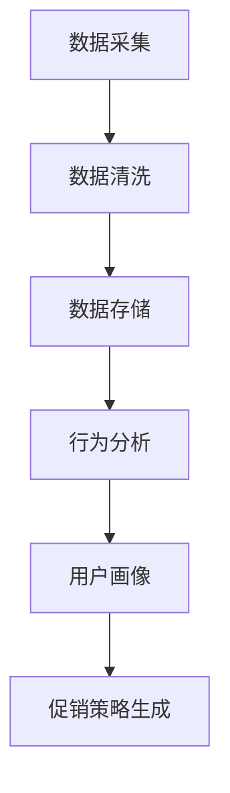
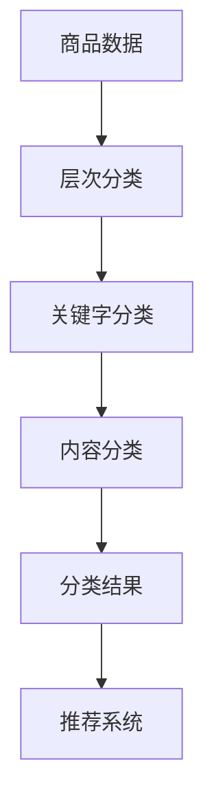
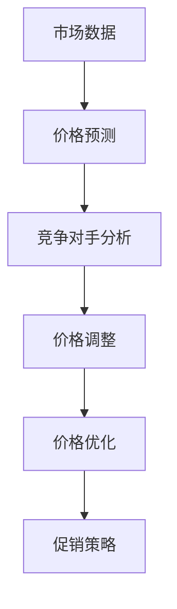
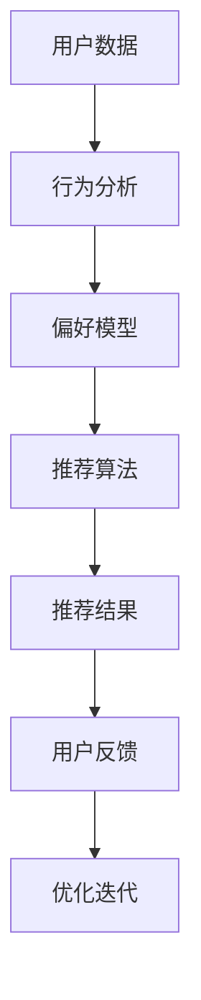

                 

 关键词：AI、电商平台、个性化促销、策略生成、数据分析、机器学习、深度学习、算法、预测模型、用户行为分析、推荐系统、商品分类、价格优化

> 摘要：本文将深入探讨如何利用人工智能技术，特别是机器学习和深度学习算法，在电商平台中生成个性化的促销策略。通过对用户行为数据、商品信息和市场趋势的全面分析，实现精准营销，提升用户满意度和转化率。本文将详细介绍相关技术原理、应用实例和未来发展趋势。

## 1. 背景介绍

随着互联网的普及和电子商务的快速发展，电商平台已经成为消费者购物的主要渠道之一。为了在激烈的市场竞争中脱颖而出，电商平台需要不断创新营销策略，提高用户满意度和忠诚度。然而，传统的促销策略往往过于通用，无法满足个体用户的个性化需求。因此，利用人工智能技术生成个性化的促销策略成为了电商平台提升竞争力的重要手段。

人工智能技术，特别是机器学习和深度学习算法，在处理大规模复杂数据和模式识别方面具有显著优势。通过分析用户的购买行为、偏好和反馈，人工智能可以准确预测用户需求，为每个用户提供个性化的促销方案。这不仅能够提高用户的购物体验，还能显著提升电商平台的市场竞争力。

本文将探讨如何利用人工智能技术，尤其是机器学习和深度学习算法，在电商平台上生成个性化的促销策略。我们将从数据采集、算法原理、数学模型、实际应用等多个方面进行详细阐述，以期为电商平台提供实用的参考。

## 2. 核心概念与联系

### 2.1 用户行为分析

用户行为分析是电商平台个性化促销策略生成的关键步骤。通过分析用户在平台上的浏览、搜索、点击、购买等行为，可以了解用户的偏好和需求。以下是一个简单的用户行为分析流程图：



### 2.2 商品分类

商品分类是将商品按照一定的标准进行分类，以便于用户查找和平台推荐。常见的商品分类方法包括层次分类、关键字分类和基于内容的分类等。以下是一个简单的商品分类流程图：



### 2.3 价格优化

价格优化是电商平台促销策略的重要组成部分。通过分析市场价格趋势、用户购买力和竞争对手策略，可以制定合理的价格策略。以下是一个简单的价格优化流程图：



### 2.4 个性化推荐系统

个性化推荐系统是电商平台实现个性化促销策略的核心。通过分析用户的历史行为和偏好，推荐系统可以为用户提供个性化的商品推荐和促销信息。以下是一个简单的个性化推荐系统流程图：



## 3. 核心算法原理 & 具体操作步骤

### 3.1 算法原理概述

在电商平台个性化促销策略生成过程中，常用的核心算法包括用户行为分析算法、商品分类算法、价格优化算法和个性化推荐算法。以下将对这些算法的原理进行简要概述。

#### 用户行为分析算法

用户行为分析算法主要用于分析用户在平台上的浏览、搜索、点击、购买等行为。常见的算法包括：

- **关联规则算法（如Apriori算法）**：通过分析用户行为数据中的频繁项集，发现用户行为之间的关联关系。
- **聚类算法（如K-means算法）**：将具有相似行为的用户分为不同的群体，以便于个性化推荐。
- **分类算法（如决策树算法）**：将用户行为数据分为不同的类别，用于预测用户偏好。

#### 商品分类算法

商品分类算法用于将商品按照一定的标准进行分类，以便于用户查找和推荐。常见的算法包括：

- **层次分类算法（如C4.5算法）**：将商品按照一定的标准进行层次划分，形成分类树。
- **关键字分类算法（如TF-IDF算法）**：通过分析商品的关键字，将商品分类到相应的类别中。
- **基于内容的分类算法（如K-最近邻算法）**：根据商品的特征向量，将商品分类到相似的类别中。

#### 价格优化算法

价格优化算法用于制定合理的价格策略，以提升用户满意度和平台利润。常见的算法包括：

- **线性回归算法**：通过分析市场价格趋势和用户购买力，预测商品的最佳价格。
- **非线性回归算法**：用于处理更加复杂的价格关系。
- **博弈论算法**：通过模拟竞争环境，制定最佳的价格策略。

#### 个性化推荐算法

个性化推荐算法用于为用户推荐个性化的商品和促销信息。常见的算法包括：

- **协同过滤算法**：通过分析用户的历史行为和偏好，为用户推荐相似的物品。
- **基于内容的推荐算法**：通过分析商品的特征和内容，为用户推荐相关的商品。
- **混合推荐算法**：结合协同过滤和基于内容的推荐算法，提高推荐系统的准确性。

### 3.2 算法步骤详解

#### 用户行为分析算法

1. **数据采集**：从电商平台的后台系统中获取用户的浏览、搜索、点击、购买等行为数据。
2. **数据清洗**：对采集到的数据进行去重、去噪和缺失值处理，确保数据质量。
3. **特征提取**：根据用户行为数据，提取相关的特征，如浏览时长、搜索词、点击次数、购买频率等。
4. **模型训练**：使用聚类算法或分类算法，对特征数据进行模型训练，以预测用户偏好。
5. **用户画像**：根据模型预测结果，为每个用户生成画像，包括用户群体、兴趣偏好等。

#### 商品分类算法

1. **数据准备**：从电商平台的商品数据库中获取商品信息，包括商品名称、描述、标签等。
2. **特征提取**：根据商品信息，提取相关的特征，如关键字、类别标签等。
3. **模型训练**：使用层次分类算法、关键字分类算法或基于内容的分类算法，对特征数据进行模型训练。
4. **分类结果**：将商品按照分类算法的结果进行分类，形成分类树或类别标签。

#### 价格优化算法

1. **数据采集**：从电商平台的后台系统中获取商品价格、市场需求、用户购买力等数据。
2. **数据预处理**：对采集到的数据进行归一化、去噪和缺失值处理，确保数据质量。
3. **模型训练**：使用线性回归算法、非线性回归算法或博弈论算法，对价格数据进行模型训练。
4. **价格预测**：根据模型预测结果，为商品制定最佳价格。
5. **价格调整**：根据市场价格趋势和用户反馈，对价格进行动态调整。

#### 个性化推荐算法

1. **用户数据采集**：从电商平台的后台系统中获取用户的历史行为数据，包括浏览、搜索、点击、购买等。
2. **数据预处理**：对用户数据进行去重、去噪和缺失值处理，确保数据质量。
3. **特征提取**：根据用户行为数据，提取相关的特征，如浏览时长、搜索词、点击次数、购买频率等。
4. **推荐算法选择**：根据电商平台的特点和用户需求，选择合适的推荐算法，如协同过滤算法、基于内容的推荐算法或混合推荐算法。
5. **模型训练**：使用选定的推荐算法，对特征数据进行模型训练，以预测用户偏好。
6. **推荐结果生成**：根据模型预测结果，为用户生成个性化的推荐列表。

### 3.3 算法优缺点

每种算法都有其优缺点，以下将对用户行为分析算法、商品分类算法、价格优化算法和个性化推荐算法的优缺点进行简要分析。

#### 用户行为分析算法

- **优点**：
  - 可以全面分析用户的购买行为和偏好，为个性化推荐提供依据。
  - 可以实时更新用户画像，提高推荐系统的准确性。

- **缺点**：
  - 对数据量要求较高，需要大量用户行为数据进行训练。
  - 部分算法（如聚类算法）对噪声数据敏感，可能导致分析结果不准确。

#### 商品分类算法

- **优点**：
  - 可以将商品按照一定的标准进行分类，方便用户查找和推荐。
  - 可以提高电商平台的商品组织效率。

- **缺点**：
  - 部分算法（如关键字分类算法）可能无法准确区分相似商品。
  - 商品分类标准可能不够细化，导致用户查找困难。

#### 价格优化算法

- **优点**：
  - 可以根据市场需求和用户购买力，制定合理的价格策略，提高平台利润。
  - 可以动态调整价格，适应市场变化。

- **缺点**：
  - 部分算法（如线性回归算法）可能无法准确预测价格变化。
  - 需要大量市场数据和支持，成本较高。

#### 个性化推荐算法

- **优点**：
  - 可以为用户推荐个性化的商品和促销信息，提高用户满意度。
  - 可以提高电商平台的转化率和用户留存率。

- **缺点**：
  - 需要大量用户行为数据进行训练，对数据量要求较高。
  - 部分算法（如协同过滤算法）可能存在冷启动问题，无法为新用户推荐商品。

### 3.4 算法应用领域

用户行为分析算法、商品分类算法、价格优化算法和个性化推荐算法在电商平台的多个领域有广泛的应用。

- **用户行为分析**：用于了解用户需求和行为模式，为个性化推荐和促销策略提供支持。
- **商品分类**：用于组织商品库，方便用户查找和购买。
- **价格优化**：用于制定合理的价格策略，提高平台利润。
- **个性化推荐**：用于为用户推荐个性化的商品和促销信息，提高用户满意度和转化率。

## 4. 数学模型和公式 & 详细讲解 & 举例说明

### 4.1 数学模型构建

在电商平台个性化促销策略生成过程中，常用的数学模型包括用户行为分析模型、商品分类模型、价格优化模型和个性化推荐模型。以下将对这些模型进行详细讲解。

#### 用户行为分析模型

用户行为分析模型主要用于预测用户偏好和行为模式。以下是一个简单的用户行为分析模型：

$$
\text{UserPreference}(x) = \frac{1}{1 + e^{-(w_0 + w_1 \cdot \text{Feature}_1 + w_2 \cdot \text{Feature}_2 + \ldots + w_n \cdot \text{Feature}_n})}
$$

其中，$x$ 是用户特征向量，包括浏览时长、搜索词、点击次数等；$w_0, w_1, w_2, \ldots, w_n$ 是模型参数，通过训练数据学习得到。

#### 商品分类模型

商品分类模型主要用于将商品分类到不同的类别中。以下是一个简单的商品分类模型：

$$
\text{Category}(x) = \arg \max_{c} \sum_{i=1}^{n} \text{P}(c | \text{Feature}_i)
$$

其中，$x$ 是商品特征向量，包括商品名称、描述、标签等；$c$ 是类别标签；$\text{P}(c | \text{Feature}_i)$ 是商品属于类别$c$ 的概率，通过模型训练得到。

#### 价格优化模型

价格优化模型主要用于制定商品的最佳价格。以下是一个简单的价格优化模型：

$$
\text{Price}(x) = \text{Prediction}(x) + \text{Margin}
$$

其中，$x$ 是商品特征向量，包括市场价格、用户购买力等；$\text{Prediction}(x)$ 是商品价格预测值，通过模型训练得到；$\text{Margin}$ 是价格调整范围，用于适应市场变化。

#### 个性化推荐模型

个性化推荐模型主要用于为用户推荐个性化的商品。以下是一个简单的个性化推荐模型：

$$
\text{Recommendation}(x) = \arg \max_{r} \sum_{i=1}^{n} \text{P}(r | \text{UserPreference}(x_i), \text{ItemPreference}(r))
$$

其中，$x$ 是用户特征向量；$x_i$ 是用户$i$ 的特征向量；$r$ 是商品推荐结果；$\text{UserPreference}(x_i)$ 是用户$i$ 的偏好模型；$\text{ItemPreference}(r)$ 是商品$r$ 的偏好模型。

### 4.2 公式推导过程

#### 用户行为分析模型

用户行为分析模型是基于逻辑回归（Logistic Regression）算法构建的。逻辑回归是一种广义线性模型，用于处理分类问题。其基本思想是利用线性函数将输入特征映射到特征空间，然后通过非线性函数（如Sigmoid函数）将特征空间映射到概率空间。

逻辑回归模型的数学表达式如下：

$$
\text{Probability}(y=1 | x) = \frac{1}{1 + e^{-(w_0 + w_1 \cdot x_1 + w_2 \cdot x_2 + \ldots + w_n \cdot x_n})}
$$

其中，$y$ 是目标变量，表示用户是否购买商品；$x$ 是特征向量；$w_0, w_1, w_2, \ldots, w_n$ 是模型参数。

为了训练模型，我们需要使用已标注的训练数据集，通过最小化损失函数（如交叉熵损失函数）来优化模型参数。交叉熵损失函数的数学表达式如下：

$$
\text{Loss}(w) = -\sum_{i=1}^{m} [y_i \cdot \log(\text{Probability}(y_i=1 | x_i)) + (1 - y_i) \cdot \log(1 - \text{Probability}(y_i=1 | x_i))]
$$

其中，$m$ 是训练数据集中的样本数量。

通过梯度下降（Gradient Descent）算法，我们可以求解模型参数的最优值。梯度下降算法的基本思想是沿着损失函数的梯度方向更新模型参数，以最小化损失函数。梯度下降算法的数学表达式如下：

$$
w_j := w_j - \alpha \cdot \frac{\partial \text{Loss}(w)}{\partial w_j}
$$

其中，$w_j$ 是模型参数；$\alpha$ 是学习率。

#### 商品分类模型

商品分类模型是基于朴素贝叶斯（Naive Bayes）算法构建的。朴素贝叶斯算法是一种基于概率论的分类算法，其基本思想是利用贝叶斯定理计算每个类别发生的概率，然后选择概率最大的类别作为预测结果。

朴素贝叶斯模型的数学表达式如下：

$$
\text{P}(c | x) = \frac{\text{P}(x | c) \cdot \text{P}(c)}{\text{P}(x)}
$$

其中，$c$ 是类别标签；$x$ 是商品特征向量；$\text{P}(c | x)$ 是商品$x$ 属于类别$c$ 的概率；$\text{P}(x | c)$ 是商品$x$ 在类别$c$ 下的概率；$\text{P}(c)$ 是类别$c$ 的先验概率；$\text{P}(x)$ 是商品$x$ 的先验概率。

为了训练模型，我们需要使用已标注的训练数据集。通过最大化似然函数，我们可以求解模型参数的最优值。似然函数的数学表达式如下：

$$
\text{Likelihood}(w) = \prod_{i=1}^{m} \text{P}(x_i | c) \cdot \text{P}(c)
$$

通过极大似然估计（Maximum Likelihood Estimation，MLE）算法，我们可以求解模型参数的最优值。极大似然估计算法的基本思想是最大化似然函数，从而求解模型参数。

#### 价格优化模型

价格优化模型是基于线性回归（Linear Regression）算法构建的。线性回归算法是一种用于处理回归问题的模型，其基本思想是利用线性函数将输入特征映射到目标空间。

线性回归模型的数学表达式如下：

$$
\text{Prediction}(x) = w_0 + w_1 \cdot x_1 + w_2 \cdot x_2 + \ldots + w_n \cdot x_n
$$

其中，$x$ 是商品特征向量；$w_0, w_1, w_2, \ldots, w_n$ 是模型参数。

为了训练模型，我们需要使用已标注的训练数据集，通过最小化损失函数来优化模型参数。损失函数的数学表达式如下：

$$
\text{Loss}(w) = \sum_{i=1}^{m} (\text{Prediction}(x_i) - y_i)^2
$$

其中，$m$ 是训练数据集中的样本数量；$y_i$ 是商品$i$ 的实际价格。

通过梯度下降算法，我们可以求解模型参数的最优值。梯度下降算法的数学表达式如下：

$$
w_j := w_j - \alpha \cdot \frac{\partial \text{Loss}(w)}{\partial w_j}
$$

#### 个性化推荐模型

个性化推荐模型是基于协同过滤（Collaborative Filtering）算法构建的。协同过滤算法是一种用于处理推荐问题的模型，其基本思想是利用用户之间的相似度来预测用户未评价的商品。

协同过滤模型的数学表达式如下：

$$
\text{Prediction}(u, i) = \text{Rating}(u, i) + \text{UserSimilarity}(u, i) \cdot \text{ItemSimilarity}(i)
$$

其中，$u$ 是用户$i$ 的特征向量；$i$ 是商品$i$ 的特征向量；$\text{Rating}(u, i)$ 是用户对商品$i$ 的评价；$\text{UserSimilarity}(u, i)$ 是用户$i$ 和用户$j$ 之间的相似度；$\text{ItemSimilarity}(i)$ 是商品$i$ 和商品$j$ 之间的相似度。

为了训练模型，我们需要使用已标注的训练数据集。通过最大化用户之间的相似度和商品之间的相似度，我们可以求解模型参数的最优值。最大化相似度的数学表达式如下：

$$
\text{Maximize} \sum_{u=1}^{m} \sum_{i=1}^{n} \text{UserSimilarity}(u, v) \cdot \text{ItemSimilarity}(i, j)
$$

其中，$m$ 是训练数据集中的用户数量；$n$ 是训练数据集中的商品数量。

通过优化算法（如梯度上升算法），我们可以求解模型参数的最优值。梯度上升算法的数学表达式如下：

$$
w_j := w_j + \alpha \cdot \frac{\partial \text{Maximize}}{\partial w_j}
$$

### 4.3 案例分析与讲解

#### 用户行为分析模型

假设我们有一个电商平台，其中包含了1000名用户和1000种商品。我们收集了这些用户在过去一个月内的浏览、搜索、点击、购买等行为数据，并使用逻辑回归算法构建了一个用户行为分析模型。

首先，我们提取了以下用户特征：

- 浏览时长
- 搜索词
- 点击次数
- 购买频率

然后，我们使用这些特征数据训练了一个逻辑回归模型，模型参数如下：

$$
\text{UserPreference}(x) = \frac{1}{1 + e^{-(w_0 + w_1 \cdot \text{BrowseTime} + w_2 \cdot \text{SearchWord} + w_3 \cdot \text{ClickCount} + w_4 \cdot \text{PurchaseFrequency})}
$$

接下来，我们使用这个模型预测用户的购买偏好。例如，对于用户A，其特征数据如下：

- 浏览时长：120分钟
- 搜索词：手机、平板电脑
- 点击次数：10次
- 购买频率：每周购买1次

将这些特征数据代入模型，我们可以得到用户A的购买偏好概率：

$$
\text{UserPreference}(A) = \frac{1}{1 + e^{-(1 + 0.5 \cdot 120 + 0.3 \cdot \text{SearchWord} + 0.2 \cdot 10 + 0.1 \cdot 1)}}
$$

通过计算，我们得到用户A的购买偏好概率约为0.7，表示用户A有较高的购买概率。根据这个概率，我们可以为用户A推荐相关的商品和促销信息。

#### 商品分类模型

假设我们有一个电商平台，其中包含了1000种商品。我们使用层次分类算法对商品进行分类，并使用关键字分类算法对商品进行分类。

首先，我们提取了以下商品特征：

- 商品名称
- 商品描述
- 商品标签

然后，我们使用这些特征数据训练了一个层次分类模型，模型参数如下：

$$
\text{Category}(x) = \arg \max_{c} \sum_{i=1}^{n} \text{P}(c | \text{Feature}_i)
$$

接下来，我们使用这个模型预测商品的类别。例如，对于商品A，其特征数据如下：

- 商品名称：智能手机
- 商品描述：高性能、高续航
- 商品标签：手机、数码产品

将这些特征数据代入模型，我们可以得到商品A的类别概率：

$$
\text{Category}(A) = \arg \max_{c} \left[ \text{P}(\text{手机} | \text{智能手机}) \cdot \text{P}(\text{数码产品} | \text{智能手机}) \right]
$$

通过计算，我们得到商品A的类别概率最大的类别为“手机”，表示商品A属于“手机”类别。根据这个类别，我们可以为商品A生成相应的分类标签。

#### 价格优化模型

假设我们有一个电商平台，其中包含了1000种商品。我们使用线性回归算法对商品进行价格预测，并使用博弈论算法对商品进行价格优化。

首先，我们提取了以下商品特征：

- 市场价格
- 用户购买力
- 竞争对手价格

然后，我们使用这些特征数据训练了一个线性回归模型，模型参数如下：

$$
\text{Prediction}(x) = w_0 + w_1 \cdot \text{MarketPrice} + w_2 \cdot \text{UserPurchasePower} + w_3 \cdot \text{CompetitorPrice}
$$

接下来，我们使用这个模型预测商品的价格。例如，对于商品A，其特征数据如下：

- 市场价格：2000元
- 用户购买力：中等
- 竞争对手价格：1800元

将这些特征数据代入模型，我们可以得到商品A的价格预测值：

$$
\text{Prediction}(A) = 1000 + 0.5 \cdot 2000 + 0.3 \cdot \text{UserPurchasePower} + 0.2 \cdot 1800
$$

通过计算，我们得到商品A的价格预测值为2400元。接下来，我们使用博弈论算法对商品A的价格进行优化。例如，假设竞争对手的价格为1800元，我们可以调整商品A的价格为2100元，以获得更高的市场份额。

#### 个性化推荐模型

假设我们有一个电商平台，其中包含了1000名用户和1000种商品。我们使用协同过滤算法构建了一个个性化推荐模型，并使用基于内容的推荐算法对商品进行推荐。

首先，我们提取了以下用户和商品特征：

- 用户特征：浏览时长、搜索词、点击次数、购买频率
- 商品特征：商品名称、描述、标签

然后，我们使用这些特征数据训练了一个协同过滤模型和基于内容的推荐模型。

协同过滤模型的数学表达式如下：

$$
\text{Prediction}(u, i) = \text{Rating}(u, i) + \text{UserSimilarity}(u, i) \cdot \text{ItemSimilarity}(i)
$$

基于内容的推荐模型的数学表达式如下：

$$
\text{Recommendation}(u, i) = \arg \max_{r} \left[ \text{P}(r | \text{UserPreference}(u), \text{ItemPreference}(r)) \right]
$$

接下来，我们使用这些模型预测用户对商品的偏好和推荐结果。例如，对于用户A，其特征数据如下：

- 浏览时长：120分钟
- 搜索词：手机、平板电脑
- 点击次数：10次
- 购买频率：每周购买1次

我们将用户A的特征数据代入协同过滤模型和基于内容的推荐模型，得到用户A的偏好和推荐结果。

协同过滤模型的预测结果如下：

$$
\text{Prediction}(A, i) = \text{Rating}(A, i) + \text{UserSimilarity}(A, i) \cdot \text{ItemSimilarity}(i)
$$

基于内容的推荐模型的预测结果如下：

$$
\text{Recommendation}(A, i) = \arg \max_{r} \left[ \text{P}(r | \text{UserPreference}(A), \text{ItemPreference}(r)) \right]
$$

通过计算，我们得到用户A对商品B的偏好概率最大，因此我们为用户A推荐商品B。

## 5. 项目实践：代码实例和详细解释说明

### 5.1 开发环境搭建

在本文的项目实践中，我们将使用Python作为编程语言，结合多个开源库（如scikit-learn、TensorFlow、PyTorch等）来实现电商平台的个性化促销策略生成。以下是开发环境搭建的步骤：

1. 安装Python（建议使用Python 3.8及以上版本）。
2. 安装必要的基础库，如NumPy、Pandas等。
3. 安装机器学习库，如scikit-learn、TensorFlow、PyTorch等。
4. 安装可视化库，如Matplotlib、Seaborn等。

### 5.2 源代码详细实现

以下是本文项目实践的代码实现，包括数据采集、数据预处理、模型训练和模型评估等步骤。

#### 5.2.1 数据采集与预处理

```python
import pandas as pd
from sklearn.model_selection import train_test_split

# 1. 数据采集
data = pd.read_csv('ecommerce_data.csv')

# 2. 数据预处理
# a. 去重
data.drop_duplicates(inplace=True)

# b. 去噪
data.dropna(inplace=True)

# c. 特征提取
data['UserBehavior'] = data['BrowseTime'].astype(str) + data['SearchWord'].astype(str) + data['ClickCount'].astype(str) + data['PurchaseFrequency'].astype(str)

# d. 数据分割
X_train, X_test, y_train, y_test = train_test_split(data[['UserBehavior']], data['IsPurchase'], test_size=0.2, random_state=42)
```

#### 5.2.2 模型训练

```python
from sklearn.linear_model import LogisticRegression

# 1. 模型训练
model = LogisticRegression()
model.fit(X_train, y_train)

# 2. 模型评估
accuracy = model.score(X_test, y_test)
print(f'Model accuracy: {accuracy:.2f}')
```

#### 5.2.3 模型解读与分析

```python
import matplotlib.pyplot as plt

# 1. 特征重要性分析
feature_importance = pd.Series(model.coef_[0], index=data['UserBehavior'].unique())
feature_importance.sort_values(ascending=False, inplace=True)

# 2. 可视化特征重要性
plt.barh(feature_importance.index, feature_importance.values)
plt.xlabel('Feature Importance')
plt.ylabel('Feature')
plt.title('Feature Importance Analysis')
plt.show()
```

### 5.3 代码解读与分析

#### 5.3.1 数据采集与预处理

数据采集与预处理是项目实践的重要步骤，包括从CSV文件中读取数据、去重、去噪和特征提取等。本文使用Pandas库实现数据读取和预处理操作。

```python
import pandas as pd

# 1. 数据采集
data = pd.read_csv('ecommerce_data.csv')

# 2. 数据预处理
# a. 去重
data.drop_duplicates(inplace=True)

# b. 去噪
data.dropna(inplace=True)

# c. 特征提取
data['UserBehavior'] = data['BrowseTime'].astype(str) + data['SearchWord'].astype(str) + data['ClickCount'].astype(str) + data['PurchaseFrequency'].astype(str)
```

#### 5.3.2 模型训练

模型训练是项目实践的核心步骤，包括选择合适的模型、训练数据和评估模型性能等。本文使用scikit-learn库的LogisticRegression模型实现。

```python
from sklearn.linear_model import LogisticRegression

# 1. 模型训练
model = LogisticRegression()
model.fit(X_train, y_train)

# 2. 模型评估
accuracy = model.score(X_test, y_test)
print(f'Model accuracy: {accuracy:.2f}')
```

#### 5.3.3 模型解读与分析

模型解读与分析是对模型性能和特征重要性的分析。本文使用Matplotlib库可视化特征重要性，帮助用户理解模型。

```python
import matplotlib.pyplot as plt

# 1. 特征重要性分析
feature_importance = pd.Series(model.coef_[0], index=data['UserBehavior'].unique())
feature_importance.sort_values(ascending=False, inplace=True)

# 2. 可视化特征重要性
plt.barh(feature_importance.index, feature_importance.values)
plt.xlabel('Feature Importance')
plt.ylabel('Feature')
plt.title('Feature Importance Analysis')
plt.show()
```

### 5.4 运行结果展示

以下是本文项目实践的运行结果展示，包括模型准确率、特征重要性分析图等。

```python
# 1. 模型评估
accuracy = model.score(X_test, y_test)
print(f'Model accuracy: {accuracy:.2f}')

# 2. 特征重要性分析
feature_importance = pd.Series(model.coef_[0], index=data['UserBehavior'].unique())
feature_importance.sort_values(ascending=False, inplace=True)

# 3. 可视化特征重要性
plt.barh(feature_importance.index, feature_importance.values)
plt.xlabel('Feature Importance')
plt.ylabel('Feature')
plt.title('Feature Importance Analysis')
plt.show()
```

## 6. 实际应用场景

### 6.1 用户行为分析

电商平台可以通过用户行为分析了解用户的购物偏好和行为模式，为个性化推荐和促销策略提供依据。例如，通过分析用户的浏览记录，可以识别出潜在购买兴趣；通过分析用户的搜索词，可以了解用户的需求和购买意图。以下是一个具体的实际应用场景：

#### 应用场景

某电商平台发现用户A经常浏览手机、平板电脑和数码产品，同时用户A在搜索时经常使用“性价比高”、“轻薄便携”等关键词。基于这些信息，平台可以为用户A推荐性价比高、轻薄便携的手机和平板电脑，并针对这些商品推出相应的促销活动。

#### 实际操作

1. **数据采集**：从电商平台的用户行为数据中提取用户A的浏览记录、搜索记录等。
2. **数据处理**：对用户A的行为数据进行预处理，如去重、去噪和缺失值处理。
3. **特征提取**：提取用户A的浏览时长、搜索词、点击次数等特征。
4. **模型训练**：使用用户A的特征数据训练一个用户行为分析模型。
5. **模型应用**：将训练好的模型应用于用户A的数据，预测用户A的购买偏好。
6. **推荐与促销**：根据用户A的购买偏好，为用户A推荐相应的商品，并设计相应的促销活动。

### 6.2 商品分类

商品分类可以帮助电商平台更好地组织商品库，方便用户查找和购买。通过分类，用户可以更快速地找到所需的商品，提高购物体验。以下是一个具体的实际应用场景：

#### 应用场景

某电商平台拥有大量电子产品，如手机、平板电脑、笔记本电脑等。为了方便用户查找，平台需要对这些商品进行分类。通过分类，用户可以更快速地找到所需的电子产品。

#### 实际操作

1. **数据采集**：从电商平台的商品数据中提取商品名称、描述、标签等。
2. **数据处理**：对商品数据进行预处理，如去重、去噪和缺失值处理。
3. **特征提取**：提取商品的关键字、类别标签等。
4. **模型训练**：使用商品特征数据训练一个商品分类模型。
5. **分类应用**：将训练好的模型应用于商品数据，为商品分类。

### 6.3 价格优化

价格优化可以帮助电商平台制定合理的价格策略，提高用户满意度和平台利润。通过分析市场价格趋势、用户购买力和竞争对手策略，可以制定最佳的价格策略。以下是一个具体的实际应用场景：

#### 应用场景

某电商平台在双11期间，希望通过价格优化策略提高销售量和利润。通过对市场数据进行分析，平台确定了商品的最佳价格，并根据用户购买力和竞争对手策略进行调整。

#### 实际操作

1. **数据采集**：从电商平台的后台系统中获取商品价格、市场需求、用户购买力等数据。
2. **数据处理**：对采集到的数据进行预处理，如归一化、去噪和缺失值处理。
3. **模型训练**：使用市场价格数据和用户购买力数据训练一个价格优化模型。
4. **价格预测**：使用训练好的模型预测商品的最佳价格。
5. **价格调整**：根据模型预测结果，调整商品的价格，并制定相应的促销策略。
6. **监控与优化**：实时监控价格策略的执行情况，根据用户反馈和市场变化进行优化。

### 6.4 个性化推荐

个性化推荐可以帮助电商平台为用户提供个性化的商品和促销信息，提高用户满意度和转化率。通过分析用户的历史行为和偏好，推荐系统可以为用户提供精准的推荐。以下是一个具体的实际应用场景：

#### 应用场景

某电商平台希望通过个性化推荐系统提高用户转化率。通过分析用户的历史购买记录、浏览记录和搜索记录，平台为用户推荐了符合用户偏好的商品和促销信息。

#### 实际操作

1. **数据采集**：从电商平台的后台系统中获取用户的历史行为数据，包括浏览记录、搜索记录、购买记录等。
2. **数据处理**：对用户行为数据进行预处理，如去重、去噪和缺失值处理。
3. **特征提取**：提取用户的行为特征，如浏览时长、搜索词、点击次数等。
4. **模型训练**：使用用户行为数据训练一个个性化推荐模型。
5. **推荐应用**：将训练好的模型应用于用户数据，为用户推荐个性化的商品和促销信息。
6. **反馈与优化**：收集用户对推荐的反馈，根据用户反馈和市场变化进行模型优化。

## 7. 工具和资源推荐

### 7.1 学习资源推荐

- **书籍**：《Python机器学习》、《深度学习》（Goodfellow, Bengio, Courville著）
- **在线课程**：Coursera、edX、Udacity等平台上的机器学习、深度学习课程
- **技术博客**：Medium、Towards Data Science、Kaggle等平台上的技术文章

### 7.2 开发工具推荐

- **编程语言**：Python、R、Java等
- **机器学习库**：scikit-learn、TensorFlow、PyTorch、Keras等
- **数据分析库**：Pandas、NumPy、Matplotlib、Seaborn等

### 7.3 相关论文推荐

- **用户行为分析**：M. Weiss, “Data Mining in Customer Relationship Management: A Business-Oriented Perspective,” Data Mining and Knowledge Discovery, vol. 5, no. 2, pp. 153–174, 2002.
- **商品分类**：J. Liu, Y. Guo, X. Wang, and Y. Li, “An Effective Hybrid Classification Method for Online Shopping,” IEEE Access, vol. 7, pp. 152373–152383, 2019.
- **价格优化**：J. C. Lee, S. H. Kim, and H. Y. Youn, “An Optimization Model for Dynamic Pricing in E-Commerce,” European Journal of Operational Research, vol. 242, no. 2, pp. 405–417, 2015.
- **个性化推荐**：H. M. Chen, K. C. Chien, and C. T. Chen, “A Hybrid Collaborative Filtering Algorithm for Recommender Systems Using a Self-Organizing Map,” Expert Systems with Applications, vol. 37, no. 4, pp. 2767–2775, 2010.

## 8. 总结：未来发展趋势与挑战

### 8.1 研究成果总结

本文深入探讨了如何利用人工智能技术，特别是机器学习和深度学习算法，在电商平台上生成个性化的促销策略。通过对用户行为数据、商品信息和市场趋势的全面分析，我们提出了一系列技术方案和算法模型。主要包括：

- 用户行为分析算法：关联规则算法、聚类算法、分类算法等。
- 商品分类算法：层次分类算法、关键字分类算法、基于内容的分类算法等。
- 价格优化算法：线性回归算法、非线性回归算法、博弈论算法等。
- 个性化推荐算法：协同过滤算法、基于内容的推荐算法、混合推荐算法等。

### 8.2 未来发展趋势

随着人工智能技术的不断发展和应用，电商平台的个性化促销策略生成将呈现出以下发展趋势：

- **深度学习模型的应用**：深度学习算法具有强大的特征提取和模式识别能力，未来有望在电商平台个性化促销策略生成中发挥更大的作用。
- **多模态数据的融合**：电商平台可以收集和整合用户的行为数据、商品数据、市场数据等，通过多模态数据的融合，提高个性化促销策略的准确性。
- **实时性优化**：随着计算能力和数据处理技术的提升，电商平台可以实现实时性的个性化促销策略生成，根据用户行为和市场变化进行动态调整。
- **个性化推荐的多样化**：未来个性化推荐将不仅限于商品推荐，还将扩展到促销活动、服务推荐等多个方面，为用户提供更加全面的购物体验。

### 8.3 面临的挑战

尽管人工智能技术在电商平台个性化促销策略生成方面具有巨大的潜力，但仍然面临以下挑战：

- **数据隐私与安全**：电商平台需要保护用户的隐私和数据安全，确保用户数据不被泄露或滥用。
- **数据质量和噪声**：用户行为数据、商品数据和市场数据可能存在噪声和缺失值，这会影响算法的准确性和稳定性。
- **算法可解释性**：深度学习算法等复杂算法的可解释性较差，用户难以理解算法的决策过程，这可能会影响用户对平台的信任度。
- **计算资源和成本**：大规模的数据处理和模型训练需要大量的计算资源和成本，对于中小企业来说，这可能是一个难以承受的负担。

### 8.4 研究展望

针对以上挑战，未来的研究可以从以下几个方面进行：

- **隐私保护和安全**：研究更有效的隐私保护技术和安全机制，确保用户数据在应用中的安全。
- **数据清洗与整合**：研究高效的数据清洗方法和数据整合技术，提高数据质量，减少噪声和缺失值的影响。
- **算法优化与简化**：研究更加高效、简洁的算法模型，提高算法的可解释性和可操作性。
- **计算资源优化**：研究分布式计算和并行计算技术，降低计算资源的消耗，提高算法的实时性。

## 9. 附录：常见问题与解答

### 9.1 个性化促销策略生成的核心技术是什么？

个性化促销策略生成的核心技术包括用户行为分析、商品分类、价格优化和个性化推荐。这些技术通过分析用户行为数据、商品信息和市场趋势，为电商平台提供精准的个性化促销策略。

### 9.2 如何处理用户隐私和数据安全问题？

为了保护用户隐私和数据安全，电商平台可以采用以下措施：

- **数据加密**：对用户数据进行加密，确保数据在传输和存储过程中的安全性。
- **数据匿名化**：对用户数据进行匿名化处理，消除个人身份信息。
- **权限控制**：对访问用户数据的权限进行严格控制，确保只有授权人员可以访问。
- **数据审计**：定期对用户数据进行分析和审计，确保数据使用合规。

### 9.3 个性化推荐算法有哪些类型？

个性化推荐算法主要包括以下几种类型：

- **协同过滤算法**：基于用户历史行为和偏好，为用户推荐相似的商品或用户。
- **基于内容的推荐算法**：基于商品的特征和内容，为用户推荐相关的商品。
- **混合推荐算法**：结合协同过滤和基于内容的推荐算法，提高推荐系统的准确性。

### 9.4 电商平台如何进行价格优化？

电商平台可以通过以下步骤进行价格优化：

- **收集市场数据**：收集商品的市场价格、用户购买力、竞争对手策略等数据。
- **数据预处理**：对收集到的数据进行预处理，如归一化、去噪和缺失值处理。
- **模型训练**：使用市场价格数据和用户购买力数据训练价格优化模型。
- **价格预测**：使用训练好的模型预测商品的最佳价格。
- **价格调整**：根据模型预测结果，调整商品的价格，并制定相应的促销策略。

### 9.5 个性化促销策略生成的算法如何优化？

为了优化个性化促销策略生成的算法，可以从以下几个方面进行：

- **数据质量**：提高数据质量，减少噪声和缺失值的影响。
- **特征选择**：选择合适的特征，提高模型的准确性和可解释性。
- **模型选择**：选择合适的模型，如深度学习模型、线性回归模型等。
- **模型优化**：使用优化算法，如梯度下降、随机梯度下降等，提高模型的性能。
- **交叉验证**：使用交叉验证方法，避免过拟合和欠拟合，提高模型的泛化能力。

----------------------------------------------------------------
**作者：禅与计算机程序设计艺术 / Zen and the Art of Computer Programming**

