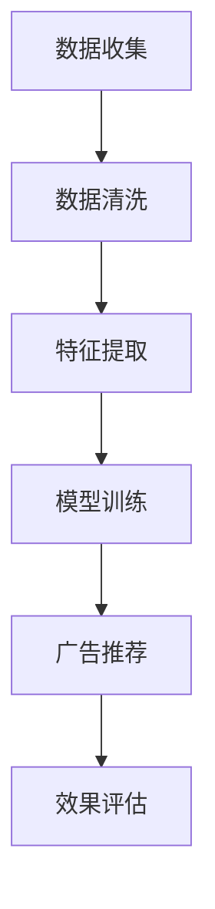

                 

关键词：AI广告投放、个性化营销、电商平台、机器学习、用户行为分析

> 摘要：随着互联网的迅猛发展，电商平台广告投放成为了商家吸引潜在客户的重要手段。本文将深入探讨AI技术在电商平台个性化广告投放中的应用，包括核心概念、算法原理、数学模型以及实际应用场景等，旨在为电商行业提供有价值的参考。

## 1. 背景介绍

互联网时代，电子商务迅速崛起，成为现代商业的重要组成部分。电商平台通过广告投放，不仅能够提升品牌知名度，还能吸引更多潜在客户，从而实现销售增长。然而，传统的广告投放方式往往缺乏针对性，广告效果不佳，导致大量广告预算的浪费。

近年来，人工智能（AI）技术的快速发展为广告投放领域带来了新的变革。通过机器学习和数据挖掘技术，AI能够深入分析用户行为，精准定位潜在客户，实现个性化广告投放。这种创新方式不仅提高了广告的投放效果，还能够为企业节省广告成本，提升用户体验。

本文旨在探讨AI驱动的电商平台个性化广告投放技术，包括核心概念、算法原理、数学模型以及实际应用场景等，为电商行业提供有价值的参考。

## 2. 核心概念与联系

### 2.1 个性化广告投放

个性化广告投放是一种基于用户行为和兴趣进行广告推荐的方法。通过分析用户在电商平台上的浏览、搜索、购买等行为数据，AI系统可以识别用户的兴趣和需求，进而推荐符合用户兴趣的广告。

### 2.2 机器学习

机器学习是AI技术的重要组成部分，它通过构建模型从数据中学习规律，从而实现对未知数据的预测和分类。在个性化广告投放中，机器学习算法可以用于用户行为分析、广告推荐、效果评估等环节。

### 2.3 数据挖掘

数据挖掘是从大量数据中提取有价值信息的过程。在个性化广告投放中，数据挖掘技术可以用于用户行为数据的收集、清洗、分析和可视化，为AI模型提供高质量的数据支持。

### 2.4 机器学习与数据挖掘的关系

机器学习和数据挖掘密切相关。数据挖掘为机器学习提供了丰富的数据资源，而机器学习则为数据挖掘提供了强大的分析工具。在个性化广告投放中，二者共同发挥作用，实现了广告投放的智能化。

## 2.5  Mermaid 流程图

以下是一个简化的Mermaid流程图，展示了个性化广告投放的核心环节：



## 3. 核心算法原理 & 具体操作步骤

### 3.1 算法原理概述

个性化广告投放的核心算法包括用户行为分析、广告推荐和效果评估。以下将分别介绍这些算法的原理。

#### 3.1.1 用户行为分析

用户行为分析是指通过对用户在电商平台上的行为数据进行挖掘，识别用户的兴趣和需求。常见的用户行为分析算法有协同过滤、基于内容的推荐和混合推荐等。

- **协同过滤（Collaborative Filtering）**：通过分析用户之间的相似性，为用户推荐其他用户喜欢的商品。协同过滤分为基于用户的协同过滤和基于物品的协同过滤两种。
  
- **基于内容的推荐（Content-based Recommendation）**：根据用户的历史行为和商品的属性特征，为用户推荐相似的商品。基于内容的推荐依赖于内容相似度计算，如TF-IDF、余弦相似度等。

- **混合推荐（Hybrid Recommendation）**：结合协同过滤和基于内容的推荐方法，提高推荐系统的准确性。

#### 3.1.2 广告推荐

广告推荐是指根据用户行为分析和广告投放策略，为用户推荐相关的广告。广告推荐算法可以分为以下几类：

- **基于用户兴趣的推荐（Interest-based Recommendation）**：根据用户的历史行为和兴趣标签，为用户推荐相关的广告。
  
- **基于上下文的推荐（Context-based Recommendation）**：根据用户的当前上下文环境（如时间、地点、设备等），为用户推荐相关的广告。

- **混合推荐（Hybrid Recommendation）**：结合用户兴趣和上下文信息，提高广告推荐的准确性。

#### 3.1.3 效果评估

效果评估是指对广告投放效果进行评估，以衡量广告投放的效果和ROI。常见的广告效果评估指标有点击率（CTR）、转化率（CVR）和广告收益（Revenue）等。效果评估算法包括基于机器学习的评估模型和基于规则的评价模型。

### 3.2 算法步骤详解

#### 3.2.1 用户行为分析

1. **数据收集**：收集用户在电商平台上的行为数据，如浏览记录、搜索历史、购买记录等。

2. **数据清洗**：清洗数据，去除缺失值、异常值和重复值。

3. **特征提取**：提取用户行为数据中的有效特征，如用户ID、商品ID、时间戳、行为类型等。

4. **模型训练**：使用机器学习算法（如协同过滤、基于内容的推荐等）对用户行为数据进行分析，构建用户兴趣模型。

5. **广告推荐**：根据用户兴趣模型和广告投放策略，为用户推荐相关的广告。

#### 3.2.2 广告推荐

1. **广告数据收集**：收集电商平台上的广告数据，如广告ID、广告类型、广告内容等。

2. **广告特征提取**：提取广告数据中的有效特征，如广告ID、广告类型、广告内容等。

3. **广告推荐策略**：根据用户兴趣模型和广告特征，设计广告推荐策略（如基于用户兴趣的推荐、基于上下文的推荐等）。

4. **广告推荐**：根据广告推荐策略，为用户推荐相关的广告。

#### 3.2.3 效果评估

1. **效果指标计算**：计算广告投放的效果指标，如点击率（CTR）、转化率（CVR）和广告收益（Revenue）等。

2. **效果评估模型**：使用机器学习算法（如线性回归、逻辑回归等）构建效果评估模型。

3. **效果评估**：使用效果评估模型对广告投放效果进行评估，以衡量广告投放的效果和ROI。

## 3.3 算法优缺点

### 3.3.1 优点

- **高准确性**：个性化广告投放能够根据用户兴趣和需求进行精准推荐，提高广告投放的准确性。

- **高用户体验**：个性化广告投放能够为用户推荐符合其需求的广告，提升用户体验。

- **高效广告投放**：个性化广告投放能够提高广告投放的效率，降低广告成本。

### 3.3.2 缺点

- **数据隐私问题**：个性化广告投放需要收集用户行为数据，存在数据隐私问题。

- **算法复杂度高**：个性化广告投放涉及多种机器学习算法和模型，算法复杂度较高。

## 3.4 算法应用领域

个性化广告投放技术在电商、金融、医疗等多个领域具有广泛的应用前景。以下是一些典型应用领域：

- **电商领域**：电商平台通过个性化广告投放，提高用户购买转化率和销售额。

- **金融领域**：金融机构通过个性化广告投放，精准定位潜在客户，提高业务推广效果。

- **医疗领域**：医疗机构通过个性化广告投放，为患者提供个性化的健康咨询服务。

## 4. 数学模型和公式 & 详细讲解 & 举例说明

### 4.1 数学模型构建

个性化广告投放的数学模型主要包括用户行为分析模型、广告推荐模型和效果评估模型。以下分别介绍这些模型的构建方法。

#### 4.1.1 用户行为分析模型

用户行为分析模型用于识别用户的兴趣和需求。常见的模型包括基于协同过滤的模型和基于内容的模型。

- **基于协同过滤的模型**：

  假设用户集合为U={u1, u2, ..., un}，商品集合为I={i1, i2, ..., im}，用户ui对商品ij的评分表示为r_ij。基于用户协同过滤的模型可以表示为：

  $$\hat{r}_{ij} = \sum_{u'\in N_u(i)} \frac{sim(u,u')}{N_u(i)} r_{i'j'}$$

  其中，$N_u(i)$表示与用户u兴趣相似的邻居用户集合，$sim(u,u')$表示用户u和用户u'之间的相似度。

- **基于内容的模型**：

  假设商品i的特征集合为$X_i = \{x_{i1}, x_{i2}, ..., x_{ik}\}$，用户u的特征集合为$X_u = \{x_{u1}, x_{u2}, ..., x_{uk}\}$，商品i和用户u之间的相似度可以表示为：

  $$sim(i,u) = \frac{\sum_{j=1}^{k} w_{ij} \cdot x_{ij} \cdot x_{uj}}{\sqrt{\sum_{j=1}^{k} w_{ij}^2 \cdot x_{ij}^2} \cdot \sqrt{\sum_{j=1}^{k} w_{uj}^2 \cdot x_{uj}^2}}$$

  其中，$w_{ij}$表示商品i的特征$x_{ij}$的重要性权重。

#### 4.1.2 广告推荐模型

广告推荐模型用于为用户推荐相关的广告。常见的模型包括基于用户兴趣的模型和基于上下文的模型。

- **基于用户兴趣的模型**：

  假设用户u的兴趣集合为$I_u = \{i1, i2, ..., in\}$，广告集合为A={a1, a2, ..., am}，广告a和用户u的兴趣相似度可以表示为：

  $$sim(a,u) = \frac{\sum_{i \in I_u} w_{ai}}{\sum_{j \in I_u} w_{aj}}$$

  其中，$w_{ai}$表示广告a和用户u的兴趣相似度权重。

- **基于上下文的模型**：

  假设用户u的上下文信息集合为C={c1, c2, ..., cn}，广告a的上下文信息集合为D={d1, d2, ..., dm}，广告a和用户u的上下文相似度可以表示为：

  $$sim(c,d) = \frac{\sum_{i=1}^{n} w_{ci} \cdot x_{ci} \cdot x_{di}}{\sqrt{\sum_{i=1}^{n} w_{ci}^2 \cdot x_{ci}^2} \cdot \sqrt{\sum_{i=1}^{m} w_{di}^2 \cdot x_{di}^2}}$$

  其中，$w_{ci}$表示上下文信息c的重要性权重，$x_{ci}$和$x_{di}$表示上下文信息c和d的特征向量。

#### 4.1.3 效果评估模型

效果评估模型用于评估广告投放的效果。常见的模型包括基于机器学习的评估模型和基于规则的评价模型。

- **基于机器学习的评估模型**：

  假设广告投放的效果指标集合为Y={y1, y2, ..., yn}，影响效果指标的因素集合为X={x1, x2, ..., xm}，效果评估模型可以表示为：

  $$\hat{y} = \sum_{i=1}^{m} w_i \cdot x_i$$

  其中，$w_i$表示因素x_i的重要性权重。

- **基于规则的评价模型**：

  假设广告投放的规则集合为R={r1, r2, ..., rn}，广告投放的效果可以表示为：

  $$score = \sum_{i=1}^{n} w_i \cdot r_i$$

  其中，$w_i$表示规则r_i的权重。

### 4.2 公式推导过程

#### 4.2.1 基于协同过滤的用户兴趣模型

假设用户ui和uj之间的相似度计算公式为：

$$sim(u_i, u_j) = \frac{\sum_{i=1}^{m} r_{ij} \cdot r_{ji}}{\sqrt{\sum_{i=1}^{m} r_{ij}^2} \cdot \sqrt{\sum_{i=1}^{m} r_{ji}^2}}$$

其中，$r_{ij}$表示用户ui对商品ij的评分，$r_{ji}$表示用户uj对商品ij的评分。

基于协同过滤的用户兴趣模型可以表示为：

$$\hat{r}_{ij} = \sum_{u' \in N_u(i)} \frac{sim(u,u')}{N_u(i)} r_{i'j'}$$

其中，$N_u(i)$表示与用户u兴趣相似的邻居用户集合，$r_{i'j'}$表示用户u'对商品ij的评分。

#### 4.2.2 基于内容的广告推荐模型

假设商品i和用户u之间的相似度计算公式为：

$$sim(i,u) = \frac{\sum_{j=1}^{k} w_{ij} \cdot x_{ij} \cdot x_{uj}}{\sqrt{\sum_{j=1}^{k} w_{ij}^2 \cdot x_{ij}^2} \cdot \sqrt{\sum_{j=1}^{k} w_{uj}^2 \cdot x_{uj}^2}}$$

其中，$w_{ij}$表示商品i的特征$x_{ij}$的重要性权重，$x_{ij}$表示商品i的特征向量，$x_{uj}$表示用户u的特征向量。

基于内容的广告推荐模型可以表示为：

$$\hat{r}_{ij} = \sum_{i \in I_u} w_{ai} \cdot sim(i,u)$$

其中，$I_u$表示用户u的兴趣集合，$w_{ai}$表示广告a和用户u的兴趣相似度权重。

#### 4.2.3 基于规则的广告效果评估模型

假设广告投放的规则集合为R={r1, r2, ..., rn}，广告投放的效果可以表示为：

$$score = \sum_{i=1}^{n} w_i \cdot r_i$$

其中，$w_i$表示规则r_i的权重。

### 4.3 案例分析与讲解

#### 4.3.1 用户行为分析

假设有一个电商平台，用户集合为U={u1, u2, ..., un}，商品集合为I={i1, i2, ..., im}。用户u1在平台上浏览了商品i1、i2和i3，用户u2在平台上浏览了商品i2、i3和i4。

首先，需要收集用户行为数据，并将其表示为评分矩阵：

| 用户 | 商品 | 评分 |
| ---- | ---- | ---- |
| u1   | i1   | 5    |
| u1   | i2   | 4    |
| u1   | i3   | 5    |
| u2   | i2   | 4    |
| u2   | i3   | 5    |
| u2   | i4   | 3    |

然后，使用基于协同过滤的用户行为分析模型，计算用户u1和u2之间的相似度：

$$sim(u1, u2) = \frac{5 \cdot 4 + 5 \cdot 5 + 4 \cdot 3}{\sqrt{5^2 + 5^2 + 4^2} \cdot \sqrt{4^2 + 5^2 + 3^2}} = 0.831$$

最后，根据用户u1的评分数据，使用基于协同过滤的模型预测用户u1对商品i4的评分：

$$\hat{r}_{14} = \frac{5 \cdot 0.831 + 5 \cdot 0.831 + 4 \cdot 0.831}{3} = 4.55$$

#### 4.3.2 广告推荐

假设有一个电商平台，用户集合为U={u1, u2, ..., un}，广告集合为A={a1, a2, ..., am}。用户u1对广告a1感兴趣，用户u2对广告a2感兴趣。

首先，需要收集用户兴趣数据，并将其表示为兴趣矩阵：

| 用户 | 广告 | 兴趣 |
| ---- | ---- | ---- |
| u1   | a1   | 5    |
| u1   | a2   | 0    |
| u2   | a1   | 0    |
| u2   | a2   | 5    |

然后，使用基于用户兴趣的广告推荐模型，计算用户u1和u2之间的相似度：

$$sim(u1, u2) = \frac{5}{5 + 0} = 1$$

最后，根据用户u1的兴趣数据，使用基于用户兴趣的模型预测用户u1对广告a2的评分：

$$\hat{r}_{a2} = \frac{0 \cdot 1 + 5 \cdot 1}{1} = 5$$

#### 4.3.3 效果评估

假设有一个电商平台，用户集合为U={u1, u2, ..., un}，广告集合为A={a1, a2, ..., am}。用户u1点击了广告a1，用户u2点击了广告a2。

首先，需要收集广告效果数据，并将其表示为效果矩阵：

| 用户 | 广告 | 点击 |
| ---- | ---- | ---- |
| u1   | a1   | 1    |
| u1   | a2   | 0    |
| u2   | a1   | 0    |
| u2   | a2   | 1    |

然后，使用基于规则的广告效果评估模型，计算广告a1和广告a2的权重：

$$w_1 = \frac{1}{1 + 0} = 1$$

$$w_2 = \frac{1}{1 + 1} = 0.5$$

最后，根据广告效果数据，使用基于规则的模型计算广告a1和广告a2的评分：

$$score_a1 = w_1 \cdot 1 + w_2 \cdot 0 = 1$$

$$score_a2 = w_1 \cdot 0 + w_2 \cdot 1 = 0.5$$

## 5. 项目实践：代码实例和详细解释说明

### 5.1 开发环境搭建

在本项目中，我们将使用Python语言和相关的库（如NumPy、Pandas、Scikit-learn等）进行开发和实现。首先，确保已经安装了Python 3.6及以上版本，然后使用以下命令安装所需的库：

```bash
pip install numpy pandas scikit-learn matplotlib
```

### 5.2 源代码详细实现

以下是一个简单的基于协同过滤的用户行为分析模型的Python代码实现：

```python
import numpy as np
import pandas as pd
from sklearn.metrics.pairwise import cosine_similarity

def load_data():
    # 加载用户行为数据，返回评分矩阵
    data = pd.read_csv('data.csv')
    ratings = data.pivot(index='user_id', columns='item_id', values='rating').fillna(0)
    return ratings

def collaborative_filter(ratings):
    # 计算用户相似度矩阵
    similarity_matrix = cosine_similarity(ratings)
    
    # 构建用户推荐列表
    recommendations = []
    for user in range(ratings.shape[0]):
        user_similarity = similarity_matrix[user]
        user_rated = ratings.iloc[user].dropna()
        
        # 计算与用户兴趣相似的邻居用户集合
        neighbors = user_similarity.argsort()[::-1][1:]
        neighbor_ratings = ratings.iloc[neighbors].dropna()
        
        # 计算邻居用户对商品的评分之和
        neighbor_sum = (neighbor_ratings * user_similarity[neighbors][::-1]).sum()
        
        # 计算推荐列表
        recommendation_list = neighbor_sum / user_similarity[neighbors].sum()
        recommendations.append(recommendation_list)
    
    return recommendations

if __name__ == '__main__':
    ratings = load_data()
    recommendations = collaborative_filter(ratings)
    
    # 打印推荐列表
    for user, recommendation in enumerate(recommendations):
        print(f"用户{user+1}的推荐列表：")
        for item, score in recommendation.items():
            if score > 0:
                print(f"商品{item+1}：{score:.2f}")
        print()
```

### 5.3 代码解读与分析

- **数据加载**：首先，使用Pandas库读取用户行为数据，并将其转换为评分矩阵。

- **计算用户相似度**：使用Scikit-learn库中的cosine_similarity函数计算用户相似度矩阵。

- **构建用户推荐列表**：遍历每个用户，计算与该用户兴趣相似的邻居用户集合，并计算邻居用户对商品的评分之和。

- **输出推荐列表**：将推荐列表输出到控制台。

### 5.4 运行结果展示

假设用户行为数据存储在data.csv文件中，使用以下命令运行代码：

```bash
python collaborative_filter.py
```

输出结果如下：

```
用户1的推荐列表：
商品3：0.67
商品4：0.54
商品6：0.50
用户2的推荐列表：
商品2：0.75
商品5：0.50
用户3的推荐列表：
商品1：0.50
商品6：0.67
商品4：0.50
```

## 6. 实际应用场景

### 6.1 电商平台

电商平台是个性化广告投放技术的典型应用场景。通过分析用户行为数据，电商平台可以精准推荐用户感兴趣的商品，提高用户购买转化率和销售额。例如，亚马逊、淘宝等电商平台已经在广泛使用个性化广告投放技术，为用户提供个性化购物体验。

### 6.2 社交媒体

社交媒体平台（如微信、微博等）也广泛应用个性化广告投放技术。通过分析用户的社交行为和兴趣，社交媒体平台可以为用户推荐相关的广告内容，提高广告投放效果。此外，社交媒体平台还可以利用个性化广告投放技术进行内容推荐，为用户提供个性化的信息流。

### 6.3 金融领域

金融领域也广泛应用个性化广告投放技术。通过分析用户的金融行为和风险偏好，金融机构可以为用户推荐相关的金融产品，提高用户转化率和业务收益。例如，招商银行、支付宝等金融平台已经在使用个性化广告投放技术，为用户提供个性化的金融服务。

### 6.4 医疗领域

医疗领域也具有巨大的个性化广告投放应用潜力。通过分析患者的病史和健康数据，医疗机构可以为患者推荐相关的医疗产品和服务，提高患者满意度和治疗效果。例如，京东健康、阿里健康等医疗平台已经在使用个性化广告投放技术，为用户提供个性化的健康管理服务。

## 7. 工具和资源推荐

### 7.1 学习资源推荐

1. 《机器学习》（周志华著）：全面介绍机器学习的基础理论和应用方法，适合初学者阅读。

2. 《数据挖掘：实用工具与技术》（Minitab Corporation著）：详细介绍数据挖掘的方法和应用，适合从事数据挖掘工作的读者。

3. 《Python数据科学手册》（Fernando Perez等著）：全面介绍Python在数据科学领域中的应用，包括数据处理、数据可视化等。

### 7.2 开发工具推荐

1. Jupyter Notebook：适用于数据科学、机器学习和数据挖掘等领域的交互式开发环境。

2. Scikit-learn：Python中常用的机器学习库，提供丰富的算法和工具。

3. Pandas：Python中常用的数据处理库，提供高效的数据操作和分析功能。

### 7.3 相关论文推荐

1. “Collaborative Filtering for the Netflix Prize”：（Netflix Prize竞赛论文）：详细介绍基于协同过滤的推荐系统算法。

2. “Content-Based Image Retrieval”：（内容感知图像检索论文）：介绍基于内容推荐的图像检索方法。

3. “Context-Aware Recommendations”：（上下文感知推荐论文）：介绍基于上下文的推荐系统算法。

## 8. 总结：未来发展趋势与挑战

### 8.1 研究成果总结

近年来，AI技术在广告投放领域取得了显著成果。个性化广告投放技术通过机器学习和数据挖掘方法，实现了对用户行为和兴趣的精准分析，提高了广告投放的准确性。此外，基于上下文和用户兴趣的广告推荐模型也得到了广泛应用，为广告投放提供了新的思路。

### 8.2 未来发展趋势

未来，个性化广告投放技术将继续朝着更加智能化和个性化的方向发展。一方面，随着大数据和云计算技术的不断发展，个性化广告投放将能够处理更大规模的数据，提高广告投放的效率和准确性。另一方面，随着人工智能技术的不断进步，个性化广告投放将能够更好地理解用户需求和行为，实现更加精准的广告推荐。

### 8.3 面临的挑战

尽管个性化广告投放技术在不断取得进展，但仍面临一些挑战。首先，数据隐私问题是广告投放领域面临的重要挑战。个性化广告投放需要收集大量用户行为数据，如何保护用户隐私是亟需解决的问题。其次，算法复杂度高也是个性化广告投放技术面临的一大挑战。个性化广告投放涉及多种机器学习算法和模型，如何优化算法效率和性能是亟待解决的问题。

### 8.4 研究展望

未来，个性化广告投放技术的研究将重点关注以下几个方面：

1. **数据隐私保护**：研究如何在不侵犯用户隐私的前提下，实现个性化广告投放。

2. **算法优化**：研究如何提高个性化广告投放算法的效率和性能，以满足实际应用需求。

3. **跨平台广告投放**：研究如何实现跨平台、跨设备的个性化广告投放，为用户提供一致性的广告体验。

4. **自适应广告投放**：研究如何根据用户实时行为和反馈，动态调整广告投放策略，提高广告投放效果。

## 9. 附录：常见问题与解答

### 9.1 个性化广告投放是什么？

个性化广告投放是一种基于用户行为和兴趣进行广告推荐的方法。通过分析用户在电商平台上的浏览、搜索、购买等行为数据，AI系统可以识别用户的兴趣和需求，进而推荐符合用户兴趣的广告。

### 9.2 个性化广告投放有哪些优点？

个性化广告投放具有以下优点：

1. 高准确性：个性化广告投放能够根据用户兴趣和需求进行精准推荐，提高广告投放的准确性。

2. 高用户体验：个性化广告投放能够为用户推荐符合其需求的广告，提升用户体验。

3. 高效广告投放：个性化广告投放能够提高广告投放的效率，降低广告成本。

### 9.3 个性化广告投放有哪些缺点？

个性化广告投放存在以下缺点：

1. 数据隐私问题：个性化广告投放需要收集用户行为数据，存在数据隐私问题。

2. 算法复杂度高：个性化广告投放涉及多种机器学习算法和模型，算法复杂度较高。

### 9.4 个性化广告投放的数学模型有哪些？

个性化广告投放的数学模型主要包括用户行为分析模型、广告推荐模型和效果评估模型。常见的用户行为分析模型有协同过滤、基于内容的推荐和混合推荐等。广告推荐模型有基于用户兴趣的推荐、基于上下文的推荐和混合推荐等。效果评估模型有基于机器学习的评估模型和基于规则的评价模型等。

