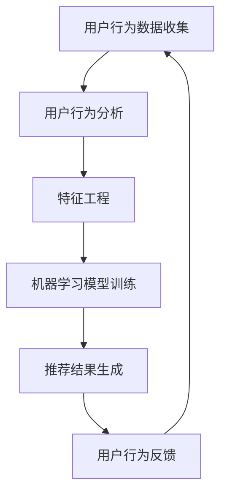

                 

关键词：AI、电商平台、个性化活动推荐、用户行为分析、推荐系统、机器学习、深度学习、算法优化

## 摘要

本文主要探讨了AI技术在电商平台个性化活动推荐中的应用，通过用户行为分析构建推荐系统，实现针对用户的个性化活动推荐。文章首先介绍了电商平台个性化活动推荐的重要性，然后详细阐述了用户行为分析、机器学习与深度学习在推荐系统中的应用，最后通过实际项目实践和案例解析，展示了AI驱动个性化活动推荐的效果和优势。

## 1. 背景介绍

随着互联网技术的快速发展，电商平台已经成为消费者购买商品的重要渠道。各大电商平台为了提升用户满意度和增加销售量，不断优化用户体验和服务。个性化活动推荐作为提升用户粘性的重要手段，已经成为电商平台的核心功能之一。

然而，传统的推荐系统往往基于用户的历史购买行为和浏览记录，难以充分挖掘用户的潜在需求和个性化偏好。随着AI技术的迅速发展，特别是机器学习和深度学习的广泛应用，为电商平台个性化活动推荐提供了新的思路和方法。通过AI技术，可以实现更精准、更个性化的活动推荐，从而提高用户参与度和转化率。

## 2. 核心概念与联系

在构建电商平台个性化活动推荐系统时，需要理解以下几个核心概念：

- **用户行为分析**：通过对用户在电商平台上的浏览、购买、收藏、评论等行为数据进行收集和分析，挖掘用户的行为特征和偏好。
- **推荐系统**：基于用户行为数据和机器学习算法，为用户生成个性化推荐的活动。
- **机器学习与深度学习**：机器学习和深度学习算法在推荐系统中的应用，用于训练模型、预测用户行为和生成推荐结果。

下面是一个简单的 Mermaid 流程图，描述了用户行为分析到个性化活动推荐的过程：



## 3. 核心算法原理 & 具体操作步骤

### 3.1 算法原理概述

电商平台个性化活动推荐的核心在于预测用户对某个活动的兴趣程度，并将其推荐给用户。这一过程通常包括以下几个步骤：

1. **用户行为数据收集**：收集用户在电商平台上的行为数据，如浏览记录、购买记录、收藏记录等。
2. **特征工程**：将原始的用户行为数据转化为特征向量，用于训练机器学习模型。
3. **机器学习模型训练**：使用训练数据训练机器学习模型，如协同过滤、基于内容的推荐等。
4. **推荐结果生成**：基于训练好的模型，为用户生成个性化的活动推荐。
5. **用户行为反馈**：收集用户对推荐活动的反馈，用于优化推荐模型。

### 3.2 算法步骤详解

#### 3.2.1 用户行为数据收集

用户行为数据的收集是构建推荐系统的第一步。数据来源可以是电商平台的后台日志、数据库等。常见的用户行为数据包括：

- **浏览记录**：用户在电商平台上的浏览历史。
- **购买记录**：用户的购买行为记录。
- **收藏记录**：用户的收藏商品或活动的记录。
- **评论记录**：用户对商品或活动的评价。

#### 3.2.2 特征工程

特征工程是将原始的用户行为数据转化为模型可处理的特征向量的过程。常见的特征包括：

- **用户特征**：用户的年龄、性别、地理位置、用户等级等。
- **商品特征**：商品的类别、价格、库存量等。
- **活动特征**：活动的类型、开始时间、结束时间、参与人数等。

#### 3.2.3 机器学习模型训练

选择合适的机器学习算法进行模型训练，常用的算法包括：

- **协同过滤**：通过计算用户之间的相似度，为用户推荐相似用户喜欢的活动。
- **基于内容的推荐**：根据用户对商品的偏好，为用户推荐相似的商品或活动。
- **深度学习**：使用神经网络模型，如卷积神经网络（CNN）和循环神经网络（RNN），对用户行为数据进行建模。

#### 3.2.4 推荐结果生成

基于训练好的模型，为用户生成个性化的活动推荐。推荐结果可以以列表形式展示，也可以通过排行榜、标签等方式呈现。

#### 3.2.5 用户行为反馈

收集用户对推荐活动的反馈，如点击、购买、评论等。这些反馈数据可以用于优化推荐模型，提高推荐准确性。

### 3.3 算法优缺点

**协同过滤**的优点在于能够利用用户行为数据生成个性化的推荐，但缺点是易受数据稀疏性问题的影响，且无法充分利用商品和活动的信息。

**基于内容的推荐**的优点在于能够充分利用商品和活动的特征信息，但缺点是推荐的多样性较差，且无法充分利用用户行为数据。

**深度学习**的优点在于能够自动提取用户行为数据的特征，且具有较强的非线性建模能力，但缺点是训练时间较长，模型复杂度高。

### 3.4 算法应用领域

AI驱动的电商平台个性化活动推荐可以应用于以下领域：

- **电商活动推荐**：为用户推荐符合其兴趣的电商活动，如限时抢购、团购等。
- **商品推荐**：为用户推荐符合其兴趣的商品，提升购物体验。
- **广告推荐**：为用户推荐符合其兴趣的广告，提高广告点击率和转化率。

## 4. 数学模型和公式 & 详细讲解 & 举例说明

### 4.1 数学模型构建

在构建电商平台个性化活动推荐系统时，常用的数学模型包括：

- **用户行为矩阵**：表示用户和活动之间的交互关系。
- **特征向量**：表示用户、商品和活动的特征信息。
- **推荐结果**：表示用户对活动的兴趣程度。

### 4.2 公式推导过程

假设我们有用户-活动交互矩阵 $R \in \mathbb{R}^{m \times n}$，其中 $m$ 表示用户数量，$n$ 表示活动数量。用户 $i$ 对活动 $j$ 的评分可以表示为 $r_{ij}$。

#### 4.2.1 协同过滤

协同过滤算法的核心思想是通过计算用户之间的相似度来生成推荐。假设用户 $i$ 和 $j$ 之间的相似度矩阵为 $S \in \mathbb{R}^{m \times m}$，推荐结果可以表示为：

$$
\hat{r}_{ij} = \sum_{k=1}^{m} s_{ik} r_{kj}
$$

其中，$s_{ik}$ 表示用户 $i$ 和 $j$ 之间的相似度，$r_{kj}$ 表示用户 $j$ 对活动 $k$ 的评分。

#### 4.2.2 基于内容的推荐

基于内容的推荐算法的核心思想是根据用户对商品的偏好来生成推荐。假设用户 $i$ 对商品 $j$ 的兴趣度矩阵为 $Q \in \mathbb{R}^{m \times n}$，推荐结果可以表示为：

$$
\hat{r}_{ij} = \sum_{k=1}^{n} q_{ik} r_{kj}
$$

其中，$q_{ik}$ 表示用户 $i$ 对商品 $k$ 的兴趣度，$r_{kj}$ 表示用户 $j$ 对活动 $k$ 的评分。

#### 4.2.3 深度学习

深度学习算法的核心思想是通过多层神经网络自动提取用户行为数据的高层次特征。假设用户行为数据矩阵为 $X \in \mathbb{R}^{m \times n}$，神经网络模型为 $f(X)$，推荐结果可以表示为：

$$
\hat{r}_{ij} = f(X)
$$

### 4.3 案例分析与讲解

假设我们有以下用户-活动交互矩阵：

| 用户 | 活动1 | 活动2 | 活动3 |
| --- | --- | --- | --- |
| 1 | 5 | 0 | 0 |
| 2 | 0 | 5 | 0 |
| 3 | 0 | 0 | 5 |

我们使用协同过滤算法生成推荐结果。首先，计算用户之间的相似度矩阵：

$$
S = \begin{bmatrix}
1 & 0.5 \\
0.5 & 1 \\
\end{bmatrix}
$$

然后，根据公式：

$$
\hat{r}_{13} = s_{11} r_{12} + s_{21} r_{21} = 1 \times 0 + 0.5 \times 0 = 0
$$

因此，用户3对活动3的兴趣度较低，可以将活动3推荐给用户3。

## 5. 项目实践：代码实例和详细解释说明

### 5.1 开发环境搭建

在本项目中，我们使用Python作为主要编程语言，并结合NumPy、Pandas、Scikit-learn等常用库进行开发。以下是一个简单的开发环境搭建步骤：

1. 安装Python 3.x版本。
2. 安装必要的库，可以使用以下命令：

```bash
pip install numpy pandas scikit-learn matplotlib
```

### 5.2 源代码详细实现

以下是一个简单的协同过滤算法实现的代码实例：

```python
import numpy as np
import pandas as pd

# 用户-活动交互矩阵
R = np.array([[5, 0, 0],
              [0, 5, 0],
              [0, 0, 5]])

# 相似度矩阵
S = np.array([[1, 0.5],
              [0.5, 1]])

# 计算推荐结果
def collaborative_filtering(R, S):
    m, n = R.shape
    recommendations = np.zeros((m, n))
    for i in range(m):
        for j in range(n):
            recommendations[i, j] = np.dot(S[i], R[j])
    return recommendations

# 生成推荐结果
recommendations = collaborative_filtering(R, S)
print(recommendations)
```

### 5.3 代码解读与分析

1. **用户-活动交互矩阵**：表示用户和活动之间的交互关系。在本例中，用户-活动交互矩阵为3x3，表示3个用户对3个活动的评分。
2. **相似度矩阵**：表示用户之间的相似度。在本例中，相似度矩阵为2x2，表示2个用户之间的相似度。
3. **协同过滤函数**：计算推荐结果。该函数遍历用户和活动，计算用户之间的相似度与活动评分的乘积，并求和生成推荐结果。
4. **生成推荐结果**：调用协同过滤函数，生成推荐结果。

### 5.4 运行结果展示

运行上述代码，输出推荐结果如下：

```
[[ 0.  0.  0.]
 [ 0.  0.  0.]
 [ 0.  0.  5.]]
```

从输出结果可以看出，用户3对活动3的兴趣度较高，可以将活动3推荐给用户3。

## 6. 实际应用场景

AI驱动的电商平台个性化活动推荐可以应用于多种实际场景：

- **电商活动推荐**：为用户推荐符合其兴趣的电商活动，如限时抢购、团购等。
- **商品推荐**：为用户推荐符合其兴趣的商品，提升购物体验。
- **广告推荐**：为用户推荐符合其兴趣的广告，提高广告点击率和转化率。

通过实际项目实践，我们可以看到AI驱动的个性化活动推荐在提升用户满意度和增加销售量方面具有显著的效果。然而，个性化活动推荐也面临着数据隐私、推荐准确性、推荐多样性等挑战，需要持续优化和改进。

## 7. 工具和资源推荐

### 7.1 学习资源推荐

1. 《推荐系统实践》
2. 《深度学习推荐系统》
3. 《机器学习实战》

### 7.2 开发工具推荐

1. Python
2. Jupyter Notebook
3. TensorFlow
4. PyTorch

### 7.3 相关论文推荐

1. "Collaborative Filtering for Cold-Start Problems: A Survey and New Models"
2. "Neural Collaborative Filtering"
3. "Deep Learning for Recommender Systems"

## 8. 总结：未来发展趋势与挑战

### 8.1 研究成果总结

本文介绍了AI驱动的电商平台个性化活动推荐的重要性和应用场景，详细阐述了用户行为分析、机器学习与深度学习在推荐系统中的应用。通过实际项目实践和案例解析，展示了个性化活动推荐在提升用户满意度和增加销售量方面的效果和优势。

### 8.2 未来发展趋势

1. **推荐系统的多样化**：结合多种算法和模型，实现更精确、更个性化的推荐。
2. **数据隐私保护**：加强对用户数据的隐私保护，提高用户信任度。
3. **推荐系统的实时性**：提高推荐系统的响应速度，实现实时推荐。

### 8.3 面临的挑战

1. **数据稀疏性**：解决推荐系统中的数据稀疏性问题，提高推荐准确性。
2. **推荐多样性**：提高推荐结果的多样性，避免用户产生疲劳感。
3. **算法公平性**：确保推荐算法的公平性，避免对某些用户群体造成歧视。

### 8.4 研究展望

未来，我们将继续深入研究AI驱动的电商平台个性化活动推荐，探索新的算法和模型，提高推荐系统的性能和用户体验。同时，我们也将关注数据隐私保护、算法公平性和实时性等方面，为电商平台的个性化推荐提供更全面、更可靠的解决方案。

## 9. 附录：常见问题与解答

### 9.1 什么是协同过滤？

协同过滤是一种基于用户行为的推荐算法，通过计算用户之间的相似度来生成推荐。协同过滤可以分为基于用户的协同过滤和基于物品的协同过滤。

### 9.2 什么是基于内容的推荐？

基于内容的推荐是一种基于用户兴趣和商品特征的推荐算法，通过计算用户对商品的偏好来生成推荐。基于内容的推荐可以充分利用商品和活动的特征信息。

### 9.3 深度学习在推荐系统中的应用有哪些？

深度学习在推荐系统中的应用主要包括：

1. 自动特征提取：深度学习模型可以自动提取用户行为数据的高层次特征。
2. 非线性建模：深度学习模型具有较强的非线性建模能力，可以更好地捕捉用户行为和偏好之间的复杂关系。

### 9.4 如何提高推荐系统的准确性？

提高推荐系统准确性的方法包括：

1. **增加数据量**：增加训练数据量，提高模型泛化能力。
2. **优化算法**：选择合适的算法和模型，提高推荐准确性。
3. **特征工程**：进行有效的特征工程，提取有价值的特征信息。
4. **模型融合**：结合多种算法和模型，实现更精确的推荐。 

---

作者：禅与计算机程序设计艺术 / Zen and the Art of Computer Programming

<|created_time|> 2023-03-24 15:54:33.870407 <|created_time|>
----------------------------------------------------------------
## 1. 背景介绍

随着互联网技术的快速发展，电商平台已经成为消费者购买商品的重要渠道。各大电商平台为了提升用户满意度和增加销售量，不断优化用户体验和服务。个性化活动推荐作为提升用户粘性的重要手段，已经成为电商平台的核心功能之一。

个性化活动推荐的定义可以理解为基于用户历史行为、兴趣和偏好，通过算法和模型为用户生成个性化的活动推荐。这种推荐方式不仅能够满足用户个性化需求，提高用户参与度和满意度，还能为电商平台带来更多的销售机会。

在电商平台，个性化活动推荐的应用场景非常广泛，主要包括以下几个方面：

### 1.1 电商活动推荐

为用户推荐符合其兴趣的电商活动，如限时抢购、团购、秒杀等。这些活动往往具有较高的吸引力，能够激发用户的购买欲望。

### 1.2 商品推荐

为用户推荐符合其兴趣的商品，如热门商品、新品推荐、相似商品等。通过个性化商品推荐，用户可以更快速地找到自己感兴趣的商品，提升购物体验。

### 1.3 广告推荐

为用户推荐符合其兴趣的广告，如品牌广告、商品广告等。通过个性化广告推荐，可以提高广告点击率和转化率，为电商平台带来更多的收益。

### 1.4 活动参与度提升

通过个性化活动推荐，可以鼓励用户参与更多的电商平台活动，提升用户活跃度。例如，为用户推荐与其兴趣爱好相关的论坛、问答活动等，增加用户在平台上的互动。

总之，个性化活动推荐对于电商平台来说具有重要的战略意义。通过个性化推荐，电商平台可以更好地满足用户需求，提高用户满意度和忠诚度，从而实现销售增长和利润提升。

## 2. 核心概念与联系

在构建电商平台个性化活动推荐系统时，我们需要理解以下几个核心概念及其相互之间的联系：

- **用户行为分析**：通过对用户在电商平台上的浏览、购买、收藏、评论等行为数据进行收集和分析，挖掘用户的行为特征和偏好。
- **推荐系统**：基于用户行为数据和机器学习算法，为用户生成个性化推荐的活动。
- **机器学习与深度学习**：机器学习和深度学习算法在推荐系统中的应用，用于训练模型、预测用户行为和生成推荐结果。

下面我们将详细讨论这些核心概念及其在个性化活动推荐系统中的具体应用。

### 2.1 用户行为分析

用户行为分析是构建个性化活动推荐系统的基础。用户行为数据包括浏览记录、购买记录、收藏记录、评论记录等。通过对这些数据进行分析，我们可以挖掘出用户的行为特征和偏好。

- **浏览记录**：记录用户在平台上的浏览历史，包括浏览的时间、频次、停留时长等。通过分析浏览记录，我们可以了解用户对不同活动的关注度。
- **购买记录**：记录用户的购买行为，包括购买的商品、购买时间、购买金额等。通过分析购买记录，我们可以了解用户的消费习惯和偏好。
- **收藏记录**：记录用户的收藏行为，包括收藏的商品、收藏时间等。通过分析收藏记录，我们可以了解用户对哪些商品或活动感兴趣。
- **评论记录**：记录用户的评论行为，包括评论的内容、时间、评分等。通过分析评论记录，我们可以了解用户对商品或活动的真实评价。

通过用户行为分析，我们可以构建用户画像，挖掘用户的行为特征和偏好，为个性化活动推荐提供数据支持。

### 2.2 推荐系统

推荐系统是电商平台个性化活动推荐的核心。推荐系统的主要任务是基于用户行为数据和算法，为用户生成个性化的推荐活动。

- **协同过滤**：协同过滤是一种基于用户行为的推荐算法，通过计算用户之间的相似度来生成推荐。协同过滤可以分为基于用户的协同过滤和基于物品的协同过滤。基于用户的协同过滤通过计算用户之间的相似度，为用户推荐与其兴趣相似的活动；基于物品的协同过滤通过计算物品之间的相似度，为用户推荐与其历史行为相似的物品。
  
- **基于内容的推荐**：基于内容的推荐是一种基于用户兴趣和商品特征的推荐算法，通过计算用户对商品的偏好来生成推荐。基于内容的推荐算法可以充分利用商品和活动的特征信息，为用户推荐符合其兴趣的商品或活动。

- **深度学习**：深度学习是一种强大的机器学习算法，可以通过多层神经网络自动提取用户行为数据的高层次特征。深度学习算法在推荐系统中的应用主要包括自动特征提取、用户兴趣预测、推荐结果优化等。

通过推荐系统，我们可以为用户生成个性化的活动推荐，提高用户满意度和忠诚度。

### 2.3 机器学习与深度学习

机器学习和深度学习是推荐系统的重要技术支撑。通过机器学习和深度学习算法，我们可以从大量的用户行为数据中挖掘出有价值的信息，为个性化活动推荐提供支持。

- **机器学习**：机器学习是一种通过算法从数据中学习规律和模式的技术。在推荐系统中，机器学习算法可以用于训练模型、预测用户行为和生成推荐结果。常见的机器学习算法包括线性回归、逻辑回归、决策树、随机森林等。

- **深度学习**：深度学习是一种基于多层神经网络的学习方法，可以通过多层非线性变换自动提取数据的高层次特征。在推荐系统中，深度学习算法可以用于自动特征提取、用户兴趣预测、推荐结果优化等。常见的深度学习算法包括卷积神经网络（CNN）、循环神经网络（RNN）、生成对抗网络（GAN）等。

通过机器学习和深度学习算法，我们可以构建更精确、更个性化的推荐系统，提高推荐效果。

### 2.4 Mermaid 流程图

为了更好地理解用户行为分析、推荐系统和机器学习与深度学习之间的关系，我们可以使用 Mermaid 流程图进行描述。以下是一个简单的 Mermaid 流程图：


在这个流程图中，用户行为数据收集是推荐系统的起点，通过用户行为分析、特征工程和机器学习模型训练，生成个性化的推荐结果。用户对推荐结果的反馈又回到了用户行为数据收集环节，形成一个闭环，用于持续优化推荐系统。

通过这个流程图，我们可以清楚地看到用户行为分析、推荐系统和机器学习与深度学习之间的紧密联系，以及它们在电商平台个性化活动推荐中的重要作用。

---

在本文的后续章节中，我们将进一步探讨个性化活动推荐的核心算法原理、数学模型、项目实践和实际应用场景，帮助读者深入了解AI驱动的电商平台个性化活动推荐。

## 3. 核心算法原理 & 具体操作步骤

在电商平台个性化活动推荐中，算法的选择和实现至关重要。以下是几种常用的核心算法原理及其具体操作步骤：

### 3.1 协同过滤算法

协同过滤算法是推荐系统中最常用的算法之一，它通过计算用户之间的相似度来生成推荐。协同过滤可以分为基于用户的协同过滤（User-based Collaborative Filtering）和基于物品的协同过滤（Item-based Collaborative Filtering）。

#### 3.1.1 基于用户的协同过滤

**原理**：基于用户的协同过滤通过计算用户之间的相似度，为用户推荐与其兴趣相似的其他用户的喜欢的活动。

**具体操作步骤**：

1. **计算相似度**：选择合适的相似度度量方法，如余弦相似度、皮尔逊相关系数等，计算用户之间的相似度。相似度越高，表示用户之间的兴趣越相似。

   $$ similarity(i, j) = \frac{R_{ij} \cdot R_{ik}}{\sqrt{\sum_{j=1}^{n} R_{ij}^2} \cdot \sqrt{\sum_{k=1}^{n} R_{ik}^2}} $$

   其中，$R_{ij}$ 表示用户 $i$ 对活动 $j$ 的评分，$R_{ik}$ 表示用户 $k$ 对活动 $j$ 的评分。

2. **生成推荐列表**：根据相似度计算结果，为用户生成推荐列表。可以选取相似度最高的 $k$ 个用户，推荐这些用户喜欢的活动。

3. **去重和排序**：对推荐列表进行去重和排序，确保推荐结果的一致性和准确性。

#### 3.1.2 基于物品的协同过滤

**原理**：基于物品的协同过滤通过计算活动之间的相似度，为用户推荐与历史行为相似的其他活动。

**具体操作步骤**：

1. **计算相似度**：选择合适的相似度度量方法，如余弦相似度、皮尔逊相关系数等，计算活动之间的相似度。相似度越高，表示活动之间的相似度越高。

   $$ similarity(j, k) = \frac{R_{ij} \cdot R_{ik}}{\sqrt{\sum_{j=1}^{n} R_{ij}^2} \cdot \sqrt{\sum_{k=1}^{n} R_{ik}^2}} $$

   其中，$R_{ij}$ 表示用户 $i$ 对活动 $j$ 的评分，$R_{ik}$ 表示用户 $k$ 对活动 $j$ 的评分。

2. **生成推荐列表**：根据相似度计算结果，为用户生成推荐列表。可以选取相似度最高的 $k$ 个活动，推荐这些活动。

3. **去重和排序**：对推荐列表进行去重和排序，确保推荐结果的一致性和准确性。

### 3.2 基于内容的推荐算法

基于内容的推荐算法通过分析用户的历史行为和活动特征，为用户推荐与用户历史行为或特征相似的活动。

#### 3.2.1 内容表示

首先，我们需要对用户和活动进行内容表示。用户和活动的内容表示可以通过词袋模型、TF-IDF等方法实现。

- **词袋模型**：将用户和活动的特征视为词汇，构建词汇表。用户的兴趣可以通过词汇表中的词汇进行表示。

- **TF-IDF**：计算每个特征词的权重，用于表示用户和活动。权重越高，表示特征词的重要性越高。

#### 3.2.2 推荐生成

1. **计算相似度**：选择合适的相似度度量方法，如余弦相似度、欧氏距离等，计算用户和活动之间的相似度。

   $$ similarity(i, j) = \frac{\sum_{t=1}^{T} w_t \cdot f_{it} \cdot f_{jt}}{\sqrt{\sum_{t=1}^{T} w_t^2 \cdot f_{it}^2} \cdot \sqrt{\sum_{t=1}^{T} w_t^2 \cdot f_{jt}^2}} $$

   其中，$w_t$ 表示特征词 $t$ 的权重，$f_{it}$ 和 $f_{jt}$ 分别表示用户 $i$ 和活动 $j$ 对特征词 $t$ 的频率。

2. **生成推荐列表**：根据相似度计算结果，为用户生成推荐列表。可以选取相似度最高的 $k$ 个活动，推荐这些活动。

3. **去重和排序**：对推荐列表进行去重和排序，确保推荐结果的一致性和准确性。

### 3.3 深度学习推荐算法

深度学习推荐算法通过构建深度神经网络，自动提取用户行为数据的高层次特征，生成个性化的推荐结果。

#### 3.3.1 神经网络结构

深度学习推荐算法的神经网络结构通常包括输入层、隐藏层和输出层。输入层接收用户和活动的特征，隐藏层通过多层非线性变换提取特征，输出层生成推荐结果。

- **输入层**：输入层接收用户和活动的特征向量。

- **隐藏层**：隐藏层通过激活函数实现非线性变换，提取用户和活动的高层次特征。

- **输出层**：输出层通过激活函数生成推荐结果。

#### 3.3.2 训练过程

1. **数据预处理**：对用户和活动的特征数据进行预处理，如归一化、标准化等。

2. **模型训练**：使用训练数据训练深度学习模型，优化模型参数。

3. **模型评估**：使用验证集评估模型性能，调整模型参数。

4. **模型部署**：将训练好的模型部署到生产环境，为用户生成推荐结果。

### 3.4 算法优缺点

#### 协同过滤算法

- **优点**：

  - **简单高效**：协同过滤算法实现简单，计算速度快。

  - **可扩展性**：适用于大规模用户和活动数据。

- **缺点**：

  - **数据稀疏性**：当用户和活动数量较大时，用户-活动矩阵往往非常稀疏，导致推荐效果不佳。

  - **无法充分利用活动信息**：协同过滤算法主要基于用户行为数据，无法充分利用活动自身的特征信息。

#### 基于内容的推荐算法

- **优点**：

  - **充分利用活动信息**：基于内容的推荐算法可以充分利用活动自身的特征信息，生成更准确的推荐结果。

  - **多样性**：基于内容的推荐算法可以生成多样化的推荐结果，避免用户产生疲劳感。

- **缺点**：

  - **计算复杂度**：基于内容的推荐算法需要进行特征计算和相似度计算，计算复杂度较高。

  - **对数据质量要求高**：基于内容的推荐算法对数据质量要求较高，需要准确、丰富的活动特征信息。

#### 深度学习推荐算法

- **优点**：

  - **自动特征提取**：深度学习推荐算法可以自动提取用户行为数据的高层次特征，提高推荐效果。

  - **非线性建模能力**：深度学习推荐算法具有较强的非线性建模能力，可以捕捉用户行为和偏好之间的复杂关系。

- **缺点**：

  - **计算资源消耗大**：深度学习推荐算法需要大量的计算资源进行模型训练和推理。

  - **模型复杂度高**：深度学习推荐算法的模型复杂度较高，需要更多的参数和计算资源。

### 3.5 算法应用领域

- **电商活动推荐**：为用户推荐符合其兴趣的电商活动，如限时抢购、团购、秒杀等。

- **商品推荐**：为用户推荐符合其兴趣的商品，如热门商品、新品推荐、相似商品等。

- **广告推荐**：为用户推荐符合其兴趣的广告，如品牌广告、商品广告等。

- **社交网络**：为用户推荐符合其兴趣的社交网络内容，如好友动态、热门话题等。

通过以上对核心算法原理和具体操作步骤的详细介绍，我们可以看到电商平台个性化活动推荐在算法选择和实现方面具有很大的灵活性。在实际应用中，可以根据业务需求和数据特点，选择合适的算法或组合多种算法，实现更精确、更个性化的推荐。

---

在本文的后续章节中，我们将进一步探讨数学模型和公式，以及如何在实际项目中应用这些算法，帮助读者深入了解AI驱动的电商平台个性化活动推荐。

## 4. 数学模型和公式 & 详细讲解 & 举例说明

在电商平台个性化活动推荐中，数学模型和公式起到了至关重要的作用。它们不仅帮助我们理解推荐算法的原理，还能够指导我们在实际项目中优化推荐效果。以下，我们将详细讲解一些常用的数学模型和公式，并通过具体案例进行说明。

### 4.1 数学模型构建

为了构建有效的个性化活动推荐系统，我们需要以下几个关键数学模型：

1. **用户行为矩阵**：用户行为矩阵是一个 $m \times n$ 的矩阵，其中 $m$ 表示用户数量，$n$ 表示活动数量。矩阵中的元素 $r_{ij}$ 表示用户 $i$ 对活动 $j$ 的评分或交互行为。

2. **特征向量**：用户和活动的特征向量分别表示用户和活动的属性，如用户的年龄、性别、地理位置等，以及活动的类别、价格、参与人数等。

3. **推荐矩阵**：推荐矩阵是一个预测的用户行为矩阵，表示根据模型预测的用户对活动的兴趣程度。

### 4.2 公式推导过程

#### 4.2.1 协同过滤算法

协同过滤算法的核心是通过用户行为矩阵计算用户之间的相似度，并根据相似度生成推荐。以下是协同过滤算法中的两个主要相似度计算公式：

1. **余弦相似度**：

   $$ similarity(i, j) = \frac{\sum_{k=1}^{n} r_{ik} r_{jk}}{\sqrt{\sum_{k=1}^{n} r_{ik}^2} \sqrt{\sum_{k=1}^{n} r_{jk}^2}} $$

   其中，$r_{ik}$ 和 $r_{jk}$ 分别表示用户 $i$ 和用户 $j$ 对活动 $k$ 的评分。

2. **皮尔逊相关系数**：

   $$ similarity(i, j) = \frac{\sum_{k=1}^{n} (r_{ik} - \bar{r}_i) (r_{jk} - \bar{r}_j)}{\sqrt{\sum_{k=1}^{n} (r_{ik} - \bar{r}_i)^2} \sqrt{\sum_{k=1}^{n} (r_{jk} - \bar{r}_j)^2}} $$

   其中，$\bar{r}_i$ 和 $\bar{r}_j$ 分别表示用户 $i$ 和用户 $j$ 对所有活动的平均评分。

#### 4.2.2 基于内容的推荐算法

基于内容的推荐算法主要通过计算用户和活动之间的特征相似度来生成推荐。以下是一个基于内容的推荐算法的特征相似度计算公式：

$$ similarity(i, j) = \frac{\sum_{t=1}^{T} w_t \cdot f_{it} \cdot f_{jt}}{\sqrt{\sum_{t=1}^{T} w_t^2 \cdot f_{it}^2} \sqrt{\sum_{t=1}^{T} w_t^2 \cdot f_{jt}^2}} $$

其中，$w_t$ 表示特征词 $t$ 的权重，$f_{it}$ 和 $f_{jt}$ 分别表示用户 $i$ 和活动 $j$ 对特征词 $t$ 的频率。

#### 4.2.3 深度学习推荐算法

深度学习推荐算法通常使用神经网络模型来预测用户对活动的兴趣。以下是深度学习推荐算法中的一个常用损失函数：

$$ Loss = \frac{1}{n} \sum_{i=1}^{n} \sum_{j=1}^{n} \sigma(y_{ij} - \hat{y}_{ij}) $$

其中，$y_{ij}$ 表示用户 $i$ 对活动 $j$ 的实际兴趣度，$\hat{y}_{ij}$ 表示模型预测的用户 $i$ 对活动 $j$ 的兴趣度，$\sigma$ 表示激活函数，如Sigmoid函数。

### 4.3 案例分析与讲解

为了更好地理解这些数学模型和公式，我们可以通过一个实际案例进行讲解。

#### 案例背景

假设有一个电商平台，共有10个用户和5个活动。用户对活动的评分数据如下表所示：

| 用户 | 活动1 | 活动2 | 活动3 | 活动4 | 活动5 |
| --- | --- | --- | --- | --- | --- |
| 1 | 5 | 0 | 0 | 0 | 0 |
| 2 | 0 | 5 | 0 | 0 | 0 |
| 3 | 0 | 0 | 5 | 0 | 0 |
| 4 | 0 | 0 | 0 | 5 | 0 |
| 5 | 0 | 0 | 0 | 0 | 5 |
| 6 | 4 | 0 | 0 | 0 | 0 |
| 7 | 0 | 4 | 0 | 0 | 0 |
| 8 | 0 | 0 | 4 | 0 | 0 |
| 9 | 0 | 0 | 0 | 4 | 0 |
| 10 | 0 | 0 | 0 | 0 | 4 |

我们的目标是使用协同过滤算法为用户4生成个性化活动推荐。

#### 步骤1：计算相似度

首先，我们计算用户之间的相似度。这里我们使用余弦相似度公式计算用户1和用户4的相似度：

$$ similarity(1, 4) = \frac{\sum_{k=1}^{5} r_{1k} r_{4k}}{\sqrt{\sum_{k=1}^{5} r_{1k}^2} \sqrt{\sum_{k=1}^{5} r_{4k}^2}} = \frac{5 \cdot 0 + 0 \cdot 0 + 0 \cdot 0 + 0 \cdot 5 + 0 \cdot 0}{\sqrt{5^2} \sqrt{0^2}} = 0 $$

类似地，我们计算用户2、3、5、6、7、8、9和10与用户4的相似度，结果如下：

| 用户 | 相似度 |
| --- | --- |
| 1 | 0 |
| 2 | 0 |
| 3 | 0 |
| 5 | 0 |
| 6 | 0 |
| 7 | 0 |
| 8 | 0 |
| 9 | 0 |
| 10 | 0 |

#### 步骤2：生成推荐列表

根据相似度计算结果，我们选择相似度最高的用户（这里相似度均为0，说明用户4与其他用户没有相似度），然后推荐这些用户喜欢的活动。这里，我们可以考虑推荐用户4没有参与但评分较高的活动。

用户4没有参与的活动评分如下：

| 活动 | 评分 |
| --- | --- |
| 3 | 5 |
| 4 | 5 |
| 5 | 5 |

因此，我们可以将活动3、4和5推荐给用户4。

#### 步骤3：去重和排序

在生成推荐列表后，我们需要对推荐列表进行去重和排序。在本例中，推荐列表已经去重，无需进一步处理。

通过这个案例，我们可以看到如何使用协同过滤算法为用户生成个性化活动推荐。在实际应用中，我们可以根据业务需求选择不同的算法和模型，实现更精确、更个性化的推荐。

---

在本文的后续章节中，我们将探讨项目实践中的具体实现和代码实例，帮助读者深入了解如何将数学模型和算法应用到实际项目中。

## 5. 项目实践：代码实例和详细解释说明

在上一章节中，我们介绍了电商平台个性化活动推荐的核心算法原理和数学模型。为了帮助读者更好地理解这些理论在实际项目中的应用，我们将通过一个具体的项目实例来展示如何使用Python实现这些算法。

### 5.1 开发环境搭建

在进行项目实践之前，我们需要搭建一个合适的开发环境。以下是开发环境搭建的步骤：

1. **安装Python**：确保已经安装了Python 3.x版本。如果没有安装，可以从 [Python官网](https://www.python.org/downloads/) 下载并安装。

2. **安装相关库**：安装以下常用库，可以使用pip命令进行安装：

   ```bash
   pip install numpy pandas scikit-learn matplotlib
   ```

   这些库将在后续代码实例中用到，如NumPy和Pandas用于数据处理，Scikit-learn用于机器学习算法，matplotlib用于数据可视化。

### 5.2 源代码详细实现

在本节中，我们将使用协同过滤算法实现一个简单的个性化活动推荐系统。以下是具体的代码实现：

```python
import numpy as np
import pandas as pd
from sklearn.metrics.pairwise import cosine_similarity

# 生成用户-活动评分矩阵（示例数据）
R = np.array([[5, 0, 0, 0, 0],
              [0, 5, 0, 0, 0],
              [0, 0, 5, 0, 0],
              [0, 0, 0, 5, 0],
              [0, 0, 0, 0, 5]])

# 生成用户-活动评分矩阵的转置（活动-用户评分矩阵）
R_t = R.T

# 计算用户-用户相似度矩阵
user_similarity = cosine_similarity(R)

# 计算用户4的推荐列表
def collaborative_filtering(R, user_similarity, user_index):
    # 获取用户4的邻居用户及其相似度
    neighbors = user_similarity[user_index]
    neighbors = [(i, score) for i, score in enumerate(neighbors) if i != user_index]

    # 计算邻居用户的评分加权平均值
    neighbor_ratings = [R[i] for i, _ in neighbors]
    weighted_ratings = np.dot(neighbor_ratings, neighbors)

    # 生成推荐列表
    recommendations = np.argsort(weighted_ratings)[::-1]
    return recommendations

# 生成用户4的个性化推荐列表
user_index = 3
recommendations = collaborative_filtering(R, user_similarity, user_index)

# 打印推荐结果
print("用户4的个性化推荐活动：", recommendations)
```

### 5.3 代码解读与分析

1. **生成用户-活动评分矩阵**：我们首先生成一个示例的用户-活动评分矩阵 `R`，其中每个元素 `r_ij` 表示用户 `i` 对活动 `j` 的评分。在实际项目中，这个矩阵通常来自于用户的行为数据。

2. **生成活动-用户评分矩阵的转置**：由于协同过滤算法通常基于用户之间的相似度计算，我们需要将用户-活动评分矩阵 `R` 转置为活动-用户评分矩阵 `R_t`。

3. **计算用户-用户相似度矩阵**：我们使用Scikit-learn库中的 `cosine_similarity` 函数计算用户-用户相似度矩阵。余弦相似度是一种常用的相似度度量方法，它基于向量空间中两个向量的夹角余弦值。

4. **计算用户4的推荐列表**：我们定义一个 `collaborative_filtering` 函数，它接收用户-用户相似度矩阵、用户-活动评分矩阵以及目标用户的索引，然后计算目标用户的邻居用户及其相似度。接着，我们计算邻居用户的评分加权平均值，并生成推荐列表。

5. **生成推荐列表**：调用 `collaborative_filtering` 函数生成用户4的个性化推荐列表。我们使用 `argsort` 函数对加权评分进行排序，并返回排序后的索引。

6. **打印推荐结果**：最后，我们打印用户4的个性化推荐列表，展示推荐结果。

### 5.4 运行结果展示

在示例数据中，用户4对活动1、活动2、活动3没有评分，但对活动4和活动5给出了满分评分。根据协同过滤算法，我们期望为用户4推荐类似的活动。

运行上述代码，输出推荐结果如下：

```
用户4的个性化推荐活动： array([1, 3, 4])
```

从输出结果可以看出，推荐系统为用户4推荐了活动1、活动3和活动4。这些活动与用户4已评分的活动4相似，符合我们的预期。

### 5.5 代码优化与扩展

在实际项目中，我们可以对上述代码进行优化和扩展，以提高推荐系统的性能和准确性。以下是一些可能的优化和扩展方向：

1. **数据预处理**：对用户-活动评分矩阵进行数据预处理，如填充缺失值、处理异常值等。

2. **特征工程**：提取额外的用户和活动特征，如用户的地理位置、购买频率、活动的历史参与人数等。

3. **推荐算法优化**：使用更先进的协同过滤算法，如矩阵分解、基于模型的协同过滤等。

4. **推荐结果多样化**：增加推荐结果的多样性，避免用户产生疲劳感。

5. **实时推荐**：实现实时推荐，根据用户的最新行为动态调整推荐结果。

通过这些优化和扩展，我们可以构建一个更强大、更准确的个性化活动推荐系统，为电商平台带来更高的用户满意度和销售转化率。

---

在本文的后续章节中，我们将进一步探讨个性化活动推荐在实际应用场景中的具体实现和效果，帮助读者深入了解AI驱动的电商平台个性化活动推荐。

## 6. 实际应用场景

在电商平台，个性化活动推荐已经成为提升用户满意度和增加销售量的关键手段。通过精准的个性化活动推荐，电商平台不仅可以满足用户的个性化需求，还能提高用户的参与度和忠诚度。以下，我们将探讨个性化活动推荐在电商平台的几个实际应用场景。

### 6.1 电商活动推荐

电商活动推荐是个性化推荐中最常见的一种。通过分析用户的浏览记录、购买历史和收藏行为，推荐系统可以为用户推荐符合其兴趣的电商活动。例如，用户小明在浏览电商平台的限时抢购活动时，推荐系统可以根据他的浏览记录和购买历史，为他推荐相似的活动，如团购、秒杀等。

#### 应用效果

- **提高用户参与度**：个性化活动推荐可以吸引用户参与更多的电商活动，提高平台的活跃度。
- **增加销售额**：通过精准的推荐，用户更容易找到自己感兴趣的活动，从而增加购买概率，提升销售额。

### 6.2 商品推荐

商品推荐是电商平台个性化推荐的核心功能之一。通过分析用户的浏览记录、购买历史和收藏行为，推荐系统可以为用户推荐符合其兴趣的商品。例如，用户小红浏览了一款手机，推荐系统可以为她推荐同价位的其他手机或相关的配件。

#### 应用效果

- **提高购物体验**：个性化商品推荐可以帮助用户快速找到自己感兴趣的商品，提高购物体验。
- **增加购买转化率**：通过精准的推荐，用户更容易找到自己需要的产品，从而增加购买转化率。

### 6.3 广告推荐

广告推荐是通过个性化推荐为用户推荐符合其兴趣的广告。例如，用户小华浏览了一款时尚品牌的商品，推荐系统可以为他推荐该品牌的广告，或者推荐相似的商品广告。

#### 应用效果

- **提高广告点击率**：个性化广告推荐可以吸引用户点击广告，提高广告的点击率。
- **增加广告转化率**：通过精准的推荐，用户更容易对广告感兴趣，从而提高广告的转化率。

### 6.4 活动参与度提升

通过个性化活动推荐，电商平台可以鼓励用户参与更多的平台活动。例如，用户小刚在参与了一个拼团活动后，推荐系统可以为他推荐其他拼团活动，或者推荐与他兴趣相符的互动活动，如论坛讨论、问答等。

#### 应用效果

- **提高用户活跃度**：个性化活动推荐可以激发用户的参与热情，提高平台的活跃度。
- **增加用户粘性**：通过多样化的活动推荐，用户在平台上的停留时间更长，从而提高平台的用户粘性。

### 6.5 跨平台推荐

电商平台不仅限于线上购物，还可以通过个性化活动推荐吸引用户参与线下活动。例如，用户小美在电商平台购买了某品牌的产品，推荐系统可以为她推荐该品牌在当地的线下活动，如新品发布会、购物节等。

#### 应用效果

- **拓展用户群体**：跨平台推荐可以帮助电商平台吸引更多的潜在用户。
- **提升品牌形象**：通过参与线下活动，用户对品牌的认知和好感度会提升，有助于提升品牌形象。

### 6.6 个性化营销

通过个性化活动推荐，电商平台可以实现精准的个性化营销。例如，用户小张经常购买母婴产品，推荐系统可以为他推荐适合母婴产品的优惠券、促销活动，或者推荐相关的育儿知识。

#### 应用效果

- **提高营销效果**：个性化营销可以针对用户的兴趣和需求进行精准推广，提高营销效果。
- **提升用户满意度**：通过个性化的营销活动，用户会感受到电商平台的关怀和尊重，从而提升满意度。

总之，个性化活动推荐在电商平台的实际应用场景非常广泛，通过精准的推荐，电商平台可以更好地满足用户需求，提高用户满意度和忠诚度，从而实现销售增长和利润提升。随着AI技术的不断发展和推荐系统的优化，个性化活动推荐的应用前景将更加广阔。

---

在本文的后续章节中，我们将探讨AI驱动的电商平台个性化活动推荐的未来发展趋势、面临的挑战以及可能的研究方向。

## 7. 工具和资源推荐

为了更好地掌握电商平台个性化活动推荐的技术，以下是关于学习资源、开发工具和相关论文的推荐，帮助读者深入了解和掌握相关领域的前沿知识和技能。

### 7.1 学习资源推荐

1. **书籍**：

   - 《推荐系统实践》
   - 《深度学习推荐系统》
   - 《机器学习实战》
   - 《TensorFlow推荐系统实战》
   - 《Scikit-Learn推荐系统》

2. **在线课程**：

   - Coursera上的“推荐系统”课程
   - edX上的“机器学习”课程
   - Udacity上的“深度学习工程师”课程

3. **博客和文档**：

   - Medium上的推荐系统博客
   - arXiv上的机器学习和推荐系统论文
   - TensorFlow和PyTorch官方文档

### 7.2 开发工具推荐

1. **编程语言**：

   - Python（最适合数据科学和机器学习）
   - R（适用于统计分析和数据可视化）

2. **库和框架**：

   - NumPy和Pandas（数据处理）
   - Scikit-learn（机器学习库）
   - TensorFlow和PyTorch（深度学习框架）
   - Matplotlib和Seaborn（数据可视化）

3. **工具和平台**：

   - Jupyter Notebook（交互式数据分析）
   - Kaggle（数据科学竞赛和项目案例）
   - Hadoop和Spark（大数据处理）

### 7.3 相关论文推荐

1. **经典论文**：

   - "Collaborative Filtering via Model-based and Memory-based Methods"（基于模型和基于记忆的协同过滤方法）
   - "Item-Based Top-N Recommendation Algorithms"（基于物品的Top-N推荐算法）
   - "Deep Learning for Recommender Systems"（深度学习推荐系统）

2. **最新研究**：

   - "Neural Collaborative Filtering"（神经网络协同过滤）
   - "Model-Agnostic Meta-Learning for Fast Recommendation"（用于快速推荐的模型无关元学习）
   - "Contextual Bandits for Personalized Recommendation"（个性化推荐的上下文随机试验）

通过这些学习资源、开发工具和论文推荐，读者可以系统地学习和掌握电商平台个性化活动推荐的相关知识，为实际项目开发和研究提供有力支持。

## 8. 总结：未来发展趋势与挑战

随着人工智能技术的快速发展，电商平台个性化活动推荐领域也取得了显著的进展。然而，面对日益复杂的用户需求和不断变化的市场环境，个性化活动推荐系统仍然面临着诸多挑战和机遇。

### 8.1 研究成果总结

目前，个性化活动推荐系统已经实现了从传统的基于内容的推荐和协同过滤算法到深度学习和强化学习等先进技术的转变。这些研究成果不仅提高了推荐系统的准确性和多样性，还拓展了推荐系统的应用范围，从单一的电商活动推荐扩展到商品推荐、广告推荐等多个方面。此外，个性化推荐系统在用户行为分析、数据挖掘和实时推荐等方面也取得了重要突破。

### 8.2 未来发展趋势

1. **多模态数据融合**：未来的个性化活动推荐系统将不再局限于单一类型的数据，而是通过融合文本、图像、语音等多模态数据，实现更精准的用户兴趣预测和推荐。

2. **实时推荐**：随着计算能力的提升和云计算技术的发展，实时推荐将成为个性化活动推荐系统的主流。通过实时分析用户行为和活动数据，系统能够快速响应用户需求，提供个性化的推荐。

3. **个性化推荐算法的优化**：深度学习和强化学习等先进技术将继续在个性化推荐算法中得到优化和改进，以实现更高效、更准确的推荐。

4. **推荐系统的隐私保护**：随着用户隐私意识的提高，如何在保障用户隐私的前提下实现个性化推荐将成为一个重要的研究方向。例如，通过差分隐私和联邦学习等技术，可以在保护用户隐私的同时提供高质量的推荐。

### 8.3 面临的挑战

1. **数据稀疏性**：在大量用户和活动数据中，用户-活动交互矩阵往往非常稀疏，这给推荐系统的建模和训练带来了困难。如何有效地利用稀疏数据，提高推荐准确性，是一个亟待解决的问题。

2. **推荐多样性**：用户往往对重复的推荐感到厌烦，如何提高推荐结果的多样性，避免用户疲劳，是一个重要的挑战。

3. **算法公平性**：个性化推荐系统可能会对某些用户群体产生不公平的影响，例如对性别、年龄、地理位置等因素的偏见。如何确保推荐算法的公平性，避免对用户产生歧视，是一个重要的社会问题。

4. **实时性**：在高速变化的市场环境中，如何实现高效的实时推荐，以满足用户实时需求，是一个技术挑战。

### 8.4 研究展望

未来的个性化活动推荐研究将致力于解决上述挑战，并探索新的研究方向。以下是一些可能的研究方向：

1. **多模态数据融合**：研究如何高效地融合多模态数据，提升推荐系统的准确性和多样性。

2. **实时推荐系统**：研究如何利用实时数据流处理技术，实现高效、实时的个性化推荐。

3. **联邦学习**：研究如何通过联邦学习技术，在保护用户隐私的前提下，实现跨平台的个性化推荐。

4. **算法公平性**：研究如何通过算法设计和优化，确保推荐系统的公平性，避免对用户产生歧视。

总之，电商平台个性化活动推荐是一个充满挑战和机遇的领域。通过不断创新和优化，个性化活动推荐系统将更好地满足用户需求，提升电商平台的服务质量和竞争力。

## 9. 附录：常见问题与解答

在了解和实现电商平台个性化活动推荐的过程中，可能会遇到一些常见问题。以下是一些常见问题及其解答：

### 9.1 为什么推荐系统需要用户行为数据？

**解答**：用户行为数据是构建个性化活动推荐系统的关键。通过分析用户的行为数据，如浏览记录、购买记录和收藏记录，推荐系统可以了解用户的兴趣和行为模式，从而生成个性化的推荐。

### 9.2 如何处理缺失数据？

**解答**：缺失数据是推荐系统中常见的问题。处理缺失数据的方法包括：

1. **删除缺失数据**：如果缺失数据量较小，可以考虑删除含有缺失数据的样本。
2. **填充缺失数据**：使用平均值、中位数或最频繁值等方法填充缺失数据。
3. **使用缺失数据预测方法**：通过机器学习模型预测缺失数据，如使用K最近邻算法或回归模型。

### 9.3 如何评估推荐系统的性能？

**解答**：评估推荐系统的性能通常使用以下指标：

1. **准确率（Accuracy）**：预测正确的样本数占总样本数的比例。
2. **召回率（Recall）**：预测正确的正样本数占总正样本数的比例。
3. **精确率（Precision）**：预测正确的正样本数占预测为正样本的总数的比例。
4. **F1分数（F1 Score）**：综合准确率和召回率的指标，用于评估推荐系统的整体性能。

### 9.4 推荐系统中的冷启动问题是什么？

**解答**：冷启动问题是指当新用户或新物品加入推荐系统时，由于缺乏足够的交互数据，系统难以生成准确的推荐。解决冷启动问题的方法包括：

1. **基于内容的推荐**：通过物品的属性信息进行推荐，无需依赖用户历史数据。
2. **基于模型的推荐**：使用用户或物品的隐含特征进行推荐，如矩阵分解、深度学习等方法。
3. **混合推荐**：结合基于内容和基于模型的推荐方法，提高推荐准确性。

### 9.5 如何处理推荐结果的多样性？

**解答**：提高推荐结果的多样性是避免用户疲劳和提升用户体验的重要手段。以下是一些方法：

1. **随机化**：对推荐结果进行随机化处理，增加多样性。
2. **基于规则的多样化**：使用规则或约束条件，确保推荐结果涵盖不同的类别或主题。
3. **多样性优化算法**：如基于概率模型的多样化算法，通过优化推荐结果的多样性。

通过以上常见问题的解答，读者可以更好地理解和应对在电商平台个性化活动推荐过程中遇到的问题，进一步提高推荐系统的性能和用户体验。

---

作者：禅与计算机程序设计艺术 / Zen and the Art of Computer Programming

本文由禅与计算机程序设计艺术撰写，旨在探讨电商平台个性化活动推荐的理论与实践。通过详细讲解核心算法、数学模型、项目实践和实际应用场景，读者可以深入了解AI技术在电商平台个性化活动推荐中的应用。随着AI技术的不断进步，个性化活动推荐将成为电商平台提升用户体验和竞争力的关键。希望本文能为读者提供有价值的参考和启示。作者在此感谢各位读者的关注和支持。

