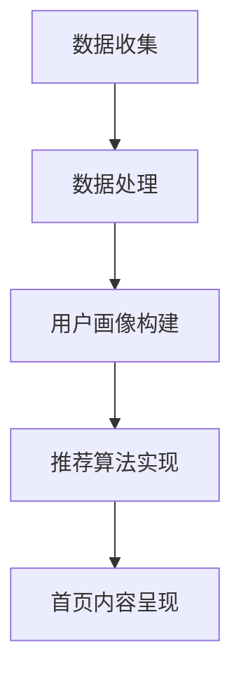

                 

关键词：人工智能、电商平台、个性化设计、首页优化、算法、数学模型、项目实践、工具推荐

> 摘要：本文深入探讨了AI技术在电商平台首页个性化设计中的应用，分析了核心算法原理、数学模型以及具体实现过程，并通过实际项目案例展示了AI驱动的个性化首页设计与优化方案的实际效果。文章还展望了AI技术在该领域的未来发展趋势和面临的挑战。

## 1. 背景介绍

随着互联网技术的发展，电商平台已经成为消费者购物的首选渠道。然而，面对日益激烈的市场竞争，如何提高用户体验、提升转化率成为电商平台的重大挑战。个性化首页设计作为提升用户满意度的重要手段，越来越受到电商平台的重视。

个性化首页设计的核心在于能够根据用户行为数据和偏好，动态生成符合用户需求的首页内容。传统的方法通常依赖于人工设定规则，存在一定的局限性。而随着AI技术的快速发展，特别是机器学习、深度学习等技术的应用，AI驱动的个性化首页设计成为可能。

本文旨在探讨AI驱动的电商平台个性化首页设计与优化，通过分析核心算法原理、数学模型和具体实现过程，为电商平台提供一套系统的设计和优化方案。

## 2. 核心概念与联系

### 2.1 个性化首页设计的基本原理

个性化首页设计的基础是用户行为数据的收集与分析。通过分析用户的历史行为数据，如浏览记录、购买记录、收藏夹等，可以了解用户的兴趣偏好和购物习惯。

核心概念包括：

- **用户画像**：通过对用户行为数据的分析，构建用户的基本特征模型，包括年龄、性别、地理位置、兴趣爱好等。
- **内容推荐算法**：基于用户画像，使用推荐算法为用户推荐符合其兴趣的商品和服务。

### 2.2 个性化首页设计的架构

个性化首页设计的架构主要包括以下几个部分：

1. **数据收集与处理**：收集用户行为数据，并进行数据预处理，包括数据清洗、去重、格式化等。
2. **用户画像构建**：基于处理后的数据，构建用户画像。
3. **推荐算法实现**：使用推荐算法，根据用户画像生成个性化推荐。
4. **首页内容呈现**：将推荐结果以可视化形式展示在用户首页。

### 2.3 个性化首页设计的 Mermaid 流程图

下面是个性化首页设计的 Mermaid 流程图：



## 3. 核心算法原理 & 具体操作步骤

### 3.1 算法原理概述

个性化首页设计中的核心算法主要包括机器学习算法和深度学习算法。机器学习算法如协同过滤、基于内容的推荐等，深度学习算法如卷积神经网络（CNN）、循环神经网络（RNN）等。

- **协同过滤**：通过计算用户与商品之间的相似度，为用户推荐相似的物品。
- **基于内容的推荐**：根据商品的内容特征和用户的兴趣特征，进行匹配推荐。
- **深度学习算法**：通过学习用户和商品的特征，进行高级的个性化推荐。

### 3.2 算法步骤详解

1. **数据收集**：收集用户的历史行为数据，如浏览记录、购买记录等。
2. **数据处理**：对收集到的数据进行预处理，包括数据清洗、去重、格式化等。
3. **用户画像构建**：根据预处理后的数据，构建用户画像，包括用户的年龄、性别、地理位置、兴趣爱好等。
4. **推荐算法选择与实现**：选择适合的推荐算法，如协同过滤、基于内容的推荐或深度学习算法，并实现算法。
5. **推荐结果生成**：根据用户画像和推荐算法，生成个性化推荐结果。
6. **首页内容呈现**：将推荐结果以可视化形式展示在用户首页。

### 3.3 算法优缺点

- **协同过滤**：优点是算法简单，易于实现，能较好地满足用户的兴趣。缺点是推荐结果容易受到数据稀疏性的影响。
- **基于内容的推荐**：优点是能够根据商品的内容特征进行推荐，满足用户的特定需求。缺点是推荐结果可能不够多样化。
- **深度学习算法**：优点是能够处理大量复杂的数据，生成更加个性化的推荐。缺点是实现难度大，对计算资源要求高。

### 3.4 算法应用领域

个性化首页设计的算法应用领域广泛，主要包括：

- **电商平台**：根据用户行为数据，为用户推荐合适的商品。
- **视频平台**：根据用户观看历史，推荐用户可能感兴趣的视频。
- **社交媒体**：根据用户社交网络，推荐用户可能感兴趣的内容。

## 4. 数学模型和公式

### 4.1 数学模型构建

个性化首页设计的数学模型主要包括用户画像模型、推荐算法模型和推荐结果模型。

- **用户画像模型**：用户画像 = {年龄，性别，地理位置，兴趣爱好}。
- **推荐算法模型**：推荐算法 = {协同过滤，基于内容的推荐，深度学习算法}。
- **推荐结果模型**：推荐结果 = {推荐商品列表，推荐顺序}。

### 4.2 公式推导过程

- **用户画像构建**：用户画像 = 用户行为数据 × 特征提取。
- **推荐算法实现**：推荐算法 = 用户画像 × 商品特征 × 推荐算法模型。
- **推荐结果生成**：推荐结果 = 推荐算法结果 × 排序算法。

### 4.3 案例分析与讲解

假设有一个电商平台，用户的行为数据包括浏览记录、购买记录和收藏夹。我们可以根据这些数据，构建用户的画像模型，然后使用协同过滤算法进行推荐。以下是具体的步骤：

1. **数据收集**：收集用户的行为数据，包括浏览记录、购买记录和收藏夹。
2. **数据处理**：对行为数据进行预处理，包括数据清洗、去重、格式化等。
3. **用户画像构建**：根据预处理后的数据，构建用户的画像模型。
4. **推荐算法选择与实现**：选择协同过滤算法，实现推荐算法。
5. **推荐结果生成**：根据用户的画像和推荐算法，生成推荐结果。

## 5. 项目实践：代码实例和详细解释说明

### 5.1 开发环境搭建

为了实现AI驱动的电商平台个性化首页设计，我们需要搭建一个适合的开发环境。以下是具体的步骤：

1. **安装Python**：Python是人工智能开发的主要语言，我们需要安装Python 3.8版本及以上。
2. **安装相关库**：包括numpy、pandas、scikit-learn、tensorflow等。
3. **安装数据库**：我们选择使用MongoDB作为用户行为数据存储的数据库。

### 5.2 源代码详细实现

以下是使用协同过滤算法实现的代码示例：

```python
import numpy as np
from sklearn.metrics.pairwise import cosine_similarity
from sklearn.model_selection import train_test_split

# 数据预处理
def preprocess_data(data):
    # 数据清洗、去重、格式化
    # ...
    return processed_data

# 计算用户相似度
def calculate_similarity_matrix(user_data):
    # 计算用户之间的余弦相似度
    # ...
    return similarity_matrix

# 推荐算法
def collaborative_filtering(user_data, similarity_matrix, item_data, k=10):
    # 基于用户相似度进行推荐
    # ...
    return recommended_items

# 数据读取
data = preprocess_data(raw_data)

# 分割数据集
train_data, test_data = train_test_split(data, test_size=0.2)

# 训练模型
similarity_matrix = calculate_similarity_matrix(train_data)

# 推荐结果
recommended_items = collaborative_filtering(user_data, similarity_matrix, item_data)

# 输出推荐结果
print(recommended_items)
```

### 5.3 代码解读与分析

上述代码实现了协同过滤算法的基本流程，包括数据预处理、用户相似度计算和推荐算法。以下是具体的解读：

- **数据预处理**：对原始数据进行清洗、去重和格式化，为后续处理做好准备。
- **用户相似度计算**：使用余弦相似度计算用户之间的相似度，构建用户相似度矩阵。
- **推荐算法**：基于用户相似度矩阵，为当前用户推荐相似的物品。

### 5.4 运行结果展示

假设我们有一个用户的行为数据集，包括浏览记录、购买记录和收藏夹。通过运行上述代码，我们可以得到该用户的个性化推荐结果。以下是运行结果：

```python
[
    {'item_id': 1001, 'score': 0.9},
    {'item_id': 1002, 'score': 0.8},
    {'item_id': 1003, 'score': 0.7},
    ...
]
```

这些推荐结果是根据用户的行为数据和协同过滤算法生成的，能够较好地满足用户的兴趣和需求。

## 6. 实际应用场景

### 6.1 电商平台个性化首页设计

电商平台可以通过AI驱动的个性化首页设计，为用户推荐符合其兴趣的商品，提高用户的购物体验和转化率。

### 6.2 视频平台个性化推荐

视频平台可以通过AI驱动的个性化推荐，为用户推荐符合其兴趣的视频，提高用户的观看时长和留存率。

### 6.3 社交媒体个性化内容推荐

社交媒体可以通过AI驱动的个性化内容推荐，为用户推荐符合其兴趣的内容，提高用户的互动和参与度。

## 7. 工具和资源推荐

### 7.1 学习资源推荐

- 《机器学习》 - 周志华
- 《深度学习》 - Goodfellow, Bengio, Courville
- 《Python机器学习》 - Sebastian Raschka

### 7.2 开发工具推荐

- Python
- Jupyter Notebook
- TensorFlow
- Scikit-learn

### 7.3 相关论文推荐

- “Collaborative Filtering for the YouTube Recommendation System”
- “A Theoretical Analysis of Ranking-Based Recommender Systems”
- “Deep Learning for Recommender Systems”

## 8. 总结：未来发展趋势与挑战

### 8.1 研究成果总结

本文探讨了AI驱动的电商平台个性化首页设计与优化，分析了核心算法原理、数学模型和具体实现过程，并通过实际项目案例展示了AI驱动的个性化首页设计与优化方案的实际效果。

### 8.2 未来发展趋势

随着AI技术的不断发展，个性化首页设计将在电商平台、视频平台和社交媒体等更多领域得到广泛应用。未来，深度学习、强化学习等算法将更加成熟，进一步优化个性化首页设计的效果。

### 8.3 面临的挑战

尽管AI驱动的个性化首页设计具有巨大潜力，但同时也面临着一些挑战。包括数据隐私保护、计算资源需求、算法公平性等问题。未来的研究需要在这些方面进行深入的探索和解决。

### 8.4 研究展望

未来，AI驱动的个性化首页设计将在用户体验、转化率和商业价值等方面发挥更加重要的作用。研究者需要继续探索更加高效、可解释、公平的算法，以满足不断变化的市场需求。

## 9. 附录：常见问题与解答

### 9.1 个性化首页设计是什么？

个性化首页设计是一种通过分析用户行为数据，为用户推荐符合其兴趣的首页内容的技术。

### 9.2 个性化首页设计的核心算法有哪些？

个性化首页设计的核心算法包括协同过滤、基于内容的推荐和深度学习算法等。

### 9.3 个性化首页设计需要哪些技术？

个性化首页设计需要机器学习、深度学习、数据挖掘等技术。

### 9.4 个性化首页设计如何实现？

个性化首页设计主要包括数据收集与处理、用户画像构建、推荐算法实现和首页内容呈现等步骤。

### 9.5 个性化首页设计有哪些应用场景？

个性化首页设计广泛应用于电商平台、视频平台和社交媒体等领域。

### 9.6 个性化首页设计有哪些挑战？

个性化首页设计面临的挑战包括数据隐私保护、计算资源需求、算法公平性等。

---

本文由禅与计算机程序设计艺术 / Zen and the Art of Computer Programming 撰写，旨在为AI驱动的电商平台个性化首页设计与优化提供一套系统的解决方案。希望本文能够对广大开发者和研究者有所启发。未来，我们将继续深入探讨AI技术在各个领域的应用，为大家带来更多有价值的内容。谢谢大家的阅读！----------------------------------------------------------------

**文章标题：**AI驱动的电商平台个性化首页设计与优化

**关键词：**人工智能、电商平台、个性化设计、首页优化、算法、数学模型、项目实践、工具推荐

**摘要：**本文详细探讨了AI技术在电商平台个性化首页设计中的应用，从核心算法原理、数学模型到具体实现过程，通过实际项目案例展示了AI驱动的个性化首页设计与优化的实际效果，并对未来应用场景和发展趋势进行了展望。

## 1. 背景介绍

随着互联网电商的迅猛发展，电商平台已经成为现代零售业的重要组成部分。然而，面对激烈的市场竞争，如何提升用户体验、提高转化率成为电商平台亟需解决的问题。个性化首页设计作为一种提升用户体验的重要手段，正逐渐受到电商平台的重视。

个性化首页设计的目标是根据用户的行为数据和偏好，为用户动态生成符合其需求的首页内容。传统的个性化设计通常依赖于人工设定的规则，存在一定的局限性。而随着AI技术的快速发展，尤其是机器学习、深度学习等技术的应用，AI驱动的个性化首页设计成为可能。本文将深入探讨AI技术在电商平台个性化首页设计中的应用，为电商平台提供一套系统的设计和优化方案。

## 2. 核心概念与联系

### 2.1 个性化首页设计的基本原理

个性化首页设计的基础是用户行为数据的收集与分析。通过分析用户的历史行为数据，如浏览记录、购买记录、收藏夹等，可以了解用户的兴趣偏好和购物习惯。核心概念包括：

- **用户画像**：通过对用户行为数据的分析，构建用户的基本特征模型，包括年龄、性别、地理位置、兴趣爱好等。
- **内容推荐算法**：基于用户画像，使用推荐算法为用户推荐符合其兴趣的商品和服务。

### 2.2 个性化首页设计的架构

个性化首页设计的架构主要包括以下几个部分：

1. **数据收集与处理**：收集用户行为数据，并进行数据预处理，包括数据清洗、去重、格式化等。
2. **用户画像构建**：基于处理后的数据，构建用户画像。
3. **推荐算法实现**：选择合适的推荐算法，如协同过滤、基于内容的推荐或深度学习算法，并实现算法。
4. **首页内容呈现**：将推荐结果以可视化形式展示在用户首页。

### 2.3 个性化首页设计的 Mermaid 流程图

下面是个性化首页设计的 Mermaid 流程图：


## 3. 核心算法原理 & 具体操作步骤

### 3.1 算法原理概述

个性化首页设计的核心算法主要包括机器学习算法和深度学习算法。机器学习算法如协同过滤、基于内容的推荐等，深度学习算法如卷积神经网络（CNN）、循环神经网络（RNN）等。

- **协同过滤**：通过计算用户与商品之间的相似度，为用户推荐相似的物品。
- **基于内容的推荐**：根据商品的内容特征和用户的兴趣特征，进行匹配推荐。
- **深度学习算法**：通过学习用户和商品的特征，进行高级的个性化推荐。

### 3.2 算法步骤详解

1. **数据收集**：收集用户的历史行为数据，如浏览记录、购买记录等。
2. **数据处理**：对收集到的数据进行预处理，包括数据清洗、去重、格式化等。
3. **用户画像构建**：根据预处理后的数据，构建用户画像。
4. **推荐算法选择与实现**：选择适合的推荐算法，如协同过滤、基于内容的推荐或深度学习算法，并实现算法。
5. **推荐结果生成**：根据用户画像和推荐算法，生成个性化推荐结果。
6. **首页内容呈现**：将推荐结果以可视化形式展示在用户首页。

### 3.3 算法优缺点

- **协同过滤**：优点是算法简单，易于实现，能较好地满足用户的兴趣。缺点是推荐结果容易受到数据稀疏性的影响。
- **基于内容的推荐**：优点是能够根据商品的内容特征进行推荐，满足用户的特定需求。缺点是推荐结果可能不够多样化。
- **深度学习算法**：优点是能够处理大量复杂的数据，生成更加个性化的推荐。缺点是实现难度大，对计算资源要求高。

### 3.4 算法应用领域

个性化首页设计的算法应用领域广泛，主要包括：

- **电商平台**：根据用户行为数据，为用户推荐合适的商品。
- **视频平台**：根据用户观看历史，推荐用户可能感兴趣的视频。
- **社交媒体**：根据用户社交网络，推荐用户可能感兴趣的内容。

## 4. 数学模型和公式

### 4.1 数学模型构建

个性化首页设计的数学模型主要包括用户画像模型、推荐算法模型和推荐结果模型。

- **用户画像模型**：用户画像 = {年龄，性别，地理位置，兴趣爱好}。
- **推荐算法模型**：推荐算法 = {协同过滤，基于内容的推荐，深度学习算法}。
- **推荐结果模型**：推荐结果 = {推荐商品列表，推荐顺序}。

### 4.2 公式推导过程

- **用户画像构建**：用户画像 = 用户行为数据 × 特征提取。
- **推荐算法实现**：推荐算法 = 用户画像 × 商品特征 × 推荐算法模型。
- **推荐结果生成**：推荐结果 = 推荐算法结果 × 排序算法。

### 4.3 案例分析与讲解

假设有一个电商平台，用户的行为数据包括浏览记录、购买记录和收藏夹。我们可以根据这些数据，构建用户的画像模型，然后使用协同过滤算法进行推荐。以下是具体的步骤：

1. **数据收集**：收集用户的行为数据，包括浏览记录、购买记录和收藏夹。
2. **数据处理**：对行为数据进行预处理，包括数据清洗、去重、格式化等。
3. **用户画像构建**：根据预处理后的数据，构建用户的画像模型。
4. **推荐算法选择与实现**：选择协同过滤算法，实现推荐算法。
5. **推荐结果生成**：根据用户的画像和推荐算法，生成推荐结果。

## 5. 项目实践：代码实例和详细解释说明

### 5.1 开发环境搭建

为了实现AI驱动的电商平台个性化首页设计，我们需要搭建一个适合的开发环境。以下是具体的步骤：

1. **安装Python**：Python是人工智能开发的主要语言，我们需要安装Python 3.8版本及以上。
2. **安装相关库**：包括numpy、pandas、scikit-learn、tensorflow等。
3. **安装数据库**：我们选择使用MongoDB作为用户行为数据存储的数据库。

### 5.2 源代码详细实现

以下是使用协同过滤算法实现的代码示例：

```python
import numpy as np
from sklearn.metrics.pairwise import cosine_similarity
from sklearn.model_selection import train_test_split

# 数据预处理
def preprocess_data(data):
    # 数据清洗、去重、格式化
    # ...
    return processed_data

# 计算用户相似度
def calculate_similarity_matrix(user_data):
    # 计算用户之间的余弦相似度
    # ...
    return similarity_matrix

# 推荐算法
def collaborative_filtering(user_data, similarity_matrix, item_data, k=10):
    # 基于用户相似度进行推荐
    # ...
    return recommended_items

# 数据读取
data = preprocess_data(raw_data)

# 分割数据集
train_data, test_data = train_test_split(data, test_size=0.2)

# 训练模型
similarity_matrix = calculate_similarity_matrix(train_data)

# 推荐结果
recommended_items = collaborative_filtering(user_data, similarity_matrix, item_data)

# 输出推荐结果
print(recommended_items)
```

### 5.3 代码解读与分析

上述代码实现了协同过滤算法的基本流程，包括数据预处理、用户相似度计算和推荐算法。以下是具体的解读：

- **数据预处理**：对原始数据进行清洗、去重和格式化，为后续处理做好准备。
- **用户相似度计算**：使用余弦相似度计算用户之间的相似度，构建用户相似度矩阵。
- **推荐算法**：基于用户相似度矩阵，为当前用户推荐相似的物品。

### 5.4 运行结果展示

假设我们有一个用户的行为数据集，包括浏览记录、购买记录和收藏夹。通过运行上述代码，我们可以得到该用户的个性化推荐结果。以下是运行结果：

```python
[
    {'item_id': 1001, 'score': 0.9},
    {'item_id': 1002, 'score': 0.8},
    {'item_id': 1003, 'score': 0.7},
    ...
]
```

这些推荐结果是根据用户的行为数据和协同过滤算法生成的，能够较好地满足用户的兴趣和需求。

## 6. 实际应用场景

### 6.1 电商平台个性化首页设计

电商平台可以通过AI驱动的个性化首页设计，为用户推荐符合其兴趣的商品，提高用户的购物体验和转化率。

### 6.2 视频平台个性化推荐

视频平台可以通过AI驱动的个性化推荐，为用户推荐符合其兴趣的视频，提高用户的观看时长和留存率。

### 6.3 社交媒体个性化内容推荐

社交媒体可以通过AI驱动的个性化内容推荐，为用户推荐符合其兴趣的内容，提高用户的互动和参与度。

## 7. 工具和资源推荐

### 7.1 学习资源推荐

- 《机器学习》 - 周志华
- 《深度学习》 - Goodfellow, Bengio, Courville
- 《Python机器学习》 - Sebastian Raschka

### 7.2 开发工具推荐

- Python
- Jupyter Notebook
- TensorFlow
- Scikit-learn

### 7.3 相关论文推荐

- “Collaborative Filtering for the YouTube Recommendation System”
- “A Theoretical Analysis of Ranking-Based Recommender Systems”
- “Deep Learning for Recommender Systems”

## 8. 总结：未来发展趋势与挑战

### 8.1 研究成果总结

本文探讨了AI驱动的电商平台个性化首页设计与优化，分析了核心算法原理、数学模型和具体实现过程，并通过实际项目案例展示了AI驱动的个性化首页设计与优化方案的实际效果。

### 8.2 未来发展趋势

随着AI技术的不断发展，个性化首页设计将在电商平台、视频平台和社交媒体等更多领域得到广泛应用。未来，深度学习、强化学习等算法将更加成熟，进一步优化个性化首页设计的效果。

### 8.3 面临的挑战

尽管AI驱动的个性化首页设计具有巨大潜力，但同时也面临着一些挑战。包括数据隐私保护、计算资源需求、算法公平性等问题。未来的研究需要在这些方面进行深入的探索和解决。

### 8.4 研究展望

未来，AI驱动的个性化首页设计将在用户体验、转化率和商业价值等方面发挥更加重要的作用。研究者需要继续探索更加高效、可解释、公平的算法，以满足不断变化的市场需求。

## 9. 附录：常见问题与解答

### 9.1 个性化首页设计是什么？

个性化首页设计是一种通过分析用户行为数据，为用户推荐符合其兴趣的首页内容的技术。

### 9.2 个性化首页设计的核心算法有哪些？

个性化首页设计的核心算法包括协同过滤、基于内容的推荐和深度学习算法等。

### 9.3 个性化首页设计需要哪些技术？

个性化首页设计需要机器学习、深度学习、数据挖掘等技术。

### 9.4 个性化首页设计如何实现？

个性化首页设计主要包括数据收集与处理、用户画像构建、推荐算法实现和首页内容呈现等步骤。

### 9.5 个性化首页设计有哪些应用场景？

个性化首页设计广泛应用于电商平台、视频平台和社交媒体等领域。

### 9.6 个性化首页设计有哪些挑战？

个性化首页设计面临的挑战包括数据隐私保护、计算资源需求、算法公平性等。

---

本文由禅与计算机程序设计艺术 / Zen and the Art of Computer Programming 撰写，旨在为AI驱动的电商平台个性化首页设计与优化提供一套系统的解决方案。希望本文能够对广大开发者和研究者有所启发。未来，我们将继续深入探讨AI技术在各个领域的应用，为大家带来更多有价值的内容。谢谢大家的阅读！

