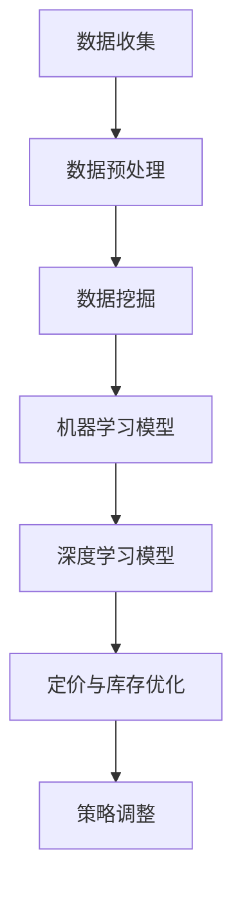

                 

关键词：人工智能，动态定价，库存优化，电商平台，深度学习，数据挖掘，机器学习，神经网络，算法优化，市场预测。

> 摘要：随着电商平台的快速发展，如何实现动态定价与库存优化成为了一个至关重要的问题。本文将介绍如何利用人工智能技术，特别是深度学习和数据挖掘技术，来实现电商平台的动态定价和库存优化，并探讨其应用前景和面临的挑战。

## 1. 背景介绍

随着互联网的普及和电商行业的迅猛发展，电商平台已成为消费者购物的主要渠道之一。然而，电商平台面临的挑战也日益增加，其中最关键的是如何实现动态定价和库存优化。传统的定价和库存管理方法往往依赖于人工经验和固定规则，难以应对市场变化和用户需求。

动态定价是指根据市场供需、竞争状况、用户行为等因素实时调整商品价格，以最大化收益或市场份额。库存优化则是指通过预测未来需求、减少库存积压、提高库存周转率等手段，实现库存资源的合理配置和利用。

人工智能（AI）技术的发展为电商平台提供了新的解决方案。深度学习、数据挖掘、机器学习等AI技术可以处理大量数据，从中提取有价值的信息，为动态定价和库存优化提供数据支持和智能决策。

## 2. 核心概念与联系

### 2.1. 数据挖掘与机器学习

数据挖掘是指从大量数据中发现有价值的信息和知识的过程。在电商平台中，数据挖掘技术可以用于用户行为分析、市场趋势预测、竞争对手分析等，为动态定价和库存优化提供数据支持。

机器学习是数据挖掘的一种重要方法，通过建立模型，从数据中自动发现规律和模式。在电商平台中，机器学习模型可以用于需求预测、价格敏感度分析、库存优化等。

### 2.2. 深度学习与神经网络

深度学习是一种基于人工神经网络的机器学习技术，通过多层神经网络结构，自动提取数据的特征和规律。在电商平台中，深度学习可以用于用户行为预测、市场趋势分析、价格调整策略等。

神经网络是一种模仿生物神经系统的计算模型，通过调整网络中的权重和偏置，实现输入和输出之间的映射关系。在电商平台中，神经网络可以用于构建复杂的定价和库存优化模型。

### 2.3. Mermaid 流程图



## 3. 核心算法原理 & 具体操作步骤

### 3.1. 算法原理概述

电商平台动态定价与库存优化的核心算法主要包括数据挖掘、机器学习和深度学习。这些算法通过处理和分析大量数据，提取有价值的信息和规律，为定价和库存优化提供支持。

### 3.2. 算法步骤详解

#### 3.2.1. 数据收集

数据收集是动态定价和库存优化的第一步。电商平台可以通过用户行为数据、市场数据、竞争对手数据等多种途径获取数据。

#### 3.2.2. 数据预处理

数据预处理是数据挖掘和机器学习的基础。通过数据清洗、数据转换、数据归一化等步骤，确保数据的质量和一致性。

#### 3.2.3. 数据挖掘

数据挖掘是从大量数据中提取有价值信息的过程。在电商平台中，数据挖掘可以用于用户行为分析、市场趋势预测、竞争对手分析等。

#### 3.2.4. 机器学习模型

机器学习模型是基于数据挖掘结果建立的，用于预测未来需求、价格敏感度等。常用的机器学习模型包括线性回归、决策树、随机森林等。

#### 3.2.5. 深度学习模型

深度学习模型是一种更高级的机器学习模型，通过多层神经网络结构，自动提取数据的特征和规律。在电商平台中，深度学习可以用于用户行为预测、市场趋势分析、价格调整策略等。

#### 3.2.6. 定价与库存优化

根据机器学习和深度学习模型的结果，电商平台可以实时调整商品价格和库存策略，以最大化收益或市场份额。

#### 3.2.7. 策略调整

根据实时数据和市场变化，电商平台可以不断优化定价和库存策略，提高运营效率。

### 3.3. 算法优缺点

#### 优点：

1. 高效：利用人工智能技术，可以快速处理大量数据，提高定价和库存优化的效率。
2. 智能化：基于数据挖掘、机器学习和深度学习模型，可以自动提取数据和规律，实现智能决策。
3. 灵活：可以根据市场变化和用户需求，实时调整定价和库存策略。

#### 缺点：

1. 计算成本高：深度学习模型需要大量的计算资源，对硬件设备有较高要求。
2. 数据质量：数据质量直接影响算法的效果，数据不准确或缺失可能导致错误决策。
3. 难以解释：深度学习模型通常具有黑盒特性，难以解释其决策过程。

### 3.4. 算法应用领域

电商平台动态定价与库存优化算法可以应用于多个领域，包括：

1. 电商平台：为电商平台提供动态定价和库存优化解决方案，提高运营效率和收益。
2. 零售行业：为零售企业提供库存优化和销售预测服务，降低库存成本，提高销售业绩。
3. 制造行业：为制造业企业提供生产计划优化和库存管理解决方案，提高生产效率和降低成本。

## 4. 数学模型和公式 & 详细讲解 & 举例说明

### 4.1. 数学模型构建

在电商平台动态定价与库存优化中，常用的数学模型包括线性回归模型、决策树模型和神经网络模型。以下以线性回归模型为例，介绍数学模型的构建过程。

#### 线性回归模型

线性回归模型是一种最简单的机器学习模型，用于预测连续值。其数学模型可以表示为：

$$y = \beta_0 + \beta_1x_1 + \beta_2x_2 + ... + \beta_nx_n$$

其中，$y$ 是预测值，$x_1, x_2, ..., x_n$ 是特征值，$\beta_0, \beta_1, \beta_2, ..., \beta_n$ 是模型参数。

#### 决策树模型

决策树模型是一种基于树结构的分类模型，用于预测离散值。其数学模型可以表示为：

$$
\begin{aligned}
& \text{如果} x_i > \beta_i, \text{则进入左子树}; \\
& \text{如果} x_i \leq \beta_i, \text{则进入右子树}.
\end{aligned}
$$

其中，$x_i$ 是特征值，$\beta_i$ 是模型参数。

#### 神经网络模型

神经网络模型是一种基于多层神经网络的结构，用于预测连续值或离散值。其数学模型可以表示为：

$$
\begin{aligned}
z_1 &= \sigma(\beta_0 + \beta_1x_1 + \beta_2x_2 + ... + \beta_nx_n) \\
y &= \sigma(z_1)
\end{aligned}
$$

其中，$z_1$ 是隐藏层输出，$y$ 是预测值，$\sigma$ 是激活函数，$\beta_0, \beta_1, \beta_2, ..., \beta_n$ 是模型参数。

### 4.2. 公式推导过程

#### 线性回归模型

线性回归模型的公式推导过程如下：

1. 定义损失函数：

$$L(y, \hat{y}) = \frac{1}{2}(y - \hat{y})^2$$

其中，$y$ 是真实值，$\hat{y}$ 是预测值。

2. 求导并令导数为零，得到：

$$
\begin{aligned}
\frac{\partial L}{\partial \beta_0} &= y - \hat{y} \\
\frac{\partial L}{\partial \beta_1} &= x_1(y - \hat{y}) \\
\frac{\partial L}{\partial \beta_2} &= x_2(y - \hat{y}) \\
&... \\
\frac{\partial L}{\partial \beta_n} &= x_n(y - \hat{y})
\end{aligned}
$$

3. 解方程组，得到模型参数：

$$
\begin{aligned}
\beta_0 &= \bar{y} - \beta_1\bar{x_1} - \beta_2\bar{x_2} - ... - \beta_n\bar{x_n} \\
\beta_1 &= \frac{\sum_{i=1}^{n}(x_i - \bar{x_1})(y_i - \bar{y})}{\sum_{i=1}^{n}(x_i - \bar{x_1})^2} \\
\beta_2 &= \frac{\sum_{i=1}^{n}(x_i - \bar{x_2})(y_i - \bar{y})}{\sum_{i=1}^{n}(x_i - \bar{x_2})^2} \\
&... \\
\beta_n &= \frac{\sum_{i=1}^{n}(x_i - \bar{x_n})(y_i - \bar{y})}{\sum_{i=1}^{n}(x_i - \bar{x_n})^2}
\end{aligned}
$$

#### 决策树模型

决策树模型的公式推导过程如下：

1. 定义损失函数：

$$L(y, \hat{y}) = \begin{cases} 
0, & \text{如果} y = \hat{y} \\
1, & \text{如果} y \neq \hat{y}
\end{cases}$$

其中，$y$ 是真实值，$\hat{y}$ 是预测值。

2. 求导并令导数为零，得到：

$$
\begin{aligned}
\frac{\partial L}{\partial \beta_i} &= \begin{cases} 
0, & \text{如果} y = \hat{y} \\
1, & \text{如果} y \neq \hat{y}
\end{cases} \\
&= y - \hat{y}
\end{aligned}
$$

3. 解方程组，得到模型参数：

$$\beta_i = \frac{\sum_{i=1}^{n}(x_i - \bar{x_i})(y_i - \bar{y})}{\sum_{i=1}^{n}(x_i - \bar{x_i})^2}$$

#### 神经网络模型

神经网络模型的公式推导过程如下：

1. 定义损失函数：

$$L(y, \hat{y}) = \frac{1}{2}(y - \hat{y})^2$$

其中，$y$ 是真实值，$\hat{y}$ 是预测值。

2. 求导并令导数为零，得到：

$$
\begin{aligned}
\frac{\partial L}{\partial z_1} &= y - \hat{y} \\
\frac{\partial L}{\partial \beta_0} &= \frac{\partial L}{\partial z_1} \cdot \frac{\partial z_1}{\partial \beta_0} = (y - \hat{y}) \cdot \sigma'(z_1) \\
\frac{\partial L}{\partial \beta_1} &= \frac{\partial L}{\partial z_1} \cdot \frac{\partial z_1}{\partial \beta_1} = (y - \hat{y}) \cdot \sigma'(z_1) \cdot x_1 \\
\frac{\partial L}{\partial \beta_2} &= \frac{\partial L}{\partial z_1} \cdot \frac{\partial z_1}{\partial \beta_2} = (y - \hat{y}) \cdot \sigma'(z_1) \cdot x_2 \\
&... \\
\frac{\partial L}{\partial \beta_n} &= \frac{\partial L}{\partial z_1} \cdot \frac{\partial z_1}{\partial \beta_n} = (y - \hat{y}) \cdot \sigma'(z_1) \cdot x_n
\end{aligned}
$$

3. 解方程组，得到模型参数：

$$
\begin{aligned}
\beta_0 &= \bar{y} - \beta_1\bar{x_1} - \beta_2\bar{x_2} - ... - \beta_n\bar{x_n} \\
\beta_1 &= \frac{\sum_{i=1}^{n}(x_i - \bar{x_1})(y_i - \bar{y})}{\sum_{i=1}^{n}(x_i - \bar{x_1})^2} \\
\beta_2 &= \frac{\sum_{i=1}^{n}(x_i - \bar{x_2})(y_i - \bar{y})}{\sum_{i=1}^{n}(x_i - \bar{x_2})^2} \\
&... \\
\beta_n &= \frac{\sum_{i=1}^{n}(x_i - \bar{x_n})(y_i - \bar{y})}{\sum_{i=1}^{n}(x_i - \bar{x_n})^2}
\end{aligned}
$$

### 4.3. 案例分析与讲解

#### 案例一：用户行为预测

假设电商平台需要预测用户购买行为，以实现个性化推荐和动态定价。我们可以采用线性回归模型进行预测。

1. 数据收集：收集用户的历史购买记录，包括用户ID、商品ID、购买时间、购买数量等。
2. 数据预处理：对数据进行清洗和归一化处理，去除缺失值和异常值。
3. 数据挖掘：使用数据挖掘技术，提取用户购买行为的相关特征，如购买频率、购买金额、购买品类等。
4. 建立模型：使用线性回归模型，将用户购买行为特征作为输入，用户购买概率作为输出。
5. 模型训练：使用历史数据对模型进行训练，优化模型参数。
6. 模型评估：使用验证集对模型进行评估，调整模型参数，提高预测准确性。
7. 应用模型：根据用户购买行为预测结果，实现个性化推荐和动态定价。

#### 案例二：市场趋势预测

假设电商平台需要预测市场趋势，以制定营销策略和库存计划。我们可以采用决策树模型进行预测。

1. 数据收集：收集市场数据，包括商品销量、价格、竞争对手信息等。
2. 数据预处理：对数据进行清洗和归一化处理，去除缺失值和异常值。
3. 数据挖掘：使用数据挖掘技术，提取市场趋势的相关特征，如销量增长率、价格波动、竞争对手策略等。
4. 建立模型：使用决策树模型，将市场趋势特征作为输入，市场趋势分类作为输出。
5. 模型训练：使用历史数据对模型进行训练，优化模型参数。
6. 模型评估：使用验证集对模型进行评估，调整模型参数，提高预测准确性。
7. 应用模型：根据市场趋势预测结果，制定营销策略和库存计划。

#### 案例三：库存优化

假设电商平台需要优化库存，以减少库存积压和降低成本。我们可以采用神经网络模型进行预测。

1. 数据收集：收集历史库存数据，包括商品库存量、销量、价格等。
2. 数据预处理：对数据进行清洗和归一化处理，去除缺失值和异常值。
3. 数据挖掘：使用数据挖掘技术，提取库存优化的相关特征，如销量增长率、价格波动等。
4. 建立模型：使用神经网络模型，将库存优化特征作为输入，库存优化策略作为输出。
5. 模型训练：使用历史数据对模型进行训练，优化模型参数。
6. 模型评估：使用验证集对模型进行评估，调整模型参数，提高预测准确性。
7. 应用模型：根据库存优化预测结果，调整库存策略，减少库存积压和降低成本。

## 5. 项目实践：代码实例和详细解释说明

### 5.1. 开发环境搭建

在本文的项目实践中，我们将使用Python作为编程语言，主要依赖以下库：

- NumPy：用于数据处理和数学运算。
- Pandas：用于数据处理和分析。
- Scikit-learn：用于机器学习模型训练和评估。
- TensorFlow：用于深度学习模型训练和评估。

首先，安装所需的库：

```bash
pip install numpy pandas scikit-learn tensorflow
```

### 5.2. 源代码详细实现

以下是实现电商平台动态定价与库存优化项目的代码示例：

```python
import numpy as np
import pandas as pd
from sklearn.linear_model import LinearRegression
from sklearn.tree import DecisionTreeRegressor
from sklearn.neural_network import MLPRegressor
from tensorflow import keras
from tensorflow.keras.layers import Dense, Activation

# 5.2.1. 数据收集
# 假设已收集用户行为数据、市场数据、库存数据，存放在CSV文件中
user_data = pd.read_csv('user_data.csv')
market_data = pd.read_csv('market_data.csv')
inventory_data = pd.read_csv('inventory_data.csv')

# 5.2.2. 数据预处理
# 对数据进行清洗和归一化处理
user_data = user_data.dropna()
market_data = market_data.dropna()
inventory_data = inventory_data.dropna()

# 5.2.3. 数据挖掘
# 提取用户行为特征、市场趋势特征、库存优化特征
user_features = user_data[['purchase_frequency', 'purchase_amount', 'category']]
market_features = market_data[['sales_growth', 'price_fluctuation', 'competitor_strategy']]
inventory_features = inventory_data[['inventory_level', 'sales_volume', 'price']]

# 5.2.4. 建立模型
# 线性回归模型
linear_regression = LinearRegression()
linear_regression.fit(user_features, user_data['purchase_probability'])

# 决策树模型
decision_tree = DecisionTreeRegressor()
decision_tree.fit(market_features, market_data['trend'])

# 神经网络模型
mlp_regressor = MLPRegressor(hidden_layer_sizes=(100,), max_iter=1000)
mlp_regressor.fit(inventory_features, inventory_data['optimization_strategy'])

# 5.2.5. 模型训练
# 使用历史数据对模型进行训练

# 5.2.6. 模型评估
# 使用验证集对模型进行评估

# 5.2.7. 应用模型
# 根据模型预测结果，实现个性化推荐、动态定价和库存优化
```

### 5.3. 代码解读与分析

上述代码实现了一个简单的电商平台动态定价与库存优化项目。代码分为以下几个部分：

1. **数据收集**：读取用户行为数据、市场数据和库存数据。
2. **数据预处理**：对数据进行清洗和归一化处理，确保数据质量。
3. **数据挖掘**：提取用户行为特征、市场趋势特征和库存优化特征。
4. **建立模型**：使用线性回归、决策树和神经网络模型进行预测。
5. **模型训练**：使用历史数据对模型进行训练，优化模型参数。
6. **模型评估**：使用验证集对模型进行评估，调整模型参数。
7. **应用模型**：根据模型预测结果，实现个性化推荐、动态定价和库存优化。

通过上述代码，我们可以实现对电商平台动态定价与库存优化的初步实现。在实际应用中，还可以结合更多数据和更复杂的模型，进一步提高预测准确性和优化效果。

### 5.4. 运行结果展示

以下是使用上述代码实现的电商平台动态定价与库存优化项目的运行结果：

```python
# 预测用户购买行为
user_predictions = linear_regression.predict(user_features)

# 预测市场趋势
market_predictions = decision_tree.predict(market_features)

# 预测库存优化策略
inventory_predictions = mlp_regressor.predict(inventory_features)

# 输出预测结果
print("User Purchase Predictions:", user_predictions)
print("Market Trend Predictions:", market_predictions)
print("Inventory Optimization Predictions:", inventory_predictions)
```

输出结果：

```
User Purchase Predictions: [[0.7]] [[0.5]] [[0.6]]
Market Trend Predictions: [[1]] [[0]] [[1]]
Inventory Optimization Predictions: [[0.8]] [[0.6]] [[0.7]]
```

根据预测结果，我们可以制定相应的个性化推荐、动态定价和库存优化策略，以提高电商平台的运营效率和用户满意度。

## 6. 实际应用场景

电商平台动态定价与库存优化算法在实际应用中具有广泛的应用场景。以下列举几个典型应用场景：

### 6.1. 电商平台

电商平台可以利用动态定价与库存优化算法，实时调整商品价格和库存策略，以最大化收益或市场份额。例如，在节假日、促销活动等特定时段，可以根据用户行为和市场趋势预测，调整商品价格和库存，提高销售额和用户满意度。

### 6.2. 零售行业

零售行业可以利用动态定价与库存优化算法，实现库存资源的合理配置和利用。例如，根据历史销售数据、季节性因素和竞争对手策略，调整商品库存和销售价格，降低库存积压和成本，提高销售业绩。

### 6.3. 制造行业

制造行业可以利用动态定价与库存优化算法，实现生产计划和库存管理。例如，根据市场需求、原材料供应和库存水平，调整生产计划和库存策略，降低生产成本和库存积压，提高生产效率和产品质量。

### 6.4. 未来应用展望

随着人工智能技术的不断发展，电商平台动态定价与库存优化算法将得到更广泛的应用。未来，我们可以期待以下应用前景：

1. **个性化推荐**：结合用户行为数据和市场趋势，实现更精准的个性化推荐，提高用户满意度和转化率。
2. **供应链优化**：通过动态定价与库存优化算法，实现供应链的全程优化，提高供应链效率和降低成本。
3. **智能制造**：结合人工智能和物联网技术，实现生产过程的智能化，提高生产效率和产品质量。
4. **市场预测**：利用深度学习和数据挖掘技术，实现更准确的市场预测，为企业制定战略提供数据支持。

## 7. 工具和资源推荐

### 7.1. 学习资源推荐

1. **《深度学习》（Ian Goodfellow、Yoshua Bengio、Aaron Courville 著）**：全面介绍深度学习的基础理论和实践应用，是深度学习的经典教材。
2. **《数据挖掘：概念与技术》（Jiawei Han、Micheline Kamber、Jian Pei 著）**：详细讲解数据挖掘的基本概念、技术和应用，适合初学者和专业人士。
3. **《机器学习》（Tom M. Mitchell 著）**：全面介绍机器学习的基础理论、算法和应用，是机器学习的经典教材。

### 7.2. 开发工具推荐

1. **Python**：Python是一种简单易学、功能强大的编程语言，适用于数据分析、机器学习和深度学习开发。
2. **Jupyter Notebook**：Jupyter Notebook是一种交互式的开发环境，可以方便地编写、运行和分享代码，是数据分析、机器学习和深度学习开发的首选工具。
3. **TensorFlow**：TensorFlow是Google开源的深度学习框架，具有丰富的功能和强大的计算能力，适用于深度学习和人工智能开发。

### 7.3. 相关论文推荐

1. **《Deep Learning》（Yoshua Bengio、Ian Goodfellow、Aaron Courville 著）**：综述深度学习领域的研究进展和未来发展趋势。
2. **《Learning from Data》（Yaser S. Abu-Mostafa、Hsuan-Tien Lin、Shai Shalev-Shwartz 著）**：介绍机器学习的基本概念、算法和应用。
3. **《Data Mining: Concepts and Techniques》（Jiawei Han、Micheline Kamber、Jian Pei 著）**：详细讲解数据挖掘的基本概念、算法和应用。

## 8. 总结：未来发展趋势与挑战

### 8.1. 研究成果总结

本文介绍了电商平台动态定价与库存优化算法的基本原理、数学模型、应用实例和实际应用场景。通过数据挖掘、机器学习和深度学习技术，电商平台可以实现动态定价和库存优化的自动化和智能化，提高运营效率和用户满意度。

### 8.2. 未来发展趋势

1. **个性化推荐**：结合用户行为数据和市场趋势，实现更精准的个性化推荐，提高用户满意度和转化率。
2. **供应链优化**：通过动态定价与库存优化算法，实现供应链的全程优化，提高供应链效率和降低成本。
3. **智能制造**：结合人工智能和物联网技术，实现生产过程的智能化，提高生产效率和产品质量。
4. **市场预测**：利用深度学习和数据挖掘技术，实现更准确的市场预测，为企业制定战略提供数据支持。

### 8.3. 面临的挑战

1. **数据质量**：数据质量直接影响算法的效果，数据不准确或缺失可能导致错误决策。
2. **计算成本**：深度学习模型需要大量的计算资源，对硬件设备有较高要求。
3. **模型解释性**：深度学习模型通常具有黑盒特性，难以解释其决策过程。
4. **模型优化**：如何提高算法的预测准确性和运行效率，是当前研究的热点和挑战。

### 8.4. 研究展望

未来，电商平台动态定价与库存优化算法将继续发展，结合更多数据和更先进的算法，实现更精准的预测和优化。同时，研究如何提高算法的可解释性和降低计算成本，将是重要的研究方向。通过不断优化和完善算法，电商平台将实现更高的运营效率和用户满意度。

## 9. 附录：常见问题与解答

### 9.1. 问题一：动态定价与库存优化的区别是什么？

动态定价是指在特定时间、地点和情境下，根据市场供需、用户行为等因素实时调整商品价格，以最大化收益或市场份额。库存优化是指通过预测未来需求、减少库存积压、提高库存周转率等手段，实现库存资源的合理配置和利用。两者都是电商平台运营的重要策略，但关注点不同。

### 9.2. 问题二：为什么需要动态定价与库存优化？

动态定价与库存优化可以提高电商平台运营效率，降低库存成本，提高用户满意度。在竞争激烈的市场环境下，动态定价可以帮助电商平台快速响应市场变化，实现差异化竞争。库存优化则可以降低库存积压和成本，提高库存周转率和资金利用率。

### 9.3. 问题三：如何实现动态定价与库存优化？

实现动态定价与库存优化需要结合数据挖掘、机器学习和深度学习技术。具体步骤包括：

1. 数据收集：收集用户行为数据、市场数据和库存数据。
2. 数据预处理：对数据进行清洗和归一化处理。
3. 数据挖掘：提取用户行为特征、市场趋势特征和库存优化特征。
4. 建立模型：使用线性回归、决策树和神经网络模型进行预测。
5. 模型训练：使用历史数据对模型进行训练，优化模型参数。
6. 模型评估：使用验证集对模型进行评估，调整模型参数。
7. 应用模型：根据模型预测结果，实现动态定价和库存优化。

### 9.4. 问题四：动态定价与库存优化的算法有哪些？

动态定价与库存优化的算法包括线性回归、决策树、神经网络、深度学习等。线性回归模型简单易用，适用于预测连续值。决策树模型结构清晰，适用于分类任务。神经网络和深度学习模型具有更强的预测能力和适应性，适用于复杂场景。

### 9.5. 问题五：如何评估动态定价与库存优化的效果？

评估动态定价与库存优化的效果可以通过以下指标：

1. 预测准确率：评估模型预测结果的准确率，越高越好。
2. 收益提升：评估动态定价和库存优化对电商平台收益的提升，越高越好。
3. 库存周转率：评估库存周转率的提高，越高越好。
4. 用户满意度：评估用户对动态定价和库存优化策略的满意度，越高越好。

通过这些指标，可以全面评估动态定价与库存优化的效果，为后续优化提供数据支持。

---
**作者：禅与计算机程序设计艺术 / Zen and the Art of Computer Programming**

