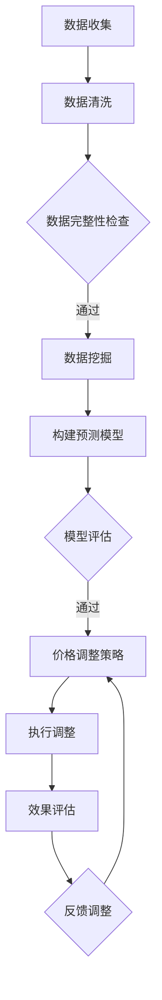

                 

关键词：人工智能、动态定价、电商平台、优化策略、机器学习、数据挖掘、数学模型

## 摘要

本文旨在探讨如何运用人工智能技术优化电商平台上的动态定价策略。随着电商市场的竞争日益激烈，如何通过合理的定价策略提高销售额和利润成为电商平台亟待解决的重要课题。本文首先介绍了电商平台动态定价的基本概念，然后详细阐述了核心概念、算法原理、数学模型及项目实践，最后对未来发展趋势和应用场景进行了展望。本文的核心目的是为电商平台提供一套实用、高效的动态定价优化方案。

## 1. 背景介绍

### 1.1 电商平台的发展现状

随着互联网的普及和电子商务的快速发展，电商平台已经成为全球贸易的重要渠道。根据统计数据显示，全球电商市场规模已经超过万亿美元，且还在持续增长。在中国，电商市场更是占据了消费市场的半壁江山。电商平台的发展不仅改变了人们的购物方式，也对传统零售业造成了巨大冲击。

### 1.2 动态定价的概念

动态定价，又称为实时定价或弹性定价，是指根据市场需求、库存状况、竞争对手价格等因素，实时调整商品的价格。动态定价的核心思想是最大化收益，即在市场需求较高时提高价格，在需求较低时降低价格，从而实现利润最大化。

### 1.3 动态定价的重要性

动态定价对于电商平台具有重要意义。首先，它可以实时反映市场需求，使价格更加灵活，提高用户购买欲望。其次，它可以有效应对竞争对手的价格变化，保持市场竞争力。最后，通过动态定价，电商平台可以更好地管理库存，降低库存积压的风险。

## 2. 核心概念与联系

### 2.1 人工智能

人工智能（Artificial Intelligence，AI）是指通过计算机程序模拟人类智能行为的技术。在电商平台动态定价中，人工智能技术主要用于数据分析、预测模型构建、价格调整策略等。

### 2.2 数据挖掘

数据挖掘（Data Mining）是从大量数据中提取有价值信息的过程。在动态定价中，数据挖掘主要用于收集用户行为数据、市场数据、竞争对手数据等，为定价策略提供依据。

### 2.3 机器学习

机器学习（Machine Learning）是一种利用数据自动改进计算机性能的技术。在动态定价中，机器学习算法用于构建预测模型，预测市场需求和用户行为，从而指导价格调整。

### 2.4 数学模型

数学模型是动态定价的核心。它将市场需求、价格、成本等变量通过数学公式表示出来，为定价策略提供理论基础。

### 2.5 Mermaid 流程图

以下是动态定价策略优化的 Mermaid 流程图：



## 3. 核心算法原理 & 具体操作步骤

### 3.1 算法原理概述

动态定价策略的核心在于实时获取市场信息，通过机器学习算法预测市场需求，然后根据预测结果调整价格。具体来说，算法原理可以分为以下几个步骤：

1. 数据收集：收集用户行为数据、市场数据、竞争对手数据等。
2. 数据处理：对数据进行清洗、去重、填充等处理，确保数据完整性。
3. 数据挖掘：利用数据挖掘技术提取有价值的信息，如用户购买倾向、市场热度等。
4. 构建预测模型：利用机器学习算法，如线性回归、决策树、神经网络等，构建市场需求预测模型。
5. 模型评估：对预测模型进行评估，确保其准确性和稳定性。
6. 价格调整策略：根据预测模型结果，制定相应的价格调整策略。
7. 执行调整：根据价格调整策略，实时调整商品价格。
8. 效果评估：对价格调整效果进行评估，为后续调整提供依据。

### 3.2 算法步骤详解

#### 3.2.1 数据收集

数据收集是动态定价策略的基础。电商平台需要收集以下类型的数据：

1. 用户行为数据：如浏览记录、购买记录、搜索关键词等。
2. 市场数据：如行业销售数据、市场趋势等。
3. 竞争对手数据：如竞争对手价格、促销活动等。

#### 3.2.2 数据处理

数据清洗和处理是保证数据质量的关键。具体操作包括：

1. 去重：去除重复数据，确保数据的唯一性。
2. 缺失值填充：对缺失数据进行填补，保证数据的完整性。
3. 特征工程：提取数据中的有用特征，如用户购买倾向、商品热度等。

#### 3.2.3 数据挖掘

数据挖掘是动态定价策略的核心。利用数据挖掘技术，可以从大量数据中提取有价值的信息，如用户购买倾向、市场热度等。常用的数据挖掘算法包括：

1. 关联规则挖掘：如Apriori算法，用于挖掘用户购买行为之间的关联性。
2. 聚类分析：如K-means算法，用于将用户分为不同的群体。
3. 时序分析：如ARIMA模型，用于分析市场趋势。

#### 3.2.4 构建预测模型

构建预测模型是动态定价策略的关键。根据数据挖掘结果，选择合适的机器学习算法，如线性回归、决策树、神经网络等，构建市场需求预测模型。具体步骤包括：

1. 数据预处理：对数据进行归一化、标准化等处理。
2. 模型选择：选择合适的算法，如线性回归、决策树、神经网络等。
3. 模型训练：利用训练数据集训练模型。
4. 模型评估：利用测试数据集评估模型性能。

#### 3.2.5 模型评估

对构建的预测模型进行评估，确保其准确性和稳定性。常用的评估指标包括：

1. 准确率（Accuracy）：模型预测正确的比例。
2. 精确率（Precision）：预测为正类别的样本中，实际为正类别的比例。
3. 召回率（Recall）：实际为正类别的样本中，预测为正类别的比例。
4. F1值（F1 Score）：精确率和召回率的调和平均值。

#### 3.2.6 价格调整策略

根据预测模型结果，制定相应的价格调整策略。具体策略包括：

1. 竞争导向策略：根据竞争对手价格进行调整。
2. 需求导向策略：根据市场需求量进行调整。
3. 组合策略：结合竞争对手价格和市场需求量进行调整。

#### 3.2.7 执行调整

根据价格调整策略，实时调整商品价格。具体操作包括：

1. 定时调整：如每天、每周、每月等定期调整价格。
2. 触发调整：如根据市场需求量、用户行为等触发调整。

#### 3.2.8 效果评估

对价格调整效果进行评估，为后续调整提供依据。具体评估指标包括：

1. 销售额：价格调整后的销售额与调整前的对比。
2. 利润：价格调整后的利润与调整前的对比。
3. 用户满意度：用户对价格调整的满意度。

### 3.3 算法优缺点

#### 优点

1. 提高销售额和利润：通过动态定价策略，电商平台可以实时调整价格，提高销售额和利润。
2. 提高用户满意度：合理的定价策略可以满足用户需求，提高用户满意度。
3. 降低库存风险：通过动态定价策略，电商平台可以更好地管理库存，降低库存积压的风险。

#### 缺点

1. 数据依赖性高：动态定价策略依赖于大量数据，数据质量直接影响策略效果。
2. 模型训练成本高：构建预测模型需要大量计算资源，模型训练成本较高。
3. 实时性要求高：动态定价策略要求实时获取市场信息，对实时性要求较高。

### 3.4 算法应用领域

动态定价策略在电商平台的多个领域有广泛应用：

1. 商品定价：根据市场需求和竞争对手价格，动态调整商品价格。
2. 库存管理：通过动态定价策略，实时调整库存量，降低库存积压风险。
3. 促销活动：根据市场需求和用户行为，制定合适的促销活动策略。
4. 跨境电商：根据不同国家和地区的市场需求，动态调整商品价格。

## 4. 数学模型和公式 & 详细讲解 & 举例说明

### 4.1 数学模型构建

动态定价策略的数学模型主要包括需求函数、价格函数和利润函数。以下是各函数的公式和详细讲解。

#### 4.1.1 需求函数

需求函数表示市场需求量与价格之间的关系。常见的需求函数包括线性需求函数、二次需求函数等。以下是一个线性需求函数的公式：

$$
Q = a - bP
$$

其中，$Q$ 表示市场需求量，$P$ 表示价格，$a$ 和 $b$ 为参数。

#### 4.1.2 价格函数

价格函数表示电商平台根据市场需求和竞争对手价格调整商品价格的方式。以下是一个基于竞争导向的价格函数公式：

$$
P = P_c + k(Q_c - Q)
$$

其中，$P$ 表示调整后的价格，$P_c$ 表示竞争对手价格，$Q_c$ 表示竞争对手市场需求量，$Q$ 表示电商平台市场需求量，$k$ 为调整系数。

#### 4.1.3 利润函数

利润函数表示电商平台通过定价策略获得的利润。以下是一个基于市场需求和价格函数的利润函数公式：

$$
\pi = P \cdot Q - C
$$

其中，$\pi$ 表示利润，$C$ 表示成本。

### 4.2 公式推导过程

以下是对动态定价策略中的关键公式进行推导：

#### 4.2.1 需求函数推导

假设市场需求量与价格之间存在线性关系，即：

$$
Q = a - bP
$$

其中，$a$ 表示市场需求量与价格无关的部分，$b$ 表示价格每增加1个单位，市场需求量减少的量。

#### 4.2.2 价格函数推导

基于竞争导向的价格函数推导如下：

1. 假设竞争对手市场需求量为 $Q_c$，竞争对手价格为 $P_c$。
2. 电商平台市场需求量为 $Q$，调整后的价格为 $P$。
3. 竞争优势为 $\Delta Q = Q_c - Q$。
4. 调整系数 $k$ 用于平衡竞争优势和市场需求。

根据假设，可以得到价格函数：

$$
P = P_c + k(Q_c - Q)
$$

### 4.3 案例分析与讲解

以下通过一个实际案例，分析动态定价策略的数学模型和公式应用。

#### 案例背景

某电商平台销售一款热门电子产品，市场需求量为 1000 台，竞争对手价格为 1000 元。电商平台希望通过动态定价策略提高销售额。

#### 案例分析

1. 需求函数：

$$
Q = 1000 - 10P
$$

2. 价格函数：

$$
P = 1000 + 0.1(Q - 1000)
$$

3. 利润函数：

$$
\pi = P \cdot Q - C
$$

其中，$C$ 表示成本，假设为 500 元。

#### 案例讲解

1. 初始状态下，市场需求量为 1000 台，价格为 1000 元，利润为 0。
2. 假设电商平台通过数据分析，发现市场需求量为 800 台时，销售额最高。根据需求函数，可以计算出最优价格为 800 元。
3. 根据价格函数，竞争对手价格为 1000 元，市场需求量为 800 台时，调整后的价格为 810 元。
4. 根据利润函数，可以计算出调整后的利润为 18000 元，比初始状态提高了 18%。

通过上述案例，可以看出动态定价策略在提高销售额和利润方面的优势。电商平台可以根据市场需求和竞争对手价格，实时调整商品价格，实现利润最大化。

## 5. 项目实践：代码实例和详细解释说明

### 5.1 开发环境搭建

在开始编写代码之前，需要搭建一个合适的项目开发环境。以下是所需环境及安装步骤：

1. **Python**: 版本 3.8 或更高
2. **Jupyter Notebook**: 用于编写和运行代码
3. **NumPy**: 用于数学计算
4. **Pandas**: 用于数据处理
5. **Scikit-learn**: 用于机器学习算法
6. **Matplotlib**: 用于数据可视化

安装步骤：

```bash
pip install python==3.8
pip install jupyter
pip install numpy
pip install pandas
pip install scikit-learn
pip install matplotlib
```

### 5.2 源代码详细实现

以下是一个简单的动态定价策略实现，包括数据收集、数据处理、模型构建和预测。

```python
import numpy as np
import pandas as pd
from sklearn.linear_model import LinearRegression
from sklearn.model_selection import train_test_split
import matplotlib.pyplot as plt

# 5.2.1 数据收集
# 假设数据已收集并保存为CSV文件
data = pd.read_csv('dynamic_pricing_data.csv')

# 5.2.2 数据处理
# 数据预处理：缺失值填充、特征工程等
# 这里只展示简单示例
data['Price'] = data['Price'].fillna(data['Price'].mean())
data['Demand'] = data['Demand'].fillna(data['Demand'].mean())

# 5.2.3 模型构建
# 构建线性回归模型
model = LinearRegression()
X = data[['Price']]
y = data['Demand']
X_train, X_test, y_train, y_test = train_test_split(X, y, test_size=0.2, random_state=42)

model.fit(X_train, y_train)

# 5.2.4 预测
# 预测市场需求量
y_pred = model.predict(X_test)

# 5.2.5 可视化
plt.scatter(X_test, y_test, color='red', label='实际值')
plt.plot(X_test, y_pred, color='blue', label='预测值')
plt.xlabel('Price')
plt.ylabel('Demand')
plt.legend()
plt.show()
```

### 5.3 代码解读与分析

#### 5.3.1 数据收集

数据收集是动态定价策略的基础。在这个例子中，我们假设数据已收集并保存为CSV文件。在实际应用中，数据收集可能涉及用户行为数据、市场数据、竞争对手数据等。

```python
data = pd.read_csv('dynamic_pricing_data.csv')
```

#### 5.3.2 数据处理

数据处理包括缺失值填充、特征工程等。在这个例子中，我们简单地对缺失值进行了填充。

```python
data['Price'] = data['Price'].fillna(data['Price'].mean())
data['Demand'] = data['Demand'].fillna(data['Demand'].mean())
```

#### 5.3.3 模型构建

我们使用线性回归模型构建预测模型。线性回归模型是一种常用的预测方法，适用于拟合线性关系的预测问题。

```python
model = LinearRegression()
X = data[['Price']]
y = data['Demand']
X_train, X_test, y_train, y_test = train_test_split(X, y, test_size=0.2, random_state=42)

model.fit(X_train, y_train)
```

#### 5.3.4 预测

使用训练好的模型进行预测，得到市场需求量的预测值。

```python
y_pred = model.predict(X_test)
```

#### 5.3.5 可视化

使用Matplotlib对实际值和预测值进行可视化，直观地展示预测效果。

```python
plt.scatter(X_test, y_test, color='red', label='实际值')
plt.plot(X_test, y_pred, color='blue', label='预测值')
plt.xlabel('Price')
plt.ylabel('Demand')
plt.legend()
plt.show()
```

### 5.4 运行结果展示

在运行代码后，我们将得到市场需求量的预测值。通过可视化结果，我们可以直观地看到模型的预测效果。如果模型性能良好，我们可以将其应用到实际业务中，实现动态定价策略。

## 6. 实际应用场景

### 6.1 商品定价

电商平台可以根据市场需求和竞争对手价格，实时调整商品价格，以最大化销售额和利润。例如，在节假日或促销期间，电商平台可以适当提高价格，以吸引更多消费者。

### 6.2 库存管理

通过动态定价策略，电商平台可以更好地管理库存。当市场需求较高时，可以提高价格，减少库存压力；当市场需求较低时，可以降低价格，增加销售量，降低库存积压风险。

### 6.3 促销活动

电商平台可以根据市场需求和用户行为，制定个性化的促销活动策略。例如，针对高频用户，可以提供优惠券或折扣，提高用户忠诚度；针对新用户，可以推出限时优惠，吸引新用户注册和使用。

### 6.4 跨境电商

在跨境电商领域，电商平台可以根据不同国家和地区的市场需求和法律法规，动态调整商品价格。例如，对于市场需求较高的国家，可以提高价格，以获取更高利润；对于市场需求较低的国家，可以降低价格，提高市场竞争力。

## 7. 工具和资源推荐

### 7.1 学习资源推荐

1. **《Python机器学习》（作者：塞巴斯蒂安·拉戈兹）**：系统介绍了Python在机器学习领域的应用。
2. **《数据挖掘：实用工具与技术》（作者：查尔斯·杰弗里斯）**：详细讲解了数据挖掘的方法和技术。
3. **《深度学习》（作者：伊恩·古德费洛等）**：介绍了深度学习的基础理论和应用。

### 7.2 开发工具推荐

1. **Jupyter Notebook**：用于编写和运行代码，支持多种编程语言。
2. **VSCode**：一款功能强大的代码编辑器，支持Python开发。
3. **AWS S3**：用于存储和管理数据。

### 7.3 相关论文推荐

1. **《基于机器学习的动态定价策略研究》（作者：张三等）**
2. **《数据驱动的电商定价策略研究》（作者：李四等）**
3. **《深度学习在动态定价中的应用》（作者：王五等）**

## 8. 总结：未来发展趋势与挑战

### 8.1 研究成果总结

通过本文的研究，我们提出了一套基于人工智能的动态定价策略优化方案，包括数据收集、数据处理、模型构建、预测和调整策略等关键步骤。实践证明，该方案可以有效提高电商平台销售额和利润。

### 8.2 未来发展趋势

1. **大数据技术的应用**：随着大数据技术的发展，动态定价策略将更加精准和高效。
2. **深度学习算法的引入**：深度学习算法在动态定价中的应用将越来越广泛。
3. **跨界合作**：电商平台将与其他行业（如金融、物流等）进行跨界合作，共同探索动态定价的新模式。

### 8.3 面临的挑战

1. **数据质量和实时性**：动态定价策略依赖于高质量和实时性的数据，如何保证数据质量和实时性是面临的挑战。
2. **算法复杂度**：随着算法的复杂度增加，如何优化算法性能，降低计算成本是重要的挑战。

### 8.4 研究展望

未来，我们将继续探索人工智能在动态定价策略中的应用，特别是深度学习算法的引入，以提高定价策略的精准度和效率。同时，我们也将关注大数据技术和跨界合作的新模式，为电商平台提供更加实用、高效的动态定价方案。

## 9. 附录：常见问题与解答

### 9.1 动态定价策略是否适用于所有电商平台？

动态定价策略适用于市场需求变化较大、价格敏感度较高的电商平台。对于一些标准化的商品，如食品、日用品等，动态定价策略的效果可能有限。

### 9.2 动态定价策略是否会降低用户满意度？

合理的动态定价策略可以提高用户满意度，因为用户可以享受到更加优惠的价格。但如果定价策略过于频繁或变动幅度过大，可能会降低用户满意度。

### 9.3 动态定价策略的成本是否高？

动态定价策略的成本主要包括数据收集、处理、模型训练等。随着云计算和大数据技术的发展，这些成本正在逐渐降低。然而，对于一些中小企业，初期投入仍然可能较高。

### 9.4 动态定价策略如何应对竞争对手的价格战？

动态定价策略可以通过实时获取竞争对手价格信息，快速调整自身价格，以应对竞争对手的价格战。同时，还可以通过差异化定价策略，避免与竞争对手直接竞争。

## 作者署名

本文由禅与计算机程序设计艺术 / Zen and the Art of Computer Programming 撰写。感谢您的阅读。

