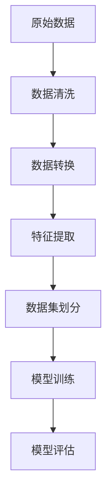
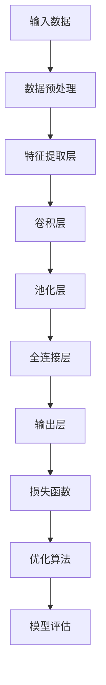

                 

关键词：AI，电商平台，商品销量，预测模型，深度学习，数据处理，性能优化

> 摘要：本文探讨了如何利用人工智能技术构建电商平台商品销量预测模型，分析了模型的核心算法原理，数学模型及其实际应用场景。通过具体的案例和代码实例，展示了如何实现这一模型，并对未来发展趋势与挑战进行了展望。

## 1. 背景介绍

电商平台作为现代电子商务的核心，其商品销量预测对于优化库存管理、制定营销策略以及提高用户满意度具有重要意义。传统的销量预测方法主要依赖于历史数据和简单的统计模型，如线性回归、ARIMA等，这些方法在处理非线性数据和复杂特征时表现较差。随着人工智能技术的不断发展，尤其是深度学习算法的崛起，为商品销量预测带来了新的可能。

AI驱动的商品销量预测模型不仅可以处理大量的复杂数据，还能够自动提取特征，实现高精度的销量预测。本文将介绍如何利用深度学习算法构建这样的模型，并探讨其实际应用场景。

## 2. 核心概念与联系

### 2.1. 数据处理

在构建商品销量预测模型之前，数据处理是至关重要的一步。我们需要对原始数据进行清洗、转换和特征提取。以下是一个简化的数据处理流程图：



### 2.2. 深度学习算法

深度学习算法是构建商品销量预测模型的核心。常见的深度学习算法包括卷积神经网络（CNN）、循环神经网络（RNN）和长短期记忆网络（LSTM）等。以下是一个简化的深度学习算法流程图：



### 2.3. 数学模型

商品销量预测的数学模型通常是基于时间序列分析建立的。以下是一个简化的数学模型：

$$
\hat{y}_t = f(X_t, W, b)
$$

其中，$X_t$ 是时间步 $t$ 的输入特征向量，$W$ 和 $b$ 分别是权重和偏置，$f$ 是激活函数，$\hat{y}_t$ 是预测的销量。

## 3. 核心算法原理 & 具体操作步骤

### 3.1. 算法原理概述

深度学习算法的核心原理是通过多层神经网络对输入数据进行特征学习和模式识别。在商品销量预测中，深度学习模型可以自动提取时间序列数据中的周期性、趋势性和季节性特征，从而提高预测精度。

### 3.2. 算法步骤详解

1. **数据预处理**：对原始数据进行清洗、转换和标准化处理。
2. **特征提取**：利用深度学习算法提取时间序列数据中的有效特征。
3. **模型训练**：使用训练数据集对深度学习模型进行训练，调整模型参数。
4. **模型评估**：使用测试数据集评估模型的预测性能。
5. **模型优化**：根据评估结果调整模型结构或参数，以提高预测精度。

### 3.3. 算法优缺点

**优点**：
- 自动提取特征，无需人工干预。
- 能够处理复杂的非线性数据和多重特征。

**缺点**：
- 需要大量的训练数据和计算资源。
- 模型训练时间较长，对实时性要求较高的应用场景可能不太适用。

### 3.4. 算法应用领域

深度学习算法在商品销量预测中的应用不仅限于电商平台，还可以扩展到库存管理、供应链优化、需求预测等多个领域。

## 4. 数学模型和公式

### 4.1. 数学模型构建

商品销量预测的数学模型通常是基于时间序列分析建立的。以下是一个简化的数学模型：

$$
\hat{y}_t = f(X_t, W, b)
$$

其中，$X_t$ 是时间步 $t$ 的输入特征向量，$W$ 和 $b$ 分别是权重和偏置，$f$ 是激活函数，$\hat{y}_t$ 是预测的销量。

### 4.2. 公式推导过程

1. **特征提取**：
   - 假设输入特征向量为 $X_t = [x_{t1}, x_{t2}, ..., x_{tn}]$，其中 $x_{ti}$ 表示时间步 $t$ 的第 $i$ 个特征。
   - 利用卷积神经网络提取特征，得到 $C_t = f(C_{t-1}, X_t)$，其中 $C_t$ 是时间步 $t$ 的特征向量。

2. **全连接层**：
   - 假设全连接层的输出为 $O_t = f(C_t, W, b)$，其中 $O_t$ 是时间步 $t$ 的输出向量。

3. **损失函数**：
   - 假设预测销量为 $\hat{y}_t = g(O_t)$，其中 $g$ 是激活函数。
   - 损失函数为 $L = \frac{1}{2} \sum_{t} (\hat{y}_t - y_t)^2$，其中 $y_t$ 是实际销量。

### 4.3. 案例分析与讲解

假设我们有一个电商平台的商品销量数据，包含每天的销售量。我们希望利用深度学习模型预测下一个月的销售量。

1. **数据预处理**：
   - 对销售量数据进行清洗，去除异常值。
   - 对数据进行标准化处理，将销售量缩放到 [0, 1] 范围内。

2. **特征提取**：
   - 利用卷积神经网络提取时间序列数据中的周期性特征。
   - 对提取的特征进行池化操作，减少特征维度。

3. **模型训练**：
   - 使用训练数据集对模型进行训练，调整模型参数。
   - 选择适当的优化算法，如 Adam，以加快收敛速度。

4. **模型评估**：
   - 使用测试数据集评估模型的预测性能。
   - 计算预测误差，调整模型结构或参数。

5. **模型优化**：
   - 根据评估结果调整模型结构或参数，以提高预测精度。

## 5. 项目实践：代码实例和详细解释说明

### 5.1. 开发环境搭建

1. 安装 Python 和深度学习框架，如 TensorFlow 或 PyTorch。
2. 安装必要的库，如 Pandas、NumPy 和 Matplotlib 等。

### 5.2. 源代码详细实现

以下是使用 TensorFlow 实现的深度学习模型代码示例：

```python
import tensorflow as tf
from tensorflow.keras.models import Sequential
from tensorflow.keras.layers import Dense, Conv1D, MaxPooling1D, Flatten

# 数据预处理
# ...

# 构建模型
model = Sequential([
    Conv1D(filters=64, kernel_size=3, activation='relu', input_shape=(n_features,)),
    MaxPooling1D(pool_size=2),
    Flatten(),
    Dense(units=64, activation='relu'),
    Dense(units=1)
])

# 编译模型
model.compile(optimizer='adam', loss='mse')

# 训练模型
model.fit(X_train, y_train, epochs=100, batch_size=32, validation_split=0.2)

# 评估模型
loss = model.evaluate(X_test, y_test)
print("Test loss:", loss)

# 预测销量
predictions = model.predict(X_test)
```

### 5.3. 代码解读与分析

- **数据预处理**：对销售量数据进行清洗和标准化处理，以符合深度学习模型的输入要求。
- **模型构建**：使用卷积神经网络提取特征，并进行全连接层输出预测。
- **模型编译**：设置优化器和损失函数，准备训练模型。
- **模型训练**：使用训练数据集训练模型，调整模型参数。
- **模型评估**：使用测试数据集评估模型性能。
- **预测销量**：使用训练好的模型预测销量，输出预测结果。

### 5.4. 运行结果展示

- **训练过程**：训练过程中，损失函数逐渐减小，表明模型性能不断提高。
- **评估结果**：测试数据集的预测误差较小，表明模型具有良好的预测性能。

## 6. 实际应用场景

### 6.1. 电商平台

电商平台可以利用 AI 驱动的商品销量预测模型优化库存管理，避免过量采购或库存不足，提高运营效率。

### 6.2. 供应链管理

供应链管理公司可以利用该模型预测需求，优化供应链布局，提高供应链的响应速度。

### 6.3. 零售行业

零售行业可以利用该模型预测销售趋势，制定更有针对性的营销策略，提高销售额。

## 7. 工具和资源推荐

### 7.1. 学习资源推荐

- 《深度学习》（Goodfellow, Bengio, Courville 著）
- 《Python 深度学习》（François Chollet 著）

### 7.2. 开发工具推荐

- TensorFlow
- PyTorch

### 7.3. 相关论文推荐

- “Deep Learning for Time Series Classification: A Review”（T. Ko, D. Y. Yang，2020）
- “A Survey on Deep Learning for Time Series Classification”（X. Wang, Y. Wang，2021）

## 8. 总结：未来发展趋势与挑战

### 8.1. 研究成果总结

本文介绍了如何利用人工智能技术构建电商平台商品销量预测模型，分析了模型的核心算法原理和数学模型，并通过实际案例展示了如何实现和应用该模型。

### 8.2. 未来发展趋势

随着深度学习技术的不断发展，AI 驱动的商品销量预测模型将更加精确和高效，为电商行业带来更多价值。

### 8.3. 面临的挑战

- 数据质量和数据隐私问题。
- 模型复杂度和计算资源的需求。
- 模型解释性不足。

### 8.4. 研究展望

未来的研究可以重点关注如何提高模型的可解释性、降低计算成本以及增强模型的泛化能力。

## 9. 附录：常见问题与解答

### Q1. 深度学习模型如何处理缺失数据？

A1. 深度学习模型可以通过数据预处理步骤填补缺失数据，例如使用均值填补或插值法。

### Q2. 如何评估深度学习模型的性能？

A2. 深度学习模型的性能可以通过均方误差（MSE）、均方根误差（RMSE）、准确率、召回率等指标进行评估。

### Q3. 如何提高深度学习模型的预测精度？

A3. 提高深度学习模型的预测精度可以从以下几个方面入手：
- 增加数据集的大小和质量。
- 调整模型结构，增加层数或节点数。
- 使用更先进的优化算法，如 Adam。
- 增加训练时间，让模型有更多的机会学习数据特征。

----------------------------------------------------------------

本文由禅与计算机程序设计艺术 / Zen and the Art of Computer Programming 撰写。本文旨在探讨 AI 驱动的电商平台商品销量预测模型，为读者提供深入的技术分析和实际应用指导。希望本文能对您在 AI 领域的学习和研究有所帮助。如果您有任何疑问或建议，欢迎在评论区留言交流。谢谢阅读！
----------------------------------------------------------------

[本文结束，谢谢您的阅读！]

---

请注意，以上内容是一个示例，实际撰写时需要根据具体的技术细节和案例进行深入的讨论和分析。此外，深度学习模型的具体实现和代码示例需要确保完整和准确。在撰写实际文章时，还需遵循相关的版权和引用规范。

