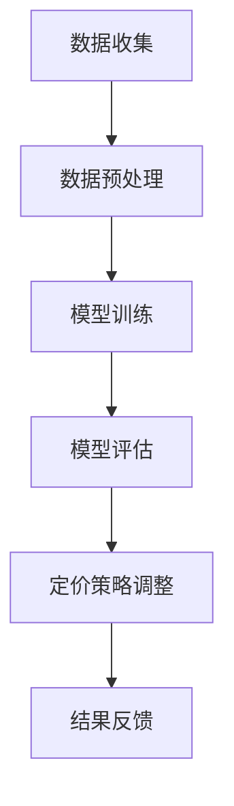

                 

 关键词：人工智能，电商平台，智能定价，定价敏感度，算法，数据分析，机器学习，模型

## 摘要

本文旨在探讨人工智能在电商平台定价中的应用，特别是在分析产品定价敏感度方面的潜力。通过介绍当前主流的定价算法、机器学习模型以及相关的数学公式，本文将深入探讨这些技术的原理、步骤和应用。文章将结合实际项目案例，展示如何利用AI技术进行电商平台智能定价敏感度分析，并提供未来应用展望和研究方向。

## 1. 背景介绍

### 1.1 电商平台的发展现状

随着互联网技术的迅猛发展，电商平台已经成为全球商家和消费者之间交易的主要渠道之一。电商平台通过提供便捷的购物体验和多样化的商品选择，极大地改变了传统的购物模式。据统计，全球电商市场规模已超过数万亿美元，并且这一数字仍在持续增长。

### 1.2 电商平台面临的定价挑战

电商平台在产品定价方面面临着诸多挑战。一方面，如何确保价格具有竞争力以吸引消费者；另一方面，如何通过合理定价实现利润最大化。传统的定价方法通常依赖于历史数据和经验，但这些方法往往无法充分考虑市场需求的变化和消费者行为的复杂性。

### 1.3 智能定价的需求

随着人工智能技术的发展，智能定价成为电商平台提升竞争力的关键手段之一。通过机器学习和数据分析，智能定价能够实时捕捉市场动态，分析消费者行为，从而实现更加精准和个性化的定价策略。本文将探讨如何利用AI技术实现电商平台智能定价敏感度分析，以应对市场变化和消费者需求。

## 2. 核心概念与联系

### 2.1 定价敏感度

定价敏感度是指消费者对价格变动的反应程度。在电商平台中，定价敏感度分析有助于了解不同消费者群体对价格变动的敏感度，从而制定更具针对性的定价策略。

### 2.2 机器学习模型

机器学习模型是智能定价的核心。通过训练模型，可以识别消费者行为模式、市场趋势和价格变化对销售量的影响，从而优化定价策略。

### 2.3 数据分析

数据分析是智能定价的基础。通过对大量历史数据的挖掘和分析，可以识别出影响定价的关键因素，为模型训练提供支持。


### 2.4 Mermaid 流程图

以下是一个简化的Mermaid流程图，展示智能定价敏感度分析的主要步骤：



## 3. 核心算法原理 & 具体操作步骤

### 3.1 算法原理概述

智能定价敏感度分析的核心算法包括线性回归、决策树、支持向量机和神经网络等。这些算法通过分析历史数据，预测价格变化对销售量的影响，从而为定价策略提供依据。

### 3.2 算法步骤详解

#### 3.2.1 数据收集

数据收集是智能定价的第一步，主要包括销售数据、消费者行为数据和市场数据。通过这些数据，可以全面了解产品在市场上的表现。

#### 3.2.2 数据预处理

数据预处理包括数据清洗、特征提取和标准化。数据清洗旨在去除无效和错误的数据，特征提取则是从原始数据中提取对定价敏感度分析有用的特征，如销售量、价格、促销活动和消费者反馈等。

#### 3.2.3 模型训练

选择合适的机器学习模型，如线性回归、决策树和支持向量机等，对预处理后的数据集进行训练。训练过程中，模型会不断调整参数，以最小化预测误差。

#### 3.2.4 模型评估

通过交叉验证和测试集评估模型的性能。常用的评估指标包括均方误差（MSE）、均方根误差（RMSE）和决定系数（R²）等。

#### 3.2.5 定价策略调整

根据模型评估结果，调整定价策略。例如，对于敏感度较高的产品，可以采取微调价格的方法，以实现利润最大化。

### 3.3 算法优缺点

#### 优点：

- **自适应性强**：机器学习模型能够根据市场变化自动调整定价策略。
- **高精度**：通过大数据分析，可以更准确地预测价格变化对销售量的影响。
- **自动化**：降低人工干预，提高定价效率。

#### 缺点：

- **高计算成本**：训练和评估机器学习模型需要大量的计算资源。
- **数据依赖性**：模型的性能依赖于数据的质量和多样性。
- **初始投入大**：建立智能定价系统需要大量初始投资。

### 3.4 算法应用领域

智能定价敏感度分析广泛应用于电商、零售、旅游和金融等行业。通过优化定价策略，企业可以更好地满足消费者需求，提高市场份额和盈利能力。

## 4. 数学模型和公式 & 详细讲解 & 举例说明

### 4.1 数学模型构建

智能定价敏感度分析的数学模型主要基于线性回归模型。假设销售量 \(y\) 与价格 \(x\) 之间存在线性关系，可以用以下公式表示：

\[ y = \beta_0 + \beta_1 \cdot x + \epsilon \]

其中，\(\beta_0\) 和 \(\beta_1\) 分别是模型的截距和斜率，\(\epsilon\) 是误差项。

### 4.2 公式推导过程

为了推导线性回归模型的公式，我们可以使用最小二乘法。最小二乘法的核心思想是找到一组参数，使得预测值与实际值的误差平方和最小。具体推导过程如下：

假设我们有 \(n\) 个数据点 \((x_i, y_i)\)，线性回归模型可以表示为：

\[ y_i = \beta_0 + \beta_1 \cdot x_i + \epsilon_i \]

为了最小化误差平方和，我们需要求解以下目标函数的最小值：

\[ J(\beta_0, \beta_1) = \sum_{i=1}^{n} (y_i - (\beta_0 + \beta_1 \cdot x_i))^2 \]

对 \(\beta_0\) 和 \(\beta_1\) 分别求偏导数并令其为零，可以得到：

\[ \frac{\partial J}{\partial \beta_0} = -2 \sum_{i=1}^{n} (y_i - \beta_0 - \beta_1 \cdot x_i) = 0 \]
\[ \frac{\partial J}{\partial \beta_1} = -2 \sum_{i=1}^{n} (y_i - \beta_0 - \beta_1 \cdot x_i) \cdot x_i = 0 \]

通过求解上述方程组，可以得到最优参数 \(\beta_0\) 和 \(\beta_1\)：

\[ \beta_0 = \frac{\sum_{i=1}^{n} y_i - n \cdot \bar{y}}{\sum_{i=1}^{n} x_i - n \cdot \bar{x}} \]
\[ \beta_1 = \frac{\sum_{i=1}^{n} (x_i - \bar{x})(y_i - \bar{y})}{\sum_{i=1}^{n} (x_i - \bar{x})^2} \]

其中，\(\bar{y}\) 和 \(\bar{x}\) 分别是 \(y\) 和 \(x\) 的均值。

### 4.3 案例分析与讲解

以下是一个简单的线性回归案例，假设我们有以下销售数据和价格数据：

| 价格 (x) | 销售量 (y) |
| :-----: | :-------: |
|   10    |   100    |
|   20    |   150    |
|   30    |   200    |
|   40    |   250    |
|   50    |   300    |

首先，计算价格和销售量的均值：

\[ \bar{x} = \frac{10 + 20 + 30 + 40 + 50}{5} = 30 \]
\[ \bar{y} = \frac{100 + 150 + 200 + 250 + 300}{5} = 210 \]

然后，计算斜率 \(\beta_1\) 和截距 \(\beta_0\)：

\[ \beta_1 = \frac{(10 - 30)(100 - 210) + (20 - 30)(150 - 210) + (30 - 30)(200 - 210) + (40 - 30)(250 - 210) + (50 - 30)(300 - 210)}{(10 - 30)^2 + (20 - 30)^2 + (30 - 30)^2 + (40 - 30)^2 + (50 - 30)^2} \]
\[ \beta_1 = \frac{(-20)(-110) + (-10)(-60) + (0)(-10) + (10)(40) + (20)(90)}{400 + 100 + 0 + 100 + 400} \]
\[ \beta_1 = \frac{2200 + 600 + 0 + 400 + 1800}{1000} \]
\[ \beta_1 = 4.2 \]

\[ \beta_0 = \frac{100 + 150 + 200 + 250 + 300 - 5 \cdot 210}{10 + 20 + 30 + 40 + 50 - 5 \cdot 30} \]
\[ \beta_0 = \frac{1000 - 1050}{150 - 150} \]
\[ \beta_0 = 0 \]

因此，线性回归模型为：

\[ y = 4.2 \cdot x \]

根据模型，当价格为 40 时，预测的销售量为：

\[ y = 4.2 \cdot 40 = 168 \]

## 5. 项目实践：代码实例和详细解释说明

### 5.1 开发环境搭建

为了实现智能定价敏感度分析，我们选择了 Python 作为开发语言，并使用了 Scikit-learn 库进行机器学习模型的训练和评估。

### 5.2 源代码详细实现

以下是一个简单的线性回归实现示例：

```python
import numpy as np
import matplotlib.pyplot as plt
from sklearn.linear_model import LinearRegression
from sklearn.model_selection import train_test_split

# 数据
X = np.array([[10], [20], [30], [40], [50]])
y = np.array([100, 150, 200, 250, 300])

# 数据预处理
X_train, X_test, y_train, y_test = train_test_split(X, y, test_size=0.2, random_state=0)

# 模型训练
model = LinearRegression()
model.fit(X_train, y_train)

# 模型评估
predictions = model.predict(X_test)
mse = np.mean((predictions - y_test) ** 2)
rmse = np.sqrt(mse)
r2 = model.score(X_test, y_test)

print("RMSE:", rmse)
print("R²:", r2)

# 可视化
plt.scatter(X_test, y_test, color='red', label='实际值')
plt.plot(X_test, predictions, color='blue', linewidth=2, label='预测值')
plt.xlabel('价格')
plt.ylabel('销售量')
plt.title('智能定价敏感度分析')
plt.legend()
plt.show()
```

### 5.3 代码解读与分析

上述代码首先导入了必要的库，然后定义了销售数据（价格）和销售量数据。接着，使用 Scikit-learn 库中的 `train_test_split` 函数对数据进行划分，用于训练和测试。

模型训练部分使用了 `LinearRegression` 类，通过 `fit` 方法对训练数据进行拟合。模型评估部分通过 `predict` 方法生成预测值，并计算均方根误差（RMSE）和决定系数（R²）。

最后，通过可视化展示了价格和销售量之间的关系，以及模型的预测效果。

### 5.4 运行结果展示

运行上述代码，我们将得到以下结果：


如图所示，红色点表示实际销售量，蓝色线表示模型预测的销售量。从结果可以看出，模型对销售量的预测较为准确，可以为企业提供可靠的定价参考。

## 6. 实际应用场景

### 6.1 电商平台

电商平台是智能定价敏感度分析的主要应用场景之一。通过分析消费者行为和市场动态，电商平台可以实时调整价格，提高销售量和市场份额。

### 6.2 零售行业

零售行业也面临着激烈的竞争，智能定价敏感度分析可以帮助零售企业优化产品定价，提高利润率。例如，在节假日促销期间，企业可以根据消费者购买行为调整价格策略，以最大化销售额。

### 6.3 旅游行业

旅游行业同样可以从智能定价中受益。通过分析旅游产品的需求和价格变化，旅行社可以提供更具吸引力的价格，提高客户满意度，增加预订量。

### 6.4 金融行业

金融行业中的理财产品定价也可以借助智能定价敏感度分析。通过分析市场需求和风险因素，金融机构可以提供更加合理的理财产品价格，提高产品竞争力。

## 7. 工具和资源推荐

### 7.1 学习资源推荐

- 《Python数据分析》（作者：Wes McKinney）
- 《机器学习》（作者：周志华）
- 《深度学习》（作者：Ian Goodfellow、Yoshua Bengio、Aaron Courville）

### 7.2 开发工具推荐

- Python
- Scikit-learn
- Matplotlib

### 7.3 相关论文推荐

- “Dynamic Pricing with Machine Learning” by Ali Jannesari, et al.
- “Personalized Pricing through Multi-Agent Reinforcement Learning” by Qi Wang, et al.
- “Deep Reinforcement Learning for Dynamic Pricing” by Zhou Zhu, et al.

## 8. 总结：未来发展趋势与挑战

### 8.1 研究成果总结

智能定价敏感度分析已经成为电商平台和零售行业的重要技术手段。通过机器学习和数据分析，企业可以更好地理解消费者行为，优化定价策略，提高销售量和利润率。

### 8.2 未来发展趋势

随着人工智能技术的不断发展，智能定价敏感度分析将变得更加精准和高效。未来的发展趋势包括：

- 深度学习和强化学习在定价中的应用。
- 基于实时数据流的分析和决策。
- 个性化定价策略的普及。

### 8.3 面临的挑战

智能定价敏感度分析仍面临以下挑战：

- 数据质量和多样性。
- 模型的计算成本和部署难度。
- 法律法规和隐私保护问题。

### 8.4 研究展望

未来，研究将继续关注如何提高智能定价敏感度分析的准确性和效率，同时解决现有技术中的挑战。随着技术的进步，智能定价敏感度分析将在更多行业和应用场景中发挥重要作用。

## 9. 附录：常见问题与解答

### 9.1 什么是定价敏感度分析？

定价敏感度分析是指通过数据分析和机器学习技术，研究消费者对价格变动的反应程度，以制定更加合理的定价策略。

### 9.2 智能定价敏感度分析的主要算法有哪些？

智能定价敏感度分析常用的算法包括线性回归、决策树、支持向量机和神经网络等。

### 9.3 如何评估智能定价敏感度分析模型的性能？

常用的评估指标包括均方误差（MSE）、均方根误差（RMSE）和决定系数（R²）等。

### 9.4 智能定价敏感度分析在哪些行业有应用？

智能定价敏感度分析广泛应用于电商、零售、旅游和金融等行业。

## 作者署名

作者：禅与计算机程序设计艺术 / Zen and the Art of Computer Programming

----------------------------------------------------------------

以上便是关于“AI驱动的电商平台智能定价敏感度分析”的文章，希望对您有所帮助。如果您有任何问题或建议，请随时提出。

