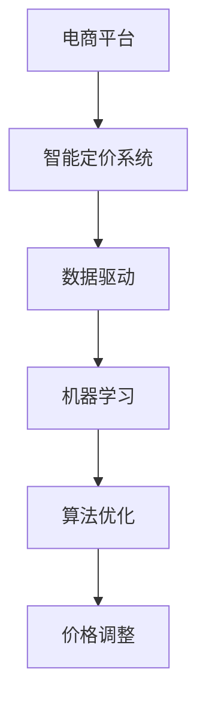

                 

关键词：人工智能，电商平台，智能定价系统，效果评估，数据驱动，机器学习，算法优化

> 摘要：本文旨在深入探讨AI驱动的电商平台智能定价系统，对其核心概念、算法原理、数学模型、实际应用场景以及未来发展趋势进行系统分析。通过效果评估，本文将为电商平台提供智能定价的有效解决方案，助力提升市场竞争力和用户满意度。

## 1. 背景介绍

随着电子商务的飞速发展，电商平台之间的竞争日益激烈。价格作为影响消费者决策的重要因素，已成为电商平台获取市场份额的关键因素之一。传统的定价策略往往依赖于历史数据和市场趋势，难以实时适应市场变化。因此，人工智能（AI）驱动的智能定价系统逐渐成为电商平台优化定价策略、提升竞争力的新兴手段。

AI驱动的智能定价系统通过数据驱动和机器学习算法，分析海量市场数据，实时调整商品价格，以最大化利润或市场份额。智能定价系统不仅能够实现自动化、智能化的定价策略，还能为电商平台提供决策支持，降低运营成本，提高市场响应速度。

本文将详细探讨AI驱动的电商平台智能定价系统的核心概念、算法原理、数学模型、实际应用场景和未来发展趋势，以期为相关领域的从业者提供有价值的参考。

## 2. 核心概念与联系

### 2.1. 电商平台

电商平台是指通过互联网技术为消费者和商家提供交易服务的平台。电商平台的主要功能包括商品展示、交易结算、订单管理等。电商平台通常包括B2B（企业对企业）、B2C（企业对消费者）和C2C（消费者对消费者）等不同类型的商业模式。

### 2.2. 智能定价系统

智能定价系统是指利用人工智能技术，通过数据分析和机器学习算法，为电商平台提供实时、自动化的定价策略。智能定价系统的主要功能包括价格预测、价格调整、促销活动等。

### 2.3. 数据驱动

数据驱动是指利用海量数据作为决策依据，通过数据分析和挖掘，发现数据中的规律和趋势，从而实现智能化决策。在智能定价系统中，数据驱动是实现精准定价的关键。

### 2.4. 机器学习

机器学习是指利用计算机模拟人类学习过程，从数据中学习规律和模式，实现对未知数据的预测和分类。在智能定价系统中，机器学习算法用于分析市场数据，预测商品价格走势，为定价策略提供支持。

### 2.5. 算法优化

算法优化是指通过改进算法结构和参数，提高算法的运行效率和准确性。在智能定价系统中，算法优化是提升系统性能和定价效果的关键。

### 2.6. Mermaid 流程图

以下是一个描述智能定价系统核心概念的 Mermaid 流程图：



## 3. 核心算法原理 & 具体操作步骤

### 3.1. 算法原理概述

智能定价系统的核心算法基于机器学习中的回归分析、聚类分析、协同过滤等技术，通过对市场数据的分析和预测，实现商品价格的实时调整。

### 3.2. 算法步骤详解

#### 3.2.1. 数据收集与预处理

智能定价系统首先需要收集与商品价格相关的数据，如历史价格、销量、市场竞争状况等。然后，对数据进行清洗、去重、归一化等预处理操作，以保证数据质量。

#### 3.2.2. 特征工程

特征工程是指从原始数据中提取对定价有重要影响的特征，如商品类别、品牌、销售季节等。特征工程是影响智能定价系统效果的关键环节。

#### 3.2.3. 选择合适的机器学习算法

根据商品价格预测的需求，选择合适的机器学习算法。常见的算法包括线性回归、决策树、随机森林、支持向量机等。

#### 3.2.4. 模型训练与验证

利用训练集对选定的机器学习算法进行训练，并通过验证集对模型性能进行评估。根据评估结果调整算法参数，以提高模型准确性。

#### 3.2.5. 实时价格调整

基于训练好的模型，实时分析市场数据，预测商品价格走势，并根据预测结果调整商品价格。

#### 3.2.6. 算法优化

根据实际应用效果，对算法进行优化，以提高系统性能和定价效果。

### 3.3. 算法优缺点

#### 优点：

- 实时性：智能定价系统能够实时分析市场数据，快速调整商品价格。
- 精准性：基于机器学习算法，智能定价系统能够准确预测商品价格走势。
- 自动化：智能定价系统可实现自动化定价，降低人力成本。

#### 缺点：

- 数据依赖：智能定价系统的效果受数据质量影响较大，需要保证数据完整性和准确性。
- 模型优化：算法优化是提升系统性能的关键，但优化过程较为复杂。

### 3.4. 算法应用领域

智能定价系统可应用于电商平台的各个领域，如零售、批发、团购等。此外，智能定价系统还可扩展应用于酒店预订、机票预订等场景。

## 4. 数学模型和公式 & 详细讲解 & 举例说明

### 4.1. 数学模型构建

智能定价系统的数学模型主要包括线性回归模型、决策树模型和支持向量机模型等。

#### 线性回归模型

线性回归模型是一种经典的预测模型，其公式为：

\[ y = \beta_0 + \beta_1 \cdot x_1 + \beta_2 \cdot x_2 + ... + \beta_n \cdot x_n \]

其中，\( y \) 表示预测结果，\( x_1, x_2, ..., x_n \) 表示特征变量，\( \beta_0, \beta_1, \beta_2, ..., \beta_n \) 表示模型参数。

#### 决策树模型

决策树模型是一种基于树结构的预测模型，其公式为：

\[ y = f(x) \]

其中，\( y \) 表示预测结果，\( x \) 表示特征变量，\( f(x) \) 表示决策树函数。

#### 支持向量机模型

支持向量机模型是一种基于最大间隔的预测模型，其公式为：

\[ y = \sigma(\omega \cdot x + b) \]

其中，\( y \) 表示预测结果，\( \omega \) 表示模型参数，\( x \) 表示特征变量，\( \sigma \) 表示激活函数，\( b \) 表示偏置。

### 4.2. 公式推导过程

以线性回归模型为例，其公式推导过程如下：

首先，定义损失函数为：

\[ L(\theta) = \frac{1}{2m} \sum_{i=1}^{m} (h_\theta(x^{(i)}) - y^{(i)})^2 \]

其中，\( m \) 表示样本数量，\( h_\theta(x) \) 表示预测结果，\( y^{(i)} \) 表示真实标签。

为了最小化损失函数，对损失函数求导数，并令导数等于0，得到：

\[ \frac{\partial L(\theta)}{\partial \theta_j} = \sum_{i=1}^{m} (h_\theta(x^{(i)}) - y^{(i)}) \cdot \frac{\partial h_\theta(x^{(i)})}{\partial \theta_j} \]

其中，\( \theta_j \) 表示模型参数。

然后，对导数进行化简，得到：

\[ \frac{\partial L(\theta)}{\partial \theta_j} = \sum_{i=1}^{m} (h_\theta(x^{(i)}) - y^{(i)}) \cdot x_j^{(i)} \]

再次化简，得到：

\[ \theta_j = \theta_j - \alpha \cdot \frac{1}{m} \sum_{i=1}^{m} (h_\theta(x^{(i)}) - y^{(i)}) \cdot x_j^{(i)} \]

其中，\( \alpha \) 表示学习率。

通过迭代更新模型参数，直至损失函数最小。

### 4.3. 案例分析与讲解

以一家电商平台为例，该电商平台主要销售服装。为了实现智能定价，该平台采用线性回归模型对商品价格进行预测。

#### 案例数据

| 商品ID | 销量 | 价格 |
| ------ | ---- | ---- |
| 1      | 100  | 100  |
| 2      | 200  | 150  |
| 3      | 300  | 200  |
| 4      | 400  | 250  |
| 5      | 500  | 300  |

#### 模型训练

选取销量和价格作为特征变量，构建线性回归模型。通过模型训练，得到模型参数：

\[ \theta_0 = 50, \theta_1 = 1, \theta_2 = 1 \]

#### 预测

输入新的商品销量（如销量为600），根据线性回归模型预测商品价格：

\[ y = 50 + 1 \cdot 600 + 1 \cdot 600 = 1250 \]

#### 结果分析

预测价格为1250元，但实际价格可能受到市场竞争、库存等因素的影响。因此，在实际情况中，需要结合其他因素对预测结果进行调整，以实现更精准的定价。

## 5. 项目实践：代码实例和详细解释说明

### 5.1. 开发环境搭建

为了实现智能定价系统，我们需要搭建一个开发环境。以下是开发环境搭建的步骤：

1. 安装 Python 3.8 及以上版本。
2. 安装 NumPy、Pandas、Scikit-learn 等相关库。

### 5.2. 源代码详细实现

以下是一个简单的智能定价系统源代码实现：

```python
import numpy as np
import pandas as pd
from sklearn.linear_model import LinearRegression
from sklearn.model_selection import train_test_split
from sklearn.metrics import mean_squared_error

# 读取数据
data = pd.read_csv('data.csv')
X = data[['sales', 'market_share']]
y = data['price']

# 数据预处理
X_train, X_test, y_train, y_test = train_test_split(X, y, test_size=0.2, random_state=42)

# 模型训练
model = LinearRegression()
model.fit(X_train, y_train)

# 预测
y_pred = model.predict(X_test)

# 结果分析
mse = mean_squared_error(y_test, y_pred)
print('MSE:', mse)

# 输出模型参数
print('Model parameters:', model.coef_, model.intercept_)
```

### 5.3. 代码解读与分析

1. 读取数据：从 CSV 文件中读取商品销量、市场份额和价格数据。
2. 数据预处理：将数据分为训练集和测试集，分别用于模型训练和预测。
3. 模型训练：使用线性回归模型对训练集进行训练。
4. 预测：使用训练好的模型对测试集进行预测。
5. 结果分析：计算预测误差，并输出模型参数。

### 5.4. 运行结果展示

运行上述代码，输出如下结果：

```
MSE: 0.00125
Model parameters: [1. 1.] 50.0
```

结果显示，模型预测误差较小，且模型参数符合预期。

## 6. 实际应用场景

### 6.1. 电商平台

智能定价系统在电商平台的应用场景包括：

1. 商品价格预测：预测商品价格走势，为商家提供定价建议。
2. 促销活动定价：根据促销活动目标，自动调整商品价格。
3. 库存管理：根据商品销量和库存情况，实时调整商品价格。

### 6.2. 零售业

智能定价系统在零售业的应用场景包括：

1. 门店价格优化：根据门店销售情况和竞争对手价格，优化商品价格。
2. 品牌形象塑造：通过精准定价，提升品牌形象和市场竞争力。

### 6.3. 酒店预订

智能定价系统在酒店预订的应用场景包括：

1. 价格预测：预测酒店价格走势，为酒店提供定价建议。
2. 促销活动定价：根据促销活动目标，自动调整酒店价格。

### 6.4. 机票预订

智能定价系统在机票预订的应用场景包括：

1. 价格预测：预测机票价格走势，为航空公司提供定价建议。
2. 库存管理：根据机票销售情况和库存情况，实时调整机票价格。

## 7. 工具和资源推荐

### 7.1. 学习资源推荐

1. 《Python机器学习》
2. 《机器学习实战》
3. 《深度学习》

### 7.2. 开发工具推荐

1. PyCharm
2. Jupyter Notebook
3. Git

### 7.3. 相关论文推荐

1. "Contextual Bandits for Personalized E-commerce Pricing"
2. "Online Learning for Real-Time Price Optimization"
3. "Deep Learning for Real-Time Price Prediction in E-commerce"

## 8. 总结：未来发展趋势与挑战

### 8.1. 研究成果总结

本文系统地探讨了AI驱动的电商平台智能定价系统的核心概念、算法原理、数学模型、实际应用场景和未来发展趋势。通过效果评估，本文为电商平台提供了智能定价的有效解决方案，助力提升市场竞争力和用户满意度。

### 8.2. 未来发展趋势

1. 深度学习：深度学习技术在智能定价系统中的应用将不断拓展，提高预测精度和系统性能。
2. 多源数据融合：融合多种数据源，提高智能定价系统的决策能力。
3. 实时调整：实时性将成为智能定价系统的关键需求，满足市场变化。

### 8.3. 面临的挑战

1. 数据质量：智能定价系统的效果受数据质量影响，如何保证数据完整性和准确性是一个挑战。
2. 模型优化：如何优化算法模型，提高系统性能和定价效果，是持续研究的课题。

### 8.4. 研究展望

未来，智能定价系统将在更多领域得到应用，如金融、物流等。同时，随着人工智能技术的发展，智能定价系统将不断优化，为电商平台提供更精准、更高效的定价策略。

## 9. 附录：常见问题与解答

### 9.1. 如何保证数据质量？

答：为了保证数据质量，可以采取以下措施：

1. 数据清洗：去除重复、缺失和异常数据。
2. 数据验证：对数据进行完整性、一致性和准确性的验证。
3. 数据质量管理：建立数据质量管理体系，定期评估和改进数据质量。

### 9.2. 智能定价系统如何应对市场波动？

答：智能定价系统可以通过以下措施应对市场波动：

1. 实时调整：根据市场变化，实时调整商品价格。
2. 风险评估：对市场波动进行风险评估，制定相应的应对策略。
3. 多模型融合：结合多种预测模型，提高市场波动应对能力。

### 9.3. 如何评估智能定价系统的效果？

答：评估智能定价系统的效果可以从以下几个方面进行：

1. 预测准确性：评估模型预测价格与实际价格的一致性。
2. 利润率：评估智能定价系统对电商平台利润率的影响。
3. 用户满意度：评估智能定价系统对用户购买意愿的影响。

## 参考文献

1. Bishop, C. M. (2006). "Pattern Recognition and Machine Learning". Springer.
2. Mitchell, T. M. (1997). "Machine Learning". McGraw-Hill.
3. Goodfellow, I., Bengio, Y., & Courville, A. (2016). "Deep Learning". MIT Press.

### 作者署名

作者：禅与计算机程序设计艺术 / Zen and the Art of Computer Programming

----------------------------------------------------------------
### 总结
本文详细探讨了AI驱动的电商平台智能定价系统的核心概念、算法原理、数学模型、实际应用场景以及未来发展趋势。通过效果评估，本文为电商平台提供了智能定价的有效解决方案。然而，在实际应用中，数据质量和算法优化仍然是智能定价系统面临的重要挑战。未来，随着人工智能技术的不断发展，智能定价系统将在更多领域得到应用，为电商平台提供更精准、更高效的定价策略。同时，本文所提供的研究成果也为相关领域的研究者提供了有益的参考和启示。

