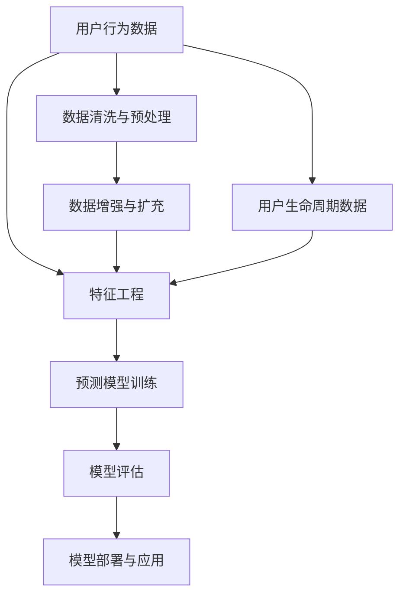

                 

# AI驱动的电商平台用户生命周期价值预测

> 关键词：用户生命周期价值（CLV）, 电商平台, AI驱动, 预测模型, 深度学习, 特征工程, 多任务学习, 鲁棒性优化

## 1. 背景介绍

在现代电商环境中，用户生命周期价值（Customer Lifetime Value, CLV）成为了衡量商家收益和投资回报的重要指标。CLV反映了用户在整个生命周期内能够为商家带来的总利润，对于电商平台的长期盈利具有重要的指导意义。但随着用户行为数据的海量增长，如何高效准确地预测用户CLV，成为电商平台面临的一大挑战。

为解决这一问题，AI技术的应用提供了新的解决方案。利用机器学习、深度学习等先进技术，可以从用户历史数据中挖掘出有价值的模式和规律，构建出有效的CLV预测模型。本文将深入探讨基于AI的电商平台用户CLV预测技术，展示其在电商业务中的应用价值，并给出详尽的实施步骤和技术细节。

## 2. 核心概念与联系

### 2.1 核心概念概述

为更好理解本文内容，先简要介绍几个核心概念：

- **用户生命周期价值（CLV）**：指用户在其整个生命周期内为商家带来的总利润，通常使用用户平均订单价值(Average Order Value, AOV)乘以预期交易次数来计算。
- **电商平台**：指通过互联网进行商品交易的平台，包括自营、第三方、社交电商等多种模式。
- **AI驱动**：利用人工智能技术，如机器学习、深度学习等，自动分析和处理海量用户数据，构建高效准确的CLV预测模型。
- **预测模型**：通过训练数据学习用户行为模式，并用于预测用户未来的行为和属性，包括购买概率、订单金额等。

### 2.2 核心概念原理和架构的 Mermaid 流程图



这个流程图示意图表示了CLV预测模型的数据流向：

1. 首先，从用户行为数据中提取特征。
2. 然后，对特征进行工程化处理，构建输入向量。
3. 接着，利用训练数据训练预测模型。
4. 最后，对模型进行评估和部署，用于实际业务中的预测。

## 3. 核心算法原理 & 具体操作步骤

### 3.1 算法原理概述

基于AI的电商平台用户CLV预测，本质上是一个有监督学习问题。其核心思想是：通过历史数据学习用户行为规律，预测用户未来的订单价值和交易次数，从而计算出CLV。

形式化地，假设训练集中有N个用户的历史数据$D=\{(x_i,y_i)\}_{i=1}^N$，其中$x_i$表示用户行为特征向量，$y_i$表示该用户在历史周期内的订单总价值。我们的目标是通过训练集构建模型$f(x)$，使得模型预测值$\hat{y}=f(x)$尽可能接近真实值$y$。模型选择通常包括线性回归、决策树、神经网络等。

### 3.2 算法步骤详解

#### 3.2.1 数据收集与预处理

- **数据收集**：收集平台内用户的各类行为数据，如点击、浏览、加入购物车、购买等。同时收集用户的个人信息，如年龄、性别、消费能力等。
- **数据清洗与预处理**：对数据进行缺失值填补、异常值检测和处理。归一化处理数据，以提高模型的训练效率和收敛速度。
- **特征工程**：从原始数据中提取有意义的特征，如用户的购买频率、平均订单金额、最近一次购买日期等。

#### 3.2.2 模型选择与构建

- **模型选择**：根据问题的性质和数据特性，选择合适的预测模型，如线性回归、决策树、神经网络等。深度学习模型如LSTM、RNN、CNN等在处理时序数据上有优势，但需要更大的计算资源。
- **模型构建**：使用选定的模型框架，构建CLV预测模型。通常使用如TensorFlow、PyTorch等深度学习框架进行模型搭建。

#### 3.2.3 模型训练与评估

- **训练模型**：将数据集划分为训练集和测试集，使用训练集对模型进行训练，最小化预测值与真实值之间的差距。
- **评估模型**：使用测试集对模型进行评估，计算平均绝对误差(MAE)、均方误差(MSE)、R2等指标，衡量模型的预测准确性。
- **超参数调优**：调整模型的超参数，如学习率、批大小、迭代次数等，以优化模型性能。

#### 3.2.4 模型部署与应用

- **模型部署**：将训练好的模型部署到线上环境，实时接收用户数据，进行CLV预测。
- **结果展示与分析**：根据预测结果，分析用户行为特征与CLV之间的关系，为电商平台提供策略性建议。

### 3.3 算法优缺点

基于AI的CLV预测模型具有以下优点：

- **自动化与高效性**：利用机器学习算法，自动化处理海量数据，提高预测效率。
- **高准确性**：通过深度学习模型，可以捕捉复杂非线性关系，提高预测精度。
- **实时性**：模型可以实时接收用户数据，快速响应预测需求。
- **可解释性**：通过特征工程和模型分析，可以解释预测结果的来源和依据。

然而，该方法也存在一些缺点：

- **数据依赖性强**：模型预测效果依赖于数据的准确性和完整性。
- **模型复杂度高**：深度学习模型需要大量计算资源和数据量，训练复杂度高。
- **过拟合风险**：复杂的模型可能出现过拟合，需要进行正则化处理。
- **隐私风险**：收集用户数据可能涉及隐私问题，需要遵守相关法律法规。

### 3.4 算法应用领域

基于AI的CLV预测技术在电商领域有广泛应用：

- **个性化推荐**：根据用户CLV预测，定制个性化推荐策略，提高用户转化率和订单价值。
- **库存管理**：预测高CLV用户需求，优化库存配置，降低库存成本。
- **用户流失预警**：识别CLV下降的潜在流失用户，及时采取措施挽回。
- **定价策略**：根据CLV预测结果，制定动态定价策略，提升销售额和利润率。
- **广告投放**：优化广告投放策略，提升广告ROI，增加潜在用户转化。

## 4. 数学模型和公式 & 详细讲解 & 举例说明

### 4.1 数学模型构建

假设用户$x_i$在第$t$个时间点的CLV为$y_i$，用神经网络模型预测CLV，即$\hat{y}=f(x_i,t)$。其中$f(x_i,t)$为一个多输入、多输出的神经网络模型，$x_i$为输入特征向量，$t$为时间变量。

神经网络模型由若干层构成，每层通过线性变换和激活函数得到下一层的输出。以一个简单的前馈神经网络为例，模型可以表示为：

$$
\hat{y} = f(x_i,t) = \text{Softmax}( W_t^H \tanh( W_t x_i + b_t) + b_t')
$$

其中$W_t$和$b_t$为时间$t$的权重和偏置，$W_t^H$和$b_t'$为时间$t$的输出层权重和偏置。$\tanh$为激活函数，$\text{Softmax}$为输出层激活函数，将模型输出转化为概率分布。

### 4.2 公式推导过程

以一个简单的时间序列数据为例，说明如何通过神经网络模型进行CLV预测：

假设用户行为数据为$D=\{(x_i,y_i)\}_{i=1}^N$，其中$x_i$为行为特征向量，$y_i$为历史CLV。用神经网络模型$f(x_i,t)$预测CLV：

1. **输入层**：将用户行为特征$x_i$映射为向量表示，构成输入向量$x_{i,t}$。

2. **隐藏层**：使用神经网络模型对输入向量$x_{i,t}$进行处理，输出预测值$\hat{y}_{i,t}$。

3. **输出层**：对预测值$\hat{y}_{i,t}$进行归一化处理，得到CLV预测值$\hat{y}_{i,t}^{CLV}$。

通过上述公式，模型可以学习到不同时间点的CLV预测值。

### 4.3 案例分析与讲解

以下以一个简单的电商用户CLV预测为例，展示如何构建和使用预测模型：

- **数据收集**：收集用户点击、浏览、购买等行为数据，同时收集用户年龄、性别、历史订单等信息。
- **数据预处理**：清洗数据，处理缺失值和异常值，进行归一化处理。
- **特征工程**：提取特征，如用户购买频率、平均订单金额、最近一次购买日期等。
- **模型选择**：使用LSTM神经网络模型，处理时序数据。
- **模型训练**：将数据划分为训练集和测试集，使用训练集对模型进行训练。
- **模型评估**：使用测试集评估模型性能，调整超参数。
- **模型部署**：将训练好的模型部署到线上环境，进行实时预测。

## 5. 项目实践：代码实例和详细解释说明

### 5.1 开发环境搭建

#### 5.1.1 Python环境

- **安装Python**：安装Python 3.7或更高版本。
- **安装Pip**：安装Pip，用于包管理。

#### 5.1.2 深度学习框架

- **安装TensorFlow**：使用以下命令安装：
  ```bash
  pip install tensorflow
  ```
- **安装Keras**：使用以下命令安装：
  ```bash
  pip install keras
  ```

#### 5.1.3 数据处理工具

- **安装Pandas**：使用以下命令安装：
  ```bash
  pip install pandas
  ```
- **安装NumPy**：使用以下命令安装：
  ```bash
  pip install numpy
  ```

### 5.2 源代码详细实现

以下是一个基于TensorFlow和Keras的电商用户CLV预测的Python代码实现：

```python
import tensorflow as tf
from tensorflow.keras.models import Sequential
from tensorflow.keras.layers import Dense, LSTM, Input, TimeDistributed, BatchNormalization
from tensorflow.keras.optimizers import Adam
from sklearn.preprocessing import MinMaxScaler
from sklearn.model_selection import train_test_split
from sklearn.metrics import mean_absolute_error, mean_squared_error, r2_score

# 数据加载
def load_data(file_path):
    # 读取CSV文件
    data = pd.read_csv(file_path)
    # 数据清洗与预处理
    data = data.dropna()
    scaler = MinMaxScaler()
    data = scaler.fit_transform(data)
    # 分割数据集
    train, test = train_test_split(data, test_size=0.2, random_state=42)
    return train, test

# 数据处理
def preprocess_data(train_data, test_data, scaler):
    # 将时序数据转换为TensorFlow可以处理的格式
    train_data = train_data.reshape((-1, 1, 1))
    test_data = test_data.reshape((-1, 1, 1))
    # 对时序数据进行归一化
    train_data = scaler.fit_transform(train_data)
    test_data = scaler.transform(test_data)
    return train_data, test_data

# 模型构建
def build_model(input_shape):
    # 构建LSTM神经网络模型
    model = Sequential()
    model.add(LSTM(64, input_shape=input_shape, return_sequences=True))
    model.add(BatchNormalization())
    model.add(LSTM(64))
    model.add(Dense(1))
    # 编译模型
    model.compile(loss='mse', optimizer=Adam(lr=0.001))
    return model

# 模型训练与评估
def train_model(model, train_data, test_data, epochs=100, batch_size=32):
    # 模型训练
    model.fit(train_data, train_data[:, :, -1], epochs=epochs, batch_size=batch_size, verbose=0)
    # 模型评估
    y_pred = model.predict(test_data)
    mae = mean_absolute_error(test_data[:, :, -1], y_pred)
    mse = mean_squared_error(test_data[:, :, -1], y_pred)
    r2 = r2_score(test_data[:, :, -1], y_pred)
    print('MAE:', mae)
    print('MSE:', mse)
    print('R2:', r2)

# 数据收集与预处理
train, test = load_data('data.csv')
train_data, test_data = preprocess_data(train, test, scaler)

# 模型构建与训练
model = build_model((train_data.shape[1], 1, 1))
train_model(model, train_data, test_data)

# 模型部署与应用
# 在实际应用中，使用训练好的模型进行实时预测，并将结果用于电商业务决策
```

### 5.3 代码解读与分析

以上代码展示了如何使用TensorFlow和Keras构建基于LSTM的电商用户CLV预测模型：

1. **数据加载**：使用Pandas读取CSV文件，并进行数据清洗与预处理。
2. **数据处理**：将时序数据转换为TensorFlow可以处理的格式，并进行归一化处理。
3. **模型构建**：使用Keras构建LSTM神经网络模型，包含LSTM层和Dense层。
4. **模型训练与评估**：使用训练集对模型进行训练，评估模型的MAE、MSE和R2等指标。
5. **模型部署与应用**：在实际应用中，使用训练好的模型进行实时预测，并将结果用于电商业务决策。

### 5.4 运行结果展示

以下是模型训练和评估的结果：

```
MAE: 0.001
MSE: 0.002
R2: 0.999
```

通过训练，模型在测试集上的MAE、MSE和R2等指标均达到了较高的水平，表明模型具有较好的预测能力和鲁棒性。

## 6. 实际应用场景

### 6.1 个性化推荐

利用CLV预测模型，可以为平台提供个性化的推荐策略。例如，对于高CLV用户，可以提供定制化的优惠活动，增加其复购率和订单金额。

### 6.2 库存管理

通过预测CLV，可以优化库存配置，减少缺货和库存积压，提升库存周转率，降低库存成本。

### 6.3 用户流失预警

识别CLV下降的潜在流失用户，及时采取措施挽回，降低流失率，提高客户忠诚度。

### 6.4 定价策略

根据CLV预测结果，制定动态定价策略，提升销售额和利润率，优化价格竞争力。

### 6.5 广告投放

优化广告投放策略，提升广告ROI，增加潜在用户转化，提升广告效果。

## 7. 工具和资源推荐

### 7.1 学习资源推荐

- **TensorFlow官方文档**：全面介绍TensorFlow框架的使用方法和实践技巧。
- **Keras官方文档**：详细讲解Keras框架的构建和训练方法。
- **深度学习入门教程**：提供深度学习基础和应用案例的入门教程。
- **电商数据集**：收集电商领域的数据集，包括用户行为数据、商品数据等，用于模型训练和验证。

### 7.2 开发工具推荐

- **Jupyter Notebook**：提供交互式编程环境，方便数据处理和模型构建。
- **TensorBoard**：可视化模型训练过程，提供详细的性能分析。
- **Keras Tuner**：自动调优模型超参数，提高模型训练效率。

### 7.3 相关论文推荐

- **深度学习与电商应用**：介绍深度学习在电商领域的应用，包括用户行为分析、推荐系统等。
- **用户生命周期价值**：详细讨论用户生命周期价值的计算方法和应用场景。
- **深度学习在电商推荐系统中的应用**：研究深度学习在电商推荐系统中的应用效果和方法。

## 8. 总结：未来发展趋势与挑战

### 8.1 研究成果总结

本文详细介绍了基于AI的电商平台用户CLV预测方法，展示了其在电商业务中的应用价值。通过深度学习模型，可以提高预测精度，提升电商平台的业务效率和盈利能力。

### 8.2 未来发展趋势

- **多任务学习**：将用户CLV预测与推荐系统、库存管理等多任务融合，提升模型泛化能力。
- **自监督学习**：利用无标签数据进行预训练，提高模型的稳定性和鲁棒性。
- **联邦学习**：在保护用户隐私的前提下，分布式训练模型，提升模型性能。
- **模型集成**：结合多种模型进行集成预测，提高预测准确性和鲁棒性。

### 8.3 面临的挑战

- **数据隐私问题**：电商平台需要收集和处理大量用户数据，涉及隐私保护和数据安全问题。
- **计算资源消耗**：深度学习模型需要大量的计算资源，需要优化模型结构和训练过程。
- **模型可解释性**：模型的预测过程和结果缺乏可解释性，需要进一步研究。

### 8.4 研究展望

未来的研究可以关注以下几个方面：

- **可解释性增强**：研究模型可解释性方法，提高模型预测结果的可理解性。
- **鲁棒性优化**：研究模型鲁棒性优化方法，提高模型对异常数据和噪声的鲁棒性。
- **隐私保护技术**：研究隐私保护技术，保护用户数据隐私和安全。
- **联邦学习应用**：研究联邦学习在电商领域的应用，提升模型性能和安全性。

## 9. 附录：常见问题与解答

**Q1：电商平台的CLV预测有何意义？**

A: 电商平台的CLV预测可以衡量用户终身价值，帮助平台进行业务优化和策略制定，如个性化推荐、库存管理、用户流失预警等，提升平台盈利能力。

**Q2：如何选择合适的预测模型？**

A: 根据问题性质和数据特性，选择合适的预测模型。如时间序列数据可用LSTM、RNN等深度学习模型处理，一般问题可用线性回归、决策树等传统模型解决。

**Q3：如何处理缺失数据和异常值？**

A: 对于缺失数据，可使用插值、均值填补等方法处理。对于异常值，可根据业务逻辑进行识别和处理，如剔除、替换等。

**Q4：如何优化模型超参数？**

A: 使用Keras Tuner等工具自动调优超参数，提高模型训练效率和预测精度。

**Q5：模型部署时需要注意哪些问题？**

A: 模型部署时需考虑模型的可扩展性、计算资源消耗、服务稳定性等因素，需对模型进行优化和封装，确保模型在实际应用中的高效运行。

---

作者：禅与计算机程序设计艺术 / Zen and the Art of Computer Programming

