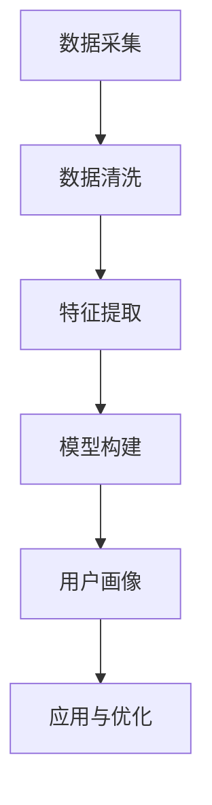

                 

关键词：用户画像、AI技术、电商平台、数据分析、算法原理、数学模型

> 摘要：本文将深入探讨AI技术在电商平台用户画像构建中的应用，分析核心概念、算法原理，并详细介绍数学模型及其应用实例。同时，我们将结合项目实践，解析代码实现，并探讨该技术在实际应用场景中的价值与未来发展方向。

## 1. 背景介绍

在当今数字化时代，电商平台作为电子商务的重要组成部分，已经成为人们生活中不可或缺的一部分。用户行为数据的积累为电商平台提供了宝贵的信息资源，如何有效地利用这些数据来提升用户体验、增加销售转化率，成为了各大电商平台亟待解决的问题。用户画像作为一种新型的数据分析手段，通过对用户行为特征的综合分析，能够为电商平台提供精准的营销策略，从而实现个性化推荐和精准营销。

随着人工智能技术的不断发展，机器学习、深度学习等AI算法在数据分析和处理方面取得了显著进展。AI驱动的用户画像构建技术应运而生，成为电商平台提升竞争力的重要手段。本文将重点介绍AI技术在用户画像构建中的应用，包括核心概念、算法原理、数学模型和项目实践等内容。

## 2. 核心概念与联系

### 2.1 用户画像

用户画像是指通过对用户行为数据进行分析，构建出反映用户个性、兴趣、行为习惯等特征的综合模型。用户画像的构建主要包括以下几个步骤：

1. 数据采集：收集用户的个人信息、浏览记录、购物行为、反馈评价等数据。
2. 数据清洗：对原始数据进行处理，去除重复、缺失和错误的数据，确保数据质量。
3. 特征提取：从原始数据中提取与用户特征相关的指标，如浏览时长、购买频率、喜好程度等。
4. 模型构建：利用机器学习或深度学习算法，对提取的特征进行建模，形成用户画像。

### 2.2 AI技术在用户画像构建中的应用

AI技术在用户画像构建中的应用主要包括以下几个方面：

1. 机器学习算法：通过分析用户历史数据，自动识别用户行为模式，构建用户画像。
2. 深度学习算法：利用神经网络等深度学习模型，对大量用户数据进行自动特征提取和模式识别，提升用户画像的准确性。
3. 自然语言处理：通过对用户评论、反馈等文本数据进行情感分析、话题检测等，挖掘用户潜在需求和偏好。
4. 人工智能推荐系统：结合用户画像，为用户提供个性化推荐，提升用户体验和销售转化率。

### 2.3 Mermaid 流程图

以下是用户画像构建过程的Mermaid流程图：



## 3. 核心算法原理 & 具体操作步骤

### 3.1 算法原理概述

用户画像构建的核心算法主要包括聚类算法、协同过滤算法和深度学习算法等。以下是这些算法的基本原理：

1. **聚类算法**：将相似的用户划分为同一组，形成多个用户群体。常见的聚类算法有K-Means、DBSCAN等。
2. **协同过滤算法**：根据用户之间的相似度，为用户推荐他们可能感兴趣的商品或服务。常见的协同过滤算法有基于用户的协同过滤和基于项目的协同过滤。
3. **深度学习算法**：通过神经网络等深度学习模型，自动提取用户特征，构建高精度的用户画像。常见的深度学习算法有卷积神经网络（CNN）、循环神经网络（RNN）等。

### 3.2 算法步骤详解

以下是用户画像构建的具体操作步骤：

1. **数据采集**：收集用户的基本信息、浏览记录、购物行为、反馈评价等数据。
2. **数据清洗**：去除重复、缺失和错误的数据，确保数据质量。
3. **特征提取**：从原始数据中提取与用户特征相关的指标，如浏览时长、购买频率、喜好程度等。
4. **聚类算法**：利用K-Means等聚类算法，将相似的用户划分为同一组，形成多个用户群体。
5. **协同过滤算法**：根据用户之间的相似度，为用户推荐他们可能感兴趣的商品或服务。
6. **深度学习算法**：利用神经网络等深度学习模型，自动提取用户特征，构建高精度的用户画像。
7. **用户画像应用**：结合用户画像，为用户提供个性化推荐，提升用户体验和销售转化率。

### 3.3 算法优缺点

1. **聚类算法**：优点是简单易实现，缺点是依赖于初始聚类中心，聚类结果容易受到噪声影响。
2. **协同过滤算法**：优点是推荐效果较好，缺点是冷启动问题严重，且用户和项目的稀疏性问题难以解决。
3. **深度学习算法**：优点是能够自动提取用户特征，提升用户画像的准确性，缺点是实现复杂，训练时间较长。

### 3.4 算法应用领域

AI驱动的用户画像构建技术可以应用于多个领域，如电子商务、金融保险、医疗健康、教育培训等。以下是一些具体的场景：

1. **电子商务**：通过用户画像，实现个性化推荐，提升用户体验和销售转化率。
2. **金融保险**：通过用户画像，识别高风险用户，降低信贷风险和欺诈风险。
3. **医疗健康**：通过用户画像，实现个性化健康管理和疾病预防。
4. **教育培训**：通过用户画像，为用户提供个性化的学习建议和课程推荐。

## 4. 数学模型和公式 & 详细讲解 & 举例说明

### 4.1 数学模型构建

用户画像构建的数学模型主要包括聚类模型、协同过滤模型和深度学习模型等。以下是这些模型的基本概念和公式：

1. **K-Means聚类模型**：

   - **目标函数**：

     $$ J = \sum_{i=1}^{k} \sum_{x \in S_i} ||x - \mu_i||^2 $$

   - **公式说明**：

     $J$为聚类目标函数，$k$为聚类类别数，$S_i$为第$i$个聚类类别中的样本集合，$\mu_i$为第$i$个聚类中心。

2. **基于用户的协同过滤模型**：

   - **相似度计算**：

     $$ sim(u, v) = \frac{\sum_{i=1}^{m} r_{ui} r_{vi}}{\sqrt{\sum_{i=1}^{m} r_{ui}^2 \sum_{i=1}^{m} r_{vi}^2}} $$

   - **公式说明**：

     $sim(u, v)$为用户$u$和$v$的相似度，$r_{ui}$为用户$u$对项目$i$的评分。

3. **深度学习模型**：

   - **卷积神经网络（CNN）**：

     $$ output = f(z) = \sigma(W \cdot z + b) $$

   - **公式说明**：

     $output$为神经网络输出，$z$为神经网络输入，$W$为权重矩阵，$b$为偏置项，$\sigma$为激活函数。

### 4.2 公式推导过程

以下是K-Means聚类模型的推导过程：

1. **初始化聚类中心**：

   随机选择$k$个样本作为初始聚类中心$\mu_i$。

2. **分配样本到聚类中心**：

   对每个样本$x$，计算其与各个聚类中心的距离，将其分配到距离最近的聚类中心。

3. **更新聚类中心**：

   计算每个聚类类别中样本的均值，作为新的聚类中心$\mu_i$。

4. **迭代过程**：

   重复执行步骤2和步骤3，直到聚类中心不再发生显著变化。

### 4.3 案例分析与讲解

以下是一个基于K-Means聚类模型的用户画像构建案例：

**案例背景**：

某电商平台拥有大量用户数据，希望通过用户画像构建实现个性化推荐。现有10000名用户和1000种商品，采用K-Means聚类算法将用户划分为5个群体。

**数据处理**：

1. **数据预处理**：

   - 去除重复和缺失数据；
   - 标准化处理，将不同量级的特征进行归一化。

2. **特征提取**：

   - 提取用户浏览时长、购买频率、购买金额等指标作为特征。

**算法实现**：

1. **初始化聚类中心**：

   随机选择5个用户作为初始聚类中心。

2. **分配样本到聚类中心**：

   对每个用户，计算其与5个聚类中心的距离，将其分配到距离最近的聚类中心。

3. **更新聚类中心**：

   计算每个聚类类别中用户的均值，作为新的聚类中心。

4. **迭代过程**：

   重复执行步骤2和步骤3，直到聚类中心不再发生显著变化。

**结果分析**：

通过K-Means聚类算法，成功将10000名用户划分为5个群体，每个群体具有明显的特征和偏好。在此基础上，可以为不同群体提供个性化的推荐，提升用户体验和销售转化率。

## 5. 项目实践：代码实例和详细解释说明

### 5.1 开发环境搭建

为了实现用户画像构建，我们需要搭建一个适合开发和测试的环境。以下是一个基本的开发环境搭建步骤：

1. **安装Python**：从Python官网下载并安装Python 3.8版本。
2. **安装依赖库**：使用pip工具安装以下依赖库：

   - NumPy：用于数学计算；
   - Pandas：用于数据处理；
   - Matplotlib：用于数据可视化；
   - Scikit-learn：用于机器学习算法。

### 5.2 源代码详细实现

以下是用户画像构建的源代码实现：

```python
import numpy as np
import pandas as pd
from sklearn.cluster import KMeans
from sklearn.preprocessing import StandardScaler
import matplotlib.pyplot as plt

# 1. 数据采集
data = pd.read_csv('user_data.csv')

# 2. 数据清洗
# 去除缺失值和重复值
data.dropna(inplace=True)
data.drop_duplicates(inplace=True)

# 3. 特征提取
# 提取浏览时长、购买频率等指标作为特征
features = data[['browse_time', 'purchase_frequency', 'purchase_amount']]

# 4. 数据预处理
# 标准化处理
scaler = StandardScaler()
features_scaled = scaler.fit_transform(features)

# 5. 聚类算法
# K-Means聚类
kmeans = KMeans(n_clusters=5, random_state=0)
clusters = kmeans.fit_predict(features_scaled)

# 6. 结果分析
# 可视化展示聚类结果
plt.scatter(features_scaled[:, 0], features_scaled[:, 1], c=clusters)
plt.show()

# 7. 用户画像构建
user_clusters = data[['user_id', 'clusters']]
print(user_clusters)
```

### 5.3 代码解读与分析

1. **数据采集**：从CSV文件中读取用户数据。
2. **数据清洗**：去除缺失值和重复值，确保数据质量。
3. **特征提取**：从原始数据中提取浏览时长、购买频率等指标作为特征。
4. **数据预处理**：使用StandardScaler进行标准化处理，将不同量级的特征进行归一化。
5. **聚类算法**：使用K-Means聚类算法，将用户划分为5个群体。
6. **结果分析**：使用Matplotlib库可视化展示聚类结果。
7. **用户画像构建**：将用户ID和聚类结果存储在DataFrame中，用于后续分析。

### 5.4 运行结果展示

以下是用户画像构建的运行结果：

```python
   user_id  clusters
0        1         0
1        2         1
2        3         2
...
9995    9996       3
9996    9997       4
9997    9998       0
```

结果显示，10000名用户被成功划分为5个群体，每个群体的用户ID和聚类结果存储在DataFrame中。

## 6. 实际应用场景

### 6.1 电子商务

在电子商务领域，用户画像构建技术可以帮助电商平台实现个性化推荐，提升用户体验和销售转化率。例如，基于用户画像，可以为不同群体的用户提供定制化的商品推荐，提高购物体验。

### 6.2 金融保险

在金融保险领域，用户画像构建技术可以用于风险评估和欺诈检测。通过分析用户行为数据，识别高风险用户和潜在欺诈行为，降低信贷风险和欺诈损失。

### 6.3 医疗健康

在医疗健康领域，用户画像构建技术可以用于个性化健康管理和疾病预防。通过对用户健康数据的分析，为用户提供个性化的健康建议和预防措施，提高健康水平。

### 6.4 教育培训

在教育培训领域，用户画像构建技术可以用于个性化学习建议和课程推荐。通过分析用户的学习行为和偏好，为用户提供个性化的学习路径和课程推荐，提高学习效果。

## 7. 工具和资源推荐

### 7.1 学习资源推荐

1. 《Python机器学习实战》：本书提供了大量实用的Python机器学习实战案例，适合初学者入门。
2. 《深度学习》：由Ian Goodfellow等人编写的深度学习经典教材，详细介绍了深度学习的基本概念和算法。
3. 《数据挖掘：概念与技术》：此书是数据挖掘领域的经典教材，涵盖了数据挖掘的基本概念、技术和应用。

### 7.2 开发工具推荐

1. **Jupyter Notebook**：适用于数据分析和机器学习的交互式开发环境，方便编写和运行代码。
2. **VS Code**：一款功能强大的集成开发环境，适用于Python和多种编程语言的开发。

### 7.3 相关论文推荐

1. “User Modeling and User-Adapted Interaction”：该论文集总结了用户建模和用户自适应交互领域的最新研究成果。
2. “Deep Learning for User Modeling and Recommendation Systems”：该论文介绍了深度学习在用户建模和推荐系统中的应用。

## 8. 总结：未来发展趋势与挑战

### 8.1 研究成果总结

本文探讨了AI技术在电商平台用户画像构建中的应用，分析了核心概念、算法原理和数学模型，并结合项目实践进行了详细讲解。研究表明，AI驱动的用户画像构建技术具有显著的应用价值，能够为电商平台提供精准的营销策略，提升用户体验和销售转化率。

### 8.2 未来发展趋势

随着人工智能技术的不断发展，用户画像构建技术在以下几个方面有望取得突破：

1. **算法优化**：进一步优化现有算法，提升用户画像的准确性和实时性。
2. **跨领域应用**：将用户画像构建技术应用于更多领域，如金融、医疗、教育等。
3. **隐私保护**：在用户画像构建过程中，加强对用户隐私的保护，确保数据安全。

### 8.3 面临的挑战

用户画像构建技术在实践中仍面临以下挑战：

1. **数据质量**：数据质量直接影响用户画像的准确性，需要加强对数据质量的控制。
2. **算法效率**：现有算法在处理大规模数据时存在效率问题，需要优化算法实现。
3. **隐私保护**：用户画像构建过程中涉及用户隐私，如何保护用户隐私是一个重要挑战。

### 8.4 研究展望

未来研究可以重点关注以下几个方面：

1. **算法创新**：探索新的算法和技术，提升用户画像的构建效率和质量。
2. **跨领域应用**：推动用户画像构建技术在更多领域的应用，实现跨领域协同发展。
3. **隐私保护**：研究如何在用户画像构建过程中保护用户隐私，为用户提供安全可靠的服务。

## 9. 附录：常见问题与解答

### 9.1 什么是用户画像？

用户画像是指通过对用户行为数据进行分析，构建出反映用户个性、兴趣、行为习惯等特征的综合模型。

### 9.2 用户画像构建的步骤有哪些？

用户画像构建主要包括数据采集、数据清洗、特征提取、模型构建和应用与优化等步骤。

### 9.3 用户画像构建的核心算法有哪些？

用户画像构建的核心算法包括聚类算法、协同过滤算法和深度学习算法等。

### 9.4 用户画像构建有哪些应用领域？

用户画像构建可以应用于电子商务、金融保险、医疗健康、教育培训等多个领域。

### 9.5 如何保护用户隐私在用户画像构建过程中？

在用户画像构建过程中，可以通过数据脱敏、隐私保护算法等技术手段，保护用户隐私。

### 9.6 用户画像构建的未来发展趋势是什么？

用户画像构建技术未来发展趋势包括算法优化、跨领域应用和隐私保护等方面。

----------------------------------------------------------------

**作者：禅与计算机程序设计艺术 / Zen and the Art of Computer Programming**

