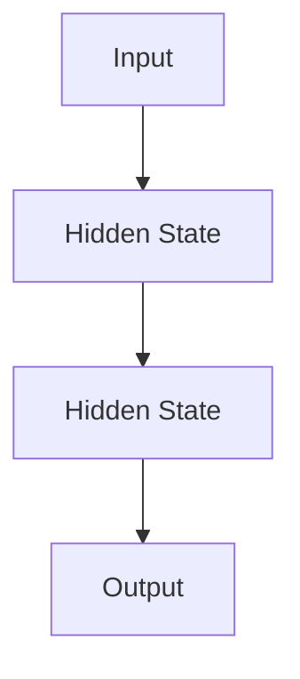
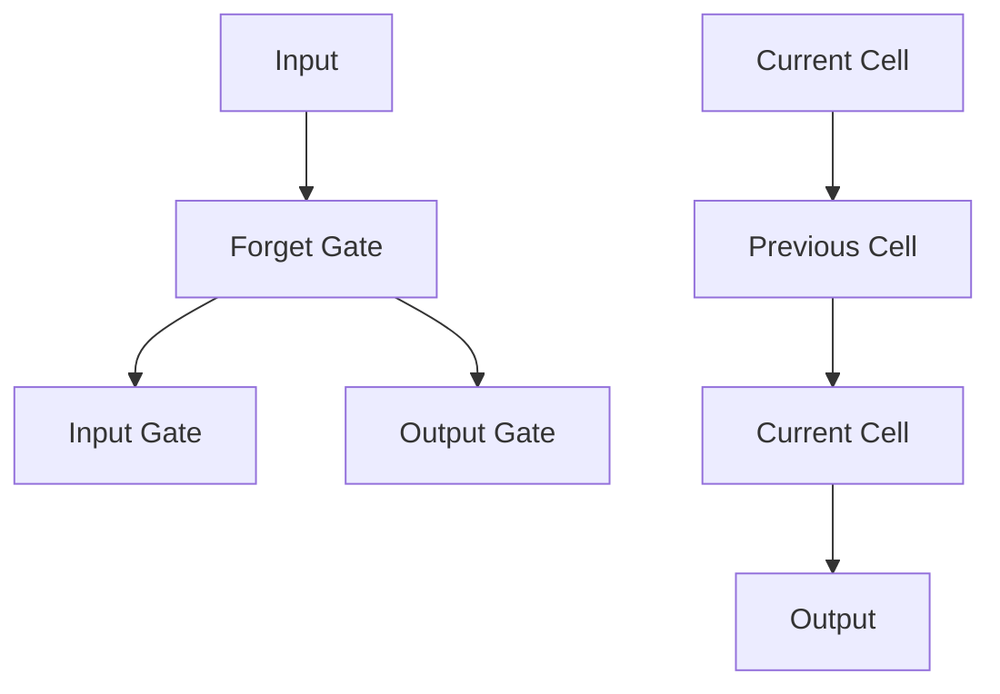
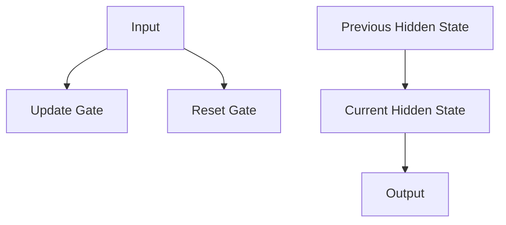

                 

 在当今数字化时代，电商平台已成为商业活动的重要场所。用户行为数据的分析和预测对于电商平台来说至关重要，它可以帮助平台更好地理解用户需求、优化用户体验、提高转化率和销售额。本文将探讨如何利用人工智能（AI）技术，特别是深度学习模型，对电商平台用户行为序列进行分析与预测。

## 文章关键词

- 电商平台
- 用户行为分析
- 序列预测
- 人工智能
- 深度学习

## 摘要

本文首先介绍了电商平台用户行为分析的重要性，并简要回顾了传统的用户行为分析方法。接着，本文详细介绍了深度学习在序列预测中的应用，以及如何通过构建合适的数学模型和算法，对用户行为进行有效预测。随后，文章通过具体案例展示了如何将理论应用于实践，并提供了相关的开发资源和工具推荐。最后，本文总结了当前的研究成果，探讨了未来的发展趋势和面临的挑战。

## 1. 背景介绍

电商平台通过互联网为商家和消费者提供了一个无国界的交易市场。在这个市场中，用户的行为数据如浏览历史、购买记录、点击率等，是宝贵的商业资源。通过分析这些数据，电商平台可以了解用户的需求和偏好，从而优化营销策略、提升用户体验、提高销售转化率。

传统的用户行为分析方法主要包括统计分析和机器学习。统计分析通过计算用户行为数据的统计指标，如平均数、中位数、方差等，来揭示数据中的趋势和模式。然而，这种方法在处理复杂和多维的用户行为数据时往往力不从心。机器学习则通过构建预测模型，利用历史数据来预测未来用户行为。虽然机器学习方法在处理复杂数据方面具有优势，但传统的机器学习模型，如线性回归、决策树等，往往难以捕捉用户行为序列中的时间依赖性。

## 2. 核心概念与联系

在深度学习框架下，用户行为序列分析主要依赖于循环神经网络（RNN）及其变种，如长短时记忆网络（LSTM）和门控循环单元（GRU）。这些模型能够捕捉序列数据中的时间依赖性，通过不断更新隐藏状态，实现对序列的长期记忆和学习。

### 2.1 循环神经网络（RNN）

RNN是一种能够处理序列数据的神经网络，其核心思想是将当前输入与先前的隐藏状态结合来更新当前隐藏状态。这种设计使得RNN能够捕捉序列中的时间依赖性。

然而，标准的RNN在处理长序列数据时容易遇到梯度消失或梯度爆炸的问题，这导致模型难以学习长远的依赖关系。

### 2.2 长短时记忆网络（LSTM）

为了解决RNN的梯度消失问题，Hochreiter和Schmidhuber于1997年提出了长短时记忆网络（LSTM）。LSTM通过引入门控机制，可以有效地控制信息的流入和流出，从而捕捉长序列中的长期依赖关系。

### 2.3 门控循环单元（GRU）

GRU是LSTM的一种变体，相较于LSTM，GRU结构更为简洁，但性能相当。GRU通过合并输入门和遗忘门，简化了LSTM的结构，同时保持了高效的学习能力。

## 3. 核心算法原理 & 具体操作步骤

### 3.1 算法原理概述

深度学习模型，如LSTM和GRU，通过学习用户行为序列中的时间依赖性，可以预测用户未来的行为。具体而言，模型通过以下步骤进行操作：

1. **输入层**：将用户行为序列作为输入。
2. **隐藏层**：利用门控机制更新隐藏状态，捕捉时间依赖性。
3. **输出层**：根据隐藏状态预测用户未来的行为。

### 3.2 算法步骤详解

#### 步骤1：数据预处理

在构建深度学习模型之前，需要对用户行为数据进行预处理。这包括数据清洗、特征提取和序列化。具体操作如下：

- **数据清洗**：去除缺失值、异常值和重复记录。
- **特征提取**：将用户行为转换为数值特征，如浏览时间、点击次数等。
- **序列化**：将用户行为数据组织为序列形式，便于输入到深度学习模型中。

#### 步骤2：模型构建

- **输入层**：定义输入层，将序列数据输入模型。
- **隐藏层**：选择LSTM或GRU作为隐藏层，设置适当的层数和神经元数目。
- **输出层**：定义输出层，输出用户未来行为的预测结果。

#### 步骤3：模型训练

- **数据集划分**：将数据集划分为训练集、验证集和测试集。
- **模型训练**：使用训练集训练模型，并通过验证集调整模型参数。
- **模型评估**：使用测试集评估模型性能，确保模型具有良好的泛化能力。

#### 步骤4：模型部署

- **模型部署**：将训练好的模型部署到生产环境中，进行实时预测。

### 3.3 算法优缺点

**优点**：

- **高效性**：深度学习模型能够自动提取序列数据中的特征，无需手动设计特征。
- **灵活性**：门控机制使得模型能够捕捉长序列中的时间依赖性。

**缺点**：

- **计算资源消耗**：深度学习模型需要大量的计算资源进行训练和推理。
- **数据依赖性**：模型性能对数据质量有较高的要求，数据预处理环节至关重要。

### 3.4 算法应用领域

深度学习模型在电商平台用户行为序列分析中的应用非常广泛，包括：

- **个性化推荐**：根据用户历史行为预测用户可能感兴趣的商品。
- **异常检测**：识别异常用户行为，如恶意评论和刷单行为。
- **营销策略优化**：基于用户行为预测，优化营销策略，提高转化率和销售额。

## 4. 数学模型和公式 & 详细讲解 & 举例说明

### 4.1 数学模型构建

用户行为序列分析的核心是构建一个能够捕捉时间依赖性的数学模型。本文选择LSTM作为主要模型进行介绍。LSTM的数学模型可以表示为：

$$
h_t = \text{sigmoid}(W_f \cdot [h_{t-1}, x_t]) \cdot f_t + \text{sigmoid}(W_i \cdot [h_{t-1}, x_t]) \cdot i_t + \text{tan

