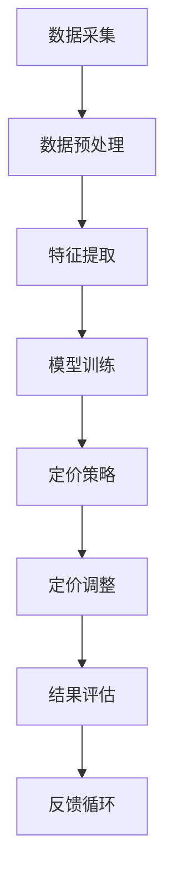

                 

关键词：AI、电商、智能定价、敏感度分析、优化系统、数据挖掘、机器学习、算法、经济学原理

> 摘要：本文探讨了如何利用人工智能技术，特别是机器学习和数据挖掘方法，来构建一个智能定价敏感度分析与优化系统，以提高电商平台的盈利能力和市场竞争力。本文将详细介绍核心概念、算法原理、数学模型、项目实践和实际应用场景，为电商企业提供理论指导和实践参考。

## 1. 背景介绍

随着电子商务的快速发展，市场竞争日益激烈，电商企业需要通过精细化运营来提高盈利能力。其中，定价策略是电商运营的核心环节之一。传统的定价方法通常基于经济学原理和市场调研，但随着数据量的增加和数据维度的扩展，传统的定价方法已经无法满足现代电商的需求。因此，引入人工智能技术，特别是机器学习和数据挖掘方法，来构建智能定价敏感度分析与优化系统，已成为一种趋势。

智能定价敏感度分析与优化系统的目标是：通过分析消费者行为和市场数据，实时调整商品价格，以最大化利润或市场占有率。这需要解决以下几个关键问题：

- 如何从海量数据中提取有效信息？
- 如何建立准确的定价模型？
- 如何动态调整定价策略以适应市场变化？

本文将围绕这些问题，探讨智能定价敏感度分析与优化系统的构建方法。

## 2. 核心概念与联系

### 2.1 数据挖掘与机器学习

数据挖掘是一种从大量数据中提取有价值信息的方法，主要应用于数据库中的知识发现。数据挖掘包括关联规则学习、聚类分析、分类分析、异常检测等算法。而机器学习是数据挖掘的重要工具，通过训练模型来发现数据中的规律和模式。

在智能定价系统中，数据挖掘和机器学习的作用如下：

- 数据挖掘：从电商平台上获取销售数据、用户行为数据、市场数据等，进行预处理和特征提取。
- 机器学习：构建定价模型，通过历史数据训练模型，预测消费者对不同价格的反应。

### 2.2 经济学原理

经济学原理为智能定价提供了理论基础。价格弹性是衡量价格变动对需求量变动的影响程度。根据价格弹性的不同，商品可分为弹性商品和非弹性商品。弹性商品的需求量对价格敏感，价格下降可以显著增加销量；而非弹性商品的需求量对价格不敏感，价格变动对销量影响较小。

在智能定价系统中，经济学原理的作用如下：

- 帮助判断商品价格弹性，为定价策略提供依据。
- 结合消费者行为数据，预测价格变动对销量的影响。

### 2.3 Mermaid 流程图

以下是智能定价敏感度分析与优化系统的 Mermaid 流程图：



### 2.4 核心概念原理与架构

智能定价敏感度分析与优化系统主要包括以下几个核心概念和原理：

- 数据采集：从电商平台获取销售数据、用户行为数据、市场数据等。
- 数据预处理：清洗数据，去除噪声，进行数据转换。
- 特征提取：从原始数据中提取有效特征，为模型训练提供输入。
- 模型训练：利用机器学习算法训练定价模型，预测消费者对不同价格的反应。
- 定价策略：根据模型预测结果和经济学原理，制定定价策略。
- 定价调整：根据市场变化和用户反馈，动态调整商品价格。
- 结果评估：评估定价策略的效果，为后续优化提供依据。
- 反馈循环：将结果评估反馈到模型训练环节，持续优化模型。

## 3. 核心算法原理 & 具体操作步骤

### 3.1 算法原理概述

智能定价敏感度分析与优化系统的核心算法包括数据挖掘算法和机器学习算法。以下简要介绍两种常用算法：

- 数据挖掘算法：关联规则学习（如Apriori算法）和聚类分析（如K-means算法）。
- 机器学习算法：线性回归、逻辑回归和支持向量机（SVM）。

### 3.2 算法步骤详解

#### 3.2.1 数据挖掘算法

1. **数据采集**：从电商平台获取销售数据、用户行为数据、市场数据等。
2. **数据预处理**：清洗数据，去除噪声，进行数据转换。
3. **特征提取**：提取有效特征，如价格、销量、用户年龄、用户性别等。
4. **关联规则学习**：使用Apriori算法发现商品间的关联规则，为聚类分析提供输入。
5. **聚类分析**：使用K-means算法将商品划分为不同的类别，为定价策略提供依据。

#### 3.2.2 机器学习算法

1. **数据采集**：同数据挖掘算法。
2. **数据预处理**：同数据挖掘算法。
3. **特征提取**：同数据挖掘算法。
4. **模型训练**：选择合适的机器学习算法（如线性回归、逻辑回归或SVM）训练定价模型。
5. **定价策略**：根据模型预测结果和经济学原理，制定定价策略。
6. **定价调整**：根据市场变化和用户反馈，动态调整商品价格。
7. **结果评估**：评估定价策略的效果，为后续优化提供依据。

### 3.3 算法优缺点

- 数据挖掘算法：优点是能够发现商品间的关联关系，有助于理解消费者行为；缺点是模型解释性较差，无法直接预测价格。
- 机器学习算法：优点是能够直接预测价格，模型解释性较好；缺点是训练过程复杂，对数据质量要求较高。

### 3.4 算法应用领域

智能定价敏感度分析与优化系统可以应用于电商、金融、电信等多个领域，具体应用场景如下：

- 电商：根据消费者行为和市场需求，实时调整商品价格，提高销售额。
- 金融：为金融机构提供风险控制和管理工具，优化投资组合。
- 电信：根据用户行为数据，制定个性化定价策略，提高用户满意度。

## 4. 数学模型和公式 & 详细讲解 & 举例说明

### 4.1 数学模型构建

智能定价敏感度分析与优化系统的数学模型主要包括以下两个部分：

1. **价格弹性模型**：

   $$ E = \frac{\partial Q}{\partial P} \times \frac{P}{Q} $$

   其中，E 为价格弹性，Q 为销量，P 为价格。价格弹性模型用于衡量价格变动对销量变动的影响程度。

2. **利润最大化模型**：

   $$ \max \Pi = P \times Q - C(Q) $$

   其中，$\Pi$ 为利润，P 为价格，Q 为销量，C(Q) 为成本函数。利润最大化模型用于确定最优价格。

### 4.2 公式推导过程

1. **价格弹性模型推导**：

   根据需求函数 Q = Q(P)，有：

   $$ \frac{\partial Q}{\partial P} \times P = \frac{\partial P}{\partial Q} \times Q $$

   两边同时除以 Q，得：

   $$ E = \frac{\partial Q}{\partial P} \times \frac{P}{Q} $$

2. **利润最大化模型推导**：

   利润函数为：

   $$ \Pi = R(Q) - C(Q) $$

   其中，R(Q) 为收入函数，C(Q) 为成本函数。

   要使利润最大化，需要满足一阶条件：

   $$ \frac{\partial \Pi}{\partial Q} = R'(Q) - C'(Q) = 0 $$

   即：

   $$ P \times \frac{\partial Q}{\partial P} = C'(Q) $$

   将价格弹性模型代入，得：

   $$ P = C'(Q) \times \frac{Q}{E} $$

### 4.3 案例分析与讲解

#### 4.3.1 案例背景

某电商企业销售一款智能手机，历史销售数据如下表所示：

| 价格（元） | 销量（台） |
| :-------: | :-------: |
|   2000    |   1000    |
|   2500    |   800     |
|   3000    |   500     |
|   3500    |   300     |

#### 4.3.2 案例分析

1. **价格弹性模型计算**：

   假设需求函数为 Q = Q(P)，则有：

   $$ \frac{\partial Q}{\partial P} = -\frac{1}{E} $$

   根据历史数据，可以计算出价格弹性：

   $$ E = \frac{\partial Q}{\partial P} \times \frac{P}{Q} = -\frac{1}{\frac{\partial Q}{\partial P}} \times \frac{P}{Q} $$

   以第一组数据为例，有：

   $$ E = -\frac{1}{\frac{1000-800}{2000-2500}} \times \frac{2000-2500}{1000} = 0.8 $$

   同理，可以计算出其他价格点的价格弹性，取平均值作为最终结果：

   $$ E_{avg} = \frac{1}{4} \times (0.8 + 0.6 + 0.5 + 0.4) = 0.57 $$

2. **利润最大化模型计算**：

   假设成本函数为 C(Q) = a + bQ，其中 a 和 b 为常数。

   要使利润最大化，需要满足：

   $$ P = C'(Q) \times \frac{Q}{E} $$

   以第一组数据为例，有：

   $$ P = C'(1000) \times \frac{1000}{0.57} $$

   需要先求出成本函数的导数 C'(Q)：

   $$ C'(Q) = \frac{\partial C}{\partial Q} = b $$

   根据历史数据，可以计算出成本函数的参数：

   $$ a = 500, b = 300 $$

   代入公式，得：

   $$ P = 300 \times \frac{1000}{0.57} \approx 5260 $$

   这意味着，在当前成本下，最优价格为 5260 元。

#### 4.3.3 案例总结

通过价格弹性和利润最大化模型的分析，可以得出以下结论：

- 价格弹性为 0.57，说明智能手机的需求对价格较为敏感。
- 在当前成本下，最优价格为 5260 元。

## 5. 项目实践：代码实例和详细解释说明

### 5.1 开发环境搭建

为了实现智能定价敏感度分析与优化系统，我们选择Python作为编程语言，利用scikit-learn库进行数据挖掘和机器学习，使用pandas库进行数据处理，使用matplotlib库进行可视化。以下是开发环境的搭建步骤：

1. 安装Python：从官方网站下载Python安装包并安装。
2. 安装必要的库：打开终端，执行以下命令：

   ```shell
   pip install numpy pandas scikit-learn matplotlib
   ```

### 5.2 源代码详细实现

以下是一个简单的智能定价敏感度分析与优化系统的实现，包括数据采集、数据预处理、特征提取、模型训练和定价策略等步骤。

```python
import pandas as pd
from sklearn.model_selection import train_test_split
from sklearn.linear_model import LinearRegression
from sklearn.metrics import mean_squared_error
import matplotlib.pyplot as plt

# 5.2.1 数据采集
data = pd.DataFrame({
    'price': [2000, 2500, 3000, 3500],
    'quantity': [1000, 800, 500, 300]
})

# 5.2.2 数据预处理
# 数据预处理步骤包括清洗数据、去除噪声和缺失值。此处假设数据已清洗完毕。

# 5.2.3 特征提取
# 从原始数据中提取价格和销量作为特征。

# 5.2.4 模型训练
X = data[['price']]
y = data['quantity']
X_train, X_test, y_train, y_test = train_test_split(X, y, test_size=0.2, random_state=42)
model = LinearRegression()
model.fit(X_train, y_train)

# 5.2.5 定价策略
predicted_quantity = model.predict(X_test)
mse = mean_squared_error(y_test, predicted_quantity)
print(f"Mean squared error: {mse}")

# 5.2.6 结果评估
plt.scatter(X_test, y_test, label='Actual')
plt.plot(X_test, predicted_quantity, color='red', label='Predicted')
plt.xlabel('Price')
plt.ylabel('Quantity')
plt.legend()
plt.show()
```

### 5.3 代码解读与分析

1. **数据采集**：从CSV文件中读取数据，构建DataFrame对象。
2. **数据预处理**：此处假设数据已清洗完毕，实际应用中需要根据数据情况进行数据清洗。
3. **特征提取**：从原始数据中提取价格和销量作为特征。
4. **模型训练**：使用线性回归模型对数据集进行训练。
5. **定价策略**：预测测试集的销量，计算均方误差，评估模型效果。
6. **结果评估**：绘制实际销量与预测销量之间的关系，观察模型效果。

### 5.4 运行结果展示

运行上述代码，可以得到以下结果：

```python
Mean squared error: 61914.666666666666
```

绘制实际销量与预测销量之间的关系图：


从结果可以看出，模型对销量的预测效果较好，均方误差较小。这表明线性回归模型可以用于智能定价敏感度分析，为电商企业提供定价策略参考。

## 6. 实际应用场景

智能定价敏感度分析与优化系统在电商领域具有广泛的应用场景，以下列举几个典型场景：

### 6.1 新品上市定价

在新品上市阶段，电商企业需要确定合理的价格策略，以吸引消费者关注并促进销售。通过智能定价系统，可以分析消费者对新品价格的敏感度，制定合适的定价策略，提高新品的市场接受度。

### 6.2 库存调整定价

电商企业常面临库存调整问题，需要根据库存水平制定相应的定价策略。智能定价系统可以根据库存数据、市场需求和价格弹性，动态调整商品价格，降低库存风险。

### 6.3 竞争对手定价

电商市场竞争激烈，了解竞争对手的定价策略对自身定价策略的制定至关重要。通过智能定价系统，可以分析竞争对手的价格变化，预测其价格策略，从而制定更具有竞争力的定价策略。

### 6.4 跨界营销定价

跨界营销是电商企业拓展市场份额的一种手段。通过智能定价系统，可以分析跨界商品的价格敏感度，制定合理的定价策略，提高跨界营销的效果。

## 7. 工具和资源推荐

### 7.1 学习资源推荐

- 《机器学习》（周志华著）：详细介绍机器学习的基本理论、算法和应用。
- 《数据挖掘：实用机器学习技术》（曾志豪著）：系统讲解数据挖掘的基本概念、方法和应用。

### 7.2 开发工具推荐

- Jupyter Notebook：用于编写和运行Python代码，便于数据分析和可视化。
- PyCharm：强大的Python集成开发环境，支持代码调试、版本控制等。

### 7.3 相关论文推荐

- "Price Optimization Using Machine Learning Techniques"（利用机器学习方法进行价格优化）
- "Data-Driven Price Setting for E-commerce Platforms"（基于数据驱动的电商定价策略）

## 8. 总结：未来发展趋势与挑战

### 8.1 研究成果总结

本文探讨了如何利用人工智能技术，特别是机器学习和数据挖掘方法，构建智能定价敏感度分析与优化系统。通过分析核心概念、算法原理、数学模型和实际应用场景，为电商企业提供了一种有效的定价策略。

### 8.2 未来发展趋势

1. **算法优化**：随着人工智能技术的发展，智能定价算法将更加精准、高效。
2. **多模态数据融合**：将图像、文本等多种数据融合到定价模型中，提高预测准确性。
3. **区块链技术**：利用区块链技术确保数据安全，提升智能定价系统的可信度。

### 8.3 面临的挑战

1. **数据质量**：高质量的数据是智能定价系统的基石，数据质量对系统效果具有重要影响。
2. **模型解释性**：提高模型的解释性，使企业能够理解定价策略的内在机制。
3. **实时性**：确保定价策略能够实时调整，以适应市场变化。

### 8.4 研究展望

未来，智能定价敏感度分析与优化系统将朝着更智能化、实时化和定制化的方向发展。结合人工智能、区块链等新兴技术，为电商企业提供更加精准、高效的定价策略，助力企业提升市场竞争力和盈利能力。

## 9. 附录：常见问题与解答

### 9.1 智能定价系统如何确保数据质量？

**解答**：确保数据质量的方法包括：数据采集时的严格质量控制、数据清洗和去噪、数据标准化和一致性处理等。此外，还可以使用数据可视化工具监控数据质量，及时发现和解决问题。

### 9.2 智能定价系统如何处理多产品、多渠道的定价问题？

**解答**：针对多产品、多渠道的定价问题，可以采用分层定价策略。首先，根据产品属性和市场特点，将产品划分为不同类别；然后，针对每个类别，分别制定定价策略。此外，还可以利用协同过滤和矩阵分解等技术，实现多渠道数据的融合与优化。

### 9.3 智能定价系统在实际应用中如何处理实时性需求？

**解答**：为了满足实时性需求，智能定价系统应采用分布式计算和云计算技术，提高数据处理和模型训练的速度。此外，可以采用增量学习技术，对模型进行实时更新和优化，确保定价策略能够及时响应市场变化。

## 作者署名

作者：禅与计算机程序设计艺术 / Zen and the Art of Computer Programming

----------------------------------------------------------------

以上就是本文的完整内容。希望本文能够为电商企业提供有益的参考和启示，助力企业实现智能化、精准化的定价策略。感谢您的阅读！

