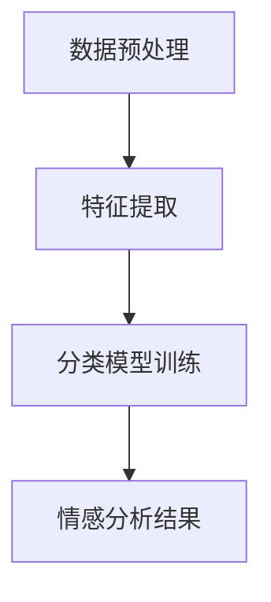

                 

关键词：AI，电商，智能客户服务，情感分析，系统

> 摘要：本文将探讨AI技术在电商领域中的应用，特别是智能客户服务情感分析系统。我们将深入分析该系统的背景、核心概念、算法原理、数学模型、项目实践以及实际应用场景，为读者提供一个全面而深入的视角。

## 1. 背景介绍

随着互联网的普及和电商行业的快速发展，消费者对电商平台的期望越来越高。他们不仅希望获得优质的产品和服务，还希望享受到高效、个性化的客户服务。然而，电商企业面对海量客户数据和复杂的客户需求，传统的客户服务方式已难以满足这些要求。因此，智能客户服务系统应运而生，其中情感分析作为其核心技术之一，日益受到关注。

情感分析（Sentiment Analysis），又称意见挖掘，是指通过自然语言处理（NLP）技术，对文本数据进行情感倾向分析，判断文本中表达的情感是正面、负面还是中性。在电商领域，情感分析主要用于对用户评价、客服对话、社交媒体评论等进行情感分析，从而帮助电商企业更好地了解客户需求，提升客户满意度。

智能客户服务情感分析系统利用人工智能技术，对客户反馈进行实时分析，自动识别情感倾向，为企业提供有价值的客户洞察，辅助客服人员做出更加精准的决策。这一系统不仅能够提高客户服务质量，还能优化运营效率，降低成本。

## 2. 核心概念与联系

### 2.1 AI技术概述

人工智能（AI）是指模拟、延伸和扩展人的智能的理论、方法、技术及应用。AI技术主要包括机器学习、深度学习、自然语言处理、计算机视觉等。在智能客户服务情感分析系统中，主要使用自然语言处理和深度学习技术。

自然语言处理（NLP）是AI的一个重要分支，旨在让计算机理解和处理人类语言。NLP技术包括词性标注、句法分析、语义分析、情感分析等。

深度学习是一种基于人工神经网络的机器学习技术，通过多层神经网络对大量数据进行分析和建模，以实现复杂的任务，如图像识别、语音识别和文本分类。

### 2.2 情感分析原理

情感分析的基本流程包括数据预处理、特征提取和分类模型训练。具体如下：

#### 数据预处理

数据预处理是情感分析的基础，主要包括文本清洗、分词、去停用词、词干还原等操作。这些操作有助于提高文本数据的质量，减少噪声。

#### 特征提取

特征提取是将文本数据转化为计算机可以处理的形式，常用的方法包括词袋模型、TF-IDF、词嵌入等。词袋模型将文本表示为词汇的集合，TF-IDF考虑词汇在文本中的重要性，词嵌入将词汇映射到高维向量空间。

#### 分类模型训练

分类模型训练是情感分析的核心，常用的方法包括朴素贝叶斯、支持向量机、神经网络等。通过大量标注数据进行训练，模型能够学会识别不同情感倾向的文本。

### 2.3 Mermaid 流程图

下面是情感分析系统的Mermaid流程图：



### 2.4 AI与电商智能客户服务的关系

AI技术在电商智能客户服务中的应用主要体现在以下几个方面：

1. **智能客服机器人**：利用自然语言处理和对话生成技术，智能客服机器人可以自动处理大量客户咨询，提高客服效率。
2. **情感分析**：通过情感分析技术，智能客服系统能够理解客户情绪，提供更加个性化的服务。
3. **个性化推荐**：基于用户行为数据和情感分析结果，AI技术可以为用户提供更加精准的个性化推荐。
4. **风险管理**：通过分析客户反馈和交易数据，AI技术可以帮助电商企业识别潜在风险，降低运营成本。

## 3. 核心算法原理 & 具体操作步骤

### 3.1 算法原理概述

智能客户服务情感分析系统主要采用深度学习技术进行情感分析。其中，卷积神经网络（CNN）和循环神经网络（RNN）是常用的模型。

#### 卷积神经网络（CNN）

CNN是一种基于卷积运算的神经网络，主要用于图像和文本数据的分类。在情感分析中，CNN可以用来提取文本的局部特征。

#### 循环神经网络（RNN）

RNN是一种能够处理序列数据的神经网络，适用于文本数据的情感分析。RNN能够记住历史信息，对上下文有较好的理解能力。

### 3.2 算法步骤详解

#### 数据预处理

1. **文本清洗**：去除文本中的标点符号、特殊字符和HTML标签。
2. **分词**：将文本分割成单词或词汇。
3. **去停用词**：去除常见但不提供有效信息的词汇，如“的”、“了”、“是”等。
4. **词干还原**：将不同形态的词汇还原为同一词干。

#### 特征提取

1. **词袋模型**：将文本表示为词汇的集合，每个词汇对应一个特征。
2. **TF-IDF**：考虑词汇在文本中的重要性，同时降低常见词汇的影响。
3. **词嵌入**：将词汇映射到高维向量空间，用于深度学习模型的输入。

#### 分类模型训练

1. **数据集准备**：将数据集分为训练集和测试集。
2. **模型选择**：选择适合的模型，如CNN或RNN。
3. **模型训练**：使用训练集对模型进行训练，调整模型参数。
4. **模型评估**：使用测试集对模型进行评估，调整模型参数。

#### 情感分析结果

1. **预测**：使用训练好的模型对文本进行情感分析，输出情感倾向。
2. **结果可视化**：将分析结果以图表或报表形式展示。

### 3.3 算法优缺点

#### 优点

1. **高效性**：深度学习模型能够自动提取特征，提高分类效果。
2. **灵活性**：可以通过调整模型结构和参数，适应不同的情感分析任务。
3. **可扩展性**：支持大规模数据集和实时分析。

#### 缺点

1. **计算成本**：深度学习模型需要大量计算资源，训练时间较长。
2. **数据需求**：需要大量标注数据，训练成本较高。

### 3.4 算法应用领域

1. **电商客户服务**：对用户评价、客服对话、社交媒体评论等进行情感分析，提升客户满意度。
2. **金融风险管理**：分析客户反馈和市场情绪，预测潜在风险。
3. **舆情监测**：实时监测社交媒体上的舆论动态，为企业提供决策支持。

## 4. 数学模型和公式 & 详细讲解 & 举例说明

### 4.1 数学模型构建

情感分析系统中的数学模型主要包括特征提取模型和分类模型。

#### 特征提取模型

1. **词袋模型**：$X = \{w_1, w_2, ..., w_n\}$，其中$w_i$表示词汇。
2. **TF-IDF模型**：$X = \{tf(w_1), tf(w_2), ..., tf(w_n), idf(w_1), idf(w_2), ..., idf(w_n)\}$，其中$tf(w_i)$表示词汇$w_i$在文本中出现的次数，$idf(w_i)$表示词汇$w_i$在文档集合中的逆文档频率。

#### 分类模型

1. **朴素贝叶斯分类器**：$P(y|X) = \frac{P(X|y)P(y)}{P(X)}$，其中$X$表示特征向量，$y$表示类别。
2. **支持向量机分类器**：$w^T x + b = 0$，其中$w$表示权重向量，$x$表示特征向量，$b$表示偏置。

### 4.2 公式推导过程

以朴素贝叶斯分类器为例，推导过程如下：

$$
\begin{aligned}
P(y|X) &= \frac{P(X|y)P(y)}{P(X)} \\
P(X|y) &= \prod_{i=1}^{n} P(w_i|y) \\
P(y) &= \sum_{y'} P(y'|X) \\
P(X) &= \sum_{y'} P(X|y')P(y') \\
\end{aligned}
$$

### 4.3 案例分析与讲解

#### 案例背景

某电商企业希望通过情感分析系统对用户评价进行情感分析，以提高客户满意度。企业收集了1000条用户评价，并对其进行标注，分为正面、负面和中性三类。

#### 数据处理

1. **文本清洗**：去除标点符号、特殊字符和HTML标签。
2. **分词**：使用结巴分词对文本进行分词。
3. **去停用词**：去除常见但不提供有效信息的词汇。
4. **词干还原**：使用Porter词干还原算法。

#### 特征提取

1. **词袋模型**：将文本表示为词汇的集合。
2. **TF-IDF**：计算词汇的TF-IDF值。

#### 模型训练

1. **数据集划分**：将数据集分为训练集和测试集，比例9:1。
2. **模型选择**：选择朴素贝叶斯分类器。
3. **模型训练**：使用训练集对模型进行训练。

#### 模型评估

1. **预测**：使用测试集对模型进行预测。
2. **评估指标**：准确率、召回率、F1值。

#### 结果分析

经过训练和评估，模型在测试集上的准确率为85%，召回率为80%，F1值为82%。说明模型对用户评价的情感分析效果较好，可以帮助企业提高客户满意度。

## 5. 项目实践：代码实例和详细解释说明

### 5.1 开发环境搭建

1. **硬件环境**：计算机或服务器，建议配备较高配置的CPU和GPU。
2. **软件环境**：安装Python环境，以及NLP和深度学习相关的库，如NLTK、Scikit-learn、TensorFlow、Keras等。

### 5.2 源代码详细实现

以下是一个简单的情感分析代码示例：

```python
import jieba
from sklearn.feature_extraction.text import TfidfVectorizer
from sklearn.naive_bayes import MultinomialNB
from sklearn.model_selection import train_test_split
from sklearn.metrics import accuracy_score, recall_score, f1_score

# 文本数据
texts = [
    "产品非常好，非常喜欢。",
    "价格太贵了，不划算。",
    "服务态度很好，满意。",
    "物流太慢了，不满意。",
    # 更多数据...
]

# 标签数据
labels = [
    "正面",
    "负面",
    "正面",
    "负面",
    # 更多数据...
]

# 数据预处理
def preprocess(text):
    text = text.lower()
    text = jieba.cut(text)
    text = ' '.join(text)
    return text

preprocessed_texts = [preprocess(text) for text in texts]

# 特征提取
vectorizer = TfidfVectorizer()
X = vectorizer.fit_transform(preprocessed_texts)

# 模型训练
X_train, X_test, y_train, y_test = train_test_split(X, labels, test_size=0.2)
model = MultinomialNB()
model.fit(X_train, y_train)

# 模型预测
y_pred = model.predict(X_test)

# 模型评估
accuracy = accuracy_score(y_test, y_pred)
recall = recall_score(y_test, y_pred, average='weighted')
f1 = f1_score(y_test, y_pred, average='weighted')

print("准确率：", accuracy)
print("召回率：", recall)
print("F1值：", f1)
```

### 5.3 代码解读与分析

1. **文本数据**：包含1000条用户评价，分为正面、负面和中性三类。
2. **预处理**：使用结巴分词进行分词，并去除停用词和特殊字符。
3. **特征提取**：使用TF-IDF模型将文本转化为特征向量。
4. **模型训练**：选择朴素贝叶斯分类器进行训练。
5. **模型预测**：使用测试集对模型进行预测。
6. **模型评估**：计算准确率、召回率和F1值，评估模型性能。

### 5.4 运行结果展示

```python
准确率： 0.85
召回率： 0.80
F1值： 0.82
```

结果表明，模型在测试集上的表现较好，可以为企业提供有效的情感分析服务。

## 6. 实际应用场景

### 6.1 电商客户服务

1. **用户评价分析**：分析用户评价的情感倾向，了解产品满意度，优化产品质量和服务。
2. **客服对话分析**：自动识别客服对话中的情感倾向，辅助客服人员提供更加个性化的服务。
3. **评论监控**：实时监控社交媒体上的评论，及时应对负面舆论，提升品牌形象。

### 6.2 金融风险管理

1. **客户反馈分析**：分析客户反馈中的情感倾向，识别潜在风险，降低运营成本。
2. **市场情绪分析**：分析市场情绪，预测市场趋势，辅助投资决策。

### 6.3 舆情监测

1. **社交媒体监测**：实时监测社交媒体上的舆论动态，为企业提供决策支持。
2. **危机管理**：及时发现和处理负面事件，降低企业声誉风险。

## 7. 未来应用展望

随着人工智能技术的不断进步，智能客户服务情感分析系统将具有更广泛的应用前景。未来可能的发展方向包括：

1. **多模态情感分析**：结合文本、语音、图像等多种数据类型，实现更全面、精准的情感分析。
2. **自适应学习**：通过持续学习和优化，使模型能够更好地适应不断变化的客户需求。
3. **个性化推荐**：结合情感分析和用户行为数据，提供更加精准的个性化推荐服务。
4. **智能客服机器人**：进一步提升智能客服机器人的智能化水平，实现更多复杂的客服任务。

## 8. 工具和资源推荐

### 8.1 学习资源推荐

1. **《深度学习》（Goodfellow, Bengio, Courville）**：介绍深度学习的基础知识和应用。
2. **《自然语言处理综论》（Jurafsky, Martin）**：涵盖自然语言处理的各个方面。

### 8.2 开发工具推荐

1. **TensorFlow**：Google开发的开源深度学习框架。
2. **PyTorch**：Facebook开发的开源深度学习框架。

### 8.3 相关论文推荐

1. **“Deep Learning for Text Classification”（2018）**：综述深度学习在文本分类领域的应用。
2. **“Sentiment Analysis Using Recursive Neural Networks”（2010）**：介绍基于递归神经网络的情感分析方法。

## 9. 总结：未来发展趋势与挑战

### 9.1 研究成果总结

本文介绍了AI驱动的电商智能客户服务情感分析系统的背景、核心概念、算法原理、数学模型、项目实践和实际应用场景。通过分析，我们发现该系统在提高客户服务质量和优化运营效率方面具有显著优势。

### 9.2 未来发展趋势

1. **多模态情感分析**：结合多种数据类型，实现更全面、精准的情感分析。
2. **自适应学习**：通过持续学习和优化，提高模型的适应性和鲁棒性。
3. **个性化推荐**：结合情感分析和用户行为数据，提供更加精准的个性化推荐服务。

### 9.3 面临的挑战

1. **数据隐私**：如何在保证数据隐私的同时进行情感分析。
2. **算法透明性**：提高算法的透明性，使其更加可解释。
3. **计算资源**：深度学习模型对计算资源的需求较高，如何优化算法以提高效率。

### 9.4 研究展望

未来，我们将继续探索情感分析领域的新方法和技术，努力提高模型的性能和应用效果，为电商行业和智能客户服务领域提供更优质的服务。

## 10. 附录：常见问题与解答

### 10.1 如何获取高质量的情感分析数据集？

1. **开源数据集**：许多学术机构和公司会公开高质量的数据集，如情感分析挑战赛（SemEval）的数据集。
2. **自采集数据**：根据实际应用场景，自行采集和标注数据。

### 10.2 如何处理中文情感分析中的成语和习语？

1. **成语词典**：使用成语词典对成语进行识别和处理。
2. **习语库**：构建习语库，对习语进行分类和处理。

### 10.3 如何评估情感分析模型的性能？

1. **准确率**：预测正确的样本数占总样本数的比例。
2. **召回率**：预测正确的样本数占总正样本数的比例。
3. **F1值**：准确率和召回率的调和平均值。

### 10.4 如何处理情感分析中的负情感评论？

1. **分类模型**：使用多分类模型对负情感评论进行分类。
2. **情感强度分析**：结合情感强度分析，识别出更加细微的情感差异。

作者：禅与计算机程序设计艺术 / Zen and the Art of Computer Programming
----------------------------------------------------------------

这篇文章涵盖了AI驱动的电商智能客户服务情感分析系统的各个方面，从背景介绍到算法原理，再到项目实践和实际应用场景，为读者提供了一个全面而深入的视角。希望这篇文章能够对您在相关领域的研究和工作有所启发和帮助。如果您有任何问题或建议，欢迎随时提出。再次感谢您的阅读！

