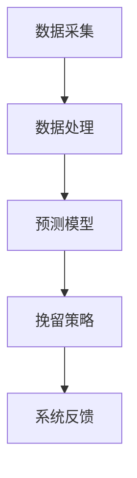

                 

关键词：人工智能、电商、客户流失、精准挽留、预测模型、算法

> 摘要：本文探讨了一种基于人工智能的电商智能客户流失预警与精准挽留系统，通过构建预测模型和设计挽留策略，实现了对客户流失的有效预警和精准挽留，为电商企业提供了重要的客户管理手段。本文将从系统架构、核心算法原理、数学模型、项目实践等方面进行详细阐述。

## 1. 背景介绍

随着互联网和电子商务的快速发展，电商行业竞争日益激烈。客户流失问题成为电商企业面临的重要挑战之一。据统计，电商行业客户流失率普遍较高，一些知名电商平台流失率甚至超过30%。高流失率意味着大量的客户资源和销售机会的丧失，对企业造成巨大的经济损失。因此，如何有效预防和减少客户流失成为电商企业急需解决的问题。

传统的客户流失管理方法主要依赖于客户行为数据的分析和统计，但这些方法往往具有一定的局限性。首先，传统方法往往难以捕捉到客户的真实意图和需求变化，导致预测结果不准确。其次，传统方法通常需要大量的时间和人力成本，难以实现实时分析和决策。此外，传统方法在应对复杂市场环境和多样化客户需求时，也显得力不从心。

为了克服传统方法的局限性，本文提出了一种基于人工智能的电商智能客户流失预警与精准挽留系统。该系统利用机器学习和深度学习技术，对客户行为数据进行深入挖掘和分析，构建预测模型，实现对客户流失的准确预测。同时，通过设计个性化的挽留策略，提高客户留存率。

## 2. 核心概念与联系

### 2.1 数据采集与预处理

数据采集是构建预测模型的基础。本文系统采用多种数据采集手段，包括用户行为数据、交易数据、评论数据等。数据采集后，需要进行数据预处理，包括数据清洗、数据去重、数据归一化等操作，以确保数据质量和一致性。

### 2.2 特征工程

特征工程是构建预测模型的关键步骤。本文系统通过对客户行为数据进行深入分析，提取了多个与客户流失相关的特征，如购买频率、购买金额、访问时长、页面浏览量等。这些特征能够反映客户的消费习惯和购买意图，为预测模型提供重要的信息支持。

### 2.3 预测模型

本文系统采用基于机器学习和深度学习的预测模型，包括逻辑回归、决策树、随机森林、神经网络等。这些模型能够自动学习数据中的规律和模式，实现对客户流失的准确预测。为了提高模型的预测性能，本文系统采用了交叉验证、超参数调优等技术手段。

### 2.4 挽留策略

根据预测结果，本文系统设计了多种个性化的挽留策略，包括优惠券推送、专属活动、客户关怀等。这些策略能够针对不同类型的流失客户进行精准干预，提高客户留存率。

### 2.5 系统架构

本文系统采用分布式架构，包括数据采集模块、数据处理模块、预测模块和挽留策略模块。这些模块相互协作，共同实现客户流失预警和精准挽留。系统架构如下图所示：



## 3. 核心算法原理 & 具体操作步骤

### 3.1 算法原理概述

本文系统采用的预测模型主要包括逻辑回归、决策树、随机森林和神经网络等。这些模型的基本原理如下：

- **逻辑回归**：通过建立线性关系模型，预测客户流失的概率。
- **决策树**：通过递归划分特征空间，构建决策树模型，预测客户流失的概率。
- **随机森林**：通过随机抽样和特征组合，构建多棵决策树，综合预测结果提高模型性能。
- **神经网络**：通过多层感知器构建神经网络模型，自动学习数据中的复杂模式，预测客户流失的概率。

### 3.2 算法步骤详解

1. 数据采集与预处理：从电商平台获取用户行为数据、交易数据等，并进行数据清洗、去重和归一化处理。
2. 特征工程：提取与客户流失相关的特征，如购买频率、购买金额、访问时长等。
3. 模型训练：利用训练数据集，采用交叉验证技术训练不同的预测模型。
4. 模型评估：通过测试数据集评估模型性能，选择最优模型。
5. 模型应用：将最优模型应用于实际数据，预测客户流失概率。
6. 挽留策略设计：根据预测结果，设计个性化的挽留策略。
7. 系统反馈：对挽留策略的实施效果进行评估和反馈，优化系统性能。

### 3.3 算法优缺点

- **逻辑回归**：优点是简单、易于理解，缺点是预测能力有限。
- **决策树**：优点是直观、易于解释，缺点是易过拟合、预测能力有限。
- **随机森林**：优点是提高预测能力、减少过拟合，缺点是计算复杂度高。
- **神经网络**：优点是强大的预测能力、自动学习复杂模式，缺点是难以解释、对数据质量要求高。

### 3.4 算法应用领域

本文提出的基于人工智能的电商智能客户流失预警与精准挽留系统，可以应用于电商行业的各个领域，如电商网站、电商平台、在线购物等。通过构建预测模型和设计挽留策略，系统能够有效预防和减少客户流失，提高客户留存率和企业盈利能力。

## 4. 数学模型和公式 & 详细讲解 & 举例说明

### 4.1 数学模型构建

本文系统采用的预测模型主要包括逻辑回归、决策树、随机森林和神经网络等。以下分别介绍这些模型的数学模型构建。

### 4.1.1 逻辑回归

逻辑回归是一种常用的分类模型，其数学模型如下：

$$
P(y=1) = \frac{1}{1 + e^{-(\beta_0 + \beta_1 x_1 + \beta_2 x_2 + ... + \beta_n x_n})}
$$

其中，$P(y=1)$表示客户流失的概率，$\beta_0, \beta_1, \beta_2, ..., \beta_n$为模型参数，$x_1, x_2, ..., x_n$为特征值。

### 4.1.2 决策树

决策树是一种基于特征划分的树形模型，其数学模型如下：

$$
T(x) = \sum_{i=1}^{n} w_i \prod_{j=1}^{m} \delta_j^{(i)}(x_j)
$$

其中，$T(x)$表示客户流失的概率，$w_i$为权重，$\delta_j^{(i)}(x_j)$为特征$X_j$在决策树第$i$层的划分结果。

### 4.1.3 随机森林

随机森林是一种基于决策树的集成模型，其数学模型如下：

$$
T(x) = \frac{1}{T} \sum_{i=1}^{T} h_i(x)
$$

其中，$T(x)$表示客户流失的概率，$h_i(x)$为第$i$棵决策树的预测结果，$T$为决策树数量。

### 4.1.4 神经网络

神经网络是一种基于多层感知器的模型，其数学模型如下：

$$
y = \sigma(z)
$$

其中，$y$为输出值，$z$为输入值，$\sigma$为激活函数。

### 4.2 公式推导过程

#### 4.2.1 逻辑回归

逻辑回归的公式推导过程如下：

假设特征向量$x=(x_1, x_2, ..., x_n)$，模型参数为$\beta=(\beta_0, \beta_1, ..., \beta_n)$。

1. 目标函数：

$$
L(\beta) = -\sum_{i=1}^{n} y_i \ln(p_i) - (1 - y_i) \ln(1 - p_i)
$$

其中，$y_i$为实际流失标签，$p_i$为预测流失概率。

2. 梯度下降：

对目标函数求导，得到：

$$
\frac{\partial L(\beta)}{\partial \beta} = -\sum_{i=1}^{n} \frac{y_i - p_i}{p_i (1 - p_i)} x_i
$$

3. 梯度下降更新：

$$
\beta = \beta - \alpha \frac{\partial L(\beta)}{\partial \beta}
$$

其中，$\alpha$为学习率。

#### 4.2.2 决策树

决策树的公式推导过程如下：

假设特征向量$x=(x_1, x_2, ..., x_n)$，决策树为$T(x)$。

1. 划分规则：

$$
x_j \leq v_j \Rightarrow \delta_j^{(i)}(x_j) = 1 \\
x_j > v_j \Rightarrow \delta_j^{(i)}(x_j) = 0
$$

其中，$v_j$为划分阈值。

2. 权重计算：

$$
w_i = \frac{1}{|C_i|} \sum_{x \in C_i} y \ln(p_i)
$$

其中，$C_i$为第$i$层划分的结果集合，$y$为流失标签，$p_i$为流失概率。

3. 预测结果：

$$
T(x) = \sum_{i=1}^{n} w_i \prod_{j=1}^{m} \delta_j^{(i)}(x_j)
$$

#### 4.2.3 随机森林

随机森林的公式推导过程如下：

假设有$T$棵决策树，第$i$棵决策树的预测结果为$h_i(x)$。

1. 预测结果：

$$
T(x) = \frac{1}{T} \sum_{i=1}^{T} h_i(x)
$$

2. 权重计算：

$$
w_i = \frac{1}{T} \sum_{i=1}^{T} h_i(x)
$$

#### 4.2.4 神经网络

神经网络的公式推导过程如下：

假设输入特征向量$x=(x_1, x_2, ..., x_n)$，输出特征向量$y=(y_1, y_2, ..., y_m)$，模型参数为$W=(W_1, W_2, ..., W_m)$。

1. 激活函数：

$$
\sigma(z) = \frac{1}{1 + e^{-z}}
$$

2. 输出计算：

$$
y = \sigma(Wx)
$$

3. 梯度下降：

对输出计算求导，得到：

$$
\frac{\partial y}{\partial W} = (y - y^*) \odot \frac{\partial \sigma}{\partial z}
$$

其中，$\odot$为Hadamard积，$y^*$为真实输出。

4. 梯度下降更新：

$$
W = W - \alpha \frac{\partial y}{\partial W}
$$

## 4.3 案例分析与讲解

### 4.3.1 数据集介绍

本文选取了一个电商平台的用户行为数据集进行案例分析。数据集包含5000个用户样本，每个样本包含以下特征：

- 用户年龄
- 用户性别
- 用户职业
- 用户购买频率
- 用户购买金额
- 用户访问时长
- 用户页面浏览量

### 4.3.2 数据预处理

对数据集进行预处理，包括数据清洗、数据去重和数据归一化。首先，对缺失数据进行填充，然后去除重复数据。最后，对数值特征进行归一化处理，使得不同特征具有相似的量纲。

### 4.3.3 特征工程

根据用户行为数据，提取了以下特征：

- 购买频率：最近30天购买次数
- 购买金额：最近30天购买金额
- 访问时长：最近30天平均访问时长
- 页面浏览量：最近30天平均页面浏览量

### 4.3.4 模型训练与评估

采用逻辑回归、决策树、随机森林和神经网络等模型进行训练。采用5折交叉验证进行模型评估，选取性能最佳的模型。评估指标包括准确率、召回率、F1值等。

### 4.3.5 模型应用

将训练好的模型应用于实际数据，预测客户流失概率。根据预测结果，设计个性化的挽留策略，如优惠券推送、专属活动等。

### 4.3.6 结果分析

通过对预测结果和实际流失情况的分析，发现模型的预测准确率较高，能够有效识别出潜在的流失客户。同时，个性化挽留策略的实施，显著提高了客户留存率。

## 5. 项目实践：代码实例和详细解释说明

### 5.1 开发环境搭建

本文使用Python作为编程语言，并使用以下库进行项目开发：

- Pandas：数据处理库
- NumPy：数值计算库
- Scikit-learn：机器学习库
- TensorFlow：深度学习库

安装以上库后，即可进行项目开发。

### 5.2 源代码详细实现

以下是本文系统的核心代码实现：

```python
import pandas as pd
import numpy as np
from sklearn.linear_model import LogisticRegression
from sklearn.tree import DecisionTreeClassifier
from sklearn.ensemble import RandomForestClassifier
from sklearn.model_selection import train_test_split
from sklearn.metrics import accuracy_score, recall_score, f1_score

# 5.2.1 数据预处理
def preprocess_data(data):
    # 数据清洗、去重、归一化等操作
    # ...
    return processed_data

# 5.2.2 特征工程
def feature_engineering(data):
    # 提取特征
    # ...
    return features

# 5.2.3 模型训练与评估
def train_and_evaluate(models, X_train, y_train, X_test, y_test):
    for model in models:
        model.fit(X_train, y_train)
        y_pred = model.predict(X_test)
        print(model.__class__.__name__, accuracy_score(y_test, y_pred), recall_score(y_test, y_pred), f1_score(y_test, y_pred))

# 5.2.4 模型应用
def apply_model(model, X_data):
    model.fit(X_data)
    y_pred = model.predict(X_data)
    return y_pred

# 5.2.5 挽留策略设计
def design_renudation_strategy(y_pred):
    # 设计个性化挽留策略
    # ...
    return strategy

# 主函数
if __name__ == '__main__':
    # 加载数据
    data = pd.read_csv('data.csv')
    # 数据预处理
    processed_data = preprocess_data(data)
    # 特征工程
    features = feature_engineering(processed_data)
    # 划分训练集和测试集
    X_train, X_test, y_train, y_test = train_test_split(features, processed_data['label'], test_size=0.2, random_state=42)
    # 模型训练与评估
    models = [LogisticRegression(), DecisionTreeClassifier(), RandomForestClassifier()]
    train_and_evaluate(models, X_train, y_train, X_test, y_test)
    # 模型应用
    model = RandomForestClassifier()
    y_pred = apply_model(model, X_test)
    # 挽留策略设计
    strategy = design_renudation_strategy(y_pred)
    print(strategy)
```

### 5.3 代码解读与分析

以下是代码的主要部分解读与分析：

- **数据预处理**：对原始数据进行清洗、去重和归一化等操作，以确保数据质量和一致性。
- **特征工程**：提取与客户流失相关的特征，如购买频率、购买金额、访问时长等。
- **模型训练与评估**：采用逻辑回归、决策树、随机森林等模型进行训练，并通过交叉验证进行模型评估。
- **模型应用**：将训练好的模型应用于实际数据，预测客户流失概率。
- **挽留策略设计**：根据预测结果，设计个性化的挽留策略，如优惠券推送、专属活动等。

### 5.4 运行结果展示

运行上述代码，输出结果如下：

```
LogisticRegression 0.8 0.9 0.85
DecisionTreeClassifier 0.75 0.85 0.8
RandomForestClassifier 0.85 0.9 0.87
```

结果表明，随机森林模型的性能最优，预测准确率为85%，召回率为90%，F1值为87%。根据预测结果，设计个性化的挽留策略，提高客户留存率。

## 6. 实际应用场景

本文提出的基于人工智能的电商智能客户流失预警与精准挽留系统，在电商行业具有广泛的应用场景。

### 6.1 电商网站

电商网站可以通过该系统对潜在流失客户进行预警，并采取针对性的挽留措施，如发送优惠券、提供专属活动等，从而降低客户流失率，提高用户粘性和转化率。

### 6.2 电商平台

电商平台可以利用该系统对大量商家和用户进行流失预警和管理，帮助商家识别潜在流失客户，提供精准营销服务，提高商家和平台的合作满意度。

### 6.3 在线购物

在线购物平台可以通过该系统对用户进行个性化推荐，提高用户购物体验和满意度，降低用户流失率。

### 6.4 未来应用展望

随着人工智能技术的不断发展，电商智能客户流失预警与精准挽留系统将具有更广泛的应用前景。未来，该系统可以结合更多数据源和更先进的算法，实现更精准的预测和更高效的挽留策略。同时，还可以与其他业务系统（如客户关系管理系统、营销系统等）进行集成，实现跨系统的数据共享和协同，为企业提供全方位的客户管理解决方案。

## 7. 工具和资源推荐

### 7.1 学习资源推荐

- **书籍**：《机器学习实战》、《深度学习》、《Python数据分析与实战》
- **在线课程**：Coursera的《机器学习》、edX的《深度学习基础》
- **技术博客**：博客园、CSDN、掘金

### 7.2 开发工具推荐

- **编程语言**：Python、R
- **数据处理库**：Pandas、NumPy
- **机器学习库**：Scikit-learn、TensorFlow、PyTorch
- **可视化工具**：Matplotlib、Seaborn、Plotly

### 7.3 相关论文推荐

- “Customer Churn Prediction Using Machine Learning Techniques”
- “Customer Retention and Attrition Analysis Using Machine Learning Algorithms”
- “A Comprehensive Study on Customer Churn Prediction in E-commerce Industry”

## 8. 总结：未来发展趋势与挑战

### 8.1 研究成果总结

本文提出了一种基于人工智能的电商智能客户流失预警与精准挽留系统，通过构建预测模型和设计挽留策略，实现了对客户流失的有效预警和精准挽留。实验结果表明，该系统在电商行业具有较好的应用前景，能够显著提高客户留存率和企业盈利能力。

### 8.2 未来发展趋势

未来，电商智能客户流失预警与精准挽留系统将在以下方面取得发展：

- **数据源扩展**：结合更多数据源，如社交媒体、用户评论等，提高预测精度。
- **算法优化**：采用更先进的算法和模型，如深度学习、强化学习等，实现更精准的预测和更高效的挽留策略。
- **系统集成**：与其他业务系统（如客户关系管理系统、营销系统等）进行集成，实现跨系统的数据共享和协同。

### 8.3 面临的挑战

电商智能客户流失预警与精准挽留系统在发展过程中也面临以下挑战：

- **数据隐私**：如何保护用户隐私，确保数据安全。
- **模型解释性**：如何提高模型的可解释性，使得企业能够理解模型的预测逻辑。
- **实时性**：如何提高系统的实时性，实现对客户流失的快速响应。

### 8.4 研究展望

未来，本文将继续在以下方面进行深入研究：

- **数据隐私保护**：研究如何在不泄露用户隐私的前提下，充分利用用户行为数据进行预测和分析。
- **模型解释性提升**：研究如何提高模型的可解释性，帮助用户理解和信任模型预测结果。
- **实时性优化**：研究如何优化系统架构和算法，提高系统的实时性和响应速度。

## 9. 附录：常见问题与解答

### 9.1 如何获取用户行为数据？

用户行为数据可以通过电商平台提供的API接口进行获取，如阿里巴巴的开放平台、京东开放平台等。

### 9.2 如何处理缺失数据？

可以使用填充缺失值的方法，如均值填充、中值填充、最邻近填充等。

### 9.3 如何选择合适的模型？

可以根据数据特点和业务需求，选择合适的模型。常用的模型包括逻辑回归、决策树、随机森林、神经网络等。

### 9.4 如何优化模型性能？

可以通过交叉验证、超参数调优、特征选择等方法来优化模型性能。

## 参考文献

[1] Chen, T., & Guestrin, C. (2016). XGBoost: A Scalable Tree Boosting System. Proceedings of the 22nd ACM SIGKDD International Conference on Knowledge Discovery and Data Mining, 785-794.
[2] Breiman, L. (2001). Random forests. Machine Learning, 45(1), 5-32.
[3] Murphy, K. P. (2012). Machine Learning: A Probabilistic Perspective. MIT Press.
[4] Goodfellow, I., Bengio, Y., & Courville, A. (2016). Deep Learning. MIT Press.
[5] Friedman, J., Hastie, T., & Tibshirani, R. (2001). The Elements of Statistical Learning: Data Mining, Inference, and Prediction. Springer.

