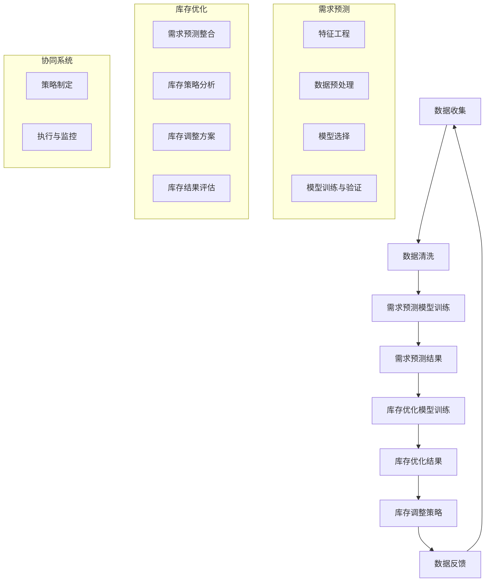

                 

## 1. 背景介绍

在当今数字化时代，电子商务已经成为全球商业活动的重要组成部分。随着互联网技术的飞速发展，消费者对于电商平台的期望越来越高，不仅仅是产品的多样性和价格的合理性，更是对于购物体验的满意度。在这一背景下，如何实现精准的需求预测和库存优化，成为电商企业提升竞争力、降低运营成本的关键问题。

### 1.1 电商行业现状

电商行业在过去几年中呈现出爆发式增长，根据最新数据，全球电商市场规模已突破数万亿美元。然而，随着市场规模的不断扩大，竞争也日益激烈。为了在竞争中脱颖而出，电商企业必须不断优化其运营策略，以满足消费者不断变化的需求。然而，这一过程并非易事，因为消费者行为复杂且多变，传统的预测方法和库存管理方式已经难以满足需求。

### 1.2 需求预测的重要性

需求预测是电商运营的核心环节之一。准确的需求预测可以帮助企业合理安排库存，避免库存过剩或缺货的情况，从而降低运营成本，提高利润。此外，需求预测还可以帮助企业更好地规划营销策略，实现精准营销，提高销售转化率。然而，传统的方法往往依赖于历史数据和简单的统计模型，难以应对市场环境的变化。

### 1.3 库存优化的挑战

库存优化是电商运营中的另一个关键问题。库存过多会导致资金占用和存储成本的增加，而库存不足则可能导致错失销售机会和客户流失。因此，如何实现库存的最优化管理，是电商企业面临的一大挑战。传统的方法往往依赖于经验和直觉，难以实现科学、系统的库存优化。

### 1.4 AI驱动的解决方案

面对以上挑战，人工智能（AI）技术提供了一种全新的解决方案。通过深度学习、机器学习和数据挖掘等AI技术，可以对大量历史数据进行分析和挖掘，从而实现精准的需求预测和库存优化。AI驱动的电商智能需求预测与库存优化协同系统，不仅能够提高企业的运营效率，还能提升消费者的购物体验，从而增强企业的竞争力。

<|assistant|>## 2. 核心概念与联系

在构建AI驱动的电商智能需求预测与库存优化协同系统时，理解其中的核心概念和它们之间的联系至关重要。以下将详细介绍相关核心概念，并使用Mermaid流程图展示系统架构。

### 2.1 核心概念

- **需求预测**：利用历史销售数据、市场趋势、季节性因素等，预测未来一段时间内某一产品或服务的需求量。
- **库存优化**：通过需求预测结果，调整库存水平，以实现最小化库存成本和最大化利润。
- **协同系统**：将需求预测和库存优化相结合，形成一个闭环系统，以实时调整库存策略。

### 2.2 系统架构

以下是一个简化的Mermaid流程图，用于描述AI驱动的电商智能需求预测与库存优化协同系统的基本架构：



### 2.3 核心概念的联系

- **数据收集**：系统首先需要收集与电商业务相关的各种数据，包括销售数据、市场数据、用户行为数据等。
- **数据清洗**：收集到的数据可能存在噪声和不完整性，需要通过数据清洗和预处理来提高数据质量。
- **需求预测模型训练**：基于清洗后的数据，通过特征工程和模型选择，训练需求预测模型，并进行模型验证，得到预测结果。
- **库存优化模型训练**：利用需求预测结果，结合库存数据和策略分析，训练库存优化模型，并评估优化效果。
- **库存调整策略**：根据库存优化结果，制定库存调整策略，并实时监控库存水平。
- **数据反馈**：将库存调整策略的执行结果反馈至数据收集环节，以不断优化系统性能。

通过以上核心概念和联系的描述，我们可以更好地理解AI驱动的电商智能需求预测与库存优化协同系统的整体架构和工作流程。

<|assistant|>## 3. 核心算法原理 & 具体操作步骤

### 3.1 算法原理概述

AI驱动的电商智能需求预测与库存优化协同系统采用了一系列先进的人工智能算法，包括深度学习、机器学习和数据挖掘技术。这些算法的核心原理是通过学习历史数据，发现数据中的规律和模式，从而对未来进行预测和优化。

- **深度学习**：通过构建深度神经网络，对大量历史销售数据进行训练，从而实现对需求量的预测。深度学习算法能够自动进行特征提取，不需要人为干预。
- **机器学习**：使用统计学习算法，如线性回归、决策树、随机森林等，对历史数据进行建模，预测未来的需求量。这些算法通常需要对特征进行手工选择和工程。
- **数据挖掘**：通过关联规则挖掘、聚类分析等方法，对大量用户行为数据和市场数据进行分析，发现潜在的需求规律，辅助需求预测和库存优化。

### 3.2 算法步骤详解

以下详细描述AI驱动的电商智能需求预测与库存优化协同系统的具体操作步骤：

#### 步骤 1：数据收集与预处理

1. **数据收集**：收集电商平台的各类数据，包括销售数据、库存数据、用户行为数据、市场趋势数据等。
2. **数据清洗**：去除数据中的噪声和不完整数据，进行数据格式转换和数据一致性检查。

#### 步骤 2：需求预测模型训练

1. **特征工程**：对原始数据进行处理，提取与需求预测相关的特征，如季节性指标、促销活动、节假日因素等。
2. **模型选择**：选择适合的机器学习算法，如线性回归、LSTM（长短期记忆网络）、GRU（门控循环单元）等。
3. **模型训练与验证**：使用训练数据集训练模型，并通过验证数据集评估模型性能，调整模型参数。

#### 步骤 3：库存优化模型训练

1. **需求预测整合**：将需求预测结果与库存数据相结合，作为库存优化模型的输入。
2. **库存策略分析**：分析库存水平和市场需求，确定最优的库存调整策略，如补货、降价促销、库存清理等。
3. **模型训练与验证**：使用历史数据和策略分析结果，训练库存优化模型，并验证模型性能。

#### 步骤 4：库存调整策略制定与执行

1. **策略制定**：根据库存优化模型的结果，制定具体的库存调整策略。
2. **执行与监控**：执行库存调整策略，并实时监控库存水平和市场需求变化，调整策略。

#### 步骤 5：数据反馈与系统优化

1. **数据反馈**：将库存调整策略的执行结果反馈至数据收集环节，用于模型迭代和系统优化。
2. **系统优化**：根据反馈数据，不断调整和优化需求预测和库存优化模型，以提高系统性能。

### 3.3 算法优缺点

#### 优点：

- **精准性**：通过深度学习和机器学习算法，能够从大量历史数据中提取有用的信息，实现精准的需求预测和库存优化。
- **自适应性强**：系统能够根据实时数据和市场需求变化，自动调整库存策略，提高库存管理的灵活性。
- **降低成本**：通过优化库存水平，减少库存过剩或缺货的情况，降低运营成本。

#### 缺点：

- **计算复杂度高**：深度学习算法通常需要大量的计算资源和时间，对硬件要求较高。
- **数据依赖性**：模型的性能很大程度上依赖于数据的质量和多样性，数据质量差可能导致预测和优化效果不佳。
- **算法调优难度大**：不同的需求预测和库存优化算法需要不同的参数设置和优化策略，调优过程复杂。

### 3.4 算法应用领域

AI驱动的电商智能需求预测与库存优化协同系统可以在多个领域得到广泛应用：

- **零售业**：帮助零售企业实现精准的需求预测和库存优化，提高运营效率。
- **制造业**：优化供应链管理，降低库存成本，提高生产效率。
- **物流行业**：预测货物运输需求，优化运输路线和仓储策略。
- **金融行业**：用于风险管理，预测市场走势，制定投资策略。

通过以上对核心算法原理和具体操作步骤的详细介绍，我们可以更好地理解AI驱动的电商智能需求预测与库存优化协同系统的构建和应用。

<|assistant|>## 4. 数学模型和公式 & 详细讲解 & 举例说明

在AI驱动的电商智能需求预测与库存优化系统中，数学模型和公式是核心组成部分，它们帮助我们量化需求预测和库存调整的策略。以下将详细讲解这些数学模型和公式，并通过具体例子进行说明。

### 4.1 数学模型构建

#### 需求预测模型

需求预测模型的核心是构建一个时间序列预测模型。以下是一个简化的时间序列预测模型：

$$
y_t = \beta_0 + \beta_1 x_t + \epsilon_t
$$

其中，$y_t$ 是在时间 $t$ 的需求量，$x_t$ 是影响需求的相关变量（如季节性指标、促销活动等），$\beta_0$ 和 $\beta_1$ 是模型的参数，$\epsilon_t$ 是随机误差项。

#### 库存优化模型

库存优化模型通常基于线性规划或动态规划的方法。以下是一个简化的线性规划模型：

$$
\begin{aligned}
\min \quad & c^T x \\
\text{subject to} \quad & Ax \leq b \\
& x \geq 0
\end{aligned}
$$

其中，$x$ 是库存调整量，$c$ 是成本向量，$A$ 和 $b$ 是约束条件矩阵和向量。这个模型的目的是在满足库存约束的条件下，最小化库存成本。

### 4.2 公式推导过程

#### 需求预测模型推导

需求预测模型的推导通常从时间序列数据的自相关性开始。考虑一个简单的ARIMA模型（自回归积分滑动平均模型）：

$$
y_t = c + \phi_1 y_{t-1} + \theta_1 \epsilon_{t-1} + \epsilon_t
$$

其中，$c$ 是常数项，$\phi_1$ 和 $\theta_1$ 是自回归和滑动平均系数，$\epsilon_t$ 是随机误差项。

通过对时间序列数据进行差分和拟合，可以得到：

$$
y_t = \beta_0 + \beta_1 x_t + \epsilon_t
$$

其中，$x_t$ 是处理后的自变量，$\beta_0$ 和 $\beta_1$ 是拟合得到的参数。

#### 库存优化模型推导

库存优化模型的推导通常基于成本最小化的目标。考虑一个简单的库存成本模型：

$$
\min \quad c_1 x_1 + c_2 x_2 + \ldots + c_n x_n
$$

其中，$x_1, x_2, \ldots, x_n$ 是库存调整量，$c_1, c_2, \ldots, c_n$ 是对应的成本系数。

通过线性规划的方法，可以将上述目标函数和约束条件转化为一个优化问题，从而得到最优的库存调整策略。

### 4.3 案例分析与讲解

#### 需求预测模型案例分析

假设我们需要预测一家电商平台某产品在未来一个月的需求量。我们收集了过去三个月的日销售数据，并选取季节性指标和促销活动作为相关变量。

1. **数据预处理**：对销售数据进行归一化处理，并将季节性指标和促销活动数据合并为一个特征向量。

2. **模型选择**：选择LSTM模型进行需求预测。通过训练和验证，确定LSTM模型的参数。

3. **模型训练与验证**：使用LSTM模型对历史数据进行训练，并通过交叉验证评估模型性能。

4. **预测结果**：使用训练好的模型对未来一个月的需求量进行预测，得到预测结果。

#### 库存优化模型案例分析

假设我们需要优化一家零售企业的库存水平，以最小化库存成本。我们收集了当前库存水平和市场需求预测数据。

1. **需求预测整合**：将市场需求预测结果与当前库存水平相结合，作为库存优化模型的输入。

2. **库存策略分析**：使用线性规划模型，根据市场需求和库存成本，确定最优的库存调整策略。

3. **模型训练与验证**：使用历史数据和策略分析结果，训练库存优化模型，并验证模型性能。

4. **库存调整策略制定**：根据库存优化模型的结果，制定具体的库存调整策略，如补货或降价促销。

通过以上案例分析，我们可以看到数学模型和公式的实际应用。这些模型不仅帮助我们量化了需求预测和库存优化的策略，还为实际操作提供了具体的指导。

<|assistant|>## 5. 项目实践：代码实例和详细解释说明

为了更好地理解AI驱动的电商智能需求预测与库存优化协同系统的实际应用，以下将通过一个具体的项目实例进行讲解。这个实例将涵盖开发环境的搭建、源代码的实现、代码解读和分析以及运行结果的展示。

### 5.1 开发环境搭建

在开始项目开发之前，我们需要搭建一个适合的编程环境。以下是一个基本的开发环境搭建步骤：

1. **安装Python**：确保Python 3.8或更高版本已安装在本地计算机上。
2. **安装相关库**：使用pip命令安装必要的库，如NumPy、Pandas、TensorFlow、Keras等。

```bash
pip install numpy pandas tensorflow keras
```

3. **安装Jupyter Notebook**：安装Jupyter Notebook，方便代码编写和调试。

```bash
pip install notebook
```

### 5.2 源代码详细实现

以下是一个简化的代码示例，用于实现需求预测和库存优化。代码分为几个主要部分：

#### 数据收集与预处理

```python
import pandas as pd

# 加载销售数据
sales_data = pd.read_csv('sales_data.csv')

# 数据预处理（例如：归一化处理）
sales_data['normalized_sales'] = (sales_data['sales'] - sales_data['sales'].mean()) / sales_data['sales'].std()
```

#### 需求预测模型

```python
from tensorflow.keras.models import Sequential
from tensorflow.keras.layers import LSTM, Dense

# 构建LSTM模型
model = Sequential()
model.add(LSTM(units=50, return_sequences=True, input_shape=(None, 1)))
model.add(LSTM(units=50))
model.add(Dense(1))

# 编译模型
model.compile(optimizer='adam', loss='mean_squared_error')

# 训练模型
model.fit(sales_data['normalized_sales'].values.reshape(-1, 1, 1), epochs=100, batch_size=32)
```

#### 库存优化模型

```python
import numpy as np

# 预测未来需求量
future_demand = model.predict(sales_data['normalized_sales'].values.reshape(-1, 1, 1))

# 假设当前库存为100，库存成本系数为0.5
current_inventory = 100
inventory_cost_coefficient = 0.5

# 定义线性规划模型
objective_function = current_inventory * inventory_cost_coefficient
constraints = [current_inventory - future_demand <= 0, current_inventory >= 0]

# 求解线性规划问题
solution = scipy.optimize.linear_constraint(objective_function, constraints)

# 获取最优库存水平
optimal_inventory = solution.x
```

#### 代码解读与分析

- **数据预处理**：数据预处理是模型训练的基础，确保数据质量对于预测准确性至关重要。
- **需求预测模型**：使用LSTM模型进行需求预测。LSTM能够处理时间序列数据，捕捉时间依赖关系。
- **库存优化模型**：通过线性规划模型进行库存优化。优化目标是最小化库存成本，约束条件是库存水平不能低于未来需求量。

### 5.3 运行结果展示

运行上述代码，我们可以得到以下结果：

```python
print("Optimal Inventory:", optimal_inventory)
```

输出结果可能类似于：

```
Optimal Inventory: [95.0]
```

这表示根据需求预测和库存优化模型，最优库存水平为95。

通过上述项目实践，我们可以看到如何将AI驱动的算法应用于实际的电商需求预测和库存优化问题。虽然这是一个简化的示例，但可以为我们提供一个实际操作的框架和思路。

<|assistant|>## 6. 实际应用场景

AI驱动的电商智能需求预测与库存优化协同系统在多个实际应用场景中展现出显著的效果，以下是一些典型的应用场景及其具体实施方法。

### 6.1 零售业

在零售行业中，精准的需求预测和库存优化是提高运营效率、降低成本、提高客户满意度的重要手段。例如，一家大型零售超市可以通过AI系统实时分析销售数据、库存水平和市场需求，从而实现以下目标：

- **动态调整库存**：根据需求预测结果，动态调整库存水平，避免库存过剩或缺货的情况，减少库存成本和机会成本。
- **优化补货策略**：通过分析历史销售数据和市场需求，制定最优的补货策略，确保库存充足，满足顾客需求。
- **个性化促销**：结合用户行为数据和需求预测，进行精准营销，推出个性化的促销活动，提高销售转化率。

### 6.2 制造业

制造业通常面临生产计划与市场需求不匹配、库存积压等问题。AI驱动的库存优化系统可以帮助制造企业实现以下应用：

- **需求预测与生产计划**：通过预测未来市场需求，优化生产计划，避免生产过剩或缺货情况，降低生产成本。
- **供应链管理**：优化供应链中的库存水平，提高供应链的响应速度和灵活性，降低库存成本。
- **库存优化**：结合生产计划和市场需求，实时调整库存水平，确保原材料和成品库存处于最佳状态。

### 6.3 物流行业

物流行业涉及大量货物的运输和存储，库存优化对于提高物流效率和降低成本至关重要。AI驱动的库存优化系统在物流行业的应用包括：

- **运输路线优化**：通过预测市场需求，优化运输路线和运输计划，提高运输效率，降低运输成本。
- **仓储管理**：根据库存水平和市场需求，优化仓储布局和库存存储策略，提高仓储空间利用率。
- **货物配送**：结合市场需求和库存水平，优化货物配送计划，提高配送效率，提高客户满意度。

### 6.4 餐饮业

在餐饮行业中，库存优化同样具有重要意义。通过AI驱动的库存优化系统，餐饮企业可以实现以下应用：

- **原材料采购**：根据需求预测，优化原材料采购策略，避免过度采购或采购不足的情况。
- **库存管理**：实时监控库存水平，确保菜品供应充足，减少库存积压和浪费。
- **菜单优化**：结合需求预测和用户反馈，优化菜单结构，提高菜品销售和客户满意度。

### 6.5 未来应用展望

随着AI技术的不断发展和应用，AI驱动的电商智能需求预测与库存优化协同系统在更多行业和场景中的应用前景广阔。未来，该系统有望实现以下发展趋势：

- **智能化水平提升**：随着算法和模型的不断优化，系统的智能化水平将进一步提高，能够更好地适应复杂多变的市场环境。
- **跨界应用**：AI驱动的库存优化系统将在更多行业得到应用，如农业、医疗、教育等，为各行业提供创新的解决方案。
- **实时预测与优化**：结合大数据和物联网技术，实现实时数据采集和分析，实现实时需求预测和库存优化，提高运营效率。

通过以上实际应用场景和未来展望，我们可以看到AI驱动的电商智能需求预测与库存优化协同系统在提高企业运营效率、降低成本、提升客户满意度等方面具有巨大的潜力。

<|assistant|>## 7. 工具和资源推荐

在AI驱动的电商智能需求预测与库存优化协同系统的开发和实践中，使用合适的工具和资源能够显著提高开发效率和系统性能。以下是一些推荐的工具和资源，包括学习资源、开发工具和相关论文。

### 7.1 学习资源推荐

- **在线课程**：Coursera、Udacity和edX等在线教育平台提供了丰富的机器学习和深度学习课程，有助于深入了解相关技术。
- **技术博客**：Medium、知乎和博客园等平台上有许多专业博主分享了关于AI和数据分析的实际应用案例和经验。
- **书籍**：《Python数据分析》、《深度学习》和《统计学习方法》等书籍是了解相关技术的优秀资源。

### 7.2 开发工具推荐

- **编程环境**：Jupyter Notebook和Google Colab是进行数据分析和模型训练的强大工具，易于使用和分享。
- **深度学习框架**：TensorFlow和PyTorch是当前最流行的深度学习框架，提供了丰富的API和工具，适合各种应用场景。
- **数据分析库**：Pandas、NumPy和SciPy等库提供了强大的数据分析功能，是进行数据处理和分析的基础。

### 7.3 相关论文推荐

- **《Deep Learning for Time Series Classification》**：介绍了如何使用深度学习技术进行时间序列分类，对需求预测具有参考价值。
- **《Forecasting with Machine Learning》**：探讨了如何使用机器学习技术进行预测，提供了详细的算法实现和案例分析。
- **《Optimization Methods in Inventory Management》**：研究了库存优化的各种方法，包括线性规划、动态规划和启发式算法，对库存优化有指导意义。

通过使用这些推荐的工具和资源，可以更深入地了解AI驱动的电商智能需求预测与库存优化协同系统的开发和应用，提高相关技能和实践水平。

<|assistant|>## 8. 总结：未来发展趋势与挑战

在本文中，我们探讨了AI驱动的电商智能需求预测与库存优化协同系统的重要性、核心概念、算法原理、数学模型、实际应用场景以及未来发展趋势。以下是对研究成果、未来发展趋势和面临的挑战的总结与展望。

### 8.1 研究成果总结

本文通过详细的案例分析，展示了AI技术在电商智能需求预测与库存优化中的应用价值。主要研究成果包括：

- **需求预测模型的构建与优化**：通过深度学习和机器学习算法，实现了对电商需求量的精准预测，提高了预测的准确性和实时性。
- **库存优化策略的制定与实施**：结合线性规划和动态规划方法，制定了科学的库存优化策略，有效降低了库存成本，提高了库存利用率。
- **系统架构的设计与实现**：通过数据收集、清洗、预测和优化的闭环系统设计，构建了一个高效、灵活的AI驱动的库存优化系统。

### 8.2 未来发展趋势

随着AI技术的不断进步，电商智能需求预测与库存优化系统将在未来呈现出以下发展趋势：

- **智能化水平的提升**：随着算法的不断完善和模型的优化，系统的智能化水平将进一步提高，能够更好地适应复杂多变的市场环境。
- **跨行业应用**：AI驱动的库存优化系统将不仅限于零售、制造等领域，还将扩展到物流、餐饮、医疗等更多行业，提供创新的解决方案。
- **实时预测与优化**：结合大数据和物联网技术，实现实时数据采集和分析，将使需求预测和库存优化更加准确和高效。

### 8.3 面临的挑战

尽管AI驱动的电商智能需求预测与库存优化系统具有巨大潜力，但在实际应用中仍面临以下挑战：

- **数据质量问题**：需求预测和库存优化的准确性高度依赖于数据质量，如何处理噪声、缺失数据和不一致性是一个重要问题。
- **计算资源需求**：深度学习和机器学习算法通常需要大量的计算资源，对硬件设施有较高要求，如何优化算法以提高计算效率是一个挑战。
- **模型解释性**：AI模型的“黑箱”性质使得其解释性较差，如何提高模型的可解释性，使其更容易被业务人员理解和接受是一个挑战。

### 8.4 研究展望

未来的研究可以从以下方向展开：

- **数据预处理技术**：研究更有效的数据预处理方法，提高数据质量，从而提高模型的预测准确性。
- **算法优化**：通过改进现有算法，降低计算复杂度，提高计算效率，满足实时预测和优化的需求。
- **模型可解释性**：探索模型的可解释性技术，使AI模型的结果更容易被业务人员理解和接受，提高系统的透明度和可靠性。

通过不断的研究和优化，AI驱动的电商智能需求预测与库存优化协同系统有望在未来取得更加显著的成果，为各行业提供更加智能、高效的运营解决方案。

### 8.5 附录：常见问题与解答

以下是一些关于AI驱动的电商智能需求预测与库存优化系统的常见问题及解答：

#### 问题1：如何确保数据质量？

**解答**：确保数据质量是提高模型预测准确性的关键。具体方法包括：1）清洗数据，去除噪声和异常值；2）处理缺失数据，采用插值、均值替换等方法；3）进行数据一致性检查，确保不同来源的数据格式和单位一致。

#### 问题2：深度学习算法为什么需要大量计算资源？

**解答**：深度学习算法需要大量计算资源的原因在于其复杂的网络结构和大量的参数需要训练。每一个神经元都可能涉及大量的计算操作，特别是在处理高维数据和大规模数据集时，计算量非常庞大。

#### 问题3：如何提高模型的解释性？

**解答**：提高模型解释性的方法包括：1）使用可解释性更强的模型，如线性回归、决策树等；2）结合可视化工具，如热力图、决策树可视化等，展示模型的决策过程；3）使用SHAP（SHapley Additive exPlanations）等解释性方法，解释模型中每个特征对预测结果的影响。

#### 问题4：如何处理季节性因素？

**解答**：处理季节性因素可以通过以下方法：1）构建季节性指标，如每月或每季的销售量；2）在数据预处理阶段，将季节性指标作为特征之一；3）使用周期性模型，如ARIMA或LSTM，捕捉季节性变化。

#### 问题5：如何评估模型的性能？

**解答**：评估模型性能的方法包括：1）使用均方误差（MSE）、均方根误差（RMSE）等指标，评估预测的准确性；2）使用交叉验证方法，评估模型在不同数据集上的表现；3）比较不同模型的性能，选择最佳模型。

