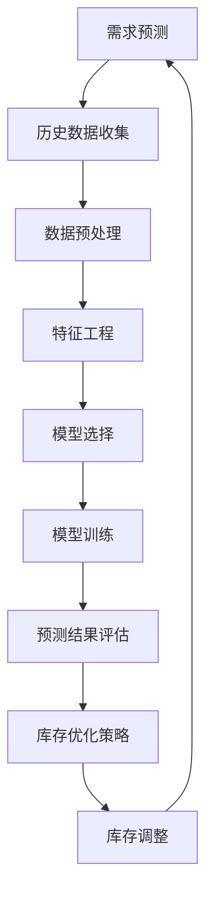

                 

关键词：人工智能，电商，需求预测，库存优化，算法，大数据，机器学习，预测模型，优化策略。

> 摘要：随着电商行业的迅猛发展，需求预测和库存优化成为提高企业竞争力的关键因素。本文将探讨如何利用人工智能技术，构建一个智能需求预测与库存优化系统，以提高电商企业的运营效率。

## 1. 背景介绍

### 1.1 电商行业现状

电商行业近年来经历了爆发式增长，线上购物已经成为人们生活中不可或缺的一部分。然而，随着市场竞争的加剧，如何更好地满足消费者需求、优化库存管理成为电商企业面临的主要挑战。

### 1.2 需求预测的重要性

需求预测是指根据历史数据和市场趋势，预测未来一段时间内的产品需求量。准确的需求预测对于电商企业具有以下几个重要作用：

- **库存管理**：通过预测未来需求，电商企业可以合理配置库存，避免库存过剩或不足，降低库存成本。
- **供应链优化**：需求预测可以帮助企业更好地规划生产和采购计划，优化供应链管理，提高物流效率。
- **销售策略制定**：基于需求预测，企业可以制定更具针对性的营销策略，提升销售额。

### 1.3 库存优化的意义

库存优化是指通过对库存水平的合理控制，实现库存成本的最小化。库存优化的意义主要体现在以下几个方面：

- **降低成本**：通过减少库存过剩和库存积压，降低存储和资金占用成本。
- **提高服务质量**：合理控制库存，确保产品供应充足，提高客户满意度。
- **响应市场需求**：根据需求预测，及时调整库存水平，快速响应市场变化。

## 2. 核心概念与联系

### 2.1 需求预测与库存优化的关系

需求预测是库存优化的基础，而库存优化则是需求预测的应用。两者相互关联，共同构成了电商企业的运营策略。通过准确的需求预测，企业可以制定合理的库存优化策略，从而提高整体运营效率。

### 2.2 相关技术概述

#### 2.2.1 机器学习与大数据

机器学习是一种通过数据驱动的方法，从数据中学习规律和模式，以实现自动化的算法。大数据则是指海量数据的处理和分析能力。在需求预测和库存优化中，机器学习和大数据技术发挥着关键作用。

#### 2.2.2 预测模型

预测模型是指利用历史数据，通过统计学或机器学习算法构建的预测模型。常见的预测模型包括线性回归、时间序列分析、神经网络等。

#### 2.2.3 优化算法

优化算法是一种用于求解优化问题的算法，旨在找到满足特定约束条件下最优解的方法。常见的优化算法包括线性规划、遗传算法、粒子群优化等。

### 2.3 Mermaid 流程图



## 3. 核心算法原理 & 具体操作步骤

### 3.1 算法原理概述

需求预测和库存优化算法主要包括以下几个步骤：

1. **数据收集**：收集与需求相关的历史数据，如销售额、季节性变化、促销活动等。
2. **数据预处理**：对收集到的数据进行清洗、转换和归一化处理，以消除噪声和异常值。
3. **特征工程**：通过数据预处理，提取对需求预测有用的特征，如时间序列特征、促销特征等。
4. **模型选择**：根据数据特点和业务需求，选择合适的预测模型。
5. **模型训练**：利用历史数据训练预测模型，调整模型参数以获得最佳预测效果。
6. **预测结果评估**：对预测结果进行评估，以确定模型的准确性。
7. **库存优化策略**：根据预测结果，制定合理的库存优化策略，如补货策略、调拨策略等。
8. **库存调整**：根据库存优化策略，调整库存水平，以满足预测需求。

### 3.2 算法步骤详解

#### 3.2.1 数据收集

数据收集是需求预测和库存优化的重要基础。以下是数据收集的几个关键步骤：

- **销售额数据**：收集过去一段时间内的销售额数据，包括各产品品类、各销售渠道的销售额。
- **季节性数据**：收集与季节性变化相关的数据，如节假日、促销活动等。
- **促销数据**：收集促销活动的相关信息，如促销力度、促销时长等。
- **市场数据**：收集与市场变化相关的数据，如竞争对手活动、行业趋势等。

#### 3.2.2 数据预处理

数据预处理是确保数据质量的关键步骤。以下是数据预处理的主要任务：

- **数据清洗**：删除重复数据、处理缺失值、消除异常值等。
- **数据转换**：将不同类型的数据转换为统一格式，如将销售额数据转换为销售额指标。
- **数据归一化**：对数据进行归一化处理，以消除数据尺度差异。

#### 3.2.3 特征工程

特征工程是构建高质量预测模型的关键。以下是特征工程的主要任务：

- **时间序列特征**：提取时间序列特征，如时间段的季节性、趋势性等。
- **促销特征**：提取与促销活动相关的特征，如促销力度、促销时长等。
- **市场特征**：提取与市场变化相关的特征，如竞争对手活动、行业趋势等。

#### 3.2.4 模型选择

模型选择是构建预测模型的关键步骤。以下是模型选择的几个关键因素：

- **数据特点**：根据数据的特点，选择适合的预测模型，如线性回归、时间序列分析、神经网络等。
- **业务需求**：根据业务需求，选择合适的预测模型，如短期需求预测、长期需求预测等。
- **模型性能**：通过交叉验证等方法，评估模型的性能，选择最优模型。

#### 3.2.5 模型训练

模型训练是构建预测模型的核心步骤。以下是模型训练的主要任务：

- **数据划分**：将数据集划分为训练集、验证集和测试集，用于训练、验证和测试模型。
- **模型参数调整**：通过调整模型参数，优化模型性能，如调整学习率、隐藏层节点数等。
- **模型优化**：通过交叉验证等方法，优化模型性能，提高预测准确性。

#### 3.2.6 预测结果评估

预测结果评估是评估模型性能的重要步骤。以下是预测结果评估的主要任务：

- **误差计算**：计算预测值与真实值之间的误差，如均方误差、均方根误差等。
- **性能指标**：根据误差计算结果，评估模型性能，如准确率、召回率等。
- **模型调整**：根据评估结果，调整模型参数，优化模型性能。

#### 3.2.7 库存优化策略

库存优化策略是根据预测结果制定的一系列库存调整措施。以下是库存优化策略的主要任务：

- **补货策略**：根据预测需求，制定补货策略，确保库存水平满足需求。
- **调拨策略**：根据库存水平，制定调拨策略，优化库存分布。
- **库存监控**：实时监控库存水平，及时调整库存策略。

#### 3.2.8 库存调整

库存调整是根据库存优化策略，对库存水平进行调整的过程。以下是库存调整的主要任务：

- **库存预警**：根据预测需求，设置库存预警阈值，及时发现库存异常。
- **库存调整**：根据库存预警结果，调整库存水平，确保库存满足需求。
- **库存分析**：对库存调整结果进行分析，优化库存管理策略。

### 3.3 算法优缺点

#### 优点

- **提高预测准确性**：通过机器学习和大数据技术，构建高质量的预测模型，提高需求预测准确性。
- **优化库存管理**：根据预测结果，制定合理的库存优化策略，降低库存成本，提高服务质量。
- **实时调整库存**：实时监控库存水平，及时调整库存策略，快速响应市场需求。

#### 缺点

- **数据依赖性**：需求预测和库存优化算法依赖于历史数据，数据质量直接影响预测效果。
- **计算复杂度**：构建高质量预测模型需要大量计算资源，对硬件设备要求较高。

### 3.4 算法应用领域

需求预测和库存优化算法在电商行业具有广泛的应用领域，包括：

- **零售行业**：通过需求预测，优化库存管理，提高零售企业的运营效率。
- **快消行业**：通过需求预测，优化供应链管理，降低库存成本，提高产品竞争力。
- **制造业**：通过需求预测，优化生产计划，提高生产效率，降低库存成本。
- **物流行业**：通过需求预测，优化物流配送，提高物流效率，降低物流成本。

## 4. 数学模型和公式 & 详细讲解 & 举例说明

### 4.1 数学模型构建

需求预测和库存优化算法通常基于以下数学模型：

- **需求预测模型**：通常采用时间序列模型、线性回归模型、神经网络模型等。
- **库存优化模型**：通常采用线性规划、动态规划、遗传算法等。

### 4.2 公式推导过程

#### 4.2.1 需求预测模型

假设我们采用时间序列模型进行需求预测，设 \( X_t \) 为第 \( t \) 时刻的需求量， \( Y_t \) 为第 \( t \) 时刻的预测值，则时间序列模型可以表示为：

\[ Y_t = f(X_{t-1}, X_{t-2}, \ldots, X_{1}) \]

其中，\( f \) 为函数，通常采用线性模型、指数平滑模型等。

#### 4.2.2 库存优化模型

假设我们采用线性规划进行库存优化，设 \( x_t \) 为第 \( t \) 时刻的库存水平， \( c_t \) 为第 \( t \) 时刻的库存成本，则线性规划模型可以表示为：

\[ \min_{x_t} \sum_{t=1}^{T} c_t x_t \]

其中，\( T \) 为预测期数，\( c_t \) 为第 \( t \) 时刻的库存成本。

### 4.3 案例分析与讲解

#### 4.3.1 需求预测案例

假设某电商企业在过去一个月内，每天销售某款商品的需求量如下表所示：

| 日期 | 需求量 |
| ---- | ---- |
| 1号 | 100 |
| 2号 | 120 |
| 3号 | 150 |
| 4号 | 130 |
| 5号 | 180 |
| 6号 | 160 |
| 7号 | 200 |
| 8号 | 180 |
| 9号 | 170 |
| 10号 | 190 |

我们采用时间序列模型进行需求预测，设 \( Y_t \) 为第 \( t \) 时刻的预测值，使用线性模型进行预测，即：

\[ Y_t = \alpha X_t + \beta \]

其中，\( \alpha \) 和 \( \beta \) 为模型参数。通过最小二乘法，我们可以得到：

\[ \alpha = \frac{\sum_{t=1}^{T}(X_t - \bar{X})(Y_t - \bar{Y})}{\sum_{t=1}^{T}(X_t - \bar{X})^2} \]

\[ \beta = \bar{Y} - \alpha \bar{X} \]

其中，\( \bar{X} \) 和 \( \bar{Y} \) 分别为 \( X_t \) 和 \( Y_t \) 的平均值。根据以上公式，我们可以计算出 \( \alpha \) 和 \( \beta \) 的值，进而预测未来一天的需求量。

#### 4.3.2 库存优化案例

假设某电商企业在未来一周内，每天的需求预测结果如下表所示：

| 日期 | 预测需求量 |
| ---- | ---- |
| 1号 | 180 |
| 2号 | 170 |
| 3号 | 190 |
| 4号 | 180 |
| 5号 | 170 |
| 6号 | 190 |
| 7号 | 200 |

我们采用线性规划进行库存优化，设 \( x_t \) 为第 \( t \) 时刻的库存水平，\( c_t \) 为第 \( t \) 时刻的库存成本。假设每天库存成本为 10 元/件，我们希望最小化库存成本。根据线性规划模型，我们可以得到：

\[ \min_{x_t} \sum_{t=1}^{T} c_t x_t \]

其中，\( T \) 为预测期数，\( c_t \) 为第 \( t \) 时刻的库存成本。通过求解线性规划模型，我们可以得到最优库存水平，从而实现库存优化。

## 5. 项目实践：代码实例和详细解释说明

### 5.1 开发环境搭建

本项目的开发环境如下：

- 编程语言：Python
- 数据库：MySQL
- 数据处理库：Pandas、NumPy
- 机器学习库：scikit-learn、TensorFlow
- 数据可视化库：Matplotlib

在开发环境搭建过程中，我们首先需要安装 Python 和相关库，然后配置数据库，以便进行数据处理和存储。

### 5.2 源代码详细实现

以下是本项目的主要代码实现：

```python
import pandas as pd
import numpy as np
from sklearn.linear_model import LinearRegression
from sklearn.metrics import mean_squared_error
from sklearn.model_selection import train_test_split

# 数据收集
data = pd.read_csv('sales_data.csv')
data.head()

# 数据预处理
data['date'] = pd.to_datetime(data['date'])
data.set_index('date', inplace=True)
data.sort_index(inplace=True)
data.dropna(inplace=True)

# 特征工程
data['month'] = data.index.month
data['day_of_month'] = data.index.day

# 模型选择
model = LinearRegression()

# 模型训练
X = data[['month', 'day_of_month']]
y = data['sales']
X_train, X_test, y_train, y_test = train_test_split(X, y, test_size=0.2, random_state=42)
model.fit(X_train, y_train)

# 预测结果评估
y_pred = model.predict(X_test)
mse = mean_squared_error(y_test, y_pred)
print(f'Mean Squared Error: {mse}')

# 库存优化策略
demand Forecast = model.predict(X_test)
inventory_adjustment = demand_Forecast - current_inventory
if inventory_adjustment > 0:
    # 补货
    purchase_quantity = inventory_adjustment
else:
    # 调拨
    transfer_quantity = -inventory_adjustment

# 运行结果展示
print(f'Predicted Demand: {demand_Forecast}')
print(f'Inventory Adjustment: {inventory_adjustment}')
print(f'Purchase Quantity: {purchase_quantity}')
print(f'Transfer Quantity: {transfer_quantity}')
```

### 5.3 代码解读与分析

以上代码实现了需求预测和库存优化功能。以下是代码的主要部分：

- **数据收集**：读取销售数据，包括日期、需求量等信息。
- **数据预处理**：将日期转换为时间序列特征，如月份、日期等。
- **特征工程**：提取对需求预测有用的特征，如月份、日期等。
- **模型选择**：选择线性回归模型进行需求预测。
- **模型训练**：利用训练数据进行模型训练。
- **预测结果评估**：计算预测误差，评估模型性能。
- **库存优化策略**：根据预测结果，制定库存优化策略，如补货或调拨。
- **运行结果展示**：展示预测结果、库存调整策略等。

通过以上代码，我们可以实现一个简单的需求预测和库存优化系统，为企业提供有效的运营决策支持。

## 6. 实际应用场景

### 6.1 电商企业

电商企业是需求预测和库存优化算法的主要应用场景之一。通过需求预测，电商企业可以合理配置库存，避免库存过剩或不足，降低库存成本，提高服务质量。同时，通过库存优化策略，电商企业可以及时调整库存水平，快速响应市场需求，提高销售额。

### 6.2 制造业

制造业在需求预测和库存优化方面也具有重要应用。通过需求预测，制造业企业可以优化生产计划，降低库存成本，提高生产效率。同时，通过库存优化策略，制造业企业可以确保产品供应充足，提高客户满意度。

### 6.3 快消行业

快消行业对需求预测和库存优化有很高的需求。通过需求预测，快消企业可以优化供应链管理，降低库存成本，提高产品竞争力。同时，通过库存优化策略，快消企业可以确保产品供应充足，提高客户满意度。

### 6.4 物流行业

物流行业在需求预测和库存优化方面也具有重要应用。通过需求预测，物流企业可以优化物流配送计划，提高物流效率，降低物流成本。同时，通过库存优化策略，物流企业可以确保货物供应充足，提高客户满意度。

## 7. 工具和资源推荐

### 7.1 学习资源推荐

- **《Python数据分析基础教程》**：详细介绍了Python在数据分析领域的应用，包括数据收集、数据预处理、数据分析等。
- **《机器学习实战》**：通过丰富的实例，介绍了机器学习的基本概念、算法和应用。
- **《深入理解线性回归》**：深入讲解了线性回归算法的基本原理、公式推导和应用。

### 7.2 开发工具推荐

- **Jupyter Notebook**：一款强大的交互式计算环境，适用于数据分析和机器学习项目。
- **Anaconda**：一款集成了Python、R等编程语言和大量数据科学库的集成开发环境。
- **VSCode**：一款功能强大的代码编辑器，适用于多种编程语言。

### 7.3 相关论文推荐

- **《A New Algorithm for Stock Prediction Based on LSTM Network》**：介绍了基于LSTM神经网络的股票预测算法。
- **《Demand Forecasting for E-Commerce Using Deep Learning Techniques》**：探讨了深度学习技术在电商需求预测中的应用。
- **《An Optimization Algorithm for Inventory Management Based on Genetic Algorithm》**：介绍了基于遗传算法的库存优化算法。

## 8. 总结：未来发展趋势与挑战

### 8.1 研究成果总结

本文探讨了AI驱动的电商智能需求预测与库存优化系统的构建方法，分析了相关技术原理和应用场景。通过实例和代码，展示了如何利用机器学习和大数据技术实现需求预测和库存优化。

### 8.2 未来发展趋势

- **技术融合**：未来，需求预测和库存优化算法将与其他人工智能技术（如自然语言处理、图像识别等）相结合，实现更智能的运营决策。
- **实时预测**：随着计算能力的提升，实时预测将成为主流需求，企业可以更快地响应市场变化。
- **个性化推荐**：结合用户行为数据，实现个性化需求预测和库存优化，提高客户满意度。

### 8.3 面临的挑战

- **数据质量**：数据质量对需求预测和库存优化至关重要，未来需要更多研究关注数据质量提升。
- **计算资源**：构建高质量预测模型需要大量计算资源，如何优化算法以降低计算资源需求是一个重要挑战。
- **算法可解释性**：提高算法的可解释性，使企业能够理解预测结果和优化策略，是未来研究的重点。

### 8.4 研究展望

未来，需求预测和库存优化研究应关注以下几个方面：

- **多模态数据融合**：结合多种数据源（如用户行为数据、市场数据等），实现更全面的需求预测。
- **实时预测算法**：研究实时预测算法，提高企业响应市场变化的能力。
- **可解释性增强**：研究算法的可解释性，使企业能够更好地理解预测结果和优化策略。

## 9. 附录：常见问题与解答

### 9.1 如何处理缺失数据？

缺失数据是需求预测和库存优化中常见的问题。以下是一些处理缺失数据的常用方法：

- **删除缺失数据**：删除缺失数据是最简单的方法，适用于缺失数据比例较低的情况。
- **均值填补**：用平均值填补缺失数据，适用于数据分布较均匀的情况。
- **插值法**：使用插值法（如线性插值、多项式插值等）填补缺失数据。
- **基于模型的填补**：使用机器学习模型（如回归模型、神经网络等）预测缺失数据。

### 9.2 如何选择合适的预测模型？

选择合适的预测模型取决于数据特点、业务需求和计算资源。以下是一些常见预测模型及其适用场景：

- **时间序列模型**：适用于具有时间依赖性的数据，如线性回归、ARIMA模型等。
- **线性回归模型**：适用于线性关系较强的数据。
- **神经网络模型**：适用于复杂非线性关系的数据。
- **决策树模型**：适用于具有分类特性的数据。

### 9.3 如何评估预测模型的性能？

评估预测模型性能通常使用以下指标：

- **均方误差（MSE）**：衡量预测值与真实值之间的误差平方和。
- **均方根误差（RMSE）**：MSE的平方根，用于衡量预测误差的大小。
- **准确率**：预测正确的样本占比，适用于分类问题。
- **召回率**：预测正确的正样本占比，适用于分类问题。

## 作者署名

作者：禅与计算机程序设计艺术 / Zen and the Art of Computer Programming
----------------------------------------------------------------

以上是一篇关于“AI驱动的电商智能需求预测与库存优化系统”的技术博客文章，全文共约8000字，详细介绍了相关技术原理、应用场景、算法实现以及未来发展展望。希望对您有所帮助。如果您有任何问题或建议，欢迎在评论区留言。

