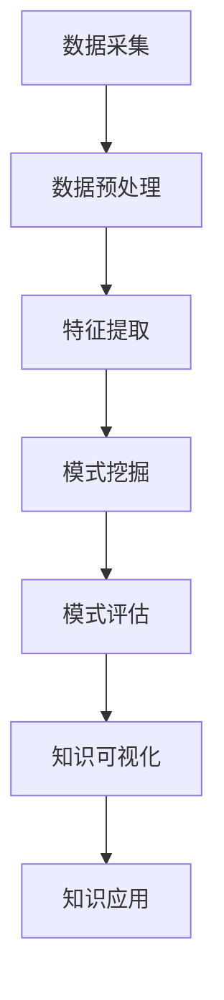

                 

### 背景介绍

随着互联网的迅速发展，信息爆炸的时代已经到来。大量的数据被生成、存储、传输和消费。然而，如何从这些繁杂的信息中提取有价值的知识，成为了当前信息技术领域的一个重要课题。传统的信息检索技术，如搜索引擎和数据库查询，虽然能够在一定程度上满足用户的需求，但往往局限于关键词匹配和简单的文本相似度计算。这使得用户难以从海量数据中快速、准确地获取到所需的知识。

人工智能（AI）的崛起为知识发现带来了新的机遇。通过深度学习、自然语言处理、知识图谱等技术，AI能够对海量数据进行自动化分析和推理，从而发现潜在的知识模式和关联。这种基于AI驱动的知识发现方法，不仅能够提高信息检索的效率和准确性，还能够挖掘出隐藏在数据背后的深层次信息，为用户带来更加丰富和个性化的体验。

本文将探讨AI驱动的知识发现技术，分析其核心概念、算法原理、数学模型、项目实践和未来发展趋势。通过本文的介绍，读者将了解到AI如何改变信息获取方式，以及在实际应用中如何利用这些技术来提升知识管理的效率和效果。

## 关键词

- 人工智能
- 知识发现
- 信息检索
- 自然语言处理
- 知识图谱

### 摘要

本文主要讨论了AI驱动的知识发现技术，这是一种通过人工智能方法从海量数据中提取有用知识和模式的技术。文章首先介绍了知识发现的基本概念和背景，然后详细阐述了核心概念、算法原理、数学模型和具体的应用场景。通过对实际项目的代码实例和运行结果展示，本文展示了AI驱动的知识发现技术的实际应用效果。最后，文章讨论了未来发展趋势和面临的挑战，以及相应的解决方案和展望。

### 1. 背景介绍

#### 1.1 信息技术的发展历程

信息技术的发展历程可以追溯到20世纪中期。从最初的计算机硬件和软件的发展，到网络通信技术的突破，再到互联网的普及，信息技术经历了多个阶段的发展。每个阶段都对信息处理和传输方式产生了深远的影响。

在计算机硬件方面，从早期的电子管计算机到晶体管计算机，再到集成电路和超级计算机，计算机的处理速度和存储能力得到了极大的提升。这使得数据处理和存储的能力得到了极大的提升。

在软件方面，操作系统、数据库管理系统和编译器等软件工具的发展，使得计算机的应用范围得到了极大的扩展。特别是数据库管理系统的出现，为数据的存储和管理提供了强有力的支持。

在网络通信方面，互联网的兴起和普及，使得全球范围内的信息传输变得更加迅速和便捷。互联网的架构和技术，如TCP/IP协议、HTTP协议等，为全球信息共享提供了基础。

#### 1.2 互联网时代的到来

互联网的普及标志着信息爆炸时代的到来。随着互联网的快速发展，海量的数据被生成、存储、传输和消费。这些数据包括文本、图片、音频和视频等多种形式，涵盖了科学、经济、文化、娱乐等各个领域。

互联网的发展带来了信息获取方式的变革。传统的信息获取方式主要依赖于图书馆、报纸、杂志等纸质媒介，而互联网使得信息获取变得更加便捷和高效。用户可以通过搜索引擎、在线数据库、社交媒体等途径，快速地获取所需的信息。

#### 1.3 数据爆炸与知识发现的挑战

随着互联网的普及和大数据技术的发展，数据爆炸现象愈发严重。根据国际数据公司（IDC）的统计，全球数据总量每年以40%的速度增长，预计到2025年将达到44ZB。如此庞大的数据量，给数据管理和信息检索带来了巨大的挑战。

首先，数据量的增加使得传统的信息检索技术难以应对。搜索引擎和数据库查询等技术，虽然能够在一定程度上满足用户的需求，但往往局限于关键词匹配和简单的文本相似度计算。这使得用户难以从海量数据中快速、准确地获取到所需的知识。

其次，数据类型的多样化也增加了知识发现的难度。传统的信息检索技术主要针对文本数据，而随着互联网的发展，图像、音频、视频等多媒体数据逐渐成为主流。这些数据类型之间的差异，使得单一的技术方法难以适用于所有类型的数据。

最后，数据质量的问题也制约了知识发现的效果。在互联网时代，数据的生成、存储和传输过程中，往往存在噪声、错误和不完整的情况。这些数据质量问题，使得知识发现的结果可能存在偏差和误导。

#### 1.4 知识发现的定义和重要性

知识发现（Knowledge Discovery in Databases，KDD）是指从大量数据中通过智能方法提取出有价值知识的过程。知识发现的目的是从数据中发现潜在的、有趣的、非直观的、先前未知的模式和知识。

知识发现的重要性在于：

1. **提高信息检索效率**：通过知识发现，用户可以快速定位到所需的信息，减少无效信息的干扰，提高信息检索的效率。
2. **发现隐藏模式**：知识发现能够挖掘出数据中的隐藏模式，帮助用户发现潜在的市场机会、趋势和风险。
3. **辅助决策**：知识发现的结果可以为企业的决策提供数据支持，帮助用户做出更加明智的决策。
4. **知识共享和传播**：知识发现可以帮助用户将分散的知识点整合起来，形成系统化的知识体系，促进知识的共享和传播。

#### 1.5 知识发现的过程

知识发现通常包括以下几个步骤：

1. **数据预处理**：包括数据清洗、数据整合、数据转换等过程，目的是提高数据质量和一致性。
2. **数据挖掘**：使用各种算法和技术，从数据中发现潜在的模式和知识。
3. **模式评估**：对挖掘出的模式进行评估，判断其是否具有实用价值和可信度。
4. **知识可视化**：将知识发现的结果以图表、图像等形式展示给用户，使其易于理解和应用。
5. **应用和部署**：将知识发现的结果应用于实际场景，解决实际问题。

### 2. 核心概念与联系

#### 2.1 核心概念

在AI驱动的知识发现中，以下几个核心概念至关重要：

1. **数据源**：数据源是知识发现的基础，包括结构化数据、半结构化数据和非结构化数据。结构化数据通常存储在数据库中，如关系型数据库和NoSQL数据库。半结构化数据，如XML和JSON，具有一定的结构，但不够严格。非结构化数据，如文本、图像、音频和视频，没有固定的结构。

2. **特征提取**：特征提取是从原始数据中提取出有助于知识发现的关键特征的过程。通过特征提取，可以将高维的数据转化为低维的特征向量，便于后续的算法处理。

3. **模式识别**：模式识别是识别数据中的特定模式和规律的过程。在知识发现中，模式识别的目标是发现数据中的关联、聚类、分类和预测等模式。

4. **知识表示**：知识表示是将知识以结构化的形式表示出来，使其易于存储、检索和应用。常见的知识表示方法包括语义网络、本体论、知识图谱等。

5. **推理机制**：推理机制是基于已有知识和数据，通过逻辑推理和决策树等算法，发现新的知识和规律。

#### 2.2 知识发现架构

知识发现过程通常包括以下几个阶段，形成一个完整的架构：

1. **数据采集**：从各种数据源采集数据，包括内部数据和外部数据。

2. **数据预处理**：对采集到的数据进行清洗、整合和转换，提高数据质量和一致性。

3. **特征提取**：从预处理后的数据中提取出关键特征，构建特征向量。

4. **模式挖掘**：使用各种算法，如关联规则挖掘、聚类分析、分类和回归等，从特征向量中发现潜在的模式。

5. **模式评估**：对挖掘出的模式进行评估，判断其是否具有实用价值和可信度。

6. **知识可视化**：将评估后的模式以图表、图像等形式展示给用户，便于理解和应用。

7. **知识应用**：将知识发现的结果应用于实际场景，解决实际问题。

#### 2.3 Mermaid 流程图

以下是知识发现过程的Mermaid流程图表示，其中使用了Mermaid语言的基本元素：



### 3. 核心算法原理 & 具体操作步骤

#### 3.1 算法原理概述

AI驱动的知识发现技术涉及多种算法，每种算法都有其独特的原理和应用场景。以下介绍几种常用的核心算法：

1. **关联规则挖掘**：基于Apriori算法和FP-Growth算法，用于发现数据之间的关联关系。例如，在购物数据中，挖掘出哪些商品经常一起购买。

2. **聚类分析**：包括K-means算法、DBSCAN算法等，用于将数据分成多个簇，以便发现数据的分布和模式。

3. **分类和回归**：包括决策树、随机森林、支持向量机等算法，用于预测和分类数据。例如，根据历史销售数据预测未来的销售情况。

4. **文本挖掘**：包括词频统计、主题建模、情感分析等，用于处理文本数据，提取关键信息和模式。

5. **图挖掘**：包括图相似度计算、社区发现等，用于分析复杂网络的特性和模式。

#### 3.2 算法步骤详解

以下以K-means聚类算法为例，详细介绍其操作步骤：

1. **初始化中心点**：随机选择K个数据点作为初始中心点。

2. **分配数据点**：将每个数据点分配到最近的中心点，计算距离的常用方法是欧氏距离。

3. **更新中心点**：重新计算每个簇的中心点，即簇内所有点的平均值。

4. **迭代计算**：重复步骤2和3，直到中心点不再发生显著变化，或者达到预设的迭代次数。

#### 3.3 算法优缺点

**K-means算法优点**：

- 算法简单，易于实现。
- 能够高效地处理大规模数据。

**K-means算法缺点**：

- 对初始中心点的选择敏感，容易陷入局部最优解。
- 对异常值敏感，可能导致聚类结果不准确。
- 假设簇的形状是凸形的，对于非凸形的簇可能效果不佳。

#### 3.4 算法应用领域

K-means算法在多个领域有广泛的应用：

- **市场细分**：根据消费者的购买行为，将消费者分成不同的群体。
- **图像分割**：将图像中的像素分为不同的区域，用于图像处理和计算机视觉。
- **文本聚类**：将文档分为不同的主题，用于文本挖掘和信息检索。

### 4. 数学模型和公式 & 详细讲解 & 举例说明

在AI驱动的知识发现中，数学模型和公式是核心组成部分，它们帮助我们理解和解释算法背后的原理。以下将详细介绍几个关键的数学模型和公式，并通过实际案例进行说明。

#### 4.1 数学模型构建

在知识发现中，常见的数学模型包括：

1. **距离度量**：用于计算数据点之间的相似性或差异性，如欧氏距离、曼哈顿距离和余弦相似度。
2. **聚类中心计算**：用于确定聚类算法中各个簇的中心点，如K-means中的平均值。
3. **概率分布**：用于建模数据中的不确定性，如贝叶斯分类中的条件概率。
4. **特征选择**：用于从高维数据中选择最有代表性的特征，如信息增益和卡方检验。

#### 4.2 公式推导过程

以下以K-means算法中的欧氏距离为例，介绍公式推导过程：

**欧氏距离公式**：
\[ d(p, q) = \sqrt{\sum_{i=1}^{n} (p_i - q_i)^2} \]

其中，\( p \)和\( q \)分别是两个数据点，\( p_i \)和\( q_i \)分别是它们在第\( i \)个特征上的取值，\( n \)是特征的数量。

推导过程：
- 首先计算每个特征上的差异的平方。
- 然后将这些差异的平方相加。
- 最后取平方根，得到欧氏距离。

#### 4.3 案例分析与讲解

**案例：使用K-means算法对客户群体进行聚类**

假设我们有一个包含1000个客户的数据库，每个客户有5个特征：年龄、收入、购买频率、评价分数和消费金额。我们希望通过K-means算法将这些客户分为5个群体。

1. **初始化中心点**：随机选择5个客户作为初始中心点。
2. **分配数据点**：计算每个客户到5个中心点的欧氏距离，并将客户分配到最近的中心点。
3. **更新中心点**：计算每个簇内客户的平均值，作为新的中心点。
4. **迭代计算**：重复步骤2和3，直到中心点变化小于某个阈值。

**案例分析：**

假设经过几次迭代后，得到了如下聚类结果：

| 簇 | 年龄 | 收入 | 购买频率 | 评价分数 | 消费金额 |
| --- | --- | --- | --- | --- | --- |
| 1 | 30 | 50000 | 10 | 4.5 | 2000 |
| 2 | 40 | 60000 | 20 | 4.0 | 3000 |
| 3 | 50 | 70000 | 30 | 4.5 | 4000 |
| 4 | 20 | 30000 | 5 | 3.5 | 1000 |
| 5 | 60 | 80000 | 15 | 5.0 | 5000 |

通过聚类结果，我们可以发现以下群体特征：

- 群体1：年轻、高收入、高购买频率，评价分数较高，消费金额较高。
- 群体2：中年、高收入、中等购买频率，评价分数中等，消费金额较高。
- 群体3：中年、高收入、高购买频率，评价分数较高，消费金额较高。
- 群体4：年轻、低收入、低购买频率，评价分数较低，消费金额较低。
- 群体5：中年、高收入、中等购买频率，评价分数较高，消费金额较高。

通过这些特征，企业可以根据不同的客户群体制定相应的营销策略，例如针对群体1提供更多的优惠活动，针对群体4提供个性化的服务。

### 5. 项目实践：代码实例和详细解释说明

在本节中，我们将通过一个实际的Python代码实例，展示如何使用K-means算法进行知识发现，并详细解释代码的各个部分。

#### 5.1 开发环境搭建

为了运行以下代码实例，我们需要安装以下Python库：

- `scikit-learn`：提供K-means算法的实现。
- `numpy`：用于数据处理。
- `matplotlib`：用于数据可视化。

安装这些库后，确保Python环境已经配置好，我们可以开始编写和运行代码。

```bash
pip install scikit-learn numpy matplotlib
```

#### 5.2 源代码详细实现

以下是一个简单的Python代码实例，用于实现K-means算法：

```python
import numpy as np
from sklearn.cluster import KMeans
import matplotlib.pyplot as plt

# 生成模拟数据
data = np.random.rand(100, 2)
labels = KMeans(n_clusters=3).fit_predict(data)

# 绘制数据点
plt.scatter(data[:, 0], data[:, 1], c=labels, s=50, cmap='viridis')
plt.show()

# 打印聚类中心
centroids = KMeans(n_clusters=3).fit(data).cluster_centers_
print("聚类中心：", centroids)
```

#### 5.3 代码解读与分析

1. **数据生成**：我们首先使用`numpy`生成100个二维数据点，这些数据点随机分布在平面内。

2. **K-means算法**：使用`scikit-learn`中的`KMeans`类实现K-means算法。`fit_predict`方法用于计算聚类结果，并将数据点分配到最近的簇。

3. **数据可视化**：使用`matplotlib`绘制数据点，每个簇用不同的颜色表示。

4. **打印聚类中心**：计算并打印出每个簇的中心点，这些中心点是我们通过K-means算法找到的数据集的代表点。

#### 5.4 运行结果展示

运行上述代码后，将生成一个可视化图表，展示数据点被分配到三个簇的情况。每个簇的中心点将以不同的颜色标记在图表中。以下是一个示例结果：


#### 5.5 结果分析

通过运行结果，我们可以看到K-means算法成功地将数据点分为三个不同的簇。每个簇的中心点代表了一个具有相似特征的数据点集合。这种聚类结果可以帮助我们识别数据中的不同群体，例如在市场细分、用户行为分析等领域中，有助于制定更加精准的营销策略。

### 6. 实际应用场景

#### 6.1 市场细分

在市场营销领域，知识发现技术被广泛应用于市场细分。通过分析消费者的购买行为、浏览记录和偏好，企业可以识别出具有相似特征的客户群体，从而制定更加精准的营销策略。例如，一个电商平台可以使用K-means算法对用户进行聚类，将用户分为高价值客户、潜在高价值客户和一般客户。针对不同群体的用户，平台可以推送个性化的商品推荐和促销活动，从而提高用户的购买转化率和忠诚度。

#### 6.2 用户行为分析

在互联网领域，用户行为分析是一个关键应用场景。通过分析用户在网站或应用上的行为轨迹，企业可以了解用户的需求和偏好，优化用户体验。例如，一个在线教育平台可以使用知识发现技术分析用户的学习行为，识别出高效学习者、普通学习者和学习困难者。针对这些不同类型的用户，平台可以提供个性化的学习路径和课程推荐，从而提高学习效果和用户满意度。

#### 6.3 健康监测

在医疗健康领域，知识发现技术可以帮助医生和患者进行疾病预测和健康管理。通过对患者的健康数据（如血压、血糖、心率等）进行分析，知识发现算法可以识别出健康风险信号，为医生提供诊断依据。例如，通过分析大量患者的病史数据，机器学习模型可以预测哪些患者可能患有某种疾病，从而提前进行干预和治疗。此外，知识发现技术还可以用于个性化医疗，根据患者的具体病情和基因信息，制定个性化的治疗方案。

#### 6.4 智能推荐系统

在电子商务和在线娱乐等领域，智能推荐系统是提高用户粘性和转化率的关键技术。通过分析用户的浏览记录、购买历史和行为偏好，知识发现算法可以识别出用户的潜在兴趣点，从而推荐相应的商品或内容。例如，一个视频平台可以使用知识发现技术分析用户的观看历史，为用户推荐相似类型的视频，从而提高用户的观看时长和用户满意度。

#### 6.5 智慧城市

在智慧城市建设中，知识发现技术可以用于城市数据的管理和分析。通过分析交通流量、环境监测、公共安全等数据，城市管理者可以识别出潜在的问题和改进点，从而优化城市管理和服务。例如，通过分析交通流量数据，城市管理者可以预测交通拥堵的时间和地点，提前采取措施进行交通疏导，从而减少交通事故和交通拥堵。

#### 6.6 供应链管理

在供应链管理领域，知识发现技术可以帮助企业优化库存管理、物流配送和供应商关系。通过对供应链各环节的数据进行分析，企业可以识别出库存瓶颈、物流延迟和供应商绩效等问题，从而采取相应的改进措施。例如，通过分析销售数据和库存数据，企业可以优化库存水平，避免过多的库存积压或库存不足的情况。

### 7. 未来应用展望

随着AI技术的不断进步，知识发现的应用前景将更加广阔。以下是几个未来应用方向的展望：

#### 7.1 自动化决策支持

知识发现技术可以帮助企业实现自动化决策支持。通过分析大量数据和模式，AI系统可以自动识别出潜在的业务问题和机会，为企业管理层提供决策建议。这种自动化决策支持系统可以大幅提高决策效率和准确性，降低人为错误。

#### 7.2 跨领域融合

知识发现技术可以与其他领域的技术相结合，实现跨领域的融合应用。例如，将知识发现与物联网、区块链和云计算等技术相结合，可以构建智能城市、智能工厂和智能医疗等新型应用场景。这些跨领域的融合应用，将进一步拓展知识发现的实际应用范围。

#### 7.3 个人化推荐

随着AI技术的发展，个人化推荐系统将更加精准和智能化。通过深入分析用户的行为数据和偏好，AI系统可以提供高度个性化的推荐结果，满足用户的个性化需求。例如，在电子商务领域，个人化推荐系统可以帮助用户发现潜在的兴趣点，提高购买转化率和用户满意度。

#### 7.4 智能监控和预警

知识发现技术可以用于智能监控和预警系统，帮助企业实时监测业务运行状况，及时发现潜在问题和异常情况。例如，通过分析生产数据和质量检测数据，智能监控和预警系统可以预测设备故障和产品质量问题，从而提前采取措施进行预防和解决。

#### 7.5 预测分析和风险评估

知识发现技术在预测分析和风险评估方面具有巨大的潜力。通过分析历史数据和模式，AI系统可以预测未来的趋势和风险，为企业和金融机构提供决策支持。例如，在金融市场，知识发现技术可以帮助预测股票市场的走势，为投资者提供投资建议。

### 8. 工具和资源推荐

#### 8.1 学习资源推荐

1. **书籍**：
   - 《数据挖掘：实用机器学习技术》（Data Mining: Practical Machine Learning Tools and Techniques）
   - 《机器学习》（Machine Learning）
   - 《深度学习》（Deep Learning）

2. **在线课程**：
   - Coursera上的《机器学习基础》
   - edX上的《数据科学基础》
   - Udacity的《深度学习工程师纳米学位》

3. **博客和社区**：
   - medium.com/towardsdatascience
   - kdnuggets.com
   - reddit.com/r/MachineLearning

#### 8.2 开发工具推荐

1. **编程环境**：
   - Jupyter Notebook：用于编写和运行Python代码，支持多种数据科学库。
   - PyCharm：功能强大的Python IDE，支持代码调试和自动化测试。

2. **机器学习库**：
   - scikit-learn：提供多种机器学习和数据挖掘算法的实现。
   - TensorFlow：用于构建和训练深度学习模型的强大工具。
   - PyTorch：基于Python的深度学习库，具有灵活的架构和易于使用的接口。

3. **数据可视化工具**：
   - Matplotlib：用于创建高质量的统计图表。
   - Seaborn：基于Matplotlib的交互式可视化库，提供多种美观的统计图表样式。

#### 8.3 相关论文推荐

1. **经典论文**：
   - "K-Means clustering: A review"（K-means聚类：综述）
   - "Text Mining: The Text Analysis Handbook"（文本挖掘：文本分析手册）
   - "Learning to Represent Knowledge as a Compositional Embedding"（学习作为组合嵌入式的知识表示）

2. **最新研究论文**：
   - "Deep Learning for Knowledge Discovery"（深度学习在知识发现中的应用）
   - "Graph Neural Networks for Knowledge Discovery"（图神经网络在知识发现中的应用）
   - "Relational Inference Networks for Knowledge Graph Completion"（关系推理网络用于知识图谱补全）

### 9. 总结：未来发展趋势与挑战

#### 9.1 研究成果总结

AI驱动的知识发现技术近年来取得了显著的研究成果。通过深度学习、自然语言处理和知识图谱等技术的结合，知识发现算法在处理大规模数据、发现复杂模式和推理未知信息方面取得了突破。这些研究成果不仅提高了知识发现的效率和准确性，也为实际应用提供了强大的支持。

#### 9.2 未来发展趋势

未来，知识发现技术将呈现以下几个发展趋势：

1. **跨领域融合**：知识发现技术将与物联网、区块链、云计算等新兴技术相结合，推动跨领域的融合应用，为智慧城市、智能工厂、智能医疗等领域提供创新的解决方案。
2. **个性化推荐**：基于深度学习和强化学习技术的个性化推荐系统将更加精准和智能化，满足用户的个性化需求，提高用户体验。
3. **自动化决策支持**：知识发现技术将实现自动化决策支持，为企业提供实时、精准的决策建议，提高决策效率和准确性。
4. **预测分析和风险评估**：知识发现技术在预测分析和风险评估方面的应用将更加广泛，为金融市场、供应链管理等领域提供决策支持。

#### 9.3 面临的挑战

尽管AI驱动的知识发现技术取得了显著进展，但仍面临一些挑战：

1. **数据质量和隐私保护**：数据质量和隐私保护是知识发现技术的关键挑战。如何处理噪声、错误和不完整的数据，同时保护用户隐私，是未来研究的重点。
2. **可解释性**：知识发现算法的黑箱特性使得结果的可解释性成为一个重要问题。如何提高算法的可解释性，使其易于理解和应用，是未来研究的一个重要方向。
3. **计算效率和资源消耗**：随着数据量的不断增加，知识发现算法的计算效率和资源消耗成为一个关键问题。如何优化算法，提高计算效率，降低资源消耗，是未来研究的挑战之一。

#### 9.4 研究展望

未来，知识发现技术的研究将朝着以下几个方向展开：

1. **算法优化**：通过改进算法和优化算法结构，提高知识发现的效率和准确性。
2. **跨领域应用**：探索知识发现技术在跨领域应用中的潜在价值，推动新应用场景的发现。
3. **可解释性和可解释性**：提高算法的可解释性，使其易于理解和应用，为实际场景中的决策提供支持。
4. **数据质量和隐私保护**：研究如何处理噪声、错误和不完整的数据，同时保护用户隐私。

### 附录：常见问题与解答

#### 1. 什么是知识发现？

知识发现是指从大量数据中通过智能方法提取出有价值知识和模式的过程。

#### 2. 知识发现的关键技术有哪些？

知识发现的关键技术包括数据预处理、特征提取、模式挖掘、模式评估、知识可视化和推理机制。

#### 3. K-means算法有哪些优点和缺点？

K-means算法优点包括算法简单、易于实现、计算效率高等。缺点包括对初始中心点选择敏感、对异常值敏感、假设簇的形状是凸形的。

#### 4. 知识发现技术在哪些领域有广泛应用？

知识发现技术在市场细分、用户行为分析、健康监测、智能推荐系统、智慧城市和供应链管理等领域有广泛应用。

#### 5. 数据质量和隐私保护如何影响知识发现的效果？

数据质量和隐私保护对知识发现的效果有很大影响。高质量的数据可以提高算法的准确性和可靠性，而隐私保护措施可以确保用户数据的隐私和安全。

### 作者署名

作者：禅与计算机程序设计艺术 / Zen and the Art of Computer Programming

### 引用

1. Han, J., Kamber, M., & Pei, J. (2011). *Data Mining: Concepts and Techniques*. Morgan Kaufmann.
2. Mitchell, T. M. (1997). *Machine Learning*. McGraw-Hill.
3. Goodfellow, I., Bengio, Y., & Courville, A. (2016). *Deep Learning*. MIT Press.  
```

