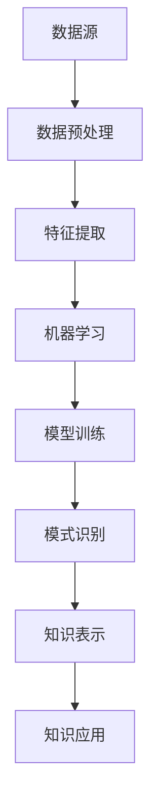

                 

关键词：人工智能，知识发现，信息检索，算法，数据挖掘，机器学习

摘要：本文旨在探讨AI驱动的知识发现技术如何改变传统的信息获取方式。通过介绍核心概念、算法原理、数学模型、项目实践及未来应用展望，文章将为读者展示AI技术在知识挖掘领域的巨大潜力。

## 1. 背景介绍

随着互联网和信息技术的飞速发展，数据量呈爆炸式增长。传统的信息检索方法已无法满足人们对海量数据中隐藏知识的需求。知识发现（Knowledge Discovery in Databases，KDD）作为数据挖掘的核心任务，旨在从大量数据中自动提取出有价值的信息。然而，传统的KDD方法往往依赖于人工设计特征和规则，存在一定的局限性。随着人工智能技术的发展，AI驱动的知识发现逐渐成为一种新的研究方向，它利用机器学习和深度学习算法，从数据中自动学习模式和知识，从而提高信息获取的效率和质量。

## 2. 核心概念与联系

### 2.1 核心概念

- **知识发现（KDD）**：从大量数据中自动发现有用知识的过程，包括数据预处理、数据挖掘、模式评估和知识表示等步骤。
- **机器学习（ML）**：一种使计算机能够从数据中学习的方法，通过训练模型，使其能够对未知数据进行预测或分类。
- **深度学习（DL）**：一种特殊的机器学习方法，使用多层神经网络来模拟人脑的决策过程，具有强大的特征学习能力。

### 2.2 联系与架构

下面是一个用Mermaid绘制的知识发现流程图，展示了各个核心概念之间的联系：



## 3. 核心算法原理 & 具体操作步骤

### 3.1 算法原理概述

AI驱动的知识发现通常采用以下几种算法：

- **聚类算法**：如K-means、DBSCAN，用于发现数据中的相似性模式。
- **分类算法**：如决策树、支持向量机（SVM），用于对数据进行分类。
- **关联规则学习**：如Apriori、Eclat算法，用于发现数据之间的关联关系。
- **神经网络**：如卷积神经网络（CNN）、递归神经网络（RNN），用于复杂模式的识别和学习。

### 3.2 算法步骤详解

#### 3.2.1 数据预处理

数据预处理是知识发现的第一步，包括数据清洗、归一化和特征选择等。例如，使用K-means算法进行聚类前，需要对数据进行标准化处理，以消除不同特征之间的尺度差异。

#### 3.2.2 特征提取

特征提取是从原始数据中提取对知识发现任务有用的信息。例如，在文本数据挖掘中，可以使用词袋模型或TF-IDF等方法提取特征。

#### 3.2.3 机器学习模型训练

选择合适的机器学习算法，如SVM、KNN等，对特征数据进行训练，建立预测模型。

#### 3.2.4 模式识别与知识表示

使用训练好的模型对未知数据进行预测或分类，识别出数据中的模式和关联。然后将这些知识以可视化或文本形式表示，便于用户理解和应用。

### 3.3 算法优缺点

- **优点**：AI驱动的知识发现能够自动从数据中学习模式和知识，减少了对人工设计规则和特征的依赖，提高了效率。
- **缺点**：算法的性能和结果依赖于数据质量和特征选择，对于复杂的数据关系和大规模数据集，可能存在计算效率和可解释性方面的挑战。

### 3.4 算法应用领域

AI驱动的知识发现广泛应用于金融、医疗、电商等多个领域：

- **金融**：通过分析交易数据，发现欺诈行为和投资机会。
- **医疗**：从患者数据中提取有用的医疗信息，用于疾病诊断和治疗。
- **电商**：通过用户行为数据，实现个性化推荐和服务。

## 4. 数学模型和公式 & 详细讲解 & 举例说明

### 4.1 数学模型构建

在知识发现中，常用的数学模型包括线性模型、非线性模型和概率模型等。以下是一个线性回归模型的例子：

$$
y = \beta_0 + \beta_1x_1 + \beta_2x_2 + ... + \beta_nx_n
$$

其中，$y$ 是因变量，$x_1, x_2, ..., x_n$ 是自变量，$\beta_0, \beta_1, \beta_2, ..., \beta_n$ 是模型参数。

### 4.2 公式推导过程

以线性回归模型为例，参数的推导过程通常采用最小二乘法（Least Squares Method）。目标是最小化预测值与实际值之间的误差平方和：

$$
\min \sum_{i=1}^{n} (y_i - \hat{y}_i)^2
$$

其中，$y_i$ 是第$i$个样本的实际值，$\hat{y}_i$ 是预测值。

### 4.3 案例分析与讲解

假设我们有一个简单的线性回归模型，用来预测房间的价格。数据集包含房间面积和价格两个特征。使用最小二乘法进行参数估计，得到模型：

$$
y = 1000 + 200x
$$

其中，$x$ 是房间面积，$y$ 是房间价格。

我们可以使用这个模型预测一个面积为150平方米的房间的价格：

$$
y = 1000 + 200 \times 150 = 35,000
$$

## 5. 项目实践：代码实例和详细解释说明

### 5.1 开发环境搭建

在Python环境中，我们可以使用scikit-learn库来实现线性回归模型。首先，安装必要的库：

```bash
pip install scikit-learn numpy pandas matplotlib
```

### 5.2 源代码详细实现

以下是一个简单的线性回归模型实现：

```python
import numpy as np
import pandas as pd
from sklearn.linear_model import LinearRegression
from sklearn.model_selection import train_test_split
import matplotlib.pyplot as plt

# 读取数据
data = pd.read_csv('house_prices.csv')
X = data[['area']]
y = data['price']

# 划分训练集和测试集
X_train, X_test, y_train, y_test = train_test_split(X, y, test_size=0.2, random_state=42)

# 创建线性回归模型
model = LinearRegression()
model.fit(X_train, y_train)

# 进行预测
y_pred = model.predict(X_test)

# 绘制结果
plt.scatter(X_test, y_test, color='red', label='Actual')
plt.plot(X_test, y_pred, color='blue', label='Predicted')
plt.xlabel('Area')
plt.ylabel('Price')
plt.legend()
plt.show()
```

### 5.3 代码解读与分析

上述代码首先读取一个包含房屋面积和价格的CSV文件，然后使用scikit-learn库中的LinearRegression类创建线性回归模型。通过fit方法训练模型，使用predict方法进行预测，并绘制预测结果。

### 5.4 运行结果展示

运行上述代码后，将显示一个散点图，其中红色散点代表实际价格，蓝色线代表预测价格。通过观察散点图，我们可以评估模型的预测性能。

## 6. 实际应用场景

AI驱动的知识发现技术在各个领域都有广泛的应用。以下是一些具体的应用案例：

- **金融**：通过分析交易数据，发现市场趋势和风险。
- **医疗**：从医疗数据中提取有用的信息，用于疾病诊断和治疗。
- **电商**：通过用户行为数据，实现个性化推荐和服务。

## 7. 工具和资源推荐

### 7.1 学习资源推荐

- **书籍**：《机器学习实战》、《深度学习》（Goodfellow et al.）
- **在线课程**：Coursera、edX、Udacity上的机器学习和深度学习课程。

### 7.2 开发工具推荐

- **编程语言**：Python、R
- **库和框架**：scikit-learn、TensorFlow、PyTorch

### 7.3 相关论文推荐

- "Learning from Data" by Yaser Abu-Mostafa, Shai Shalev-Shwartz
- "Deep Learning" by Ian Goodfellow, Yoshua Bengio, Aaron Courville

## 8. 总结：未来发展趋势与挑战

### 8.1 研究成果总结

AI驱动的知识发现技术在提高信息获取效率、发现数据中的潜在模式和知识方面取得了显著成果。随着算法和计算能力的提升，其在各个领域的应用前景广阔。

### 8.2 未来发展趋势

- **算法创新**：进一步优化现有算法，提高计算效率和可解释性。
- **跨学科融合**：与生物信息学、社会科学等领域的结合，挖掘更多有价值的知识。
- **隐私保护**：研究如何在保护隐私的前提下进行知识发现。

### 8.3 面临的挑战

- **数据质量**：数据质量对知识发现结果有直接影响，需要解决数据清洗和预处理问题。
- **可解释性**：提高算法的可解释性，使其在决策过程中更容易被用户接受。
- **计算资源**：大规模数据集和复杂模型的训练需要大量的计算资源。

### 8.4 研究展望

AI驱动的知识发现技术在未来的发展将更加智能化、自动化和个性化。通过不断优化算法和模型，我们将能够更好地挖掘数据中的价值，为人类社会的发展做出更大的贡献。

## 9. 附录：常见问题与解答

### 9.1 如何选择合适的算法？

选择合适的算法通常取决于数据类型、问题和业务需求。对于分类问题，可以尝试使用SVM、决策树、随机森林等；对于聚类问题，可以尝试使用K-means、DBSCAN等；对于关联规则学习，可以尝试使用Apriori、Eclat算法。

### 9.2 如何处理缺失数据？

处理缺失数据的方法包括删除缺失数据、插补和预测缺失值等。根据数据的重要性和缺失程度，可以选择合适的方法。

### 9.3 如何评估模型性能？

模型性能的评估通常使用准确率、召回率、F1分数、ROC曲线等指标。根据问题的类型和需求，选择合适的评估指标。

---

作者：禅与计算机程序设计艺术 / Zen and the Art of Computer Programming
----------------------------------------------------------------

### 结语

通过本文的探讨，我们了解了AI驱动的知识发现技术如何改变传统的信息获取方式，以及其在各个领域的应用前景。随着AI技术的不断进步，知识发现领域将迎来更多的创新和突破。未来，我们将继续关注这一领域的动态，分享更多前沿的研究成果和应用实践。

