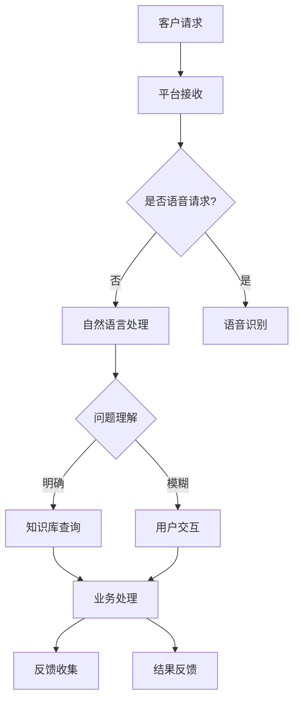

                 

关键词：人工智能、自动化客户服务、用户体验、AI驱动的流程、客户服务效率

> 摘要：随着人工智能技术的迅猛发展，自动化客户服务已经成为现代企业提升客户体验的重要手段。本文将探讨AI在客户服务中的应用，分析其原理、优势、挑战以及未来发展趋势，旨在为企业和开发者提供实用的指导。

## 1. 背景介绍

在数字化的今天，客户服务已经成为企业竞争力的重要体现。传统的客户服务主要依赖于人工处理，不仅效率低下，而且容易出错，难以满足客户日益增长的需求。随着人工智能（AI）技术的成熟，自动化客户服务成为可能，其不仅能够处理大量的客户请求，还能提供个性化和高效的服务。

### 1.1 客户服务的重要性

客户服务是企业与客户之间的桥梁，直接影响客户满意度和忠诚度。良好的客户服务可以增强品牌形象，提高客户满意度，促进复购率和口碑传播。然而，随着客户需求的多样化和竞争的加剧，传统的人工服务模式逐渐显得力不从心。

### 1.2 人工智能的发展

人工智能作为计算机科学的一个分支，通过模拟、延伸和扩展人类的智能，实现了机器的自主学习、推理和决策。在客户服务领域，人工智能可以通过自然语言处理（NLP）、机器学习（ML）等技术，实现智能客服、智能语音识别、智能推荐等功能。

### 1.3 自动化客户服务的崛起

自动化客户服务利用AI技术，通过自动化流程和智能交互，实现了客户服务的优化。相比传统人工服务，自动化客户服务具有更高的效率和更低的成本，能够满足大规模客户需求，并不断提升用户体验。

## 2. 核心概念与联系

### 2.1 人工智能核心概念

人工智能（AI）是一门研究、开发用于模拟、延伸和扩展人的智能的理论、方法、技术及应用。它主要包括以下几个核心概念：

- **机器学习（ML）**：通过数据和算法，使机器具备自主学习的能力。
- **深度学习（DL）**：基于人工神经网络，通过多层网络结构提取特征，实现复杂任务的学习。
- **自然语言处理（NLP）**：使计算机能够理解、生成和处理人类自然语言。
- **计算机视觉（CV）**：使计算机具备图像识别和图像处理的能力。

### 2.2 自动化客户服务架构

自动化客户服务的架构通常包括以下几个关键组成部分：

- **客户服务平台**：作为整个系统的核心，负责接收和处理客户请求。
- **自然语言处理模块**：用于理解客户的问题和需求。
- **知识库**：存储大量的常见问题和标准答案，供系统参考。
- **业务处理引擎**：根据客户的问题和需求，自动执行相应的业务操作。
- **用户反馈系统**：收集用户反馈，用于优化系统的性能和用户体验。

### 2.3 Mermaid 流程图

以下是一个简化的自动化客户服务流程图：



## 3. 核心算法原理 & 具体操作步骤

### 3.1 算法原理概述

自动化客户服务的核心算法通常包括自然语言处理（NLP）、机器学习（ML）和深度学习（DL）等技术。以下是对这些算法原理的概述：

- **自然语言处理（NLP）**：NLP旨在使计算机能够理解、处理和生成人类语言。主要技术包括词向量表示、句法分析、语义分析等。
- **机器学习（ML）**：ML是一种使机器能够通过数据和经验进行自我学习和改进的方法。常用的ML算法包括决策树、支持向量机、神经网络等。
- **深度学习（DL）**：DL是一种基于多层神经网络的学习方法，通过多层非线性变换，实现复杂的特征提取和模式识别。

### 3.2 算法步骤详解

- **数据收集与预处理**：收集大量客户对话数据，并进行数据清洗和预处理，如去除噪音、标注实体等。
- **模型训练**：使用预处理后的数据，通过ML和DL算法训练模型，使模型能够理解客户的问题和需求。
- **模型评估与优化**：使用测试集评估模型性能，并根据评估结果对模型进行调整和优化。
- **模型部署**：将训练好的模型部署到客户服务平台，实现自动化客户服务。

### 3.3 算法优缺点

- **优点**：
  - 提高客户服务效率：自动化处理大量客户请求，节省人力成本。
  - 提升用户体验：提供个性化、高效的客户服务，提升客户满意度。
  - 可扩展性：可以轻松扩展到不同的业务场景，满足不同客户需求。

- **缺点**：
  - 模型依赖数据：模型的性能高度依赖训练数据的质量和多样性。
  - 模型解释性差：深度学习模型往往具有较差的可解释性，难以理解其决策过程。
  - 技术门槛高：需要专业团队进行模型开发和优化。

### 3.4 算法应用领域

- **金融领域**：自动化处理客户咨询、账户查询、交易查询等。
- **电商领域**：自动化处理客户咨询、订单查询、退货退款等。
- **医疗领域**：自动化处理患者咨询、病情咨询、预约挂号等。
- **教育领域**：自动化处理学生咨询、课程咨询、成绩查询等。

## 4. 数学模型和公式 & 详细讲解 & 举例说明

### 4.1 数学模型构建

在自动化客户服务中，常用的数学模型包括自然语言处理（NLP）模型和机器学习（ML）模型。以下是一个简化的数学模型构建过程：

- **NLP模型**：使用词向量表示法（如Word2Vec、BERT）将文本转化为向量表示，然后使用分类器（如SVM、神经网络）进行问题分类和语义理解。
- **ML模型**：使用监督学习算法（如决策树、随机森林、神经网络）对数据进行训练，预测客户需求和处理结果。

### 4.2 公式推导过程

假设我们使用BERT模型进行文本分类，其基本公式为：

$$
\text{分类结果} = \text{BERT模型}(\text{输入文本}) + \text{分类器权重}
$$

其中，BERT模型负责将输入文本转换为向量表示，分类器权重用于对向量进行分类。

### 4.3 案例分析与讲解

#### 案例背景

假设我们使用BERT模型处理一个金融领域的客户咨询问题，客户咨询的内容为：“我的信用卡最近有可疑交易，怎么办？”

#### 模型应用

1. **文本预处理**：对客户咨询的文本进行分词、去停用词等预处理操作。
2. **BERT模型输入**：将预处理后的文本输入BERT模型，得到文本向量表示。
3. **分类器预测**：将文本向量表示输入分类器，预测客户咨询的类型（如可疑交易处理、信用卡使用指南等）。

#### 结果分析

根据分类器的预测结果，我们可以将客户咨询分类为“可疑交易处理”，并给出相应的处理建议。例如：

- **处理建议**：“您可能遇到了信用卡诈骗，请立即联系银行客服进行报告和处理。”

## 5. 项目实践：代码实例和详细解释说明

### 5.1 开发环境搭建

为了演示自动化客户服务，我们使用Python作为编程语言，并结合了以下库和框架：

- **TensorFlow**：用于构建和训练深度学习模型。
- **BERT**：用于文本处理和分类。
- **Flask**：用于搭建Web服务。

### 5.2 源代码详细实现

以下是一个简化的自动化客户服务项目的源代码实现：

```python
from flask import Flask, request, jsonify
import tensorflow as tf
from bert_serving.client import BertClient

app = Flask(__name__)

# 加载BERT模型
bc = BertClient()

# 加载分类器
classifier = tf.keras.models.load_model('model.h5')

@app.route('/api/ask', methods=['POST'])
def ask():
    # 获取用户输入
    input_text = request.form['text']
    
    # 预处理文本
    preprocessed_text = preprocess_text(input_text)
    
    # 获取文本向量表示
    text_vector = bc.encode([preprocessed_text])
    
    # 分类文本
    classification_result = classifier.predict(text_vector)
    
    # 返回处理结果
    return jsonify({'result': classification_result[0]})

def preprocess_text(text):
    # 这里实现文本预处理逻辑
    return text

if __name__ == '__main__':
    app.run(debug=True)
```

### 5.3 代码解读与分析

1. **Flask Web服务**：使用Flask搭建Web服务，接受用户的POST请求。
2. **BERT文本处理**：使用BERTClient进行文本预处理和向量表示。
3. **分类器**：使用TensorFlow加载预训练的分类器模型。
4. **预处理函数**：实现文本预处理逻辑。
5. **API接口**：提供一个API接口，供外部系统调用。

### 5.4 运行结果展示

1. **运行Web服务**：启动Flask Web服务。
2. **发送请求**：通过Postman或其他工具向API发送请求，例如：

   ```http
   POST /api/ask
   {
     "text": "我的信用卡最近有可疑交易，怎么办？"
   }
   ```

3. **接收结果**：服务端返回分类结果，如：

   ```json
   {
     "result": "可疑交易处理"
   }
   ```

## 6. 实际应用场景

### 6.1 金融领域

在金融领域，自动化客户服务主要用于处理客户的咨询、投诉和业务办理。例如，银行可以使用智能客服系统自动回答客户的常见问题，如账户余额查询、转账操作指南等。同时，对于可疑交易等复杂问题，系统可以引导客户进行人工处理。

### 6.2 电商领域

在电商领域，自动化客户服务主要用于处理客户的订单咨询、售后服务等。例如，电商平台可以使用智能客服系统自动回答客户的订单状态查询、退货退款指南等。同时，对于复杂的客户问题，系统可以提供在线客服或人工客服进行进一步处理。

### 6.3 医疗领域

在医疗领域，自动化客户服务主要用于处理患者的咨询、预约挂号等。例如，医院可以使用智能客服系统自动回答患者的常见问题，如挂号流程、就诊指南等。同时，对于复杂的医疗问题，系统可以提供在线医生或人工医生进行进一步处理。

### 6.4 教育领域

在教育领域，自动化客户服务主要用于处理学生的咨询、课程查询等。例如，学校可以使用智能客服系统自动回答学生的常见问题，如课程安排、考试安排等。同时，对于复杂的学术问题，系统可以提供在线老师或人工老师进行进一步处理。

## 7. 工具和资源推荐

### 7.1 学习资源推荐

- **课程**：《深度学习》（Goodfellow, Bengio, Courville著）
- **书籍**：《Python机器学习》（Sebastian Raschka著）
- **网站**：TensorFlow官网、BERT官网

### 7.2 开发工具推荐

- **编程语言**：Python
- **深度学习框架**：TensorFlow、PyTorch
- **自然语言处理库**：NLTK、spaCy
- **文本预处理工具**：Jieba

### 7.3 相关论文推荐

- **《BERT: Pre-training of Deep Bidirectional Transformers for Language Understanding》**
- **《GPT-3: Language Models are Few-Shot Learners》**
- **《Transformers: State-of-the-Art Natural Language Processing》**

## 8. 总结：未来发展趋势与挑战

### 8.1 研究成果总结

随着人工智能技术的不断进步，自动化客户服务在各个领域的应用越来越广泛。研究表明，AI驱动的自动化客户服务可以有效提高服务效率，降低人力成本，提升用户体验。

### 8.2 未来发展趋势

- **个性化服务**：随着数据积累和算法优化，自动化客户服务将更加个性化，满足不同客户的需求。
- **多模态交互**：未来的自动化客户服务将支持语音、文本、图像等多种交互方式，提供更加自然的用户体验。
- **智能化升级**：通过结合物联网、区块链等技术，自动化客户服务将实现更加智能的闭环管理。

### 8.3 面临的挑战

- **数据隐私与安全**：自动化客户服务涉及大量客户数据，如何保障数据隐私和安全是当前的一大挑战。
- **模型解释性**：深度学习模型的可解释性较差，如何提高模型的透明度和可解释性是一个重要问题。
- **技术人才短缺**：自动化客户服务需要专业的技术人才进行模型开发和优化，但目前相关人才较为短缺。

### 8.4 研究展望

未来的自动化客户服务将在以下几个方面进行深入研究：

- **隐私保护技术**：开发隐私保护算法，保障客户数据的安全。
- **可解释性AI**：提高深度学习模型的可解释性，使其决策过程更加透明。
- **跨学科融合**：结合心理学、社会学等学科，提升自动化客户服务的用户体验。

## 9. 附录：常见问题与解答

### 9.1 什么是对话生成？

对话生成是指使用人工智能技术，根据用户的输入自动生成自然语言的对话内容。它可以用于聊天机器人、虚拟助手等场景，模拟人类的交流方式。

### 9.2 人工智能在客户服务中的优势是什么？

人工智能在客户服务中的优势主要包括：

- 提高服务效率：自动化处理大量客户请求，节省人力成本。
- 提升用户体验：提供个性化、高效的客户服务，提升客户满意度。
- 可扩展性：能够适应不同业务场景，满足不同客户需求。

### 9.3 自动化客户服务如何保障数据安全？

自动化客户服务可以通过以下方式保障数据安全：

- 数据加密：对传输和存储的数据进行加密处理。
- 访问控制：设置严格的访问控制策略，确保数据只能被授权人员访问。
- 安全审计：定期进行安全审计，发现和修复安全漏洞。

### 9.4 自动化客户服务的模型如何更新和优化？

自动化客户服务的模型可以通过以下方式更新和优化：

- 数据采集：持续收集用户反馈和业务数据，用于模型训练。
- 模型迭代：定期对模型进行迭代和优化，提高模型性能。
- 模型解释：分析模型决策过程，发现和解决潜在问题。

**作者：禅与计算机程序设计艺术 / Zen and the Art of Computer Programming**

