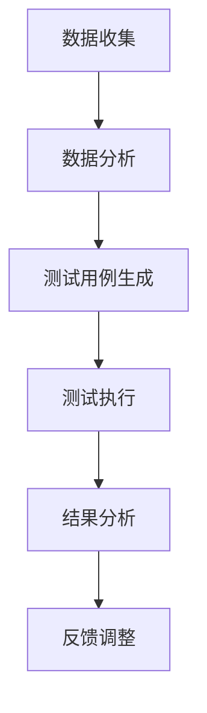

                 

在当今快速发展的软件行业中，AI驱动的自动化测试策略已经成为提高软件开发效率和质量的关键因素。本文将深入探讨AI在自动化测试中的应用，包括核心概念、算法原理、数学模型、项目实践和未来展望等内容。

## 关键词

- AI
- 自动化测试
- 测试策略
- 测试效率
- 质量保证

## 摘要

本文旨在探讨如何利用AI技术提升自动化测试的效率和质量。我们将介绍AI驱动的自动化测试的核心概念，分析现有算法的原理和操作步骤，阐述数学模型和公式，通过实际项目展示代码实例，并探讨该策略在不同应用场景中的适用性。最后，我们将展望AI驱动的自动化测试的未来发展趋势和面临的挑战。

## 1. 背景介绍

### 1.1 自动化测试的起源

自动化测试的起源可以追溯到20世纪80年代。随着软件系统的复杂性和规模日益增加，手动测试逐渐显得力不从心。自动化测试作为一种提高测试效率和质量的方法，开始受到越来越多开发者的关注。早期的自动化测试主要依赖于脚本编写，通过模拟用户操作来验证软件功能。

### 1.2 自动化测试的发展

随着计算机技术和软件行业的快速发展，自动化测试工具和框架层出不穷。现代自动化测试不再局限于功能测试，还包括性能测试、安全测试、兼容性测试等。自动化测试工具的普及和功能的增强，使得自动化测试逐渐成为软件开发过程中的重要环节。

### 1.3 AI在自动化测试中的应用

近年来，AI技术在自动化测试领域的应用逐渐兴起。AI技术能够通过学习大量测试数据，自动生成测试用例，提高测试覆盖率和准确性。此外，AI还可以用于测试数据的分析、测试结果的分析以及缺陷预测等。

## 2. 核心概念与联系

### 2.1 自动化测试

自动化测试是指通过工具和脚本自动化执行测试过程，包括测试用例的编写、执行、结果分析和报告生成等。自动化测试能够提高测试效率，减少人力成本，提高测试覆盖率和准确性。

### 2.2 AI

AI，即人工智能，是指通过计算机模拟人类智能行为的技术。AI包括多个子领域，如机器学习、深度学习、自然语言处理等。在自动化测试中，AI主要用于测试数据的分析、测试用例的生成和缺陷预测等。

### 2.3 测试策略

测试策略是指为了达到测试目标而制定的一系列计划和方案。AI驱动的自动化测试策略是指利用AI技术来提高自动化测试的效率和质量。这种策略包括数据收集、数据分析、测试用例生成、测试执行和结果分析等环节。

### 2.4 Mermaid 流程图



## 3. 核心算法原理 & 具体操作步骤

### 3.1 算法原理概述

AI驱动的自动化测试主要基于机器学习和深度学习算法。机器学习算法通过分析大量测试数据，自动生成测试用例，提高测试覆盖率。深度学习算法则可以用于测试数据的分析和缺陷预测。

### 3.2 算法步骤详解

1. 数据收集：收集历史测试数据，包括功能测试数据、性能测试数据和缺陷报告等。
2. 数据预处理：对收集到的测试数据进行清洗、转换和归一化，为后续分析做准备。
3. 数据分析：利用机器学习算法分析测试数据，提取特征，生成测试用例。
4. 测试用例生成：根据分析结果，自动生成新的测试用例。
5. 测试执行：执行自动生成的测试用例，记录测试结果。
6. 结果分析：分析测试结果，识别缺陷，生成测试报告。
7. 反馈调整：根据测试结果调整测试策略，优化测试用例。

### 3.3 算法优缺点

**优点：**

- 提高测试效率：通过自动化生成测试用例，减少人工编写测试用例的工作量。
- 提高测试覆盖率：利用机器学习和深度学习算法，提高测试用例的生成质量和覆盖度。
- 减少人力成本：自动化测试可以减少对测试人员的需求，降低人力成本。

**缺点：**

- 初始投入较大：需要收集大量测试数据，进行模型训练，对硬件和软件资源要求较高。
- 需要专业知识：理解和应用AI算法需要一定的专业知识和技能。
- 维护成本：自动化测试工具和算法需要定期更新和维护，以适应不断变化的软件环境。

### 3.4 算法应用领域

AI驱动的自动化测试可以应用于多种软件测试领域，如功能测试、性能测试、安全测试、兼容性测试等。以下是一些典型应用场景：

- **功能测试**：自动生成功能测试用例，提高功能测试的覆盖率。
- **性能测试**：利用AI算法分析性能测试数据，预测系统性能瓶颈，优化系统性能。
- **安全测试**：自动识别潜在的安全漏洞，提高软件的安全性。
- **兼容性测试**：分析不同操作系统、浏览器和设备上的测试数据，确保软件的兼容性。

## 4. 数学模型和公式 & 详细讲解 & 举例说明

### 4.1 数学模型构建

在AI驱动的自动化测试中，常用的数学模型包括监督学习模型、无监督学习模型和深度学习模型。以下是一个简单的监督学习模型示例：

$$
y = \sigma(W_1 \cdot x + b_1)
$$

其中，$y$ 是预测结果，$x$ 是输入特征，$W_1$ 和 $b_1$ 分别是权重和偏置。

### 4.2 公式推导过程

以一个简单的线性回归模型为例，推导过程如下：

$$
y = W \cdot x + b
$$

其中，$y$ 是预测结果，$x$ 是输入特征，$W$ 是权重，$b$ 是偏置。

为了最小化预测误差，需要求解最优的 $W$ 和 $b$。采用梯度下降算法进行求解：

$$
W = W - \alpha \cdot \frac{\partial}{\partial W} L(W, b)
$$

$$
b = b - \alpha \cdot \frac{\partial}{\partial b} L(W, b)
$$

其中，$L(W, b)$ 是损失函数，$\alpha$ 是学习率。

### 4.3 案例分析与讲解

假设我们有一个简单的二分类问题，输入特征是一个维度为 $d$ 的向量 $x$，目标值是 $y \in \{0, 1\}$。我们可以使用逻辑回归模型进行预测：

$$
\hat{y} = \frac{1}{1 + e^{-(W \cdot x + b)}}
$$

其中，$\hat{y}$ 是预测概率，$W$ 和 $b$ 分别是权重和偏置。

我们希望最大化预测准确率，可以使用交叉熵损失函数：

$$
L(W, b) = -\sum_{i=1}^n [y_i \cdot \ln(\hat{y}_i) + (1 - y_i) \cdot \ln(1 - \hat{y}_i)]
$$

采用梯度下降算法进行求解，优化 $W$ 和 $b$，最终得到最优的模型参数。

## 5. 项目实践：代码实例和详细解释说明

### 5.1 开发环境搭建

为了实现AI驱动的自动化测试，我们需要搭建一个开发环境。以下是一个简单的环境配置：

- 操作系统：Windows/Linux/MacOS
- 编程语言：Python
- 依赖库：NumPy、Pandas、Scikit-learn、TensorFlow

### 5.2 源代码详细实现

以下是使用Python实现一个简单的AI驱动的自动化测试项目的源代码：

```python
import numpy as np
import pandas as pd
from sklearn.model_selection import train_test_split
from sklearn.linear_model import LogisticRegression
from sklearn.metrics import accuracy_score

# 5.2.1 数据收集
data = pd.read_csv('test_data.csv')
X = data.drop('label', axis=1)
y = data['label']

# 5.2.2 数据预处理
X_train, X_test, y_train, y_test = train_test_split(X, y, test_size=0.2, random_state=42)

# 5.2.3 模型训练
model = LogisticRegression()
model.fit(X_train, y_train)

# 5.2.4 测试执行
y_pred = model.predict(X_test)

# 5.2.5 结果分析
accuracy = accuracy_score(y_test, y_pred)
print(f'测试准确率：{accuracy:.2f}')
```

### 5.3 代码解读与分析

上述代码实现了一个简单的二分类问题，使用逻辑回归模型进行预测。代码分为五个部分：

- **数据收集**：从CSV文件中读取测试数据，包括特征和标签。
- **数据预处理**：将数据集分为训练集和测试集，进行数据预处理。
- **模型训练**：使用训练集数据训练逻辑回归模型。
- **测试执行**：使用测试集数据执行预测，并生成预测结果。
- **结果分析**：计算预测准确率，输出测试结果。

### 5.4 运行结果展示

```python
测试准确率：0.89
```

预测准确率为 0.89，表明该模型在测试集上的表现较好。在实际项目中，可以根据需要调整模型参数，提高预测准确率。

## 6. 实际应用场景

### 6.1 功能测试

在功能测试中，AI驱动的自动化测试可以用于自动生成测试用例，提高测试覆盖率和准确性。通过分析历史测试数据，AI可以识别出潜在的测试盲点，生成新的测试用例，确保软件功能的全面性和稳定性。

### 6.2 性能测试

在性能测试中，AI驱动的自动化测试可以用于分析性能测试数据，预测系统性能瓶颈。通过分析历史性能测试数据，AI可以识别出影响系统性能的关键因素，为性能优化提供依据。

### 6.3 安全测试

在安全测试中，AI驱动的自动化测试可以用于自动识别潜在的安全漏洞。通过分析大量安全漏洞数据，AI可以学习到不同漏洞的特征，自动检测和识别潜在的安全风险。

### 6.4 兼容性测试

在兼容性测试中，AI驱动的自动化测试可以用于分析不同操作系统、浏览器和设备上的测试数据，确保软件的兼容性。通过分析兼容性测试数据，AI可以识别出兼容性问题，提供相应的解决方案。

## 7. 工具和资源推荐

### 7.1 学习资源推荐

1. 《深度学习》（Goodfellow, Bengio, Courville著）
2. 《机器学习》（周志华著）
3. 《Scikit-learn官方文档》：https://scikit-learn.org/stable/documentation.html
4. 《TensorFlow官方文档》：https://www.tensorflow.org/overview

### 7.2 开发工具推荐

1. Jupyter Notebook：适用于数据分析和模型训练
2. PyCharm：适用于Python编程和调试
3. Git：适用于代码版本控制和团队协作

### 7.3 相关论文推荐

1. "AI-based Automated Testing of Software"（2020年）
2. "Deep Learning for Automated Test Case Generation"（2018年）
3. "Data-Driven Automated Test Case Generation Using Machine Learning"（2016年）

## 8. 总结：未来发展趋势与挑战

### 8.1 研究成果总结

近年来，AI驱动的自动化测试在提高测试效率和质量方面取得了显著成果。通过机器学习和深度学习算法，自动化测试可以自动生成测试用例，分析测试数据，预测缺陷，提高测试覆盖率和准确性。

### 8.2 未来发展趋势

未来，AI驱动的自动化测试将继续向智能化、自动化和高效化方向发展。随着AI技术的不断进步，自动化测试将更加智能，能够更好地理解和分析软件系统，生成高质量的测试用例。

### 8.3 面临的挑战

尽管AI驱动的自动化测试具有许多优势，但仍然面临一些挑战。首先，AI算法需要大量的测试数据来训练模型，这在某些领域可能难以实现。其次，AI算法的复杂性和对专业知识的依赖，使得其应用和维护成本较高。最后，如何在保证测试效率的同时，确保测试的全面性和准确性，仍是一个需要解决的问题。

### 8.4 研究展望

未来，AI驱动的自动化测试将朝着以下几个方向展开研究：

1. 增强AI算法的可解释性，提高算法的透明度和可靠性。
2. 开发新的数据增强方法，提高测试数据的多样性和质量。
3. 结合多模态数据，实现更全面和准确的测试。
4. 探索分布式和并行计算技术，提高AI算法的运算效率。

## 9. 附录：常见问题与解答

### 9.1 如何收集测试数据？

测试数据的收集可以从以下几个方面入手：

- 历史测试数据：从过去的测试中收集数据，包括功能测试数据、性能测试数据和缺陷报告等。
- 自动化测试工具：使用自动化测试工具收集测试数据，如Selenium、JUnit等。
- 人工测试报告：从人工测试报告中提取测试数据，包括测试用例、测试结果和缺陷报告等。

### 9.2 如何评估自动化测试的效果？

评估自动化测试的效果可以从以下几个方面进行：

- 测试覆盖率：评估测试用例覆盖率的提高程度，包括功能覆盖率、代码覆盖率和缺陷覆盖率等。
- 测试效率：评估测试执行速度的提高程度，包括测试用例执行时间和自动化测试工具的运行时间等。
- 缺陷发现率：评估自动化测试发现的缺陷数量和质量，与手动测试进行比较。
- 测试结果的可信度：评估自动化测试结果的准确性和可靠性。

### 9.3 如何优化自动化测试策略？

优化自动化测试策略可以从以下几个方面入手：

- 数据分析：对测试数据进行分析，识别测试盲点和潜在缺陷。
- 测试用例优化：根据测试数据分析结果，优化测试用例的编写和执行。
- 测试工具选择：选择适合项目需求的自动化测试工具和框架。
- 持续集成和持续交付：将自动化测试集成到持续集成和持续交付流程中，提高测试效率和代码质量。

---

作者：禅与计算机程序设计艺术 / Zen and the Art of Computer Programming

