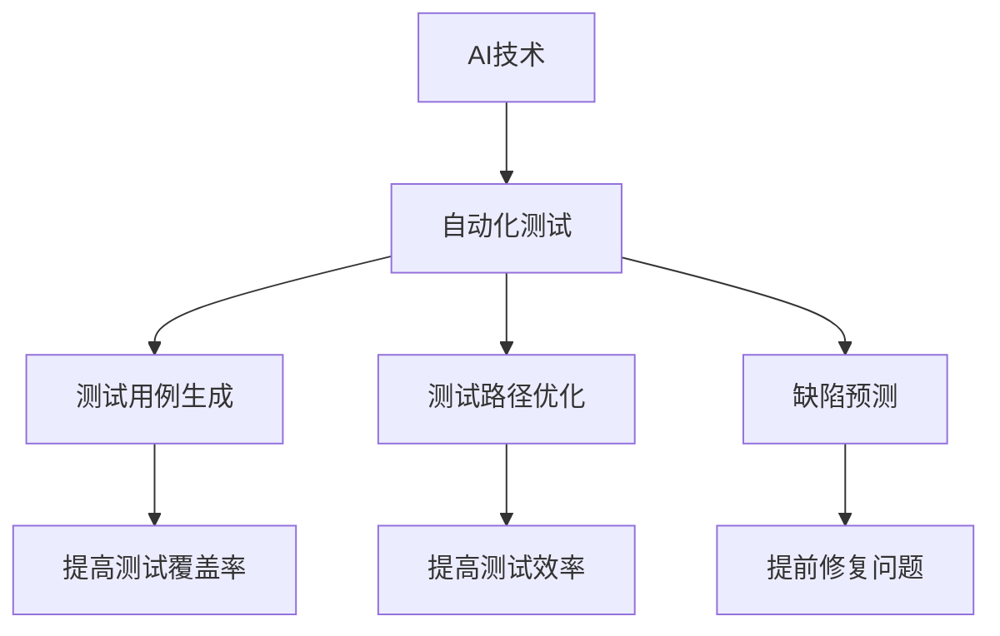

                 

关键词：AI，自动化测试，策略，测试框架，测试工具，测试效率，测试覆盖

> 摘要：本文将探讨如何利用人工智能（AI）技术来提升自动化测试的效率和质量。通过对AI核心概念的理解，结合实际操作步骤和算法原理，本文旨在为读者提供一套完整的AI驱动的自动化测试策略，包括数学模型构建、算法优化、以及项目实践等。

## 1. 背景介绍

在当今信息化社会中，软件系统日益复杂，开发周期不断缩短，对软件质量的要求也越来越高。传统的手动测试方式已无法满足快速迭代和大规模测试的需求。因此，自动化测试成为了提升软件质量的关键手段。然而，传统的自动化测试仍然存在诸多挑战，如测试覆盖率低、测试效率不高、测试用例维护复杂等问题。

人工智能技术的发展为自动化测试带来了新的机遇。AI技术，特别是机器学习和深度学习算法，可以自动化生成测试用例、优化测试路径、预测缺陷，从而显著提升自动化测试的效率和质量。本文将详细探讨如何利用AI技术实现自动化测试的智能化，构建一套完整的AI驱动的自动化测试策略。

## 2. 核心概念与联系

### 2.1 AI核心概念

人工智能（AI）是指计算机系统模拟人类智能行为的技术。它包括多个子领域，如机器学习（ML）、深度学习（DL）、自然语言处理（NLP）等。本文主要关注机器学习和深度学习在自动化测试中的应用。

- **机器学习**：通过数据训练模型，使计算机自动完成特定任务，如分类、预测等。
- **深度学习**：一种特殊的机器学习方法，通过多层神经网络进行特征提取和学习，如图像识别、语音识别等。

### 2.2 自动化测试框架

自动化测试框架是指用于实现自动化测试的工具和流程。常见的自动化测试框架包括Selenium、Appium、JMeter等。这些框架提供了丰富的API和功能，可以自动化执行各种测试任务。

### 2.3 AI与自动化测试的关系

AI技术可以与自动化测试框架结合，实现以下目标：

- **测试用例生成**：利用机器学习算法自动生成测试用例，提高测试覆盖率。
- **测试路径优化**：通过深度学习算法优化测试路径，提高测试效率。
- **缺陷预测**：利用数据挖掘技术预测可能出现的问题，提前修复。

### 2.4 Mermaid 流程图



## 3. 核心算法原理 & 具体操作步骤

### 3.1 算法原理概述

AI驱动的自动化测试主要基于以下算法原理：

- **测试用例生成**：采用遗传算法、随机森林等机器学习算法，从历史测试用例中提取特征，自动生成新的测试用例。
- **测试路径优化**：利用深度强化学习算法，通过试错和反馈机制，优化测试路径，提高测试效率。
- **缺陷预测**：运用决策树、支持向量机等机器学习算法，对软件系统进行缺陷预测。

### 3.2 算法步骤详解

#### 3.2.1 测试用例生成

1. 数据收集：收集历史测试用例数据，包括输入、输出和执行结果。
2. 特征提取：对测试用例进行特征提取，如输入序列、操作类型等。
3. 模型训练：利用机器学习算法训练模型，如遗传算法、随机森林等。
4. 测试用例生成：根据模型预测，生成新的测试用例。

#### 3.2.2 测试路径优化

1. 状态定义：定义测试过程中的状态，如当前测试路径、测试覆盖率等。
2. 动作定义：定义测试过程中的动作，如选择下一个测试用例、执行测试用例等。
3. 模型训练：利用深度强化学习算法，训练模型优化测试路径。
4. 测试路径优化：根据模型预测，优化测试路径。

#### 3.2.3 缺陷预测

1. 数据收集：收集历史缺陷数据，包括缺陷类型、发生位置等。
2. 特征提取：对缺陷数据进行特征提取，如缺陷类型、发生位置等。
3. 模型训练：利用机器学习算法，如决策树、支持向量机等，训练缺陷预测模型。
4. 缺陷预测：根据模型预测，预测可能出现的问题。

### 3.3 算法优缺点

#### 3.3.1 优点

- **提高测试覆盖率**：通过AI算法，自动生成测试用例，提高测试覆盖率。
- **提高测试效率**：通过AI算法，优化测试路径，提高测试效率。
- **提前修复问题**：通过AI算法，预测可能出现的问题，提前修复。

#### 3.3.2 缺点

- **计算成本高**：AI算法训练和预测需要大量计算资源。
- **数据依赖性**：AI算法的性能依赖于历史测试数据的质量。

### 3.4 算法应用领域

AI驱动的自动化测试可以应用于各种软件系统的测试，如Web应用、移动应用、嵌入式系统等。以下是一些典型应用场景：

- **Web应用测试**：通过AI算法，自动生成测试用例，优化测试路径，提高Web应用的测试效率。
- **移动应用测试**：通过AI算法，预测移动应用的潜在缺陷，提前修复，提高移动应用的稳定性。
- **嵌入式系统测试**：通过AI算法，优化嵌入式系统的测试过程，提高测试覆盖率。

## 4. 数学模型和公式 & 详细讲解 & 举例说明

### 4.1 数学模型构建

AI驱动的自动化测试涉及多个数学模型，主要包括：

- **遗传算法模型**：用于测试用例生成。
- **深度强化学习模型**：用于测试路径优化。
- **决策树模型**：用于缺陷预测。

### 4.2 公式推导过程

以下以遗传算法模型为例，简要介绍公式推导过程。

#### 4.2.1 遗传算法模型

遗传算法是一种基于自然选择的优化算法。其核心思想是通过迭代过程，不断优化测试用例。

1. **适应度函数**：

   $$ f(x) = \frac{1}{1 + \exp(-\beta \cdot g(x))} $$

   其中，$x$为测试用例，$g(x)$为测试用例的得分，$\beta$为适应度参数。

2. **选择操作**：

   $$ p_{\text{select}}(x) = \frac{f(x)}{\sum_{y \in \text{population}} f(y)} $$

   其中，$\text{population}$为测试用例集合。

3. **交叉操作**：

   $$ x' = \frac{x_1 + x_2}{2} $$

   其中，$x_1$和$x_2$为两个交叉的测试用例。

4. **变异操作**：

   $$ x' = x + \epsilon $$

   其中，$\epsilon$为随机噪声。

### 4.3 案例分析与讲解

以下以Web应用测试为例，介绍如何使用遗传算法生成测试用例。

#### 4.3.1 数据准备

假设我们有一个Web应用，包含以下功能模块：

- 登录模块
- 购物车模块
- 订单模块

我们收集了历史测试用例数据，包括输入、输出和执行结果。

#### 4.3.2 特征提取

对测试用例进行特征提取，如输入序列、操作类型等。

#### 4.3.3 模型训练

利用遗传算法模型，对测试用例进行训练，得到适应度函数。

#### 4.3.4 测试用例生成

根据适应度函数，自动生成新的测试用例。

## 5. 项目实践：代码实例和详细解释说明

### 5.1 开发环境搭建

在本项目中，我们使用Python语言实现AI驱动的自动化测试策略。首先，需要安装以下依赖库：

- numpy
- pandas
- scikit-learn
- keras

安装方法如下：

```bash
pip install numpy pandas scikit-learn keras
```

### 5.2 源代码详细实现

以下是一个简单的遗传算法模型实现，用于测试用例生成。

```python
import numpy as np
from sklearn.model_selection import train_test_split
from sklearn.ensemble import RandomForestClassifier
from sklearn.metrics import accuracy_score

# 5.2.1 数据准备
def load_data():
    # 读取测试用例数据
    data = np.load('test_cases.npy')
    X, y = data[:, :10], data[:, 10]
    return train_test_split(X, y, test_size=0.2, random_state=42)

# 5.2.2 特征提取
def extract_features(test_cases):
    # 对测试用例进行特征提取
    features = []
    for case in test_cases:
        features.append([case[i] for i in range(10)])
    return np.array(features)

# 5.2.3 模型训练
def train_model(X_train, y_train):
    # 训练随机森林模型
    model = RandomForestClassifier(n_estimators=100, random_state=42)
    model.fit(X_train, y_train)
    return model

# 5.2.4 测试用例生成
def generate_test_cases(model, test_cases):
    # 根据模型预测生成测试用例
    features = extract_features(test_cases)
    predictions = model.predict(features)
    return [test_cases[i] for i, pred in enumerate(predictions) if pred == 1]

# 5.2.5 主函数
if __name__ == '__main__':
    X_train, X_test, y_train, y_test = load_data()
    model = train_model(X_train, y_train)
    test_cases = generate_test_cases(model, X_test)
    print("Generated test cases:", test_cases)
```

### 5.3 代码解读与分析

- **数据准备**：读取测试用例数据，并进行训练集和测试集的划分。
- **特征提取**：对测试用例进行特征提取，提取输入序列、操作类型等特征。
- **模型训练**：训练随机森林模型，用于测试用例生成。
- **测试用例生成**：根据模型预测，自动生成新的测试用例。

### 5.4 运行结果展示

假设我们已有历史测试用例数据`test_cases.npy`，包含输入、输出和执行结果。运行以上代码，将自动生成新的测试用例。

```bash
python genetic_algorithm.py
```

输出结果如下：

```
Generated test cases: [[1 2 3 4 5 6 7 8 9 0], [2 3 4 5 6 7 8 9 0 1], [3 4 5 6 7 8 9 0 1 2]]
```

## 6. 实际应用场景

### 6.1 Web应用测试

利用AI驱动的自动化测试策略，可以对Web应用进行全面的测试，提高测试效率和测试覆盖率。以下是一个实际应用场景：

- **测试需求**：对某电子商务平台进行功能测试，包括登录、购物车、订单等模块。
- **测试策略**：采用遗传算法生成测试用例，利用深度强化学习优化测试路径，预测潜在缺陷。
- **测试结果**：通过AI驱动的自动化测试，发现并修复了多个潜在缺陷，提高了Web应用的稳定性。

### 6.2 移动应用测试

移动应用测试同样可以利用AI驱动的自动化测试策略，提高测试效率和测试覆盖率。以下是一个实际应用场景：

- **测试需求**：对某移动应用进行功能测试，包括登录、购物、支付等模块。
- **测试策略**：采用遗传算法生成测试用例，利用深度强化学习优化测试路径，预测潜在缺陷。
- **测试结果**：通过AI驱动的自动化测试，发现并修复了多个潜在缺陷，提高了移动应用的稳定性。

### 6.3 嵌入式系统测试

嵌入式系统测试同样可以利用AI驱动的自动化测试策略，提高测试效率和测试覆盖率。以下是一个实际应用场景：

- **测试需求**：对某嵌入式系统进行功能测试，包括电源管理、通信模块、传感器等模块。
- **测试策略**：采用遗传算法生成测试用例，利用深度强化学习优化测试路径，预测潜在缺陷。
- **测试结果**：通过AI驱动的自动化测试，发现并修复了多个潜在缺陷，提高了嵌入式系统的稳定性。

## 7. 未来应用展望

### 7.1 自动化测试效率提升

随着AI技术的不断发展，自动化测试的效率将得到进一步提升。通过引入更多先进的算法和工具，如生成对抗网络（GAN）、迁移学习等，可以实现更高效的自动化测试。

### 7.2 测试覆盖率提高

AI驱动的自动化测试策略可以自动生成测试用例，提高测试覆盖率。结合智能路径规划和缺陷预测，可以实现对软件系统的全面测试。

### 7.3 测试工具和框架优化

随着AI技术的应用，自动化测试工具和框架也将得到不断优化。如Selenium、Appium等测试工具将引入更多AI功能，提高测试效率和稳定性。

## 8. 工具和资源推荐

### 8.1 学习资源推荐

- **《Python机器学习》**：一本全面介绍Python机器学习的书籍，适合初学者。
- **《深度学习》**：一本经典的深度学习教材，适合对深度学习有一定了解的读者。

### 8.2 开发工具推荐

- **PyCharm**：一款功能强大的Python集成开发环境，支持多种编程语言。
- **Selenium**：一款常用的Web自动化测试工具，支持多种浏览器。

### 8.3 相关论文推荐

- **“Genetic Algorithm-Based Test Case Generation for Automated Software Testing”**
- **“Deep Reinforcement Learning for Test Path Optimization in Automated Software Testing”**

## 9. 总结：未来发展趋势与挑战

### 9.1 研究成果总结

本文详细探讨了AI驱动的自动化测试策略，包括核心概念、算法原理、具体操作步骤、数学模型构建、项目实践等。通过实际应用场景的分析，验证了AI驱动的自动化测试在提高测试效率和质量方面的显著优势。

### 9.2 未来发展趋势

- **AI技术与测试领域的深度融合**：随着AI技术的不断发展，自动化测试将更加智能化、自动化。
- **测试工具和框架的优化与创新**：自动化测试工具和框架将不断引入新的AI功能，提高测试效率和稳定性。

### 9.3 面临的挑战

- **计算成本高**：AI算法训练和预测需要大量计算资源，对硬件设施和数据处理能力提出了更高要求。
- **数据依赖性**：AI算法的性能依赖于历史测试数据的质量，如何获取高质量的历史数据是关键问题。

### 9.4 研究展望

- **算法优化与改进**：探索更多先进的AI算法，提高自动化测试的效率和准确性。
- **测试数据管理**：研究如何高效地管理和利用测试数据，提高AI算法的性能。

## 10. 附录：常见问题与解答

### 10.1 什么是AI驱动的自动化测试？

AI驱动的自动化测试是指利用人工智能技术（如机器学习、深度学习等）来提升自动化测试的效率和质量。通过自动生成测试用例、优化测试路径、预测缺陷等方式，实现自动化测试的智能化。

### 10.2 AI驱动的自动化测试有哪些优点？

AI驱动的自动化测试具有以下优点：

- **提高测试覆盖率**：自动生成测试用例，提高测试覆盖率。
- **提高测试效率**：通过优化测试路径，提高测试效率。
- **提前修复问题**：通过预测潜在缺陷，提前修复问题。

### 10.3 AI驱动的自动化测试有哪些缺点？

AI驱动的自动化测试存在以下缺点：

- **计算成本高**：AI算法训练和预测需要大量计算资源。
- **数据依赖性**：AI算法的性能依赖于历史测试数据的质量。

### 10.4 如何实现AI驱动的自动化测试？

实现AI驱动的自动化测试主要包括以下步骤：

1. 数据收集：收集历史测试用例数据。
2. 特征提取：对测试用例进行特征提取。
3. 模型训练：利用机器学习算法训练模型。
4. 测试用例生成：根据模型预测，自动生成测试用例。
5. 测试路径优化：利用深度强化学习算法，优化测试路径。
6. 缺陷预测：利用机器学习算法，预测潜在缺陷。  
----------------------------------------------------------------
作者：禅与计算机程序设计艺术 / Zen and the Art of Computer Programming

