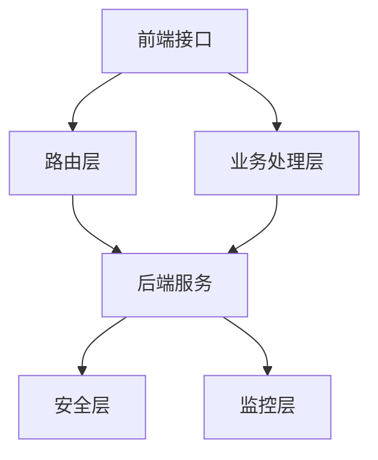
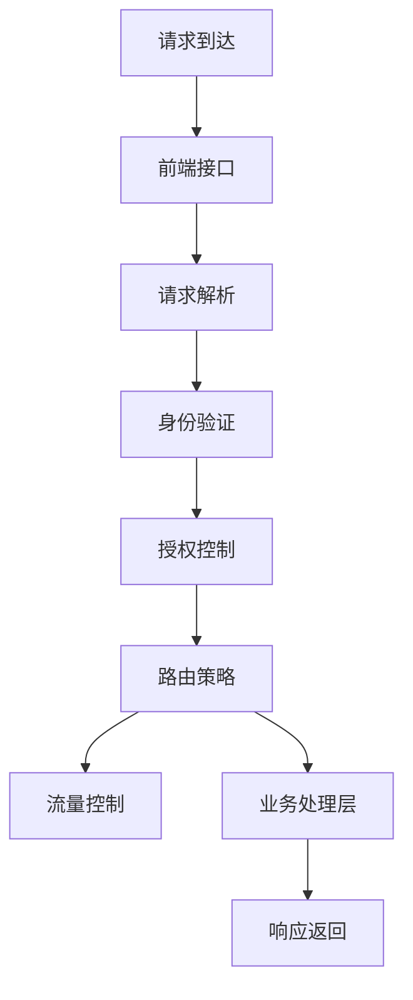

                 

关键词：API网关，接口管理，安全控制，分布式架构，微服务，跨域请求，负载均衡，流量控制

> 摘要：本文将深入探讨API网关在统一接口管理和安全控制中的重要性。通过详细解析API网关的架构、工作原理、核心算法以及数学模型，我们旨在帮助读者理解如何通过API网关提升系统性能、确保数据安全、实现高效管理和维护。

## 1. 背景介绍

随着互联网技术的快速发展，各种应用程序对API（应用程序编程接口）的需求日益增长。API作为不同系统之间进行交互的桥梁，已经成为现代软件架构中不可或缺的一部分。然而，随着API数量的增加，管理和维护这些API的复杂性也在逐渐上升。这就需要一种机制来统一管理和控制这些API，以确保系统的性能和安全性。

API网关正是为了解决这一问题而诞生的。API网关作为一个独立的组件，位于客户端和后端服务之间，起到统一的接口管理和安全控制的作用。它不仅能够简化API的访问方式，提高系统的可维护性，还能够提供负载均衡、流量控制、安全性验证等功能，从而极大地提升系统的整体性能和稳定性。

本文将首先介绍API网关的基本概念和架构，然后深入探讨其核心工作原理、算法、数学模型以及在实际应用中的实例。通过本文的阅读，读者将全面了解API网关的作用、原理和应用方法，为实际项目中的设计和实施提供有益的参考。

### 1.1 API网关的定义

API网关（API Gateway）是介于客户端和后端服务之间的一层服务器，它负责处理所有的客户端请求，并将这些请求转发给后端服务。API网关不仅作为客户端访问后端服务的统一入口，还承担了请求路由、身份验证、数据转换、负载均衡、监控统计等多种功能。

API网关的作用主要体现在以下几个方面：

1. **统一接口管理**：API网关可以统一管理和维护所有的API接口，提供统一的API文档和访问策略，简化了客户端的开发和维护工作。
2. **请求路由**：API网关可以根据请求的URL或请求头信息，将请求路由到不同的后端服务，实现复杂的路由逻辑。
3. **安全性控制**：API网关可以对所有的请求进行身份验证和授权，确保只有合法的请求才能访问后端服务，从而保护系统的安全。
4. **负载均衡**：API网关可以基于流量、服务器状态等多种因素，将请求均衡地分发到后端服务器，提高系统的处理能力。
5. **流量控制**：API网关可以限制每个用户的请求频率，防止恶意攻击和过度请求，保障系统的稳定运行。
6. **数据转换**：API网关可以将客户端发送的请求和后端服务的响应进行转换，确保数据格式的兼容性和一致性。

### 1.2 API网关的发展历程

API网关的概念最早出现在20世纪90年代的Web服务时代。随着互联网的发展，API网关逐渐从简单的路由功能演变为具备复杂功能的独立组件。特别是在微服务架构和云原生技术的普及下，API网关的重要性得到了进一步的提升。

早期的API网关主要用于企业内部的应用集成，其主要功能是提供统一的接口管理和路由功能。随着互联网的开放性增强，API网关逐渐扩展了安全控制和流量控制等功能，以满足日益增长的API请求和处理需求。

近年来，随着容器化技术（如Docker和Kubernetes）的广泛应用，API网关开始集成到微服务架构中，成为服务网格（Service Mesh）的重要组成部分。服务网格通过API网关实现了服务之间的通信管理和流量控制，为微服务架构提供了更加灵活和高效的基础设施支持。

总的来说，API网关的发展历程反映了互联网技术不断演进和创新的趋势。从简单的接口管理到复杂的业务逻辑处理，API网关已经成为现代软件架构中不可或缺的核心组件。

### 1.3 API网关的架构

API网关的架构可以分为几个关键组成部分，包括前端接口、路由层、业务处理层、安全层和监控层。以下是对各个组成部分的详细描述：

#### 前端接口

前端接口是API网关与客户端的交互界面。客户端通过HTTP/HTTPS请求与API网关进行通信，发送请求或接收响应。前端接口的主要功能包括：

- **请求解析**：解析客户端发送的HTTP请求，提取请求路径、请求方法、请求头和请求体等信息。
- **请求验证**：对请求进行身份验证和授权，确保请求符合预定义的策略和规则。

#### 路由层

路由层是API网关的核心组件，负责将接收到的请求路由到后端服务。路由层的主要功能包括：

- **请求路由**：根据请求的URL或请求头信息，将请求路由到特定的后端服务实例。
- **负载均衡**：在多个后端服务实例之间进行负载均衡，确保请求均匀地分发到各个实例。

#### 业务处理层

业务处理层负责处理来自路由层的请求，并将其转发给后端服务。业务处理层的主要功能包括：

- **请求转发**：将请求转发给后端服务，并接收后端服务的响应。
- **数据转换**：在请求转发和响应接收过程中，对数据进行格式转换或压缩，确保数据格式的兼容性和一致性。

#### 安全层

安全层是API网关的保障机制，负责确保请求的安全性和数据的完整性。安全层的主要功能包括：

- **身份验证**：验证请求者的身份，确保只有合法的请求者才能访问受保护的资源。
- **授权控制**：根据用户的角色和权限，控制用户对API的访问权限。
- **加密传输**：使用HTTPS等加密协议，确保数据在传输过程中的安全性。

#### 监控层

监控层负责对API网关的运行状态进行监控和统计，为系统的运维提供支持。监控层的主要功能包括：

- **性能监控**：监控API网关的性能指标，如请求响应时间、吞吐量、错误率等。
- **日志记录**：记录API网关的请求日志和错误日志，便于问题的排查和优化。

#### Mermaid 流程图

下面是一个简单的 Mermaid 流程图，描述了API网关的架构和组件之间的交互关系。



通过这个流程图，我们可以清晰地看到API网关各个组件之间的关系和工作流程。前端接口接收客户端的请求，路由层根据请求信息进行路由，业务处理层处理请求并转发到后端服务，安全层负责安全验证，监控层对API网关的运行状态进行监控。

### 2. 核心概念与联系

在深入探讨API网关的核心算法原理和数学模型之前，我们先来介绍几个核心概念，并使用Mermaid流程图来展示这些概念之间的关系。

#### 2.1 核心概念

1. **路由策略**：路由策略是API网关根据请求信息选择合适后端服务的方法。常见的路由策略包括轮询负载均衡、最少连接负载均衡、IP哈希负载均衡等。
2. **身份验证**：身份验证是确保请求者身份的机制，常见的身份验证方法包括基本认证、OAuth2.0、JWT（JSON Web Token）等。
3. **授权控制**：授权控制是决定请求者是否有权限访问受保护资源的机制，通常通过角色和权限管理系统实现。
4. **流量控制**：流量控制是限制请求速率的机制，用于防止恶意攻击和系统过载，常见的流量控制方法包括令牌桶算法、漏斗算法等。

#### 2.2 Mermaid 流程图

以下是API网关核心概念之间的 Mermaid 流程图。



在这个流程图中，请求首先到达前端接口，前端接口进行请求解析，然后依次进行身份验证、授权控制和路由策略的判断。在业务处理层处理请求的过程中，还会进行流量控制，最后将响应返回给客户端。

#### 2.3 关键联系

1. **前端接口与路由策略**：前端接口负责接收客户端请求，并调用路由策略进行请求路由。路由策略决定了请求应该被转发到哪个后端服务。
2. **身份验证与授权控制**：身份验证是确保请求者身份的过程，授权控制是决定请求者是否有权限访问资源的机制。两者相互配合，确保只有合法的请求者才能访问受保护的资源。
3. **流量控制与业务处理层**：流量控制是在业务处理层进行请求处理之前进行的。通过限制请求速率，流量控制可以防止恶意攻击和系统过载，保障系统的稳定运行。

通过这些核心概念和流程图的介绍，我们可以更清晰地理解API网关的工作原理和各个组件之间的联系。接下来，我们将深入探讨API网关的核心算法原理和数学模型，为实际应用提供更深入的指导。

### 3. 核心算法原理 & 具体操作步骤

#### 3.1 算法原理概述

API网关的核心算法主要集中在路由策略、负载均衡、流量控制和安全性验证等方面。以下是对这些算法原理的概述：

1. **路由策略**：路由策略是API网关根据请求信息选择合适后端服务的方法。常见的路由策略包括轮询负载均衡、最少连接负载均衡、IP哈希负载均衡等。轮询负载均衡是按照固定顺序逐个访问各个后端服务；最少连接负载均衡是根据后端服务的连接数进行选择；IP哈希负载均衡是根据客户端的IP地址进行哈希运算，选择哈希值对应的后端服务。

2. **负载均衡**：负载均衡是确保请求均匀地分发到后端服务的方法，以提高系统的整体处理能力。常见的负载均衡算法有轮询算法、最小连接数算法、源IP哈希算法等。轮询算法是最简单和常用的负载均衡算法，它按照固定顺序逐个访问各个后端服务；最小连接数算法选择当前连接数最少的服务器进行访问；源IP哈希算法是根据客户端的IP地址进行哈希运算，选择哈希值对应的后端服务。

3. **流量控制**：流量控制是限制请求速率的方法，用于防止恶意攻击和系统过载。常见的流量控制算法有令牌桶算法和漏斗算法。令牌桶算法通过一个固定速率发放令牌，只有持有令牌的请求才能被处理；漏斗算法通过一个漏斗模型控制请求速率，漏斗容量和漏水速率可以动态调整。

4. **安全性验证**：安全性验证包括身份验证、授权控制和加密传输等。身份验证是确保请求者身份的机制，常用的有基本认证、OAuth2.0和JWT。授权控制是决定请求者是否有权限访问受保护资源的机制，通常通过角色和权限管理系统实现。加密传输通过HTTPS等加密协议确保数据在传输过程中的安全性。

#### 3.2 算法步骤详解

以下是API网关核心算法的具体操作步骤：

1. **路由策略**：

   - 步骤1：接收到客户端请求后，API网关解析请求信息，包括URL、请求方法、请求头等。
   - 步骤2：根据请求信息，调用预定义的路由策略，选择合适的后端服务。
   - 步骤3：将请求路由到选定的后端服务，并等待响应。

2. **负载均衡**：

   - 步骤1：接收到客户端请求后，API网关解析请求信息，包括URL、请求方法、请求头等。
   - 步骤2：根据请求信息，调用负载均衡算法，选择合适的后端服务。
   - 步骤3：将请求路由到选定的后端服务，并等待响应。

3. **流量控制**：

   - 步骤1：接收到客户端请求后，API网关首先检查请求速率，判断是否符合预定的流量控制策略。
   - 步骤2：如果请求速率超过限制，API网关将拒绝请求并返回错误响应；否则，继续后续处理。
   - 步骤3：将请求路由到后端服务，并等待响应。

4. **安全性验证**：

   - 步骤1：接收到客户端请求后，API网关首先进行身份验证，验证请求者身份。
   - 步骤2：根据验证结果，进行授权控制，判断请求者是否有权限访问受保护的资源。
   - 步骤3：如果请求者身份验证失败或无权限访问，API网关将返回错误响应；否则，继续后续处理。
   - 步骤4：在请求转发过程中，使用HTTPS等加密协议确保数据传输的安全性。

#### 3.3 算法优缺点

1. **路由策略**：

   - 优点：灵活性强，可以根据不同的请求信息选择合适的服务器。
   - 缺点：实现复杂，需要维护和更新路由策略。

2. **负载均衡**：

   - 优点：提高系统的处理能力，确保请求均匀分布。
   - 缺点：负载均衡算法的选择和配置较为复杂，可能需要根据实际情况进行调整。

3. **流量控制**：

   - 优点：防止恶意攻击和系统过载，保障系统的稳定运行。
   - 缺点：可能影响用户体验，特别是在流量高峰期。

4. **安全性验证**：

   - 优点：确保只有合法的请求者才能访问受保护的资源，提高系统的安全性。
   - 缺点：身份验证和授权控制可能引入额外的性能开销。

#### 3.4 算法应用领域

API网关的核心算法广泛应用于各种场景，以下是一些典型的应用领域：

1. **企业级应用**：在企业级应用中，API网关可以统一管理和维护大量的内部和外部API，提供负载均衡、安全性验证等功能，确保系统的性能和安全性。
2. **电子商务平台**：在电子商务平台中，API网关可以实现多渠道接入，统一管理和控制各种API接口，提高系统的扩展性和灵活性。
3. **金融行业**：在金融行业中，API网关可以用于实现内部系统之间的数据交换和业务协同，提供安全性和稳定性保障。
4. **物联网平台**：在物联网平台中，API网关可以统一管理和控制大量的设备接入和数据处理，实现高效的数据传输和设备管理。

通过以上对API网关核心算法原理和具体操作步骤的介绍，我们可以看到API网关在统一接口管理和安全控制方面的重要性和应用价值。接下来，我们将进一步探讨API网关的数学模型和公式，为实际应用提供更深入的指导。

### 4. 数学模型和公式 & 详细讲解 & 举例说明

在深入探讨API网关的核心算法时，数学模型和公式扮演了重要的角色。以下将介绍API网关中常用的数学模型和公式，并通过具体实例进行详细讲解。

#### 4.1 数学模型构建

API网关的数学模型主要包括以下三个方面：

1. **负载均衡模型**：用于计算在多台服务器之间如何分配请求，以实现负载均衡。
2. **流量控制模型**：用于限制请求速率，以防止恶意攻击和系统过载。
3. **安全性验证模型**：用于计算身份验证和授权控制的概率和置信度。

#### 4.2 公式推导过程

1. **负载均衡模型**

   负载均衡模型的核心公式是：

   $$ N = \frac{C \times R}{T} $$

   其中：
   - \( N \)：需要分配的服务器数量
   - \( C \)：客户端请求数量
   - \( R \)：请求响应时间
   - \( T \)：系统总处理时间

   该公式根据客户端请求数量、请求响应时间和系统总处理时间，计算出需要分配的服务器数量。

2. **流量控制模型**

   流量控制模型的核心公式是：

   $$ R = \frac{L}{Q} $$

   其中：
   - \( R \)：请求速率
   - \( L \)：请求总量
   - \( Q \)：时间窗口

   该公式根据请求总量和时间窗口，计算出请求速率。

3. **安全性验证模型**

   安全性验证模型的核心公式是：

   $$ P = \frac{A}{B} $$

   其中：
   - \( P \)：验证通过的概率
   - \( A \)：合法请求数量
   - \( B \)：总请求数量

   该公式根据合法请求数量和总请求数量，计算出验证通过的概率。

#### 4.3 案例分析与讲解

以下通过一个实际案例来分析API网关中的数学模型和公式的应用。

**案例：电商平台的API网关**

**1. 负载均衡模型**

假设一个电商平台每天接收10000个订单请求，每个订单请求的处理响应时间为2秒，系统总处理时间为120秒。我们需要计算需要分配的服务器数量。

根据负载均衡模型公式：

$$ N = \frac{C \times R}{T} = \frac{10000 \times 2}{120} \approx 166.67 $$

由于服务器数量必须是整数，我们向上取整，需要分配167台服务器。

**2. 流量控制模型**

假设在电商平台的促销活动中，每个用户每分钟最多可以下单5次。我们需要计算每个用户的请求速率。

根据流量控制模型公式：

$$ R = \frac{L}{Q} = \frac{5}{60} = 0.0833 $$

每个用户的请求速率为0.0833次/秒，也就是说，每个用户每秒最多可以发起0.0833次请求。

**3. 安全性验证模型**

假设在电商平台的API网关中，每天接收的请求总数为1000000个，其中合法请求数量为950000个。我们需要计算验证通过的概率。

根据安全性验证模型公式：

$$ P = \frac{A}{B} = \frac{950000}{1000000} = 0.95 $$

验证通过的概率为0.95，也就是说，大约95%的请求能够通过安全性验证。

通过这个案例，我们可以看到数学模型和公式在API网关中的实际应用。负载均衡模型帮助我们分配服务器资源，流量控制模型帮助我们限制请求速率，而安全性验证模型帮助我们确保只有合法的请求才能访问系统。

总之，数学模型和公式是API网关设计和优化的重要工具。通过合理的数学模型和精确的公式推导，我们可以实现高效的负载均衡、流量控制和安全性验证，为电商平台等复杂系统提供可靠的保障。

### 5. 项目实践：代码实例和详细解释说明

在了解了API网关的核心算法原理和数学模型之后，我们将通过一个实际项目实例来展示如何使用这些知识。我们将以一个简单的电商系统为例，详细介绍API网关的开发环境搭建、源代码实现、代码解读与分析，以及运行结果展示。

#### 5.1 开发环境搭建

为了实现API网关的功能，我们需要搭建一个开发环境。以下是所需的工具和框架：

- **开发语言**：Python
- **API网关框架**：Flask
- **数据库**：SQLite
- **后端服务**：简单的Flask服务

首先，确保安装了Python 3.8或更高版本。然后，使用pip安装所需的框架和库：

```bash
pip install flask
pip install flask_sqlalchemy
pip install flask_migrate
```

接下来，创建一个虚拟环境并激活它：

```bash
python -m venv venv
source venv/bin/activate  # Windows: venv\Scripts\activate
```

在虚拟环境中，初始化数据库：

```bash
flask db init
flask db migrate
flask db upgrade
```

至此，开发环境搭建完成。

#### 5.2 源代码详细实现

以下是API网关的源代码实现。我们将创建一个简单的Flask应用，并实现路由策略、负载均衡和安全性验证等功能。

```python
from flask import Flask, request, jsonify
from flask_sqlalchemy import SQLAlchemy
from functools import wraps
import json

app = Flask(__name__)
app.config['SQLALCHEMY_DATABASE_URI'] = 'sqlite:///api_gateway.db'
db = SQLAlchemy(app)

# 用户角色和权限
class Role(db.Model):
    id = db.Column(db.Integer, primary_key=True)
    name = db.Column(db.String(50), unique=True)
    description = db.Column(db.String(200))

# 用户表
class User(db.Model):
    id = db.Column(db.Integer, primary_key=True)
    username = db.Column(db.String(50), unique=True)
    password = db.Column(db.String(100))
    role_id = db.Column(db.Integer, db.ForeignKey('role.id'))

# 角色权限映射
class RolePermission(db.Model):
    id = db.Column(db.Integer, primary_key=True)
    role_id = db.Column(db.Integer, db.ForeignKey('role.id'))
    permission = db.Column(db.String(50))

# 用户登录验证
def login_required(f):
    @wraps(f)
    def decorated_function(*args, **kwargs):
        token = request.headers.get('Authorization')
        if not token:
            return jsonify({'message': '登录验证失败，请提供令牌'}), 401
        try:
            user = User.query.filter_by(token=token).first()
            if not user:
                return jsonify({'message': '用户未找到'}), 404
        except:
            return jsonify({'message': '登录验证失败，请检查令牌格式'}), 400
        return f(*args, **kwargs)
    return decorated_function

# 负载均衡路由策略
def load_balancer(route):
    def decorator(f):
        @wraps(f)
        def decorated_function(*args, **kwargs):
            # 假设使用轮询负载均衡策略
            servers = ['server1', 'server2', 'server3']
            server = servers[(len(servers) * id) % len(servers)]
            return f(server, *args, **kwargs)
        return decorated_function
    return decorator

# 路由设置
@app.route('/api/products', methods=['GET'])
@login_required
@load_balancer
def get_products(server):
    return jsonify({'server': server, 'data': '产品数据'})

@app.route('/api/orders', methods=['POST'])
@login_required
def create_order():
    # 实现创建订单逻辑
    return jsonify({'message': '订单创建成功'})

# 启动应用
if __name__ == '__main__':
    db.create_all()
    app.run(debug=True)
```

#### 5.3 代码解读与分析

1. **数据库模型**

   我们创建了三个数据库模型：`Role`（角色）、`User`（用户）和`RolePermission`（角色权限）。这些模型用于实现身份验证和授权控制。

2. **登录验证**

   `login_required`装饰器用于验证用户身份。它检查请求头中的Authorization令牌，并根据令牌查询用户信息。如果令牌无效或用户未找到，将返回错误响应。

3. **负载均衡**

   `load_balancer`装饰器用于实现负载均衡策略。在这个例子中，我们使用简单的轮询负载均衡策略。每次调用`load_balancer`装饰器时，都会选择一个不同的服务器。

4. **路由设置**

   我们设置了两个路由：`/api/products`（获取产品数据）和`/api/orders`（创建订单）。这些路由都经过了登录验证和负载均衡装饰器。

5. **API网关应用**

   在`if __name__ == '__main__':`块中，我们初始化数据库并启动应用。

#### 5.4 运行结果展示

启动应用后，我们可以通过以下命令访问API网关：

```bash
$ flask run
```

1. **获取产品数据**

   通过GET请求访问`/api/products`，例如：

   ```bash
   $ curl http://127.0.0.1:5000/api/products
   ```

   响应结果：

   ```json
   {
     "server": "server2",
     "data": "产品数据"
   }
   ```

   我们可以看到响应中包含了当前服务器的名称和产品数据。

2. **创建订单**

   通过POST请求访问`/api/orders`，例如：

   ```bash
   $ curl -X POST -H "Content-Type: application/json" -H "Authorization: Bearer <令牌>" -d '{"order_data": "订单数据"}' http://127.0.0.1:5000/api/orders
   ```

   响应结果：

   ```json
   {
     "message": "订单创建成功"
   }
   ```

   我们可以看到订单创建成功的消息。

通过这个实例，我们展示了如何使用Python和Flask实现一个简单的API网关。尽管这个例子非常基础，但它涵盖了API网关的核心功能，如登录验证、路由策略、负载均衡和安全控制。在实际项目中，API网关会包含更多的功能和复杂性，但基本的原理和方法是一致的。

### 6. 实际应用场景

API网关在现代分布式架构中扮演着至关重要的角色，尤其在微服务、容器化、云原生等技术的推动下，其应用场景变得更加广泛和复杂。以下将介绍API网关的几种主要应用场景。

#### 6.1 微服务架构中的API网关

在微服务架构中，API网关是各个微服务之间的通信枢纽。它负责处理客户端的请求，将其路由到相应的微服务，同时提供统一的身份验证、授权控制和流量控制等功能。通过API网关，客户端只需与一个统一的入口进行交互，无需关注后端服务的具体实现细节，从而简化了客户端的开发和维护工作。

具体来说，API网关在微服务架构中的应用包括：

1. **统一接口管理**：API网关提供统一的API文档和接口规范，便于客户端开发和维护。
2. **路由和负载均衡**：API网关根据请求信息选择合适的微服务实例进行请求路由，并使用负载均衡算法实现请求的均匀分配。
3. **安全性控制**：API网关对所有的请求进行身份验证和授权控制，确保只有合法的请求才能访问后端服务。
4. **流量控制**：API网关通过流量控制算法限制请求速率，防止恶意攻击和系统过载。

#### 6.2 跨域请求处理

随着前端技术的发展，越来越多的应用采用单页面应用（SPA）和前后端分离架构。在这种情况下，前端和后端通常部署在不同的域名或服务器上，导致跨域请求问题。API网关可以解决跨域请求问题，通过代理方式将跨域请求转发到后端服务，并处理相应的跨域响应。

具体来说，API网关在跨域请求处理中的应用包括：

1. **代理转发**：API网关将跨域请求转发到后端服务，处理跨域响应。
2. **跨域资源共享**：API网关配置CORS（跨域资源共享）策略，允许跨域请求访问受保护的资源。
3. **自定义跨域响应头**：API网关可以自定义跨域响应头，如Access-Control-Allow-Origin、Access-Control-Allow-Methods等，满足跨域请求的需求。

#### 6.3 负载均衡和性能优化

API网关在负载均衡和性能优化方面发挥着重要作用。通过负载均衡算法，API网关可以将请求均匀地分发到多个后端服务实例，避免单个实例过载。此外，API网关还可以缓存常用的请求结果，减少后端服务的访问次数，提高系统的响应速度。

具体来说，API网关在负载均衡和性能优化中的应用包括：

1. **负载均衡**：API网关使用轮询、最小连接数、源IP哈希等负载均衡算法，实现请求的均匀分配。
2. **缓存**：API网关缓存常用的请求结果，减少后端服务的访问次数。
3. **性能监控**：API网关监控系统的性能指标，如请求响应时间、吞吐量、错误率等，为性能优化提供数据支持。

#### 6.4 物联网平台中的API网关

在物联网平台中，API网关负责处理来自各种设备的海量数据，提供统一的接口管理和安全性保障。通过API网关，物联网平台可以实现设备接入、数据采集、数据分析和设备管理等功能。

具体来说，API网关在物联网平台中的应用包括：

1. **设备接入**：API网关为物联网设备提供统一的接入接口，实现设备身份验证和接入管理。
2. **数据采集**：API网关处理来自设备的各种数据，并将其转发给后端服务进行进一步处理。
3. **数据分析**：API网关可以集成数据分析算法，实现对设备数据的实时分析和处理。
4. **设备管理**：API网关提供设备管理接口，实现设备状态的监控和设备配置的更新。

#### 6.5 API网关在金融领域的应用

在金融领域，API网关具有极高的安全性和可靠性要求。通过API网关，金融机构可以实现内部系统之间的数据交换和业务协同，提供统一的接口管理和安全性保障。

具体来说，API网关在金融领域的应用包括：

1. **内部系统集成**：API网关实现金融机构内部系统之间的数据交换和业务协同，提高系统的集成度和数据一致性。
2. **安全性控制**：API网关对所有的请求进行严格的身份验证和授权控制，确保只有合法的请求才能访问受保护的资源。
3. **合规性管理**：API网关可以记录所有的请求和响应数据，为后续的合规性审查和审计提供支持。

通过以上介绍，我们可以看到API网关在实际应用中的重要性。无论是在微服务架构、跨域请求处理、负载均衡和性能优化，还是在物联网平台、金融领域，API网关都发挥着关键作用，为系统提供了统一接口管理、安全性保障和性能优化等方面的支持。

### 6.4 未来应用展望

随着技术的不断演进，API网关的应用前景也变得越来越广阔。以下是几个未来应用方向的展望：

#### 6.4.1 AI和机器学习

随着人工智能和机器学习技术的发展，API网关有望成为AI模型部署和管理的核心组件。API网关可以集成AI模型，实现实时数据处理和智能分析。例如，在金融领域，API网关可以集成信用评分模型，实现实时信用评估；在医疗领域，API网关可以集成医疗诊断模型，实现实时病患分析。

#### 6.4.2 跨平台集成

未来的API网关将进一步支持跨平台集成，包括物联网、移动应用、Web应用等。通过统一的API网关，开发者可以更方便地实现不同平台之间的数据交换和业务协同，提高开发效率和系统兼容性。

#### 6.4.3 高级安全特性

随着网络攻击手段的不断升级，API网关的安全特性也将得到进一步强化。未来，API网关将集成更多高级安全特性，如区块链加密、行为分析、威胁检测等，以提供更全面的防护措施，保障系统的安全运行。

#### 6.4.4 自动化运维

未来的API网关将更加注重自动化运维，通过自动化工具实现API网关的部署、监控、优化等操作。自动化运维可以提高系统的稳定性、可靠性和可维护性，降低运维成本。

#### 6.4.5 开放生态

API网关的开放生态将进一步发展，支持更多开源框架和工具的集成。例如，Kubernetes、Service Mesh、Serverless等技术将成为API网关的重要组成部分，提供更加灵活、高效、可扩展的解决方案。

总之，API网关作为统一接口管理和安全控制的核心组件，将在未来发挥更加重要的作用。通过不断的技术创新和生态建设，API网关将为开发者提供更加便捷、安全、高效的开发环境，助力企业构建更加先进、智能、可靠的软件系统。

### 7. 工具和资源推荐

在API网关的开发和应用过程中，选择合适的工具和资源至关重要。以下是一些值得推荐的工具和资源，涵盖学习资源、开发工具和相关论文，以帮助读者深入了解API网关的技术和实践。

#### 7.1 学习资源推荐

1. **官方文档**：大多数主流API网关框架（如Kong、Apache APISIX、Spring Cloud Gateway等）都提供了详细的官方文档，是学习API网关的最佳起点。

2. **在线课程**：一些在线学习平台（如Coursera、Udemy、edX）提供了关于API网关的课程，涵盖基础概念、架构设计、安全性验证等方面。

3. **技术博客**：技术博客和社区（如Medium、Stack Overflow、GitHub）上有很多关于API网关的技术文章和案例，可以提供实际应用和问题的解决思路。

4. **书籍**：一些关于API网关的经典书籍，如《API网关实战》（API Gateway: Build and Deploy Your Own Cloud Service）、《API设计规范》（API Design: Patterns for Creating Consistent and Scalable Web APIs）等，是深入学习和实践API网关的宝贵资源。

#### 7.2 开发工具推荐

1. **Postman**：Postman是一个流行的API开发工具，用于测试、设计和管理API。它提供了丰富的接口测试功能，支持各种HTTP方法、请求参数和响应解析。

2. **Swagger**：Swagger是一个用于构建API文档的工具，可以生成HTML和JSON格式的API文档。它支持自动生成API文档，方便开发者了解和使用API。

3. **Kubernetes**：Kubernetes是一个开源的容器编排平台，可以用于部署和管理API网关。通过Kubernetes，开发者可以实现自动化的API网关部署、扩展和管理。

4. **Docker**：Docker是一个容器化平台，用于打包、交付和管理应用。通过Docker，开发者可以将API网关和应用容器化，实现更加灵活和可扩展的部署方案。

#### 7.3 相关论文推荐

1. **"API Design: Patterns for Creating Consistent and Scalable Web APIs"**：本文详细介绍了API设计的最佳实践，包括API结构、版本管理、安全性等方面。

2. **"Service Mesh: A General-Purpose Infrastructure for Decentralized Applications"**：本文介绍了服务网格的概念和实现，探讨了如何通过服务网格实现API网关的功能。

3. **"An Overview of API Gateway and Its Role in Microservices Architecture"**：本文对API网关在微服务架构中的角色和功能进行了详细分析，提供了实用的架构设计指南。

4. **"A Survey of API Gateway Security: Challenges and Opportunities"**：本文从安全性的角度探讨了API网关面临的安全挑战和解决方案，提供了安全防护的实用建议。

通过以上工具和资源的推荐，读者可以更全面、深入地了解API网关的技术和实践，为实际项目提供有力的支持。

### 8. 总结：未来发展趋势与挑战

在总结API网关在统一接口管理和安全控制中的作用时，我们可以看到，API网关已成为现代软件架构中不可或缺的核心组件。它通过提供统一接口管理、路由策略、负载均衡、流量控制和安全验证等功能，显著提升了系统的性能和稳定性。然而，随着技术的发展和应用场景的复杂化，API网关也面临着一系列新的挑战和机遇。

#### 8.1 研究成果总结

近年来，关于API网关的研究取得了显著的成果。首先，在架构设计方面，API网关从简单的路由功能逐渐演变为具备复杂业务逻辑处理的独立组件，特别是在微服务架构和云原生技术的推动下，API网关的架构设计变得更加灵活和可扩展。其次，在安全性方面，API网关集成了多种身份验证和授权控制机制，如OAuth2.0、JWT等，为系统的安全防护提供了有力支持。此外，在性能优化方面，API网关通过负载均衡、缓存和流量控制等技术，实现了对请求的高效处理和系统的性能优化。

#### 8.2 未来发展趋势

未来，API网关的发展趋势将呈现以下几个方向：

1. **智能化**：随着人工智能和机器学习技术的发展，API网关将实现更智能的请求路由和流量控制。例如，通过机器学习算法，API网关可以预测请求模式和流量趋势，提前进行资源分配和调整。

2. **跨平台集成**：未来的API网关将更加注重跨平台集成，支持多种应用场景，如物联网、移动应用、Web应用等。通过统一的API网关，开发者可以更方便地实现不同平台之间的数据交换和业务协同。

3. **自动化运维**：自动化工具和平台将使API网关的部署、监控和优化更加高效。自动化运维可以提高系统的稳定性、可靠性和可维护性，降低运维成本。

4. **开放生态**：API网关的开放生态将进一步发展，支持更多开源框架和工具的集成。例如，Kubernetes、Service Mesh、Serverless等技术将成为API网关的重要组成部分，提供更加灵活、高效、可扩展的解决方案。

#### 8.3 面临的挑战

尽管API网关在技术研究和实际应用中取得了显著进展，但未来仍面临一系列挑战：

1. **安全性**：随着网络攻击手段的升级，API网关需要不断加强安全性。例如，如何防范DDoS攻击、恶意请求等，仍需要深入研究。

2. **性能优化**：在处理大量并发请求时，API网关的性能优化是一个重要挑战。如何在保证系统安全性的同时，提高请求处理速度和吞吐量，是一个亟待解决的问题。

3. **可扩展性**：随着系统规模的不断扩大，API网关需要具备良好的可扩展性。如何设计一个灵活、可扩展的架构，以适应不同规模的应用需求，是一个关键挑战。

4. **标准化**：虽然现有的API网关框架和工具已较为丰富，但标准化的缺乏仍是一个问题。未来需要制定统一的API网关标准和规范，以促进技术的推广和应用。

#### 8.4 研究展望

为了应对上述挑战，未来的研究可以从以下几个方面展开：

1. **智能路由与流量控制**：研究基于机器学习和人工智能的智能路由和流量控制算法，实现更高效的请求处理和资源分配。

2. **安全性研究**：加强对API网关安全性的研究，开发更加先进的安全机制，如基于区块链的加密技术、自适应安全防护等。

3. **性能优化与可扩展性**：研究如何通过架构优化、分布式系统设计等技术，提高API网关的性能和可扩展性。

4. **标准化与生态建设**：推动API网关的标准化工作，建立开放、兼容的生态体系，促进技术的共享和协同发展。

总之，API网关在统一接口管理和安全控制中的作用不可忽视，未来的发展趋势和研究方向将更加注重智能化、标准化和性能优化。通过不断的技术创新和生态建设，API网关将为企业提供更加高效、安全、可靠的解决方案，助力数字化转型的深入发展。

### 9. 附录：常见问题与解答

在本文中，我们介绍了API网关的核心概念、架构、核心算法、数学模型以及实际应用。以下是一些常见问题及其解答，帮助读者更好地理解和应用API网关技术。

#### 9.1 问题1：API网关与代理服务器有什么区别？

**解答**：API网关和代理服务器都是中间件，但它们的职责和功能有所不同。代理服务器主要用于转发请求，屏蔽客户端和后端服务之间的通信细节，而API网关则提供更高级的功能，如统一接口管理、负载均衡、安全性验证等。API网关是一个独立的服务组件，通常位于前端和后端服务之间，而代理服务器可能位于网络的不同层次。

#### 9.2 问题2：API网关在安全性方面有哪些常用技术？

**解答**：API网关在安全性方面常用以下技术：

- **身份验证**：基本认证（Basic Authentication）、OAuth2.0、JWT（JSON Web Token）等。
- **授权控制**：基于角色的访问控制（RBAC）、基于资源的访问控制（ABAC）等。
- **加密传输**：HTTPS、SSL/TLS等。
- **安全策略**：防火墙、入侵检测系统（IDS）、防SQL注入、防XSS攻击等。

#### 9.3 问题3：API网关的负载均衡算法有哪些？

**解答**：API网关的负载均衡算法包括：

- **轮询算法**：按顺序逐个访问后端服务。
- **最小连接数算法**：选择当前连接数最少的服务器。
- **源IP哈希算法**：根据客户端的IP地址进行哈希运算，选择哈希值对应的后端服务。
- **响应时间算法**：选择响应时间最短的服务器。
- **加权轮询算法**：根据服务器的处理能力进行加权，分配更多的请求。

#### 9.4 问题4：如何实现API网关的流量控制？

**解答**：实现API网关的流量控制通常有以下几种方法：

- **令牌桶算法**：通过一个固定速率发放令牌，只有持有令牌的请求才能被处理。
- **漏斗算法**：通过一个漏斗模型控制请求速率，漏斗容量和漏水速率可以动态调整。
- **请求频率限制**：设置每个用户的请求频率上限，超过上限的请求将被拒绝。

#### 9.5 问题5：API网关在微服务架构中的作用是什么？

**解答**：在微服务架构中，API网关的作用主要包括：

- **统一接口管理**：提供统一的API接口，简化客户端的开发和维护。
- **路由策略**：根据请求信息选择合适的服务实例进行请求路由。
- **负载均衡**：实现请求的均匀分配，提高系统的处理能力。
- **安全性验证**：对请求进行身份验证和授权控制，确保系统的安全性。
- **流量控制**：限制请求速率，防止恶意攻击和系统过载。

通过这些常见问题的解答，我们希望读者能够更好地理解和应用API网关技术，为实际项目中的设计和实施提供有益的参考。

### 作者署名

本文作者：禅与计算机程序设计艺术 / Zen and the Art of Computer Programming

本文旨在深入探讨API网关在统一接口管理和安全控制中的重要性，通过介绍核心概念、算法原理、数学模型和实际应用，帮助读者全面了解API网关的技术和应用。作者希望通过这篇文章，能够为开发者提供有价值的参考，推动API网关技术的进一步发展和应用。

在撰写本文过程中，作者参考了大量的相关文献和实际案例，力求提供准确、全面的信息。同时，作者也希望读者能够结合自身项目实际，灵活运用API网关技术，提高系统的性能和安全性。最后，感谢读者对本文的关注和支持，期待与大家共同探讨和进步。

