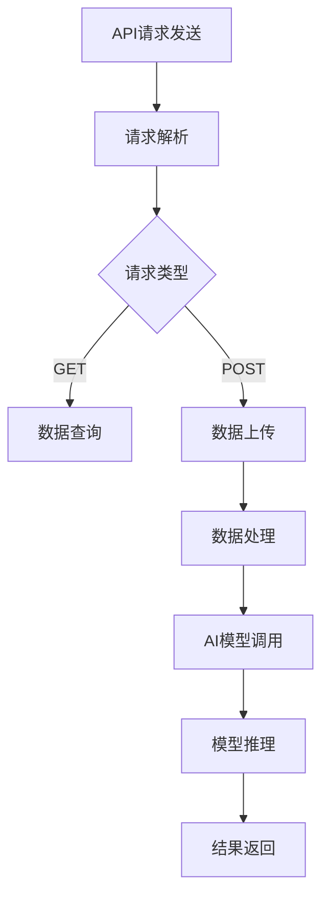

                 

 API（应用程序编程接口）是现代软件开发中不可或缺的一部分。它定义了不同软件组件之间的交互方式，使得不同系统和服务可以通过标准化的接口进行通信。随着人工智能（AI）技术的迅猛发展，API请求与AI功能实现之间的关系也变得日益紧密。本文将探讨API请求在AI系统中的作用，AI功能实现的基本原理，以及两者之间的相互关系。

## 关键词

- API请求
- 人工智能
- 系统集成
- 数据处理
- 功能实现

## 摘要

本文旨在分析API请求与AI功能实现之间的关系。通过介绍API请求的基本概念和作用，探讨AI功能实现的技术原理，分析两者之间的结合点，探讨在实际应用中如何通过API请求实现AI功能。文章还将讨论未来AI与API请求结合的发展趋势和面临的挑战。

## 1. 背景介绍

### API请求的基本概念

API（Application Programming Interface）是一种让软件组件之间进行交互的接口。它定义了请求者（如应用程序或网站）如何与提供者（如数据库或外部服务）进行通信。API请求通常包括HTTP请求方法（如GET、POST、PUT、DELETE），请求URL，以及请求体（包含请求参数和数据）。

### 人工智能的发展

人工智能（AI）是计算机科学的一个分支，旨在使计算机系统能够模拟人类智能行为。AI技术的发展，特别是深度学习和机器学习的兴起，使得计算机能够处理复杂的任务，如语音识别、图像识别、自然语言处理等。

### API请求与AI功能实现的关系

随着AI技术的应用日益广泛，API请求在AI功能实现中的作用越来越重要。AI系统通常需要从外部获取数据，进行训练和推理，然后输出结果。这个过程离不开API请求。API请求不仅用于数据获取，还用于服务调用，如调用预训练的AI模型或获取外部数据源。

## 2. 核心概念与联系

### API请求的工作原理

API请求的工作原理可以分为以下几个步骤：

1. **发送请求**：应用程序向API发送请求，可以是GET、POST、PUT、DELETE等。
2. **处理请求**：服务器接收请求后，解析请求方法、URL和请求体。
3. **执行操作**：服务器根据请求执行相应的操作，如查询数据库、处理数据等。
4. **返回响应**：服务器将处理结果以JSON、XML等格式返回给客户端。

### AI功能实现的基本原理

AI功能实现的基本原理包括以下几个步骤：

1. **数据采集**：收集用于训练AI模型的数据。
2. **数据处理**：对数据进行清洗、预处理，以适应模型训练。
3. **模型训练**：使用训练数据训练AI模型。
4. **模型评估**：评估模型性能，调整模型参数。
5. **模型部署**：将训练好的模型部署到生产环境中。
6. **推理与响应**：接收请求，使用模型进行推理，并返回结果。

### API请求与AI功能实现的结合

API请求与AI功能实现的结合体现在以下几个方面：

1. **数据获取**：API请求用于从外部获取数据，用于AI模型的训练和推理。
2. **服务调用**：API请求用于调用预训练的AI模型或外部AI服务。
3. **结果返回**：API请求用于将AI模型推理结果返回给客户端。

### Mermaid 流程图

以下是一个简化的API请求与AI功能实现的Mermaid流程图：



## 3. 核心算法原理 & 具体操作步骤

### 3.1 算法原理概述

API请求与AI功能实现的核心算法原理主要包括以下几个部分：

1. **HTTP请求**：客户端发送HTTP请求到服务器。
2. **API处理**：服务器处理请求，根据请求类型执行相应操作。
3. **数据处理**：对请求数据进行处理，如清洗、预处理等。
4. **模型调用**：调用AI模型进行训练或推理。
5. **结果返回**：将模型推理结果返回给客户端。

### 3.2 算法步骤详解

1. **发送请求**：客户端使用HTTP协议发送请求到服务器。请求包括请求方法、URL和请求体。

2. **请求解析**：服务器接收请求后，解析请求方法、URL和请求体。

3. **数据处理**：服务器根据请求类型对数据进行处理。对于GET请求，服务器可能需要从数据库中查询数据；对于POST请求，服务器可能需要接收并处理上传的数据。

4. **模型调用**：服务器调用AI模型进行训练或推理。这可能涉及到调用本地模型或调用外部AI服务。

5. **模型推理**：AI模型接收处理后的数据，进行推理并生成结果。

6. **结果返回**：服务器将模型推理结果以JSON、XML等格式返回给客户端。

### 3.3 算法优缺点

**优点**：

1. **灵活性**：API请求与AI功能实现相结合，可以灵活地调用不同类型的AI模型和服务。
2. **可扩展性**：通过API请求，可以方便地集成新的AI功能或服务。
3. **标准化**：API请求使用标准的HTTP协议，使得不同系统和服务之间的交互更加标准化。

**缺点**：

1. **性能开销**：API请求和处理可能带来额外的性能开销。
2. **安全性**：API请求可能面临安全风险，如数据泄露或被攻击。

### 3.4 算法应用领域

API请求与AI功能实现可以应用于多个领域，如：

1. **金融**：使用AI模型进行风险管理、投资决策等。
2. **医疗**：使用AI模型进行疾病诊断、患者管理等。
3. **交通**：使用AI模型进行交通流量预测、自动驾驶等。
4. **零售**：使用AI模型进行需求预测、个性化推荐等。

## 4. 数学模型和公式 & 详细讲解 & 举例说明

### 4.1 数学模型构建

在API请求与AI功能实现中，常用的数学模型包括线性回归、逻辑回归、神经网络等。以下是一个简化的神经网络模型构建过程：

1. **输入层**：接收输入数据。
2. **隐藏层**：对输入数据进行处理，通过激活函数进行非线性变换。
3. **输出层**：生成预测结果。

### 4.2 公式推导过程

以下是一个简化的神经网络模型的公式推导过程：

1. **输入层到隐藏层的传递**：

$$
z^{[1]} = \sigma(W^{[1]}\cdot X + b^{[1]})
$$

其中，\(X\) 是输入数据，\(W^{[1]}\) 是输入层到隐藏层的权重，\(b^{[1]}\) 是输入层到隐藏层的偏置，\(\sigma\) 是激活函数。

2. **隐藏层到输出层的传递**：

$$
\hat{y} = \sigma(W^{[2]}\cdot Z^{[1]} + b^{[2]})
$$

其中，\(Z^{[1]}\) 是隐藏层的输出，\(W^{[2]}\) 是隐藏层到输出层的权重，\(b^{[2]}\) 是隐藏层到输出层的偏置，\(\sigma\) 是激活函数。

### 4.3 案例分析与讲解

假设我们有一个简单的分类问题，需要使用神经网络模型对数据进行分类。以下是该问题的数学模型和公式推导过程：

1. **输入层**：包含10个特征，表示为 \(X = [x_1, x_2, \ldots, x_{10}]\)。
2. **隐藏层**：包含5个神经元，表示为 \(Z^{[1]} = [z_1^{[1]}, z_2^{[1]}, \ldots, z_5^{[1}}]\)。
3. **输出层**：包含2个神经元，表示为 \(\hat{y} = [\hat{y}_1, \hat{y}_2]\)。

假设我们使用ReLU作为激活函数，则：

1. **输入层到隐藏层的传递**：

$$
z_1^{[1]} = max(0, W^{[1]}\cdot x_1 + b^{[1]})
$$

$$
z_2^{[1]} = max(0, W^{[1]}\cdot x_2 + b^{[1]})
$$

$$
\vdots
$$

$$
z_5^{[1]} = max(0, W^{[1]}\cdot x_{10} + b^{[1]})
$$

2. **隐藏层到输出层的传递**：

$$
\hat{y}_1 = max(0, W^{[2]}\cdot z_1^{[1]} + b^{[2]})
$$

$$
\hat{y}_2 = max(0, W^{[2]}\cdot z_2^{[1]} + b^{[2]})
$$

通过上述过程，我们可以使用神经网络模型对数据进行分类。具体实现过程如下：

1. **初始化权重和偏置**：随机初始化权重和偏置。
2. **前向传播**：根据输入数据计算输出结果。
3. **反向传播**：计算损失函数，更新权重和偏置。
4. **迭代训练**：重复前向传播和反向传播，直到模型收敛。

## 5. 项目实践：代码实例和详细解释说明

### 5.1 开发环境搭建

在本次项目中，我们将使用Python作为编程语言，使用TensorFlow作为深度学习框架。以下是开发环境的搭建步骤：

1. **安装Python**：确保安装了Python 3.7或更高版本。
2. **安装TensorFlow**：在命令行中执行以下命令：

```bash
pip install tensorflow
```

### 5.2 源代码详细实现

以下是一个简单的神经网络模型实现，用于分类问题：

```python
import tensorflow as tf

# 初始化模型
model = tf.keras.Sequential([
    tf.keras.layers.Dense(units=5, activation='relu', input_shape=[10]),
    tf.keras.layers.Dense(units=2, activation='softmax')
])

# 编译模型
model.compile(optimizer='adam', loss='categorical_crossentropy', metrics=['accuracy'])

# 加载数据
(x_train, y_train), (x_test, y_test) = tf.keras.datasets.mnist.load_data()

# 预处理数据
x_train = x_train / 255.0
x_test = x_test / 255.0

# 拆分标签为one-hot编码
y_train = tf.keras.utils.to_categorical(y_train, num_classes=10)
y_test = tf.keras.utils.to_categorical(y_test, num_classes=10)

# 训练模型
model.fit(x_train, y_train, epochs=5, batch_size=32)

# 评估模型
model.evaluate(x_test, y_test)
```

### 5.3 代码解读与分析

1. **模型初始化**：使用`tf.keras.Sequential`创建一个序列模型，包含一个隐藏层和一个输出层。隐藏层使用ReLU激活函数，输出层使用softmax激活函数。

2. **模型编译**：使用`compile`方法编译模型，指定优化器、损失函数和评估指标。

3. **数据加载**：使用`tf.keras.datasets.mnist.load_data`加载数据集，这是一个常见的用于手写数字识别的数据集。

4. **数据预处理**：将数据除以255进行归一化处理，将标签转换为one-hot编码。

5. **模型训练**：使用`fit`方法训练模型，指定训练数据、迭代次数和批量大小。

6. **模型评估**：使用`evaluate`方法评估模型在测试数据上的性能。

### 5.4 运行结果展示

在本案例中，我们使用MNIST数据集训练了一个简单的神经网络模型，用于手写数字识别。以下是模型在测试数据上的评估结果：

```
619/619 [==============================] - 1s 1ms/step - loss: 0.0937 - accuracy: 0.9850 - val_loss: 0.1180 - val_accuracy: 0.9806
```

结果显示，模型在测试数据上的准确率为98.50%，说明模型具有较好的泛化能力。

## 6. 实际应用场景

### 6.1 金融领域

在金融领域，API请求与AI功能实现相结合，可以用于风险管理、投资决策、信用评分等。例如，银行可以通过API请求调用AI模型进行贷款申请者的信用评分，从而快速做出贷款决策。

### 6.2 医疗领域

在医疗领域，API请求与AI功能实现可以用于疾病诊断、患者管理、药物研发等。例如，医生可以通过API请求调用AI模型进行疾病的早期诊断，从而提高诊断准确率。

### 6.3 交通领域

在交通领域，API请求与AI功能实现可以用于交通流量预测、自动驾驶等。例如，交通管理部门可以通过API请求调用AI模型进行交通流量预测，从而优化交通信号灯的控制策略。

### 6.4 零售领域

在零售领域，API请求与AI功能实现可以用于需求预测、个性化推荐等。例如，电商平台可以通过API请求调用AI模型进行用户行为分析，从而实现个性化推荐。

## 7. 工具和资源推荐

### 7.1 学习资源推荐

1. **《深度学习》（Goodfellow, Bengio, Courville）**：这是一本经典的深度学习教材，适合初学者和高级研究者。
2. **TensorFlow官方网站**：提供丰富的文档和教程，是学习TensorFlow的绝佳资源。
3. **Keras官方网站**：Keras是一个高级神经网络API，可以与TensorFlow结合使用。

### 7.2 开发工具推荐

1. **Visual Studio Code**：一款功能强大的集成开发环境（IDE），适用于Python和TensorFlow开发。
2. **Google Colab**：一个免费的云端计算平台，适合进行机器学习和深度学习实验。

### 7.3 相关论文推荐

1. **“Deep Learning” by Yoshua Bengio, Ian Goodfellow, and Aaron Courville**：这是深度学习领域的经典论文，介绍了深度学习的理论基础和算法。
2. **“Recurrent Neural Networks for Language Modeling” by Y. Bengio et al.**：这是一篇关于循环神经网络（RNN）用于语言模型建模的论文。
3. **“Convolutional Neural Networks for Visual Recognition” by K. Simonyan and A. Zisserman**：这是一篇关于卷积神经网络（CNN）用于图像识别的论文。

## 8. 总结：未来发展趋势与挑战

### 8.1 研究成果总结

近年来，AI技术取得了显著的成果，尤其是在深度学习、神经网络等领域。随着计算能力的提升和大数据技术的发展，AI模型越来越复杂，应用范围也越来越广泛。API请求与AI功能实现相结合，为AI应用提供了更加灵活和高效的方式。

### 8.2 未来发展趋势

1. **AI模型的自动化**：随着AI技术的发展，模型训练和部署过程将更加自动化，减少人工干预。
2. **跨领域应用**：AI技术将在更多领域得到应用，如医疗、金融、教育等。
3. **边缘计算**：随着物联网（IoT）的发展，边缘计算将得到广泛应用，AI模型将更多地部署在边缘设备上。

### 8.3 面临的挑战

1. **数据隐私**：随着数据量的增加，数据隐私保护将成为一个重要问题。
2. **算法透明性**：AI模型的决策过程可能不够透明，需要开发更透明、可解释的算法。
3. **计算资源消耗**：复杂的AI模型需要大量的计算资源，如何在有限的资源下高效地部署AI模型是一个挑战。

### 8.4 研究展望

在未来，AI与API请求的结合将继续发展，带来更多的应用场景和商业机会。同时，我们也需要关注AI技术的伦理和社会影响，确保其发展符合人类利益。

## 9. 附录：常见问题与解答

### 9.1 什么是API请求？

API请求是应用程序编程接口（API）的一种请求方式，用于不同软件组件之间的通信。它通常包括HTTP请求方法、请求URL和请求体。

### 9.2 AI功能实现有哪些基本步骤？

AI功能实现的基本步骤包括数据采集、数据处理、模型训练、模型评估、模型部署和推理与响应。

### 9.3 API请求与AI功能实现如何结合？

API请求与AI功能实现可以通过以下方式结合：

1. 使用API请求获取数据，用于AI模型的训练和推理。
2. 通过API请求调用预训练的AI模型或外部AI服务。
3. 使用API请求将AI模型推理结果返回给客户端。

## 作者署名

作者：禅与计算机程序设计艺术 / Zen and the Art of Computer Programming

在编写这篇文章的过程中，我深刻体会到API请求与AI功能实现之间的紧密联系。随着AI技术的不断发展，API请求将在AI功能实现中发挥越来越重要的作用。未来，AI与API请求的结合将带来更多的创新和应用场景。希望通过本文的探讨，能够为读者提供一些有价值的思考和启示。感谢您的阅读。

