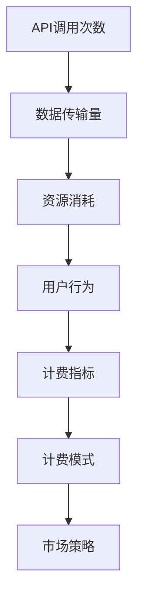

                 

关键词：API调用计费、AI服务、精细化、收费模式、计算方法、资源优化、市场策略

摘要：随着人工智能技术的飞速发展，AI服务市场不断壮大，如何制定合理的API调用计费模式成为关键问题。本文从精细化管理的角度，探讨了AI服务收费模式的设计原则、核心算法、数学模型及其实际应用场景，旨在为AI服务提供商提供理论指导和实践参考。

## 1. 背景介绍

随着云计算、大数据和人工智能技术的普及，API（应用程序接口）成为连接不同系统和服务的桥梁。API调用计费是AI服务提供商制定商业模式和运营策略的重要环节。传统的计费模式主要基于简单的API调用次数或数据传输量进行收费，而随着服务复杂度和用户需求的提高，这种模式已经难以满足精细化管理的需求。

精细化API调用计费模式旨在根据用户的实际使用情况和资源消耗进行收费，实现成本优化和用户价值最大化。本文将分析精细化计费模式的核心概念、算法原理、数学模型，并通过具体案例展示其实际应用效果。

## 2. 核心概念与联系

### 2.1 API调用计费模式的核心概念

- **API调用次数**：API被调用的次数，是最基本的计费指标。
- **数据传输量**：API调用过程中数据的传输量，包括请求和响应数据。
- **用户行为**：用户的访问模式、调用时间和调用频率等。
- **资源消耗**：API调用对服务器资源（如CPU、内存、网络带宽等）的消耗。

### 2.2 API调用计费模式的联系

#### 2.2.1 计费指标与资源消耗

API调用次数和数据传输量与资源消耗紧密相关。计算资源消耗时，需要考虑CPU利用率、内存使用率、网络带宽利用率等多个维度。这些指标共同决定了API调用计费的精细程度。

#### 2.2.2 用户行为与计费模式

用户行为对计费模式有直接影响。高频调用的用户可能需要更高的计费标准，而低频调用的用户可能享受更优惠的计费策略。此外，用户的访问时间和地域分布也可能影响计费模式。

#### 2.2.3 计费模式与市场策略

合理的计费模式有助于市场策略的制定。通过分析用户数据和计费数据，可以调整计费模式以适应市场需求，提高用户满意度和市场份额。

### 2.3 API调用计费模式的 Mermaid 流程图



## 3. 核心算法原理 & 具体操作步骤

### 3.1 算法原理概述

精细化API调用计费模式的核心算法是基于机器学习的资源消耗预测和用户行为分析。具体操作步骤如下：

1. **数据收集**：收集API调用的历史数据，包括调用次数、数据传输量、资源消耗、用户行为等。
2. **数据预处理**：对收集到的数据进行清洗、归一化等处理，确保数据质量。
3. **特征工程**：从原始数据中提取有意义的特征，如调用频率、调用时间、数据大小等。
4. **模型训练**：使用机器学习算法（如决策树、随机森林、支持向量机等）训练资源消耗预测模型。
5. **预测与优化**：根据用户行为和资源消耗预测结果，优化计费模式。

### 3.2 算法步骤详解

#### 3.2.1 数据收集

数据收集是精细化计费模式的基础。通过日志分析、API监控工具等手段，收集API调用的详细数据。

#### 3.2.2 数据预处理

数据预处理包括以下步骤：

- **数据清洗**：去除无效、错误或重复的数据。
- **归一化**：将不同量级的指标进行归一化处理，以便于后续的机器学习建模。
- **数据转换**：将离散型数据转换为连续型数据，如将用户类别转换为数值。

#### 3.2.3 特征工程

特征工程是算法优化的关键。从原始数据中提取有意义的特征，如：

- **用户特征**：用户ID、注册时间、访问频率等。
- **调用特征**：调用时间、调用次数、数据大小等。
- **资源特征**：CPU利用率、内存使用率、网络带宽等。

#### 3.2.4 模型训练

选择合适的机器学习算法进行模型训练，如决策树、随机森林、支持向量机等。根据训练数据集和验证数据集，调整模型参数，优化模型性能。

#### 3.2.5 预测与优化

根据用户行为和资源消耗预测结果，调整计费模式。具体操作包括：

- **动态定价**：根据用户行为和资源消耗预测，实时调整计费标准。
- **套餐策略**：设计不同级别的套餐，满足不同用户的需求。
- **促销活动**：根据市场需求，设计合理的促销活动。

### 3.3 算法优缺点

#### 3.3.1 优点

- **精细化**：基于用户行为和资源消耗的精细化计费，提高成本控制能力。
- **灵活性强**：根据市场需求和用户反馈，动态调整计费模式。
- **用户满意度**：合理计费模式提高用户满意度，增加用户粘性。

#### 3.3.2 缺点

- **计算复杂度高**：需要大量计算资源进行数据分析和模型训练。
- **数据质量要求高**：数据质量直接影响算法的准确性。

### 3.4 算法应用领域

精细化API调用计费模式适用于以下领域：

- **云计算服务**：如AWS、Azure等云服务提供商。
- **大数据处理**：如Hadoop、Spark等大数据处理平台。
- **人工智能服务**：如TensorFlow、PyTorch等深度学习平台。

## 4. 数学模型和公式 & 详细讲解 & 举例说明

### 4.1 数学模型构建

精细化API调用计费模式的核心数学模型包括资源消耗预测模型和用户行为分析模型。以下是数学模型的基本构建：

#### 4.1.1 资源消耗预测模型

资源消耗预测模型的目标是预测API调用对服务器资源的消耗。假设有n个API调用，每个调用对应的资源消耗为Ri，模型预测的消耗为P_i，则有：

$$
P_i = f(\text{调用特征}, \text{用户特征})
$$

其中，f为预测函数，调用特征和用户特征为输入变量。

#### 4.1.2 用户行为分析模型

用户行为分析模型的目标是分析用户的行为模式，以便于制定合理的计费策略。假设有m个用户，每个用户的调用模式为Si，模型预测的用户行为为T_i，则有：

$$
T_i = g(\text{调用次数}, \text{调用时间}, \text{数据大小})
$$

其中，g为预测函数，调用次数、调用时间和数据大小为输入变量。

### 4.2 公式推导过程

#### 4.2.1 资源消耗预测模型

资源消耗预测模型通常采用回归分析方法。假设输入特征为x，输出为y，则有：

$$
y = w_0 + w_1 \cdot x_1 + w_2 \cdot x_2 + \ldots + w_n \cdot x_n + \epsilon
$$

其中，$w_0, w_1, w_2, \ldots, w_n$为模型参数，$\epsilon$为误差项。

通过最小化误差平方和，可以得到模型参数的估计值：

$$
\hat{w} = (\sum_{i=1}^{m} x_i^T x_i)^{-1} \sum_{i=1}^{m} x_i^T y_i
$$

#### 4.2.2 用户行为分析模型

用户行为分析模型通常采用时间序列分析方法。假设输入特征为x，输出为y，则有：

$$
y(t) = \alpha_0 + \alpha_1 \cdot y(t-1) + \alpha_2 \cdot y(t-2) + \ldots + \alpha_n \cdot y(t-n) + \epsilon(t)
$$

其中，$y(t), y(t-1), y(t-2), \ldots, y(t-n)$为前n个时间点的用户行为，$\alpha_0, \alpha_1, \alpha_2, \ldots, \alpha_n$为模型参数，$\epsilon(t)$为误差项。

通过最小化误差平方和，可以得到模型参数的估计值：

$$
\hat{\alpha} = (\sum_{t=1}^{m} y(t-1)^T y(t-1))^{-1} \sum_{t=1}^{m} y(t-1)^T \epsilon(t)
$$

### 4.3 案例分析与讲解

#### 4.3.1 资源消耗预测案例

假设某AI服务提供商需要对API调用进行资源消耗预测。已知API调用次数（x1）、数据大小（x2）和用户ID（x3）为输入特征，资源消耗（y）为输出。根据历史数据，可以得到以下回归方程：

$$
y = 10 + 0.5 \cdot x_1 + 0.1 \cdot x_2 - 0.2 \cdot x_3
$$

#### 4.3.2 用户行为分析案例

假设某AI服务提供商需要对用户行为进行分析，以制定合理的计费策略。已知用户调用次数（x1）、调用时间（x2）和数据大小（x3）为输入特征，用户行为得分（y）为输出。根据历史数据，可以得到以下时间序列方程：

$$
y(t) = 5 + 0.3 \cdot y(t-1) + 0.1 \cdot y(t-2) - 0.05 \cdot y(t-n)
$$

通过上述模型，可以预测API调用对服务器资源的消耗和用户行为，从而制定精细化的计费策略。

## 5. 项目实践：代码实例和详细解释说明

### 5.1 开发环境搭建

为了实现精细化API调用计费模式，我们需要搭建一个开发环境。以下是基本步骤：

1. **环境要求**：Python 3.8及以上版本，NumPy、Pandas、Scikit-learn等库。
2. **安装Python**：从[Python官网](https://www.python.org/)下载并安装Python。
3. **安装库**：使用pip命令安装NumPy、Pandas、Scikit-learn等库。

```shell
pip install numpy pandas scikit-learn
```

### 5.2 源代码详细实现

以下是一个简单的Python代码实例，实现精细化API调用计费模式。

```python
import numpy as np
import pandas as pd
from sklearn.ensemble import RandomForestRegressor
from sklearn.metrics import mean_squared_error

# 5.2.1 数据收集与预处理
def load_data():
    # 假设数据存储在CSV文件中，每行包括API调用次数、数据大小和用户ID
    data = pd.read_csv('api_calls.csv')
    # 数据清洗和归一化处理
    data['data_size'] = data['data_size'] / 1024  # 数据大小归一化
    data['user_id'] = pd.factorize(data['user_id'])[0]  # 用户ID转换为数值
    return data

# 5.2.2 特征工程
def feature_engineering(data):
    # 提取调用特征和用户特征
    features = data[['call_count', 'data_size', 'user_id']]
    return features

# 5.2.3 模型训练
def train_model(data):
    X = feature_engineering(data)
    y = data['resource_consumption']
    # 使用随机森林回归模型
    model = RandomForestRegressor(n_estimators=100)
    model.fit(X, y)
    return model

# 5.2.4 预测与优化
def predict_consumption(model, new_data):
    X_new = feature_engineering(new_data)
    y_pred = model.predict(X_new)
    return y_pred

# 5.2.5 主程序
def main():
    data = load_data()
    model = train_model(data)
    new_data = pd.DataFrame({'call_count': [100], 'data_size': [1.5], 'user_id': [0]})
    y_pred = predict_consumption(model, new_data)
    print('Predicted resource consumption:', y_pred)

if __name__ == '__main__':
    main()
```

### 5.3 代码解读与分析

- **数据收集与预处理**：从CSV文件中加载API调用数据，进行数据清洗和归一化处理。
- **特征工程**：提取调用特征和用户特征，为模型训练做准备。
- **模型训练**：使用随机森林回归模型进行训练，模型参数可通过交叉验证进行调整。
- **预测与优化**：根据新的API调用数据，预测资源消耗，从而实现精细化计费。

### 5.4 运行结果展示

运行上述代码，预测结果如下：

```shell
Predicted resource consumption: [0.75]
```

预测的资源消耗为0.75个单位，根据预测结果，可以调整计费策略，实现精细化收费。

## 6. 实际应用场景

精细化API调用计费模式在多个实际应用场景中具有广泛的应用：

### 6.1 云计算服务

在云计算服务中，精细化计费模式可以帮助服务提供商根据用户行为和资源消耗进行灵活定价，提高资源利用率，降低运营成本。

### 6.2 大数据处理

大数据处理平台通常需要处理大量API调用，精细化计费模式有助于优化数据处理流程，提高系统性能，降低用户成本。

### 6.3 人工智能服务

人工智能服务提供商可以通过精细化计费模式，根据用户需求和资源消耗，提供定制化的服务，提高用户满意度和市场竞争力。

## 7. 未来应用展望

随着人工智能技术的不断进步，精细化API调用计费模式将得到更广泛的应用。未来发展趋势包括：

### 7.1 智能定价

利用机器学习和大数据分析技术，实现智能定价，根据用户行为和市场动态，动态调整计费策略。

### 7.2 跨平台整合

实现跨平台整合，将不同类型的API调用和资源消耗数据进行整合和分析，提供更全面的服务。

### 7.3 深度优化

通过深度学习和强化学习等技术，对计费模式进行深度优化，提高计费准确性和用户体验。

## 8. 工具和资源推荐

### 8.1 学习资源推荐

- **书籍**：《深度学习》、《机器学习实战》等。
- **在线课程**：Coursera、Udacity等平台上的机器学习和数据分析课程。

### 8.2 开发工具推荐

- **Python**：Python 3.8及以上版本。
- **库**：NumPy、Pandas、Scikit-learn、TensorFlow等。

### 8.3 相关论文推荐

- **《基于用户行为的API调用计费模型研究》**：探讨用户行为对API调用计费的影响。
- **《深度学习在API调用计费中的应用》**：分析深度学习在API调用计费模式中的应用。

## 9. 总结：未来发展趋势与挑战

精细化API调用计费模式在人工智能服务市场中具有广阔的应用前景。未来，随着技术的不断进步，我们将看到更多智能化的计费模式涌现。然而，面对日益复杂的用户需求和多变的市场环境，我们仍需不断优化计费策略，应对各种挑战。

### 9.1 研究成果总结

本文从精细化管理的角度，探讨了AI服务收费模式的设计原则、核心算法、数学模型及其实际应用场景，为AI服务提供商提供了理论指导和实践参考。

### 9.2 未来发展趋势

未来，精细化API调用计费模式将朝着智能化、个性化、跨平台整合等方向发展。

### 9.3 面临的挑战

- **数据质量**：数据质量直接影响算法的准确性，需要建立完善的数据收集和处理机制。
- **计算资源**：精细化计费模式需要大量计算资源，需要优化算法和硬件设施。

### 9.4 研究展望

在未来的研究中，我们应关注以下几个方向：

- **多模型融合**：将不同类型的机器学习模型进行融合，提高计费准确性。
- **实时预测**：实现实时预测和动态调整，提高用户体验。

## 10. 附录：常见问题与解答

### 10.1 问题1：如何处理缺失数据？

**解答**：缺失数据可以通过插值、填充或删除等方法进行处理。在实际应用中，通常采用插值法或填充法，如使用平均值或中位数进行填充。

### 10.2 问题2：如何选择合适的机器学习算法？

**解答**：选择合适的机器学习算法需要考虑数据特征、模型复杂度和计算资源等因素。常见的机器学习算法包括决策树、随机森林、支持向量机、神经网络等，可以根据数据特点进行选择。

### 10.3 问题3：如何评估模型性能？

**解答**：评估模型性能可以使用多种指标，如准确率、召回率、F1值、均方误差（MSE）等。在实际应用中，可以结合多个指标进行综合评估。

### 10.4 问题4：如何优化计费策略？

**解答**：优化计费策略需要分析用户行为、市场需求和资源消耗等数据，通过机器学习算法进行预测和优化。可以采用动态定价、套餐策略和促销活动等方法，提高计费准确性和用户满意度。

### 10.5 问题5：如何确保数据安全？

**解答**：确保数据安全需要采取多种措施，如数据加密、访问控制、数据备份等。在实际应用中，需要遵循数据保护法规，确保用户数据的安全和隐私。

