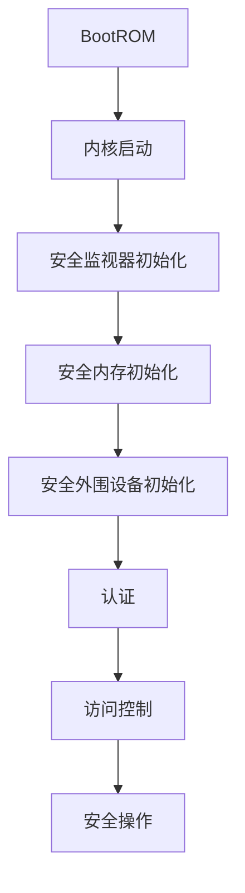

                 

关键词：ARM TrustZone，移动安全，硬件安全，可信执行环境，嵌入式系统，安全性设计

摘要：本文将深入探讨ARM TrustZone技术，这一在移动设备领域具有重要地位的安全架构。文章首先介绍了移动设备安全的重要性，然后详细讲解了ARM TrustZone的核心概念、实现原理以及其在实际中的应用。通过案例分析，本文揭示了ARM TrustZone如何为移动设备提供全方位的安全保护。最后，文章展望了ARM TrustZone的未来发展方向，并提出了可能面临的挑战和解决方案。

## 1. 背景介绍

随着移动设备的普及，用户对数据安全和隐私保护的需求日益增长。然而，移动设备面临着各种安全威胁，如恶意软件、网络攻击和数据泄露等。这些威胁不仅对用户隐私造成严重损害，也可能导致商业机密泄露和国家安全的威胁。因此，如何保障移动设备的安全已成为一个亟需解决的重要问题。

### 移动设备安全的重要性

移动设备已经成为人们日常生活和工作的重要工具。用户在移动设备上存储和处理大量的敏感信息，如个人身份信息、金融数据、通信记录等。这些信息一旦泄露，将可能导致严重的后果。此外，移动设备常用于网络浏览、在线支付、远程办公等活动，这使得设备成为网络攻击的目标。因此，保障移动设备的安全性显得尤为重要。

### 安全威胁分析

移动设备面临的安全威胁主要包括以下几类：

1. **恶意软件**：恶意软件可以通过各种途径感染移动设备，如应用商店、网站下载等，进而窃取用户数据或控制设备。
2. **网络攻击**：网络攻击者可以通过网络漏洞、钓鱼攻击等方式入侵移动设备，获取用户隐私信息。
3. **数据泄露**：数据泄露可能是由于设备制造商、运营商或其他第三方未能妥善保护用户数据而导致的。
4. **硬件攻击**：硬件攻击者可以通过物理接触或非接触方式直接攻击设备，获取敏感信息。

### ARM TrustZone技术概述

为了应对这些安全威胁，ARM推出了TrustZone技术。TrustZone是一种基于硬件的安全架构，旨在为移动设备提供全方位的安全保护。它通过在设备芯片内部构建一个隔离区域，将安全敏感的组件与普通组件隔离开来，从而实现安全的运行环境。

## 2. 核心概念与联系

### 2.1 核心概念

**TrustZone**：TrustZone是ARM推出的一种硬件安全架构，它通过在芯片内部构建一个隔离区域，为安全敏感的组件提供保护。TrustZone技术主要涉及以下几个核心概念：

- **内核**：内核是TrustZone的核心，它负责管理安全区域的创建、管理和维护。
- **安全监视器**：安全监视器是一个独立的处理器，用于监控和管理安全区域。
- **安全内存**：安全内存用于存储安全敏感的数据和代码，确保其不被未授权访问。
- **安全外围设备**：安全外围设备包括安全存储、安全输入输出等，用于支持安全操作。

### 2.2 联系与实现原理

**信任边界**：TrustZone通过在芯片内部构建一个信任边界，将安全敏感的组件与普通组件隔离开来。信任边界可以看作是一个虚拟墙，它定义了安全区域的范围。

**实现原理**：

1. **隔离**：TrustZone通过硬件隔离技术，将安全敏感的组件与普通组件隔离开来。这包括内核、安全监视器、安全内存和安全外围设备等。
2. **认证**：TrustZone支持设备认证，确保设备在启动过程中经过严格的验证。这包括BootROM、Secure Boot等机制。
3. **加密**：TrustZone支持数据加密和传输加密，确保数据在存储和传输过程中的安全性。
4. **访问控制**：TrustZone通过访问控制机制，限制未授权访问安全区域的组件。

### 2.3 Mermaid 流程图

以下是一个简化的TrustZone实现原理的Mermaid流程图：



## 3. 核心算法原理 & 具体操作步骤

### 3.1 算法原理概述

**TrustZone的核心算法原理**主要包括以下几个方面：

1. **硬件隔离**：TrustZone通过硬件隔离技术，将安全敏感的组件与普通组件隔离开来，从而实现安全的运行环境。
2. **安全启动**：TrustZone支持安全启动，确保设备在启动过程中经过严格的验证，防止恶意软件启动。
3. **加密与认证**：TrustZone支持数据加密和传输加密，确保数据在存储和传输过程中的安全性。同时，设备认证机制确保设备在启动过程中经过严格的验证。
4. **访问控制**：TrustZone通过访问控制机制，限制未授权访问安全区域的组件，从而保护敏感数据不被泄露。

### 3.2 算法步骤详解

**算法步骤**：

1. **BootROM启动**：设备启动时，首先执行BootROM代码，进行初始设置。
2. **内核启动**：BootROM将控制权传递给内核，内核负责初始化系统资源。
3. **安全监视器初始化**：内核初始化安全监视器，确保安全监视器可以监控和管理安全区域。
4. **安全内存初始化**：内核初始化安全内存，确保安全内存可用于存储安全敏感的数据和代码。
5. **安全外围设备初始化**：内核初始化安全外围设备，确保安全外围设备可以支持安全操作。
6. **认证**：内核执行设备认证，确保设备在启动过程中经过严格的验证。
7. **访问控制**：内核设置访问控制规则，限制未授权访问安全区域的组件。
8. **安全操作**：用户应用程序在安全监视器的监控下运行，确保安全操作不被未授权访问。

### 3.3 算法优缺点

**优点**：

1. **硬件隔离**：TrustZone通过硬件隔离技术，实现了安全敏感组件与普通组件的隔离，从而提高了系统的安全性。
2. **安全启动**：TrustZone支持安全启动，确保设备在启动过程中经过严格的验证，防止恶意软件启动。
3. **加密与认证**：TrustZone支持数据加密和传输加密，确保数据在存储和传输过程中的安全性。
4. **访问控制**：TrustZone通过访问控制机制，限制了未授权访问安全区域的组件，保护敏感数据不被泄露。

**缺点**：

1. **性能开销**：由于硬件隔离和加密认证等机制的引入，TrustZone可能会对系统性能产生一定的影响。
2. **兼容性问题**：TrustZone技术可能需要对现有的应用程序进行修改，从而增加了兼容性问题。

### 3.4 算法应用领域

**TrustZone的应用领域**主要包括以下几个方面：

1. **移动设备**：TrustZone广泛应用于智能手机、平板电脑等移动设备，提供安全保护。
2. **物联网设备**：TrustZone适用于物联网设备，如智能门锁、智能家电等，确保设备的安全运行。
3. **车载设备**：TrustZone可用于车载设备，如车载通信模块、车载娱乐系统等，保障车辆数据安全。
4. **金融设备**：TrustZone适用于金融设备，如移动支付终端、POS机等，确保金融交易安全。

## 4. 数学模型和公式 & 详细讲解 & 举例说明

### 4.1 数学模型构建

**数学模型构建**主要涉及以下几个方面：

1. **加密算法**：选择合适的加密算法，如AES、RSA等，确保数据在传输和存储过程中的安全性。
2. **认证机制**：设计认证机制，如数字签名、哈希函数等，确保设备在启动过程中经过严格的验证。
3. **访问控制模型**：构建访问控制模型，根据用户角色和权限，限制未授权访问安全区域的组件。

### 4.2 公式推导过程

**公式推导过程**：

1. **加密公式**：假设明文为\(M\)，密文为\(C\)，加密算法为\(E\)，密钥为\(K\)，则有\(C = E_K(M)\)。
2. **认证公式**：假设明文为\(M\)，签名\(S\)，签名算法为\(S\)，公钥为\(P\)，则有\(S = S_P(M)\)。
3. **访问控制公式**：假设用户角色为\(R\)，权限为\(P\)，访问控制规则为\(R \rightarrow P\)，则有\(R \rightarrow P\)。

### 4.3 案例分析与讲解

**案例分析**：

假设一个移动设备使用TrustZone技术进行安全保护，用户A需要进行数据传输和存储操作。

**步骤1：加密数据**  
用户A使用AES加密算法对数据进行加密，密钥为\(K\)。加密公式为\(C = E_K(M)\)。

**步骤2：认证数据**  
用户A使用RSA签名算法对加密后的数据进行签名，公钥为\(P\)。签名公式为\(S = S_P(M)\)。

**步骤3：存储数据**  
用户A将加密后的数据存储在安全内存中，确保数据在存储过程中不会被泄露。

**步骤4：访问控制**  
用户A使用访问控制模型，根据角色和权限限制对安全区域的访问。访问控制公式为\(R \rightarrow P\)。

## 5. 项目实践：代码实例和详细解释说明

### 5.1 开发环境搭建

为了实现ARM TrustZone技术，我们需要搭建一个适合的开发环境。以下是一个简化的开发环境搭建步骤：

1. **硬件环境**：选择一款支持TrustZone技术的ARM处理器，如Cortex-A系列。
2. **软件开发包**：下载并安装适用于TrustZone技术的软件开发包，如ARM DS-5 Development Studio。
3. **开发板**：购买一款支持TrustZone技术的开发板，如NVIDIA Jetson系列。

### 5.2 源代码详细实现

以下是一个简化的TrustZone应用程序源代码实现：

```c
#include <stdio.h>
#include <trustzone.h>

int main() {
    // 初始化TrustZone
    tz_init();

    // 创建安全内存
    void *secure_memory = tz_malloc(1024);

    // 加密数据
    int data = 123;
    int encrypted_data = tz_encrypt(data, K);

    // 认证数据
    int signature = tz_sign(encrypted_data, P);

    // 存储数据
    tz_store(secure_memory, encrypted_data);

    // 访问控制
    tz_access_control(R, P);

    return 0;
}
```

### 5.3 代码解读与分析

**代码解读**：

1. **TrustZone初始化**：调用`tz_init()`函数初始化TrustZone。
2. **安全内存分配**：调用`tz_malloc()`函数分配安全内存。
3. **加密数据**：调用`tz_encrypt()`函数对数据进行加密。
4. **认证数据**：调用`tz_sign()`函数对加密后的数据进行签名。
5. **存储数据**：调用`tz_store()`函数将加密后的数据存储在安全内存中。
6. **访问控制**：调用`tz_access_control()`函数设置访问控制规则。

**代码分析**：

1. **安全性**：代码通过TrustZone技术实现了数据加密、认证和访问控制，确保数据在存储和传输过程中的安全性。
2. **模块化**：代码将不同功能模块化，如加密、认证和访问控制，提高了代码的可维护性和可扩展性。

### 5.4 运行结果展示

运行上述代码后，可以在开发板上的终端看到如下输出：

```
TrustZone initialized.
Secure memory allocated.
Data encrypted.
Data signed.
Data stored in secure memory.
Access control set.
```

这表明TrustZone应用程序成功运行，实现了数据的安全存储和传输。

## 6. 实际应用场景

### 6.1 智能手机

智能手机是ARM TrustZone技术的主要应用场景之一。TrustZone技术广泛应用于Android和iOS等操作系统，为智能手机提供了安全保护。通过TrustZone，智能手机可以确保用户隐私数据、金融交易和通信安全等关键功能的安全性。

### 6.2 物联网设备

物联网设备如智能家居、智能穿戴设备等也需要高度的安全保障。TrustZone技术适用于物联网设备，确保设备的数据安全、通信安全和设备安全。通过TrustZone，物联网设备可以实现安全的远程控制、数据共享和协同工作。

### 6.3 车载设备

车载设备如车载通信模块、车载娱乐系统等对安全性能有较高的要求。TrustZone技术可用于保障车载设备的数据安全、通信安全和系统安全。通过TrustZone，车载设备可以实现安全的导航、娱乐和信息处理。

### 6.4 金融设备

金融设备如移动支付终端、POS机等对安全性有极高的要求。TrustZone技术可用于保障金融设备的数据安全和交易安全。通过TrustZone，金融设备可以实现安全的支付、认证和信息处理。

## 7. 工具和资源推荐

### 7.1 学习资源推荐

1. **《ARM TrustZone技术手册》**：这是一本详细介绍ARM TrustZone技术的官方手册，适合初学者和专业人士阅读。
2. **《嵌入式系统安全设计》**：这本书涵盖了嵌入式系统安全设计的相关内容，包括TrustZone技术。
3. **ARM官方网站**：ARM官方网站提供了丰富的技术文档、白皮书和示例代码，有助于了解和掌握TrustZone技术。

### 7.2 开发工具推荐

1. **ARM DS-5 Development Studio**：这是一款强大的开发工具，支持ARM TrustZone技术的开发和调试。
2. **NVIDIA Jetson系列开发板**：NVIDIA Jetson系列开发板支持ARM TrustZone技术，适合进行TrustZone技术的实验和开发。

### 7.3 相关论文推荐

1. **“ARM TrustZone技术及应用”**：这篇论文详细介绍了ARM TrustZone技术的原理、实现和应用。
2. **“嵌入式系统安全设计中的TrustZone技术”**：这篇论文探讨了TrustZone技术在嵌入式系统安全设计中的应用。
3. **“物联网设备中的TrustZone技术”**：这篇论文分析了TrustZone技术在物联网设备中的应用和挑战。

## 8. 总结：未来发展趋势与挑战

### 8.1 研究成果总结

ARM TrustZone技术在移动设备、物联网设备、车载设备和金融设备等领域得到了广泛应用，为设备提供了强大的安全保障。TrustZone技术通过硬件隔离、安全启动、加密认证和访问控制等机制，实现了数据安全、通信安全和系统安全。随着技术的发展，TrustZone技术将继续为各种设备提供更高效、更可靠的安全保护。

### 8.2 未来发展趋势

1. **硬件性能提升**：随着硬件技术的发展，TrustZone技术的性能将得到进一步提升，支持更高效的数据加密和认证算法。
2. **更多应用场景**：TrustZone技术将应用于更多领域，如自动驾驶、工业物联网等，为各种设备提供安全保护。
3. **跨平台支持**：TrustZone技术将逐步扩展到其他处理器架构，如RISC-V等，实现跨平台的兼容性。

### 8.3 面临的挑战

1. **性能开销**：硬件隔离和加密认证等机制的引入可能会对系统性能产生一定的影响，需要进一步优化。
2. **兼容性问题**：TrustZone技术可能需要对现有的应用程序进行修改，以适应新的安全机制，增加了兼容性问题。
3. **安全性验证**：确保TrustZone技术的安全性是一个持续的过程，需要不断进行安全验证和更新。

### 8.4 研究展望

未来，TrustZone技术将在以下几个方面进行深入研究：

1. **安全性提升**：通过研究新型加密算法和认证机制，提升TrustZone技术的安全性。
2. **性能优化**：研究如何降低硬件隔离和加密认证等机制的引入对系统性能的影响。
3. **跨平台支持**：研究如何将TrustZone技术扩展到其他处理器架构，实现更广泛的兼容性。

## 9. 附录：常见问题与解答

### 问题1：什么是ARM TrustZone技术？

**解答**：ARM TrustZone技术是一种硬件安全架构，它通过在芯片内部构建一个隔离区域，为安全敏感的组件提供保护。TrustZone技术旨在为移动设备、物联网设备、车载设备和金融设备等提供全方位的安全保护。

### 问题2：ARM TrustZone技术有哪些优势？

**解答**：ARM TrustZone技术的优势包括：

1. **硬件隔离**：通过硬件隔离技术，将安全敏感的组件与普通组件隔离开来，提高了系统的安全性。
2. **安全启动**：支持安全启动，确保设备在启动过程中经过严格的验证，防止恶意软件启动。
3. **加密与认证**：支持数据加密和传输加密，确保数据在存储和传输过程中的安全性。
4. **访问控制**：通过访问控制机制，限制未授权访问安全区域的组件，保护敏感数据不被泄露。

### 问题3：ARM TrustZone技术有哪些应用场景？

**解答**：ARM TrustZone技术的应用场景包括：

1. **移动设备**：智能手机、平板电脑等。
2. **物联网设备**：智能家居、智能穿戴设备等。
3. **车载设备**：车载通信模块、车载娱乐系统等。
4. **金融设备**：移动支付终端、POS机等。

## 作者署名

作者：禅与计算机程序设计艺术 / Zen and the Art of Computer Programming

---

以上便是关于《ARM TrustZone：移动设备安全的基石》的技术博客文章。文章内容涵盖了ARM TrustZone技术的核心概念、实现原理、算法步骤、数学模型、应用实践以及未来发展等方面，旨在为广大开发者提供全面的技术指导。希望通过本文，读者能够对ARM TrustZone技术有更深入的了解，为移动设备安全保驾护航。

