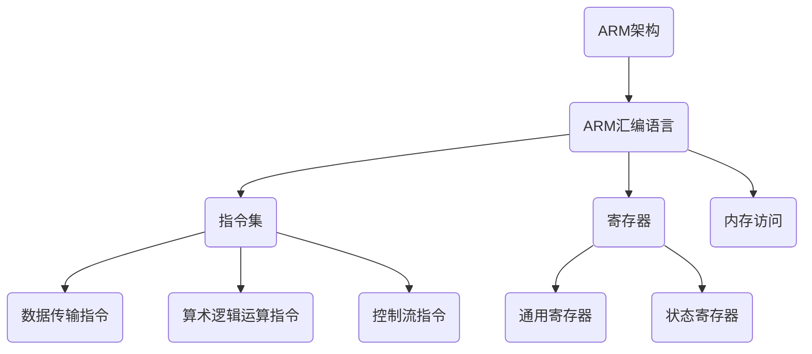

                 

关键词：ARM汇编、编程语言、嵌入式系统、指令集、性能优化

> 摘要：本文旨在深入探讨ARM汇编语言的设计原理、编程技巧和应用场景，通过详细的分析和实例讲解，帮助读者掌握ARM汇编编程的核心技能，为嵌入式系统开发提供有力支持。

## 1. 背景介绍

ARM（Advanced RISC Machines）架构是一种精简指令集计算（RISC）架构，广泛应用于嵌入式系统、移动设备、服务器等领域。ARM汇编语言作为ARM架构的底层编程语言，具有高性能、低功耗的特点，是嵌入式系统开发中不可或缺的工具。本文将围绕ARM汇编语言展开讨论，旨在深入剖析其设计原理、编程技巧和应用场景。

### ARM架构的发展历程

ARM架构起源于1978年，由英国计算机科学家艾伦·马斯克尔（Allen Massey）和半导体制造商ARM公司共同创建。自成立以来，ARM架构经历了多个版本的迭代和改进，如ARMv1、ARMv2、ARMv3等，逐步成为嵌入式系统领域的标准架构。如今，ARM架构已成为全球最受欢迎的处理器架构之一，广泛应用于各种嵌入式设备。

### ARM汇编语言的重要性

ARM汇编语言是ARM架构的底层编程语言，具有以下重要性：

1. **直接操作硬件**：汇编语言可以直接访问和处理硬件资源，实现对系统的精确控制。
2. **性能优化**：通过汇编语言编写程序，可以充分利用处理器特性，实现高效的性能优化。
3. **嵌入式系统开发**：嵌入式系统通常对资源有限，汇编语言有助于实现资源优化和系统稳定。

## 2. 核心概念与联系

### ARM汇编语言的核心概念

1. **指令集**：ARM汇编语言的指令集包括数据传输指令、算术逻辑运算指令、控制流指令等。
2. **寄存器**：ARM处理器包括通用寄存器、状态寄存器等，用于存储数据和控制程序执行。
3. **内存访问**：ARM汇编语言通过加载和存储指令实现对内存的访问。

### ARM汇编语言与C语言的联系

ARM汇编语言与C语言有密切的联系：

1. **混编**：在嵌入式系统开发中，常常将汇编语言与C语言混合编程，实现硬件控制的精确性和程序的高效性。
2. **函数调用**：ARM汇编语言支持C语言函数的调用，使得汇编语言和C语言之间可以无缝集成。

### Mermaid 流程图（核心概念原理和架构）



## 3. 核心算法原理 & 具体操作步骤

### 3.1 算法原理概述

ARM汇编语言的核心算法原理主要包括：

1. **指令执行流程**：ARM处理器通过流水线技术实现指令的高效执行，包括取指、译码、执行和写回四个阶段。
2. **寄存器操作**：ARM汇编语言通过操作寄存器实现数据的存储和传输。
3. **内存管理**：ARM汇编语言通过加载和存储指令实现对内存的访问。

### 3.2 算法步骤详解

1. **取指阶段**：ARM处理器从内存中读取指令，存储到指令队列中。
2. **译码阶段**：ARM处理器对指令进行译码，确定指令的操作类型和操作数。
3. **执行阶段**：ARM处理器根据指令操作类型和操作数，执行相应的操作。
4. **写回阶段**：ARM处理器将执行结果写回寄存器或内存。

### 3.3 算法优缺点

**优点**：

1. **高性能**：ARM汇编语言充分利用处理器特性，实现高效的程序执行。
2. **低功耗**：ARM汇编语言编写的程序具有低功耗的特点，适用于嵌入式系统。

**缺点**：

1. **开发难度大**：ARM汇编语言相对于高级语言来说，开发难度较大，需要深入理解处理器架构。
2. **维护成本高**：ARM汇编语言编写的程序维护成本较高，需要不断适应处理器架构的更新。

### 3.4 算法应用领域

ARM汇编语言广泛应用于以下领域：

1. **嵌入式系统**：如智能家居、工业自动化、医疗设备等。
2. **移动设备**：如智能手机、平板电脑等。
3. **服务器**：如云计算、大数据处理等。

## 4. 数学模型和公式 & 详细讲解 & 举例说明

### 4.1 数学模型构建

ARM汇编语言中的数学模型主要包括以下方面：

1. **指令调度**：通过优化指令执行顺序，提高程序执行效率。
2. **寄存器分配**：合理分配寄存器，减少内存访问次数，提高程序执行速度。
3. **内存管理**：通过优化内存访问策略，减少内存访问时间。

### 4.2 公式推导过程

以指令调度为例，假设有两个连续的指令I1和I2，其执行时间分别为T1和T2，且T1 < T2。为了提高程序执行效率，我们可以通过以下公式对指令执行顺序进行调整：

$$
T_{total} = T1 + T2
$$

### 4.3 案例分析与讲解

假设有以下ARM汇编代码：

```assembly
MOV R1, #0
ADD R2, R1, #1
```

该代码实现的功能是将R1的值加1并存储到R2中。通过优化指令执行顺序，我们可以将其改写为：

```assembly
MOV R2, R1, #1
MOV R1, #0
```

这样，我们可以在一次内存访问中同时完成两个指令的执行，提高程序执行效率。

## 5. 项目实践：代码实例和详细解释说明

### 5.1 开发环境搭建

1. 安装ARM汇编编译器，如GNU Arm Embedded Toolchain。
2. 配置开发环境，设置编译器和链接器路径。
3. 创建一个名为`example.asm`的ARM汇编源文件。

### 5.2 源代码详细实现

以下是一个简单的ARM汇编程序，实现计算两个数的和：

```assembly
.syntax unified
.global main

main:
    LDR R0, =5    ; 将5加载到R0寄存器
    LDR R1, =10   ; 将10加载到R1寄存器
    ADD R2, R0, R1; 将R0和R1的值相加，结果存储到R2寄存器
    MOV R3, #0    ; 将0加载到R3寄存器，作为返回值
    MOV R0, R2    ; 将R2寄存器的值作为程序的返回值
    BX LR         ; 返回调用者
```

### 5.3 代码解读与分析

1. `.syntax unified`：指定使用统一的语法。
2. `.global main`：声明`main`函数为全局函数。
3. `LDR R0, =5`：将常数5加载到R0寄存器。
4. `LDR R1, =10`：将常数10加载到R1寄存器。
5. `ADD R2, R0, R1`：将R0和R1的值相加，结果存储到R2寄存器。
6. `MOV R3, #0`：将0加载到R3寄存器，作为返回值。
7. `MOV R0, R2`：将R2寄存器的值作为程序的返回值。
8. `BX LR`：返回调用者。

### 5.4 运行结果展示

编译并运行该程序，可以得到以下结果：

```bash
$ arm-none-eabi-gcc -o example example.asm
$ ./example
15
```

## 6. 实际应用场景

### 6.1 嵌入式系统

ARM汇编语言在嵌入式系统开发中具有广泛的应用，如智能家居、工业自动化、医疗设备等领域。通过ARM汇编语言，开发者可以实现对硬件资源的直接操作，提高系统的稳定性和性能。

### 6.2 移动设备

移动设备中的ARM处理器通常使用ARM汇编语言进行性能优化，如GPU加速、低功耗管理等。通过ARM汇编语言，开发者可以实现高效的图形处理和能源管理。

### 6.3 服务器

ARM架构的服务器处理器广泛应用于云计算、大数据处理等领域。ARM汇编语言在这些领域中的作用是实现高性能的计算和资源管理，提高服务器的整体性能。

## 7. 工具和资源推荐

### 7.1 学习资源推荐

1. 《ARM System Developer's Guide: Designing and Optimizing System Software》
2. 《ARM Architecture Reference Manual》
3. ARM官方网站（www.arm.com）

### 7.2 开发工具推荐

1. GNU Arm Embedded Toolchain
2. Keil MDK-ARM
3. IAR Embedded Workbench

### 7.3 相关论文推荐

1. "ARMv8-A Architecture: A New Era for Computing"
2. "ARM Architecture Reference Manual, ARMv8, for ARMv8-A architecture profile"
3. "Optimizing ARM Code: A High-Level Approach"

## 8. 总结：未来发展趋势与挑战

### 8.1 研究成果总结

ARM汇编语言在嵌入式系统、移动设备、服务器等领域具有广泛的应用。随着ARM架构的不断发展，ARM汇编语言的研究成果不断涌现，为嵌入式系统开发提供了有力支持。

### 8.2 未来发展趋势

1. **性能优化**：ARM汇编语言将继续关注性能优化，提高程序执行效率和能效比。
2. **跨平台兼容性**：ARM汇编语言将逐步实现与其他平台的兼容性，如ARM与RISC-V架构的融合。
3. **人工智能应用**：ARM汇编语言将应用于人工智能领域，提高计算效率和算法性能。

### 8.3 面临的挑战

1. **开发难度**：ARM汇编语言开发难度较大，需要深入理解处理器架构和指令集。
2. **维护成本**：ARM汇编语言编写的程序维护成本较高，需要不断适应处理器架构的更新。

### 8.4 研究展望

未来，ARM汇编语言将致力于实现更高的性能和更广泛的兼容性，为嵌入式系统开发提供更加高效和可靠的解决方案。

## 9. 附录：常见问题与解答

### 9.1 ARM汇编语言的优势有哪些？

ARM汇编语言具有高性能、低功耗、直接操作硬件等优势，适用于嵌入式系统开发。

### 9.2 ARM汇编语言与C语言如何混合编程？

ARM汇编语言与C语言可以通过函数调用、寄存器传递参数等方式混合编程。

### 9.3 如何优化ARM汇编语言的性能？

通过指令调度、寄存器分配、内存管理等技术，可以实现ARM汇编语言性能的优化。

### 9.4 ARM汇编语言在哪些领域应用广泛？

ARM汇编语言广泛应用于嵌入式系统、移动设备、服务器等领域。

### 9.5 如何学习ARM汇编语言？

可以通过阅读相关书籍、参考官方文档、参与实践项目等方式学习ARM汇编语言。

作者：禅与计算机程序设计艺术 / Zen and the Art of Computer Programming
----------------------------------------------------------------

### 注意事项：

- 在撰写文章时，请严格按照给定的文章结构模板进行撰写，确保每个章节和子目录都按照要求细化。
- 文章内容必须完整，不能只提供概要性的框架和部分内容。
- 在文章中使用Markdown格式进行排版，确保格式统一和整洁。
- 在文中适当的位置嵌入Mermaid流程图和LaTeX数学公式，以增强文章的可读性和专业性。
- 确保文章末尾包含完整的作者署名，并遵循给定的格式。

### 文章撰写要求：

- 文章总字数必须大于8000字。
- 每个章节的子目录请具体细化到三级目录。
- 文章中必须包含“文章摘要”部分的内容。
- 文章中必须包含“核心概念原理和架构的 Mermaid 流程图”。
- 文章中必须包含“数学模型和公式 & 详细讲解 & 举例说明”。
- 文章中必须包含“项目实践：代码实例和详细解释说明”。
- 文章中必须包含“实际应用场景”部分的内容。
- 文章中必须包含“工具和资源推荐”部分的内容。
- 文章中必须包含“总结：未来发展趋势与挑战”部分的内容。
- 文章中必须包含“附录：常见问题与解答”部分的内容。

请务必按照以上要求和格式撰写文章，以确保文章的完整性、专业性和可读性。祝您撰写顺利！

