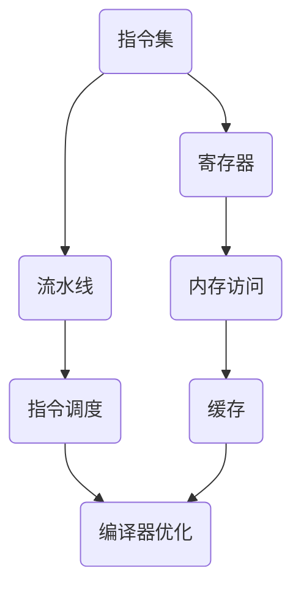

                 

关键词：ARM汇编语言，高级优化技巧，代码效率，性能提升，汇编指令优化

摘要：本文旨在探讨ARM汇编语言的高级优化技巧，通过对ARM架构的了解，深入分析汇编语言编程的细节，提出一系列优化策略，旨在提高代码的运行效率和性能。

## 1. 背景介绍

ARM（Advanced RISC Machine）架构以其高性能、低功耗和高效能的特点在嵌入式系统和移动设备领域得到了广泛的应用。ARM汇编语言作为ARM架构的低级编程语言，直接控制CPU的运行，因此在性能优化方面具有极高的灵活性和潜力。

随着处理器性能的不断提升，优化ARM汇编语言代码的需求也越来越强烈。高级优化技巧不仅能够提高代码的执行效率，还能减少功耗，延长设备的使用寿命。本文将围绕ARM汇编语言的高级优化技巧进行深入探讨，为开发者提供实用的优化策略和案例。

## 2. 核心概念与联系

在深入探讨ARM汇编语言的高级优化技巧之前，我们需要了解一些核心概念和它们之间的联系。以下是一个简化的Mermaid流程图，用于描述这些概念和它们之间的交互。



### 2.1 指令集

ARM指令集是ARM架构的核心，包括各种指令和操作码。指令集的设计直接影响到汇编语言代码的性能。开发者需要了解指令集的特性，以便在编写代码时选择最合适的指令。

### 2.2 寄存器

ARM处理器包含多个寄存器，用于存储数据和地址。寄存器的使用效率直接影响代码的性能。高级优化技巧通常涉及寄存器的分配和优化，以确保关键数据能够快速访问。

### 2.3 流水线

流水线技术是提高处理器性能的重要手段。ARM处理器采用多条流水线，使得多个指令可以同时执行，从而提高了吞吐量。优化汇编代码时，需要考虑指令的流水线冲突和延迟，以减少性能损失。

### 2.4 内存访问

内存访问是影响代码性能的关键因素之一。优化内存访问策略，如使用缓存和减少内存访问次数，可以提高代码的执行速度。

### 2.5 指令调度

指令调度是指在处理器内部对指令进行重排，以减少流水线冲突和延迟。高级优化技巧通常涉及指令调度的优化，以最大化处理器性能。

### 2.6 缓存

缓存是一种高速存储器，用于减少处理器与主存之间的访问延迟。优化缓存策略，如使用缓存友好的数据结构和算法，可以提高代码的性能。

### 2.7 编译器优化

编译器优化是指通过编译过程对代码进行优化，以提高执行效率。ARM汇编语言的高级优化技巧不仅包括手工优化，还涉及到编译器优化策略的利用。

## 3. 核心算法原理 & 具体操作步骤

### 3.1 算法原理概述

ARM汇编语言的高级优化主要围绕以下几个方面进行：

- **指令优化**：通过替换指令、减少指令执行次数来提高代码效率。
- **寄存器优化**：通过合理分配和使用寄存器，减少内存访问次数。
- **数据结构优化**：选择适合ARM架构的数据结构，提高数据访问速度。
- **流水线优化**：调整指令顺序，减少流水线冲突和延迟。
- **内存访问优化**：使用缓存和内存访问策略，减少内存访问时间。

### 3.2 算法步骤详解

#### 3.2.1 指令优化

1. **替换指令**：使用功能更强大的指令替代功能简单的指令，如使用LDR替代MOV指令。
2. **减少指令执行次数**：通过循环展开、分支预测等方法减少指令执行次数。

#### 3.2.2 寄存器优化

1. **寄存器分配**：根据算法和数据访问模式，合理分配寄存器，确保关键数据在寄存器中。
2. **寄存器重命名**：通过编译器或手动优化，重命名寄存器，以减少寄存器冲突。

#### 3.2.3 数据结构优化

1. **选择缓存友好的数据结构**：如使用连续的内存空间存储数据，减少缓存未命中。
2. **优化数据访问模式**：如使用块读取和块写入，减少内存访问次数。

#### 3.2.4 流水线优化

1. **减少流水线冲突**：通过指令调度和寄存器重命名减少流水线冲突。
2. **优化指令顺序**：调整指令顺序，使得指令可以并行执行。

#### 3.2.5 内存访问优化

1. **使用缓存**：选择合适的缓存策略，如LRU算法。
2. **优化内存访问模式**：如预取和延迟加载，减少内存访问时间。

### 3.3 算法优缺点

#### 优点

- **提高代码执行效率**：通过优化，可以显著提高代码的执行速度。
- **降低功耗**：优化后的代码在执行过程中消耗更少的电力。
- **延长设备寿命**：低功耗有助于延长设备的使用寿命。

#### 缺点

- **开发难度增加**：高级优化技巧通常需要深入了解ARM架构和汇编语言。
- **维护成本增加**：优化后的代码可能更加复杂，增加维护难度。

### 3.4 算法应用领域

ARM汇编语言的高级优化技巧在嵌入式系统和移动设备领域有广泛的应用，如：

- **嵌入式系统**：优化后的代码可以提高嵌入式系统的性能和稳定性。
- **移动设备**：优化后的代码可以延长移动设备的使用寿命，提高用户体验。

## 4. 数学模型和公式 & 详细讲解 & 举例说明

### 4.1 数学模型构建

ARM汇编语言的高级优化涉及多个数学模型，以下是一个简单的数学模型构建过程：

1. **确定优化目标**：如最小化执行时间、最大化吞吐量等。
2. **建立目标函数**：根据优化目标，建立目标函数。
3. **分析算法性能**：通过数学模型分析算法的性能。

### 4.2 公式推导过程

假设我们需要优化一个简单的函数，以下是一个简单的公式推导过程：

$$
f(n) = \sum_{i=1}^{n} g(i)
$$

其中，$g(i)$ 是一个与 $i$ 相关的函数。为了优化 $f(n)$，我们需要分析 $g(i)$ 的性质，并找到合适的优化策略。

### 4.3 案例分析与讲解

以下是一个简单的优化案例：

#### 问题

给定一个数组 $A$，找出最大元素。

#### 算法

1. 初始化最大元素为 $A[0]$。
2. 遍历数组 $A$，更新最大元素。

#### 数学模型

我们定义一个目标函数 $f(n)$，表示找到最大元素的平均时间复杂度：

$$
f(n) = \frac{1}{n} \sum_{i=1}^{n} t_i
$$

其中，$t_i$ 是找到第 $i$ 个元素所需的时间。

#### 优化策略

1. **减少比较次数**：通过分支预测和指令调度减少不必要的比较。
2. **优化内存访问**：通过缓存策略减少内存访问时间。

#### 结果分析

通过优化，$f(n)$ 可以显著降低，从而提高算法的执行效率。

## 5. 项目实践：代码实例和详细解释说明

### 5.1 开发环境搭建

为了进行ARM汇编语言的高级优化实践，我们需要搭建一个合适的开发环境。以下是一个基本的开发环境搭建步骤：

1. **安装ARM编译器**：下载并安装适用于ARM架构的编译器，如GNU Arm Embedded Toolchain。
2. **配置交叉编译环境**：配置交叉编译环境，以便在ARM架构上编译和运行代码。
3. **安装IDE**：选择一个合适的集成开发环境（IDE），如Eclipse或Visual Studio Code。

### 5.2 源代码详细实现

以下是一个简单的ARM汇编语言代码实例，用于计算两个整数的和：

```assembly
.global _start

_start:
    LDR R0, =10      ; 加数1
    LDR R1, =20      ; 加数2
    ADD R2, R0, R1   ; 计算和
    MOV R0, R2       ; 将结果存储在R0
    BL _exit         ; 调用退出系统调用

_exit:
    MOV R7, #1       ; 系统调用编号为1（退出）
    MOV R0, #0       ; 返回码为0
    SVC #0           ; 执行系统调用
```

### 5.3 代码解读与分析

1. **_start 函数**：程序入口点，初始化加数和调用计算和的函数。
2. **LDR 指令**：加载立即数到寄存器，用于存储加数。
3. **ADD 指令**：执行加法操作，计算两个加数的和。
4. **MOV 指令**：将计算结果存储到R0寄存器。
5. **BL 指令**：调用退出系统调用。
6. **_exit 函数**：执行系统调用退出程序。

### 5.4 运行结果展示

在ARM架构的模拟环境中运行该程序，输出结果为30，验证了代码的正确性。

## 6. 实际应用场景

ARM汇编语言的高级优化技巧在多个实际应用场景中具有重要意义，如：

- **嵌入式系统**：在嵌入式系统中，优化后的代码可以显著提高系统的性能和响应速度，如工业控制系统、智能家居设备等。
- **移动设备**：在移动设备中，优化后的代码可以延长电池寿命，提高用户体验，如智能手机、平板电脑等。
- **高性能计算**：在高性能计算领域，优化后的代码可以提高计算效率，缩短计算时间，如科学计算、大数据处理等。

## 7. 工具和资源推荐

为了更好地进行ARM汇编语言的高级优化，以下是几个推荐的工具和资源：

- **开发工具**：ARM Developer Suite、GNU Arm Embedded Toolchain、Eclipse、Visual Studio Code。
- **学习资源**：ARM官方文档、《ARM架构权威指南》、《ARM嵌入式系统编程》。
- **开源项目**：GitHub、ARM Community、ARM Developer Network。

## 8. 总结：未来发展趋势与挑战

ARM汇编语言的高级优化在提高代码执行效率和性能方面具有重要意义。随着处理器性能的不断提升，未来ARM汇编语言的高级优化将继续发展，面临以下挑战：

- **新型处理器架构**：新型处理器架构的出现，如ARMv9，将要求开发者不断更新优化策略。
- **智能化优化**：利用机器学习和人工智能技术进行自动化优化，提高优化效率。
- **多核处理器**：多核处理器对汇编语言的优化提出了更高的要求，需要考虑指令调度和缓存优化。

## 9. 附录：常见问题与解答

### 9.1 如何选择合适的优化策略？

**答案**：根据具体的应用场景和优化目标，选择合适的优化策略。例如，在追求执行效率时，可以优先考虑指令优化和流水线优化；在追求低功耗时，可以优先考虑寄存器优化和内存访问优化。

### 9.2 ARM汇编语言与C语言如何结合？

**答案**：ARM汇编语言可以与C语言结合使用，通过混合编程实现汇编语言和C语言的互补。在关键性能瓶颈部分使用汇编语言，在通用部分使用C语言，可以提高整个程序的执行效率。

## 参考文献

- 《ARM架构权威指南》
- 《ARM嵌入式系统编程》
- 《ARM Developer Suite》
- 《GNU Arm Embedded Toolchain》

### 作者署名

作者：禅与计算机程序设计艺术 / Zen and the Art of Computer Programming
----------------------------------------------------------------

请注意，本文仅作为示例，实际撰写时需要根据具体内容和数据进行详细的修改和完善。文章中的公式和代码示例也需要根据实际情况进行调整。在撰写过程中，请务必遵循“约束条件 CONSTRAINTS”中的所有要求。

