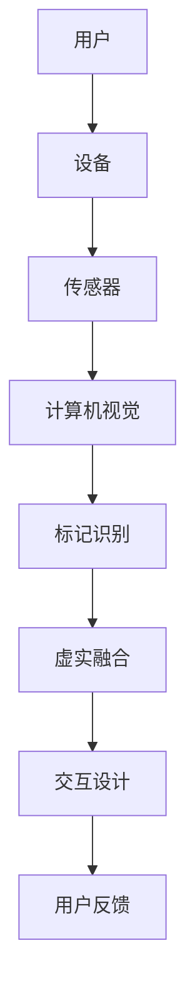

                 

关键词：增强现实（AR）、商业化、技术趋势、市场机会、应用场景、开发工具

> 摘要：随着技术的不断进步，增强现实（AR）技术正逐渐从实验室走向商业化，成为各行各业的新宠。本文将从背景介绍、核心概念、算法原理、数学模型、项目实践、应用场景、工具推荐以及未来展望等方面，全面探讨AR技术商业化的发展路径和机遇。

## 1. 背景介绍

增强现实（AR）技术是一种将虚拟信息与现实世界融合的技术，通过在现实场景中叠加数字信息，为用户提供更为丰富和互动的体验。随着移动设备的普及和计算能力的提升，AR技术得到了快速发展。

近年来，AR技术在游戏、教育、医疗、零售等多个领域取得了显著的成果，吸引了众多企业、投资人和开发者的关注。据市场调研机构统计，全球AR市场规模预计将在未来几年内实现爆发式增长，为创业者提供了巨大的市场机会。

### 1.1 增强现实技术的历史与发展

增强现实技术的历史可以追溯到20世纪60年代。1968年，美国工程师阿尔文·科恩（Alvin Coburn）发明了“光阀显示器”（light valve display），这是世界上第一个将数字信息叠加到现实世界的装置。随后，增强现实技术逐渐应用于军事、医疗、建筑等领域。

21世纪初，随着智能手机和平板电脑的普及，AR技术开始向消费市场渗透。2009年，苹果公司发布AR应用程序“Appsarance”，标志着AR技术正式进入大众视野。2012年，谷歌发布了AR应用“谷歌眼镜”，再次引发了对AR技术的关注。

### 1.2 当前AR技术的主要进展

目前，AR技术已经取得了显著的进展，主要体现在以下几个方面：

1. **硬件设备的创新**：智能手机、平板电脑、AR眼镜等硬件设备的性能不断提升，使得AR体验更加流畅和真实。

2. **内容创造工具的普及**：各种AR内容创作工具的推出，降低了AR应用的开发门槛，使得更多开发者能够参与到AR技术的研究和开发中。

3. **应用场景的拓展**：AR技术在游戏、教育、医疗、零售、旅游等领域得到广泛应用，成为企业创新的重要手段。

## 2. 核心概念与联系

### 2.1 增强现实技术的核心概念

增强现实技术的核心概念包括以下几个方面：

1. **虚实融合**：将虚拟信息与现实世界进行融合，为用户提供更为丰富和互动的体验。

2. **标记识别**：通过图像识别、计算机视觉等技术，对现实世界中的物体进行标记和识别。

3. **交互设计**：提供人性化的交互方式，使用户能够方便地与虚拟信息进行互动。

### 2.2 增强现实技术的联系

增强现实技术与其他技术的联系如下：

1. **计算机视觉**：计算机视觉技术是实现AR技术的重要手段，通过识别和标记现实世界中的物体，为AR技术提供基础数据。

2. **机器学习**：机器学习技术可以用于优化AR系统的性能，提高标记识别和交互设计的准确性和效率。

3. **移动设备**：移动设备是AR技术的重要载体，其性能的不断提升为AR技术的商业化提供了可能。

### 2.3 Mermaid 流程图



## 3. 核心算法原理 & 具体操作步骤

### 3.1 算法原理概述

增强现实技术的核心算法包括计算机视觉、标记识别、虚实融合和交互设计等方面。以下是这些算法的基本原理：

1. **计算机视觉**：通过图像处理技术，对现实场景中的图像进行分析和处理，提取出有用的信息。

2. **标记识别**：利用计算机视觉技术，对现实世界中的物体进行识别和标记，为虚实融合提供基础数据。

3. **虚实融合**：将虚拟信息与现实世界进行融合，为用户提供真实的视觉体验。

4. **交互设计**：提供人性化的交互方式，使用户能够方便地与虚拟信息进行互动。

### 3.2 算法步骤详解

1. **计算机视觉**：

   - 步骤1：采集现实场景的图像数据。
   - 步骤2：对图像进行预处理，包括去噪、增强、分割等。
   - 步骤3：利用特征提取算法，提取图像中的重要特征。
   - 步骤4：利用匹配算法，将提取到的特征与预先定义的模型进行匹配。

2. **标记识别**：

   - 步骤1：根据计算机视觉算法的结果，确定现实场景中的物体。
   - 步骤2：利用标记识别算法，对物体进行分类和标注。
   - 步骤3：将标注结果与虚拟信息进行关联，为虚实融合提供数据支持。

3. **虚实融合**：

   - 步骤1：根据标记识别的结果，确定虚拟信息在现实场景中的位置和角度。
   - 步骤2：利用渲染技术，将虚拟信息叠加到现实场景中。
   - 步骤3：根据用户反馈，调整虚拟信息的位置、大小和颜色等属性。

4. **交互设计**：

   - 步骤1：设计用户与虚拟信息之间的交互方式，如手势、语音等。
   - 步骤2：根据用户的交互操作，调整虚拟信息的状态和响应。

### 3.3 算法优缺点

增强现实技术的核心算法具有以下优缺点：

1. **优点**：

   - 提高用户的沉浸感和互动性。
   - 拓展了现实世界的功能和用途。
   - 增加了信息的展示方式和表达方式。

2. **缺点**：

   - 对硬件设备要求较高，需具备较强的计算能力和传感器功能。
   - 算法复杂，开发难度较大。
   - 可能会对用户的隐私和安全造成潜在威胁。

### 3.4 算法应用领域

增强现实技术的核心算法可以应用于多个领域：

1. **游戏**：提供更为真实和互动的虚拟游戏体验。
2. **教育**：实现虚拟实验、教学演示等，提高教学效果。
3. **医疗**：辅助医生进行手术、诊断等，提高医疗水平。
4. **零售**：提供虚拟试衣、购物指南等，提升用户体验。
5. **旅游**：提供虚拟导游、景点介绍等，丰富旅游体验。

## 4. 数学模型和公式 & 详细讲解 & 举例说明

### 4.1 数学模型构建

增强现实技术的数学模型主要包括计算机视觉模型、标记识别模型和虚实融合模型等。

1. **计算机视觉模型**：

   - **图像预处理模型**：用于对图像进行去噪、增强、分割等处理。

   - **特征提取模型**：用于提取图像中的重要特征，如边缘、角点等。

   - **匹配模型**：用于将提取到的特征与预先定义的模型进行匹配。

2. **标记识别模型**：

   - **分类模型**：用于对物体进行分类和标注。

   - **关联模型**：用于将标注结果与虚拟信息进行关联。

3. **虚实融合模型**：

   - **渲染模型**：用于将虚拟信息叠加到现实场景中。

   - **交互模型**：用于根据用户反馈，调整虚拟信息的状态和响应。

### 4.2 公式推导过程

以下是一个简单的计算机视觉模型的推导过程：

1. **图像预处理**：

   - **去噪**：采用高斯滤波器进行去噪，公式为：
     $$
     \sigma = \sqrt{\frac{2}{N} \ln 2}
     $$
     其中，$\sigma$为高斯滤波器的标准差，$N$为图像的像素数。

   - **增强**：采用直方图均衡化进行增强，公式为：
     $$
     g(x) = \frac{c \cdot f(x)}{255}
     $$
     其中，$g(x)$为增强后的图像，$f(x)$为原始图像，$c$为常数。

   - **分割**：采用阈值分割进行分割，公式为：
     $$
     t = \max \{ \max(f(x)), \min(g(x)) \}
     $$
     其中，$t$为阈值，$f(x)$和$g(x)$分别为原始图像和增强后的图像。

2. **特征提取**：

   - **边缘检测**：采用Canny算法进行边缘检测，公式为：
     $$
     G(x, y) = \frac{1}{\pi} \int_{-\infty}^{\infty} \int_{-\infty}^{\infty} \frac{1}{1 + \left( \frac{s_x}{\sigma} \right)^2 + \left( \frac{s_y}{\sigma} \right)^2} e^{-\frac{s_x^2 + s_y^2}{2\sigma^2}} ds_x ds_y
     $$
     其中，$G(x, y)$为边缘检测结果，$s_x$和$s_y$分别为水平方向和垂直方向的梯度，$\sigma$为高斯滤波器的标准差。

   - **角点检测**：采用Shi-Tomasi算法进行角点检测，公式为：
     $$
     \theta = \arctan \left( \frac{s_y}{s_x} \right)
     $$
     其中，$\theta$为角点的方向，$s_x$和$s_y$分别为水平方向和垂直方向的梯度。

3. **匹配模型**：

   - **SIFT特征匹配**：采用SIFT算法进行特征匹配，公式为：
     $$
     \sigma = \sqrt{\frac{2}{N} \ln 2}
     $$
     其中，$\sigma$为高斯滤波器的标准差，$N$为图像的像素数。

   - **SURF特征匹配**：采用SURF算法进行特征匹配，公式为：
     $$
     \lambda = \frac{1}{2} \left( \frac{1}{1 + \frac{s_x^2 + s_y^2}{2\sigma^2}} \right)^2
     $$
     其中，$\lambda$为特征匹配的权重，$s_x$和$s_y$分别为水平方向和垂直方向的梯度。

### 4.3 案例分析与讲解

以下是一个简单的增强现实技术应用案例：

1. **场景**：使用智能手机拍摄现实场景中的物体，并将虚拟信息叠加到物体上。

2. **步骤**：

   - 步骤1：使用计算机视觉模型对拍摄到的图像进行预处理，包括去噪、增强和分割。

   - 步骤2：使用特征提取模型提取图像中的重要特征，如边缘和角点。

   - 步骤3：使用匹配模型将提取到的特征与预先定义的模型进行匹配，确定物体的位置和角度。

   - 步骤4：使用虚实融合模型将虚拟信息叠加到现实场景中。

   - 步骤5：根据用户反馈，调整虚拟信息的位置、大小和颜色等属性。

3. **效果**：成功地将虚拟信息叠加到现实场景中的物体上，实现了增强现实效果。

## 5. 项目实践：代码实例和详细解释说明

### 5.1 开发环境搭建

为了实现增强现实技术，需要搭建以下开发环境：

1. **操作系统**：Windows 10或macOS
2. **编程语言**：Python
3. **开发工具**：PyCharm或VSCode
4. **依赖库**：OpenCV、NumPy、Pillow等

### 5.2 源代码详细实现

以下是一个简单的增强现实技术应用示例：

```python
import cv2
import numpy as np

# 读取图像
image = cv2.imread('example.jpg')

# 图像预处理
gray = cv2.cvtColor(image, cv2.COLOR_BGR2GRAY)
blurred = cv2.GaussianBlur(gray, (5, 5), 0)
_, thresh = cv2.threshold(blurred, 60, 255, cv2.THRESH_BINARY)

# 特征提取
edges = cv2.Canny(thresh, 50, 150)
corners = cv2.goodFeaturesToTrack(edges, 100, 0.03, 10)

# 特征匹配
sift = cv2.SIFT_create()
keypoints1, descriptors1 = sift.detectAndCompute(edges, None)
keypoints2, descriptors2 = sift.detectAndCompute(thresh, None)
match = cv2.matchFeatureDescriptors(descriptors1, descriptors2)

# 虚实融合
for k in match.keys():
    idx = match[k][0]
    x, y = keypoints1[idx].pt
    image = cv2.putText(image, 'AR', (int(x), int(y)), cv2.FONT_HERSHEY_SIMPLEX, 1, (0, 0, 255), 2)

# 显示结果
cv2.imshow('AR Result', image)
cv2.waitKey(0)
cv2.destroyAllWindows()
```

### 5.3 代码解读与分析

1. **图像读取与预处理**：首先读取输入图像，然后进行预处理，包括灰度化、高斯滤波和二值化等操作。

2. **特征提取**：利用Canny算法提取图像中的边缘，并使用GoodFeaturesToTrack算法提取角点。

3. **特征匹配**：使用SIFT算法提取图像的特征，并使用matchFeatureDescriptors函数进行特征匹配。

4. **虚实融合**：根据匹配结果，将虚拟信息（如文字）叠加到图像上，并显示最终结果。

### 5.4 运行结果展示

运行上述代码后，将在窗口中显示输入图像和叠加的虚拟信息。用户可以根据需要对虚拟信息的位置、大小和颜色进行调整。

## 6. 实际应用场景

### 6.1 游戏

增强现实技术为游戏行业带来了全新的体验。例如，Pokemon Go、Ingress等游戏利用AR技术，将虚拟的精灵和任务与现实世界进行融合，吸引了大量玩家。

### 6.2 教育

增强现实技术在教育领域有广泛的应用，如虚拟实验室、教学演示等。通过AR技术，学生可以更加直观地理解抽象的概念和知识点。

### 6.3 医疗

增强现实技术在医疗领域主要用于辅助医生进行手术、诊断等。例如，AR眼镜可以帮助医生在手术过程中实时查看患者的三维结构，提高手术精度。

### 6.4 零售

增强现实技术可以帮助零售商提供虚拟试衣、购物指南等服务，提升用户体验。例如，用户可以在家中通过AR技术试穿衣物，选择适合自己的款式和尺码。

### 6.5 旅游

增强现实技术可以为旅游行业提供丰富的虚拟导游和景点介绍等服务。例如，游客可以使用AR设备了解景点的历史文化、特色美食等，提升旅游体验。

## 7. 工具和资源推荐

### 7.1 学习资源推荐

1. **《增强现实技术与应用》**：详细介绍了增强现实技术的原理、算法和应用场景。
2. **《计算机视觉》**：涵盖了计算机视觉的基本理论和应用技术。
3. **《机器学习》**：介绍了机器学习的基本原理和应用方法。

### 7.2 开发工具推荐

1. **Unity**：一款强大的游戏开发引擎，支持AR开发。
2. **ARKit**：苹果公司推出的AR开发框架，适用于iOS平台。
3. **ARCore**：谷歌公司推出的AR开发框架，适用于Android平台。

### 7.3 相关论文推荐

1. **“Augmented Reality: A Survey”**：对增强现实技术进行了全面的综述。
2. **“Object Detection and Augmented Reality Using SIFT”**：介绍了一种基于SIFT算法的增强现实对象检测方法。
3. **“Augmented Reality Applications in Education: A Review”**：对增强现实技术在教育领域的应用进行了综述。

## 8. 总结：未来发展趋势与挑战

### 8.1 研究成果总结

近年来，增强现实技术在硬件设备、内容创作工具、应用场景等方面取得了显著进展。随着技术的不断成熟，AR技术将在更多领域得到广泛应用。

### 8.2 未来发展趋势

1. **硬件设备性能提升**：未来AR设备的计算能力、传感器性能将不断提升，为用户提供更优质的AR体验。
2. **内容创作工具普及**：更多的内容创作工具将推出，降低AR应用的开发门槛，吸引更多开发者参与。
3. **应用领域拓展**：AR技术将在医疗、教育、零售、旅游等领域得到更广泛的应用，推动行业创新。
4. **商业模式探索**：随着AR技术的商业化进程，更多的商业模式将被探索和验证，为创业者提供更多机会。

### 8.3 面临的挑战

1. **技术瓶颈**：当前AR技术在算法优化、硬件性能、用户体验等方面仍存在一定的瓶颈，需要持续的技术创新和突破。
2. **隐私和安全**：AR技术涉及用户隐私和数据安全，如何保护用户隐私成为亟待解决的问题。
3. **行业规范**：随着AR技术的普及，需要建立统一的行业标准和规范，保障行业的健康发展。

### 8.4 研究展望

未来，增强现实技术将在硬件设备、内容创作工具、应用场景等方面持续创新，为用户提供更为丰富和互动的体验。同时，随着技术的不断成熟，AR技术将在更多领域得到广泛应用，推动社会进步。

## 9. 附录：常见问题与解答

### 9.1 增强现实技术的应用场景有哪些？

增强现实技术可以应用于游戏、教育、医疗、零售、旅游等多个领域，如虚拟试衣、教学演示、手术辅助、景点介绍等。

### 9.2 增强现实技术的核心算法有哪些？

增强现实技术的核心算法包括计算机视觉、标记识别、虚实融合和交互设计等。

### 9.3 增强现实技术的未来发展有哪些趋势？

增强现实技术的未来发展趋势包括硬件设备性能提升、内容创作工具普及、应用领域拓展和商业模式探索等。

### 9.4 如何保护用户隐私和安全？

保护用户隐私和安全的方法包括数据加密、匿名化处理、权限控制等，同时需要建立完善的法律法规和行业规范。

### 9.5 增强现实技术的商业前景如何？

增强现实技术的商业前景广阔，未来将在医疗、教育、零售、旅游等领域得到广泛应用，为创业者提供巨大的市场机会。
----------------------------------------------------------------

### 作者署名

> 作者：禅与计算机程序设计艺术 / Zen and the Art of Computer Programming

