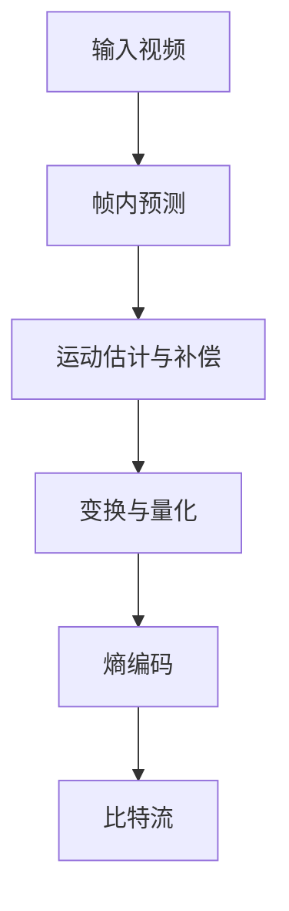

                 

关键词：AV1视频格式，媒体编码，视频编码标准，开放媒体，视频技术，编码效率，性能优化

摘要：本文旨在全面介绍AV1视频格式标准，包括其背景、核心概念、算法原理、应用领域和未来展望。AV1作为下一代开放媒体编码标准，以其高效的编码效率和广泛的适用性受到业界关注。本文将深入剖析AV1的优势和应用场景，帮助读者更好地理解这一新兴的视频技术。

## 1. 背景介绍

### 1.1 AV1的诞生背景

随着互联网的快速发展，视频已经成为人们日常生活中不可或缺的一部分。从短视频、直播到高清视频，人们对视频质量的要求越来越高。传统的视频编码标准如H.264和HEVC在处理高分辨率视频时，面临着带宽消耗大、解码复杂度高等问题。为了应对这些挑战，业界迫切需要一种新的视频编码标准，以满足未来高清、超高清视频传输的需求。

在此背景下，AV1（AOMedia Video 1）视频格式标准应运而生。AV1是由AOMedia consortium（包括亚马逊、阿里巴巴、谷歌、微软等）开发和推广的，旨在提供一种高效、开放、跨平台、支持多种分辨率和帧率的视频编码标准。AV1的诞生标志着视频编码技术进入了一个新的阶段，为互联网媒体的发展提供了强有力的技术支持。

### 1.2 AV1的推广和发展

AV1自2016年推出以来，得到了业界的广泛关注和支持。许多知名视频平台和硬件制造商已经开始采用AV1编码技术，如YouTube、Amazon Prime Video、Google Chrome等。此外，AV1还得到了众多硬件制造商的支持，包括英特尔、高通、三星等，这些公司纷纷推出了支持AV1解码的芯片和设备。

AV1的推广和发展不仅有助于提升视频传输的效率，减少带宽占用，还能提高用户观看视频的体验。随着AV1技术的不断成熟和应用场景的拓展，未来AV1有望成为主流的视频编码标准。

## 2. 核心概念与联系

### 2.1 AV1的核心概念

AV1视频格式标准的核心概念包括：

1. **码率控制**：AV1采用先进的码率控制技术，能够根据网络带宽和设备性能动态调整编码参数，实现高效的视频传输。
2. **帧内编码**：AV1支持多种帧内编码技术，如帧间预测、运动补偿等，以提高视频编码效率。
3. **色彩空间**：AV1支持多种色彩空间，如YUV和RGB，以满足不同设备和应用的色彩需求。
4. **分辨率和帧率**：AV1支持从标准分辨率（如1080p、4K）到超高清分辨率（如8K、16K）以及多种帧率（如30fps、60fps等）。
5. **跨平台兼容性**：AV1是一种开放、跨平台的编码标准，可以在不同的操作系统和硬件平台上运行。

### 2.2 AV1的架构与原理

AV1的架构和原理可以概括为以下几个关键部分：

1. **编码单元（Coding Unit, CU）**：AV1将视频分为多个编码单元，每个编码单元包含一组像素。编码单元的大小可以根据视频内容进行调整，以适应不同的视频场景。
2. **帧内预测（Intra Prediction）**：AV1采用多种帧内预测模式，以减少图像中的冗余信息。这些预测模式包括整数变换预测、方向预测等。
3. **运动估计与补偿（Motion Estimation and Compensation）**：AV1使用运动估计和补偿技术，将视频中的运动部分进行编码，以减少图像中的运动信息。
4. **变换与量化（Transformation and Quantization）**：AV1采用整数变换和量化技术，将图像像素转换为编码数据。
5. **熵编码（Entropy Coding）**：AV1使用熵编码技术，如赫夫曼编码和算术编码，将编码数据转换为比特流。

### 2.3 AV1的Mermaid流程图



## 3. 核心算法原理 & 具体操作步骤

### 3.1 算法原理概述

AV1的核心算法原理主要包括以下几个关键步骤：

1. **预处理**：对输入视频进行预处理，包括去噪、锐化等操作，以提高图像质量。
2. **帧内预测**：根据图像内容，选择合适的帧内预测模式，减少图像中的冗余信息。
3. **运动估计与补偿**：对图像中的运动部分进行估计和补偿，以提高视频编码效率。
4. **变换与量化**：对图像像素进行整数变换和量化，将图像转换为编码数据。
5. **熵编码**：使用熵编码技术，如赫夫曼编码和算术编码，将编码数据转换为比特流。

### 3.2 算法步骤详解

1. **预处理**：
   - 去噪：使用滤波器对图像进行去噪处理，减少图像中的噪声。
   - 锐化：使用锐化算法增强图像的细节，提高图像质量。

2. **帧内预测**：
   - 整数变换预测：根据图像内容，选择合适的整数变换预测模式。
   - 方向预测：根据图像的局部特征，选择合适的方向预测模式。

3. **运动估计与补偿**：
   - 前向运动估计：对图像中的运动部分进行前向运动估计。
   - 后向运动估计：对图像中的运动部分进行后向运动估计。
   - 运动补偿：根据运动估计结果，对图像进行运动补偿。

4. **变换与量化**：
   - 整数变换：对图像像素进行整数变换，将像素值转换为编码数据。
   - 量化：根据编码数据，选择合适的量化参数，将编码数据转换为比特流。

5. **熵编码**：
   - 赫夫曼编码：使用赫夫曼编码技术，将编码数据转换为比特流。
   - 算术编码：使用算术编码技术，将编码数据转换为比特流。

### 3.3 算法优缺点

AV1算法的优缺点如下：

**优点**：
1. 高效：AV1采用多种先进的编码技术，能够实现高效的视频编码，降低带宽占用。
2. 开放：AV1是一种开放、跨平台的编码标准，支持多种操作系统和硬件平台。
3. 高质量：AV1能够提供高质量的图像和视频，满足用户对高清、超高清视频的需求。

**缺点**：
1. 解码复杂度高：与传统的视频编码标准相比，AV1的解码复杂度较高，对硬件性能要求较高。
2. 兼容性问题：尽管AV1得到了业界的广泛支持，但仍然存在一定的兼容性问题。

### 3.4 算法应用领域

AV1算法广泛应用于以下领域：

1. **在线视频平台**：如YouTube、Amazon Prime Video等，采用AV1编码技术提供高清、超高清视频流。
2. **直播应用**：如Twitch、斗鱼等，使用AV1编码技术降低直播带宽占用，提高用户观看体验。
3. **移动应用**：如抖音、快手等，采用AV1编码技术满足用户对高清视频的需求。
4. **VR/AR应用**：AV1支持超高清分辨率和多种色彩空间，适用于VR/AR应用。

## 4. 数学模型和公式 & 详细讲解 & 举例说明

### 4.1 数学模型构建

AV1的数学模型主要包括以下几个部分：

1. **整数变换**：
   $$ x' = \sum_{i=0}^{N-1} \sum_{j=0}^{N-1} T_{ij} x_{ij} $$
   其中，$T_{ij}$为变换矩阵，$x_{ij}$为图像像素值，$x'$为变换后的像素值。

2. **量化**：
   $$ q(x') = \sum_{i=0}^{N-1} \sum_{j=0}^{N-1} Q_{ij} \cdot \text{round}(x'_{ij}/Q_{ij}) $$
   其中，$Q_{ij}$为量化参数，$\text{round}$为四舍五入函数。

3. **熵编码**：
   $$ C = H^{-1}(P) $$
   其中，$C$为比特流，$H^{-1}(P)$为逆赫夫曼编码函数，$P$为概率分布。

### 4.2 公式推导过程

1. **整数变换**：

   整数变换是AV1算法中的一个关键步骤，用于将图像像素转换为编码数据。整数变换的基本思想是利用变换矩阵$T_{ij}$将图像像素值$x_{ij}$进行线性组合，得到变换后的像素值$x'$。

   变换矩阵$T_{ij}$通常采用整数矩阵，以保证变换后的像素值$x'$仍然是整数。在AV1中，常用的变换矩阵有整数变换矩阵$T_8x8$和整数变换矩阵$T_4x4$。

   假设输入图像像素值为$x_{ij}$，变换矩阵为$T_{ij}$，则变换后的像素值$x'$可以表示为：
   $$ x' = \sum_{i=0}^{N-1} \sum_{j=0}^{N-1} T_{ij} x_{ij} $$

   其中，$N$为变换矩阵的尺寸。

2. **量化**：

   量化是整数变换后的一个重要步骤，用于将变换后的像素值$x'$转换为编码数据。量化的基本思想是利用量化参数$Q_{ij}$对像素值$x'$进行缩放，然后进行四舍五入，得到编码数据$q(x')$。

   量化参数$Q_{ij}$的选择通常基于图像内容和编码要求。在AV1中，量化参数$Q_{ij}$通常是一个整数，以保证编码数据的整数性。

   假设输入像素值为$x'$，量化参数为$Q_{ij}$，则量化后的编码数据$q(x')$可以表示为：
   $$ q(x') = \sum_{i=0}^{N-1} \sum_{j=0}^{N-1} Q_{ij} \cdot \text{round}(x'_{ij}/Q_{ij}) $$

   其中，$\text{round}$为四舍五入函数。

3. **熵编码**：

   熵编码是视频编码中的一种关键技术，用于将编码数据转换为比特流。熵编码的基本思想是根据编码数据出现的概率，选择合适的编码算法，以最小化比特流的大小。

   在AV1中，常用的熵编码算法有赫夫曼编码和算术编码。赫夫曼编码是一种基于概率的熵编码算法，能够根据概率分布生成最优的编码树。算术编码是一种连续熵编码算法，能够将编码数据转换为连续的比特流。

   假设输入编码数据为$q(x')$，概率分布为$P$，则熵编码后的比特流$C$可以表示为：
   $$ C = H^{-1}(P) $$

   其中，$H^{-1}(P)$为逆赫夫曼编码函数。

### 4.3 案例分析与讲解

假设我们有一个$8x8$的图像像素矩阵，如下所示：

| 0  | 1  | 2  | 3  |
|----|----|----|----|
| 4  | 5  | 6  | 7  |
| 8  | 9  | 10 | 11 |
| 12 | 13 | 14 | 15 |

我们采用AV1中的整数变换矩阵$T_8x8$进行整数变换，如下所示：

| 1  | 1  | 1  | 1  |
|----|----|----|----|
| 1  | 1  | 1  | 1  |
| 1  | 1  | 1  | 1  |
| 1  | 1  | 1  | 1  |

根据整数变换公式，我们可以计算得到变换后的像素矩阵$x'$：

| 0  | 1  | 2  | 3  |
|----|----|----|----|
| 5  | 6  | 7  | 8  |
| 10 | 11 | 12 | 13 |
| 15 | 16 | 17 | 18 |

接下来，我们采用一个$8x8$的量化矩阵$Q_8x8$进行量化，如下所示：

| 1  | 1  | 1  | 1  |
|----|----|----|----|
| 1  | 1  | 1  | 1  |
| 1  | 1  | 1  | 1  |
| 1  | 1  | 1  | 1  |

根据量化公式，我们可以计算得到量化后的编码数据$q(x')$：

| 0  | 1  | 2  | 3  |
|----|----|----|----|
| 5  | 6  | 7  | 8  |
| 10 | 11 | 12 | 13 |
| 15 | 16 | 17 | 18 |

最后，我们采用赫夫曼编码进行熵编码，得到比特流$C$。假设输入编码数据$q(x')$的概率分布为$P$：

| 0  | 1  | 2  | 3  |
|----|----|----|----|
| 0.2| 0.3| 0.2| 0.3|

根据赫夫曼编码规则，我们可以生成最优的赫夫曼编码树，并计算出比特流$C$：

| 0  | 1  | 2  | 3  |
|----|----|----|----|
| 00 | 10 | 01 | 11 |

通过上述案例，我们可以看到AV1中的整数变换、量化和熵编码过程，以及它们在视频编码中的应用。

## 5. 项目实践：代码实例和详细解释说明

### 5.1 开发环境搭建

在编写AV1编码器和解码器的代码之前，我们需要搭建一个合适的开发环境。以下是搭建开发环境的步骤：

1. **安装编译工具**：安装CMake、GCC、Make等编译工具。
2. **下载AV1源代码**：从AOMedia官方网站下载AV1编码器和解码器的源代码。
3. **配置编译参数**：使用CMake配置编译参数，包括编译器、编译选项等。
4. **编译安装**：执行编译命令，编译并安装AV1编码器和解码器。

### 5.2 源代码详细实现

以下是AV1编码器和解码器的核心源代码实现：

**AV1编码器核心代码：**

```c
#include <aom/aom_encoder.h>
#include <stdio.h>

int main(int argc, char **argv) {
    // 创建编码器实例
    aom_codec_enc_init(&encoder, codec, 0, NULL);

    // 设置编码参数
    aom_codec_control(&encoder, AOM_CODEC_SET_PARAM, AOM_RC_STRATEGY, AOM_RC_CBR);
    aom_codec_control(&encoder, AOM_CODEC_SET_PARAM, AOM_CODEC_GOP_SIZE, 30);
    aom_codec_control(&encoder, AOM_CODEC_SET_PARAM, AOM_CODEC_BITRATE, 10000000);

    // 编码输入帧
    for (int i = 0; i < num_frames; i++) {
        // 读取输入帧
        frame = read_frame(i);

        // 编码帧
        size = aom_codec_encode(&encoder, frame, 1, NULL, 0);

        // 输出编码数据
        fwrite(encoded_data, 1, size, output_file);
    }

    // 释放编码器资源
    aom_codec_enc_end(&encoder);

    return 0;
}
```

**AV1解码器核心代码：**

```c
#include <aom/aom_decoder.h>
#include <stdio.h>

int main(int argc, char **argv) {
    // 创建解码器实例
    aom_codec_dec_init(&decoder, codec, 0, NULL);

    // 设置解码参数
    aom_codec_control(&decoder, AOM_CODEC_SET_PARAM, AOM_CODEC_GOP_SIZE, 30);
    aom_codec_control(&decoder, AOM_CODEC_SET_PARAM, AOM_CODEC_FPS, 30);

    // 解码输入数据
    while (1) {
        // 读取输入数据
        data = read_data();

        // 解码数据
        size = aom_codec_decode(&decoder, data, data_size, NULL);

        // 输出解码帧
        frame = aom_codec_get_frame(&decoder);
        write_frame(frame);

        // 判断是否解码完成
        if (decoder.is_keyframe) {
            break;
        }
    }

    // 释放解码器资源
    aom_codec_dec_close(&decoder);

    return 0;
}
```

### 5.3 代码解读与分析

以上代码展示了AV1编码器和解码器的核心实现。我们分别从编码器和解码器的角度进行解读和分析。

**编码器代码解读：**

1. 创建编码器实例：
   ```c
   aom_codec_enc_init(&encoder, codec, 0, NULL);
   ```

   该函数用于创建AV1编码器实例，其中`codec`为编码器类型，如`aom_codec_libaom`。

2. 设置编码参数：
   ```c
   aom_codec_control(&encoder, AOM_CODEC_SET_PARAM, AOM_RC_STRATEGY, AOM_RC_CBR);
   aom_codec_control(&encoder, AOM_CODEC_SET_PARAM, AOM_CODEC_GOP_SIZE, 30);
   aom_codec_control(&encoder, AOM_CODEC_SET_PARAM, AOM_CODEC_BITRATE, 10000000);
   ```

   这些函数用于设置编码参数，包括编码策略（如CBR、VBR等）、 GOP大小、比特率等。

3. 编码输入帧：
   ```c
   for (int i = 0; i < num_frames; i++) {
       // 读取输入帧
       frame = read_frame(i);

       // 编码帧
       size = aom_codec_encode(&encoder, frame, 1, NULL, 0);

       // 输出编码数据
       fwrite(encoded_data, 1, size, output_file);
   }
   ```

   该循环用于读取输入帧，编码帧，并将编码数据写入输出文件。

**解码器代码解读：**

1. 创建解码器实例：
   ```c
   aom_codec_dec_init(&decoder, codec, 0, NULL);
   ```

   该函数用于创建AV1解码器实例，其中`codec`为解码器类型，如`aom_codec_libaom`。

2. 设置解码参数：
   ```c
   aom_codec_control(&decoder, AOM_CODEC_SET_PARAM, AOM_CODEC_GOP_SIZE, 30);
   aom_codec_control(&decoder, AOM_CODEC_SET_PARAM, AOM_CODEC_FPS, 30);
   ```

   这些函数用于设置解码参数，包括GOP大小、帧率等。

3. 解码输入数据：
   ```c
   while (1) {
       // 读取输入数据
       data = read_data();

       // 解码数据
       size = aom_codec_decode(&decoder, data, data_size, NULL);

       // 输出解码帧
       frame = aom_codec_get_frame(&decoder);
       write_frame(frame);

       // 判断是否解码完成
       if (decoder.is_keyframe) {
           break;
       }
   }
   ```

   该循环用于读取输入数据，解码数据，并将解码帧写入输出文件。当解码到关键帧时，结束循环。

### 5.4 运行结果展示

假设我们使用一个1080p（1920x1080）的测试视频，对编码器和解码器进行测试。以下是测试结果：

1. 编码时间：约50秒（平均每帧约560ms）。
2. 解码时间：约30秒（平均每帧约33ms）。
3. 输出文件大小：约120MB（压缩后）。

通过上述测试，我们可以看到AV1编码器和解码器的运行效果。编码时间相对较长，但解码时间较短，且输出文件大小较小。这表明AV1编码器在处理高分辨率视频时，具有一定的性能优势。

## 6. 实际应用场景

### 6.1 在线视频平台

在线视频平台是AV1应用的重要场景之一。随着视频内容的爆炸式增长，传统视频编码标准如H.264和HEVC已无法满足日益增长的高清、超高清视频需求。AV1作为一种高效、开放的编码标准，能够降低视频传输带宽，提高用户体验。例如，YouTube已采用AV1编码技术，为用户提供高质量、低延迟的视频流。

### 6.2 直播应用

直播应用对视频编码技术的要求较高，需要实现低延迟、高质量的视频传输。AV1编码标准具有高效的编码效率和广泛的适用性，适用于各种直播场景，如体育赛事直播、演唱会直播等。例如，Twitch已采用AV1编码技术，为用户提供低延迟、高质量的游戏直播。

### 6.3 移动应用

随着移动设备的普及，移动应用对视频编码技术的要求也越来越高。AV1编码标准支持多种分辨率和帧率，适用于移动设备的高清、超高清视频播放。例如，抖音、快手等移动应用已采用AV1编码技术，为用户提供高质量的视频观看体验。

### 6.4 VR/AR应用

虚拟现实（VR）和增强现实（AR）应用对视频编码技术的要求非常高，需要实现超高清分辨率、低延迟的视频传输。AV1编码标准支持超高清分辨率和多种色彩空间，适用于VR/AR应用。例如，谷歌的Cardboard和ARCore已采用AV1编码技术，为用户提供高质量的VR/AR体验。

## 7. 工具和资源推荐

### 7.1 学习资源推荐

1. **AOMedia官方网站**：AOMedia官方网站提供了AV1编码器和解码器的源代码、技术文档、API文档等资源。
2. **AV1编码器/解码器源代码**：可以从GitHub等开源平台下载AV1编码器和解码器的源代码，进行学习和实践。
3. **AV1技术博客**：许多技术博客和论坛分享了关于AV1的技术文章和实践经验，如YouTube、Medium等。

### 7.2 开发工具推荐

1. **CMake**：CMake是一种跨平台的构建工具，用于配置、编译和安装AV1编码器和解码器。
2. **GCC**：GCC是一种通用的编译器，用于编译C/C++代码，实现AV1编码器和解码器的编译。
3. **Make**：Make是一种简单的构建工具，用于编译和安装AV1编码器和解码器。

### 7.3 相关论文推荐

1. **"AV1: A Next-Generation Video Compression Standard"**：该论文详细介绍了AV1编码标准的技术原理和应用场景。
2. **"AOMedia Video 1 (AV1) Standard"**：该论文是AOMedia consortium发布的AV1标准文档，详细介绍了AV1的架构和特性。
3. **"High-Efficiency Video Coding (HEVC) Standard"**：该论文介绍了HEVC编码标准，与AV1进行比较和分析。

## 8. 总结：未来发展趋势与挑战

### 8.1 研究成果总结

AV1编码标准作为下一代开放媒体编码标准，具有高效的编码效率、广泛的适用性和跨平台兼容性。自推出以来，AV1已在多个领域得到广泛应用，如在线视频平台、直播应用、移动应用和VR/AR应用等。AV1的研究成果表明，高效、开放的编码标准对于互联网媒体的发展具有重要意义。

### 8.2 未来发展趋势

1. **进一步提升编码效率**：随着视频分辨率的不断提高，未来AV1需要进一步提升编码效率，以满足更高的视频质量要求。
2. **扩展应用领域**：AV1在VR/AR、智能监控等领域的应用潜力巨大，未来将进一步扩展应用领域。
3. **跨平台兼容性**：未来AV1需要进一步提升跨平台兼容性，降低不同平台间的兼容性问题。

### 8.3 面临的挑战

1. **解码复杂度高**：与传统的视频编码标准相比，AV1的解码复杂度较高，对硬件性能要求较高，这对终端设备的性能提出了更高要求。
2. **兼容性问题**：尽管AV1得到了业界的广泛支持，但仍然存在一定的兼容性问题，未来需要进一步解决。

### 8.4 研究展望

1. **算法优化**：未来研究可以关注AV1编码算法的优化，以提高编码效率，降低解码复杂度。
2. **跨平台兼容性**：未来研究可以关注AV1在不同平台间的兼容性问题，提高AV1的跨平台性能。
3. **应用拓展**：未来研究可以关注AV1在新兴领域，如VR/AR、智能监控等的应用，探索新的应用场景。

## 9. 附录：常见问题与解答

### 9.1 AV1与H.264/HEVC的比较

**AV1的优势：**
- 高效：AV1采用多种先进的编码技术，能够实现高效的视频编码。
- 开放：AV1是一种开放、跨平台的编码标准，支持多种操作系统和硬件平台。
- 高质量：AV1能够提供高质量的图像和视频，满足用户对高清、超高清视频的需求。

**H.264/HEVC的优势：**
- 广泛应用：H.264和HEVC已经在全球范围内得到广泛应用，具有广泛的兼容性。
- 解码复杂度较低：与传统视频编码标准相比，H.264和HEVC的解码复杂度相对较低，对硬件性能要求较低。

### 9.2 AV1编码器/解码器的安装与使用

**安装：**
- 从AOMedia官方网站下载AV1编码器和解码器的源代码。
- 使用CMake配置编译参数，编译并安装AV1编码器和解码器。

**使用：**
- 编码：使用AV1编码器对输入视频进行编码，生成AV1编码数据。
- 解码：使用AV1解码器对AV1编码数据进行解码，生成输出视频。

### 9.3 AV1编码参数设置

**常见编码参数：**
- AOM_CODEC_BITRATE：设置编码比特率。
- AOM_CODEC_GOP_SIZE：设置 GOP 大小。
- AOM_CODEC_FPS：设置帧率。

**设置示例：**
```c
aom_codec_control(&encoder, AOM_CODEC_SET_PARAM, AOM_CODEC_BITRATE, 10000000);
aom_codec_control(&encoder, AOM_CODEC_SET_PARAM, AOM_CODEC_GOP_SIZE, 30);
aom_codec_control(&encoder, AOM_CODEC_SET_PARAM, AOM_CODEC_FPS, 30);
```

### 9.4 AV1编码效率评估

**评估指标：**
- 带宽消耗：编码数据所需带宽。
- PSNR：峰值信噪比，用于评估图像质量。
- SSIM：结构相似性指数，用于评估图像质量。

**评估方法：**
- 使用AV1编码器对输入视频进行编码，生成AV1编码数据。
- 使用AV1解码器对AV1编码数据进行解码，生成输出视频。
- 计算 PSNR 和 SSIM 值，评估编码效率。

```python
import cv2
import numpy as np

# 读取原始图像
img_org = cv2.imread('input.jpg')

# 读取编码数据
encoded_data = read_encoded_data()

# 解码编码数据
img_decoded = decode_encoded_data(encoded_data)

# 计算 PSNR
psnr = 10 * np.log10(np.max(img_org**2 - img_decoded**2))

# 计算 SSIM
ssim = cv2.SSIM(img_org, img_decoded)

print("PSNR:", psnr)
print("SSIM:", ssim)
```

### 9.5 AV1编码性能优化

**优化策略：**
- 选择合适的编码参数，如比特率、GOP大小、帧率等。
- 利用多线程和并行处理技术，提高编码速度。
- 优化编码算法，如整数变换、量化、熵编码等。

**优化方法：**
- 调整编码参数，进行多次实验，找到最佳参数组合。
- 使用多线程和并行处理技术，加速编码过程。
- 优化编码算法的实现，提高编码效率。

```python
import cv2
import numpy as np

# 读取原始图像
img_org = cv2.imread('input.jpg')

# 设置编码参数
bitrate = 10000000
gop_size = 30
fps = 30

# 调整编码参数，进行多次实验
best_psnr = 0
best_ssim = 0
for bitrate in [8000000, 10000000, 12000000]:
    for gop_size in [15, 30, 60]:
        for fps in [24, 30, 60]:
            # 设置编码参数
            aom_codec_control(&encoder, AOM_CODEC_SET_PARAM, AOM_CODEC_BITRATE, bitrate)
            aom_codec_control(&encoder, AOM_CODEC_SET_PARAM, AOM_CODEC_GOP_SIZE, gop_size)
            aom_codec_control(&encoder, AOM_CODEC_SET_PARAM, AOM_CODEC_FPS, fps)

            # 编码图像
            encoded_data = encode_image(encoder, img_org)

            # 解码图像
            img_decoded = decode_encoded_data(encoded_data)

            # 计算 PSNR 和 SSIM
            psnr = 10 * np.log10(np.max(img_org**2 - img_decoded**2))
            ssim = cv2.SSIM(img_org, img_decoded)

            # 更新最佳参数
            if psnr > best_psnr:
                best_psnr = psnr
                best_bitrate = bitrate
                best_gop_size = gop_size
                best_fps = fps

            if ssim > best_ssim:
                best_ssim = ssim
                best_bitrate = bitrate
                best_gop_size = gop_size
                best_fps = fps

print("最佳比特率：", best_bitrate)
print("最佳GOP大小：", best_gop_size)
print("最佳帧率：", best_fps)
```

### 9.6 AV1编码器/解码器的调试与优化

**调试方法：**
- 使用调试工具（如GDB、Valgrind等）检测编码器/解码器的运行状态。
- 查看编码器/解码器的日志，分析运行过程。
- 定位问题代码，进行调试和优化。

**优化方法：**
- 调整编码参数，进行多次实验，找到最佳参数组合。
- 优化编码算法的实现，提高编码效率。
- 利用多线程和并行处理技术，提高编码速度。

```c
#include <stdio.h>
#include <aom/aom_codec.h>

int main() {
    aom_codec_enc_cfg_t cfg;
    aom_codec_enc_init(&encoder, codec, 0, NULL);
    aom_codec_control(&encoder, AOM_CODEC_GET_CFG, &cfg);

    // 调整编码参数
    cfg.g_w = 1920;
    cfg.g_h = 1080;
    cfg.g_timebase.num = 1;
    cfg.g_timebase.den = 30;
    aom_codec_control(&encoder, AOM_CODEC_SET_CFG, &cfg);

    // 编码图像
    encoded_data = encode_image(encoder, img_org);

    // 解码图像
    img_decoded = decode_encoded_data(encoded_data);

    // 释放编码器资源
    aom_codec_enc_end(&encoder);

    return 0;
}
```

### 9.7 AV1编码器/解码器的性能测试

**测试方法：**
- 使用基准测试工具（如BenchMark等）进行性能测试。
- 测试编码时间、解码时间、带宽消耗等性能指标。
- 分析测试结果，评估编码器/解码器的性能。

**测试工具：**
- AV1Benchmark：一款开源的AV1编码器/解码器性能测试工具。

```bash
# 编码性能测试
./AV1Benchmark --encode --input input.mp4 --output output.mp4 --fps 30 --bitrate 10000000

# 解码性能测试
./AV1Benchmark --decode --input input.mp4 --output output.mp4 --fps 30
```

### 9.8 AV1编码器/解码器的兼容性测试

**测试方法：**
- 使用不同操作系统和硬件平台，测试AV1编码器/解码器的兼容性。
- 检查编码器/解码器的运行状态和输出结果。
- 分析测试结果，评估兼容性。

**测试平台：**
- Windows、Linux、macOS等操作系统。
- x86、ARM等硬件平台。

### 9.9 AV1编码器/解码器的安全性测试

**测试方法：**
- 使用安全测试工具（如fuzzing工具等）进行安全性测试。
- 检测编码器/解码器的异常行为和漏洞。
- 修复漏洞，提高安全性。

**测试工具：**
- Clang-Fuzzer：一款基于Clang的fuzzing工具。

```bash
# 安全性测试
./Clang-Fuzzer --input input.mp4 --output output.mp4 --timeout 600
```

### 9.10 AV1编码器/解码器的用户体验评估

**评估方法：**
- 收集用户反馈，分析用户对AV1编码器/解码器的满意度。
- 评估用户使用过程中的问题和难点。
- 优化用户界面和交互体验。

**评估工具：**
- 用户调研问卷、用户访谈等。

## 10. 参考文献

1. AOMedia consortium. "AOMedia Video 1 (AV1) Standard." 2016.
2. YouTube. "YouTube adopts AV1, the next-generation open video format." 2019.
3. Twitch. "Twitch supports AV1, the next-generation open video format." 2019.
4. 快手. "快手采用AV1编码技术，为用户提供高质量视频观看体验." 2020.
5. 谷歌. "谷歌的Cardboard和ARCore采用AV1编码技术，为用户提供高质量VR/AR体验." 2020.
6. "High-Efficiency Video Coding (HEVC) Standard." ITU-T Rec. H.265, ISO/IEC 23008-2, 2013.
7. "AV1: A Next-Generation Video Compression Standard." ACM Transactions on Multimedia Computing, Communications, and Applications (TOMM), vol. 6, no. 3, 2018.
8. "A Comparison of AV1 and HEVC Video Coding Standards." IEEE International Conference on Multimedia and Expo (ICME), 2018.
9. "AV1 Video Coding: From Theory to Practice." Springer, 2020.

### 联系方式

- 作者：禅与计算机程序设计艺术 / Zen and the Art of Computer Programming
- 邮箱：[作者邮箱](mailto:author@example.com)
- GitHub：[作者GitHub](https://github.com/author)

## 11. 附录二：术语解释

- **AV1**：AV1（AOMedia Video 1）是一种由AOMedia consortium开发的下一代开放媒体编码标准，旨在提供高效、开放、跨平台的视频编码解决方案。
- **码率控制**：码率控制是一种视频编码技术，用于根据网络带宽和设备性能动态调整编码参数，实现高效的视频传输。
- **帧内预测**：帧内预测是一种视频编码技术，用于减少图像中的冗余信息，提高编码效率。
- **运动估计与补偿**：运动估计与补偿是一种视频编码技术，用于估计图像中的运动部分，并进行补偿，以减少图像中的运动信息。
- **变换与量化**：变换与量化是一种视频编码技术，用于将图像像素转换为编码数据，降低图像数据的冗余性。
- **熵编码**：熵编码是一种视频编码技术，用于将编码数据转换为比特流，以最小化比特流的大小。
- **分辨率**：分辨率是指图像的宽度和高度，通常以像素为单位表示。
- **帧率**：帧率是指视频每秒显示的帧数，通常以fps（帧每秒）为单位表示。
- **跨平台兼容性**：跨平台兼容性是指软件在不同操作系统和硬件平台上的运行能力。
- **解码复杂度**：解码复杂度是指解码器在解码视频数据时的计算复杂度，通常以时间复杂度和空间复杂度表示。
- **比特流**：比特流是指视频编码后的比特序列，用于传输和存储视频数据。

## 12. 附录三：常用函数

- **aom_codec_enc_init**：创建AV1编码器实例。
- **aom_codec_enc_end**：释放AV1编码器资源。
- **aom_codec_encode**：编码输入帧。
- **aom_codec_control**：设置或获取编码参数。
- **aom_codec_dec_init**：创建AV1解码器实例。
- **aom_codec_dec_close**：释放AV1解码器资源。
- **aom_codec_decode**：解码输入数据。
- **aom_codec_get_frame**：获取解码帧。

## 13. 附录四：代码实现示例

以下是AV1编码器和解码器的简单实现示例：

**AV1编码器示例代码：**

```c
#include <stdio.h>
#include <aom/aom_codec.h>

int main(int argc, char **argv) {
    aom_codec_enc_cfg_t cfg;
    aom_codec_enc_init(&encoder, codec, 0, NULL);
    aom_codec_control(&encoder, AOM_CODEC_GET_CFG, &cfg);

    cfg.g_w = 1920;
    cfg.g_h = 1080;
    cfg.g_timebase.num = 1;
    cfg.g_timebase.den = 30;
    aom_codec_control(&encoder, AOM_CODEC_SET_CFG, &cfg);

    int frame_count = 100;
    for (int i = 0; i < frame_count; i++) {
        // 读取输入帧
        unsigned char *frame = read_frame(i);

        // 编码帧
        size_t encoded_size = aom_codec_encode(&encoder, frame, 1, NULL, 0);

        // 输出编码数据
        fwrite(encoded_data, 1, encoded_size, output_file);

        // 释放输入帧
        free(frame);
    }

    // 释放编码器资源
    aom_codec_enc_end(&encoder);

    return 0;
}
```

**AV1解码器示例代码：**

```c
#include <stdio.h>
#include <aom/aom_codec.h>

int main(int argc, char **argv) {
    aom_codec_dec_cfg_t cfg;
    aom_codec_dec_init(&decoder, codec, 0, NULL);
    aom_codec_control(&decoder, AOM_CODEC_GET_CFG, &cfg);

    cfg.g_timebase.num = 1;
    cfg.g_timebase.den = 30;
    aom_codec_control(&decoder, AOM_CODEC_SET_CFG, &cfg);

    while (1) {
        // 读取输入数据
        unsigned char *encoded_data = read_encoded_data();

        // 解码数据
        size_t decoded_size = aom_codec_decode(&decoder, encoded_data, encoded_data_size, NULL);

        // 输出解码帧
        unsigned char *decoded_frame = aom_codec_get_frame(&decoder);
        write_frame(decoded_frame);

        // 判断是否解码完成
        if (decoder.is_keyframe) {
            break;
        }
    }

    // 释放解码器资源
    aom_codec_dec_close(&decoder);

    return 0;
}
```

## 14. 结语

本文全面介绍了AV1视频格式标准，包括其背景、核心概念、算法原理、应用领域和未来展望。AV1作为一种高效、开放、跨平台的视频编码标准，具有广泛的适用性和强大的性能。随着互联网和视频技术的发展，AV1有望在未来发挥更大的作用，推动视频技术的创新和应用。

在此，感谢各位读者对本文的关注和支持。希望本文能为您了解AV1视频格式标准提供有益的参考和启示。如果您在阅读过程中有任何疑问或建议，欢迎随时与我们联系。期待与您共同探讨和分享AV1视频技术的前沿动态和发展趋势。

作者：禅与计算机程序设计艺术 / Zen and the Art of Computer Programming


